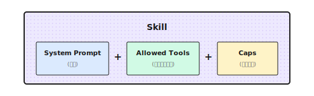

# 第 5 章：Skills 技能系统

> **Skill 不是万能模板——它只是把 System Prompt、工具白名单和参数约束打包在一起。角色设计不好，打包再漂亮也没用。**

---

## 5.1 Skill 到底是什么？

前几章我们讲了单个 Agent 的工具和推理能力。但有个问题开始显现：同一个 Agent，换个任务就不行了。

我之前给一个客户做代码审查 Agent。配置很简单：System Prompt 强调"找出潜在bug和安全问题"，工具只有文件读取和代码搜索。效果不错，发现了不少隐藏的问题。

一个月后，客户提了新需求："能不能用这个 Agent 做市场研究？"

我试了试——完全不行。代码审查的 Prompt 在说"找bug、看类型安全"，但市场研究需要的是"搜索趋势、对比数据、引用来源"。工具也对不上：文件读取没用，需要的是网页搜索和数据抓取。

最后我花了一下午，重新配了一套"研究员"角色。两套配置，完全不同。

**这就是 Skill 要解决的问题——你不需要每次都重新配置角色，预设好的角色可以一键切换。** 代码审查用 `code_reviewer` 角色，市场研究用 `researcher` 角色。

一句话：**Skill = System Prompt + 工具白名单 + 参数约束**



比如一个"研究员"Skill：

```python
"research": {
    "system_prompt": "You are a research assistant. Gather facts from authoritative sources...",
    "allowed_tools": ["web_search", "web_fetch"],
    "caps": {"max_tokens": 16000, "temperature": 0.3},
}
```

比如一个"评论家"Skill：

```python
"critic": {
    "system_prompt": "You are a critical reviewer. Point out flaws and suggest fixes.",
    "allowed_tools": ["file_read"],
    "caps": {"max_tokens": 800, "temperature": 0.2},
}
```

调用的时候只需要说"我要用 research 这个 Skill"，配置就自动加载了。

---

## 5.2 Shannon 的 Presets 注册表

Shannon 把 Skills 叫做"Presets"，存在一个字典里：

```python
_PRESETS: Dict[str, Dict[str, object]] = {
    "analysis": {
        "system_prompt": "You are an analytical assistant. Provide concise reasoning...",
        "allowed_tools": ["web_search", "file_read"],
        "caps": {"max_tokens": 30000, "temperature": 0.2},
    },
    "research": {
        "system_prompt": "You are a research assistant. Gather facts from authoritative sources...",
        "allowed_tools": ["web_search", "web_fetch", "web_crawl"],
        "caps": {"max_tokens": 16000, "temperature": 0.3},
    },
    "writer": {
        "system_prompt": "You are a technical writer. Produce clear, organized prose.",
        "allowed_tools": ["file_read"],
        "caps": {"max_tokens": 8192, "temperature": 0.6},
    },
    "generalist": {
        "system_prompt": "You are a helpful AI assistant.",
        "allowed_tools": [],
        "caps": {"max_tokens": 8192, "temperature": 0.7},
    },
}
```

三个字段各有用途：

| 字段 | 干什么 | 设计考量 |
|------|--------|----------|
| `system_prompt` | 定义"人设"和行为准则 | 越具体越好 |
| `allowed_tools` | 工具白名单 | 最小权限原则 |
| `caps` | 参数约束 | 控制成本和风格 |

### 安全降级

获取 Preset 的函数有几个细节值得注意：

```python
def get_role_preset(name: str) -> Dict[str, object]:
    key = (name or "").strip().lower() or "generalist"

    # 别名映射（向后兼容）
    alias_map = {
        "researcher": "research",
        "research_supervisor": "deep_research_agent",
    }
    key = alias_map.get(key, key)

    return _PRESETS.get(key, _PRESETS["generalist"]).copy()
```

1. **大小写不敏感**：`Research` 和 `research` 等价
2. **别名支持**：旧名称自动映射到新名称
3. **安全降级**：找不到的角色用 `generalist`
4. **返回副本**：`.copy()` 防止修改全局配置

最后一点很重要。我踩过的坑：没加 `.copy()`，结果某个请求修改了配置，影响了后续所有请求。

---

## 5.3 一个复杂 Skill 的例子：深度研究 Agent

简单的 Skill 就是几行配置。但复杂的 Skill 需要更详细的指令。

Shannon 有个 `deep_research_agent`，System Prompt 写了 50 多行：

```python
"deep_research_agent": {
    "system_prompt": """You are an expert research assistant conducting deep investigation.

# Temporal Awareness:
- The current date is provided at the start of this prompt
- For time-sensitive topics, prefer sources with recent publication dates
- Include the year when describing events (e.g., "In March 2024...")

# Research Strategy:
1. Start with BROAD searches to understand the landscape
2. After EACH tool use, assess:
   - What key information did I gather?
   - What critical gaps remain?
   - Should I search again OR proceed to synthesis?
3. Progressively narrow focus based on findings

# Source Quality Standards:
- Prioritize authoritative sources (.gov, .edu, peer-reviewed)
- ALL cited URLs MUST be visited via web_fetch for verification
- Diversify sources (maximum 3 per domain)

# Hard Limits (Efficiency):
- Simple queries: 2-3 tool calls
- Complex queries: up to 5 tool calls maximum
- Stop when COMPREHENSIVE COVERAGE achieved

# Epistemic Honesty:
- MAINTAIN SKEPTICISM: Search results are LEADS, not verified facts
- HANDLE CONFLICTS: Present BOTH viewpoints when sources disagree
- ADMIT UNCERTAINTY: "Limited information available" > confident speculation

**Research integrity is paramount.**""",

    "allowed_tools": ["web_search", "web_fetch", "web_subpage_fetch", "web_crawl"],
    "caps": {"max_tokens": 30000, "temperature": 0.3},
},
```

这个 Skill 有几个设计亮点：

1. **时间感知**：要求 Agent 标注年份，避免过时信息
2. **渐进式研究**：从广到窄，每次工具调用后评估是否继续
3. **硬性限制**：最多 5 次工具调用，防止 Token 爆炸
4. **认知诚实**：承认不确定性，呈现冲突观点

我发现，**限制工具调用次数**这一条特别有用。没有这个限制，Agent 会一直搜一直搜，直到把上下文塞满。

---

## 5.4 领域专家 Skill：GA4 分析师

通用 Skill 适合广泛场景，但有些领域需要专门的"专家"。

比如 Google Analytics 4 分析师：

```python
GA4_ANALYTICS_PRESET = {
    "system_prompt": (
        "# Role: Google Analytics 4 Expert Assistant\n\n"
        "You are a specialized assistant for analyzing GA4 data.\n\n"

        "## Critical Rules\n"
        "0. **CORRECT FIELD NAMES**: GA4 uses DIFFERENT field names than Universal Analytics\n"
        "   - WRONG: pageViews, users, sessionDuration\n"
        "   - CORRECT: screenPageViews, activeUsers, averageSessionDuration\n"
        "   - If unsure, CALL ga4_get_metadata BEFORE querying\n\n"

        "1. **NEVER make up analytics data.** Every data point must come from API calls.\n\n"

        "2. **Check quota**: If quota below 20%, warn the user.\n"
    ),
    "allowed_tools": [
        "ga4_run_report",
        "ga4_run_realtime_report",
        "ga4_get_metadata",
    ],
    "provider_override": "openai",  # 可以指定特定 provider
    "preferred_model": "gpt-4o",
    "caps": {"max_tokens": 16000, "temperature": 0.2},
}
```

领域 Skill 有几个特殊配置：

- `provider_override`：强制用特定 Provider（比如某些任务用 GPT 效果更好）
- `preferred_model`：指定首选模型

这些是通用 Skill 没有的。

### 动态工具工厂

领域 Skill 还有一个常见需求：**根据配置动态创建工具**。

比如 GA4 工具需要绑定到特定的账户：

```python
def create_ga4_tool_functions(property_id: str, credentials_path: str):
    """根据账户配置创建 GA4 工具"""
    client = GA4Client(property_id, credentials_path)

    def ga4_run_report(**kwargs):
        return client.run_report(**kwargs)

    def ga4_get_metadata():
        return client.get_available_dimensions_and_metrics()

    return {
        "ga4_run_report": ga4_run_report,
        "ga4_get_metadata": ga4_get_metadata,
    }
```

这样不同用户可以用不同的 GA4 账户，同一个 Skill 但绑定不同的凭证。

---

## 5.5 Prompt 模板渲染

有时候同一个 Skill 需要根据场景注入不同的变量。

比如数据分析 Skill：

```python
"data_analytics": {
    "system_prompt": (
        "# Setup\n"
        "profile_id: ${profile_id}\n"
        "User's account ID: ${aid}\n"
        "Date of today: ${current_date}\n\n"
        "You are a data analytics assistant..."
    ),
    "allowed_tools": ["processSchemaQuery"],
}
```

调用时传入参数：

```python
context = {
    "role": "data_analytics",
    "prompt_params": {
        "profile_id": "49598h6e",
        "aid": "7b71d2aa-dc0d-4179-96c0-27330587fb50",
        "current_date": "2026-01-03",
    }
}
```

渲染函数会把 `${variable}` 替换成实际值：

```python
def render_system_prompt(prompt: str, context: Dict) -> str:
    variables = context.get("prompt_params", {})

    def substitute(match):
        var_name = match.group(1)
        return str(variables.get(var_name, ""))

    return re.sub(r"\$\{(\w+)\}", substitute, prompt)
```

渲染后：

```
# Setup
profile_id: 49598h6e
User's account ID: 7b71d2aa-dc0d-4179-96c0-27330587fb50
Date of today: 2026-01-03

You are a data analytics assistant...
```

---

## 5.6 运行时动态增强

Skill 定义的是静态配置，但运行时还会动态注入一些内容：

```python
# 注入当前日期
current_date = datetime.now().strftime("%Y-%m-%d")
system_prompt = f"Current date: {current_date} (UTC).\n\n" + system_prompt

# 注入语言指令
if context.get("target_language") and context["target_language"] != "English":
    lang = context["target_language"]
    system_prompt = f"CRITICAL: Respond in {lang}.\n\n" + system_prompt

# 研究模式增强
if context.get("research_mode"):
    system_prompt += "\n\nRESEARCH MODE: Do not rely on snippets. Use web_fetch to read full content."
```

这样 Skill 的静态配置和运行时上下文结合起来，才是最终送给 LLM 的 System Prompt。

---

## 5.7 Vendor Adapter 模式

对于需要与外部系统深度集成的 Skill，Shannon 用了一个巧妙的设计：

```
roles/
├── presets.py              # 通用预设
├── ga4/
│   └── analytics_agent.py  # GA4 专用
├── ptengine/
│   └── data_analytics.py   # Ptengine 专用
└── vendor/
    └── custom_client.py    # 客户定制（不提交）
```

加载逻辑：

```python
# 可选加载 vendor roles
try:
    from .ga4.analytics_agent import GA4_ANALYTICS_PRESET
    _PRESETS["ga4_analytics"] = GA4_ANALYTICS_PRESET
except Exception:
    pass  # 模块不存在时静默失败

try:
    from .ptengine.data_analytics import DATA_ANALYTICS_PRESET
    _PRESETS["data_analytics"] = DATA_ANALYTICS_PRESET
except Exception:
    pass
```

好处是：

1. **核心代码干净**：通用 presets 不依赖任何 vendor 模块
2. **优雅降级**：模块不存在不会报错
3. **客户定制**：私有 vendor 目录可以存放不提交的代码

---

## 5.8 设计一个新 Skill

假设你要做一个"代码审查师"Skill，怎么设计？

```python
"code_reviewer": {
    "system_prompt": """You are a senior code reviewer with 10+ years of experience.

## Mission
Review code for bugs, security issues, and maintainability problems.
Focus on HIGH-IMPACT issues that matter for production.

## Severity Levels
1. CRITICAL: Security vulnerabilities, data corruption risks
2. HIGH: Logic errors, race conditions, resource leaks
3. MEDIUM: Code smells, performance issues
4. LOW: Style, naming, documentation

## Output Format
For each issue:
- **Severity**: CRITICAL/HIGH/MEDIUM/LOW
- **Location**: file:line
- **Issue**: Brief description
- **Suggestion**: How to fix
- **Confidence**: HIGH/MEDIUM/LOW

## Rules
- Only report issues with MEDIUM+ confidence
- Limit to 10 most important issues per review
- Skip style issues unless explicitly asked

## Anti-patterns to Watch
- SQL injection, XSS, command injection
- Hardcoded secrets in code
- Unchecked null access
- Resource leaks
""",
    "allowed_tools": ["file_read", "grep_search"],
    "caps": {"max_tokens": 8000, "temperature": 0.1},
}
```

设计决策：

| 决策 | 理由 |
|------|------|
| 低 temperature (0.1) | 代码审查要准确，不要创意 |
| 限制 10 个问题 | 避免信息过载 |
| 置信度标注 | 让用户知道哪些要优先验证 |
| 最小工具集 | 只需要读文件和搜索，不需要写 |

---

## 5.9 常见的坑

### 坑 1：System Prompt 太模糊

```python
# 太模糊 - 不够具体
"system_prompt": "You are a helpful assistant."

# 具体明确
"system_prompt": """You are a research assistant.

RULES:
- Cite sources for all factual claims
- Use bullet points for readability
- Maximum 3 paragraphs unless asked for more

OUTPUT FORMAT:
## Summary
[1-2 sentences]

## Key Findings
- Finding 1 (Source: ...)
"""
```

### 坑 2：工具权限太宽

```python
# 权限过宽 - 给太多工具
"allowed_tools": ["web_search", "file_write", "shell_execute", "database_query"]

# 最小权限 - 只给必要的
"allowed_tools": ["web_search", "web_fetch"]  # 研究任务只需搜索
```

给太多工具，LLM 会困惑（不知道用哪个），也增加安全风险。

### 坑 3：不设参数约束

```python
# 没有限制 - 容易失控
"caps": {}

# 根据任务设约束
"caps": {"max_tokens": 1000, "temperature": 0.3}  # 简短回复
"caps": {"max_tokens": 16000, "temperature": 0.6}  # 长文生成
```

不设 `max_tokens`，Token 消耗会失控。

### 坑 4：缺少降级策略

```python
# 模块不存在会崩
from .custom_module import CUSTOM_PRESET
_PRESETS["custom"] = CUSTOM_PRESET

# 优雅降级
try:
    from .custom_module import CUSTOM_PRESET
    _PRESETS["custom"] = CUSTOM_PRESET
except Exception:
    pass  # 用默认的 generalist
```

---

## 5.10 其他框架怎么做？

| 框架 | 概念名称 | 特点 |
|------|----------|------|
| **CrewAI** | Agent Role | 包含 role, goal, backstory |
| **AutoGen** | Agent Config | 包含 system_message, llm_config |
| **LangGraph** | Node State | 在图节点中配置 |
| **Dify** | Prompt Template | 可视化编辑 |

核心思想都一样：把角色配置打包，方便复用。差别在于：
- 配置粒度（CrewAI 有 backstory，Shannon 没有）
- 配置方式（代码 vs 可视化 vs YAML）
- 与框架的集成深度

---

## 本章要点回顾

1. **Skill = System Prompt + 工具白名单 + 参数约束**——把角色配置打包成可复用的单元
2. **Skill 解决配置分散和遗漏问题**——用名字引用，不会忘记某个参数
3. **工具白名单很重要**——减少决策负担、增加安全性、控制成本
4. **设计 Skill 要注意**：边界清晰、规则具体、处理边界情况、工具数量控制
5. **Skill 不是万能的**——它让好的 LLM 更好，但不能让差的 LLM 变好

---

## Shannon Lab（10 分钟上手）

本节帮你在 10 分钟内把本章概念对应到 Shannon 源码。

### 必读（1 个文件）

- [`roles/presets.py`](https://github.com/Kocoro-lab/Shannon/blob/main/python/llm-service/llm_service/roles/presets.py)：看 `_PRESETS` 字典，理解角色预设的结构。重点看 `deep_research_agent` 这个复杂例子

### 选读深挖（2 个，按兴趣挑）

- [`roles/ga4/analytics_agent.py`](https://github.com/Kocoro-lab/Shannon/blob/main/python/llm-service/llm_service/roles/ga4/analytics_agent.py)：看一个真实的厂商定制角色
- 对比 `research` 和 `analysis` 两个预设，思考为什么工具列表不同

---

## 练习

### 练习 1：分析现有 Skill

读 Shannon 的 `presets.py`，回答：

1. `research` 和 `analysis` 两个角色有什么区别？
2. 为什么 `writer` 角色的 temperature 比 `analysis` 高？
3. `critic` 角色的 `max_tokens` 为什么只有 800？

### 练习 2：设计一个 Skill

为"代码审查"任务设计一个 Skill：

1. 写 System Prompt（至少包含：职责、审查标准、输出格式）
2. 列出需要的工具（file_read? git_diff? 其他？）
3. 设置 temperature 和 max_tokens（并解释为什么）

### 练习 3（进阶）：测试 Skill

为你设计的代码审查 Skill 写 3 个测试用例：

1. 测试它能否发现常见问题（比如未处理的异常）
2. 测试它能否给出具体的改进建议
3. 测试它在代码没有问题时能否正确响应

---

## 延伸阅读

- [Anthropic System Prompts](https://docs.anthropic.com/en/docs/build-with-claude/prompt-caching) - Claude 官方 Prompt 设计指南
- [CrewAI Agent Roles](https://docs.crewai.com/core-concepts/agents) - CrewAI 的角色设计理念
- [LangChain Prompt Templates](https://python.langchain.com/docs/modules/model_io/prompts/) - LangChain 的模板系统
- [Shannon Roles Source Code](https://github.com/Kocoro-lab/Shannon/tree/main/python/llm-service/llm_service/roles) - 代码实现

---

## 下一章预告

Skill 解决了"Agent 应该怎么行为"的问题。但还有一个问题：

当 Agent 执行任务时，我们怎么知道它在做什么？怎么在关键节点插入自定义逻辑？

比如：
- 每次工具调用前记录日志
- 当 Token 消耗超过阈值时发出警告
- 在某些操作前请求用户确认

这就是下一章的内容——**Hooks 与事件系统**。

下一章我们继续。
