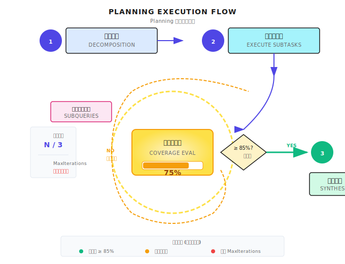

# 第 10 章：Planning 模式

> **Planning 不是"想好了再动手"，而是"边想边做、边做边评估"的持续循环——关键在于知道何时停止，而不是追求完美的计划。**

---

## 10.1 为什么需要规划？

想象这个场景：

你让一个实习生研究三家竞争对手——特斯拉、比亚迪、Rivian。你期待什么？一份结构清晰的对比报告：各家的产品线、技术特点、市场定位、优劣势分析。

但实习生给你的是：特斯拉的 Wikipedia 摘要 + 比亚迪的新闻剪报 + Rivian 的官网复制粘贴。信息是有了，但完全没有结构，无法对比，更谈不上洞察。

**问题出在哪？他没有规划。** 他直接开始搜索、复制、整理，但没想过"我要回答什么问题"、"应该按什么结构组织"、"哪些信息重要哪些不重要"。

Agent 也会犯同样的错误。如果你直接让它"研究 OpenAI 写一份竞争分析报告"，它会立即开始搜索、提取、生成——但往往会产出一堆信息堆砌，缺乏结构和深度。

这就是 Planning 要解决的问题。

### 复杂任务的特征

### 直觉解释

你去装修房子，你不会上来就开始刷墙。你会先想：

1. 水电要改吗？
2. 墙面要不要拆？
3. 地板什么时候铺？
4. 家具什么时候进场？

然后你会发现：有些事情必须先做（水电），有些事情可以并行（吊顶和刷墙），有些事情必须最后做（家具）。

**这就是 Planning。**

Agent 也是一样。面对一个复杂任务，它需要：

1. **拆解**：把大任务拆成小任务
2. **排序**：哪个先做哪个后做
3. **评估**：做完够不够，要不要继续

### 没有规划会怎样？

看这个请求："研究 OpenAI，写一份完整的竞争分析报告"

如果直接让 LLM 处理：

| 问题 | 表现 | 后果 |
|------|------|------|
| **信息量太大** | 一次性塞进上下文 | 超出上下文窗口，信息丢失 |
| **没有结构** | 东一榔头西一棒槌 | 输出杂乱无章 |
| **无法追踪** | 用户干等，不知道进度 | 体验差，无法中途调整 |
| **重复劳动** | 同一个信息搜索多次 | 浪费 Token |

### 有规划会怎样？

```
1. 公司基本信息（成立时间、创始人、融资）
2. 产品矩阵（GPT、API、ChatGPT）
3. 技术创新（Transformer、RLHF）
4. 竞争对手分析（Google、Meta）
5. 市场定位与战略
6. 综合报告生成
```

每个子任务独立可控。第一个做完了，存起来。第二个做完了，存起来。最后综合。

中间某一步出问题了？只重做那一步，不用从头来。

---

## 10.2 Planning 的三个核心问题

Planning 模式回答三个问题：

| 问题 | 核心挑战 | 生产考量 |
|------|----------|----------|
| **如何分解？** | 把模糊需求变成具体子任务 | 分解粒度、范围边界 |
| **如何执行？** | 确定依赖关系和执行顺序 | 并行 vs 串行、失败重试 |
| **何时停止？** | 评估当前进度，决定继续还是结束 | 覆盖度阈值、最大迭代 |

第三个问题最容易被忽视，但在生产环境里最重要。

我见过太多 Agent 在这里翻车——不知道什么时候该停，结果陷入无限循环，把 Token 烧光了，还没产出有用的东西。

---

## 10.3 任务分解

### 分解的输入输出

任务分解是 Planning 的第一步。在 Shannon 里，它通过 LLM Service 完成：

```go
// 分解请求的输入
type DecompositionInput struct {
    Query          string                 // 用户的原始请求
    Context        map[string]interface{} // 上下文信息
    AvailableTools []string               // 可用工具列表
}

// 分解的结果
type DecompositionResult struct {
    Mode              string    // "simple", "standard", "complex"
    ComplexityScore   float64   // 0.0 - 1.0
    Subtasks          []Subtask // 子任务列表
    ExecutionStrategy string    // "parallel", "sequential", "dag"
}
```

LLM 看完请求后会告诉你：
- 这个任务有多复杂（0-1 分）
- 应该拆成几个子任务
- 子任务之间的执行策略

**实现参考 (Shannon)**: [`activities/decompose.go`](https://github.com/Kocoro-lab/Shannon/blob/main/go/orchestrator/internal/activities/decompose.go) - DecomposeTask 函数

### 子任务结构

每个子任务不只是一句话描述，要带完整的执行约束：

```go
type Subtask struct {
    ID              string
    Description     string
    Dependencies    []string  // 依赖的其他子任务 ID

    // 输入输出声明
    Produces []string  // 这个子任务产生什么
    Consumes []string  // 这个子任务需要什么

    // 执行约束
    SuggestedTools   []string
    SuggestedPersona string

    // 范围边界
    Boundaries *BoundariesSpec
}
```

这个结构设计得相当精细。我来解释几个关键字段：

**Produces/Consumes：声明依赖**

```
Subtask 1: "收集公司基本信息"
  - Produces: ["company_info", "founding_date"]
  - Dependencies: []

Subtask 2: "分析产品矩阵"
  - Consumes: ["company_info"]
  - Produces: ["products", "pricing"]
  - Dependencies: ["subtask-1"]

Subtask 3: "竞争对手分析"
  - Consumes: ["company_info", "products"]
  - Dependencies: ["subtask-1", "subtask-2"]
```

执行时按拓扑排序：subtask-1 完成后，subtask-2 才能开始（因为它需要 company_info）。

**Boundaries：声明范围**

这是为了防止子任务之间重叠：

```go
// 研究产品
subtask1 := Subtask{
    Description: "研究公司产品",
    Boundaries: &BoundariesSpec{
        InScope:    []string{"software products", "pricing"},
        OutOfScope: []string{"professional services"},
    },
}

// 研究服务
subtask2 := Subtask{
    Description: "分析专业服务",
    Boundaries: &BoundariesSpec{
        InScope:    []string{"consulting", "implementation"},
        OutOfScope: []string{"software products"},
    },
}
```

没有边界声明，两个子任务可能都去研究"产品和服务"，重复劳动。

---

## 10.4 执行策略

分解完任务后，需要决定怎么执行。Shannon 支持三种策略：

| 策略 | 适用场景 | 特点 |
|------|----------|------|
| **parallel** | 子任务互不依赖 | 最快，同时执行 |
| **sequential** | 子任务有严格顺序 | 最稳，但最慢 |
| **dag** | 子任务有部分依赖 | 灵活，按拓扑排序 |

### 怎么选？

```go
// 检测是否有依赖
hasDependencies := false
for _, subtask := range decomp.Subtasks {
    if len(subtask.Dependencies) > 0 {
        hasDependencies = true
        break
    }
}

// 有依赖用 hybrid（DAG），没依赖用 parallel
if hasDependencies {
    executeHybridPattern(...)
} else {
    executeParallelPattern(...)
}
```

**实现参考 (Shannon)**: [`strategies/dag.go`](https://github.com/Kocoro-lab/Shannon/blob/main/go/orchestrator/internal/workflows/strategies/dag.go) - DAGWorkflow 函数

### 拓扑排序

当子任务有依赖时，需要按拓扑顺序执行：

```
A (无依赖)
    ↓
B (依赖 A)    C (依赖 A)
    ↓           ↓
       D (依赖 B, C)
```

执行顺序：A → [B, C 并行] → D

这不是 LLM 特有的问题，这是标准的图论算法。但 Agent 系统里经常被忽略，导致执行顺序混乱。

---

## 10.5 覆盖度评估

这是 Planning 模式最关键的部分。

Planning 不是一次性的。执行完子任务后，你需要问：**够不够？需不需要继续？**

```
初始分解
    │
    ▼
执行子任务 ───► 评估覆盖度 ───► 覆盖度 ≥ 85%? ───► 完成
    ▲                              │
    │                  否          │
    └──────── 生成补充查询 ◄────────┘
```



### 评估结构

```go
type CoverageEvaluationInput struct {
    Query            string
    CurrentSynthesis string  // 当前综合结果
    CoveredAreas     []string
    Iteration        int
    MaxIterations    int
}

type CoverageEvaluationResult struct {
    OverallCoverage   float64         // 0.0 - 1.0
    CriticalGaps      []CoverageGap   // 必须填补的缺口
    OptionalGaps      []CoverageGap   // 可选的改进点
    ShouldContinue    bool
    RecommendedAction string          // "continue", "complete"
}
```

### 确定性护栏

这是我特别想强调的一点：**LLM 的判断不稳定，必须用规则覆盖。**

```go
func EvaluateCoverage(ctx context.Context, input Input) (*Result, error) {
    // LLM 评估
    result := llmEvaluate(input)

    // === 确定性护栏 ===

    // 规则 1: 第一次迭代 + 低覆盖度 → 必须继续
    if input.Iteration == 1 && result.OverallCoverage < 0.5 {
        result.ShouldContinue = true
        result.RecommendedAction = "continue"
    }

    // 规则 2: 存在关键缺口 + 还有次数 → 必须继续
    if len(result.CriticalGaps) > 0 && input.Iteration < input.MaxIterations {
        result.ShouldContinue = true
    }

    // 规则 3: 达到最大迭代次数 → 必须停止
    if input.Iteration >= input.MaxIterations {
        result.ShouldContinue = false
        result.RecommendedAction = "complete"
    }

    // 规则 4: 综合结果太短但声称高覆盖度 → 不可信
    if len(input.CurrentSynthesis) < 500 && result.OverallCoverage > 0.7 {
        result.ConfidenceLevel = "low"
    }

    return result, nil
}
```

为什么需要这些护栏？

- LLM 可能说"覆盖度 95%"，但综合结果只有 200 字。规则 4 会标记"不可信"。
- LLM 可能说"可以结束了"，但还有关键缺口。规则 2 会强制继续。
- LLM 可能一直说"还需要继续"，无限循环。规则 3 会强制停止。

**护栏保证行为可预测。**

---

## 10.6 补充查询生成

当评估发现缺口，需要生成针对性的补充查询：

```go
type GeneratedSubquery struct {
    ID             string
    Query          string
    TargetGap      string   // 针对哪个缺口
    Priority       string   // "high", "medium", "low"
    SuggestedTools []string
}
```

生成时的 Prompt 要引导 LLM：

```
你是一个研究查询生成器。任务是生成针对性的子查询来填补覆盖缺口。

## 目标：
1. 生成直接解决覆盖缺口的查询
2. 优先处理 CRITICAL 缺口
3. 避免生成重复或重叠的查询

## 备选搜索策略（重要！）

当标准搜索找不到信息时，尝试：
1. 直接访问公司域名（web_fetch）
2. 用日语/本地语言搜索亚洲公司
3. 搜索 LinkedIn/Crunchbase
```

关键是**多语言感知**。研究日本公司时，用日语搜索效果更好。这是很多 Agent 系统忽略的细节。

---

## 10.7 完整流程

把前面的组件串起来：

```go
const MaxIterations = 3

func Research(ctx context.Context, query string) (string, error) {
    // 1. 初始分解
    decomposition := DecomposeTask(ctx, DecompositionInput{
        Query:          query,
        AvailableTools: []string{"web_search", "web_fetch"},
    })

    fmt.Printf("分解为 %d 个子任务，策略: %s\n",
        len(decomposition.Subtasks), decomposition.ExecutionStrategy)

    // 2. 执行子任务（按拓扑顺序）
    var results []Result
    for _, subtask := range topologicalSort(decomposition.Subtasks) {
        result := executeSubtask(ctx, subtask)
        results = append(results, result)
    }

    // 3. 综合初始结果
    synthesis := synthesize(ctx, query, results)

    // 4. 迭代改进循环
    for iteration := 1; iteration <= MaxIterations; iteration++ {
        // 评估覆盖度
        coverage := EvaluateCoverage(ctx, CoverageEvaluationInput{
            Query:            query,
            CurrentSynthesis: synthesis,
            Iteration:        iteration,
            MaxIterations:    MaxIterations,
        })

        fmt.Printf("迭代 %d: 覆盖度 %.0f%%, 继续: %v\n",
            iteration, coverage.OverallCoverage*100, coverage.ShouldContinue)

        if !coverage.ShouldContinue {
            break
        }

        // 生成补充查询
        subqueries := GenerateSubqueries(ctx, SubqueryGeneratorInput{
            Query:         query,
            CoverageGaps:  coverage.CriticalGaps,
            MaxSubqueries: 3,
        })

        // 执行补充查询
        for _, sq := range subqueries {
            result := executeSubquery(ctx, sq)
            results = append(results, result)
        }

        // 重新综合
        synthesis = synthesize(ctx, query, results)
    }

    return synthesis, nil
}
```

输出示例：

```
分解为 5 个子任务，策略: sequential
迭代 1: 覆盖度 60%, 继续: true
迭代 2: 覆盖度 82%, 继续: true
迭代 3: 覆盖度 91%, 继续: false
研究完成
```

---

## 10.8 常见的坑

### 坑 1：过度分解

**症状**：分解出 20+ 个子任务，每个都很小。

**问题**：协调成本比执行成本还高。每个子任务都要调用 LLM，都要等待，都可能失败。

```go
// 分解太细
subtasks := []Subtask{
    {Description: "搜索公司名称"},
    {Description: "打开官网"},
    {Description: "找 About 页面"},
    {Description: "读创始人信息"},
    // ... 100 个子任务
}

// 适度粒度
subtasks := []Subtask{
    {Description: "收集公司基本信息（创始人、成立时间、总部）"},
    {Description: "分析产品和服务"},
    {Description: "研究融资历史"},
}
```

**经验法则**：一个研究任务，3-7 个子任务就够了。

### 坑 2：范围重叠

**症状**：不同子任务产生重复内容。

**问题**：浪费 Token，综合时还要去重。

```go
// 范围模糊
subtask1 := Subtask{Description: "研究公司产品"}
subtask2 := Subtask{Description: "分析公司服务"}
// "产品"和"服务"可能重叠

// 明确边界
subtask1 := Subtask{
    Description: "研究公司产品",
    Boundaries: &BoundariesSpec{
        InScope:    []string{"software products"},
        OutOfScope: []string{"professional services"},
    },
}
```

### 坑 3：无限迭代

**症状**：迭代 10 次还没停，Token 烧光了。

**问题**：LLM 总觉得"还可以更好"，永远达不到 100%。

```go
// 没有终止条件
for {
    coverage := evaluateCoverage()
    if coverage.OverallCoverage < 1.0 {
        // 永远不会 100%
        generateMoreQueries()
    }
}

// 多重终止条件
for iteration := 1; iteration <= MaxIterations; iteration++ {
    coverage := evaluateCoverage()

    if coverage.OverallCoverage >= 0.85 && len(coverage.CriticalGaps) == 0 {
        break  // 质量达标
    }
    if iteration >= MaxIterations {
        break  // 预算耗尽
    }
}
```

### 坑 4：忽略依赖顺序

**症状**：子任务 B 需要子任务 A 的输出，但 B 先执行了，拿到的是空数据。

```go
// 并行执行有依赖的任务（会失败）
go execute(subtask1)  // 产生 company_info
go execute(subtask2)  // 消费 company_info（会失败！）

// 拓扑排序后执行
ordered := topologicalSort(subtasks)
for _, subtask := range ordered {
    execute(subtask)
}
```

---

## 10.9 什么时候用 Planning？

不是所有任务都需要规划。

| 任务类型 | 用 Planning？ | 原因 |
|----------|-------------|------|
| "今天天气怎么样" | 否 | 直接查就行 |
| "帮我写个函数" | 否 | ReAct 就够 |
| "研究这家公司写报告" | 是 | 需要分解 |
| "分析这个代码库的架构" | 是 | 需要分解 |
| "对比这三个方案的优劣" | 是 | 需要分解 |

**经验法则**：

- 单步能完成的 → 不需要
- 需要多次搜索/分析的 → 需要
- 输出要有结构的 → 需要
- 涉及多个维度的 → 需要

还有一个更简单的判断：

> 如果你让一个实习生做这件事，你会不会先跟他列个大纲？如果会，那 Agent 也需要 Planning。

---

## 10.10 其他框架怎么做？

Planning 是通用模式，不是 Shannon 专属。各家都有实现：

| 框架 | 实现方式 | 特点 |
|------|----------|------|
| **LangGraph** | Plan-and-Execute 节点 | 可视化，流程可控 |
| **AutoGPT** | Task Queue | 高度自主，但不稳定 |
| **CrewAI** | Task 分配 | 偏向团队协作隐喻 |
| **OpenAI Assistants** | 内置 Planning（有限） | 黑盒，不可控 |

核心逻辑都一样：分解 → 执行 → 评估 → 迭代。

差别在于：
- 分解的粒度和控制
- 迭代的触发条件
- 护栏的实现方式

---

## 划重点

1. **Planning 核心**：复杂任务先分解，再执行，边做边评估
2. **任务分解**：声明 Produces/Consumes 建立依赖，声明 Boundaries 防止重叠
3. **执行策略**：无依赖用 parallel，有依赖用 DAG（拓扑排序）
4. **覆盖度评估**：LLM 判断 + 确定性护栏，双保险
5. **终止条件**：质量达标、预算耗尽、最大迭代——三选一触发停止

---

## Shannon Lab（10 分钟上手）

本节帮你在 10 分钟内把本章概念对应到 Shannon 源码。

### 必读（1 个文件）

- [`strategies/dag.go`](https://github.com/Kocoro-lab/Shannon/blob/main/go/orchestrator/internal/workflows/strategies/dag.go)：找 `DAGWorkflow` 函数，看它怎么调用 `DecomposeTask` 分解任务、根据 `hasDependencies` 选择执行策略、最后调用 `ReflectOnResult` 做质量评估

### 选读深挖（2 个，按兴趣挑）

- [`activities/decompose.go`](https://github.com/Kocoro-lab/Shannon/blob/main/go/orchestrator/internal/activities/decompose.go)：看 `DecompositionResult` 结构，理解 LLM Service 返回什么
- [`activities/types.go`](https://github.com/Kocoro-lab/Shannon/blob/main/go/orchestrator/internal/activities/types.go)：看 `Subtask` 结构，理解 Produces/Consumes/Boundaries 怎么用

---

## 练习

### 练习 1：设计分解

把"帮我研究 Anthropic，写一份 2000 字的公司分析"这个任务手动分解：

- 列出 4-6 个子任务
- 标注每个子任务的 Produces 和 Consumes
- 画出依赖图（谁依赖谁）
- 决定用 parallel 还是 sequential

### 练习 2：源码阅读

读 `strategies/dag.go` 里的 `executeHybridPattern` 函数：

1. 它怎么处理有依赖的任务？
2. `DependencyWaitTimeout` 是干什么的？
3. 如果一个依赖任务失败了，后续任务会怎样？

### 练习 3（进阶）：设计护栏

设计一个"Token 预算耗尽"的终止条件：

- 写出判断逻辑的伪代码
- 思考：这个条件应该在循环的什么位置检查？
- 思考：预算耗尽时，应该返回已有结果还是报错？

---

## 延伸阅读

- [Task Decomposition in LLM Agents](https://www.promptingguide.ai/techniques/decomposition) - 任务分解的各种技术
- [Topological Sort Algorithm](https://en.wikipedia.org/wiki/Topological_sorting) - 依赖排序的算法基础
- [MECE Framework](https://www.mckinsey.com/capabilities/strategy-and-corporate-finance/our-insights/mece) - 咨询公司的分解原则，对 Agent 也适用

---

## 下一章预告

到这里，Agent 已经会规划、会执行了。但有个问题：它怎么知道自己做得好不好？

一个不会反思的 Agent，就像一个从不检查代码的程序员——早晚要出事。

下一章我们来聊 **Reflection 模式**：怎么让 Agent 学会自我审视，评估输出质量，不达标就带反馈重试。

第 11 章见。
