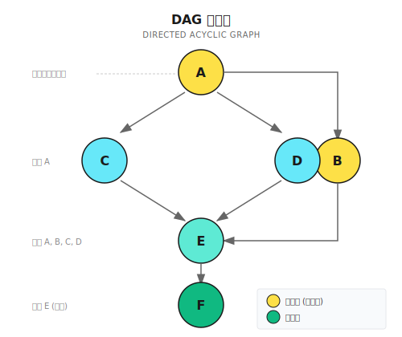
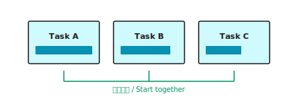
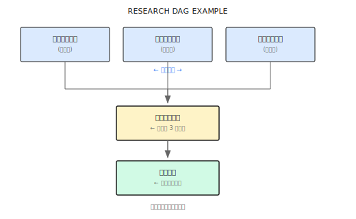

# 第 14 章：DAG 工作流

> **DAG 工作流的本质是依赖图——告诉编排器哪些任务可以同时做，哪些必须等。但图画得再漂亮，执行引擎不靠谱也白搭。**

---

> **⏱️ 快速通道**（5 分钟掌握核心）
>
> 1. DAG = 有向无环图，用依赖关系建模任务执行顺序
> 2. 三种模式：Parallel（独立）、Sequential（链式）、Hybrid（复杂依赖）
> 3. Temporal 单线程模型下不需要锁，但必须用确定性 API
> 4. 依赖等待用增量超时检查，不死等整个超时时间
> 5. 简单并行任务用 DAG 就够，超过 5 个子任务考虑 Supervisor
>
> **10 分钟路径**：14.1-14.2 → 14.4 → Shannon Lab

---

## 14.1 问题在哪？

想象这个场景：

你在做一份财务分析报告，需要三部分数据：收入趋势、成本结构、利润率变化。

如果你一个人做，你会：先查收入数据、整理、分析，花 30 分钟。再查成本数据，又 30 分钟。最后查利润率，再 30 分钟。总共 90 分钟。

但如果你有三个助手，可以同时开工：Alice 查收入，Bob 查成本，Carol 查利润率。30 分钟后，三份数据同时到手，你只需要综合分析。

效率提升 3 倍。

**DAG 工作流的核心价值就在这里——让 Agent 知道哪些任务可以并行、哪些必须等待，从而最大化执行效率。**

但问题来了：如果后续任务依赖前序结果怎么办？比如"计算利润率"必须等"收入"和"成本"都查完才能开始。这就需要依赖管理——DAG（有向无环图）正是用来表达这种依赖关系的。

### 一个真实的复杂任务

看一个真实的研究任务：

```
用户：分析特斯拉 2024 年的财务表现，包括收入增长、利润率变化、以及与竞争对手的对比
```

这个任务可以拆成：

```
Task A: 获取特斯拉财报数据
Task B: 获取竞争对手财报数据
Task C: 计算特斯拉收入增长率    ← 依赖 A
Task D: 计算利润率变化趋势      ← 依赖 A
Task E: 竞争对手对比分析        ← 依赖 A, B, C, D
Task F: 生成综合报告            ← 依赖 E
```

关键观察：

- **A 和 B 可以并行**——它们互不相关
- **C 和 D 也可以并行**——都依赖 A，但彼此独立
- **E 必须等**——要等 A、B、C、D 全部完成
- **F 是最后一步**——依赖 E 的结果

这种复杂的依赖关系，用简单的串行或并行都搞不定。需要 DAG。

### 三种执行方式对比

| 特性 | 纯串行 | 纯并行 | DAG |
|------|--------|--------|-----|
| 依赖管理 | 天然顺序 | 没法处理 | 显式依赖图 |
| 执行效率 | 最慢 | 快但可能乱 | 智能并行 |
| 资源控制 | 可预测 | 容易爆 | 可控 |
| 结果传递 | 简单 | 难协调 | 依赖注入 |
| 复杂度 | 低 | 中 | 较高 |

> **注意**：DAG 不是万能的。如果你的任务就是「搜三个公司」然后「综合」，用简单的「先并行再串行」就够了，没必要画一张 DAG。只有当依赖关系真的复杂——多层嵌套、部分并行部分串行——DAG 才有价值。过度设计的 DAG 比没有 DAG 更糟糕。

---

## 14.2 DAG 是什么？

DAG = Directed Acyclic Graph，有向无环图。

**有向**：边有方向，表示依赖关系（A → C 表示 C 依赖 A）

**无环**：不能有循环依赖（A 依赖 B，B 依赖 C，C 又依赖 A——这是死锁）

画出来长这样：



### 为什么叫「无环」？

看个错误示例：

```
A → B → C → A  (循环！)
```

A 等 C，C 等 B，B 等 A——三个任务互相等，谁都不能开始。

这叫**死锁**。DAG 的「无环」约束就是为了避免这种情况。

### Subtask 数据结构与依赖声明

每个子任务需要这些信息：

```go
type Subtask struct {
    ID           string
    Description  string
    Dependencies []string  // 方式一：任务依赖（显式声明「我要等谁完成」）
    Produces     []string  // 产出什么数据
    Consumes     []string  // 方式二：数据依赖（「我需要这个数据」，编排器自动找生产者）
    SuggestedTools []string
}

// 示例对比：
// 任务依赖：{"id": "calc_growth", "dependencies": ["fetch_data"]}
// 数据依赖：{"id": "calc_growth", "consumes": ["financial_data"]}
// 数据依赖更灵活——你不需要知道是哪个任务产出的
```

**实现参考 (Shannon)**: [`go/orchestrator/internal/workflows/strategies/dag.go`](https://github.com/Kocoro-lab/Shannon/blob/main/go/orchestrator/internal/workflows/strategies/dag.go) - Subtask 结构体定义

---

## 14.3 执行流程

DAGWorkflow 的执行分六步：

```
Step 1: 任务分解
        └─► LLM 分析任务，生成子任务列表和依赖关系

Step 2: 特征检查
        └─► 有工具？有依赖？复杂度多少？

Step 3: 策略选择
        ├─► 简单任务（单步、无工具）→ SimpleTask
        ├─► 有依赖 → Hybrid 模式
        ├─► 无依赖 + LLM 建议串行 → Sequential
        └─► 无依赖 + 默认 → Parallel

Step 4: 执行
        └─► 按策略调度 Agent

Step 5: 综合
        └─► LLM 整合所有结果

Step 6: 可选反思
        └─► 质量评估（如果配置开启）
```

### 核心代码逻辑

```go
func DAGWorkflow(ctx workflow.Context, input TaskInput) (TaskResult, error) {
    // 1. 任务分解（可能来自上游，也可能现场做）
    var decomp DecompositionResult
    if input.PreplannedDecomposition != nil {
        decomp = *input.PreplannedDecomposition
    } else {
        err = workflow.ExecuteActivity(ctx, DecomposeTaskActivity, ...).Get(ctx, &decomp)
    }

    // 2. 检查是否有依赖
    hasDependencies := false
    for _, subtask := range decomp.Subtasks {
        if len(subtask.Dependencies) > 0 || len(subtask.Consumes) > 0 {
            hasDependencies = true
            break
        }
    }

    // 3. 选择执行策略
    execStrategy := decomp.ExecutionStrategy
    if execStrategy == "" {
        execStrategy = "parallel"  // 默认并行
    }

    // 4. 根据策略执行
    var agentResults []AgentExecutionResult
    if hasDependencies {
        agentResults = executeHybridPattern(ctx, decomp.Subtasks, ...)
    } else if execStrategy == "sequential" {
        agentResults = executeSequentialPattern(ctx, decomp.Subtasks, ...)
    } else {
        agentResults = executeParallelPattern(ctx, decomp.Subtasks, ...)
    }

    // 5. 综合结果
    synthesis := synthesizeResults(ctx, agentResults, input.Query)

    return TaskResult{Result: synthesis, Success: true}, nil
}
```

**实现参考 (Shannon)**: [`go/orchestrator/internal/workflows/strategies/dag.go`](https://github.com/Kocoro-lab/Shannon/blob/main/go/orchestrator/internal/workflows/strategies/dag.go) - DAGWorkflow 函数

---

## 14.4 三种执行模式详解

### 模式一：并行执行（Parallel）

适用场景：子任务完全独立，没有依赖。



核心是**信号量控制**——限制同时执行的 Agent 数量：

```go
func ExecuteParallel(ctx workflow.Context, tasks []ParallelTask, config ParallelConfig) (*ParallelResult, error) {
    // 创建信号量控制并发（默认 MaxConcurrency=5）
    semaphore := workflow.NewSemaphore(ctx, int64(config.MaxConcurrency))
    futuresChan := workflow.NewChannel(ctx)

    for i, task := range tasks {
        i, task := i, task
        workflow.Go(ctx, func(ctx workflow.Context) {
            semaphore.Acquire(ctx, 1)  // 获取信号量（超过并发数会阻塞）
            future := workflow.ExecuteActivity(ctx, ExecuteAgent, task)
            futuresChan.Send(ctx, futureWithIndex{Index: i, Future: future})
            semaphore.Release(1)       // 释放信号量，让等待的任务补位
        })
    }
    // 收集结果...
}
// 时序示例（MaxConcurrency=3）：
// t0: [Task 1] [Task 2] [Task 3] ← 3 个同时开始
// t1: [1 done] [Task 4 starts]   ← 1 完成，4 立即补位
```

**实现参考 (Shannon)**: [`parallel.go`](https://github.com/Kocoro-lab/Shannon/blob/main/go/orchestrator/internal/workflows/patterns/execution/parallel.go)

如果不限制并发，10 个任务同时启动，LLM 服务可能触发限流（429）、响应变慢或 OOM。

### 模式二：串行执行（Sequential）

适用场景：任务有隐式依赖，后面的需要前面的结果。

```
Task 1 ──► Task 2 ──► Task 3 ──► Task 4
  │          ↑
  └──────────┘ 结果传递
```

```go
func ExecuteSequential(ctx workflow.Context, tasks []Task, config SequentialConfig) []Result {
    var results []Result
    for _, task := range tasks {
        if config.PassPreviousResults && len(results) > 0 {
            // 把前序结果注入当前任务的上下文
            task.Context["previous_results"] = buildPreviousResults(results)
            // Agent B 收到：{"previous_results": {"task_1": {"response": "...", "numeric_value": 1234}}}
            // 可直接用 numeric_value 做计算，不需要再解析文本
        }
        results = append(results, executeTask(ctx, task))
    }
    return results
}
```

### 模式三：混合执行（Hybrid）

适用场景：有显式依赖，但无依赖的任务可以并行。

这是最复杂的模式。核心是**依赖等待**：

```go
func ExecuteHybrid(ctx workflow.Context, tasks []HybridTask, config HybridConfig) (*HybridResult, error) {
    completedTasks := make(map[string]bool)      // Temporal 单线程模型下安全，无需锁
    taskResults := make(map[string]AgentExecutionResult)
    semaphore := workflow.NewSemaphore(ctx, int64(config.MaxConcurrency))

    for i := range tasks {
        task := tasks[i]
        workflow.Go(ctx, func(ctx workflow.Context) {
            // 等待依赖完成
            waitForDependencies(ctx, task.Dependencies, completedTasks, config.DependencyWaitTimeout)
            semaphore.Acquire(ctx, 1)
            result := executeTask(ctx, task)
            completedTasks[task.ID] = true
            taskResults[task.ID] = result
            semaphore.Release(1)
        })
    }
    // 收集结果...
}

func waitForDependencies(ctx workflow.Context, deps []string, completed map[string]bool, timeout time.Duration) bool {
    deadline := workflow.Now(ctx).Add(timeout)
    checkInterval := 30 * time.Second  // 增量检查而非死等，用户体验更好
    for workflow.Now(ctx).Before(deadline) {
        ok, _ := workflow.AwaitWithTimeout(ctx, checkInterval, func() bool {
            for _, depID := range deps {
                if !completed[depID] { return false }
            }
            return true
        })
        if ok { return true }
    }
    return false  // 超时
}
```

**实现参考 (Shannon)**: [`hybrid.go`](https://github.com/Kocoro-lab/Shannon/blob/main/go/orchestrator/internal/workflows/patterns/execution/hybrid.go)

**为什么用增量检查（30s）而不是死等（6min）**：用户看到「等待 30 秒」比「等待 6 分钟」更友好；依赖 10 秒完成时，30 秒后就能开始。

**执行时序示例**：

```
假设：A、B 无依赖，C 依赖 A，D 依赖 A+B，E 依赖 C+D

t0s:   [A starts] [B starts]      ← A、B 同时并行启动
t10s:  [A done]                   ← A 完成
t11s:  [C starts]                 ← C 的依赖满足，立即启动
t15s:  [B done]                   ← B 完成
t16s:  [D starts]                 ← D 的依赖（A+B）都满足了
t20s:  [C done]                   ← C 完成
t25s:  [D done]                   ← D 完成
t26s:  [E starts]                 ← E 的依赖（C+D）都满足了
t35s:  [E done]                   ← 全部完成

总耗时：35 秒
串行耗时：10+5+10+10+9 = 44 秒
节省：20%+
```

---

## 14.5 Temporal 的单线程模型

Temporal 工作流运行在**单线程、确定性**的事件循环中：

```go
// 在 Temporal 工作流里，并发写 map 是安全的（协程协作式调度，不需要 sync.Mutex）
completedTasks := make(map[string]bool)
for i := range tasks {
    workflow.Go(ctx, func(ctx workflow.Context) {
        completedTasks[task.ID] = true  // 看起来并发，但实际单线程安全
    })
}

// ========== 确定性规则（必须遵守）==========
// 正确                                      // 错误（破坏确定性，重放失败）
workflow.Now(ctx)                            // time.Now()
workflow.NewTimer(ctx, 30*time.Second)       // time.Sleep(30*time.Second)
workflow.SideEffect(ctx, func(ctx workflow.Context) interface{} { return rand.Intn(100) })  // rand.Intn(100)
```

**为什么要确定性**：工作流崩溃后，Temporal 从事件历史重放。如果用 `time.Now()`，重放时得到不同时间，状态不一致。

---

## 14.6 策略选择逻辑

编排器怎么决定用哪种模式？

```go
func selectExecutionStrategy(decomp DecompositionResult) string {
    // 1. 检查是否有显式依赖
    hasDependencies := false
    for _, st := range decomp.Subtasks {
        if len(st.Dependencies) > 0 || len(st.Consumes) > 0 {
            hasDependencies = true
            break
        }
    }

    // 2. 有依赖 → Hybrid
    if hasDependencies {
        return "hybrid"
    }

    // 3. LLM 建议了策略？尊重它
    if decomp.ExecutionStrategy == "sequential" {
        return "sequential"
    }

    // 4. 默认 → Parallel
    return "parallel"
}
```

### 什么时候 LLM 会建议串行？

任务分解 prompt 会让 LLM 判断：

```
请分析这个任务的子任务之间是否有顺序依赖：
- 如果后面的任务需要前面的结果才能执行 → 选 sequential
- 如果任务之间完全独立 → 选 parallel
- 如果部分独立、部分依赖 → 在 dependencies 字段声明依赖
```

例如：

```
任务："先搜索特斯拉股价，然后计算相比昨天的涨幅"
LLM 判断：第二步需要第一步的结果 → sequential

任务："搜索特斯拉、BYD、Rivian 的股价"
LLM 判断：三个搜索完全独立 → parallel

任务："搜索三家公司股价，然后做对比分析"
LLM 判断：搜索独立，对比依赖搜索结果 → hybrid
```

### 配置项

```go
type WorkflowConfig struct {
    ParallelMaxConcurrency  int   // 并行最大并发，默认 5
    HybridDependencyTimeout int   // 依赖等待超时（秒），默认 360
    SequentialPassResults   bool  // 串行是否传结果，默认 true
}
```

---

## 14.7 实战：Research Agent v0.5

把前几章的 Research Agent 升级到 DAG 工作流版本：

```
用户：研究 2024 年 AI Agent 领域的主要进展
```

### 任务分解

LLM 分解后的结构：



执行策略：Hybrid

### 任务分解 JSON

```json
{
  "execution_strategy": "hybrid",
  "subtasks": [
    {
      "id": "academic_search",
      "description": "搜索 2024 年 AI Agent 相关顶会论文（NeurIPS、ICML、ACL 等）",
      "suggested_tools": ["web_search"],
      "dependencies": [],
      "produces": ["academic_findings"]
    },
    {
      "id": "product_search",
      "description": "追踪 2024 年主要 AI Agent 产品发布（Claude、GPT、Gemini 等）",
      "suggested_tools": ["web_search"],
      "dependencies": [],
      "produces": ["product_findings"]
    },
    {
      "id": "opensource_search",
      "description": "调研 2024 年热门 AI Agent 开源项目（LangChain、AutoGen、CrewAI 等）",
      "suggested_tools": ["web_search"],
      "dependencies": [],
      "produces": ["opensource_findings"]
    },
    {
      "id": "trend_analysis",
      "description": "综合分析 AI Agent 发展趋势",
      "dependencies": ["academic_search", "product_search", "opensource_search"],
      "consumes": ["academic_findings", "product_findings", "opensource_findings"],
      "produces": ["trend_analysis"]
    },
    {
      "id": "report_generation",
      "description": "生成综合研究报告",
      "dependencies": ["trend_analysis"],
      "consumes": ["trend_analysis"]
    }
  ]
}
```

### 执行时序

```
t=0s:   编排器启动
        ├── 解析任务分解结果
        ├── 检测到依赖关系 → 选择 Hybrid 模式
        └── 启动 5 个任务执行器

t=1s:   3 个搜索任务并行启动
        ├── academic_search:  搜索中...
        ├── product_search:   搜索中...
        └── opensource_search: 搜索中...
        (trend_analysis 和 report_generation 等待依赖)

t=12s:  opensource_search 完成（内容少）
t=15s:  product_search 完成
t=18s:  academic_search 完成（论文多）

t=19s:  trend_analysis 启动
        ├── 依赖全部满足
        └── 上下文包含 3 个搜索结果

t=28s:  trend_analysis 完成

t=29s:  report_generation 启动
        └── 上下文包含趋势分析结果

t=38s:  report_generation 完成
        └── 返回最终报告
```

**总耗时**：约 38 秒

**如果串行执行**：12 + 15 + 18 + 9 + 9 = 63 秒

**节省**：约 40%

---

## 14.8 常见的坑

| 坑 | 问题描述 | 解决方案 |
|----|---------|----------|
| 循环依赖 | A→B→C→A，死锁 | 用 Kahn 算法检测环 |
| 依赖超时 | 60s 超时，但任务要 2min | 设合理超时（默认 6min） |
| 并发度过高 | 20 并发导致 LLM 过载 | 控制并发：个人账号 3-5，团队 5-10 |
| 忘记传结果 | 后续任务拿不到前序数据 | 开启 PassDependencyResults |
| 大小写不一致 | `Financial_Data` vs `financial_data` | 规范化主题名（全小写+下划线） |

```go
// 循环检测示例（Kahn 算法）
func detectCycle(subtasks []Subtask) error {
    inDegree := make(map[string]int)
    for _, st := range subtasks {
        for _, dep := range st.Dependencies { inDegree[dep]++ }
    }
    queue := []string{}
    for _, st := range subtasks {
        if inDegree[st.ID] == 0 { queue = append(queue, st.ID) }
    }
    visited := 0
    for len(queue) > 0 {
        node := queue[0]; queue = queue[1:]; visited++
        // ... 更新 inDegree，入度为 0 时加入队列
    }
    if visited != len(subtasks) { return fmt.Errorf("cycle detected") }
    return nil
}
```

---

## 14.9 其他框架的 DAG 实现

| 框架 | DAG 表示 | 执行引擎 | 特点 |
|------|----------|----------|------|
| **LangGraph** | StateGraph | 自建 | 灵活，学习曲线陡 |
| **Prefect** | Task dependencies | Prefect Orion | 重量级，功能全 |
| **Airflow** | DAG 定义文件 | Airflow Scheduler | 传统数据工程 |
| **Shannon** | Subtask.Dependencies | Temporal | 生产级可靠性 |

LangGraph 示例：

```python
from langgraph.graph import StateGraph, START, END

class ResearchState(TypedDict):
    query: str
    academic: str
    products: str
    opensource: str
    analysis: str
    report: str

graph = StateGraph(ResearchState)

# 添加节点
graph.add_node("academic_search", academic_node)
graph.add_node("product_search", product_node)
graph.add_node("opensource_search", opensource_node)
graph.add_node("analysis", analysis_node)
graph.add_node("report", report_node)

# 添加边（定义依赖）
graph.add_edge(START, "academic_search")
graph.add_edge(START, "product_search")
graph.add_edge(START, "opensource_search")
graph.add_edge("academic_search", "analysis")
graph.add_edge("product_search", "analysis")
graph.add_edge("opensource_search", "analysis")
graph.add_edge("analysis", "report")
graph.add_edge("report", END)

app = graph.compile()
```

---

## 这章讲完了

核心就一句话：**DAG 工作流通过依赖图实现智能调度——该并行的并行，该等待的等待**。

## 小结

1. **DAG 是什么**：有向无环图，用来表示任务依赖关系
2. **三种模式**：Parallel（独立）、Sequential（链式）、Hybrid（复杂依赖）
3. **Temporal 单线程**：不需要锁，但要用确定性 API
4. **依赖等待**：增量超时检查，不死等
5. **配置驱动**：并发度、超时、结果传递都可配置

---

## Shannon Lab（10 分钟上手）

本节帮你在 10 分钟内把本章概念对应到 Shannon 源码。

### 必读（1 个文件）

- [`execution/hybrid.go`](https://github.com/Kocoro-lab/Shannon/blob/main/go/orchestrator/internal/workflows/patterns/execution/hybrid.go)：看 `ExecuteHybrid` 函数整体框架、`waitForDependencies` 依赖等待实现、`HybridConfig` 配置项，理解信号量如何控制并发

### 选读深挖（2 个，按兴趣挑）

- [`execution/parallel.go`](https://github.com/Kocoro-lab/Shannon/blob/main/go/orchestrator/internal/workflows/patterns/execution/parallel.go)：理解 futuresChan + Selector 的结果收集模式、为什么要在结果处理完后才释放信号量
- [`strategies/dag.go`](https://github.com/Kocoro-lab/Shannon/blob/main/go/orchestrator/internal/workflows/strategies/dag.go)：理解策略选择逻辑、如何判断是否有依赖

---

## 练习

### 练习 1：DAG 设计

设计一个「电商促销活动效果分析」的 DAG：

输入：分析双十一促销活动效果

要求：
1. 画出 DAG 图
2. 写出每个任务的 dependencies 和 produces/consumes
3. 估算相比串行能节省多少时间

### 练习 2：循环检测

下面的依赖关系有环吗？如果有，怎么修改？

```json
{
  "subtasks": [
    {"id": "data_fetch", "dependencies": []},
    {"id": "preprocess", "dependencies": ["data_fetch"]},
    {"id": "train_model", "dependencies": ["preprocess", "validate"]},
    {"id": "validate", "dependencies": ["train_model"]},
    {"id": "deploy", "dependencies": ["validate"]}
  ]
}
```

### 练习 3（进阶）：优化依赖等待

当前的 `waitForDependencies` 用固定间隔检查。设计一个优化方案：

要求：
1. 依赖完成时立即通知（而不是等下次检查）
2. 保持 Temporal 确定性
3. 画出时序图对比优化前后

---

## 想深入？

- [Temporal Workflows](https://docs.temporal.io/develop/go/foundations#workflows) - Temporal 工作流基础
- [Topological Sorting](https://en.wikipedia.org/wiki/Topological_sorting) - 拓扑排序算法
- [LangGraph](https://python.langchain.com/docs/langgraph) - Python 的图编排框架

---

## 下一章预告

DAG 工作流解决了「已知依赖」的调度问题。但有些场景更复杂：

- 任务数量不确定（可能中途需要加人）
- 需要 Agent 之间动态通信
- 部分失败要智能降级

下一章讲 **Supervisor 模式**——当 DAG 不够用时，如何通过动态团队管理来处理更复杂的多 Agent 场景。

准备好了？往下走。
