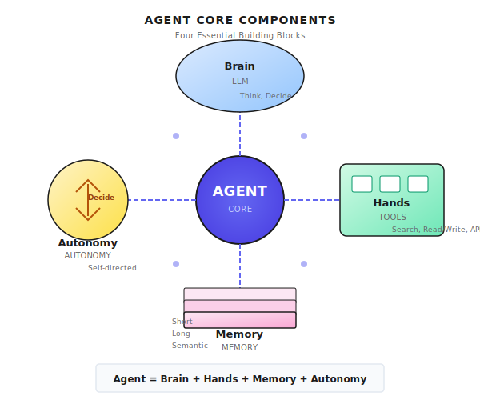
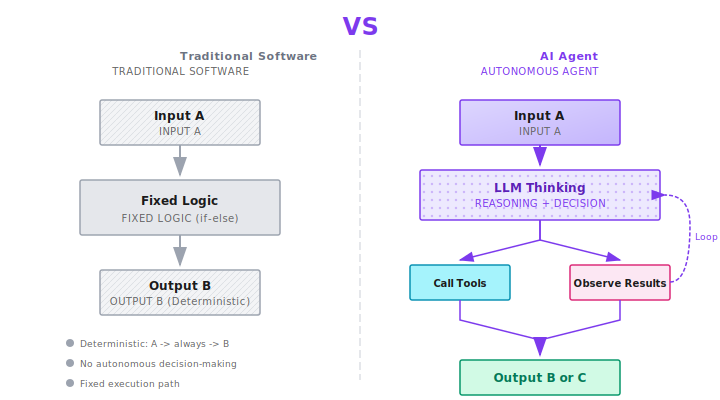
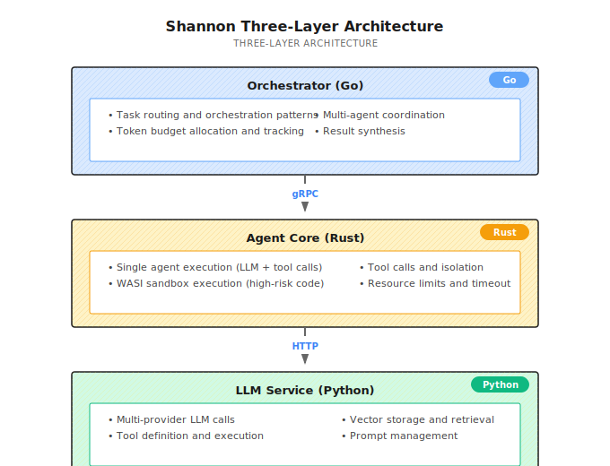

# Chapter 1: The Essence of Agents

> **An Agent is an AI system that can autonomously complete tasks. The core is "making its own decisions" rather than "you say something, it does something."**

---

Have you ever chatted with ChatGPT?

It's quite smart and can answer almost anything. But there's a problem: **you say something, it responds.** You have to keep asking follow-up questions, guiding it, copying and pasting.

I first realized this problem when I wanted it to help me book a flight.

I said: "Help me book a flight to Shanghai tomorrow."

It replied: "Sure, here's some flight information. You can book it on Expedia."

And that was it.

To be fair, it's not entirely its fault.

Booking a flight is an action with "side effects": you need to log in, select a flight, fill in passenger details, pay, and confirm the change/refund policy. Any step done wrong means you pay the price.

So without tools, without permissions, and without a mechanism for "confirm with me at critical steps," it can only give you information, not book for you.

This is exactly where real Agents differ: it's not about being better at chatting, but about the system enabling them to **do things safely** -- with tools, authorization, pausing at critical nodes to ask for confirmation, and full traceability.

This is the dividing line between Chatbots and Agents.

---

## 1.1 What Exactly Is an Agent?

### One-Sentence Definition

An Agent is an **AI that can do its own work**.

More technically: you give it a goal, a toolbox, and a set of boundaries (budget / permissions / approvals / sandbox), and it pushes the task forward in a loop until completion or stopping.

It's not you feeding it one sentence and it answering one -- you tell it a goal, and it figures out how to complete it on its own:
- Need to look something up? It searches on its own
- Need to write code? It writes it on its own
- Need to call an API? It calls it on its own
- Made an error in between? It fixes it on its own

### Four Core Components

Sounds like science fiction? It's actually not that mysterious. There are just four core things:

```
Agent = Brain + Hands/Feet + Memory + Initiative
       (LLM)    (Tools)      (Memory)  (Autonomy)
```



**Brain (LLM)**: Responsible for thinking, deciding what to do next. This is the core engine of the Agent. Without an LLM, an Agent is just a rigid script.

**Hands/Feet (Tools)**: Responsible for execution, like searching web pages, reading and writing files, calling APIs, operating browsers. LLMs can only "think"; Tools let them "do."

**Memory**: Responsible for remembering what happened before. Short-term memory is the context of the current conversation; long-term memory is knowledge accumulated across sessions. Without memory, an Agent starts from zero every time, making it extremely inefficient.

**Initiative (Autonomy)**: This is the most critical -- it must make its own decisions, not just move when you say so. Autonomy is the fundamental difference between Agents and regular Chatbots.

Let me add my own bias: in production systems, you also need a layer of "Guardrails." It's not a component of the Agent, but it determines whether the Agent can go live: budget, permissions, approvals, auditing, sandbox. An Agent without guardrails will eventually go from "doing its own work" to "causing its own trouble."

### Differences from Traditional Software

Traditional software is **deterministic**: given input A, it necessarily produces output B. You write an `if-else`, and it always follows that logic.

Agents are **probabilistic**: given input A, they "think" about what to do, and might produce B or C. The path might be different each time they run.

This brings flexibility, but also uncertainty. In production environments, how to control this uncertainty is one of the core challenges of Agent system design.

```
Traditional software:  Input -> Fixed Logic -> Output
Agent:                 Input -> LLM Thinking -> Tool Call -> Observe Result -> Continue Thinking -> ... -> Output
```



---

## 1.2 A Real Example

Suppose you ask an Agent to do this:

> "Help me research ByteDance and write an analysis report."

### How a Chatbot Does It

ChatGPT will give you information from its training data, then say: "If you need the latest information, please search on your own."

Done. You have to search, organize, and write the report yourself.

### How an Agent Does It

A real Agent would do this:

**Step 1: Task Decomposition**

```
User goal: Research ByteDance, write analysis report
Subtask breakdown:
├── 1. Search company background
├── 2. Look up product lines and business structure
├── 3. Analyze competitors
├── 4. Look up financial/funding information
└── 5. Synthesize and write report
```

**Step 2: Execute One by One**

```
[Executing subtask 1]
Thought: Need to search ByteDance's background information
Action: Call search tool, query="ByteDance company background history"
Observation: Returns 10 results, including founder, founding date, development history
Thought: Information is sufficient, store in memory, continue to next task

[Executing subtask 2]
Thought: Need to understand product lines
Action: Call search tool, query="ByteDance products TikTok Douyin"
Observation: Returns product list and market data
Thought: Need more details
Action: Search again, query="ByteDance revenue breakdown by product 2024"
Observation: Found financial report analysis articles
...
```

**Step 3: Self-Check**

```
Checklist:
✓ Company background - collected
✓ Product lines - collected
✓ Competitors - collected
✗ Financial information - not detailed enough, needs supplement
```

**Step 4: Synthesize Output**

Organize all information into a structured report and deliver it to you.

Throughout this process, you only said one sentence. The rest, it handled on its own.

**This is an Agent.**

If you think "researching a company" is too consulting-like, let me give you a more engineering-flavored task:

> "Open the Shannon repository, find the stop conditions for the ReAct loop, and explain what accident each condition is preventing."

A Chatbot would often give you a bunch of "should have" answers; an Agent would actually open files, locate functions, and explain the design motivations clearly.

---

## 1.3 Autonomy Levels of Agents

Agents aren't a black-and-white concept, but a **spectrum**. I divide it into six levels:

Note: The L0-L5 classification below is a ruler I drew for discussion convenience (not an academic standard). Use it to build intuition first, and later we'll use Shannon's implementation to map each level to code.

| Level | Name | You Say | It Does | Typical Example |
|-------|------|---------|---------|-----------------|
| **L0** | Chatbot | Ask a question | Answer once | ChatGPT basic conversation |
| **L1** | Tool Agent | Need to check weather | Call API and return result | GPTs Actions |
| **L2** | ReAct Agent | Complex problem | Think -> Act -> Observe, loop | LangChain ReAct |
| **L3** | Planning Agent | Big task | First decompose plan, then execute each | Focus of this book |
| **L4** | Multi-Agent | Even bigger task | Multiple Agents divide and collaborate | Shannon Supervisor |
| **L5** | Autonomous | Vague goal | Long-term autonomous operation, self-iteration | Claude Code, Manus |

### Detailed Explanation of Each Level

**L0 - Chatbot**: Pure conversation, no tool-calling capability. You ask it about weather, it can only say "I cannot get real-time information."

**L1 - Tool Agent**: Can call tools, but just simple "you ask me to check, I check." No multi-step reasoning.

**L2 - ReAct Agent**: Can perform multiple rounds of "think-act-observe" loops. This is the entry-level form of Agents, and the focus of the next chapter.

**L3 - Planning Agent**: Can decompose complex tasks into subtasks, make plans, then execute. Has the ability to "think before doing" beyond L2.

**L4 - Multi-Agent**: Multiple specialized Agents collaborating. For example, one responsible for searching, one for analysis, one for writing. This is the mainstream form for enterprise applications.

**L5 - Autonomous**: Can run autonomously for long periods, adjust strategies based on environment feedback, and even self-improve. There are currently no truly reliable L5 Agents; Claude Code and Manus are exploring this direction, but they're not fully mature yet.

### Scope of This Book

Most people use L0-L1. This book mainly teaches you how to build **L2-L4**.

L5? Honestly, **there are currently no truly reliable L5 Agents**. If anyone claims otherwise, you can be skeptical.

---

## 1.4 What Agents Can and Cannot Do

I've seen too many people oversell Agents, as if they could do anything.

**That's not the case.**

### Scenarios Where Agents Excel

| Scenario Characteristics | Example | Why It's Suitable |
|-------------------------|---------|-------------------|
| **Clear goal** | "Help me summarize this article" | Has clear success criteria |
| **Steps can be decomposed** | "Process data according to this flow" | Can be broken into subtasks |
| **Results can be verified** | "Code just needs to run" | Can determine if completed |
| **Information is accessible** | "Look up information about this company" | Has tools to get data |
| **High repetition** | "Send me a briefing every morning" | High automation value |

### Scenarios Where Agents Struggle

| Scenario Characteristics | Example | Why It's Not Suitable |
|-------------------------|---------|----------------------|
| **Open-ended creativity** | "Help me think of a disruptive business model" | No clear criteria, hard to iterate |
| **Subjective judgment** | "Is this design good-looking" | Requires human aesthetics and values |
| **Complex interpersonal** | "Help me win over this client" | Involves EQ, relationships, context |
| **High-risk decisions** | "Help me decide whether to invest" | Responsibility attribution issues |
| **Irreversible side effects** | "Help me send email to entire company/delete production database" | Once wrong, loss is irreversible |
| **Real-time physical operations** | "Help me cook" | Requires physical robots |

### Choosing the Right Scenario Is Key

Choose the right scenario, and Agents can save you a lot of time. Choose wrong, and it's just a **token-burning machine**.

Many things aren't "can't do" but "must have confirmation points before doing": payment, publishing, deleting, mass emailing... The default should be human confirmation, Agent execution.

A simple way to judge:

> If you could hand this task to an intern and clearly tell them in writing how to do it, it's probably suitable for an Agent.
> If you can't even articulate "what counts as doing it well," then an Agent can't handle it either.

---

## 1.5 Technical Evolution of Agents

Agents didn't appear out of nowhere. Their evolution has a clear trajectory:

### Before 2022: Rule-Driven

Early "smart assistants" (like Siri, Alexa) were essentially rule engines + intent recognition. User says something, system recognizes intent, matches preset rules, executes corresponding action.

```
User: "Wake me up at 7 tomorrow morning"
System: Recognize intent=set alarm, extract parameter=7:00 AM, execute=create alarm
```

Extremely low flexibility; couldn't handle anything beyond preset intents.

### 2023: LLM Becomes the Brain

The emergence of large models like GPT-4 changed the game. LLMs can:
- Understand complex, ambiguous natural language instructions
- Perform multi-step reasoning
- Generate structured output (like JSON)

This made "using LLMs to drive tool calls" possible.

### 2023-2024: ReAct and Function Calling

Two key breakthroughs:

1. **ReAct Paper** (2022): Proposed the "Reason + Act" loop pattern, letting LLMs think and act alternately
2. **Function Calling** (2023): Native support from OpenAI and others for tool calling; LLMs can output structured function call requests

These two combined, and Agents started becoming practical.

### 2024-2025: Multi-Agent and Production-Ready

Single Agents have limited capabilities; multi-Agent collaboration became mainstream. At the same time, enterprises started caring about:
- Cost control (Token budget)
- Security (Sandbox execution)
- Reliability (Persistence, retry)
- Observability (Monitoring, tracing)

This is the focus of this book: **Production-grade Agent systems**.

---

## 1.6 Shannon Architecture Overview

This book uses [Shannon](https://github.com/Kocoro-lab/Shannon) as its reference implementation. Shannon is a three-layer architecture multi-Agent system:



### Why Three Layers?

| Layer | Language | Responsibility | Why This Language |
|------|----------|----------------|-------------------|
| Orchestrator | Go | Orchestration, scheduling | Strong concurrency, good for coordinating multiple Agents |
| Agent Core | Rust | Execution, isolation | Good performance, memory safety, good for boundaries and sandbox |
| LLM Service | Python | Models and tools | Rich ecosystem, complete SDKs and toolchains |

### Shannon's Coverage of Agent Levels

| What You Want to Do | Shannon Pattern | Corresponding Level |
|--------------------|-----------------|---------------------|
| Simple Q&A + Tool calling | SimpleTask | L1 |
| Think-Action loop | ReAct | L2 |
| Complex task decomposition | DAG | L3 |
| Multi-Agent collaboration | Supervisor | L4 |

### Not Just Shannon

Shannon isn't the only choice. LangGraph, CrewAI, AutoGen can all do similar things. But this book chose Shannon as the reference implementation because:

1. **Production-grade design**: Comes with Temporal persistence, Token budget control, WASI sandbox
2. **Three-layer separation**: Clear responsibilities, easy to understand architecture
3. **Open source and readable**: Moderate code volume, suitable for learning

The goal of this book is to teach you **design patterns**, not to teach you Shannon. You can absolutely use other frameworks to implement the same patterns.

## Shannon Lab (10-Minute Quickstart)

This section helps you map the concepts from this chapter to Shannon source code in 10 minutes.

### Required Reading (1 file)

- [`docs/multi-agent-workflow-architecture.md`](https://github.com/Kocoro-lab/Shannon/blob/main/docs/multi-agent-workflow-architecture.md): Start with the big picture, grasp how "Router/Strategy/Pattern" three layers divide the work

### Optional Deep Dives (2, pick by interest)

- [`orchestrator_router.go`](https://github.com/Kocoro-lab/Shannon/blob/main/go/orchestrator/internal/workflows/orchestrator_router.go): How the system decides "use ReAct / DAG / Supervisor"
- [`wasi_sandbox.rs`](https://github.com/Kocoro-lab/Shannon/blob/main/rust/agent-core/src/wasi_sandbox.rs): See what guardrails look like -- how the sandbox isolates tool execution

---

## 1.7 Common Misconceptions

### Misconception 1: Agent = ChatGPT + Plugins

Not quite right. Plugins are just "tools"; the core of an Agent is the **autonomous decision loop**. Having tools doesn't make it an Agent; being able to decide "when to use which tool" on its own does.

### Misconception 2: Agents Can Replace Humans

They can't, at least not now. Agents are **augmentation tools**, not replacements. They can help you handle repetitive, structured tasks, but humans need to set goals, supervise processes, and accept results.

### Misconception 3: More Autonomy Is Always Better

Not necessarily. Higher autonomy means higher uncertainty. In production environments, you often need to find balance between "autonomy" and "controllability." A fully autonomous Agent might go out of control; a fully controlled Agent loses its meaning.

### Misconception 4: Using the Strongest Model Means Good Agents

Model capability is just the foundation. Agent system quality depends on:
- Whether tool design is reasonable
- Whether prompts are clear
- Whether error handling is complete
- Whether architecture supports extension

Running a bad prompt with GPT-4 is worse than running a well-designed system with GPT-3.5.

---

## 1.8 Chapter Summary

1. **Agent Definition**: An AI system that can autonomously complete tasks; core is "making its own decisions"
2. **Four Components**: Brain (LLM) + Hands/Feet (Tools) + Memory + Initiative (Autonomy)
3. **Autonomy Levels**: L0-L5; this book focuses on L2-L4
4. **Suitable Scenarios**: Tasks with clear goals, decomposable steps, verifiable results
5. **Shannon's Position**: Three-layer architecture production-grade multi-Agent system, serving as this book's reference implementation

### Exercises (Recommended to Complete Before Reading On)

1. Rewrite "help me book a flight" as an executable Agent goal: must include **success criteria**, **steps requiring your confirmation**, and "what to do if it fails"
2. Write your own one-sentence definition of Agent, then find 3 "evidence files" for that sentence in Shannon (e.g., routing, execution, guardrails)

---

## 1.9 Further Reading

- **ReAct Paper**: [ReAct: Synergizing Reasoning and Acting in Language Models](https://arxiv.org/abs/2210.03629) - Theoretical foundation for Agent think-act loops
- **Generative Agents**: [Generative Agents: Interactive Simulacra of Human Behavior](https://arxiv.org/abs/2304.03442) - Stanford's Agent village experiment
- **OpenAI Function Calling**: [Official Documentation](https://platform.openai.com/docs/guides/function-calling) - Technical implementation of tool calling

---

## Next Chapter Preview

You might ask: How does an Agent "do its own work"? Specifically, how does it think, act, then think again?

That's the content of the next chapter -- **The ReAct Loop**.

ReAct is the heart of an Agent. Understand it, and you understand the core operating mechanism of Agents.
