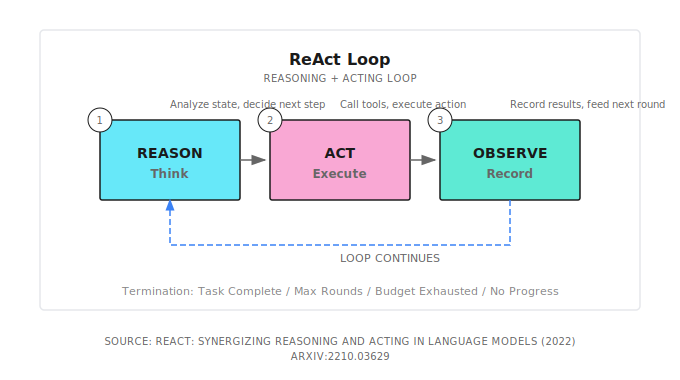

# Chapter 2: The ReAct Loop

> **ReAct is the heart of an Agent: think one step, act one step, observe the result, then think about the next step -- it makes AI fabricate less and work more like it's actually doing something.**
> **But it's not a correctness guarantee; budget, termination conditions, and acceptance are the real bottom lines in production.**

---

The previous chapter said that the core of an Agent is "doing its own work."

But specifically, how does it work? What's it thinking? How is each step decided?

The answer is **ReAct**: Reasoning + Acting, an intertwined loop of reasoning and action.

This is the core operating mechanism of Agents. Understand it, and you understand the heart of an Agent.

---

## 2.1 Starting from a Real Scenario

Suppose you tell an Agent: "Help me investigate the competitor's pricing strategy."

### How Regular ChatGPT Does It

> "Pricing strategies typically include cost-plus pricing, competitive pricing, value-based pricing..."

This isn't wrong, but it's avoiding your question: what you want is "who are the competitors, how much, what packages/limitations," not a "pricing strategy encyclopedia."

It doesn't know who your competitors are, and it didn't go look. So you get an answer that "sounds reasonable but isn't actionable."

### How a ReAct Agent Does It

```
[Round 1]
Thought: User said "competitor" but didn't say who. Confirm the target first, otherwise what I find will be garbage.
Action: Ask user: Who are the competitors you're referring to? (Give me names or websites)
Observation: User replies: Mainly looking at "Competitor A"

[Round 2]
Thought: Good, got the name. Find their official pricing page first, prioritize official site, then docs/FAQ.
Action: Call search tool, query="Competitor A pricing"
Observation: Found official pricing page + two review articles

[Round 3]
Thought: Go read the official pricing page, get accurate numbers and package differences.
Action: Call web fetch tool, access official pricing page
Observation: Basic $29/month, Pro $99/month, Enterprise contact sales; feature differences list...

[Round 4]
Thought: Organize information into comparison, and add "us vs them" difference points.
Action: Generate analysis report (with source links)
Observation: Report generation complete

[Output]
Competitor A Pricing Strategy Analysis:
- Basic: $29/month, for individual users
- Pro: $99/month, for small teams
- Enterprise: Contact sales, for large customers
Uses tiered pricing strategy, compared to our $49/month pricing...
```

See the difference?

It's not guessing an answer all at once, but **thinking while doing, doing then thinking again**.

This is the core of ReAct: **Reason (Think) -> Act (Action) -> Observe**, looping repeatedly until the task is complete.

> **Note**: ReAct isn't magic. It doesn't "automatically become correct," but turns "guessing" into "searching + evidence + reversible steps." It still makes mistakes, but you can see where it went wrong and more easily pull it back on track.

---

## 2.2 The Essence of ReAct: Why This Loop Works

### LLMs' Inherent Limitations

LLMs are naturally "say everything at once" -- you ask a question, it generates an entire paragraph. It won't stop to think "was what I just said correct," and it won't look things up mid-way.

This causes two problems:

| Problem | Symptom | Consequence |
|---------|---------|-------------|
| **Outdated information** | Can only use knowledge from training data | Answer might be months-old information |
| **Cannot verify** | Once said, it won't check | Fabricates details and speaks confidently without evidence |

### How ReAct Solves It

ReAct forces the LLM to stop:

```
Not: Question -> Generate answer all at once
But: Question -> Think one step -> Do one step -> See result -> Think again -> Do again -> ... -> Answer
```

This brings three key benefits:

| Benefit | Explanation | Example |
|---------|-------------|---------|
| **Can get new information** | Not just making things up from existing knowledge, can actually look things up | Search for latest product pricing |
| **Can correct errors** | Discovered wrong path, can turn back | Search result wrong, change keywords and search again |
| **Can trace the process** | Every step is recorded, know where things went wrong | Can see which step failed when debugging |

### Academic Background

ReAct comes from a 2022 paper: [ReAct: Synergizing Reasoning and Acting in Language Models](https://arxiv.org/abs/2210.03629).

The core finding is simple:

> **Reasoning and acting intertwined together is stronger than using either alone.**

- Reasoning without acting (Chain-of-Thought): Thinks well, but can't get new information
- Acting without reasoning (Direct Function Calling): Blindly calls tools, doesn't know why
- Reasoning + Acting (ReAct): Thinks clearly about why to do it, sees results after doing, then decides next step

This insight laid the foundation for modern Agents.

---

## 2.3 Three Phases, Broken Down



### Reason (Think)

Analyze the current situation, decide what to do next.

```
Input: User goal + historical observation results
Output: What to do next, and why
```

**Key principle: Only think one step.** Don't let the LLM think too far ahead; it will diverge. Tell it: "Based on current information, what's your next action?"

### Act (Action)

Call a tool, execute an action.

```
Input: Action decided in the thinking phase
Output: Execution result
```

> **Tip**: Only advance one key action per round. Especially important during early debugging: the smaller the action, the easier to locate problems. Once you've got the flow running smoothly, then consider parallel tool calls to speed things up.

Common action types:
- Clarify/Confirm
- Web Search
- Read File
- Write File
- HTTP Request (Call API)
- Code Execution

### Observe

Record the execution result, feed it to the next round's Reason phase.

```
Input: Execution result of the action
Output: Structured observation record
```

**Key principle: Observation should be objective.** Don't make judgments at this stage, just record facts. Leave judgment for the next round's Reason.

---

## 2.4 When to Stop?

This is one of the most critical questions in ReAct. Stop too early and the task isn't complete; stop too late and you burn tokens.

### Six Termination Conditions (Two Are Hard Guardrails)

| Condition | Explanation | Priority |
|-----------|-------------|----------|
| **User interrupt** | User actively stops | Highest |
| **Task complete** | LLM explicitly indicates task is done | High |
| **Budget exhausted** | Reached token/cost limit, forced stop | High (Guardrail) |
| **Timeout** | Reached end-to-end latency limit, forced stop | High (Guardrail) |
| **Result converged** | Two consecutive observations are very similar, no new progress | Medium |
| **Max iterations** | Reached preset MaxIterations | Fallback |

### Example Judgment Logic

```go
func shouldStop(state *ReactState) bool {
    // 0. User interrupt, stop immediately
    if state.UserCanceled {
        return true
    }

    // 0.5 Budget/timeout are hard guardrails
    if state.TokensUsed >= state.Config.TokenBudget {
        return true
    }
    if time.Since(state.StartTime) > state.Config.Timeout {
        return true
    }

    // 1. Reached max iterations, force stop
    if state.Iteration >= state.Config.MaxIterations {
        return true
    }

    // 2. Haven't reached min iterations yet, continue
    if state.Iteration < state.Config.MinIterations {
        return false
    }

    // 3. LLM explicitly said it's done
    if containsCompletionSignal(state.LastThought) {
        return true
    }

    // 4. Result converged, no new progress
    if isResultConverged(state.Observations) {
        return true
    }

    return false
}
```

---

## 2.5 A Complete Debugging Case

Suppose the user says: "Help me check why the API is returning a 500 error."

### Loop Execution Process

```
[Round 1]
Thought: 500 error is usually a server-side issue, need to look at logs
Action: Execute tail -n 50 /var/log/app.log
Observation: Found NullPointerException at UserService.java:45

[Round 2]
Thought: Found the NPE, location is UserService.java line 45, let's look at the code
Action: Read src/UserService.java lines 40-50
Observation: Line 45 is user.getProfile().getName()

[Round 3]
Thought: Problem is clear, user.getProfile() might return null, no null check
Action: Generate fix suggestion
Observation: Suggestion is to add null check before access

[Round 4]
Thought: Problem located, solution exists, task complete
Action: Output final report
Observation: Report generation complete

[Terminated: LLM indicates task complete]
```

### Final Output

```
Problem Analysis:
The API returns 500 error because there's a null pointer exception at UserService.java line 45.
When a user hasn't set their profile, getProfile() returns null,
and directly calling getName() causes a NullPointerException.

Fix Suggestion:
Add null check before accessing profile:
if (user.getProfile() != null) {
    String name = user.getProfile().getName();
}
Or use Optional:
String name = Optional.ofNullable(user.getProfile())
    .map(Profile::getName)
    .orElse("Unknown");
```

Four rounds of loops, problem located, solution ready.

**What if there was no ReAct?** The LLM might make up a bunch of "common 500 causes" -- database connection failure, out of memory, configuration error -- but none of them would be your actual problem.

---

## 2.6 Key Configurations for Production

In production, ReAct isn't just "get it running," but "keep it running, able to stop, able to review when things go wrong."

I like using Shannon to explain this configuration, because it writes common accidents directly into the code: you can see in the source how it prevents "infinite loops / premature finish / context explosion / conclusions without evidence."

In Shannon, you'll mainly encounter two layers of parameters:
- **Loop parameters** (ReAct's own shape): `ReactConfig`
- **Budget guardrails** (common across patterns): `Options.BudgetAgentMax` + workflow/activity timeouts

Shannon's `ReactConfig` is defined in [`patterns/react.go`](https://github.com/Kocoro-lab/Shannon/blob/main/go/orchestrator/internal/workflows/patterns/react.go) (excerpt):

```go
type ReactConfig struct {
    MaxIterations     int
    MinIterations     int
    ObservationWindow int
    // MaxObservations / MaxThoughts / MaxActions ...
}
```

The Token budget isn't in `ReactConfig`, but in the common `Options` ([`patterns/options.go`](https://github.com/Kocoro-lab/Shannon/blob/main/go/orchestrator/internal/workflows/patterns/options.go)):

```go
type Options struct {
    BudgetAgentMax int
    // ...
}
```

I quite like this separation: because budget isn't ReAct-specific; Chain-of-Thought, Debate, Tree-of-Thoughts all need to be under the same budget constraints.

### Why Need MaxIterations?

I've seen Agents get stuck on one search result, spinning repeatedly, burning tens of thousands of tokens and still not stopping.

**Real case**: Agent searched "Python installation tutorial," first result was an ad page, read it and found it useless, searched again, got the same ad page (because search terms didn't change), read again, still useless... Looped 20 times, produced nothing.

So there must be a hard limit. Production recommendation: MaxIterations = 10-15.

### Why Need MinIterations?

Some tasks, the Agent says "done" in the first round, but actually did nothing.

**Real case**: User asks "Help me check tomorrow's Beijing weather," Agent answers "Sure, tomorrow Beijing weather is sunny, temperature 25 degrees" -- but it didn't call the weather API at all, it made that up.

Force MinIterations = 1, ensure at least one real tool call.

### Why Need ObservationWindow?

Observation history keeps accumulating, context gets bigger and bigger, token costs spiral out of control.

```go
// Only keep the most recent 5 observations
recentObservations := observations[max(0, len(observations)-5):]
```

Old observations can be compressed into summaries, keeping key information, discarding details.

### Two Extra "Very Production" Things Shannon Does

1. **Early stopping (not waiting to burn through MaxIterations)**: `shouldStopReactLoop` detects "result convergence/no new information," e.g., stops if two consecutive observations are very similar (source has a cheap but effective `areSimilar`)
2. **Require evidence before wrapping up**: In research mode, it checks `toolExecuted`, `observations` and other conditions, preventing the model from saying "done" without actually searching

## Shannon Lab (10-Minute Quickstart)

This section helps you map the concepts from this chapter to Shannon source code in 10 minutes.

### Required Reading (1 file)

- [`patterns/react.go`](https://github.com/Kocoro-lab/Shannon/blob/main/go/orchestrator/internal/workflows/patterns/react.go): Search for `Phase 1/2/3` + `shouldStopReactLoop`, match the loop and "early stopping" reasons

### Optional Deep Dives (2, pick by interest)

- [`patterns/options.go`](https://github.com/Kocoro-lab/Shannon/blob/main/go/orchestrator/internal/workflows/patterns/options.go): See why `BudgetAgentMax` is in common Options (rather than stuffed into ReactConfig)
- [`strategies/react.go`](https://github.com/Kocoro-lab/Shannon/blob/main/go/orchestrator/internal/workflows/strategies/react.go): See how ReactWorkflow loads config, injects memory, then calls ReactLoop to run

---

## 2.7 Common Pitfalls

### Pitfall 1: Infinite Loop

**Symptom**: Agent keeps doing the same thing, can't stop.

**Cause**: Search terms don't change, results don't change, but Agent doesn't realize it's repeating.

**Solution**:
- Add MaxIterations hard limit
- Add similarity detection: if two consecutive observation results are highly similar, force stop or change strategy (Shannon has a cheap heuristic called `areSimilar`)
- Remind in the Prompt: "If you find the result is the same as last time, please try a different approach"

### Pitfall 2: Giving Up Too Early

**Symptom**: Agent says "done" in the first round, but actually did nothing.

**Cause**: LLM being lazy, just making up an answer from existing knowledge.

**Solution**:
- Add MinIterations, force at least one tool call
- Make it explicit in the Prompt: "You must use tools to get information, cannot answer directly"

### Pitfall 3: Token Explosion

**Symptom**: After a few rounds, context length explodes, costs spiral out of control.

**Cause**: Every observation is fully retained, history keeps accumulating.

**Solution**:
- Limit ObservationWindow, only look at recent few
- Compress old observations into summaries
- Set budget guardrails (e.g., Shannon's `Options.BudgetAgentMax`)

### Pitfall 4: Thinking and Acting Disconnected

**Symptom**: What the LLM thinks and what it does are different things.

**Cause**: Prompts for Reason and Act phases aren't connected well.

**Solution**: Explicitly reference the Reason output in the Act phase:

```
Your thought just now was: {thought}
Please execute the corresponding action based on this thought.
```

---

## 2.8 How Do Other Frameworks Do It?

ReAct is a universal pattern, not Shannon-exclusive. Everyone has implementations:

| Framework | Implementation Method | Features |
|-----------|----------------------|----------|
| **LangChain** | `create_react_agent()` | Most widely used, rich ecosystem |
| **LangGraph** | State graph + nodes | Visual debugging, controllable flow |
| **OpenAI** | Function Calling | Native support, low latency |
| **Anthropic** | Tool Use | Claude native support |
| **AutoGPT** | Custom loop | Highly autonomous, but unstable |

The core logic is the same: Think -> Act -> Observe -> Loop.

Differences are in:
- Tool definition format (JSON Schema vs custom format)
- Loop control granularity (framework-controlled vs user-controlled)
- Ecosystem integration (vector stores, monitoring, persistence)

Which to choose? Depends on your scenario. Use LangChain for quick prototypes, consider LangGraph or build your own for production systems.

---

## 2.9 Chapter Summary

1. **ReAct Definition**: Reasoning + Acting, an intertwined loop of reasoning and action
2. **Three Phases**: Reason (Think) -> Act (Action) -> Observe
3. **Why It's Effective**: Lets LLMs get new information, correct errors, trace the process
4. **Termination Conditions**: Task complete / Result converged / Max iterations / User interrupt + Budget/Timeout guardrails
5. **Key Configurations**: MaxIterations (prevent infinite loops), MinIterations (prevent laziness), ObservationWindow (control costs) + Budget/Timeout (hard guardrails)

---

## 2.10 Further Reading

- **ReAct Paper**: [ReAct: Synergizing Reasoning and Acting in Language Models](https://arxiv.org/abs/2210.03629) - Original paper, understand design motivation
- **LangChain ReAct**: [Official Documentation](https://python.langchain.com/docs/modules/agents/agent_types/react) - Most popular implementation
- **Chain-of-Thought Comparison**: [Chain-of-Thought Prompting](https://arxiv.org/abs/2201.11903) - Understand limitations of "reasoning without acting"
- **Shannon Pattern Guide**: [`docs/pattern-usage-guide.md`](https://github.com/Kocoro-lab/Shannon/blob/main/docs/pattern-usage-guide.md) (See how to configure various reasoning patterns from a user perspective)

---

## Next Chapter Preview

You might ask: What does an Agent rely on to "do"? Where do those search, read file, call API capabilities come from?

That's the content of the next chapter -- **Tool Calling Fundamentals**.

Tools are the hands and feet of an Agent. ReAct tells it how to think, tools let it actually take action.

An Agent without tools is like a person without hands -- can think all it wants, but can't get anything done.
