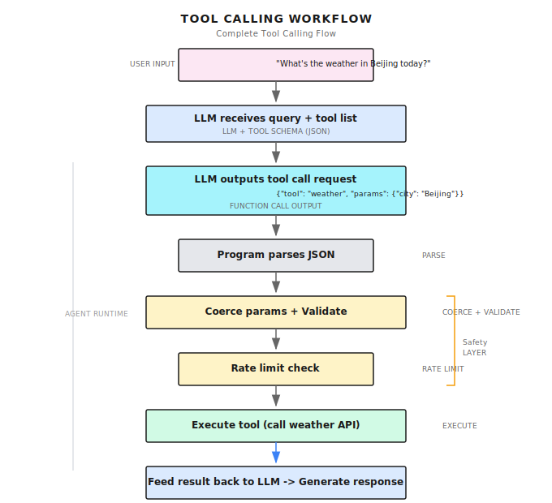
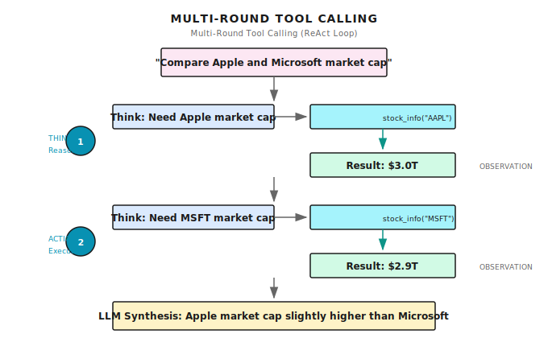

# Chapter 3: Tool Calling Fundamentals

> **Tools transform LLMs from "can talk" to "can do" -- but tools aren't a cure-all: if the description is written poorly, the LLM will still choose the wrong tool and fill in wrong parameters.**

---

## 3.1 The Fundamental Problem with LLMs

Let's look at a real case:

At the end of 2023, I deployed a customer service Agent at a fintech company. The first week online, it answered smoothly, and user satisfaction was good.

The second week, problems came. A user asked: "What's the latest loan interest rate?"

The Agent answered: "Based on my training data, the current benchmark loan rate is 4.35%."

The customer called to complain: That's the 2020 rate! It's now 3.65%!

**This is the fundamental problem with LLMs -- they can only "make things up" based on training data, they can't look up real-time information.** Model knowledge is cut off at training time; it doesn't know today's interest rate, today's weather, today's news.

A week later, we connected the Agent to the interest rate query API. Same question, it now calls the tool to query first, then returns the accurate answer. Same model, adding tools is like changing its brain.

### What Can an LLM Without Tools Do?

LLMs have a fatal flaw: **They can only make things up, they can't look things up.**

You ask it: "What's the weather like in Beijing today?"

It will answer: "Based on my training data, Beijing's climate..."

**That's made up.** Its knowledge is cut off at training time; it doesn't know today's weather.

| Question Type | LLM Performance | Why |
|--------------|-----------------|-----|
| **Real-time information** | Fabricates or refuses | Training data is historical |
| **Precise calculations** | Often wrong | It's a language model, not a calculator |
| **External systems** | Helpless | Can't send requests, read files |
| **Private data** | Completely unaware | Never saw your data during training |

To solve these problems, LLMs must be able to "take action" -- call APIs to check weather, search web pages for information, read files for data.

These "taking action" capabilities are tools.

---

## 3.2 What Is Function Calling?

Many people get confused by this term, but it's actually quite simple:

**Function Calling = Making the LLM not answer directly, but say "I need to call a certain tool"**

Traditional LLM:
```
User: What's the factorial of 5?
LLM: The factorial of 5 is 120.
```

This looks correct, but if asked about large numbers, the LLM might calculate wrong. Try asking it for the factorial of 13, and there's a decent chance it gives you a wrong answer.

Function Calling LLM:
```
User: What's the factorial of 5?
LLM: {
  "tool": "calculator",
  "parameters": { "expression": "5!" }
}
```

It doesn't calculate directly, but outputs a JSON saying "I want to call the calculator tool."

Then the program parses this JSON, actually calls the calculator, feeds the result back to the LLM, and the LLM answers the user.

**This is the essence of Function Calling: making LLMs learn to "ask for help" rather than "tough it out and make things up."**

### Why Output JSON?

Because the program needs to parse it. If the LLM output natural language:

```
I need to call the calculator to compute the factorial of 5
```

How does the program know "calculator" corresponds to which function? How does "factorial of 5" convert to parameters?

JSON is structured, the program can parse it directly:

```json
{"tool": "calculator", "parameters": {"expression": "5!"}}
```

`tool` is the tool name, `parameters` are the parameters. Crystal clear.

---

## 3.3 What Does a Tool Look Like?

Using Shannon's implementation as an example. A tool has three parts:

### Part One: Metadata (What this tool is for)

**Implementation Reference (Shannon)**: [`tools/base.py`](https://github.com/Kocoro-lab/Shannon/blob/main/python/llm-service/llm_service/tools/base.py) - ToolMetadata class

```python
@dataclass
class ToolMetadata:
    name: str               # Tool name
    version: str            # Version number
    description: str        # What it does (for LLM to see)
    category: str           # Category: search, calculation, file...

    # Production essential fields
    requires_auth: bool = False      # Requires authentication?
    rate_limit: Optional[int] = None # Max calls per minute
    timeout_seconds: int = 30        # Max runtime
    memory_limit_mb: int = 512       # Memory limit
    sandboxed: bool = True           # Should it be sandboxed
    dangerous: bool = False          # Is it a dangerous operation
    cost_per_use: float = 0.0        # Cost per call
```

**Why are these fields needed?**

| Field | Prevents What | Real Case |
|-------|---------------|-----------|
| `timeout_seconds` | Tool hanging drags down the entire Agent | Some webpage took 30 seconds to load |
| `rate_limit` | Agent going crazy calling burns through API quota | Called search API 200 times in one minute |
| `dangerous` | Dangerous operations need user confirmation | Deleting files, sending emails |
| `cost_per_use` | Track costs for budget control | Called GPT-4 100 times, bill exploded |
| `sandboxed` | Prevent malicious code escape | User input contains shell commands |

These aren't optional "advanced features," they're **essentials** for production environments.

I've seen a case: Agent was debugging a network problem, kept pinging the same address, called the network tool hundreds of times in a minute, directly triggered the cloud provider's DDoS protection, IP got blocked. If there was a `rate_limit`, this wouldn't have happened.

### Part Two: Parameter Definition (What input this tool needs)

```python
@dataclass
class ToolParameter:
    name: str                    # Parameter name
    type: ToolParameterType      # Type: STRING, INTEGER, FLOAT, BOOLEAN, ARRAY, OBJECT
    description: str             # Explanation (for LLM to see)
    required: bool = True        # Required?
    default: Any = None          # Default value
    enum: Optional[List[Any]] = None      # Enum values
    min_value: Optional[Union[int, float]] = None  # Minimum value
    max_value: Optional[Union[int, float]] = None  # Maximum value
    pattern: Optional[str] = None  # Regex validation
```

> **Important**: The description is very important. The most common problem I've seen is: LLM doesn't know how to fill in parameters because the description is too vague.

| Writing Style | Effect |
|--------------|--------|
| `"The query"` | LLM doesn't know what format to fill |
| `"Search keywords, containing specific company names, product names, or topics. Example: 'OpenAI GPT-4 pricing 2024'"` | LLM knows how to fill it |

LLMs understand how to fill parameters based on the description. The clearer the description, the more accurate the LLM's input.

This is my method for testing description quality:

> Show the description to someone who isn't technical and ask them "do you know what to fill in?" If they say "no," then the LLM probably doesn't know either.

### Part Three: Execution Logic (What this tool specifically does)

```python
async def _execute_impl(self, session_context=None, **kwargs) -> ToolResult:
    expression = kwargs["expression"]
    try:
        result = safe_eval(expression)  # Safe calculation, not direct eval()
        return ToolResult(success=True, output=result)
    except Exception as e:
        return ToolResult(success=False, error=str(e))
```

Notice a few points:

1. **Async**: Uses `async`, doesn't block other requests
2. **Safe**: Doesn't directly `eval()`, uses AST whitelist
3. **Structured return**: `ToolResult` has a `success` field, Agent knows success or failure

Structure of `ToolResult`:

```python
@dataclass
class ToolResult:
    success: bool              # Success or failure
    output: Any                # Return result
    error: Optional[str] = None            # Error message
    metadata: Optional[Dict[str, Any]] = None  # Additional metadata
    execution_time_ms: Optional[int] = None    # Execution time
    tokens_used: Optional[int] = None          # Tokens consumed (if tool internally called LLM)
```

---

## 3.4 How Do LLMs Understand Tools?

LLMs can't directly read Python code. They need a "manual" -- JSON Schema.

Shannon automatically converts tool definitions into JSON like this:

```json
{
  "name": "calculator",
  "description": "Calculate mathematical expressions, supports addition, subtraction, multiplication, division, exponentiation, trigonometric functions, etc.",
  "parameters": {
    "type": "object",
    "properties": {
      "expression": {
        "type": "string",
        "description": "The mathematical expression to calculate, like '2 + 2', 'sqrt(16)', 'sin(3.14/2)'"
      }
    },
    "required": ["expression"]
  }
}
```

This JSON gets stuffed into the LLM's prompt. When the LLM sees this "manual," it knows there's a tool called calculator that needs an expression parameter.

**So the quality of tool definitions directly affects the quality of LLM calls.**

The conversion logic is in the `get_schema()` method of `base.py`:

```python
def get_schema(self) -> Dict[str, Any]:
    properties = {}
    required = []

    for param in self.parameters:
        prop = {
            "type": param.type.value,
            "description": param.description,
        }
        if param.enum:
            prop["enum"] = param.enum
        if param.min_value is not None:
            prop["minimum"] = param.min_value
        # ... other fields

        properties[param.name] = prop
        if param.required:
            required.append(param.name)

    return {
        "name": self.metadata.name,
        "description": self.metadata.description,
        "parameters": {
            "type": "object",
            "properties": properties,
            "required": required,
        },
    }
```

---

## 3.5 What If the LLM Fills Parameters Incorrectly?

This is a real problem you'll encounter.

For example, you define an integer parameter, but the LLM might output `"10"` instead of `10` -- a string instead of a number.

Shannon does type coercion (in the `_coerce_parameters` method):

```python
def _coerce_parameters(self, kwargs: Dict[str, Any]) -> Dict[str, Any]:
    out = dict(kwargs)
    spec = {p.name: p for p in self.parameters}

    for name, param in spec.items():
        if name not in out:
            continue
        val = out[name]

        # Integer: accepts float (like 3.0) and numeric strings
        if param.type == ToolParameterType.INTEGER:
            if isinstance(val, float) and float(val).is_integer():
                out[name] = int(val)
            elif isinstance(val, str) and val.strip().isdigit():
                out[name] = int(val.strip())

        # Boolean: accepts common string forms
        elif param.type == ToolParameterType.BOOLEAN:
            if isinstance(val, str):
                s = val.strip().lower()
                if s in ("true", "1", "yes", "y"):
                    out[name] = True
                elif s in ("false", "0", "no", "n"):
                    out[name] = False

    return out
```

This is called **fault tolerance**. You can't assume the LLM always outputs perfect data formats.

Another detail: if a parameter has `min_value` and `max_value`, coercion will automatically clamp:

```python
# If user passed 999, but max_value is 100, automatically truncate to 100
if param.max_value is not None and out[name] > param.max_value:
    out[name] = param.max_value
```

This avoids subsequent validation failures.

---

## 3.6 The Real Flow of Tool Calling

Connecting the previous knowledge, the complete flow is like this:



This is a complete tool call.

### Multi-Round Tool Calling

Complex tasks may need multiple tool calls:



This is the ReAct loop from the previous chapter: Think -> Act -> Observe -> Think again -> Act again...

---

## 3.7 Managing Multiple Tools

In real scenarios, an Agent has more than one tool. Might have search, calculation, file reading, making requests...

**Implementation Reference (Shannon)**: [`tools/registry.py`](https://github.com/Kocoro-lab/Shannon/blob/main/python/llm-service/llm_service/tools/registry.py) - ToolRegistry class

```python
class ToolRegistry:
    def __init__(self):
        self._tools: Dict[str, Type[Tool]] = {}      # Tool classes
        self._instances: Dict[str, Tool] = {}         # Tool instances (singletons)
        self._categories: Dict[str, List[str]] = {}   # Index by category

    def register(self, tool_class: Type[Tool], override: bool = False) -> None:
        """Register a tool class"""
        temp_instance = tool_class()
        metadata = temp_instance.metadata

        if metadata.name in self._tools and not override:
            raise ValueError(f"Tool '{metadata.name}' is already registered")

        self._tools[metadata.name] = tool_class

        # Update category index
        if metadata.category not in self._categories:
            self._categories[metadata.category] = []
        self._categories[metadata.category].append(metadata.name)

    def get_tool(self, name: str) -> Optional[Tool]:
        """Get tool instance (singleton pattern)"""
        if name not in self._tools:
            return None
        if name not in self._instances:
            self._instances[name] = self._tools[name]()
        return self._instances[name]
```

### Filtering Tools by Task

```python
def filter_tools_for_agent(
    self,
    categories: Optional[List[str]] = None,
    exclude_dangerous: bool = True,
    max_cost: Optional[float] = None,
) -> List[str]:
    """Filter tools by criteria"""
    filtered = []

    for name in self._tools:
        tool = self.get_tool(name)
        metadata = tool.metadata

        # Category filter
        if categories and metadata.category not in categories:
            continue

        # Dangerous tool filter
        if exclude_dangerous and metadata.dangerous:
            continue

        # Cost filter
        if max_cost is not None and metadata.cost_per_use > max_cost:
            continue

        filtered.append(name)

    return filtered
```

**Why filter?**

Because too many tools confuse the LLM.

I've tested it: give the LLM 20 tools, and its selection accuracy drops noticeably. Give it 5 relevant tools, accuracy is much higher.

This isn't the LLM's problem; it's a mistake humans make too -- too many options cause decision fatigue.

So filter by task type, only expose relevant tools:

```python
# Research task: only need search and reading
if task_type == "research":
    tools = registry.filter_tools_for_agent(categories=["search", "web"])

# Data analysis: only need calculation and database
elif task_type == "analysis":
    tools = registry.filter_tools_for_agent(categories=["calculation", "database"])

# Code task: only need file operations
elif task_type == "coding":
    tools = registry.filter_tools_for_agent(categories=["file", "shell"])
```

---

## 3.8 Rate Limiting Mechanism

Shannon has two layers of rate limiting:

### First Layer: Tool-Level Rate Limiting

In `Tool.execute()`, check before each call:

```python
async def execute(self, session_context=None, **kwargs) -> ToolResult:
    # Get rate limit key (based on session or agent)
    tracker_key = self._get_tracker_key(session_id, agent_id)

    # Check if limit exceeded
    if self.metadata.rate_limit and self.metadata.rate_limit < 100:
        retry_after = self._get_retry_after(tracker_key)
        if retry_after is not None:
            return ToolResult(
                success=False,
                error=f"Rate limit exceeded. Retry after {retry_after:.1f}s",
                metadata={"retry_after_seconds": int(retry_after) + 1},
            )

    # Execute tool...
```

### Second Layer: Sliding Window Based

```python
def _get_retry_after(self, tracker_key: str) -> Optional[float]:
    if tracker_key not in self._execution_tracker:
        return None

    last_execution = self._execution_tracker[tracker_key]
    min_interval = timedelta(seconds=60.0 / self.metadata.rate_limit)
    elapsed = datetime.now() - last_execution

    if elapsed >= min_interval:
        return None  # Can call

    return (min_interval - elapsed).total_seconds()  # How long to wait
```

Note one detail: high-throughput tools (`rate_limit >= 100`) skip rate limiting checks, because each check also has overhead.

---

## 3.9 Common Pitfalls

### Pitfall 1: Description Written Too Poorly

**Symptom**: LLM doesn't know when to use this tool, or fills in wrong parameters.

**Case**:

```python
# Bad
ToolParameter(
    name="query",
    description="The query"  # LLM: ???
)

# Good
ToolParameter(
    name="query",
    description="Search keywords. Should include specific entity names (companies, people, products) and time ranges. "
                "Examples: 'OpenAI GPT-4 release date 2023', 'Tesla Q3 earnings'"
)
```

**Solution**: Description should clearly state use cases, format requirements, and examples.

### Pitfall 2: Not Handling Failures

**Symptom**: Tools can fail -- network timeout, API error, invalid parameters. If not handled, Agent will crash.

**Case**:

```python
# Bad: exception thrown directly
async def _execute_impl(self, **kwargs) -> ToolResult:
    result = requests.get(url)  # Might timeout
    return ToolResult(success=True, output=result.json())

# Good: catch and return structured error
async def _execute_impl(self, **kwargs) -> ToolResult:
    try:
        result = await httpx.get(url, timeout=10)
        return ToolResult(success=True, output=result.json())
    except httpx.TimeoutException:
        return ToolResult(success=False, error="Request timed out, please try again later")
    except httpx.HTTPStatusError as e:
        return ToolResult(success=False, error=f"HTTP {e.response.status_code}")
```

**Solution**: Always return `ToolResult` with `success` and `error` fields.

### Pitfall 3: Forgetting Security

**Symptom**: Tool executes user input, might be injected with malicious code.

**Case**:

```python
# Dangerous: directly eval user input
async def _execute_impl(self, **kwargs) -> ToolResult:
    result = eval(kwargs["expression"])  # User inputs "__import__('os').system('rm -rf /')"
    return ToolResult(success=True, output=result)

# Safe: use AST parsing + whitelist
import ast
import operator

SAFE_OPS = {
    ast.Add: operator.add,
    ast.Sub: operator.sub,
    ast.Mult: operator.mul,
    ast.Div: operator.truediv,
    # ...
}

def safe_eval(expr: str):
    tree = ast.parse(expr, mode='eval')
    # Traverse AST, only allow operations in whitelist
    return _eval_node(tree.body)
```

**Solution**: Never directly `eval()` user input. Use AST parsing + whitelist.

### Pitfall 4: Giving Too Many Tools

**Symptom**: LLM has choice paralysis, calls wrong tool.

**Case**: Gave 15 tools, 3 of which can search (web_search, google_search, bing_search), LLM doesn't know which to use.

**Solution**: Filter by task type, only give 3-5 relevant tools each time. Only keep one tool among those with duplicate functionality.

### Pitfall 5: No Timeout Control

**Symptom**: Some tool hangs, entire Agent hangs.

**Solution**: Set `timeout_seconds` in metadata, force timeout during execution:

```python
async def execute_with_timeout(tool, **kwargs):
    try:
        return await asyncio.wait_for(
            tool.execute(**kwargs),
            timeout=tool.metadata.timeout_seconds
        )
    except asyncio.TimeoutError:
        return ToolResult(success=False, error="Execution timed out")
```

---

## 3.10 How Do Other Frameworks Do It?

Tool calling is a universal pattern, everyone has implementations:

| Framework | Tool Definition Method | Features |
|-----------|----------------------|----------|
| **OpenAI** | JSON Schema in API | Native support, simplest |
| **Anthropic** | JSON Schema in API | Supports `input_examples` to improve accuracy |
| **LangChain** | `@tool` decorator | Rich ecosystem, many pre-built tools |
| **LangGraph** | Inherit `BaseTool` | Integrates with state graphs |
| **CrewAI** | Inherit `BaseTool` | Oriented toward multi-Agent scenarios |

The core ideas are the same:
1. Use structured format (JSON Schema) to describe tools
2. LLM outputs call request
3. Program parses and executes
4. Result returns to LLM

Differences are in:
- Definition syntax (decorators vs class inheritance vs JSON)
- Ecosystem integration (pre-built tools, monitoring, persistence)
- Production features (rate limiting, sandbox, auditing)

---

## Chapter Summary

1. **Tools let LLMs "take action"**, not just "talk" -- solving problems of real-time information, precise calculation, external system access
2. **Function Calling is structured output**, making LLMs say "what I need to call" instead of making up answers
3. **Tool definitions must be clear**, especially description, directly affects LLM's selection and parameter-filling accuracy
4. **Production environment must consider**: timeout, rate limiting, security (don't eval), cost tracking
5. **Number of tools must be controlled**, too many makes LLM have choice paralysis, filter by task type to 3-5

---

## Shannon Lab (10-Minute Quickstart)

This section helps you map the concepts from this chapter to Shannon source code in 10 minutes.

### Required Reading (1 file)

- [`tools/base.py`](https://github.com/Kocoro-lab/Shannon/blob/main/python/llm-service/llm_service/tools/base.py): Look at the three abstract methods of the `Tool` base class (`_get_metadata`, `_get_parameters`, `_execute_impl`), understand the core structure of tools

### Optional Deep Dives (2, pick by interest)

- [`tools/builtin/calculator.py`](https://github.com/Kocoro-lab/Shannon/blob/main/python/llm-service/llm_service/tools/builtin/calculator.py): A simple but complete tool implementation, see how it does safe calculation
- [`tools/registry.py`](https://github.com/Kocoro-lab/Shannon/blob/main/python/llm-service/llm_service/tools/registry.py): Understand tool registration, discovery, filtering mechanisms

---

## Exercises

### Exercise 1: Analyze Tool Design

Read Shannon's [`web_search.py`](https://github.com/Kocoro-lab/Shannon/blob/main/python/llm-service/llm_service/tools/builtin/web_search.py), answer:

1. What does its `description` say? Why write it that way?
2. What parameters does it have? Which are required?
3. What is its `rate_limit`? Why set this value?

### Exercise 2: Design a Tool

Design an "exchange rate query" tool, write out:

1. ToolMetadata (name, description, category, rate_limit, timeout_seconds)
2. ToolParameter list (source_currency, target_currency, amount)
3. Consider: Should you set `dangerous=True`? Why?

### Exercise 3 (Advanced): Improve Description

Find an API you've used (weather, stocks, translation, etc.), write a tool description for it.

Requirements:
- Let someone who doesn't know this API know how to fill parameters after reading
- Include 2-3 concrete usage examples
- State when this tool should be used, and when it shouldn't

---

## Further Reading

- [OpenAI Function Calling Official Documentation](https://platform.openai.com/docs/guides/function-calling) - Original specification for Function Calling
- [Anthropic Tool Use Documentation](https://docs.anthropic.com/claude/docs/tool-use) - Claude's tool calling implementation
- [JSON Schema Specification](https://json-schema.org/) - Underlying format for tool parameter definitions

---

## Next Chapter Preview

Tools solve the "what can an Agent do" problem. But if every project has to rewrite GitHub tools, Slack tools, database tools from scratch... isn't that too exhausting?

Is there a way to make tools from different systems interoperable and reusable?

That's the content of the next chapter -- **The MCP Protocol**.

MCP is a protocol open-sourced by Anthropic in late 2024 that aims to standardize tool integration between Clients and Servers. Support varies by product/version, so treat this as a fast-moving area and verify details in official documentation.

See you in the next chapter.
