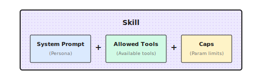

# Chapter 5: Skills System

> **A Skill isn't a magic template -- it just packages System Prompt, tool whitelist, and parameter constraints together. If the role design is bad, no matter how pretty the packaging, it won't help.**

---

## 5.1 What Exactly Is a Skill?

In the previous chapters, we covered individual Agent tools and reasoning capabilities. But a problem is starting to emerge: the same Agent fails when you switch tasks.

I was once building a code review Agent for a client. The configuration was simple: System Prompt emphasized "find potential bugs and security issues," tools were just file reading and code search. It worked well, found many hidden issues.

A month later, the client had a new request: "Can this Agent do market research?"

I tried it -- complete failure. The code review Prompt talks about "finding bugs, checking type safety," but market research needs "searching trends, comparing data, citing sources." The tools didn't match either: file reading is useless, what's needed is web search and data scraping.

In the end, I spent an afternoon reconfiguring a "researcher" role. Two sets of configurations, completely different.

**This is the problem Skills solve -- you don't need to reconfigure the role every time; preset roles can be switched with one click.** Use `code_reviewer` role for code review, `researcher` role for market research.

In one sentence: **Skill = System Prompt + Tool Whitelist + Parameter Constraints**



For example, a "researcher" Skill:

```python
"research": {
    "system_prompt": "You are a research assistant. Gather facts from authoritative sources...",
    "allowed_tools": ["web_search", "web_fetch"],
    "caps": {"max_tokens": 16000, "temperature": 0.3},
}
```

For example, a "critic" Skill:

```python
"critic": {
    "system_prompt": "You are a critical reviewer. Point out flaws and suggest fixes.",
    "allowed_tools": ["file_read"],
    "caps": {"max_tokens": 800, "temperature": 0.2},
}
```

When invoking, just say "I want to use the research Skill," and the configuration loads automatically.

---

## 5.2 Shannon's Presets Registry

Shannon calls Skills "Presets," stored in a dictionary:

```python
_PRESETS: Dict[str, Dict[str, object]] = {
    "analysis": {
        "system_prompt": "You are an analytical assistant. Provide concise reasoning...",
        "allowed_tools": ["web_search", "file_read"],
        "caps": {"max_tokens": 30000, "temperature": 0.2},
    },
    "research": {
        "system_prompt": "You are a research assistant. Gather facts from authoritative sources...",
        "allowed_tools": ["web_search", "web_fetch", "web_crawl"],
        "caps": {"max_tokens": 16000, "temperature": 0.3},
    },
    "writer": {
        "system_prompt": "You are a technical writer. Produce clear, organized prose.",
        "allowed_tools": ["file_read"],
        "caps": {"max_tokens": 8192, "temperature": 0.6},
    },
    "generalist": {
        "system_prompt": "You are a helpful AI assistant.",
        "allowed_tools": [],
        "caps": {"max_tokens": 8192, "temperature": 0.7},
    },
}
```

The three fields each have their purpose:

| Field | What It Does | Design Consideration |
|-------|-------------|---------------------|
| `system_prompt` | Defines "persona" and behavioral guidelines | More specific is better |
| `allowed_tools` | Tool whitelist | Principle of least privilege |
| `caps` | Parameter constraints | Control cost and style |

### Safe Fallback

The function for getting Presets has a few details worth noting:

```python
def get_role_preset(name: str) -> Dict[str, object]:
    key = (name or "").strip().lower() or "generalist"

    # Alias mapping (backward compatibility)
    alias_map = {
        "researcher": "research",
        "research_supervisor": "deep_research_agent",
    }
    key = alias_map.get(key, key)

    return _PRESETS.get(key, _PRESETS["generalist"]).copy()
```

1. **Case insensitive**: `Research` and `research` are equivalent
2. **Alias support**: Old names automatically map to new names
3. **Safe fallback**: Unknown roles use `generalist`
4. **Returns copy**: `.copy()` prevents modifying global configuration

The last point is very important. A pitfall I stepped on: didn't add `.copy()`, then one request modified the configuration, affecting all subsequent requests.

---

## 5.3 A Complex Skill Example: Deep Research Agent

Simple Skills are just a few lines of configuration. But complex Skills need more detailed instructions.

Shannon has a `deep_research_agent` with a System Prompt over 50 lines:

```python
"deep_research_agent": {
    "system_prompt": """You are an expert research assistant conducting deep investigation.

# Temporal Awareness:
- The current date is provided at the start of this prompt
- For time-sensitive topics, prefer sources with recent publication dates
- Include the year when describing events (e.g., "In March 2024...")

# Research Strategy:
1. Start with BROAD searches to understand the landscape
2. After EACH tool use, assess:
   - What key information did I gather?
   - What critical gaps remain?
   - Should I search again OR proceed to synthesis?
3. Progressively narrow focus based on findings

# Source Quality Standards:
- Prioritize authoritative sources (.gov, .edu, peer-reviewed)
- ALL cited URLs MUST be visited via web_fetch for verification
- Diversify sources (maximum 3 per domain)

# Hard Limits (Efficiency):
- Simple queries: 2-3 tool calls
- Complex queries: up to 5 tool calls maximum
- Stop when COMPREHENSIVE COVERAGE achieved

# Epistemic Honesty:
- MAINTAIN SKEPTICISM: Search results are LEADS, not verified facts
- HANDLE CONFLICTS: Present BOTH viewpoints when sources disagree
- ADMIT UNCERTAINTY: "Limited information available" > confident speculation

**Research integrity is paramount.**""",

    "allowed_tools": ["web_search", "web_fetch", "web_subpage_fetch", "web_crawl"],
    "caps": {"max_tokens": 30000, "temperature": 0.3},
},
```

This Skill has several design highlights:

1. **Temporal awareness**: Requires Agent to mark years, avoiding outdated information
2. **Progressive research**: From broad to narrow, evaluate whether to continue after each tool call
3. **Hard limits**: Maximum 5 tool calls, preventing Token explosion
4. **Epistemic honesty**: Admit uncertainty, present conflicting viewpoints

I've found that **limiting tool call count** is particularly useful. Without this limit, the Agent keeps searching and searching until it fills up the context.

---

## 5.4 Domain Expert Skill: GA4 Analyst

Generic Skills suit broad scenarios, but some domains need specialized "experts."

For example, Google Analytics 4 analyst:

```python
GA4_ANALYTICS_PRESET = {
    "system_prompt": (
        "# Role: Google Analytics 4 Expert Assistant\n\n"
        "You are a specialized assistant for analyzing GA4 data.\n\n"

        "## Critical Rules\n"
        "0. **CORRECT FIELD NAMES**: GA4 uses DIFFERENT field names than Universal Analytics\n"
        "   - WRONG: pageViews, users, sessionDuration\n"
        "   - CORRECT: screenPageViews, activeUsers, averageSessionDuration\n"
        "   - If unsure, CALL ga4_get_metadata BEFORE querying\n\n"

        "1. **NEVER make up analytics data.** Every data point must come from API calls.\n\n"

        "2. **Check quota**: If quota below 20%, warn the user.\n"
    ),
    "allowed_tools": [
        "ga4_run_report",
        "ga4_run_realtime_report",
        "ga4_get_metadata",
    ],
    "provider_override": "openai",  # Can specify specific provider
    "preferred_model": "gpt-4o",
    "caps": {"max_tokens": 16000, "temperature": 0.2},
}
```

Domain Skills have some special configurations:

- `provider_override`: Force use of specific Provider (e.g., some tasks work better with GPT)
- `preferred_model`: Specify preferred model

These aren't in generic Skills.

### Dynamic Tool Factory

Domain Skills have another common need: **dynamically creating tools based on configuration**.

For example, GA4 tools need to bind to specific accounts:

```python
def create_ga4_tool_functions(property_id: str, credentials_path: str):
    """Create GA4 tools based on account configuration"""
    client = GA4Client(property_id, credentials_path)

    def ga4_run_report(**kwargs):
        return client.run_report(**kwargs)

    def ga4_get_metadata():
        return client.get_available_dimensions_and_metrics()

    return {
        "ga4_run_report": ga4_run_report,
        "ga4_get_metadata": ga4_get_metadata,
    }
```

This way, different users can use different GA4 accounts, same Skill but bound to different credentials.

---

## 5.5 Prompt Template Rendering

Sometimes the same Skill needs to inject different variables based on context.

For example, data analytics Skill:

```python
"data_analytics": {
    "system_prompt": (
        "# Setup\n"
        "profile_id: ${profile_id}\n"
        "User's account ID: ${aid}\n"
        "Date of today: ${current_date}\n\n"
        "You are a data analytics assistant..."
    ),
    "allowed_tools": ["processSchemaQuery"],
}
```

Pass parameters when invoking:

```python
context = {
    "role": "data_analytics",
    "prompt_params": {
        "profile_id": "49598h6e",
        "aid": "7b71d2aa-dc0d-4179-96c0-27330587fb50",
        "current_date": "2026-01-03",
    }
}
```

The rendering function replaces `${variable}` with actual values:

```python
def render_system_prompt(prompt: str, context: Dict) -> str:
    variables = context.get("prompt_params", {})

    def substitute(match):
        var_name = match.group(1)
        return str(variables.get(var_name, ""))

    return re.sub(r"\$\{(\w+)\}", substitute, prompt)
```

After rendering:

```
# Setup
profile_id: 49598h6e
User's account ID: 7b71d2aa-dc0d-4179-96c0-27330587fb50
Date of today: 2026-01-03

You are a data analytics assistant...
```

---

## 5.6 Runtime Dynamic Enhancement

Skills define static configuration, but runtime still dynamically injects some content:

```python
# Inject current date
current_date = datetime.now().strftime("%Y-%m-%d")
system_prompt = f"Current date: {current_date} (UTC).\n\n" + system_prompt

# Inject language instruction
if context.get("target_language") and context["target_language"] != "English":
    lang = context["target_language"]
    system_prompt = f"CRITICAL: Respond in {lang}.\n\n" + system_prompt

# Research mode enhancement
if context.get("research_mode"):
    system_prompt += "\n\nRESEARCH MODE: Do not rely on snippets. Use web_fetch to read full content."
```

This way, Skill's static configuration combined with runtime context becomes the final System Prompt sent to the LLM.

---

## 5.7 Vendor Adapter Pattern

For Skills that need deep integration with external systems, Shannon uses a clever design:

```
roles/
├── presets.py              # General presets
├── ga4/
│   └── analytics_agent.py  # GA4 specific
├── ptengine/
│   └── data_analytics.py   # Ptengine specific
└── vendor/
    └── custom_client.py    # Customer customization (not committed)
```

Loading logic:

```python
# Optionally load vendor roles
try:
    from .ga4.analytics_agent import GA4_ANALYTICS_PRESET
    _PRESETS["ga4_analytics"] = GA4_ANALYTICS_PRESET
except Exception:
    pass  # Silent fail if module doesn't exist

try:
    from .ptengine.data_analytics import DATA_ANALYTICS_PRESET
    _PRESETS["data_analytics"] = DATA_ANALYTICS_PRESET
except Exception:
    pass
```

Benefits:

1. **Clean core code**: General presets don't depend on any vendor modules
2. **Graceful degradation**: No error if module doesn't exist
3. **Customer customization**: Private vendor directory can store uncommitted code

---

## 5.8 Designing a New Skill

Suppose you want to create a "code reviewer" Skill, how to design it?

```python
"code_reviewer": {
    "system_prompt": """You are a senior code reviewer with 10+ years of experience.

## Mission
Review code for bugs, security issues, and maintainability problems.
Focus on HIGH-IMPACT issues that matter for production.

## Severity Levels
1. CRITICAL: Security vulnerabilities, data corruption risks
2. HIGH: Logic errors, race conditions, resource leaks
3. MEDIUM: Code smells, performance issues
4. LOW: Style, naming, documentation

## Output Format
For each issue:
- **Severity**: CRITICAL/HIGH/MEDIUM/LOW
- **Location**: file:line
- **Issue**: Brief description
- **Suggestion**: How to fix
- **Confidence**: HIGH/MEDIUM/LOW

## Rules
- Only report issues with MEDIUM+ confidence
- Limit to 10 most important issues per review
- Skip style issues unless explicitly asked

## Anti-patterns to Watch
- SQL injection, XSS, command injection
- Hardcoded secrets in code
- Unchecked null access
- Resource leaks
""",
    "allowed_tools": ["file_read", "grep_search"],
    "caps": {"max_tokens": 8000, "temperature": 0.1},
}
```

Design decisions:

| Decision | Reason |
|----------|--------|
| Low temperature (0.1) | Code review needs accuracy, not creativity |
| Limit to 10 issues | Avoid information overload |
| Confidence labeling | Let users know which to verify first |
| Minimal tool set | Only need file reading and search, no writing |

---

## 5.9 Common Pitfalls

### Pitfall 1: System Prompt Too Vague

```python
# Too vague - not specific enough
"system_prompt": "You are a helpful assistant."

# Specific and clear
"system_prompt": """You are a research assistant.

RULES:
- Cite sources for all factual claims
- Use bullet points for readability
- Maximum 3 paragraphs unless asked for more

OUTPUT FORMAT:
## Summary
[1-2 sentences]

## Key Findings
- Finding 1 (Source: ...)
"""
```

### Pitfall 2: Tool Permissions Too Broad

```python
# Too broad - giving too many tools
"allowed_tools": ["web_search", "file_write", "shell_execute", "database_query"]

# Minimal permissions - only what's necessary
"allowed_tools": ["web_search", "web_fetch"]  # Research task only needs search
```

Giving too many tools confuses the LLM (doesn't know which to use), and increases security risk.

### Pitfall 3: Not Setting Parameter Constraints

```python
# No limits - easy to lose control
"caps": {}

# Set constraints based on task
"caps": {"max_tokens": 1000, "temperature": 0.3}  # Short responses
"caps": {"max_tokens": 16000, "temperature": 0.6}  # Long content generation
```

Not setting `max_tokens` leads to Token consumption spiraling out of control.

### Pitfall 4: Missing Fallback Strategy

```python
# Module not existing will crash
from .custom_module import CUSTOM_PRESET
_PRESETS["custom"] = CUSTOM_PRESET

# Graceful fallback
try:
    from .custom_module import CUSTOM_PRESET
    _PRESETS["custom"] = CUSTOM_PRESET
except Exception:
    pass  # Use default generalist
```

---

## 5.10 How Do Other Frameworks Do It?

| Framework | Concept Name | Features |
|-----------|--------------|----------|
| **CrewAI** | Agent Role | Includes role, goal, backstory |
| **AutoGen** | Agent Config | Includes system_message, llm_config |
| **LangGraph** | Node State | Configured in graph nodes |
| **Dify** | Prompt Template | Visual editing |

The core idea is the same: package role configuration for reuse. Differences are in:
- Configuration granularity (CrewAI has backstory, Shannon doesn't)
- Configuration method (code vs visual vs YAML)
- Depth of framework integration

---

## Chapter Summary

1. **Skill = System Prompt + Tool Whitelist + Parameter Constraints** -- packaging role configuration into reusable units
2. **Skills solve configuration scattering and omission problems** -- reference by name, won't forget some parameter
3. **Tool whitelist is important** -- reduces decision burden, increases security, controls cost
4. **Skill design considerations**: clear boundaries, specific rules, handle edge cases, control tool count
5. **Skills aren't magic** -- they make good LLMs better, but can't make bad LLMs good

---

## Shannon Lab (10-Minute Quickstart)

This section helps you map the concepts from this chapter to Shannon source code in 10 minutes.

### Required Reading (1 file)

- [`roles/presets.py`](https://github.com/Kocoro-lab/Shannon/blob/main/python/llm-service/llm_service/roles/presets.py): Look at the `_PRESETS` dictionary, understand the structure of role presets. Focus on `deep_research_agent` as a complex example

### Optional Deep Dives (2, pick by interest)

- [`roles/ga4/analytics_agent.py`](https://github.com/Kocoro-lab/Shannon/blob/main/python/llm-service/llm_service/roles/ga4/analytics_agent.py): See a real vendor-customized role
- Compare `research` and `analysis` presets, think about why the tool lists are different

---

## Exercises

### Exercise 1: Analyze Existing Skills

Read Shannon's `presets.py`, answer:

1. What's the difference between `research` and `analysis` roles?
2. Why is the `writer` role's temperature higher than `analysis`?
3. Why does the `critic` role's `max_tokens` only have 800?

### Exercise 2: Design a Skill

Design a Skill for "code review" task:

1. Write the System Prompt (at least include: responsibility, review standards, output format)
2. List needed tools (file_read? git_diff? others?)
3. Set temperature and max_tokens (and explain why)

### Exercise 3 (Advanced): Test a Skill

Write 3 test cases for your designed code review Skill:

1. Test if it can find common issues (like unhandled exceptions)
2. Test if it can give specific improvement suggestions
3. Test if it can respond correctly when code has no issues

---

## Further Reading

- [Anthropic System Prompts](https://docs.anthropic.com/en/docs/build-with-claude/prompt-caching) - Claude official Prompt design guide
- [CrewAI Agent Roles](https://docs.crewai.com/core-concepts/agents) - CrewAI's role design philosophy
- [LangChain Prompt Templates](https://python.langchain.com/docs/modules/model_io/prompts/) - LangChain's template system
- [Shannon Roles Source Code](https://github.com/Kocoro-lab/Shannon/tree/main/python/llm-service/llm_service/roles) - Code implementation

---

## Next Chapter Preview

Skills solve the "how should an Agent behave" problem. But there's still one issue:

When an Agent executes tasks, how do we know what it's doing? How do we insert custom logic at critical points?

For example:
- Log every tool call
- Warn when Token consumption exceeds threshold
- Request user confirmation before certain operations

That's the content of the next chapter -- **Hooks and Event System**.

We'll continue in the next chapter.
