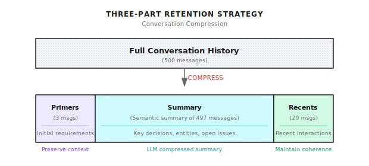
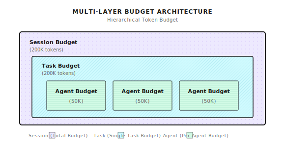

# Chapter 7: Context Window Management

> **The context window is the Agent's "workbench": too small and there's no room for materials, too large and costs explode. Manage it well, and the Agent can stay clear-headed in complex tasks.**
> **But this isn't magic—compression loses information, budgets limit capabilities. There's no free lunch.**

---

You ask the Agent to help debug a production issue.

After 50 rounds of conversation, it finally pinpoints that the database connection pool configuration is wrong.

Then you ask: "What was that connection pool configuration you mentioned earlier?"

It replies: "Sorry, I don't remember."

**You're stunned.**

50 rounds of conversation, burned through tens of thousands of tokens, and it forgot the critical information?

This isn't the Agent's problem—it's **poor context management**.

---

## 7.1 What's the Problem?

LLMs have something called a "context window"—you can think of it as the Agent's "workbench."

How much fits on the workbench depends on the window size.

> Note (2026-01): Model context windows and pricing change frequently. The following are illustrative examples. Please check official documentation for the latest information.

| Model | Context Window | Approximate Word Count |
|-------|---------------|----------------------|
| GPT-4o | 128K tokens | ~100K words |
| Claude 3.5 Sonnet | 200K tokens | ~160K words |
| Gemini 1.5 Pro | 2M tokens | ~1.6M words |
| Common open-source models | 4K - 32K | ~3K-25K words |

Looks big? 1.6 million words, you could fit a whole book.

But think about real scenarios:

- 50 rounds of conversation, averaging 500 tokens each
- System Prompt takes 2000 tokens
- Tool definitions (about 200 tokens per tool, 10 tools is 2000)
- History keeps growing...

It fills up fast.

**What's worse, every token costs money:**

```
500 tokens per round × 50 rounds = 25,000 tokens (input)
GPT-4o input price $2.5/million tokens
Input cost for 50 rounds ≈ $0.0625

Doesn't sound like much? But this is just one session.
If there are 100,000 sessions per day, each with 50 rounds...
Daily cost = $6,250 = $187,500/month
```

And that's not counting output tokens (which are more expensive).

**Context management needs to solve four core problems:**

| Problem | Consequence | Solution Direction |
|---------|-------------|-------------------|
| **Overflow** | Request fails outright, user experience crashes | Compression, trimming |
| **Cost** | Longer history means more expensive requests | Budget control |
| **Information Loss** | Critical context gets truncated, Agent gets confused | Smart retention |
| **Noise Interference** | Too much irrelevant information degrades answer quality | Relevance filtering |

These four problems conflict with each other: compress and you lose information, don't compress and you overflow the budget.

**There's no perfect solution, only trade-offs.**

---

## 7.2 Tokens: The Agent's Unit of Measurement

Before discussing solutions, let's clarify what tokens are.

### What Are Tokens?

> Note (2026-01): Token counting depends on the specific tokenizer (GPT-4 uses cl100k_base, Claude uses its own tokenizer). The following conversions are approximate. In practice, please call `tiktoken` or the corresponding SDK's token counting API.

Tokens aren't characters, and they aren't words. They're the smallest units that LLMs use to "segment" text.

```
English: "Hello world" → ["Hello", " world"] → 2 tokens
Chinese: "你好世界" → ["你", "好", "世", "界"] → 4 tokens (roughly)
Code: "function foo() {}" → ["function", " foo", "()", " {}"] → 4 tokens
```

Different languages have different token efficiencies:

| Language | Average token/characters | Notes |
|----------|-------------------------|-------|
| English | ~4 characters/token | Split by word roots |
| Chinese | ~1.5 characters/token | Each character is about 1-2 tokens |
| Code | ~3 characters/token | Many symbols, high token density |

This means: the same semantic content may consume more tokens in Chinese than in English.

### Why Not Use Exact Counting?

Precise token counting requires a tokenizer implementation (e.g., `tiktoken`) and CPU time. In some production setups, teams prefer cheap estimates to avoid extra dependencies or per-request overhead.

Shannon uses an estimation method that's proven accurate enough in practice:

```go
// Simplified token estimation
func EstimateTokens(messages []Message) int {
    total := 0
    for _, msg := range messages {
        // Roughly 1 token per 4 characters
        total += len([]rune(msg.Content)) / 4
        // Each message has formatting overhead (role, content structure)
        total += 5
    }
    // Add 10% safety margin
    return int(float64(total) * 1.1)
}
```

| Component | Estimation Method | Notes |
|-----------|------------------|-------|
| Plain text | characters / 4 | Standard GPT estimation |
| Message format | +5 per message | role/content structure overhead |
| Code | characters / 3 | Higher token density in code |
| Safety margin | +10% | Prevent underestimation |

I've tested this—the estimation error is within 10-15%, which is sufficient for budget control.

---

## 7.3 Sliding Window Compression

This is Shannon's core strategy: **keep what's important, compress the middle**.

### Core Concept

```
Original conversation history (500 messages, ~100K tokens)
                ↓
    [first 3] + [middle compressed to summary] + [last 20]
                ↓
Compressed (23 messages + summary, ~15K tokens)
```

Why design it this way?

- **First 3 (Primers)**: Preserve context establishment. What the user initially said about their needs, what the system set up.
- **Middle portion (Summary)**: Compress to semantic summary. Key decisions, findings, unresolved issues.
- **Last 20 (Recents)**: Preserve recent conversation. Maintain coherence—when the user says "that thing just now," it can be found.

### When Does Compression Trigger?

Not every time—that would waste too much computational resources. Shannon's strategy:

```
Budget usage >= 75%  →  Trigger compression
Compression target  →  37.5% of budget
```

For example, if budget is 50K tokens, compression starts at 37.5K, targeting around 18.75K.

Why 75% and 37.5%?

- **75%**: Leave 25% headroom for the current round's input/output
- **37.5%**: Compress to under half, leaving more room for subsequent conversation

These numbers aren't fixed—you can adjust based on scenario. For debugging scenarios, you can raise the trigger threshold (e.g., 85%) to let the Agent see more history.

### The Cost of Compression

**Compression loses information. This must be acknowledged.**

A 10,000-word conversation compressed to a 500-word summary cannot possibly retain all the details.

What summaries can preserve:
- Key decision points
- Important discoveries
- Unresolved issues
- Entities and relationships

What summaries will lose:
- Specific code details
- Trial-and-error processes in between
- User's emotional expressions
- Contextual implications

So compression isn't a cure-all. Some scenarios (like code debugging) need a larger context window, not more aggressive compression.

---

## 7.4 Three-Part Retention Strategy



### Primers: Why Keep the Beginning?

The "context" of a conversation is often established at the beginning.

The user's first message might be: "I'm debugging a network issue in a Kubernetes cluster where Pods can't communicate with each other."

This background information is important for the entire conversation. If lost, the Agent might give completely irrelevant suggestions later.

Default keeps the first 3 messages:

```yaml
primers_count: 3  # Configurable
```

When should you adjust?

- **Multi-round confirmation scenarios**: User might spend the first 5 rounds confirming requirements—adjust to 5
- **Simple Q&A scenarios**: The first message is a complete question—adjust to 1

### Summary: Middle Compression

The middle conversations are compressed into a summary using the LLM.

Shannon calls the llm-service's `/context/compress` endpoint:

```python
# Compression implementation on llm-service side (conceptual example)
async def compress_context(messages: list, target_tokens: int = 400):
    prompt = f"""Compress this conversation into a factual summary.

Focus on:
- Key decisions made
- Important discoveries
- Unresolved questions
- Named entities and their relationships

Keep the summary under {target_tokens} tokens.
Use the SAME LANGUAGE as the conversation.

Conversation:
{format_messages(messages)}
"""

    result = await providers.generate_completion(
        messages=[{"role": "user", "content": prompt}],
        tier=ModelTier.SMALL,  # Use small model to save money
        max_tokens=target_tokens,
        temperature=0.2,  # Low temperature for accuracy
    )
    return result["output_text"]
```

A summary looks like this:

```
Previous context summary:
The user is debugging a Kubernetes network issue. Key findings:
- Pods cannot access external services
- CoreDNS configuration is normal
- NetworkPolicy has restrictions
To be resolved: Confirm specific NetworkPolicy rule configuration
```

### Recents: Maintaining Conversation Coherence

Keep the most recent 20 messages.

This is the "hot" context—what the user just said, what the Agent just answered, all here.

When the user says "that solution earlier," the Agent can find it in Recents.

```yaml
recents_count: 20  # Configurable
```

Adjustment suggestions:

- **Debugging scenarios**: Increase to 30-50, preserve more details
- **Simple Q&A**: Decrease to 10, save tokens

---

## 7.5 Token Budget Management

Compression alone isn't enough. You also need **budget control**—set a hard limit, stop when exceeded.

### Multi-Layer Budget Architecture

Shannon implements three layers of budget control:



- **Session Budget**: Total budget for the entire session
- **Task Budget**: Budget for a single task
- **Agent Budget**: Budget for a single Agent (multi-Agent scenarios)

Why the layering?

A complex task might call multiple Agents (research, analysis, writing). If there's only one total budget, the first Agent might burn through it all, leaving nothing for the others.

Layered budgets give each Agent its own allocation, preventing mutual crowding.

### Budget Check Logic

Check budget before each request:

```go
func (bm *BudgetManager) CheckBudget(sessionID string, estimatedTokens int) *BudgetCheckResult {
    budget := bm.sessionBudgets[sessionID]
    result := &BudgetCheckResult{CanProceed: true}

    // Check for overflow
    if budget.TaskTokensUsed + estimatedTokens > budget.TaskBudget {
        if budget.HardLimit {
            result.CanProceed = false
            result.Reason = "Task budget exceeded"
        } else {
            result.RequireApproval = budget.RequireApproval
            result.Warnings = append(result.Warnings, "Will exceed budget")
        }
    }

    // Check warning threshold (e.g., warn at 80%)
    usagePercent := float64(budget.TaskTokensUsed) / float64(budget.TaskBudget)
    if usagePercent > budget.WarningThreshold {
        bm.emitWarningEvent(sessionID, usagePercent)
    }

    return result
}
```

### Hard Limit vs Soft Limit vs Approval Mode

| Mode | Behavior | Use Case |
|------|----------|----------|
| **Hard Limit** | Reject when over budget | Cost-sensitive, API services |
| **Soft Limit** | Warn when over budget, continue execution | Task priority, internal tools |
| **Approval Mode** | Pause when over budget, wait for human confirmation | Scenarios requiring human oversight |

Which to choose? Depends on your scenario:

- **External API**: Hard limit, prevent a single user from burning all resources
- **Internal debugging**: Soft limit, completing the task matters more
- **Critical tasks**: Approval mode, let humans confirm whether to continue when over budget

---

## 7.6 Backpressure Mechanism

When budget pressure increases, instead of suddenly stopping, implement gradual rate limiting.

```go
func calculateBackpressureDelay(usagePercent float64) time.Duration {
    switch {
    case usagePercent >= 0.95:
        return 1500 * time.Millisecond  // Heavy throttling
    case usagePercent >= 0.9:
        return 750 * time.Millisecond
    case usagePercent >= 0.85:
        return 300 * time.Millisecond
    case usagePercent >= 0.8:
        return 50 * time.Millisecond    // Light throttling
    default:
        return 0                         // Normal execution
    }
}
```

Benefits of this approach:

1. **User awareness**: Slower response signals to use sparingly
2. **Smooth degradation**: Not a sudden cutoff, provides buffer time
3. **Auto-recovery**: Returns to normal when usage drops

Backpressure isn't a cure-all. If users ignore the slowdown signal and keep burning tokens, hard limits will eventually trigger.

---

## 7.7 Configuration Best Practices

### Scenario-Specific Configuration

Different scenarios need different configurations:

**General Q&A Scenario**

```yaml
session:
  context_window_default: 30
  token_budget_per_agent: 25000
  primers_count: 2
  recents_count: 10
```

Characteristics: Small budget, small window, saves money. Suitable for simple Q&A, customer service scenarios.

**Debugging/Development Scenario**

```yaml
session:
  context_window_debugging: 100
  token_budget_per_agent: 75000
  primers_count: 5
  recents_count: 30
```

Characteristics: Large budget, large window, preserves more context. Suitable for code debugging, complex analysis.

**Long-Running Task Scenario**

```yaml
session:
  context_window_default: 75
  token_budget_per_task: 300000
  max_history: 1000
```

Characteristics: Large task budget, many history entries. Suitable for research tasks, document generation.

### Request-Level Override

Sometimes you need to override configuration at the request level:

```json
{
  "query": "Fix the race condition in worker pool",
  "context": {
    "use_case_preset": "debugging",
    "history_window_size": 100,
    "token_budget_per_agent": 60000
  }
}
```

Priority order:
1. Request-level override (highest)
2. Use case preset (use_case_preset)
3. Environment variables
4. Configuration file defaults

---

## 7.8 Compression Results

Real-world data:

| Scenario | Original Tokens | After Compression | Compression Rate | Notes |
|----------|----------------|-------------------|-----------------|-------|
| 50 messages | ~10k | No compression | 0% | Threshold not triggered |
| 100 messages | ~25k | ~12k | 52% | Light compression |
| 500 messages | ~125k | ~15k | 88% | Heavy compression |
| 1000 messages | ~250k | ~15k | 94% | Maximum compression |

Compression overhead:

| Operation | Time | Notes |
|-----------|------|-------|
| Token estimation | <5ms | Local computation |
| History reshaping | <1ms | Slice operation |
| Summary generation (LLM) | 200-500ms | Main overhead |
| Total compression overhead | ~500ms | Only runs when triggered |

Summary generation is the slowest, but only runs when compression triggers, not on every request.

---

## 7.9 Common Pitfalls

### Pitfall 1: Compression Threshold Set Too High

```yaml
# Triggers too late, no headroom for current round
COMPRESSION_TRIGGER_RATIO=0.95

# Leave enough headroom (recommended)
COMPRESSION_TRIGGER_RATIO=0.75
```

**Consequence**: By the time compression triggers, you're already near the limit. After compression, there's still not enough room, and the request fails.

### Pitfall 2: Poor Primers/Recents Configuration

```yaml
# Too few Primers, initial context lost
primers_count: 1
recents_count: 50

# Balanced configuration (recommended)
primers_count: 3
recents_count: 20
```

**Consequence**: Too few Primers means the Agent forgets the initial requirements; too many Recents means the summary is too short and all middle information is lost.

### Pitfall 3: Hard Limit + Small Budget

```yaml
# Budget too small, hard limit causes frequent task failures
token_budget_per_agent: 10000
hard_limit: true

# Reasonable budget + soft limit (recommended)
token_budget_per_agent: 50000
hard_limit: false
require_approval: true
```

**Consequence**: Slightly complex tasks exceed budget, terrible user experience.

### Pitfall 4: Inconsistent Session IDs

```bash
# New session for each request, disconnected history
SESSION_ID="session-$(date +%s)"

# Use the same session ID for related work (recommended)
SESSION_ID="feature-xyz-debug"
```

**Consequence**: Every request is a new session, context window management becomes useless, history is completely disconnected.

### Pitfall 5: Ignoring Compression Quality

Compression summary quality depends on:
- The capability of the summary model
- The design of the compression prompt
- The reasonableness of the target token count

**Consequence**: Summary too short loses key information; summary too vague lacks actionable details.

Suggestion: Periodically audit compression summary quality to ensure key information is preserved.

---

## Shannon Lab (10-Minute Quick Start)

This section helps you map this chapter's concepts to Shannon source code in 10 minutes.

### Required Reading (1 file)

- [`docs/context-window-management.md`](https://github.com/Kocoro-lab/Shannon/blob/main/docs/context-window-management.md): Focus on "Sliding Window Compression", "Token Budget Management", and "Configuration" sections to understand compression trigger conditions and multi-layer budgets

### Optional Deep Dive (2 files, choose based on interest)

- [`activities/context_compress.go`](https://github.com/Kocoro-lab/Shannon/blob/main/go/orchestrator/internal/activities/context_compress.go): Look at the `CompressAndStoreContext` function to understand the compression flow, PII redaction, and vector storage
- [`budget/manager.go`](https://github.com/Kocoro-lab/Shannon/blob/main/go/orchestrator/internal/budget/manager.go): Look at `CheckBudget` and `calculateBackpressureDelay` to understand budget check logic and backpressure mechanism

---

## Exercises

### Exercise 1: Configuration Optimization

You have a code debugging scenario where users frequently complain that "the Agent forgets what was said before."

Write your configuration adjustment plan:
- Which parameters to adjust?
- Why make these adjustments?
- What are the trade-offs?

### Exercise 2: Source Code Reading

Read `context_compress.go` and answer:
1. What types of sensitive information does the `redactPII` function handle?
2. Why use `[]rune` instead of truncating `string` directly?
3. What happens if the embedding service is unavailable?

### Exercise 3 (Advanced): Design a New Feature

Design an "important message marking" feature: users can mark certain messages as "important," and these messages cannot be deleted during compression.

Think about:
- How to design the data structure?
- How to modify the compression logic?
- What if too many messages are marked, exceeding the budget?

---

## Key Takeaways

The core message: **The context window is the Agent's workbench—manage it poorly and it will forget, overflow, and burn money**.

Key points:

1. **Token Estimation**: ~4 characters/token + 5 tokens per message format overhead
2. **Sliding Window Compression**: Primers (first 3) + Summary (middle compressed) + Recents (last 20)
3. **Multi-Layer Budget**: Session - Task - Agent three-level control
4. **Backpressure Mechanism**: Gradually increase delay as usage increases
5. **Compression is Lossy**: Key information may be lost; it's not a cure-all

Context window management solves the "short-term memory" problem—context within a single conversation. But how does the Agent maintain "long-term memory" across sessions and tasks?

Next chapter we'll discuss **Memory Architecture**—how to implement semantic retrieval and knowledge accumulation through vector databases.

Ready? Let's move on.

---

## Further Reading

- [OpenAI Tokenizer](https://platform.openai.com/tokenizer) - Experience token segmentation online
- [Anthropic Context Window](https://docs.anthropic.com/en/docs/build-with-claude/context-windows) - Claude's context window documentation
- [Shannon Context Window Management](https://github.com/Kocoro-lab/Shannon/blob/main/docs/context-window-management.md) - Shannon's complete documentation
