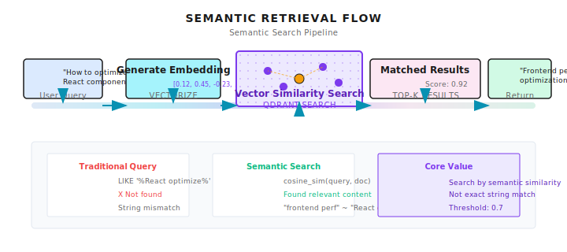
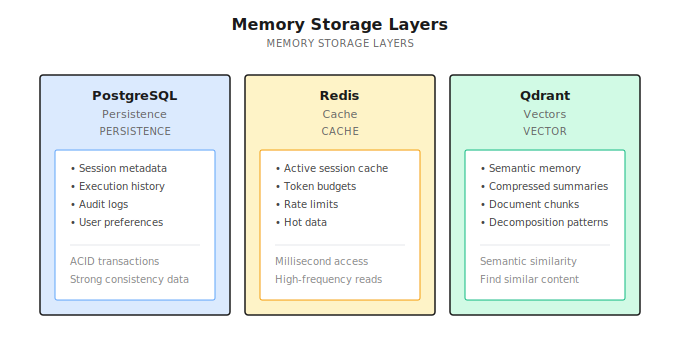

# Chapter 8: Memory Architecture

> **A memory system transforms an Agent from "a stranger every time" to "gets to know you better over time." But don't expect it to remember everything—vector similarity isn't exact matching, and recall vs. precision requires trade-offs.**

---

You ask the Agent to help you research a technical solution for a week.

Chatting every day, discussing dozens of details. Finally settled on a solution.

A week later you come back and ask: "Which solution did we choose last time?"

It replies: "Sorry, I don't know what you're talking about."

**You're dumbfounded.**

A week of discussion, all forgotten? Is this a joke?

This isn't the Agent's problem—it's **having no memory system**.

The context window management from the last chapter handles memory "within a single conversation." But when users close the browser, switch devices, or come back days later, that context is gone.

In real scenarios, users will:
- Continue yesterday's topic after an interruption
- Want the Agent to remember their preferences
- Not want to re-explain background information every time

An Agent without a memory system is like someone with amnesia—having to reintroduce themselves at every meeting.

---

## 8.1 Types of Memory

Not all memory is the same. I categorize it into four types:

| Type | Time Span | Examples | Storage Method |
|------|-----------|----------|----------------|
| **Working Memory** | Seconds to minutes | Code snippet being processed | Context window |
| **Session Memory** | Minutes to hours | This conversation's history | Redis cache |
| **Long-term Memory** | Days to months | User preferences, successful patterns | PostgreSQL |
| **Semantic Memory** | Permanent | Related historical Q&A, knowledge base | Vector database |

Working memory and session memory were already covered in the last chapter on context window management.

This chapter focuses on **long-term memory and semantic memory**—how to make the Agent remember things across sessions.

---

## 8.2 Why Traditional Databases Aren't Enough?

You might think: why not just store history in MySQL/PostgreSQL?

The problem is: **users don't query exactly**.

A user asks "How to optimize React components?" but what you have stored is "Frontend rendering performance improvement solutions."

The strings are completely different, but semantically related.

```sql
-- Traditional query: finds nothing
SELECT * FROM memories WHERE content LIKE '%React component optimization%';

-- What the user actually needs: semantically related history
-- "Frontend rendering performance" ≈ "React component optimization"
```

This is the value of vector databases: **retrieve by semantic similarity, not exact matching**.



---

## 8.3 Storage Layer Design

Shannon's memory system uses three types of storage, each serving a purpose:



### Why Three Types?

**PostgreSQL**: Data requiring ACID transactions.
- Execution history: which Agent did what, succeeded or failed
- Audit logs: who did what operation when
- User preferences: explicitly saved configurations

**Redis**: Hot data cache, millisecond-level access.
- Active sessions: reduce database queries
- Token budget: real-time tracking, requires atomic operations
- Rate limiting: high-frequency reads and writes

**Qdrant**: Vector similarity search.
- Semantic memory: find "similar meaning" history
- Compressed summaries: summary storage from the last chapter
- Document chunks: knowledge base for RAG scenarios

### Why Qdrant?

There are many vector database choices: Pinecone, Milvus, Weaviate, Qdrant...

Shannon chose Qdrant mainly because:
- **Open source, self-hosted**: Not dependent on SaaS, data stays in your hands
- **Good performance**: Rust implementation, millions of vectors on a single machine
- **Simple API**: Low learning curve

But this isn't the only choice. If you use Pinecone or Milvus, the core concepts are the same.

### An Alternative Approach: Local File Storage

Everything above is about server-side storage. But since 2025, another pattern has become increasingly popular in developer tools: **using local files directly for persistence**.

Representative examples:
- **Claude Code**: Uses `CLAUDE.md` files for project-level memory, `~/.claude/` directory for user-level preferences
- **Cursor**: Uses `.cursor/` directory for project context and rules
- **Windsurf**: Similar local file approach

The advantages of this approach are straightforward:
- **Zero deployment**: No database services needed
- **Version control friendly**: Can be directly git committed
- **Human-readable and editable**: Markdown files, user-friendly
- **Privacy**: Data never leaves local machine

But there are obvious limitations:
- **Not suitable for multi-device sync**: Unless you use cloud storage
- **Weak semantic retrieval**: File content can only be keyword-matched, no vector similarity
- **Scale limitations**: Files that are too large affect read speed

Shannon chose server-side storage because the target scenario is multi-tenant, multi-device, enterprise applications requiring semantic retrieval.

But if you're building a single-machine developer tool, local file storage is worth considering—simple, transparent, user-controlled.

---

## 8.4 How Does Semantic Retrieval Work?

Core flow:

```
User question: "How to optimize React components?"
            │
            ▼
    Generate question's Embedding vector
            │
            ▼
    Search for similar vectors in Qdrant
            │
            ▼
    Return: "Previously discussed frontend performance optimization solution..."
```

### What Is Embedding?

Converting text into a series of numbers (a vector). Semantically similar texts have similar vectors.

```python
# Two semantically similar sentences
text1 = "React component performance optimization"
text2 = "Frontend rendering efficiency improvement"

vec1 = embedding_model.encode(text1)  # [0.12, 0.45, -0.23, ...]
vec2 = embedding_model.encode(text2)  # [0.11, 0.43, -0.21, ...]

# Calculate cosine similarity
similarity = cosine_sim(vec1, vec2)  # 0.92 - very similar
```

Vector dimensions are typically 768 or 1536. OpenAI's `text-embedding-3-small` is 1536 dimensions.

### Embedding Model Selection

> Note (2026-01): Model pricing changes frequently. Please check vendor websites for the latest prices.

| Model | Dimensions | Price | Notes |
|-------|------------|-------|-------|
| `text-embedding-3-small` | 1536 | $0.02/M tokens | OpenAI recommended |
| `text-embedding-3-large` | 3072 | $0.13/M tokens | More accurate but more expensive |
| `bge-large-zh` | 1024 | Free (local) | Optimized for Chinese |
| `multilingual-e5-large` | 1024 | Free (local) | Multilingual |

Shannon defaults to `text-embedding-3-small`, balancing cost and effectiveness.

### Similarity Threshold

When retrieving, you need to set a threshold—too high and you find nothing, too low and you get garbage:

```go
// Too high, almost nothing matches
Threshold: 0.95

// Too low, returns irrelevant content
Threshold: 0.3

// Tested to be reasonably balanced
Threshold: 0.7
```

I've tested this—0.7 is a good starting point. Adjust for specific scenarios:
- **Precise scenarios (code search)**: Increase to 0.8
- **Broad scenarios (creative exploration)**: Decrease to 0.6

---

## 8.5 Hierarchical Memory Retrieval

Pure semantic retrieval isn't enough. In practice, you need to combine multiple strategies:

```
User asks: "Continue our previous discussion"
              │
              ├── Recent (last 5 items)
              │   └── Maintain conversation coherence
              │
              ├── Semantic (3 related items)
              │   └── Find related history
              │
              └── Summary (2 items)
                  └── Quickly understand long-term context
```

### Why Hierarchical?

- **Recent**: When the user says "that thing just now," you need recent conversation
- **Semantic**: When the user asks about a related topic, you need related history
- **Summary**: Compressed summaries of long conversations quickly establish context

Three layers merged, deduplicated, then returned.

### Implementation Reference

Shannon's `FetchHierarchicalMemory` function:

```go
func FetchHierarchicalMemory(ctx context.Context, in Input) (Result, error) {
    result := Result{Items: []Item{}, Sources: map[string]int{}}
    seen := make(map[string]bool)  // For deduplication

    // 1. Time dimension: most recent N items
    if in.RecentTopK > 0 {
        recent := FetchSessionMemory(ctx, in.SessionID, in.RecentTopK)
        for _, item := range recent {
            item["_source"] = "recent"  // Mark source
            result.Items = append(result.Items, item)
            seen[item.ID] = true
        }
    }

    // 2. Semantic dimension: N related items
    if in.SemanticTopK > 0 && in.Query != "" {
        semantic := FetchSemanticMemory(ctx, in.Query, in.SemanticTopK)
        for _, item := range semantic {
            if !seen[item.ID] {  // Deduplicate
                item["_source"] = "semantic"
                result.Items = append(result.Items, item)
                seen[item.ID] = true
            }
        }
    }

    // 3. Compression dimension: historical summaries
    if in.SummaryTopK > 0 {
        summaries := FetchSummaries(ctx, in.Query, in.SummaryTopK)
        for _, item := range summaries {
            item["_source"] = "summary"
            result.Items = append(result.Items, item)
        }
    }

    // 4. Limit total count, prevent context explosion
    maxTotal := 10
    if len(result.Items) > maxTotal {
        result.Items = result.Items[:maxTotal]
    }

    return result, nil
}
```

The `_source` marker is important. During subsequent processing, you can decide priority based on source:
- Information from Recent source: prioritize when user explicitly mentions
- Information from Semantic source: use as background reference
- Information from Summary source: helps establish long-term context

---

## 8.6 Memory Storage: Deduplication and Chunking

Storing memory isn't simply "store everything." There are three key issues:

### Issue 1: Duplicate Content

Users asking similar questions shouldn't result in multiple stored copies.

```go
// Check if duplicate (95% similarity threshold)
const duplicateThreshold = 0.95

similar, _ := vdb.Search(ctx, queryEmbedding, 1, duplicateThreshold)
if len(similar) > 0 && similar[0].Score > duplicateThreshold {
    // Skip, something similar already exists
    return
}
```

### Issue 2: Chunking Long Answers

An answer might be very long. Storing it as one large vector produces poor retrieval results—because long text embeddings "dilute" the semantics.

Store in chunks, aggregate when retrieving:

```go
// Store long text in chunks
if len(answer) > chunkThreshold {  // e.g., 2000 tokens
    chunks := chunker.ChunkText(answer, ChunkConfig{
        MaxTokens:    2000,
        OverlapTokens: 200,  // Overlap between chunks maintains context
    })

    // Batch generate embeddings (one API call, saves money)
    embeddings := svc.GenerateBatchEmbeddings(ctx, chunks)

    // Store each chunk separately, but share qa_id
    qaID := uuid.New().String()
    for i, chunk := range chunks {
        payload := map[string]interface{}{
            "query":       query,
            "chunk_text":  chunk.Text,
            "qa_id":       qaID,           // For aggregation
            "chunk_index": i,
            "chunk_count": len(chunks),
        }
        vdb.Upsert(ctx, embeddings[i], payload)
    }
}
```

When retrieving, aggregate chunks from the same answer using `qa_id`:

```go
// Aggregate after retrieval
results := vdb.Search(ctx, queryVec, 10, 0.7)

// Group by qa_id
grouped := make(map[string][]Result)
for _, r := range results {
    qaID := r.Payload["qa_id"].(string)
    grouped[qaID] = append(grouped[qaID], r)
}

// Reconstruct full answer
for qaID, chunks := range grouped {
    // Sort by chunk_index
    sort.Slice(chunks, func(i, j int) bool {
        return chunks[i].Payload["chunk_index"].(int) < chunks[j].Payload["chunk_index"].(int)
    })
    // Concatenate
    fullAnswer := ""
    for _, chunk := range chunks {
        fullAnswer += chunk.Payload["chunk_text"].(string)
    }
}
```

### Issue 3: Low-Value Content

Not all content is worth storing:

```go
// Skip low-value content
if len(answer) < 50 {
    return  // Too short, no information value
}

if containsError(answer) {
    return  // Error messages, don't pollute memory
}

if isSmallTalk(query) {
    return  // Chitchat, no memory value
}
```

---

## 8.7 Agent-Level Isolation

In multi-Agent scenarios, each Agent can have its own memory space.

```go
type FetchAgentMemoryInput struct {
    SessionID string
    AgentID   string  // Key: Agent-level isolation
    TopK      int
}

func FetchAgentMemory(ctx context.Context, in Input) (Result, error) {
    // Filter by session_id + agent_id
    filter := map[string]interface{}{
        "session_id": in.SessionID,
        "agent_id":   in.AgentID,
    }
    items := vdb.SearchWithFilter(ctx, queryVec, filter, in.TopK)
    return Result{Items: items}, nil
}
```

Scenario: Research Agent and Code Agent each have their own memory, without interfering with each other.

Research Agent remembers "user's views on competitors," Code Agent remembers "user's coding preferences."

If mixed together, Code Agent might bring up competitive analysis while writing code—that would be weird.

---

## 8.8 Strategy Learning (Advanced)

More advanced memory doesn't just store "Q&A pairs"—it can also learn "what methods work."

### Decomposition Pattern Memory

Remember successful task decomposition approaches:

```go
type DecompositionMemory struct {
    QueryPattern string    // "Optimize API performance"
    Subtasks     []string  // Subtasks it was decomposed into
    Strategy     string    // "parallel" or "sequential"
    SuccessRate  float64   // Success rate of this decomposition approach
    UsageCount   int       // How many times it's been used
}
```

Next time you encounter a similar task, you can reuse successful decomposition patterns:

```go
func (advisor *DecompositionAdvisor) Suggest(query string) Suggestion {
    // Find similar successful decompositions from history
    for _, prev := range advisor.Memory.DecompositionHistory {
        if similar(query, prev.QueryPattern) > 0.8 && prev.SuccessRate > 0.9 {
            return Suggestion{
                Subtasks:   prev.Subtasks,
                Strategy:   prev.Strategy,
                Confidence: prev.SuccessRate,
                Reason:     "Based on similar successful task",
            }
        }
    }
    return Suggestion{Confidence: 0}  // Nothing reusable found
}
```

### Failure Pattern Recognition

Remember failure patterns to avoid repeating mistakes:

```go
type FailurePattern struct {
    Pattern    string   // "rate_limit"
    Indicators []string // ["quickly", "urgent", "asap"]
    Mitigation string   // "Consider sequential execution to avoid rate limiting"
    Severity   int      // 1-5
}

func (advisor *DecompositionAdvisor) CheckRisks(query string) []Warning {
    warnings := []Warning{}
    for _, pattern := range advisor.Memory.FailurePatterns {
        if matches(query, pattern.Indicators) {
            warnings = append(warnings, Warning{
                Pattern:    pattern.Pattern,
                Mitigation: pattern.Mitigation,
                Severity:   pattern.Severity,
            })
        }
    }
    return warnings
}
```

This way the Agent gets smarter with use—remembering what methods work and avoiding repeated failures.

---

## 8.9 Performance Optimization

### MMR Diversity

Pure similarity retrieval might return a bunch of repetitive content. Use MMR (Maximal Marginal Relevance) to balance relevance and diversity:

```
MMR = lambda * relevance - (1-lambda) * max_similarity_with_selected_results

lambda = 0.7: Favor relevance (default)
lambda = 0.5: Balanced
lambda = 0.3: Favor diversity
```

Implementation:

```go
// Get 3x candidates, then rerank with MMR
poolSize := topK * 3
candidates := vdb.Search(ctx, vec, poolSize)
results := applyMMR(candidates, vec, topK, 0.7)  // lambda=0.7
```

Effect: Results are both relevant and non-repetitive.

### Batch Embedding

When storing chunks, process all chunks in one API call:

```go
// Bad: N chunks → N API calls
for _, chunk := range chunks {
    embedding := svc.GenerateEmbedding(ctx, chunk.Text)  // Slow
}

// Good: N chunks → 1 API call
embeddings := svc.GenerateBatchEmbeddings(ctx, chunkTexts)  // 5x faster
```

Performance improvement: 5x faster, same cost.

### Payload Indexing

In Qdrant, create indexes on commonly filtered fields:

```go
indexFields := []string{
    "session_id",
    "tenant_id",
    "agent_id",
    "timestamp",
}
for _, field := range indexFields {
    vdb.CreatePayloadIndex(ctx, collection, field, "keyword")
}
```

Filtering performance improves 50-90%.

### Embedding Cache

Don't recalculate embeddings for the same text:

```go
type EmbeddingCache struct {
    lru   *lru.Cache  // In-memory LRU, 2048 entries
    redis *redis.Client  // Redis persistence
}

func (c *EmbeddingCache) Get(text string) ([]float32, bool) {
    key := hash(text)
    // Check memory first
    if vec, ok := c.lru.Get(key); ok {
        return vec.([]float32), true
    }
    // Then check Redis
    if vec, err := c.redis.Get(ctx, key).Bytes(); err == nil {
        c.lru.Add(key, vec)  // Backfill memory
        return vec, true
    }
    return nil, false
}
```

---

## 8.10 Privacy Protection

Memory systems store user data, so privacy is important.

### PII Redaction

Automatically detect and remove sensitive information before storage:

```go
func redactPII(text string) string {
    // Email
    text = emailRe.ReplaceAllString(text, "[REDACTED_EMAIL]")
    // Phone
    text = phoneRe.ReplaceAllString(text, "[REDACTED_PHONE]")
    // Credit card
    text = ccRe.ReplaceAllString(text, "[REDACTED_CC]")
    // SSN
    text = ssnRe.ReplaceAllString(text, "[REDACTED_SSN]")
    // IP address
    text = ipRe.ReplaceAllString(text, "[REDACTED_IP]")
    // API Key
    text = apiKeyRe.ReplaceAllString(text, "[REDACTED_API_KEY]")
    return text
}
```

Shannon calls this function before compression summaries and memory storage.

### Data Retention Policy

| Data Type | Retention Period | Notes |
|-----------|-----------------|-------|
| Conversation history | 30 days | Auto-delete after expiry |
| Decomposition patterns | 90 days | Keep successful patterns |
| User preferences | Session-level, 24 hours | Don't persist across sessions |
| Audit logs | Permanent | Compliance requirements |

### Tenant Isolation

In multi-tenant scenarios, different tenants' memories must never be accessible to each other:

```go
func (m *Manager) GetSession(ctx context.Context, sessionID string) (*Session, error) {
    session := m.loadFromCache(sessionID)

    // Tenant isolation check
    userCtx := authFromContext(ctx)
    if userCtx.TenantID != "" && session.TenantID != userCtx.TenantID {
        // Don't leak that Session exists
        return nil, ErrSessionNotFound  // Not ErrUnauthorized
    }

    return session, nil
}
```

Note: return `ErrSessionNotFound` instead of `ErrUnauthorized`—don't leak whether the Session exists.

---

## 8.11 Common Pitfalls

### Pitfall 1: Embedding Service Not Configured

Memory features silently degrade, Agent appears "forgetful."

```bash
# Must be configured
OPENAI_API_KEY=sk-...
```

Without an OpenAI key, Shannon's memory features silently degrade: no error, but nothing works.

### Pitfall 2: Wrong Similarity Threshold

Too high finds nothing, too low returns garbage. Start with 0.7 and adjust.

### Pitfall 3: Not Deduplicating

Same content appears repeatedly, wasting context. Use `qa_id` and similarity threshold for deduplication.

### Pitfall 4: Storing Low-Value Content

Error messages and short replies pollute memory. Skip them automatically.

### Pitfall 5: Ignoring _source Marker

Recent/Semantic/Summary sources have different priorities. Handle them differently.

### Pitfall 6: Chunks Too Large or Too Small

```go
// Too large: semantics get diluted, poor retrieval
ChunkConfig{MaxTokens: 8000}

// Too small: context lost, fragmented
ChunkConfig{MaxTokens: 200}

// Recommended
ChunkConfig{MaxTokens: 2000, OverlapTokens: 200}
```

---

## Shannon Lab (10-Minute Quick Start)

This section helps you map this chapter's concepts to Shannon source code in 10 minutes.

### Required Reading (1 file)

- [`docs/memory-system-architecture.md`](https://github.com/Kocoro-lab/Shannon/blob/main/docs/memory-system-architecture.md): Focus on "Storage Layers", "Memory Types", and "Advanced Chunking System" sections to understand three-layer storage and chunking mechanisms

### Optional Deep Dive (2 files, choose based on interest)

- [`activities/semantic_memory.go`](https://github.com/Kocoro-lab/Shannon/blob/main/go/orchestrator/internal/activities/semantic_memory.go): Look at the `FetchHierarchicalMemory` function to understand hierarchical retrieval logic and deduplication
- [`vectordb/client.go`](https://github.com/Kocoro-lab/Shannon/blob/main/go/orchestrator/internal/vectordb/client.go): Look at `Search` and `Upsert` methods to understand basic vector database operations

---

## Exercises

### Exercise 1: Design a Memory Strategy

You're building a customer service Agent that needs to remember:
- User's historical tickets
- User's product preferences
- Solutions to common problems

Design your memory architecture:
- What storage to use?
- How to retrieve?
- How to deduplicate?

### Exercise 2: Source Code Reading

Read `semantic_memory.go` and answer:
1. What are the possible values for the `_source` field?
2. What happens if Recent and Semantic return the same record?
3. Why limit total count to 10?

### Exercise 3 (Advanced): Implement MMR

Write an MMR reranking function by hand:

```go
func applyMMR(candidates []SearchResult, queryVec []float32, topK int, lambda float64) []SearchResult {
    // Your implementation
}
```

Think about:
- What's the time complexity?
- Can it be optimized?

---

## Key Takeaways

The core message: **A memory system transforms an Agent from "stateless" to "experienced"**.

Key points:

1. **Three-Layer Storage**: PostgreSQL + Redis + Qdrant, each serving a purpose
2. **Semantic Retrieval**: Embedding + vector similarity, find "similar meaning" history
3. **Hierarchical Fusion**: Recent + Semantic + Summary, three layers deduplicated and merged
4. **Smart Deduplication**: 95% similarity threshold + qa_id
5. **Strategy Learning**: Remember successful patterns, identify failure patterns

**But don't over-expect**: Vector similarity isn't exact matching—recall and precision require trade-offs. Sometimes "can't find" might be a threshold issue, sometimes "found the wrong thing" might be embedding model limitations.

Memory systems solve information storage and retrieval. But in multi-turn conversations, there are still session management, state tracking, and privacy protection issues.

Next chapter we'll discuss **Multi-Turn Conversation Design**—how to maintain coherence in continuous interactions.

See you next chapter.

---

## Further Reading

- [Qdrant Vector Database](https://qdrant.tech/documentation/) - Qdrant official documentation
- [RAG Best Practices](https://www.pinecone.io/learn/retrieval-augmented-generation/) - Pinecone's RAG guide
- [MMR for Information Retrieval](https://www.cs.cmu.edu/~jgc/publication/The_Use_MMR_Diversity_Based_LTMIR_1998.pdf) - Original MMR paper
- [Shannon Memory System](https://github.com/Kocoro-lab/Shannon/blob/main/docs/memory-system-architecture.md) - Shannon memory system documentation
