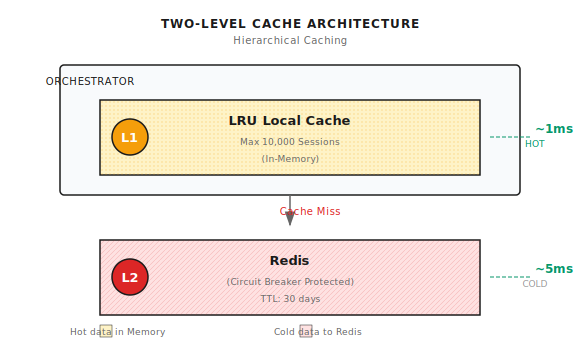

# Chapter 9: Multi-Turn Conversation Design

> **Multi-turn conversation isn't as simple as "stringing messages together." State management, privacy protection, deduplication and retrieval—any of these can derail your Agent.**
> **But don't overthink it either—the core is "sessions must be continuous, data must be secure, retrieval must be precise."**

---

A user chatted with your Agent for 20 rounds.

Suddenly refreshed the page.

Came back to see—the entire conversation was gone.

**That's what happens when Session management isn't done right.**

Or an even worse scenario:

User A's conversation history appears in User B's session.

**That's what happens when tenant isolation isn't done right.**

---

## 9.1 Challenges of Multi-Turn Conversation

The previous two chapters covered context windows and memory systems. This chapter is about implementing them in real conversation scenarios.

A production-grade conversation system needs to solve these problems:

| Challenge | Consequence | Solution Direction |
|-----------|-------------|-------------------|
| **Session state** | Conversation lost on refresh | Persistent storage |
| **Message growth** | History too long | Sliding window + compression |
| **Privacy protection** | Sensitive information leakage | PII redaction |
| **Session identification** | Can't find previous conversation | Auto-generated titles |
| **Semantic deduplication** | Duplicate retrieval results | MMR reranking |
| **Tenant isolation** | Data leakage | Strict permission checks |

Let's go through them one by one.

---

## 9.2 Session Management

### Two-Level Cache Architecture

HTTP is stateless, but conversations are stateful. Every request needs to load the session, and latency is sensitive.

Solution: In-memory cache + Redis persistence.



Local cache hits are at the 1ms level, Redis at the 5ms level. Hot data stays in memory, cold data falls back to Redis.

### Session Structure

Shannon's Session structure:

```go
type Session struct {
    ID        string
    UserID    string
    TenantID  string                    // Multi-tenant isolation
    CreatedAt time.Time
    UpdatedAt time.Time
    ExpiresAt time.Time                 // TTL expiration
    History   []Message                 // Message history
    Context   map[string]interface{}    // Session variables (title, preferences, etc.)
    Metadata  map[string]interface{}    // Metadata

    // Cost tracking
    TotalTokensUsed int
    TotalCostUSD    float64
}

type Message struct {
    ID        string
    Role      string     // "user", "assistant", "system"
    Content   string
    Timestamp time.Time
    TokensUsed int
}
```

A few key fields:

- **TenantID**: Multi-tenant isolation, different tenants' sessions cannot access each other
- **ExpiresAt**: TTL expiration mechanism, auto-cleanup after 30 days idle
- **TotalTokensUsed**: Cost tracking, supports budget control

### Tenant Isolation

This is easy to overlook but extremely important:

```go
func (m *Manager) GetSession(ctx context.Context, sessionID string) (*Session, error) {
    session := m.loadFromCache(sessionID)

    // Tenant isolation check
    userCtx := authFromContext(ctx)
    if userCtx.TenantID != "" && session.TenantID != userCtx.TenantID {
        // Don't leak that Session exists
        return nil, ErrSessionNotFound  // Note: not ErrUnauthorized
    }

    return session, nil
}
```

**Why return `ErrSessionNotFound` instead of `ErrUnauthorized`?**

Security principle: don't leak information.

If you return `ErrUnauthorized`, an attacker knows "this Session ID exists, I just don't have permission." They can slowly enumerate, find valid Session IDs, then try other attacks.

Returning `ErrSessionNotFound` means attackers can't distinguish between "doesn't exist" and "no permission."

### Hijacking Prevention

The Session ID passed by the user might belong to someone else:

```go
func (m *Manager) CreateSessionWithID(ctx context.Context, sessionID, userID string) (*Session, error) {
    // Check if it already exists
    existing, _ := m.GetSession(ctx, sessionID)
    if existing != nil {
        if existing.UserID != userID {
            // Session exists but belongs to someone else—possible hijacking attempt
            m.logger.Warn("Attempted session hijacking",
                zap.String("session_id", sessionID),
                zap.String("attacker", userID),
                zap.String("owner", existing.UserID),
            )
            // Generate new ID, don't reuse
            return m.CreateSession(ctx, userID, "", nil)
        }
        // Same user, return existing
        return existing, nil
    }
    // Doesn't exist, create normally
    return m.createNewSession(sessionID, userID)
}
```

Scenario: An attacker guesses a Session ID and tries to impersonate that user. The system detects the mismatch, refuses to reuse it, and generates a new ID.

---

## 9.3 Message History Management

### Sliding Window

Conversations might have hundreds of rounds. Can't store everything, need to set a limit:

```go
func (m *Manager) AddMessage(ctx context.Context, sessionID string, msg Message) error {
    session, _ := m.GetSession(ctx, sessionID)
    session.History = append(session.History, msg)

    // Sliding window trim
    if len(session.History) > m.maxHistory {
        session.History = session.History[len(session.History)-m.maxHistory:]
    }

    return m.UpdateSession(ctx, session)
}
```

`maxHistory` is typically set to 500. When exceeded, the oldest messages are trimmed.

**Why 500?**

- Too small (e.g., 50): History too short, not enough context
- Too large (e.g., 5000): Redis storage pressure, slow loading each time

500 is a balance point. Normal conversations don't exceed 500 rounds.

### Token Budget Filling

Even within maxHistory, you might exceed the token budget. Fill from most recent backward, stop when full:

```go
func (s *Session) GetHistoryWithinBudget(maxTokens int) []Message {
    result := []Message{}
    currentTokens := 0

    // Start from most recent messages
    for i := len(s.History) - 1; i >= 0; i-- {
        msg := s.History[i]
        msgTokens := estimateTokens(msg.Content)

        if currentTokens + msgTokens > maxTokens {
            break  // Budget exhausted
        }

        // Prepend to maintain order
        result = append([]Message{msg}, result...)
        currentTokens += msgTokens
    }

    return result
}
```

This ensures:
1. Most recent messages are prioritized
2. Doesn't exceed token budget
3. Message order is correct

---

## 9.4 PII Redaction

This is an easily overlooked but extremely important issue.

### Problem Scenario

```
User input: "My credit card number is 4532-1234-5678-9012"
    │
    ▼
[LLM compresses to summary]
    │
    ▼
Summary: "User queried balance of credit card 4532-1234-5678-9012"
    │
    ▼
[Stored in vector database, permanently saved]
    │
    ▼
[May be retrieved in subsequent conversations]
    │
    ▼
[Leaked to other users or logging systems]
```

The credit card number was permanently stored. This is a serious privacy breach.

### Solution: Redact Before Storage

Shannon does PII redaction in two places:
1. During compression summaries
2. During storage to vector database

```go
func redactPII(s string) string {
    if s == "" {
        return s
    }

    // Email
    emailRe := regexp.MustCompile(`(?i)[a-z0-9._%+\-]+@[a-z0-9.\-]+\.[a-z]{2,}`)
    s = emailRe.ReplaceAllString(s, "[REDACTED_EMAIL]")

    // Phone
    phoneRe := regexp.MustCompile(`(?i)(\+?\d[\d\s\-()]{8,}\d)`)
    s = phoneRe.ReplaceAllString(s, "[REDACTED_PHONE]")

    // SSN
    ssnRe := regexp.MustCompile(`\b\d{3}-\d{2}-\d{4}\b`)
    s = ssnRe.ReplaceAllString(s, "[REDACTED_SSN]")

    // Credit card
    ccRe := regexp.MustCompile(`\b(?:\d{4}[-\s]?){3}\d{4}\b`)
    s = ccRe.ReplaceAllString(s, "[REDACTED_CC]")

    // IP address
    ipRe := regexp.MustCompile(`\b(?:\d{1,3}\.){3}\d{1,3}\b`)
    s = ipRe.ReplaceAllString(s, "[REDACTED_IP]")

    // API Key
    apiKeyRe := regexp.MustCompile(`(?i)(api[_-]?key|token)[\s:=]+[\w-]{20,}`)
    s = apiKeyRe.ReplaceAllString(s, "[REDACTED_API_KEY]")

    // Password
    secretRe := regexp.MustCompile(`(?i)(password|secret|pwd)[\s:=]+\S{8,}`)
    s = secretRe.ReplaceAllString(s, "[REDACTED_SECRET]")

    return s
}
```

### PII Types Covered

| Type | Example | Replaced With |
|------|---------|--------------|
| Email | `user@example.com` | `[REDACTED_EMAIL]` |
| Phone | `+1-234-567-8900` | `[REDACTED_PHONE]` |
| Credit card | `4532-1234-5678-9012` | `[REDACTED_CC]` |
| SSN | `123-45-6789` | `[REDACTED_SSN]` |
| IP | `192.168.1.1` | `[REDACTED_IP]` |
| API Key | `api_key=sk-xxx` | `[REDACTED_API_KEY]` |
| Password | `password=abc123` | `[REDACTED_SECRET]` |

### Limitations

Regex redaction isn't perfect:

- **False positives**: `192.168.1.1` might be a constant in code, not a real IP
- **False negatives**: Complex PII formats might be missed
- **Context loss**: Redaction might affect LLM understanding

**Production recommendations**:
1. Regex as the basic defense line
2. Use professional PII detection services for sensitive scenarios (like AWS Comprehend, Google DLP)
3. Regularly audit stored content

---

## 9.5 Session Title Generation

When users come back looking for previous conversations, seeing a bunch of "Session 1" "Session 2" makes identification impossible.

Need to auto-generate meaningful titles.

### LLM Generation

Shannon uses LLM to generate titles:

```go
func (a *Activities) generateTitleWithLLM(ctx context.Context, query string) (string, error) {
    prompt := fmt.Sprintf(`Generate a chat session title from this user query.

Rules:
- Use the SAME LANGUAGE as the user's query
- For English: 3-5 words, Title Case
- For Chinese/Japanese/Korean: 5-15 characters
- No quotes, no trailing punctuation, no emojis

Query: %s`, query)

    result, err := llmCall(prompt)
    if err != nil {
        return "", err
    }

    // Clean up result
    title := strings.TrimSpace(result)
    title = strings.Trim(title, `"'`)

    return title, nil
}
```

### Idempotency

Important: only generate once, don't regenerate repeatedly.

```go
func GenerateSessionTitle(ctx context.Context, sessionID, query string) (string, error) {
    // 1. Idempotency check
    sess := getSession(sessionID)
    if title := sess.Context["title"]; title != "" {
        return title, nil  // Already has title, skip
    }

    // 2. LLM generation
    title, err := generateTitleWithLLM(ctx, query)
    if err != nil {
        // 3. Fallback: truncate original query
        title = truncateQuery(query, 40)
    }

    // 4. Length limit (note UTF-8)
    titleRunes := []rune(title)
    if len(titleRunes) > 60 {
        title = string(titleRunes[:57]) + "..."
    }

    // 5. Save
    updateContext(sessionID, "title", title)
    return title, nil
}
```

### Fallback Strategy

LLM calls might fail (timeout, API rate limit). Fallback is to truncate the original query:

```go
func truncateQuery(query string, maxLen int) string {
    // Take first line
    if idx := strings.Index(query, "\n"); idx > 0 {
        query = query[:idx]
    }

    // Truncate by character (not bytes, to avoid breaking UTF-8)
    runes := []rune(query)
    if len(runes) > maxLen {
        // Try to truncate at word boundary
        truncated := string(runes[:maxLen])
        if lastSpace := strings.LastIndex(truncated, " "); lastSpace > maxLen/2 {
            truncated = truncated[:lastSpace]
        }
        return truncated + "..."
    }
    return query
}
```

**Why use `[]rune` instead of truncating `string` directly?**

Go's string is a UTF-8 encoded byte sequence. A Chinese character takes 3 bytes. Truncating by bytes might cut in the middle of a Chinese character, producing garbled text.

```go
// Wrong: truncate by bytes
s := "Hello World"
s[:3]  // "Hel" - fine for English

s := "你好世界"
s[:3]  // Might be garbled

// Correct: truncate by rune
runes := []rune("你好世界")
string(runes[:2])  // "你好"
```

---

## 9.6 Semantic Deduplication (MMR)

The last chapter covered semantic retrieval. But there's a problem: returned results might be highly repetitive.

```
Query: "How to configure Kubernetes networking?"

Retrieved results:
1. [0.95] K8s network configuration requires setting up CNI first...
2. [0.94] Kubernetes networking is configured through CNI plugins...
3. [0.93] To configure K8s networking, first choose a CNI...
4. [0.92] K8s networking depends on CNI configuration...
5. [0.85] Service Mesh can enhance network functionality...
```

The first 4 are saying the same thing, wasting tokens.

### MMR Algorithm

MMR (Maximal Marginal Relevance) balances relevance and diversity:

```
MMR(d) = lambda * Sim(d, query) - (1-lambda) * max(Sim(d, d_i))

Where:
- Sim(d, query): similarity between document d and query
- max(Sim(d, d_i)): maximum similarity between document d and already selected documents
- lambda: weight parameter
  - 0.7: Favor relevance (default)
  - 0.5: Balanced
  - 0.3: Favor diversity
```

### Implementation

```go
func mmrReorder(queryVec []float32, items []SearchResult, topK int, lambda float64) []SearchResult {
    if len(items) <= topK {
        return items
    }

    selected := []int{}
    remaining := make(map[int]bool)
    for i := range items {
        remaining[i] = true
    }

    // Greedy selection
    for len(selected) < topK && len(remaining) > 0 {
        bestIdx := -1
        bestScore := -1e9

        for i := range remaining {
            // Relevance to query
            relevance := cosineSim(queryVec, items[i].Vector)

            // Maximum similarity to already selected results (penalty term)
            maxSim := 0.0
            for _, s := range selected {
                sim := cosineSim(items[i].Vector, items[s].Vector)
                if sim > maxSim {
                    maxSim = sim
                }
            }

            // MMR formula
            score := lambda*relevance - (1-lambda)*maxSim

            if score > bestScore {
                bestScore = score
                bestIdx = i
            }
        }

        if bestIdx >= 0 {
            selected = append(selected, bestIdx)
            delete(remaining, bestIdx)
        }
    }

    // Rebuild results
    result := make([]SearchResult, len(selected))
    for i, idx := range selected {
        result[i] = items[idx]
    }
    return result
}
```

### Usage

```go
// Need 5 results, first get 15 (3x)
candidates := vdb.Search(query, 15)
// MMR rerank
results := mmrReorder(queryVec, candidates, 5, 0.7)
```

### Effect

```
After deduplication:
1. [0.95] K8s network configuration requires setting up CNI first...
2. [0.85] Service Mesh can enhance network functionality...
3. [0.80] NetworkPolicy is used for security isolation...
```

Fewer results, higher information density.

---

## 9.7 Circuit Breaker

What happens if Redis goes down? Can't let the entire service go down.

### Problem

```
User request → Read Session → Redis timeout (5s) → User waits → Failure
User request → Read Session → Redis timeout (5s) → User waits → Failure
...
```

If Redis is down, every request has to wait 5 seconds for timeout, terrible user experience.

### Solution: Circuit Breaker

```go
type CircuitBreaker struct {
    failureCount    int
    lastFailure     time.Time
    state           State  // Closed, Open, HalfOpen
    failureThreshold int   // 5
    resetTimeout    time.Duration  // 30s
}

func (cb *CircuitBreaker) Execute(fn func() error) error {
    switch cb.state {
    case Open:
        // Circuit open, reject directly
        if time.Since(cb.lastFailure) > cb.resetTimeout {
            cb.state = HalfOpen  // Try to recover
        } else {
            return ErrCircuitOpen
        }
    case HalfOpen:
        // Half-open state, try once
        err := fn()
        if err != nil {
            cb.state = Open  // Still failing, keep open
            return err
        }
        cb.state = Closed  // Success, recover
        cb.failureCount = 0
        return nil
    }

    // Closed state, execute normally
    err := fn()
    if err != nil {
        cb.failureCount++
        cb.lastFailure = time.Now()
        if cb.failureCount >= cb.failureThreshold {
            cb.state = Open  // Too many failures, open
        }
    }
    return err
}
```

Shannon's Redis client wraps a Circuit Breaker:

```go
client := circuitbreaker.NewRedisWrapper(redisClient, logger)
```

### Fallback Strategy

When Circuit Breaker opens, fall back to local cache:

```go
func (m *Manager) GetSession(ctx context.Context, sessionID string) (*Session, error) {
    // Check local cache first
    if session, ok := m.localCache[sessionID]; ok {
        return session, nil
    }

    // Query Redis (with Circuit Breaker)
    session, err := m.client.GetSession(ctx, sessionID)
    if err == ErrCircuitOpen {
        // Redis circuit open, return empty session (new user experience)
        m.logger.Warn("Redis circuit open, creating new session")
        return m.createLocalSession(sessionID)
    }

    return session, err
}
```

---

## 9.8 Common Pitfalls

### Pitfall 1: Session ID Collision

```go
// Incrementing ID, easy collision (especially in distributed environments)
sessionID := fmt.Sprintf("session_%d", counter)

// UUID (recommended)
sessionID := uuid.New().String()
```

### Pitfall 2: UTF-8 Truncation

```go
// Truncate by bytes, might break Chinese characters
if len(title) > 50 {
    title = title[:50]  // Might be garbled
}

// Truncate by rune (correct)
runes := []rune(title)
if len(runes) > 50 {
    title = string(runes[:47]) + "..."
}
```

### Pitfall 3: Missing Tenant Isolation

```go
// Return directly (unsafe)
return session, nil

// Check tenant isolation
if session.TenantID != userCtx.TenantID {
    return nil, ErrSessionNotFound  // Not ErrUnauthorized
}
```

### Pitfall 4: Incomplete PII Redaction

Only handling Email isn't enough. Need to cover phone, credit card, SSN, IP, API Key, password, etc.

### Pitfall 5: Semantic Retrieval Without Deduplication

Directly using top-k results might produce a bunch of duplicates. Use MMR reranking.

### Pitfall 6: Service Down When Redis Down

No Circuit Breaker means Redis timeout drags down all requests.

### Pitfall 7: Repeated Title Generation

Calling LLM to generate title on every request wastes money. Need idempotency check.

---

## Shannon Lab (10-Minute Quick Start)

This section helps you map this chapter's concepts to Shannon source code in 10 minutes.

### Required Reading (1 file)

- [`session/manager.go`](https://github.com/Kocoro-lab/Shannon/blob/main/go/orchestrator/internal/session/manager.go): Look at `GetSession`, `CreateSessionWithID`, `AddMessage` functions to understand tenant isolation, hijacking prevention, and sliding window

### Optional Deep Dive (2 files, choose based on interest)

- [`activities/context_compress.go`](https://github.com/Kocoro-lab/Shannon/blob/main/go/orchestrator/internal/activities/context_compress.go): Look at the `redactPII` function to understand specific PII redaction implementation
- [`activities/session_title.go`](https://github.com/Kocoro-lab/Shannon/blob/main/go/orchestrator/internal/activities/session_title.go): Look at the `GenerateSessionTitle` function to understand title generation idempotency and fallback strategy

---

## Exercises

### Exercise 1: Design Session Structure

You're building an e-commerce customer service Agent that needs to support:
- Multi-round product inquiries
- Order status queries
- Complaint handling

Design your Session structure:
- What fields need to be stored?
- How to do tenant isolation?
- How to handle sensitive information (order numbers, addresses)?

### Exercise 2: Source Code Reading

Read `session/manager.go` and answer:
1. What cache eviction strategy does the `cleanupLocalCache` function use?
2. Why does `CreateSessionWithID` check `existing.UserID != userID`?
3. Where is the Circuit Breaker wrapped?

### Exercise 3 (Advanced): Implement PII Detection

Extend the `redactPII` function to add detection for:
- Chinese ID numbers (18 digits)
- Bank card numbers (16-19 digits)
- Passport numbers

Think about:
- How to avoid false positives (treating normal numbers as PII)?
- How to handle format variants (with spaces, with hyphens)?

---

## Key Takeaways

The core message: **Multi-turn conversations require managing state well, controlling length, protecting privacy, and deduplicating properly**.

Key points:

1. **Two-Level Cache**: LRU local cache + Redis persistence
2. **Tenant Isolation**: Return `ErrSessionNotFound` instead of `ErrUnauthorized`
3. **PII Redaction**: Clean sensitive information before storage
4. **Title Generation**: LLM generation + idempotency check + fallback truncation
5. **MMR Deduplication**: lambda=0.7 balances relevance and diversity

---

That concludes Part 3 (Context and Memory).

We covered:
- **Chapter 7**: Context Window Management—"short-term memory" within a single conversation
- **Chapter 8**: Memory Architecture—"long-term memory" across sessions
- **Chapter 9**: Multi-Turn Conversation Design—implementing them in production environments

Through these three chapters, you should understand how a production-grade Agent "remembers things."

Next chapter enters Part 4 (Single Agent Patterns), starting with **Planning**—how Agents decompose complex tasks into executable steps.

From "remembering things" to "doing things"—this is the key capability leap for Agents.


---

## Further Reading

- [Redis Data Types](https://redis.io/docs/data-types/) - Redis data structures
- [Circuit Breaker Pattern](https://martinfowler.com/bliki/CircuitBreaker.html) - Martin Fowler's classic article
- [MMR Paper](https://www.cs.cmu.edu/~jgc/publication/The_Use_MMR_Diversity_Based_LTMIR_1998.pdf) - Original MMR paper
- [GDPR PII Categories](https://gdpr.eu/eu-gdpr-personal-data/) - GDPR definition of personal data
- [Shannon Session Management](https://github.com/Kocoro-lab/Shannon/blob/main/go/orchestrator/internal/session/manager.go) - Shannon Session management implementation
