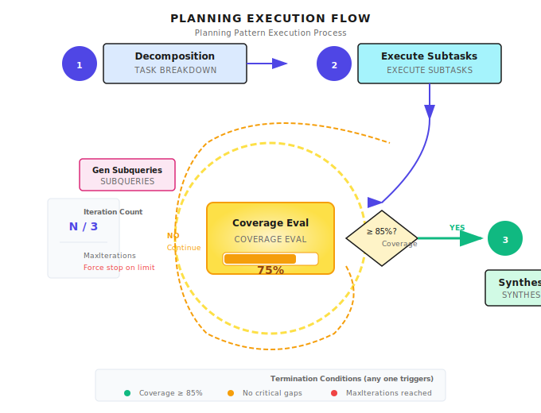

# Chapter 10: Planning Pattern

> **Planning isn't "think it through before acting"—it's a continuous cycle of "think while doing, evaluate while doing"—the key is knowing when to stop, not pursuing the perfect plan.**

---

## 10.1 Why Do We Need Planning?

Imagine this scenario:

You ask an intern to research three competitors—Tesla, BYD, and Rivian. What do you expect? A well-structured comparison report: each company's product line, technical features, market positioning, strengths and weaknesses analysis.

But what the intern gives you is: Tesla's Wikipedia summary + BYD news clippings + Rivian's website copy-paste. There's information, but no structure, impossible to compare, let alone derive insights.

**Where did things go wrong? They didn't plan.** They just started searching, copying, organizing—but never thought about "what questions am I answering," "how should I structure this," "what information is important and what isn't."

Agents make the same mistake. If you directly ask them to "research OpenAI and write a competitive analysis report," they'll immediately start searching, extracting, generating—but often produce piles of information without structure or depth.

This is the problem Planning solves.

### Characteristics of Complex Tasks

Complex tasks tend to share a few traits:

- **Multi-step**: You can't solve them in one prompt; you need a sequence of actions (search, read, analyze, write).
- **Partial dependencies**: Some steps can run in parallel, but others must wait for upstream results.
- **Ambiguous stopping points**: "Good enough" is subjective unless you define coverage/quality criteria.
- **Uncertain information**: Facts may be missing or outdated, so you need verification loops and backtracking.

### Intuitive Explanation

When you renovate a house, you don't just start painting walls. You first think:

1. Does the plumbing and wiring need changing?
2. Should any walls be demolished?
3. When should the flooring be installed?
4. When should furniture arrive?

Then you realize: some things must be done first (plumbing/wiring), some can be parallel (ceiling and painting), some must be done last (furniture).

**That's Planning.**

Agents are the same. Facing a complex task, they need to:

1. **Decompose**: Break big tasks into smaller tasks
2. **Order**: What goes first, what goes later
3. **Evaluate**: Is the completed work sufficient, should we continue

### What Happens Without Planning?

Consider this request: "Research OpenAI and write a complete competitive analysis report"

If we let the LLM handle it directly:

| Problem | Manifestation | Consequence |
|---------|--------------|-------------|
| **Too much information** | Stuffed into context all at once | Exceeds context window, information lost |
| **No structure** | A random mix of details | Output is chaotic |
| **Can't track** | User waits blindly, no progress visibility | Poor experience, can't adjust mid-way |
| **Redundant work** | Same information searched multiple times | Wastes tokens |

### What Happens With Planning?

```
1. Basic company information (founding date, founders, funding)
2. Product matrix (GPT, API, ChatGPT)
3. Technical innovations (Transformer, RLHF)
4. Competitor analysis (Google, Meta)
5. Market positioning and strategy
6. Comprehensive report generation
```

Each subtask is independently controllable. First one done, store it. Second one done, store it. Finally synthesize.

Something goes wrong in one step? Just redo that step, don't start over.

---

## 10.2 Three Core Questions of Planning

The Planning pattern answers three questions:

| Question | Core Challenge | Production Considerations |
|----------|---------------|-------------------------|
| **How to decompose?** | Turn vague requirements into concrete subtasks | Decomposition granularity, scope boundaries |
| **How to execute?** | Determine dependencies and execution order | Parallel vs sequential, failure retry |
| **When to stop?** | Evaluate current progress, decide to continue or end | Coverage threshold, max iterations |

The third question is the easiest to overlook, but the most important in production environments.

I've seen too many Agents fail here—not knowing when to stop, falling into infinite loops, burning through all tokens without producing anything useful.

---

## 10.3 Task Decomposition

### Decomposition Input and Output

Task decomposition is the first step of Planning. In Shannon, it's done through the LLM Service:

```go
// Input for decomposition request
type DecompositionInput struct {
    Query          string                 // User's original request
    Context        map[string]interface{} // Context information
    AvailableTools []string               // Available tool list
}

// Decomposition result
type DecompositionResult struct {
    Mode              string    // "simple", "standard", "complex"
    ComplexityScore   float64   // 0.0 - 1.0
    Subtasks          []Subtask // Subtask list
    ExecutionStrategy string    // "parallel", "sequential", "dag"
}
```

After the LLM reviews the request, it tells you:
- How complex is this task (0-1 score)
- How many subtasks to split into
- Execution strategy between subtasks

**Implementation reference (Shannon)**: [`activities/decompose.go`](https://github.com/Kocoro-lab/Shannon/blob/main/go/orchestrator/internal/activities/decompose.go) - DecomposeTask function

### Subtask Structure

Each subtask isn't just a one-sentence description—it comes with complete execution constraints:

```go
type Subtask struct {
    ID              string
    Description     string
    Dependencies    []string  // IDs of other subtasks this depends on

    // Input/output declarations
    Produces []string  // What this subtask produces
    Consumes []string  // What this subtask needs

    // Execution constraints
    SuggestedTools   []string
    SuggestedPersona string

    // Scope boundaries
    Boundaries *BoundariesSpec
}
```

This structure is quite detailed. Let me explain a few key fields:

**Produces/Consumes: Declaring Dependencies**

```
Subtask 1: "Collect basic company information"
  - Produces: ["company_info", "founding_date"]
  - Dependencies: []

Subtask 2: "Analyze product matrix"
  - Consumes: ["company_info"]
  - Produces: ["products", "pricing"]
  - Dependencies: ["subtask-1"]

Subtask 3: "Competitor analysis"
  - Consumes: ["company_info", "products"]
  - Dependencies: ["subtask-1", "subtask-2"]
```

Execute in topological order: after subtask-1 completes, subtask-2 can start (because it needs company_info).

**Boundaries: Declaring Scope**

This prevents overlap between subtasks:

```go
// Research products
subtask1 := Subtask{
    Description: "Research company products",
    Boundaries: &BoundariesSpec{
        InScope:    []string{"software products", "pricing"},
        OutOfScope: []string{"professional services"},
    },
}

// Research services
subtask2 := Subtask{
    Description: "Analyze professional services",
    Boundaries: &BoundariesSpec{
        InScope:    []string{"consulting", "implementation"},
        OutOfScope: []string{"software products"},
    },
}
```

Without boundary declarations, two subtasks might both research "products and services," duplicating work.

---

## 10.4 Execution Strategies

After decomposing tasks, you need to decide how to execute. Shannon supports three strategies:

| Strategy | Use Case | Characteristics |
|----------|----------|-----------------|
| **parallel** | Subtasks are independent | Fastest, execute simultaneously |
| **sequential** | Subtasks have strict ordering | Most stable, but slowest |
| **dag** | Subtasks have partial dependencies | Flexible, execute in topological order |

### How to Choose?

```go
// Check for dependencies
hasDependencies := false
for _, subtask := range decomp.Subtasks {
    if len(subtask.Dependencies) > 0 {
        hasDependencies = true
        break
    }
}

// Use hybrid (DAG) if there are dependencies, otherwise use parallel
if hasDependencies {
    executeHybridPattern(...)
} else {
    executeParallelPattern(...)
}
```

**Implementation reference (Shannon)**: [`strategies/dag.go`](https://github.com/Kocoro-lab/Shannon/blob/main/go/orchestrator/internal/workflows/strategies/dag.go) - DAGWorkflow function

### Topological Sort

When subtasks have dependencies, execute in topological order:

```
A (no dependencies)
    ↓
B (depends on A)    C (depends on A)
    ↓           ↓
       D (depends on B, C)
```

Execution order: A → [B, C in parallel] → D

This isn't LLM-specific—it's standard graph theory. But it's often overlooked in Agent systems, leading to chaotic execution order.

---

## 10.5 Coverage Evaluation

This is the most critical part of the Planning pattern.

Planning isn't one-and-done. After executing subtasks, you need to ask: **Is it enough? Do we need to continue?**

```
Initial decomposition
    │
    ▼
Execute subtasks ───► Evaluate coverage ───► Coverage ≥ 85%? ───► Complete
    ▲                              │
    │                  No          │
    └──────── Generate supplementary queries ◄────────┘
```



### Evaluation Structure

```go
type CoverageEvaluationInput struct {
    Query            string
    CurrentSynthesis string  // Current synthesized result
    CoveredAreas     []string
    Iteration        int
    MaxIterations    int
}

type CoverageEvaluationResult struct {
    OverallCoverage   float64         // 0.0 - 1.0
    CriticalGaps      []CoverageGap   // Gaps that must be filled
    OptionalGaps      []CoverageGap   // Optional improvement points
    ShouldContinue    bool
    RecommendedAction string          // "continue", "complete"
}
```

### Deterministic Guardrails

This is something I want to emphasize: **LLM judgments are unstable—rules must override.**

```go
func EvaluateCoverage(ctx context.Context, input Input) (*Result, error) {
    // LLM evaluation
    result := llmEvaluate(input)

    // === Deterministic Guardrails ===

    // Rule 1: First iteration + low coverage → must continue
    if input.Iteration == 1 && result.OverallCoverage < 0.5 {
        result.ShouldContinue = true
        result.RecommendedAction = "continue"
    }

    // Rule 2: Critical gaps exist + iterations remaining → must continue
    if len(result.CriticalGaps) > 0 && input.Iteration < input.MaxIterations {
        result.ShouldContinue = true
    }

    // Rule 3: Max iterations reached → must stop
    if input.Iteration >= input.MaxIterations {
        result.ShouldContinue = false
        result.RecommendedAction = "complete"
    }

    // Rule 4: Synthesis too short but claims high coverage → untrustworthy
    if len(input.CurrentSynthesis) < 500 && result.OverallCoverage > 0.7 {
        result.ConfidenceLevel = "low"
    }

    return result, nil
}
```

Why are these guardrails needed?

- LLM might say "95% coverage," but the synthesis is only 200 words. Rule 4 marks it "untrustworthy."
- LLM might say "we can stop," but there are still critical gaps. Rule 2 forces continuation.
- LLM might keep saying "need to continue," infinite loop. Rule 3 forces a stop.

**Guardrails ensure predictable behavior.**

---

## 10.6 Supplementary Query Generation

When evaluation finds gaps, generate targeted supplementary queries:

```go
type GeneratedSubquery struct {
    ID             string
    Query          string
    TargetGap      string   // Which gap this targets
    Priority       string   // "high", "medium", "low"
    SuggestedTools []string
}
```

The prompt for generation guides the LLM:

```
You are a research query generator. Your task is to generate targeted subqueries to fill coverage gaps.

## Goals:
1. Generate queries that directly address coverage gaps
2. Prioritize CRITICAL gaps
3. Avoid generating duplicate or overlapping queries

## Alternative Search Strategies (Important!)

When standard searches don't find information, try:
1. Direct access to company domain (web_fetch)
2. Search in Japanese/local language for Asian companies
3. Search LinkedIn/Crunchbase
```

Key is **multilingual awareness**. When researching Japanese companies, searching in Japanese works better. This is a detail many Agent systems overlook.

---

## 10.7 Complete Flow

Putting the components together:

```go
const MaxIterations = 3

func Research(ctx context.Context, query string) (string, error) {
    // 1. Initial decomposition
    decomposition := DecomposeTask(ctx, DecompositionInput{
        Query:          query,
        AvailableTools: []string{"web_search", "web_fetch"},
    })

    fmt.Printf("Decomposed into %d subtasks, strategy: %s\n",
        len(decomposition.Subtasks), decomposition.ExecutionStrategy)

    // 2. Execute subtasks (in topological order)
    var results []Result
    for _, subtask := range topologicalSort(decomposition.Subtasks) {
        result := executeSubtask(ctx, subtask)
        results = append(results, result)
    }

    // 3. Synthesize initial results
    synthesis := synthesize(ctx, query, results)

    // 4. Iterative improvement loop
    for iteration := 1; iteration <= MaxIterations; iteration++ {
        // Evaluate coverage
        coverage := EvaluateCoverage(ctx, CoverageEvaluationInput{
            Query:            query,
            CurrentSynthesis: synthesis,
            Iteration:        iteration,
            MaxIterations:    MaxIterations,
        })

        fmt.Printf("Iteration %d: coverage %.0f%%, continue: %v\n",
            iteration, coverage.OverallCoverage*100, coverage.ShouldContinue)

        if !coverage.ShouldContinue {
            break
        }

        // Generate supplementary queries
        subqueries := GenerateSubqueries(ctx, SubqueryGeneratorInput{
            Query:         query,
            CoverageGaps:  coverage.CriticalGaps,
            MaxSubqueries: 3,
        })

        // Execute supplementary queries
        for _, sq := range subqueries {
            result := executeSubquery(ctx, sq)
            results = append(results, result)
        }

        // Re-synthesize
        synthesis = synthesize(ctx, query, results)
    }

    return synthesis, nil
}
```

Example output:

```
Decomposed into 5 subtasks, strategy: sequential
Iteration 1: coverage 60%, continue: true
Iteration 2: coverage 82%, continue: true
Iteration 3: coverage 91%, continue: false
Research complete
```

---

## 10.8 Common Pitfalls

### Pitfall 1: Over-Decomposition

**Symptom**: Decomposed into 20+ subtasks, each very small.

**Problem**: Coordination cost exceeds execution cost. Each subtask needs an LLM call, waiting, and might fail.

```go
// Too granular decomposition
subtasks := []Subtask{
    {Description: "Search company name"},
    {Description: "Open website"},
    {Description: "Find About page"},
    {Description: "Read founder information"},
    // ... 100 subtasks
}

// Appropriate granularity
subtasks := []Subtask{
    {Description: "Collect basic company info (founders, founding date, headquarters)"},
    {Description: "Analyze products and services"},
    {Description: "Research funding history"},
}
```

**Rule of thumb**: For a research task, 3-7 subtasks is enough.

### Pitfall 2: Scope Overlap

**Symptom**: Different subtasks produce duplicate content.

**Problem**: Wastes tokens, requires deduplication during synthesis.

```go
// Vague scope
subtask1 := Subtask{Description: "Research company products"}
subtask2 := Subtask{Description: "Analyze company services"}
// "Products" and "services" might overlap

// Clear boundaries
subtask1 := Subtask{
    Description: "Research company products",
    Boundaries: &BoundariesSpec{
        InScope:    []string{"software products"},
        OutOfScope: []string{"professional services"},
    },
}
```

### Pitfall 3: Infinite Iteration

**Symptom**: 10 iterations and still not stopping, tokens exhausted.

**Problem**: LLM always thinks "could be better," never reaches 100%.

```go
// No termination condition
for {
    coverage := evaluateCoverage()
    if coverage.OverallCoverage < 1.0 {
        // Will never reach 100%
        generateMoreQueries()
    }
}

// Multiple termination conditions
for iteration := 1; iteration <= MaxIterations; iteration++ {
    coverage := evaluateCoverage()

    if coverage.OverallCoverage >= 0.85 && len(coverage.CriticalGaps) == 0 {
        break  // Quality threshold met
    }
    if iteration >= MaxIterations {
        break  // Budget exhausted
    }
}
```

### Pitfall 4: Ignoring Dependency Order

**Symptom**: Subtask B needs output from subtask A, but B executes first, gets empty data.

```go
// Parallel execution with dependencies (will fail)
go execute(subtask1)  // Produces company_info
go execute(subtask2)  // Consumes company_info (will fail!)

// Execute after topological sort
ordered := topologicalSort(subtasks)
for _, subtask := range ordered {
    execute(subtask)
}
```

---

## 10.9 When to Use Planning?

Not all tasks need planning.

| Task Type | Use Planning? | Reason |
|-----------|--------------|--------|
| "What's the weather today" | No | Just look it up directly |
| "Help me write a function" | No | ReAct is sufficient |
| "Research this company and write a report" | Yes | Needs decomposition |
| "Analyze this codebase's architecture" | Yes | Needs decomposition |
| "Compare pros and cons of these three solutions" | Yes | Needs decomposition |

**Rule of thumb**:

- Single-step completion → don't need
- Multiple searches/analyses needed → need
- Output needs structure → need
- Multiple dimensions involved → need

There's an even simpler heuristic:

> If you'd outline the task for an intern before having them do it, then the Agent needs Planning too.

---

## 10.10 How Do Other Frameworks Do It?

Planning is a universal pattern, not Shannon-exclusive. Everyone has implementations:

| Framework | Implementation | Characteristics |
|-----------|---------------|-----------------|
| **LangGraph** | Plan-and-Execute nodes | Visual, flow controllable |
| **AutoGPT** | Task Queue | Highly autonomous, but unstable |
| **CrewAI** | Task assignment | Team collaboration metaphor |
| **OpenAI Assistants** | Built-in Planning (limited) | Black box, not controllable |

Core logic is the same: decompose → execute → evaluate → iterate.

Differences are in:
- Decomposition granularity and control
- Iteration trigger conditions
- Guardrail implementation methods

---

## Key Takeaways

1. **Planning Core**: Complex tasks first decompose, then execute, evaluate while doing
2. **Task Decomposition**: Declare Produces/Consumes to establish dependencies, declare Boundaries to prevent overlap
3. **Execution Strategy**: Use parallel without dependencies, use DAG (topological sort) with dependencies
4. **Coverage Evaluation**: LLM judgment + deterministic guardrails, double insurance
5. **Termination Conditions**: Quality met, budget exhausted, max iterations—any one triggers stop

---

## Shannon Lab (10-Minute Quick Start)

This section helps you map this chapter's concepts to Shannon source code in 10 minutes.

### Required Reading (1 file)

- [`strategies/dag.go`](https://github.com/Kocoro-lab/Shannon/blob/main/go/orchestrator/internal/workflows/strategies/dag.go): Find the `DAGWorkflow` function, see how it calls `DecomposeTask` to decompose tasks, chooses execution strategy based on `hasDependencies`, and finally calls `ReflectOnResult` for quality evaluation

### Optional Deep Dive (2 files, choose based on interest)

- [`activities/decompose.go`](https://github.com/Kocoro-lab/Shannon/blob/main/go/orchestrator/internal/activities/decompose.go): Look at the `DecompositionResult` structure to understand what the LLM Service returns
- [`activities/types.go`](https://github.com/Kocoro-lab/Shannon/blob/main/go/orchestrator/internal/activities/types.go): Look at the `Subtask` structure to understand how Produces/Consumes/Boundaries are used

---

## Exercises

### Exercise 1: Design Decomposition

Manually decompose the task "Help me research Anthropic and write a 2000-word company analysis":

- List 4-6 subtasks
- Mark each subtask's Produces and Consumes
- Draw the dependency graph (who depends on whom)
- Decide whether to use parallel or sequential

### Exercise 2: Source Code Reading

Read the `executeHybridPattern` function in `strategies/dag.go`:

1. How does it handle tasks with dependencies?
2. What is `DependencyWaitTimeout` for?
3. If a dependency task fails, what happens to subsequent tasks?

### Exercise 3 (Advanced): Design Guardrails

Design a "Token budget exhausted" termination condition:

- Write the pseudocode for the decision logic
- Think: Where in the loop should this condition be checked?
- Think: When budget is exhausted, should it return existing results or error out?

---

## Further Reading

- [Task Decomposition in LLM Agents](https://www.promptingguide.ai/techniques/decomposition) - Various task decomposition techniques
- [Topological Sort Algorithm](https://en.wikipedia.org/wiki/Topological_sorting) - Algorithm foundation for dependency ordering
- [MECE Framework](https://www.mckinsey.com/capabilities/strategy-and-corporate-finance/our-insights/mece) - Consulting firm decomposition principles, applicable to Agents too

---

## Next Chapter Preview

At this point, the Agent can plan and execute. But there's a question: how does it know if it did well?

An Agent that can't reflect is like a programmer who never reviews their code—trouble is bound to happen.

Next chapter we'll discuss the **Reflection Pattern**: how to make Agents learn self-examination, evaluate output quality, and retry with feedback when standards aren't met.

See you in Chapter 11.
