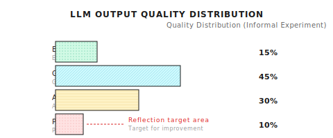
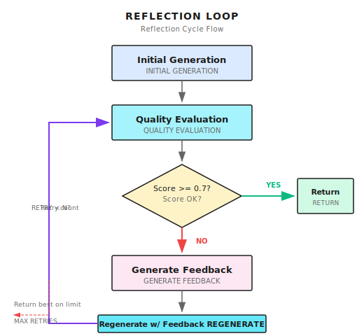

# Chapter 11: Reflection Pattern

> **Reflection doesn't make Agents perfect—it helps them discover their own problems. Discovering problems is the first step to improvement, but improvement itself still needs guardrails.**

---

## 11.1 Why Do We Need Reflection?

Reflection is a pattern that lets Agents self-check, identify problems, and iterate on improvements. Its core value is: **raising the floor on output quality, reducing obvious errors**.

Single LLM outputs have unstable quality. The same question asked 10 times might get responses of varying quality—some great, some mediocre, some with obvious flaws. Reflection's role is to identify those "obviously flawed" outputs and give them a chance to improve.

But let me be clear upfront: **Reflection is not a cure-all.** It can't turn a bad answer into a good one; it can only turn an answer with "obvious problems" into one that's "basically passing." If the LLM itself lacks capability or knowledge, Reflection can't save it.

What's it good for? Three main scenarios:

1. **High-value outputs**: Research reports, technical documentation—these outputs are worth spending 2x cost to ensure quality
2. **Objectively evaluable tasks**: Scenarios with clear scoring criteria (completeness, accuracy, format compliance)
3. **Iterative improvement**: When initial draft quality isn't good enough, guide improvement through feedback

### LLM Output Variance

The same question with different random seeds can produce very different answers. I did an informal experiment: asked the same research question 10 times, and the quality distribution looked roughly like this:



Users only get one sample from this distribution per request. If it happens to fall in the "poor" region, the experience is bad.

### What Reflection Does

The core idea of the Reflection pattern is simple:

1. Generate a response
2. Use another LLM call to evaluate this response's quality
3. If quality doesn't meet standards, feed the evaluation feedback back and regenerate
4. Repeat until it passes or reaches max retries



Simply put: **Make the Agent learn to self-check.**

### This Is Not a Cure-All

Before continuing, I must clarify: Reflection cannot turn a bad answer into a good one. What it can do is:

1. **Identify problems**: Recognize flaws in the response
2. **Provide direction**: Tell regeneration what to pay attention to
3. **Increase probability**: Increase the chances of getting a good response

But it can't guarantee improvement, and can't retry infinitely (costs would explode). In production environments, Reflection is an "icing on the cake" optimization, not a core dependency.

---

## 11.2 Core Components of Reflection

The Reflection pattern has three core components:

| Component | Responsibility | Output |
|-----------|---------------|--------|
| **Quality Evaluation** | Score the response | Score (0.0 - 1.0) + Feedback |
| **Feedback Generation** | Point out specific problems | Concrete improvement suggestions |
| **Regeneration with Feedback** | Improve based on feedback | Improved response |

### Quality Evaluation

```go
type EvaluateResultInput struct {
    Query    string   // Original question
    Response string   // Response to evaluate
    Criteria []string // Evaluation criteria
}

type EvaluateResultOutput struct {
    Score    float64 // 0.0 - 1.0
    Feedback string  // Improvement suggestions
}
```

Evaluation criteria can be customized for scenarios:

```go
// General criteria
defaultCriteria := []string{
    "completeness",  // Does it cover all aspects of the question
    "correctness",   // Is the information accurate
    "clarity",       // Is the expression clear
}

// Research scenario
researchCriteria := []string{
    "completeness",
    "correctness",
    "clarity",
    "citation_coverage",  // Are citations sufficient
    "source_quality",     // Quality of information sources
}

// Code generation scenario
codeCriteria := []string{
    "correctness",    // Is the code correct
    "efficiency",     // Is efficiency reasonable
    "readability",    // Readability
    "edge_cases",     // Edge case handling
}
```

### Evaluation Prompt

This is the prompt template for the evaluation phase:

```
Evaluate the quality of the following response.

Question: {query}
Response: {response}

Evaluation criteria:
- completeness: Does it cover all aspects
- correctness: Is the information accurate
- clarity: Is the expression clear

Score each criterion 0.0-1.0, then give a weighted average.
If total score is below 0.7, give specific improvement suggestions.

Output JSON:
{
  "overall_score": 0.75,
  "criteria_scores": {"completeness": 0.8, "correctness": 0.9, "clarity": 0.6},
  "feedback": "The response can be improved by..."
}
```

---

## 11.3 Shannon's Reflection Implementation

Shannon's Reflection implementation is in `patterns/reflection.go`, with the core function `ReflectOnResult`:

```go
type ReflectionConfig struct {
    Enabled             bool     // Whether enabled
    MaxRetries          int      // Max retry count, typically 1-2
    ConfidenceThreshold float64  // Quality threshold, typically 0.7
    Criteria            []string // Evaluation criteria
    TimeoutMs           int      // Timeout
}
```

**Implementation reference (Shannon)**: [`patterns/reflection.go`](https://github.com/Kocoro-lab/Shannon/blob/main/go/orchestrator/internal/workflows/patterns/reflection.go) - ReflectOnResult function

### Core Flow

```go
func ReflectOnResult(
    ctx workflow.Context,
    query string,
    initialResult string,
    agentResults []activities.AgentExecutionResult,
    baseContext map[string]interface{},
    config ReflectionConfig,
    opts Options,
) (string, float64, int, error) {

    finalResult := initialResult
    var totalTokens int
    var retryCount int
    var lastScore float64 = 0.5

    // If Reflection is disabled, return directly
    if !config.Enabled {
        return finalResult, lastScore, totalTokens, nil
    }

    for retryCount < config.MaxRetries {
        // 1. Evaluate current result
        evalResult := evaluateResult(ctx, query, finalResult, config.Criteria)
        lastScore = evalResult.Score

        // 2. If passing, return
        if evalResult.Score >= config.ConfidenceThreshold {
            return finalResult, evalResult.Score, totalTokens, nil
        }

        // 3. Not passing, check if can still retry
        retryCount++
        if retryCount >= config.MaxRetries {
            // Max retries reached, return current best result
            return finalResult, evalResult.Score, totalTokens, nil
        }

        // 4. Build context with feedback
        reflectionContext := map[string]interface{}{
            "reflection_feedback": evalResult.Feedback,
            "previous_response":   finalResult,
            "improvement_needed":  true,
        }

        // 5. Regenerate with feedback
        improvedResult := synthesizeWithFeedback(ctx, query, reflectionContext)
        finalResult = improvedResult
        totalTokens += improvedResult.TokensUsed
    }

    return finalResult, lastScore, totalTokens, nil
}
```

### Key Design Decisions

1. **MaxRetries limit**: Prevent infinite loops, typically set to 1-2
2. **ConfidenceThreshold**: 0.7 is a reasonable starting point; too high causes frequent retries
3. **Graceful degradation**: If evaluation or regeneration fails, return original result rather than error

---

## 11.4 Regeneration with Feedback

After evaluation finds problems, pass the feedback to the regeneration process:

```go
// Build context with feedback
reflectionContext := map[string]interface{}{
    "reflection_feedback": "Response is missing: 1) Funding history 2) Founding team",
    "previous_response":   previousResult,
    "improvement_needed":  true,
}
```

Handle this feedback during Synthesis:

```go
func SynthesizeWithFeedback(ctx context.Context, query string, context map[string]interface{}) string {
    var prompt strings.Builder

    // Detect if there's feedback
    if feedback, ok := context["reflection_feedback"].(string); ok && feedback != "" {
        prompt.WriteString("Important: The previous response needs improvement.\n")
        prompt.WriteString("Feedback: " + feedback + "\n\n")
    }

    if prev, ok := context["previous_response"].(string); ok && prev != "" {
        prompt.WriteString("Previous response (needs improvement):\n" + prev + "\n\n")
    }

    prompt.WriteString("Please improve the response based on feedback: " + query)

    return callLLM(prompt.String())
}
```

There's an important design here: **Pass both the previous response and feedback to the LLM**. This way the LLM can:

1. See what it wrote before
2. See where the specific problems are
3. Improve in a targeted way

---

## 11.5 Cost Trade-offs

Reflection increases token consumption—this is its biggest drawback.

```
Without Reflection:
  - Input: ~3000 tokens
  - Output: ~5000 tokens
  - Total: ~8000 tokens

With Reflection (1 iteration):
  - Initial: ~8000 tokens
  - Evaluation: ~1000 tokens
  - Regeneration: ~8000 tokens
  - Total: ~17000 tokens (+112%)
```

Costs double, so use judiciously.

### Cost Reduction Strategies

| Strategy | Description | Effect |
|----------|-------------|--------|
| **Only enable for high-value outputs** | Use for research reports, not simple Q&A | Reduce trigger frequency |
| **Use smaller model for evaluation** | Evaluate with GPT-3.5, generate with GPT-4 | Lower evaluation cost |
| **Limit retry count** | MaxRetries = 1 is usually enough | Limit worst case |
| **Reasonable threshold** | 0.7 not 0.95 | Reduce unnecessary retries |

```go
// Cost-sensitive configuration
config := ReflectionConfig{
    Enabled:             true,
    MaxRetries:          1,        // Max 1 retry
    ConfidenceThreshold: 0.7,      // Reasonable threshold
    Criteria:            []string{"completeness", "correctness"},
}
```

### Shannon's Approach

This is how Shannon calls Reflection in the DAG workflow:

```go
// Only Reflect on complex tasks without synthesis subtask
if config.ReflectionEnabled &&
   shouldReflect(decomp.ComplexityScore, &config) &&
   !hasSynthesisSubtask {

    reflectionConfig := patterns.ReflectionConfig{
        Enabled:             true,
        MaxRetries:          config.ReflectionMaxRetries,
        ConfidenceThreshold: config.ReflectionConfidenceThreshold,
        Criteria:            config.ReflectionCriteria,
    }

    improvedResult, score, reflectionTokens, err := patterns.ReflectOnResult(...)
}
```

Note the `shouldReflect` function—not all tasks need Reflection, only those with high enough complexity are worth the cost.

---

## 11.6 Common Pitfalls

### Pitfall 1: Threshold Too High

**Symptom**: Almost every request triggers retry, high token consumption.

**Cause**: A threshold of 0.95 is nearly impossible to reach; LLMs rarely give themselves perfect scores.

```go
// Threshold 0.95 is nearly impossible to reach
config := ReflectionConfig{
    ConfidenceThreshold: 0.95,
    MaxRetries:          5,  // Wastes tokens
}

// Reasonable configuration
config := ReflectionConfig{
    ConfidenceThreshold: 0.7,
    MaxRetries:          1,
}
```

### Pitfall 2: Using Expensive Model for Evaluation

**Symptom**: Reflection cost is higher than generation cost.

**Cause**: Evaluation is relatively simple; small models work fine.

```go
// Specify model_tier = "small" during evaluation
// Use GPT-3.5 or similar cheaper model
evalConfig := EvaluateConfig{
    ModelTier: "small",  // Don't need large model
}
```

### Pitfall 3: Vague Feedback

**Symptom**: Quality doesn't improve after retry.

**Cause**: Feedback is too vague; LLM doesn't know what specifically to change.

```go
// Vague feedback is useless
feedback := "Response quality isn't good enough, needs improvement"

// Specific feedback is effective
feedback := "Response is missing: 1) Company funding history 2) Founding team background. " +
            "Current citations are only from news sites, recommend adding official sources."
```

This is an evaluation prompt design issue—guide the LLM to give specific, actionable feedback.

### Pitfall 4: Error on Reflection Failure

**Symptom**: Occasional evaluation failures cause entire task to fail.

**Cause**: No graceful degradation mechanism.

```go
// Bad: Reflection failure shows error to user
if err != nil {
    return "", err
}

// Good: Graceful degradation, return initial result
if err != nil {
    log.Warn("Reflection failed, using initial result")
    return initialResult, nil
}
```

Reflection is an optimization, not core functionality. When it fails, users should get the initial result, not an error.

### Pitfall 5: Infinite Loop

**Symptom**: Score fluctuates at the same level, never reaches threshold.

**Cause**: No retry limit.

```go
// Dangerous: Score might fluctuate at same level
for score < 0.7 {
    improved = regenerate(feedback)
    score = evaluate(improved)
    // Might never reach 0.7
}

// Safe: Limit retry count
for retryCount := 0; retryCount < config.MaxRetries; retryCount++ {
    if score >= config.ConfidenceThreshold {
        break
    }
    // ...
}
```

---

## 11.7 Reflection vs Other Quality Assurance Methods

Reflection isn't the only quality assurance method. Let's compare different approaches:

| Method | Cost | Latency | Use Case |
|--------|------|---------|----------|
| **Reflection** | High (2x+ tokens) | High (2x+ time) | High-value outputs, report generation |
| **Self-Consistency** | Very high (3x+ tokens) | High (parallel or serial multiple times) | Math reasoning, deterministic answers |
| **Human Review** | Human labor cost | Very high (wait for human) | Critical decisions, compliance requirements |
| **Single Generation** | Lowest | Lowest | Simple tasks, real-time conversation |

### Self-Consistency Brief

Self-Consistency is another quality assurance method: generate multiple answers, then vote to select the most consistent one.

```
Generate 5 answers:
  Answer 1: The answer is A
  Answer 2: The answer is A
  Answer 3: The answer is B
  Answer 4: The answer is A
  Answer 5: The answer is A

Vote result: A gets 4 votes, use A
```

Suitable for scenarios with deterministic answers (math problems, logical reasoning), but not suitable for open-ended generation (every answer is different, can't vote).

### When to Use Reflection?

| Scenario | Use Reflection? | Reason |
|----------|----------------|--------|
| Simple Q&A | No | Not worth the cost |
| Code completion | No | Can just run tests |
| Research reports | Yes | High output value |
| Document generation | Yes | High quality requirements |
| Creative writing | It depends | Might help, but subjective |
| Real-time conversation | No | Latency sensitive |

**Rule of thumb**:

- High output value → use
- Has objective evaluation criteria → use
- Simple task → don't use
- Latency sensitive → don't use
- Cost sensitive → use carefully

---

## 11.8 How Do Other Frameworks Do It?

Reflection is a universal pattern; everyone has implementations:

| Framework | Implementation | Characteristics |
|-----------|---------------|-----------------|
| **LangGraph** | Reflection nodes | Visual, easy to debug |
| **Reflexion** | Paper implementation | Academic research, emphasizes verbal feedback |
| **Self-Refine** | Iterative improvement | Self-critique + improvement loop |
| **Constitutional AI** | Principle-driven | Anthropic's method, emphasizes safety |

Core logic is the same: evaluate → feedback → retry.

Differences are in:
- Evaluation dimensions (quality, safety, format)
- Feedback granularity (vague vs specific)
- Termination conditions (threshold, count, time)

---

## 11.9 Advanced Topic: Evaluating the Evaluation

This is a somewhat meta question: how do we know if the evaluation itself is accurate?

LLM evaluating LLM output has several issues:

1. **Evaluator bias**: The evaluation model may have its own preferences
2. **Score calibration**: Different models have different scoring scales
3. **Overconfidence**: LLMs tend to give their own outputs high scores

### Mitigation Methods

```go
// Method 1: Use different model for evaluation
// Use Claude to evaluate GPT-4 output, or vice versa
evalConfig := EvaluateConfig{
    Provider: "anthropic",  // Generate with OpenAI, evaluate with Anthropic
}

// Method 2: Add deterministic rules
if len(response) < 500 && evalResult.Score > 0.8 {
    // Too short a response shouldn't get high score
    evalResult.Score = 0.5
    evalResult.Confidence = "low"
}

// Method 3: Multiple evaluator voting (high cost)
scores := []float64{
    evaluate(response, "model_a"),
    evaluate(response, "model_b"),
    evaluate(response, "model_c"),
}
finalScore := average(scores)
```

In practice, Method 2 (deterministic rules) is most commonly used because costs are controllable.

---

## Key Takeaways

1. **Reflection Core**: Evaluate output → generate feedback → retry with feedback
2. **Cost Trade-off**: Token consumption doubles, only enable for high-value outputs
3. **Key Configuration**: MaxRetries = 1-2, ConfidenceThreshold = 0.7
4. **Graceful Degradation**: When Reflection fails, return original result, don't error
5. **Specific Feedback**: Vague feedback is useless, tell the LLM specifically what to change

---

## Shannon Lab (10-Minute Quick Start)

This section helps you map this chapter's concepts to Shannon source code in 10 minutes.

### Required Reading (1 file)

- [`patterns/reflection.go`](https://github.com/Kocoro-lab/Shannon/blob/main/go/orchestrator/internal/workflows/patterns/reflection.go): Find the `ReflectOnResult` function, see how it loops checking retry count, evaluates results to determine confidence, and builds `reflectionContext` to inject feedback

### Optional Deep Dive (2 files, choose based on interest)

- [`patterns/options.go`](https://github.com/Kocoro-lab/Shannon/blob/main/go/orchestrator/internal/workflows/patterns/options.go): Look at the `ReflectionConfig` structure to understand what each field does
- [`strategies/dag.go`](https://github.com/Kocoro-lab/Shannon/blob/main/go/orchestrator/internal/workflows/strategies/dag.go): Search for `ReflectOnResult` call sites to see how DAG workflow decides "whether to Reflect"

---

## Exercises

### Exercise 1: Design Evaluation Criteria

Design evaluation criteria (Criteria) for the following scenarios:

1. **Technical documentation generation**: Writing API docs for developers
2. **Customer service reply**: Answering users' product questions
3. **Competitive analysis**: Researching competitors' product strategies

List 3-5 evaluation dimensions for each scenario and explain why you chose them.

### Exercise 2: Source Code Reading

Read the `ReflectOnResult` function in `patterns/reflection.go`:

1. What happens if `config.Enabled = false`?
2. If the evaluation activity fails (returns error), how does the function handle it?
3. How is `totalTokens` accumulated? Which calls' tokens does it include?

### Exercise 3 (Advanced): Design Deterministic Guardrails

Design 3 deterministic guardrail rules for Reflection evaluation:

- Rule 1: Prevent "high score for short response" (too short shouldn't get high score)
- Rule 2: Prevent "high score without sources" (research report without citations shouldn't get high score)
- Rule 3: Prevent "high score with format errors" (JSON format errors shouldn't get high score)

Write pseudocode for each rule.

---

## Want to Go Deeper?

- [Self-Refine: Iterative Refinement with Self-Feedback](https://arxiv.org/abs/2303.17651) - Original paper on self-improvement
- [Reflexion: Language Agents with Verbal Reinforcement Learning](https://arxiv.org/abs/2303.11366) - Reinforcement learning with verbal feedback
- [Constitutional AI](https://arxiv.org/abs/2212.08073) - Anthropic's safety alignment method using principle-driven self-critique

---

## Next Chapter Preview

At this point, the Agent can plan, execute, and reflect. But there's still one question: how does it "reason"?

Have you noticed that LLMs sometimes "skip steps"? Giving you an answer directly, but you don't know how it got there.

Next chapter we'll discuss **Chain-of-Thought (CoT)**: how to make LLMs externalize their reasoning process, think step by step, and reduce jumping errors.

See you next chapter.
