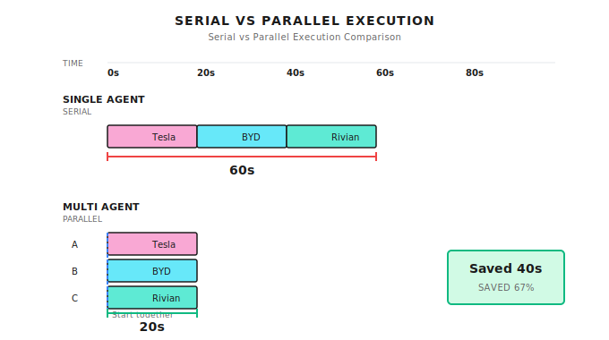
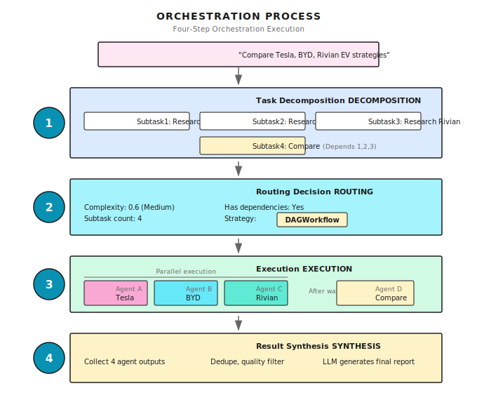
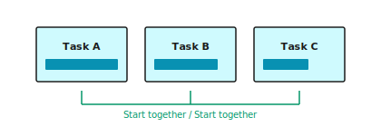
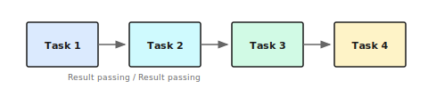
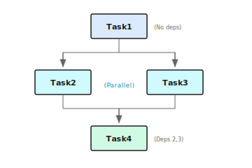

# Chapter 13: Orchestration Fundamentals

> **Multi-Agent orchestration isn't about having a bunch of Agents each doing their own thing—it's about making them collaborate like a symphony orchestra—with a conductor, division of labor, and coordination. But no matter how talented the conductor is, if the musicians are incompetent, it's all for nothing.**

---

> **Quick Track** (Master the core in 5 minutes)
>
> 1. Three hard limitations of single Agent: serial execution is slow, shallow depth, single point of failure
> 2. Three elements of orchestration: task decomposition, Agent assignment, result synthesis
> 3. Automatic vs configuration: auto-match for simple tasks, explicit configuration for complex tasks
> 4. Coordination overhead cannot be ignored: for simple tasks, a single Agent is actually faster
> 5. Orchestration is an architectural decision that requires balancing parallel benefits against coordination overhead
>
> **10-minute path**: 13.1-13.3 → 13.5 → Shannon Lab

---

## 13.1 Why Isn't a Single Agent Enough?

This chapter addresses one core question: **When a single Agent can't efficiently complete a task, how do you get multiple Agents to collaborate?**

Imagine you're managing a small research project—you need to analyze the EV strategies of three competitors (Tesla, BYD, Rivian). If you're working alone, what would you do?

You'd process them serially: research Tesla today, BYD tomorrow, Rivian the day after. Three days later, you finally have all the information collected, and you can start writing the comparative analysis.

But what if you had three assistants? You'd have them work simultaneously: Alice researches Tesla, Bob researches BYD, Carol researches Rivian. One day later, all three reports arrive at once, and you just need to synthesize and compare.

Roughly 3× faster.

**A single Agent is like working solo—it can complete tasks, but it's inefficient and shallow. Multi-Agent orchestration is about building a team with division of labor and collaboration.**

But building a team isn't as simple as "hiring more people." You need to: assign tasks, coordinate progress, integrate results, and handle conflicts. The Orchestrator is what does this.

### Three Hard Limitations of a Single Agent

Let me cut to the chase: a single Agent has three hard limitations.

### Limitation One: Serial Execution, Too Inefficient

Searching three companies is completely independent—there are no dependencies. But a single Agent can only do them one after another. What if we parallelize? The difference is obvious:



Saved 40 seconds. The more tasks, the bigger the gap.

### Limitation Two: Generalist Doing Specialist Work, Lacks Depth

"Design a business plan for an AI startup"—what does this task require?

- Market analysis: industry size, growth trends, competitive landscape
- Technical architecture: technology selection, cost estimation, feasibility assessment
- Financial projections: revenue model, cost structure, profit/loss analysis
- Marketing strategy: target users, customer acquisition channels, brand positioning

Have one "generalist" Agent handle all four at once? It might know a bit about each, but not enough depth in any.

A better approach: 4 specialist Agents, each focused on their area.

### Limitation Three: Single Point of Failure, No Redundancy

When an Agent goes down—network timeout, LLM error, tool call failure—the entire task fails.

Multi-Agent systems can implement fault tolerance: if one fails, the others continue; critical tasks can have backups.

### Multi-Agent vs Single Agent

| Capability | Single Agent | Multi-Agent |
|------------|--------------|-------------|
| **Parallel capability** | Serial execution | Concurrent execution |
| **Professional depth** | Generalist, knows a bit of everything | Specialist division, each with strengths |
| **Fault tolerance** | Single point of failure | Redundant fault tolerance |
| **Cost control** | Unified model | Select model per task (cheaper models for simple tasks) |

> **Note**: Multi-Agent isn't a silver bullet. Coordinating multiple Agents has overhead itself—communication, synchronization, result integration. When tasks are simple, a single Agent is actually faster. Only when tasks are complex enough do multi-Agent benefits outweigh coordination costs. I've seen people split "check the weather" into 3 Agents—completely unnecessary, and actually slower.

---

## 13.2 The Orchestrator: Conductor of Multi-Agent Systems

Multi-Agent systems need a "conductor"—the Orchestrator.

It doesn't do the actual work, but it decides:
- How to decompose tasks
- Who does what
- Execution order
- How to integrate results

### Four Core Responsibilities


**Analogy**: The orchestrator is like a restaurant's head chef.

A customer says "I want a steak dinner." The head chef won't do everything alone—they will:
1. **Decompose**: steak, sides, sauce, dessert
2. **Dispatch**: steak to the grill station, sides to the cold kitchen, sauce to the sauce chef
3. **Coordinate**: sauce goes on after the steak is ready, sides and steak come out together
4. **Synthesize**: plating, ensuring temperature and presentation are right

The head chef doesn't need to know how to make everything, but they need to know: who's good at what, what order makes sense, how to combine it all into one dish.

### Execution Flow



---

## 13.3 Routing Decisions: Which Strategy to Use?

Not all tasks need multi-Agent. The orchestrator's first decision is: **What path should this task take?**

### Shannon's Routing Logic

Shannon's `OrchestratorWorkflow` makes this judgment:

```go
// Determine if it's a simple task
simpleByShape := len(decomp.Subtasks) == 0 ||
                 (len(decomp.Subtasks) == 1 && !needsTools)
isSimple := decomp.ComplexityScore < simpleThreshold && simpleByShape

// Check for dependencies
hasDeps := false
for _, st := range decomp.Subtasks {
    if len(st.Dependencies) > 0 || len(st.Consumes) > 0 {
        hasDeps = true
        break
    }
}

switch {
case isSimple:
    // Simple task → Single Agent direct execution
    return SimpleTaskWorkflow(input)

case len(decomp.Subtasks) > 5 || hasDeps:
    // Complex task or has dependencies → Supervisor pattern
    return SupervisorWorkflow(input)

default:
    // Standard task → DAG workflow
    return DAGWorkflow(input)
}
```

**Implementation reference (Shannon)**: [`go/orchestrator/internal/workflows/orchestrator_router.go`](https://github.com/Kocoro-lab/Shannon/blob/main/go/orchestrator/internal/workflows/orchestrator_router.go) - OrchestratorWorkflow function

### Decision Tree

```
Task enters
    │
    ▼
Complexity < 0.3 AND single subtask AND no tools? ──Yes──► SimpleTaskWorkflow
    │                                                      (Single Agent direct execution)
    No
    │
    ▼
Subtasks > 5 OR has dependencies? ──Yes──► SupervisorWorkflow
    │                                      (Complex multi-Agent coordination)
    No
    │
    ▼
DAGWorkflow (default)
(Standard multi-Agent parallel/serial)
```

### Three Strategy Comparison

| Strategy | Use Case | Characteristics |
|----------|----------|-----------------|
| **SimpleTask** | Simple Q&A, single-step tasks | Lightest weight, single Agent |
| **DAGWorkflow** | 2-5 subtasks, possibly simple dependencies | Parallel/serial/hybrid execution |
| **Supervisor** | 6+ subtasks, complex dependencies, needs dynamic coordination | Team management, mailbox communication |

These three strategies will be covered in detail in the following chapters. For now, remember: **The orchestrator automatically selects a strategy based on task complexity**.

---

## 13.4 Three Execution Modes

Regardless of which strategy is chosen, Agents ultimately need to be executed. There are three execution modes:

### Mode One: Parallel Execution

Use case: Subtasks are mutually independent with no dependencies.



The core is **semaphore control**—limiting the number of Agents executing simultaneously to prevent resource exhaustion.

```go
type ParallelConfig struct {
    MaxConcurrency int  // Maximum concurrency, default 5
}

func ExecuteParallel(ctx workflow.Context, tasks []ParallelTask, config ParallelConfig) {
    // Semaphore to control concurrency
    semaphore := workflow.NewSemaphore(ctx, int64(config.MaxConcurrency))

    for i, task := range tasks {
        workflow.Go(ctx, func(ctx workflow.Context) {
            // Acquire semaphore (blocks if over concurrency limit)
            semaphore.Acquire(ctx, 1)
            defer semaphore.Release(1)

            // Execute task
            executeTask(task)
        })
    }
}
```

**Implementation reference (Shannon)**: [`go/orchestrator/internal/workflows/patterns/execution/parallel.go`](https://github.com/Kocoro-lab/Shannon/blob/main/go/orchestrator/internal/workflows/patterns/execution/parallel.go) - ExecuteParallel function

Why limit concurrency?

Say you have 10 search tasks, MaxConcurrency = 3:

```
t0: [Task 1] [Task 2] [Task 3]  ← 3 start simultaneously
t1: [1 done] [Task 4 starts]    ← 1 completes, 4 immediately fills in
t2: [2 done] [Task 5 starts]    ← 2 completes, 5 fills in
...
```

Without limits, 10 Agents calling the LLM API simultaneously would likely trigger rate limiting, making it slower instead.

### Mode Two: Sequential Execution

Use case: Tasks have implicit dependencies where the next one needs the previous one's result.



```go
type SequentialConfig struct {
    PassPreviousResults bool  // Whether to pass previous results to the next task
}

func ExecuteSequential(ctx workflow.Context, tasks []Task, config SequentialConfig) {
    var results []Result

    for i, task := range tasks {
        // Inject previous results into context
        if config.PassPreviousResults && len(results) > 0 {
            task.Context["previous_results"] = results
        }

        result := executeTask(task)
        results = append(results, result)
    }
}
```

The key is **result passing**. For example:

```
Task 1: "Get Tesla stock price"
        → Response: "$250"
        ↓
Task 2: "Calculate year-over-year growth"
        Context: {
          previous_results: [
            { response: "$250", numeric_value: 250 }
          ]
        }
        → Can directly use 250 for calculation
```

### Mode Three: Hybrid Execution (Hybrid/DAG)

Use case: Some tasks can run in parallel, some have dependencies.



The core is **dependency waiting**—tasks can only start after all their dependencies are complete.

```go
func waitForDependencies(
    ctx workflow.Context,
    dependencies []string,
    completedTasks map[string]bool,
    timeout time.Duration,
) bool {
    startTime := workflow.Now(ctx)
    deadline := startTime.Add(timeout)

    for workflow.Now(ctx).Before(deadline) {
        // Check if all dependencies are complete
        allDone := true
        for _, depID := range dependencies {
            if !completedTasks[depID] {
                allDone = false
                break
            }
        }
        if allDone {
            return true
        }

        // Wait 30 seconds before checking again
        workflow.AwaitWithTimeout(ctx, 30*time.Second, func() bool {
            // Condition check
            for _, depID := range dependencies {
                if !completedTasks[depID] {
                    return false
                }
            }
            return true
        })
    }

    return false  // Timeout
}
```

**Implementation reference (Shannon)**: [`go/orchestrator/internal/workflows/patterns/execution/hybrid.go`](https://github.com/Kocoro-lab/Shannon/blob/main/go/orchestrator/internal/workflows/patterns/execution/hybrid.go) - waitForDependencies function

---

## 13.5 Result Synthesis

Multiple Agents have finished running—how do you integrate the results?

### The Problem

Raw Agent output is typically:

1. **Redundant**: Different Agents may provide similar information
2. **Inconsistent format**: Each Agent has its own output style
3. **Variable quality**: Some succeed, some fail, some are half-baked

Users expect: a unified, complete, high-quality answer.

### Preprocessing: Deduplication and Filtering

```go
func preprocessResults(results []AgentResult) []AgentResult {
    // 1. Exact deduplication (Hash)
    seen := make(map[string]bool)
    exact := []AgentResult{}
    for _, r := range results {
        hash := computeHash(r.Response)
        if !seen[hash] {
            seen[hash] = true
            exact = append(exact, r)
        }
    }

    // 2. Similarity deduplication (Jaccard > 0.85)
    similar := []AgentResult{}
    for _, r := range exact {
        isDuplicate := false
        for _, s := range similar {
            if jaccardSimilarity(r.Response, s.Response) > 0.85 {
                isDuplicate = true
                break
            }
        }
        if !isDuplicate {
            similar = append(similar, r)
        }
    }

    // 3. Quality filtering
    filtered := []AgentResult{}
    noInfoPatterns := []string{
        "unable to retrieve",
        "failed to fetch",
        "no information available",
        "unable to access",
        "not found",
    }
    for _, r := range similar {
        if r.Success && !containsAny(r.Response, noInfoPatterns) {
            filtered = append(filtered, r)
        }
    }

    return filtered
}
```

### Synthesis Methods

**Simple synthesis**: Direct concatenation

Suitable when results are already well-formatted:

```go
func simpleSynthesis(results []AgentResult) string {
    var parts []string
    for _, r := range results {
        parts = append(parts, r.Response)
    }
    return strings.Join(parts, "\n\n")
}
```

**LLM synthesis**: Intelligent integration

Suitable when you need unified perspective, conflict resolution, and insight generation:

```go
func llmSynthesis(query string, results []AgentResult) string {
    prompt := fmt.Sprintf(`Synthesize the following research results to answer the question: %s

Requirements:
1. Eliminate duplicate information
2. Resolve contradictions (if any)
3. Highlight key insights
4. Present in a unified format

`, query)

    for i, r := range results {
        prompt += fmt.Sprintf("=== Source %d ===\n%s\n\n", i+1, r.Response)
    }

    return callLLM(prompt)
}
```

---

## 13.6 Token Budget Allocation

Cost control is even more important in multi-Agent scenarios.

### Why?

A single Agent burns 1000 tokens, multi-Agent might burn 5000. Without control, one complex task could use up an entire day's budget.

### Budget Allocation Strategies

**Simple strategy: Equal distribution**

```go
func allocateBudgetSimple(totalBudget int, numAgents int) int {
    return totalBudget / numAgents
}

// Example: Total budget 10000, 5 Agents → 2000 each
```

**Advanced strategy: Allocate by complexity**

```go
func allocateBudgetByComplexity(totalBudget int, subtasks []Subtask) map[string]int {
    budgets := make(map[string]int)

    // Calculate total complexity
    totalComplexity := 0.0
    for _, st := range subtasks {
        totalComplexity += st.Complexity
    }

    // Allocate proportionally
    for _, st := range subtasks {
        budgets[st.ID] = int(float64(totalBudget) * st.Complexity / totalComplexity)
    }

    return budgets
}

// Example: Total budget 10000
//     Task A (complexity 0.5) → 5000
//     Task B (complexity 0.3) → 3000
//     Task C (complexity 0.2) → 2000
```

Shannon's implementation:

```go
// Pass budget from router
n := len(decomp.Subtasks)
if n == 0 {
    n = 1
}
agentMax := res.RemainingTaskBudget / n

// Can set cap via environment variable or request context
if v := os.Getenv("TOKEN_BUDGET_PER_AGENT"); v != "" {
    if cap, err := strconv.Atoi(v); err == nil && cap > 0 && cap < agentMax {
        agentMax = cap
    }
}

input.Context["budget_agent_max"] = agentMax
```

---

## 13.7 Control Signals

During orchestration, users might want to: pause, resume, or cancel.

### Temporal's Signal Mechanism

Shannon uses Temporal's Signal mechanism to implement control:

```go
// Set up control signal handler
controlHandler := &ControlSignalHandler{
    WorkflowID: workflowID,
    AgentID:    "orchestrator",
}
controlHandler.Setup(ctx)

// Check signals at key points
checkpoints := []string{
    "pre_routing",         // Before routing decision
    "post_decomposition",  // After task decomposition
    "pre_dag_workflow",    // Before entering DAG
}

for _, checkpoint := range checkpoints {
    if err := controlHandler.CheckPausePoint(ctx, checkpoint); err != nil {
        return TaskResult{Success: false, ErrorMessage: err.Error()}, err
    }
}
```

### Child Workflow Registration

When the orchestrator launches child workflows, they need to be registered to propagate signals:

```go
// Launch child workflow
childFuture := workflow.ExecuteChildWorkflow(ctx, DAGWorkflow, input)

// Get child workflow ID
var childExec workflow.Execution
childFuture.GetChildWorkflowExecution().Get(ctx, &childExec)

// Register (so pause/cancel signals propagate to child workflows)
controlHandler.RegisterChildWorkflow(childExec.ID)

// Unregister after completion
defer controlHandler.UnregisterChildWorkflow(childExec.ID)
```

---

## 13.8 Complete Example

Let's tie together everything from above with a complete multi-Agent research task:

```go
func CompanyResearchWorkflow(ctx workflow.Context, query string) (string, error) {
    companies := []string{"Tesla", "BYD", "Rivian"}

    // 1. Build parallel tasks
    tasks := make([]ParallelTask, len(companies))
    for i, company := range companies {
        tasks[i] = ParallelTask{
            ID:          fmt.Sprintf("research-%s", strings.ToLower(company)),
            Description: fmt.Sprintf("Research %s's 2024 EV strategy", company),
            SuggestedTools: []string{"web_search"},
            Role:        "researcher",
        }
    }

    // 2. Execute in parallel
    config := ParallelConfig{
        MaxConcurrency: 3,
        EmitEvents:     true,
    }
    result, err := ExecuteParallel(ctx, tasks, sessionID, history, config, budgetPerAgent, userID, modelTier)
    if err != nil {
        return "", err
    }

    // 3. Preprocess results
    processed := preprocessResults(result.Results)

    // 4. LLM synthesis
    synthesis := llmSynthesis(query, processed)

    return synthesis, nil
}
```

Execution timeline:

```
0s   ┌─ Orchestrator starts
     ├─ Task decomposition: 3 research tasks + 1 synthesis task
     └─ Routing decision: DAGWorkflow

1s   ├─ Launch 3 research Agents in parallel
     │   ├─ Agent A (Tesla):  Searching...
     │   ├─ Agent B (BYD):    Searching...
     │   └─ Agent C (Rivian): Searching...

15s  ├─ Agent B completes
20s  ├─ Agent C completes
25s  ├─ Agent A completes (Tesla has the most info)

26s  ├─ Start result synthesis
     │   ├─ Dedup: Removed 2 duplicate items
     │   ├─ Filter: Removed 1 failed result
     │   └─ LLM synthesis analysis

45s  └─ Output final report

Total time: ~45 seconds (serial would take ~75 seconds)
```

---

## 13.9 Common Pitfalls

### Pitfall 1: Over-parallelization

```go
// Dangerous: 100 concurrent, API will rate limit
config := ParallelConfig{MaxConcurrency: 100}

// Reasonable: Set based on API limits
config := ParallelConfig{MaxConcurrency: 5}
```

I've seen people set concurrency to 50, only to get a bunch of 429 Too Many Requests from the LLM API. Worse than serial execution.

### Pitfall 2: Ignoring Failed Tasks

```go
// Problem: Only process successes, failures are ignored
for _, r := range results {
    if r.Success {
        process(r)
    }
}

// Improvement: Monitor success rate
successRate := float64(successCount) / float64(total)
if successRate < 0.7 {
    logger.Warn("Low success rate", "rate", successRate)
    // May need retry or alerting
}
```

### Pitfall 3: Result Synthesis Loses Information

Simple concatenation can lead to:
- Duplicate information (two Agents both mention "Tesla market cap is $800 billion")
- Contradictory information (one says 15% growth, another says 12%)
- Lack of insights (just listing, no comparative analysis)

When using LLM synthesis, the prompt should explicitly require:

```go
synthesisPrompt := `Synthesize the following research results:

Requirements:
1. Eliminate duplicates
2. Mark contradictions (if any)
3. Generate a comparative analysis table
4. Summarize key insights (3-5 items)

...
`
```

### Pitfall 4: Poor Budget Allocation

```go
// Problem: Same budget for simple and complex tasks
budgetPerAgent := totalBudget / numAgents

// Improvement: Allocate based on estimated tokens per task
for _, st := range subtasks {
    budgets[st.ID] = int(float64(totalBudget) * float64(st.EstimatedTokens) / float64(totalEstimated))
}
```

---

## 13.10 Other Framework Implementations

Orchestration is the core problem of multi-Agent systems, and each framework has its own approach:

| Framework | Orchestration Method | Characteristics |
|-----------|---------------------|-----------------|
| **LangGraph** | Graph definition + node execution | Flexible, requires manual graph definition |
| **AutoGen** | GroupChat + Manager | Conversation-driven, automatic speaker selection |
| **CrewAI** | Crew + Process | Clear role definitions, supports sequential/hierarchical |
| **OpenAI Swarm** | handoff() | Lightweight, direct Agent-to-Agent handoff |

LangGraph example:

```python
from langgraph.graph import StateGraph

# Define state
class ResearchState(TypedDict):
    query: str
    tesla_data: str
    byd_data: str
    synthesis: str

# Define graph
graph = StateGraph(ResearchState)
graph.add_node("research_tesla", research_tesla_node)
graph.add_node("research_byd", research_byd_node)
graph.add_node("synthesize", synthesize_node)

# Define edges (dependencies)
graph.add_edge(START, "research_tesla")
graph.add_edge(START, "research_byd")
graph.add_edge("research_tesla", "synthesize")
graph.add_edge("research_byd", "synthesize")
```

---

## That's This Chapter

The core message is one sentence: **The Orchestrator is the conductor of multi-Agent systems—decomposing tasks, dispatching execution, coordinating dependencies, synthesizing results**.

## Summary

1. **Three limitations of single Agent**: Serial inefficiency, generalist not specialist, single point of failure
2. **Orchestrator's four responsibilities**: Decompose → Dispatch → Coordinate → Synthesize
3. **Routing decisions**: Simple tasks use SimpleTask, complex tasks use DAG or Supervisor
4. **Three execution modes**: Parallel (independent tasks), Sequential (chain dependencies), Hybrid (DAG)
5. **Result synthesis**: Dedup → Filter → LLM integration

---

## Shannon Lab (10-minute hands-on)

This section helps you map this chapter's concepts to Shannon source code in 10 minutes.

### Required Reading (1 file)

- [`orchestrator_router.go`](https://github.com/Kocoro-lab/Shannon/blob/main/go/orchestrator/internal/workflows/orchestrator_router.go): Find the OrchestratorWorkflow function's routing switch statement, understand how it determines "simple task", "needs Supervisor", and how it delegates to child workflows

### Optional Deep Dives (2 files, pick based on interest)

- [`execution/parallel.go`](https://github.com/Kocoro-lab/Shannon/blob/main/go/orchestrator/internal/workflows/patterns/execution/parallel.go): Understand how semaphore control is implemented (workflow.NewSemaphore), why futuresChan + Selector is used to collect results
- [`execution/hybrid.go`](https://github.com/Kocoro-lab/Shannon/blob/main/go/orchestrator/internal/workflows/patterns/execution/hybrid.go): Understand waitForDependencies' incremental timeout checking, why workflow.AwaitWithTimeout is used instead of blocking indefinitely

---

## Exercises

### Exercise 1: Routing Decision Analysis

Analyze which path these tasks would take:

1. "What's the weather in Beijing today"
2. "Compare iPhone and Android market share"
3. "Design a complete e-commerce system architecture including frontend, backend, database, cache, and message queue"

For each task, explain:
- Expected complexity score range
- Which workflow it would use (SimpleTask / DAG / Supervisor)
- Why

### Exercise 2: Concurrency Settings

Assume your LLM API limit is 10 requests per second, each task requires 3 LLM calls, averaging 5 seconds each.

Questions:
1. If you have 20 subtasks, what should MaxConcurrency be?
2. What happens if you set it too high?
3. What happens if you set it too low?

### Exercise 3 (Advanced): Design a Synthesis Prompt

Design an LLM synthesis prompt for a "multi-company financial report comparison analysis" task.

Requirements:
- How to handle duplicate information
- How to handle data contradictions
- Output format requirements (table + insights)
- Citation annotation requirements

---

## Want to Go Deeper?

- [Temporal Workflows](https://docs.temporal.io/develop/go/foundations) - Understanding the infrastructure for workflow orchestration
- [LangGraph Multi-Agent](https://python.langchain.com/docs/langgraph) - Python ecosystem's graph orchestration solution
- [AutoGen GroupChat](https://microsoft.github.io/autogen/) - Microsoft's conversational multi-Agent framework

---

## Next Chapter Preview

The orchestrator decides "who does what," but "how to do it" is still unresolved.

When tasks have complex dependencies—A waits for B, B waits for C, C can run in parallel with D—simple serial or parallel execution won't cut it.

The next chapter covers **DAG Workflows**: using directed acyclic graphs to model task dependencies and implement intelligent scheduling.

See you in the next chapter.
