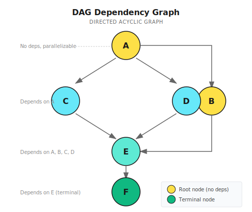
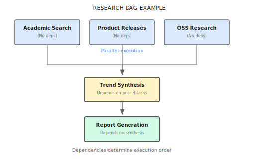

# Chapter 14: DAG Workflows

> **The essence of DAG workflows is the dependency graph—telling the orchestrator which tasks can run simultaneously and which must wait. But no matter how elegant your graph looks, it's worthless if the execution engine isn't reliable.**

---

> **Quick Track** (Master the core in 5 minutes)
>
> 1. DAG = Directed Acyclic Graph, models task execution order using dependencies
> 2. Three modes: Parallel (independent), Sequential (chained), Hybrid (complex dependencies)
> 3. Temporal's single-threaded model requires no locks, but you must use deterministic APIs
> 4. Dependency waiting uses incremental timeout checks, not blocking for the entire timeout
> 5. Simple parallel tasks work fine with DAG; consider Supervisor for more than 5 subtasks
>
> **10-minute path**: 14.1-14.2 → 14.4 → Shannon Lab

---

## 14.1 What's the Problem?

Imagine this scenario:

You're writing a financial analysis report that needs three parts: revenue trends, cost structure, and profit margin changes.

If you're working alone, you would: query revenue data, organize it, analyze it—30 minutes. Then query cost data—another 30 minutes. Finally query profit margins—another 30 minutes. 90 minutes total.

But if you have three assistants, they can work simultaneously: Alice queries revenue, Bob queries costs, Carol queries profit margins. 30 minutes later, all three datasets arrive at once, and you just need to synthesize the analysis.

Roughly 3× faster.

**The core value of DAG workflows is exactly this—letting Agents know which tasks can run in parallel and which must wait, thereby maximizing execution efficiency.**

But here's the question: what if subsequent tasks depend on previous results? For example, "calculate profit margin" must wait until both "revenue" and "costs" are queried. This requires dependency management—DAG (Directed Acyclic Graph) is precisely used to express these dependency relationships.

### A Real Complex Task

Look at a real research task:

```
User: Analyze Tesla's 2024 financial performance, including revenue growth, profit margin changes, and comparison with competitors
```

This task can be broken down into:

```
Task A: Get Tesla financial report data
Task B: Get competitor financial report data
Task C: Calculate Tesla revenue growth rate    ← Depends on A
Task D: Calculate profit margin change trend   ← Depends on A
Task E: Competitor comparison analysis         ← Depends on A, B, C, D
Task F: Generate comprehensive report          ← Depends on E
```

Key observations:

- **A and B can run in parallel**—they're unrelated
- **C and D can also run in parallel**—both depend on A, but are independent of each other
- **E must wait**—needs A, B, C, D to all complete
- **F is the final step**—depends on E's result

This kind of complex dependency relationship can't be handled by simple serial or parallel execution. You need DAG.

### Three Execution Methods Compared

| Feature | Pure Serial | Pure Parallel | DAG |
|---------|-------------|---------------|-----|
| Dependency management | Natural ordering | Can't handle | Explicit dependency graph |
| Execution efficiency | Slowest | Fast but may be chaotic | Smart parallelization |
| Resource control | Predictable | Prone to explosion | Controllable |
| Result passing | Simple | Hard to coordinate | Dependency injection |
| Complexity | Low | Medium | Higher |

> **Note**: DAG isn't a silver bullet. If your task is just "search three companies" then "synthesize," simple "parallel first then serial" is enough—no need to draw a DAG. Only when dependencies are truly complex—multi-layer nesting, partial parallel partial serial—does DAG add value. An over-engineered DAG is worse than no DAG at all.

---

## 14.2 What Is DAG?

DAG = Directed Acyclic Graph.

**Directed**: Edges have direction, representing dependencies (A → C means C depends on A)

**Acyclic**: No circular dependencies (A depends on B, B depends on C, C depends on A—that's a deadlock)

It looks like this:



### Why "Acyclic"?

Here's a wrong example:

```
A → B → C → A  (Cycle!)
```

A waits for C, C waits for B, B waits for A—all three tasks wait for each other, none can start.

This is called **deadlock**. DAG's "acyclic" constraint exists to avoid this situation.

### Subtask Data Structure and Dependency Declaration

Each subtask needs this information:

```go
type Subtask struct {
    ID           string
    Description  string
    Dependencies []string  // Method 1: Task dependency (explicitly declare "who I need to wait for")
    Produces     []string  // What data it produces
    Consumes     []string  // Method 2: Data dependency ("I need this data", orchestrator finds producer)
    SuggestedTools []string
}

// Comparison example:
// Task dependency: {"id": "calc_growth", "dependencies": ["fetch_data"]}
// Data dependency: {"id": "calc_growth", "consumes": ["financial_data"]}
// Data dependency is more flexible—you don't need to know which task produces it
```

**Implementation reference (Shannon)**: [`go/orchestrator/internal/workflows/strategies/dag.go`](https://github.com/Kocoro-lab/Shannon/blob/main/go/orchestrator/internal/workflows/strategies/dag.go) - Subtask struct definition

---

## 14.3 Execution Flow

DAGWorkflow execution has six steps:

```
Step 1: Task decomposition
        └─► LLM analyzes task, generates subtask list and dependencies

Step 2: Feature check
        └─► Has tools? Has dependencies? How complex?

Step 3: Strategy selection
        ├─► Simple task (single step, no tools) → SimpleTask
        ├─► Has dependencies → Hybrid mode
        ├─► No dependencies + LLM suggests sequential → Sequential
        └─► No dependencies + default → Parallel

Step 4: Execution
        └─► Schedule Agents per strategy

Step 5: Synthesis
        └─► LLM integrates all results

Step 6: Optional reflection
        └─► Quality assessment (if configured)
```

### Core Code Logic

```go
func DAGWorkflow(ctx workflow.Context, input TaskInput) (TaskResult, error) {
    // 1. Task decomposition (may come from upstream or done here)
    var decomp DecompositionResult
    if input.PreplannedDecomposition != nil {
        decomp = *input.PreplannedDecomposition
    } else {
        err = workflow.ExecuteActivity(ctx, DecomposeTaskActivity, ...).Get(ctx, &decomp)
    }

    // 2. Check for dependencies
    hasDependencies := false
    for _, subtask := range decomp.Subtasks {
        if len(subtask.Dependencies) > 0 || len(subtask.Consumes) > 0 {
            hasDependencies = true
            break
        }
    }

    // 3. Select execution strategy
    execStrategy := decomp.ExecutionStrategy
    if execStrategy == "" {
        execStrategy = "parallel"  // Default parallel
    }

    // 4. Execute based on strategy
    var agentResults []AgentExecutionResult
    if hasDependencies {
        agentResults = executeHybridPattern(ctx, decomp.Subtasks, ...)
    } else if execStrategy == "sequential" {
        agentResults = executeSequentialPattern(ctx, decomp.Subtasks, ...)
    } else {
        agentResults = executeParallelPattern(ctx, decomp.Subtasks, ...)
    }

    // 5. Synthesize results
    synthesis := synthesizeResults(ctx, agentResults, input.Query)

    return TaskResult{Result: synthesis, Success: true}, nil
}
```

**Implementation reference (Shannon)**: [`go/orchestrator/internal/workflows/strategies/dag.go`](https://github.com/Kocoro-lab/Shannon/blob/main/go/orchestrator/internal/workflows/strategies/dag.go) - DAGWorkflow function

---

## 14.4 Three Execution Modes in Detail

### Mode One: Parallel Execution

Use case: Subtasks are completely independent with no dependencies.


The core is **semaphore control**—limiting the number of Agents executing simultaneously:

```go
func ExecuteParallel(ctx workflow.Context, tasks []ParallelTask, config ParallelConfig) (*ParallelResult, error) {
    // Create semaphore to control concurrency (default MaxConcurrency=5)
    semaphore := workflow.NewSemaphore(ctx, int64(config.MaxConcurrency))
    futuresChan := workflow.NewChannel(ctx)

    for i, task := range tasks {
        i, task := i, task
        workflow.Go(ctx, func(ctx workflow.Context) {
            semaphore.Acquire(ctx, 1)  // Acquire semaphore (blocks if over concurrency limit)
            future := workflow.ExecuteActivity(ctx, ExecuteAgent, task)
            futuresChan.Send(ctx, futureWithIndex{Index: i, Future: future})
            semaphore.Release(1)       // Release semaphore, let waiting tasks fill in
        })
    }
    // Collect results...
}
// Timing example (MaxConcurrency=3):
// t0: [Task 1] [Task 2] [Task 3] ← 3 start simultaneously
// t1: [1 done] [Task 4 starts]   ← 1 completes, 4 immediately fills in
```

**Implementation reference (Shannon)**: [`parallel.go`](https://github.com/Kocoro-lab/Shannon/blob/main/go/orchestrator/internal/workflows/patterns/execution/parallel.go)

Without concurrency limits, 10 tasks starting simultaneously could trigger LLM rate limiting (429), slow response times, or OOM.

### Mode Two: Sequential Execution

Use case: Tasks have implicit dependencies where the next needs the previous result.

```
Task 1 ──► Task 2 ──► Task 3 ──► Task 4
  │          ↑
  └──────────┘ Result passing
```

```go
func ExecuteSequential(ctx workflow.Context, tasks []Task, config SequentialConfig) []Result {
    var results []Result
    for _, task := range tasks {
        if config.PassPreviousResults && len(results) > 0 {
            // Inject previous results into current task's context
            task.Context["previous_results"] = buildPreviousResults(results)
            // Agent B receives: {"previous_results": {"task_1": {"response": "...", "numeric_value": 1234}}}
            // Can directly use numeric_value for calculations without parsing text
        }
        results = append(results, executeTask(ctx, task))
    }
    return results
}
```

### Mode Three: Hybrid Execution

Use case: Has explicit dependencies, but tasks without dependencies can run in parallel.

This is the most complex mode. The core is **dependency waiting**:

```go
func ExecuteHybrid(ctx workflow.Context, tasks []HybridTask, config HybridConfig) (*HybridResult, error) {
    completedTasks := make(map[string]bool)      // Safe under Temporal's single-threaded model, no lock needed
    taskResults := make(map[string]AgentExecutionResult)
    semaphore := workflow.NewSemaphore(ctx, int64(config.MaxConcurrency))

    for i := range tasks {
        task := tasks[i]
        workflow.Go(ctx, func(ctx workflow.Context) {
            // Wait for dependencies to complete
            waitForDependencies(ctx, task.Dependencies, completedTasks, config.DependencyWaitTimeout)
            semaphore.Acquire(ctx, 1)
            result := executeTask(ctx, task)
            completedTasks[task.ID] = true
            taskResults[task.ID] = result
            semaphore.Release(1)
        })
    }
    // Collect results...
}

func waitForDependencies(ctx workflow.Context, deps []string, completed map[string]bool, timeout time.Duration) bool {
    deadline := workflow.Now(ctx).Add(timeout)
    checkInterval := 30 * time.Second  // Incremental checks rather than blocking, better UX
    for workflow.Now(ctx).Before(deadline) {
        ok, _ := workflow.AwaitWithTimeout(ctx, checkInterval, func() bool {
            for _, depID := range deps {
                if !completed[depID] { return false }
            }
            return true
        })
        if ok { return true }
    }
    return false  // Timeout
}
```

**Implementation reference (Shannon)**: [`hybrid.go`](https://github.com/Kocoro-lab/Shannon/blob/main/go/orchestrator/internal/workflows/patterns/execution/hybrid.go)

**Why use incremental checks (30s) instead of blocking (6min)**: Users seeing "waiting 30 seconds" is friendlier than "waiting 6 minutes"; when dependency completes in 10 seconds, work can start after 30 seconds.

**Execution timing example**:

```
Assume: A, B have no dependencies, C depends on A, D depends on A+B, E depends on C+D

t0s:   [A starts] [B starts]      ← A, B start in parallel
t10s:  [A done]                   ← A completes
t11s:  [C starts]                 ← C's dependencies satisfied, starts immediately
t15s:  [B done]                   ← B completes
t16s:  [D starts]                 ← D's dependencies (A+B) both satisfied
t20s:  [C done]                   ← C completes
t25s:  [D done]                   ← D completes
t26s:  [E starts]                 ← E's dependencies (C+D) both satisfied
t35s:  [E done]                   ← All complete

Total time: 35 seconds
Serial time: 10+5+10+10+9 = 44 seconds
Savings: 20%+
```

---

## 14.5 Temporal's Single-Threaded Model

Temporal workflows run in a **single-threaded, deterministic** event loop:

```go
// In Temporal workflows, concurrent map writes are safe (cooperative coroutine scheduling, no sync.Mutex needed)
completedTasks := make(map[string]bool)
for i := range tasks {
    workflow.Go(ctx, func(ctx workflow.Context) {
        completedTasks[task.ID] = true  // Looks concurrent, but actually single-threaded safe
    })
}

// ========== Determinism Rules (must follow) ==========
// Correct                                      // Wrong (breaks determinism, replay fails)
workflow.Now(ctx)                               // time.Now()
workflow.NewTimer(ctx, 30*time.Second)          // time.Sleep(30*time.Second)
workflow.SideEffect(ctx, func(ctx workflow.Context) interface{} { return rand.Intn(100) })  // rand.Intn(100)
```

**Why determinism matters**: When a workflow crashes, Temporal replays from event history. If you use `time.Now()`, replay gets a different time, causing state inconsistency.

---

## 14.6 Strategy Selection Logic

How does the orchestrator decide which mode to use?

```go
func selectExecutionStrategy(decomp DecompositionResult) string {
    // 1. Check for explicit dependencies
    hasDependencies := false
    for _, st := range decomp.Subtasks {
        if len(st.Dependencies) > 0 || len(st.Consumes) > 0 {
            hasDependencies = true
            break
        }
    }

    // 2. Has dependencies → Hybrid
    if hasDependencies {
        return "hybrid"
    }

    // 3. LLM suggested a strategy? Respect it
    if decomp.ExecutionStrategy == "sequential" {
        return "sequential"
    }

    // 4. Default → Parallel
    return "parallel"
}
```

### When Does LLM Suggest Sequential?

The task decomposition prompt asks the LLM to judge:

```
Analyze whether subtasks have sequential dependencies:
- If later tasks need earlier results to execute → choose sequential
- If tasks are completely independent → choose parallel
- If partially independent, partially dependent → declare dependencies in the dependencies field
```

Examples:

```
Task: "First search Tesla stock price, then calculate year-over-year growth"
LLM judges: Second step needs first step's result → sequential

Task: "Search stock prices for Tesla, BYD, Rivian"
LLM judges: Three searches are completely independent → parallel

Task: "Search three companies' stock prices, then do comparison analysis"
LLM judges: Searches are independent, comparison depends on search results → hybrid
```

### Configuration Options

```go
type WorkflowConfig struct {
    ParallelMaxConcurrency  int   // Max parallel concurrency, default 5
    HybridDependencyTimeout int   // Dependency wait timeout (seconds), default 360
    SequentialPassResults   bool  // Whether to pass results in sequential, default true
}
```

---

## 14.7 Practice: Research Agent v0.5

Let's upgrade the Research Agent from previous chapters to a DAG workflow version:

```
User: Research major advances in the AI Agent field in 2024
```

### Task Decomposition

Structure after LLM decomposition:



Execution strategy: Hybrid

### Task Decomposition JSON

```json
{
  "execution_strategy": "hybrid",
  "subtasks": [
    {
      "id": "academic_search",
      "description": "Search 2024 AI Agent related top conference papers (NeurIPS, ICML, ACL, etc.)",
      "suggested_tools": ["web_search"],
      "dependencies": [],
      "produces": ["academic_findings"]
    },
    {
      "id": "product_search",
      "description": "Track major AI Agent product releases in 2024 (Claude, GPT, Gemini, etc.)",
      "suggested_tools": ["web_search"],
      "dependencies": [],
      "produces": ["product_findings"]
    },
    {
      "id": "opensource_search",
      "description": "Research popular AI Agent open source projects in 2024 (LangChain, AutoGen, CrewAI, etc.)",
      "suggested_tools": ["web_search"],
      "dependencies": [],
      "produces": ["opensource_findings"]
    },
    {
      "id": "trend_analysis",
      "description": "Comprehensive analysis of AI Agent development trends",
      "dependencies": ["academic_search", "product_search", "opensource_search"],
      "consumes": ["academic_findings", "product_findings", "opensource_findings"],
      "produces": ["trend_analysis"]
    },
    {
      "id": "report_generation",
      "description": "Generate comprehensive research report",
      "dependencies": ["trend_analysis"],
      "consumes": ["trend_analysis"]
    }
  ]
}
```

### Execution Timeline

```
t=0s:   Orchestrator starts
        ├── Parse task decomposition result
        ├── Detect dependencies → Choose Hybrid mode
        └── Launch 5 task executors

t=1s:   3 search tasks start in parallel
        ├── academic_search:  Searching...
        ├── product_search:   Searching...
        └── opensource_search: Searching...
        (trend_analysis and report_generation wait for dependencies)

t=12s:  opensource_search completes (less content)
t=15s:  product_search completes
t=18s:  academic_search completes (more papers)

t=19s:  trend_analysis starts
        ├── All dependencies satisfied
        └── Context includes 3 search results

t=28s:  trend_analysis completes

t=29s:  report_generation starts
        └── Context includes trend analysis result

t=38s:  report_generation completes
        └── Return final report
```

**Total time**: ~38 seconds

**If serial execution**: 12 + 15 + 18 + 9 + 9 = 63 seconds

**Savings**: ~40%

---

## 14.8 Common Pitfalls

| Pitfall | Problem Description | Solution |
|---------|--------------------| ---------|
| Circular dependency | A→B→C→A, deadlock | Use Kahn's algorithm to detect cycles |
| Dependency timeout | 60s timeout, but task takes 2min | Set reasonable timeout (default 6min) |
| Concurrency too high | 20 concurrent causes LLM overload | Control concurrency: personal accounts 3-5, teams 5-10 |
| Forgot to pass results | Subsequent tasks can't get previous data | Enable PassDependencyResults |
| Case inconsistency | `Financial_Data` vs `financial_data` | Normalize topic names (all lowercase + underscores) |

```go
// Cycle detection example (Kahn's algorithm)
func detectCycle(subtasks []Subtask) error {
    inDegree := make(map[string]int)
    for _, st := range subtasks {
        for _, dep := range st.Dependencies { inDegree[dep]++ }
    }
    queue := []string{}
    for _, st := range subtasks {
        if inDegree[st.ID] == 0 { queue = append(queue, st.ID) }
    }
    visited := 0
    for len(queue) > 0 {
        node := queue[0]; queue = queue[1:]; visited++
        // ... update inDegree, add to queue when in-degree becomes 0
    }
    if visited != len(subtasks) { return fmt.Errorf("cycle detected") }
    return nil
}
```

---

## 14.9 Other Frameworks' DAG Implementations

| Framework | DAG Representation | Execution Engine | Characteristics |
|-----------|-------------------|------------------|-----------------|
| **LangGraph** | StateGraph | Self-built | Flexible, steep learning curve |
| **Prefect** | Task dependencies | Prefect Orion | Heavy-weight, full-featured |
| **Airflow** | DAG definition files | Airflow Scheduler | Traditional data engineering |
| **Shannon** | Subtask.Dependencies | Temporal | Production-grade reliability |

LangGraph example:

```python
from langgraph.graph import StateGraph, START, END

class ResearchState(TypedDict):
    query: str
    academic: str
    products: str
    opensource: str
    analysis: str
    report: str

graph = StateGraph(ResearchState)

# Add nodes
graph.add_node("academic_search", academic_node)
graph.add_node("product_search", product_node)
graph.add_node("opensource_search", opensource_node)
graph.add_node("analysis", analysis_node)
graph.add_node("report", report_node)

# Add edges (define dependencies)
graph.add_edge(START, "academic_search")
graph.add_edge(START, "product_search")
graph.add_edge(START, "opensource_search")
graph.add_edge("academic_search", "analysis")
graph.add_edge("product_search", "analysis")
graph.add_edge("opensource_search", "analysis")
graph.add_edge("analysis", "report")
graph.add_edge("report", END)

app = graph.compile()
```

---

## That's This Chapter

The core message is one sentence: **DAG workflows achieve intelligent scheduling through dependency graphs—parallelizing what can be parallelized, waiting where waiting is needed**.

## Summary

1. **What is DAG**: Directed Acyclic Graph, used to represent task dependency relationships
2. **Three modes**: Parallel (independent), Sequential (chained), Hybrid (complex dependencies)
3. **Temporal single-threaded**: No locks needed, but use deterministic APIs
4. **Dependency waiting**: Incremental timeout checks, no blocking indefinitely
5. **Configuration-driven**: Concurrency, timeouts, result passing are all configurable

---

## Shannon Lab (10-minute hands-on)

This section helps you map this chapter's concepts to Shannon source code in 10 minutes.

### Required Reading (1 file)

- [`execution/hybrid.go`](https://github.com/Kocoro-lab/Shannon/blob/main/go/orchestrator/internal/workflows/patterns/execution/hybrid.go): Look at the `ExecuteHybrid` function's overall framework, `waitForDependencies` dependency waiting implementation, `HybridConfig` options, understand how semaphores control concurrency

### Optional Deep Dives (2 files, pick based on interest)

- [`execution/parallel.go`](https://github.com/Kocoro-lab/Shannon/blob/main/go/orchestrator/internal/workflows/patterns/execution/parallel.go): Understand the futuresChan + Selector result collection pattern, why semaphore is only released after result processing completes
- [`strategies/dag.go`](https://github.com/Kocoro-lab/Shannon/blob/main/go/orchestrator/internal/workflows/strategies/dag.go): Understand strategy selection logic, how to determine if there are dependencies

---

## Exercises

### Exercise 1: DAG Design

Design a DAG for "E-commerce Promotion Campaign Effectiveness Analysis":

Input: Analyze Double 11 promotion campaign effectiveness

Requirements:
1. Draw the DAG diagram
2. Write out each task's dependencies and produces/consumes
3. Estimate how much time savings compared to serial execution

### Exercise 2: Cycle Detection

Do the following dependencies have a cycle? If so, how would you fix it?

```json
{
  "subtasks": [
    {"id": "data_fetch", "dependencies": []},
    {"id": "preprocess", "dependencies": ["data_fetch"]},
    {"id": "train_model", "dependencies": ["preprocess", "validate"]},
    {"id": "validate", "dependencies": ["train_model"]},
    {"id": "deploy", "dependencies": ["validate"]}
  ]
}
```

### Exercise 3 (Advanced): Optimize Dependency Waiting

The current `waitForDependencies` uses fixed interval checks. Design an optimization:

Requirements:
1. Notify immediately when dependency completes (instead of waiting for next check)
2. Maintain Temporal determinism
3. Draw a timing diagram comparing before and after optimization

---

## Want to Go Deeper?

- [Temporal Workflows](https://docs.temporal.io/develop/go/foundations#workflows) - Temporal workflow fundamentals
- [Topological Sorting](https://en.wikipedia.org/wiki/Topological_sorting) - Topological sorting algorithms
- [LangGraph](https://python.langchain.com/docs/langgraph) - Python graph orchestration framework

---

## Next Chapter Preview

DAG workflows solve the scheduling problem for "known dependencies." But some scenarios are more complex:

- Variable number of tasks (might need to add people mid-way)
- Need dynamic communication between Agents
- Partial failures require intelligent degradation

The next chapter covers **Supervisor Pattern**—when DAG isn't enough, how to handle more complex multi-Agent scenarios through dynamic team management.

Ready? Let's go.
