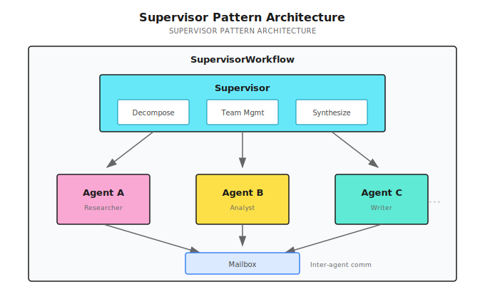
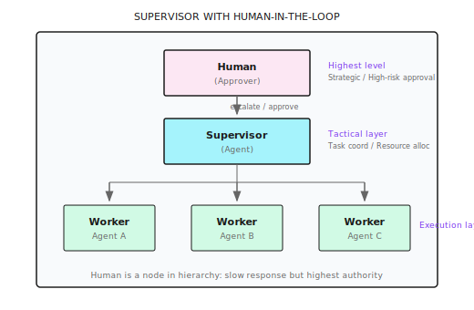

# Chapter 15: Supervisor Pattern

> **Supervisor is the management layer of multi-Agent systems—it doesn't do the actual work, but it decides who does what, how to coordinate, and what to do when things fail. The value of management lies in making the team's total output greater than the sum of individuals, not in managing more.**

---

> **Quick Track** (Master the core in 5 minutes)
>
> 1. Use Supervisor when you have more than 5 subtasks or need dynamic team adjustment
> 2. Mailbox system enables async communication between Agents, must use non-blocking send
> 3. Dynamic recruitment triggered via Signal, can add members at runtime
> 4. Smart fault tolerance: 50%+1 failure threshold, partial failures don't affect the whole
> 5. **Human-in-the-Loop**: Humans are the highest-level Supervisor in the hierarchy, critical decisions need escalation
> 6. Simple tasks are still better handled by DAG, Supervisor has more overhead
>
> **10-minute path**: 15.1-15.3 → 15.5 → 15.12 (HITL) → Shannon Lab

---

## 15.1 When to Use Supervisor?

The previous chapter covered DAG workflows—scheduling tasks through dependency graphs, parallelizing what can be parallelized, waiting where needed. DAG is powerful, but it has an assumption: **the task structure is fixed**.

If you can plan ahead "what tasks exist and who depends on whom," DAG is sufficient. But some scenarios aren't like that.

Last year I helped a consulting firm build a competitive analysis Agent. Initially, the requirements were clear: analyze 5 competitors' products, pricing, and market share. I designed 5 parallel research tasks + 1 synthesis task using DAG.

After launch, the client had a new request: "Can you automatically deep-dive into a company's technical patents if it turns out to be particularly important during analysis?"

This exceeds DAG's capability. DAG tasks are fixed—you can't "add people" mid-execution. You can't say "hey, this company is worth deeper research, let's send in a patent analyst" during execution.

**Supervisor pattern solves exactly these problems—when task structure needs dynamic adjustment, Agents need to communicate with each other, or team size is large, you need a "management layer" to coordinate.**

DAG is strong, but has limitations. Here's a comparison:

| Scenario | DAG | Supervisor |
|----------|-----|-----------|
| Pre-defined task structure | Excels | Also supports |
| Dynamic task generation | Not supported | Runtime recruitment |
| Inter-Agent communication | Only through dependency passing | Mailbox system |
| Task count > 5 | May overload | Hierarchical management |
| Role specialization | Basic support | Dynamic role assignment |
| Smart failure recovery | Basic retry | Threshold-based fault tolerance |
| Execution time | Short (minutes) | Can be long (hours) |

**Conditions that trigger Supervisor**:

```go
switch {
case len(decomp.Subtasks) > 5 || hasDeps:
    // Many subtasks or complex dependencies → Supervisor
    return SupervisorWorkflow(ctx, input)
default:
    return DAGWorkflow(ctx, input)
}
```

Simply put: under 5 tasks use DAG, over 5 use Supervisor.

> **Note**: Supervisor has more overhead than DAG. Mailbox system, team directory, dynamic recruitment... all have costs. If your task is just "parallel search 3 companies," DAG is enough—no need for Supervisor.

Decision criteria:
- Task count > 5? Consider Supervisor
- Need to add people mid-way? Use Supervisor
- Agents need to communicate? Use Supervisor
- Task structure completely fixed? Use DAG

---

## 15.2 Architecture Overview

Supervisor's core components:



**Three core capabilities**:

1. **Team management**: Recruitment, retirement, role assignment
2. **Mailbox communication**: Async messaging between Agents
3. **Smart fault tolerance**: Partial failures don't affect the whole

**Implementation reference (Shannon)**: [`go/orchestrator/internal/workflows/supervisor_workflow.go`](https://github.com/Kocoro-lab/Shannon/blob/main/go/orchestrator/internal/workflows/supervisor_workflow.go) - SupervisorWorkflow function

---

## 15.3 Mailbox System

How do Agents communicate? Through mailboxes.

### Why Need Mailboxes?

In DAG mode, Agents can only pass data through dependencies: A completes → result passed to B.

But some scenarios need more flexible communication:

```
Agent A (Researcher)                    Agent B (Analyst)
     │                                    │
     │  Discovery: Competitor just released new product
     │                                    │
     │── "Hey, you might want to pay attention to this" ─────────►│
     │                                    │ Receives message
     │                                    │ Adjusts analysis focus
```

A isn't B's dependency, but A's discovery is useful to B. This requires mailboxes.

### Mailbox Implementation

```go
type MailboxMessage struct {
    From, To, Role, Content string
}

func SupervisorWorkflow(ctx workflow.Context, input TaskInput) (TaskResult, error) {
    var messages []MailboxMessage
    sig := workflow.GetSignalChannel(ctx, "mailbox_v1")
    msgChan := workflow.NewChannel(ctx)

    // Message receiving coroutine (non-blocking send to prevent deadlock)
    workflow.Go(ctx, func(ctx workflow.Context) {
        for {
            var msg MailboxMessage
            sig.Receive(ctx, &msg)
            // Key: Use Selector + Default for non-blocking send
            sel := workflow.NewSelector(ctx)
            sel.AddSend(msgChan, msg, func() {})
            sel.AddDefault(func() {})  // Channel full, skip, don't block
            sel.Select(ctx)
        }
    })

    // Query handler: Return copy to prevent race condition
    workflow.SetQueryHandler(ctx, "getMailbox", func() ([]MailboxMessage, error) {
        result := make([]MailboxMessage, len(messages))
        copy(result, messages)
        return result, nil
    })
    // ...
}
```

**Why non-blocking**: Temporal is single-threaded; if the receive coroutine blocks, the entire workflow stalls.

---

## 15.4 Dynamic Team Management

Supervisor's most powerful capability: recruit or retire Agents at runtime.

### Recruitment Signal and Team Directory

```go
type RecruitRequest struct {
    Description string  // Task description
    Role        string  // Expected role
}

type AgentInfo struct {
    AgentID, Role, Status string  // Status: running/completed/failed
}

var teamAgents []AgentInfo

// Dynamic recruitment coroutine
recruitCh := workflow.GetSignalChannel(ctx, "recruit_v1")
workflow.Go(ctx, func(ctx workflow.Context) {
    for {
        var req RecruitRequest
        recruitCh.Receive(ctx, &req)

        // 1. Policy authorization check (optional)
        // 2. Start child workflow
        future := workflow.ExecuteChildWorkflow(ctx, SimpleTaskWorkflow, TaskInput{
            Query: req.Description, Context: map[string]interface{}{"role": req.Role},
        })
        var res TaskResult
        future.Get(ctx, &res)

        // 3. Collect result
        childResults = append(childResults, AgentExecutionResult{AgentID: "dynamic_" + req.Role, Response: res.Result})
    }
})

// Team directory query
workflow.SetQueryHandler(ctx, "listTeamAgents", func() ([]AgentInfo, error) {
    result := make([]AgentInfo, len(teamAgents))
    copy(result, teamAgents)
    return result, nil
})
```

Recruitment flow: `Signal: recruit_v1` → Policy authorization → Start child workflow → Collect result

---

## 15.5 Smart Failure Handling

Agents fail. Network timeouts, LLM errors, tool call failures.

DAG's approach: retry 3 times, if still failing the whole task fails.

Supervisor is smarter: **allow partial failures, but not more than half**.

### 50%+1 Threshold

```go
failedTasks := 0
maxFailures := len(decomp.Subtasks)/2 + 1  // 50%+1: abort if more than half fail
taskRetries := make(map[string]int)

for _, st := range decomp.Subtasks {
    for taskRetries[st.ID] < 3 {  // Max 3 retries per task
        err := workflow.ExecuteActivity(ctx, ExecuteAgent, st).Get(ctx, &res)
        if err == nil { break }
        taskRetries[st.ID]++
    }
    if taskRetries[st.ID] >= 3 {
        failedTasks++
        if failedTasks >= maxFailures {
            return TaskResult{Success: false, ErrorMessage: "Too many failures"}, nil
        }
    }
}
// Threshold is configurable: research tasks 50%, data analysis 20%, critical business 0%
```

**Why 50%+1**: 6 tasks, maxFailures=4. 2 failures continue; 4 failures abort (results unreliable).

---

## 15.6 Role Assignment

Each Agent gets a different role, letting them focus on their domain.

### Role Assignment Mechanism

LLM specifies roles during decomposition, Supervisor reads and assigns to Agents:

```go
// LLM decomposition result: {"subtasks": [...], "agent_types": ["researcher", "analyst"]}

for i, st := range decomp.Subtasks {
    role := "generalist"  // Default role
    if i < len(decomp.AgentTypes) && decomp.AgentTypes[i] != "" {
        role = decomp.AgentTypes[i]  // LLM-specified role
    }
    childCtx["role"] = role
    teamAgents = append(teamAgents, AgentInfo{AgentID: agentName, Role: role})
    // Role injected into system prompt: "You are a researcher, your specialty is information gathering..."
}
```

| Role | Specialty | Tendency |
|------|-----------|----------|
| researcher | Information gathering | Comprehensive, detailed |
| analyst | Data analysis | Numbers, trends |
| strategist | Strategic planning | High-level view, long-term |
| writer | Content creation | Readability, structure |

---

## 15.7 Learning from History

Supervisor can learn from past executions to provide better decomposition suggestions.

### Memory Retrieval and Application

```go
if input.SessionID != "" {
    // 1. Get historical memory
    var memory *SupervisorMemoryContext
    workflow.ExecuteActivity(ctx, "FetchSupervisorMemory", input.SessionID).Get(ctx, &memory)

    // 2. Create advisor, retrieve historical decomposition strategies for similar tasks
    advisor := NewDecompositionAdvisor(memory)
    suggestion := advisor.SuggestDecomposition(input.Query)

    // 3. Apply historical strategy when confidence is high
    if suggestion.Confidence > 0.8 {
        decomp.ExecutionStrategy = suggestion.Strategy
    }
}
// Learning effect: "Analyze AI Agent market" succeeds → "Analyze RPA market" auto-reuses similar strategy
```

---

## 15.8 Collaboration with DAG

Supervisor isn't meant to replace DAG. Simple tasks are still more efficiently handled by DAG.

```go
// Determine if simple task
simpleByShape := len(decomp.Subtasks) == 0 ||
                 (len(decomp.Subtasks) == 1 && !needsTools)
isSimpleTask := (decomp.ComplexityScore < 0.3) && simpleByShape

if isSimpleTask {
    // Delegate to DAGWorkflow
    dagFuture := workflow.ExecuteChildWorkflow(ctx, DAGWorkflow, strategiesInput)

    var childExec workflow.Execution
    dagFuture.GetChildWorkflowExecution().Get(ctx, &childExec)
    controlHandler.RegisterChildWorkflow(childExec.ID)

    dagFuture.Get(ctx, &strategiesResult)
    controlHandler.UnregisterChildWorkflow(childExec.ID)

    return convertFromStrategiesResult(strategiesResult), nil
}
```

**Division of labor**:

| Task Type | Handler | Reason |
|-----------|---------|--------|
| Simple tasks (1-2 steps) | SimpleTask | Minimum overhead |
| Medium tasks (3-5 steps) | DAG | High parallel efficiency |
| Complex tasks (6+ steps) | Supervisor | Needs team management |
| Dynamic tasks | Supervisor | Can add people mid-way |
| Needs communication | Supervisor | Has mailbox system |

Analogy: Supervisor is the "department manager," DAG is the "project lead."

Simple tasks—a project lead with a few people can handle it.
Complex tasks—need a department manager to coordinate multiple project teams and dynamically allocate resources.

---

## 15.9 Practice: Multi-level Market Analysis

Scenario:

```
User: Conduct a complete competitive analysis of the AI Agent market
```

### Supervisor Decomposition

```
├── Market size research (Agent A - Researcher)
├── Competitor identification (Agent B - Analyst)
├── Product comparison analysis (Agent C - Product Expert)
│   └── May dynamically recruit: Pricing Analyst
├── Technology trend analysis (Agent D - Tech Expert)
├── SWOT synthesis (Agent E - Strategic Analyst)
│   └── Depends on: Results from A, B, C, D
└── Report generation (Agent F - Writer)
    └── Depends on: Result from E
```

### Execution Flow

```
t0:  Supervisor starts
     ├── Decompose task → 6 subtasks
     ├── Initialize mailbox system
     ├── Register team directory
     └── Set up control signal handler

t1:  Launch A, B, C, D in parallel (tasks with no dependencies)
     ├── Agent A (market-research): Market size research
     ├── Agent B (competitor-scan): Competitor identification
     ├── Agent C (product-compare): Product comparison analysis
     └── Agent D (tech-trend): Technology trend analysis

t2:  Agent C discovers need for pricing analysis
     ├── Send recruit_v1 signal
     │   {Description: "Deep analysis of each product's pricing strategy", Role: "pricing_analyst"}
     ├── Supervisor receives signal
     ├── Policy authorization check passes
     └── Dynamically recruit Agent C' (pricing-deep)

t3:  A, B complete
     ├── Results stored in childResults
     ├── Mark completedTasks["market-research"] = true
     └── Send mailbox message to E (optional)

t4:  C, C', D complete
     └── All prerequisite tasks complete

t5:  Agent E starts (SWOT analysis)
     ├── Dependency check: A, B, C, D all complete
     ├── Context injected with prerequisite results
     └── Comprehensive analysis

t6:  E completes → F starts (report generation)

t7:  F completes → Supervisor synthesizes
     ├── Collect all childResults
     ├── Preprocess (dedupe, filter)
     └── Return final report
```

### Time Comparison

```
Supervisor mode:
├── A, B, C, D parallel: 20s
├── C' (dynamic recruitment): 10s (parallel with C, D)
├── E (SWOT): 15s
├── F (report): 10s
└── Total: ~45s

If serial:
├── A: 15s
├── B: 12s
├── C: 18s
├── D: 15s
├── E: 15s
├── F: 10s
└── Total: ~85s

Savings: ~47%
```

---

## 15.10 Common Pitfalls

| Pitfall | Problem Description | Solution |
|---------|--------------------| ---------|
| Signal channel blocking | `msgChan.Send` blocks entire workflow | Use Selector + Default for non-blocking send |
| Query handler race condition | Returning slice directly is unsafe | Return copy: `copy(result, messages)` |
| Child workflow signal loss | Child workflows don't receive pause/cancel signals | Register: `controlHandler.RegisterChildWorkflow(childExec.ID)` |
| Failure threshold too strict | 1 failure aborts | Use 50%+1: `len(subtasks)/2 + 1` |
| Unlimited dynamic recruitment | Recruit too many Agents | Limit team size: `maxTeamSize = 10` |
| Mailbox message accumulation | Messages never cleaned, OOM | Limit count, keep latter half |

```go
// Typical mistake vs correct approach
// Wrong: msgChan.Send(ctx, msg)  // May block
// Correct: sel.AddSend(msgChan, msg, func() {}); sel.AddDefault(func() {}); sel.Select(ctx)

// Wrong: return messages  // Query Handler race condition
// Correct: result := make([]T, len(messages)); copy(result, messages); return result
```

---

## 15.11 Other Framework Implementations

Supervisor/Manager pattern is core to multi-Agent collaboration, and each framework has similar implementations:

| Framework | Implementation | Characteristics |
|-----------|---------------|-----------------|
| **AutoGen** | `GroupChatManager` | Conversation-driven, automatic speaker selection |
| **CrewAI** | `Crew` + hierarchical | Clear role definitions, process-oriented |
| **LangGraph** | Custom Supervisor node | Fully controllable, high flexibility |
| **OpenAI Swarm** | `handoff()` mechanism | Lightweight, Agent self-handoff |

### AutoGen Example

```python
from autogen import GroupChat, GroupChatManager

# Create Agents
researcher = AssistantAgent("researcher", llm_config=llm_config)
analyst = AssistantAgent("analyst", llm_config=llm_config)
writer = AssistantAgent("writer", llm_config=llm_config)

# Create GroupChat
groupchat = GroupChat(
    agents=[researcher, analyst, writer],
    messages=[],
    max_round=10,
    speaker_selection_method="auto"  # LLM auto-selects next speaker
)

# Create Manager (equivalent to Supervisor)
manager = GroupChatManager(groupchat=groupchat, llm_config=llm_config)

# Start conversation
user_proxy.initiate_chat(manager, message="Analyze the AI Agent market")
```

### CrewAI Example

```python
from crewai import Crew, Agent, Task, Process

# Define Agents
researcher = Agent(
    role="Researcher",
    goal="Gather market data",
    backstory="You are a senior market researcher"
)

analyst = Agent(
    role="Analyst",
    goal="Analyze data insights",
    backstory="You are a data analysis expert"
)

# Define tasks
research_task = Task(description="Research the AI Agent market", agent=researcher)
analysis_task = Task(description="Analyze market data", agent=analyst)

# Create Crew (hierarchical mode)
crew = Crew(
    agents=[researcher, analyst],
    tasks=[research_task, analysis_task],
    process=Process.hierarchical,  # Hierarchical mode, has Manager
    manager_llm=llm
)

result = crew.kickoff()
```

### Selection Recommendations

| Scenario | Recommended Framework |
|----------|----------------------|
| Conversational collaboration | AutoGen |
| Process-oriented tasks | CrewAI |
| Fully customizable | LangGraph |
| Production-grade reliability | Shannon (Temporal) |

---

## 15.12 Human-in-the-Loop Integration

So far, the Supervisor we've discussed has been "fully automatic"—Agents form teams, Supervisor coordinates, final output. Humans only ask at the beginning and see results at the end.

But in production environments, this isn't enough.

Last year I helped a financial client deploy an Agent system. The first week, something happened. An Agent automatically sent an email to a customer—content was basically correct, but the wording was a bit off. The customer didn't complain, but the CEO was nervous: "Can we have someone look at this before sending?"

This is the core need for **Human-in-the-Loop (HITL)**: **Humans as the highest decision-makers in the hierarchy, intervening at critical nodes**.

### 15.12.1 Human's Position in the Hierarchy

Let's revisit Supervisor's architecture. With a human node added:



**Humans aren't "observers" but a node in the hierarchy**—just one that responds slowly and costs more, so it's only invoked when necessary.

### 15.12.2 Escalation Triggers

What situations need escalation to humans? Can't rely on "feelings"—need clear trigger conditions.

```go
// Conceptual example: Escalation trigger configuration
type EscalationTriggers struct {
    // Confidence trigger
    ConfidenceThreshold float64 `json:"confidence_threshold"` // Escalate if below, e.g., 0.6

    // Cost trigger
    SingleActionCostLimit float64 `json:"single_action_cost_limit"` // Single action cost limit, e.g., $1.00

    // Sensitive operation trigger
    SensitiveActions []string `json:"sensitive_actions"` // e.g., ["delete", "publish", "pay", "send_email"]

    // Failure trigger
    ConsecutiveFailures int `json:"consecutive_failures"` // Consecutive failure count, e.g., 3

    // Timeout trigger
    DecisionTimeout time.Duration `json:"decision_timeout"` // Agent decision timeout
}

// Determine if escalation is needed
func (s *Supervisor) ShouldEscalate(ctx context.Context, result AgentResult) (bool, string) {
    // 1. Confidence check
    if result.Confidence < s.triggers.ConfidenceThreshold {
        return true, fmt.Sprintf("Confidence too low: %.2f < %.2f", result.Confidence, s.triggers.ConfidenceThreshold)
    }

    // 2. Sensitive operation check
    for _, action := range s.triggers.SensitiveActions {
        if result.ProposedAction == action {
            return true, fmt.Sprintf("Sensitive operation requires approval: %s", action)
        }
    }

    // 3. Cost check
    if result.EstimatedCost > s.triggers.SingleActionCostLimit {
        return true, fmt.Sprintf("Cost exceeds limit: $%.2f > $%.2f", result.EstimatedCost, s.triggers.SingleActionCostLimit)
    }

    // 4. Consecutive failure check
    if s.consecutiveFailures >= s.triggers.ConsecutiveFailures {
        return true, fmt.Sprintf("Consecutive failures: %d times", s.consecutiveFailures)
    }

    return false, ""
}
```

**Trigger priority**:

| Trigger | Example Threshold | Priority | Explanation |
|---------|------------------|----------|-------------|
| Sensitive operation | delete/pay/publish | Highest | Irreversible, requires human confirmation |
| Cost exceeds limit | > $1.00 | High | Prevent runaway spending |
| Low confidence | < 0.6 | Medium | Agent itself is uncertain |
| Consecutive failures | > 3 times | Medium | May be stuck in loop |
| Out of scope | No matching tools | Low | Agent capability insufficient |

> **Note**: Not all escalations need human response. Some can be configured to "auto-reject on timeout," others to "auto-approve on timeout." Critical operations should "auto-reject on timeout."

### 15.12.3 Three HITL Modes

Based on human involvement level, HITL has three modes:

| Mode | Human Involvement | Agent Autonomy | Use Case |
|------|------------------|----------------|----------|
| **Human-in-Command** | Every step confirmation | Lowest | High-risk, new systems, trust-building period |
| **Human-in-the-Loop** | Key node approval | Medium | Production environment norm |
| **Human-on-the-Loop** | Monitor, intervene as needed | Highest | Low-risk, high-trust, mature systems |

```go
type HITLMode string

const (
    ModeHumanInCommand HITLMode = "human_in_command"  // Every step confirmation
    ModeHumanInTheLoop HITLMode = "human_in_the_loop" // Key nodes
    ModeHumanOnTheLoop HITLMode = "human_on_the_loop" // Monitoring mode
)

// Determine if approval is needed based on mode
func (s *Supervisor) NeedsApproval(mode HITLMode, action AgentAction) bool {
    switch mode {
    case ModeHumanInCommand:
        return true  // Every action needs approval
    case ModeHumanInTheLoop:
        return action.IsSensitive || action.Cost > s.triggers.SingleActionCostLimit
    case ModeHumanOnTheLoop:
        return false // Only monitor, don't proactively interrupt
    }
    return false
}
```

**Selection recommendations**:

```
New system launch ──────► Human-in-Command (1-2 weeks)
     │
     │ Complete 50+ tasks, no major incidents
     ▼
Gradual delegation ──────► Human-in-the-Loop (normal state)
     │
     │ 99% success rate over 90 days
     ▼
High trust ──────► Human-on-the-Loop (optional)
```

### 15.12.4 Interrupt and Takeover

Users can "grab the steering wheel" at any time. This is one of HITL's most important capabilities.

**Four interrupt operations**:

| Operation | Description | State Change |
|-----------|-------------|--------------|
| **Pause** | Stop execution, save state | Running → Paused |
| **Resume** | Continue execution | Paused → Running |
| **Takeover** | Human completes remaining steps | Running → HumanControl |
| **Cancel** | Abandon task, optional rollback | Any → Cancelled |

```go
// Extend ControlHandler to support human takeover
type ControlHandler struct {
    // ... existing fields
    humanTakeover bool
    takeoverChan  workflow.Channel
}

// Human takeover signal handling
func (h *ControlHandler) HandleTakeover(ctx workflow.Context) {
    takeoverSig := workflow.GetSignalChannel(ctx, "human_takeover_v1")
    workflow.Go(ctx, func(ctx workflow.Context) {
        var req TakeoverRequest
        takeoverSig.Receive(ctx, &req)
        h.humanTakeover = true
        h.takeoverReason = req.Reason
        // Notify all child workflows to pause
        h.PauseAllChildren(ctx)
    })
}

// Check in execution loop
func (s *Supervisor) executeWithHITL(ctx workflow.Context, task Task) (Result, error) {
    for {
        // Check if taken over by human
        if s.controlHandler.IsHumanTakeover() {
            return Result{
                Status:  "handed_to_human",
                Message: "Task handed to human for processing",
                Context: s.getCurrentContext(),  // Pass current context
            }, nil
        }

        // Check if paused
        if s.controlHandler.IsPaused() {
            workflow.Await(ctx, func() bool { return !s.controlHandler.IsPaused() })
        }

        // Normal execution...
    }
}
```

**Context passing during takeover**:

```go
type TakeoverContext struct {
    // Current state
    CurrentStep     int                    `json:"current_step"`
    TotalSteps      int                    `json:"total_steps"`
    CompletedTasks  []string               `json:"completed_tasks"`
    PendingTasks    []string               `json:"pending_tasks"`

    // Collected information
    IntermediateResults map[string]interface{} `json:"intermediate_results"`

    // Suggested next step
    SuggestedNextAction string               `json:"suggested_next_action"`

    // Failure reason (if takeover due to failure)
    FailureReason       string               `json:"failure_reason,omitempty"`
}
```

After human takeover, they can:
1. View work already completed by Agent
2. Manually complete remaining steps
3. Modify the plan then let Agent continue
4. Cancel the task directly

### 15.12.5 Approval Workflow Implementation

Implementing approval waiting in Temporal:

```go
// Approval request
type ApprovalRequest struct {
    TaskID      string                 `json:"task_id"`
    Action      string                 `json:"action"`
    Description string                 `json:"description"`
    Risk        string                 `json:"risk"`       // low/medium/high/critical
    Context     map[string]interface{} `json:"context"`
    Timeout     time.Duration          `json:"timeout"`
}

// Approval response
type ApprovalResponse struct {
    Approved  bool   `json:"approved"`
    Approver  string `json:"approver"`
    Comment   string `json:"comment,omitempty"`
    Timestamp int64  `json:"timestamp"`
}

// Wait for human approval (with timeout)
func (s *Supervisor) WaitForApproval(ctx workflow.Context, req ApprovalRequest) (ApprovalResponse, error) {
    // 1. Send notification (Slack/Email/Dashboard)
    workflow.ExecuteActivity(ctx, NotifyForApproval, req).Get(ctx, nil)

    // 2. Wait for approval signal
    approvalCh := workflow.GetSignalChannel(ctx, "approval_response_v1")

    var response ApprovalResponse
    timeout := workflow.NewTimer(ctx, req.Timeout)

    sel := workflow.NewSelector(ctx)

    // Receive approval
    sel.AddReceive(approvalCh, func(c workflow.ReceiveChannel, more bool) {
        c.Receive(ctx, &response)
    })

    // Timeout handling
    sel.AddFuture(timeout, func(f workflow.Future) {
        response = ApprovalResponse{
            Approved:  false,
            Comment:   "Approval timeout, auto-rejected",
            Timestamp: time.Now().Unix(),
        }
    })

    sel.Select(ctx)

    // 3. Log approval result
    workflow.ExecuteActivity(ctx, LogApprovalResult, req, response).Get(ctx, nil)

    return response, nil
}
```

**Using in Supervisor main loop**:

```go
func SupervisorWorkflow(ctx workflow.Context, input TaskInput) (TaskResult, error) {
    // ... initialization ...

    for _, subtask := range decomp.Subtasks {
        // Check if approval needed
        shouldEscalate, reason := supervisor.ShouldEscalate(ctx, subtask)

        if shouldEscalate {
            approval, err := supervisor.WaitForApproval(ctx, ApprovalRequest{
                TaskID:      subtask.ID,
                Action:      subtask.Action,
                Description: subtask.Description,
                Risk:        subtask.RiskLevel,
                Context:     subtask.Context,
                Timeout:     30 * time.Minute,  // 30 minute timeout
            })

            if err != nil || !approval.Approved {
                // Log rejection reason, skip or terminate
                if subtask.Required {
                    return TaskResult{Success: false, ErrorMessage: "Required task rejected: " + reason}, nil
                }
                continue  // Non-required task, skip
            }
        }

        // Execute task
        result, err := supervisor.ExecuteSubtask(ctx, subtask)
        // ...
    }
    // ...
}
```

### 15.12.6 Trust Escalation Mechanism

Can't stay in Human-in-Command forever. As the system proves itself reliable, should gradually delegate.

```go
type TrustLevel struct {
    Level           string  `json:"level"`            // novice/proficient/expert
    TasksCompleted  int     `json:"tasks_completed"`
    SuccessRate     float64 `json:"success_rate"`
    DaysSinceStart  int     `json:"days_since_start"`
    LastIncident    *time.Time `json:"last_incident,omitempty"`
}

// Trust upgrade conditions
var trustUpgradeRules = map[string]struct {
    MinTasks       int
    MinSuccessRate float64
    MinDays        int
    NoIncidentDays int
}{
    "novice_to_proficient": {
        MinTasks:       50,
        MinSuccessRate: 0.90,
        MinDays:        7,
        NoIncidentDays: 7,
    },
    "proficient_to_expert": {
        MinTasks:       200,
        MinSuccessRate: 0.98,
        MinDays:        30,
        NoIncidentDays: 30,
    },
}

// Check if can upgrade
func (t *TrustLevel) CanUpgrade() (bool, string) {
    var targetLevel string
    var rules struct {
        MinTasks       int
        MinSuccessRate float64
        MinDays        int
        NoIncidentDays int
    }

    switch t.Level {
    case "novice":
        targetLevel = "proficient"
        rules = trustUpgradeRules["novice_to_proficient"]
    case "proficient":
        targetLevel = "expert"
        rules = trustUpgradeRules["proficient_to_expert"]
    default:
        return false, "Already at highest level"
    }

    if t.TasksCompleted < rules.MinTasks {
        return false, fmt.Sprintf("Insufficient tasks: %d/%d", t.TasksCompleted, rules.MinTasks)
    }
    if t.SuccessRate < rules.MinSuccessRate {
        return false, fmt.Sprintf("Insufficient success rate: %.1f%%/%.1f%%", t.SuccessRate*100, rules.MinSuccessRate*100)
    }
    if t.DaysSinceStart < rules.MinDays {
        return false, fmt.Sprintf("Insufficient running days: %d/%d", t.DaysSinceStart, rules.MinDays)
    }
    if t.LastIncident != nil {
        daysSinceIncident := int(time.Since(*t.LastIncident).Hours() / 24)
        if daysSinceIncident < rules.NoIncidentDays {
            return false, fmt.Sprintf("Insufficient days since last incident: %d/%d", daysSinceIncident, rules.NoIncidentDays)
        }
    }

    return true, targetLevel
}
```

**Trust level to HITL mode mapping**:

| Trust Level | HITL Mode | Approval Scope | Upgrade Conditions |
|-------------|-----------|----------------|-------------------|
| Novice | Human-in-Command | All operations | Initial state |
| Proficient | Human-in-the-Loop | Only sensitive operations | 50 tasks + 90% success rate + 7 days no incidents |
| Expert | Human-on-the-Loop | Only exceptions | 200 tasks + 98% success rate + 30 days no incidents |

> **Note**: Trust can be upgraded, and also downgraded. One serious incident could drop Expert directly back to Novice. This is a protection mechanism, not punishment.

### 15.12.7 LangGraph's interrupt() Comparison

LangGraph provides native `interrupt()` function to implement HITL:

```python
# LangGraph's interrupt() pattern
from langgraph.types import interrupt, Command

def human_approval_node(state):
    """Node requiring human approval"""
    # Pause execution, return approval request to frontend
    human_response = interrupt({
        "question": "Do you approve executing the following operation?",
        "action": state["proposed_action"],
        "risk_level": state["risk_assessment"],
        "context": state["context"]
    })

    if human_response["approved"]:
        return Command(goto="execute_action")
    else:
        return Command(
            goto="revise_plan",
            update={"feedback": human_response["feedback"]}
        )

# Build graph
graph = StateGraph(State)
graph.add_node("plan", plan_node)
graph.add_node("human_approval", human_approval_node)
graph.add_node("execute_action", execute_node)
graph.add_node("revise_plan", revise_node)

# Enable checkpointer when compiling (supports interrupt recovery)
app = graph.compile(checkpointer=MemorySaver())

# Execute to interrupt point
result = app.invoke(initial_state, config={"configurable": {"thread_id": "task-123"}})

# Resume execution (with human input)
result = app.invoke(
    Command(resume={"approved": True, "feedback": ""}),
    config={"configurable": {"thread_id": "task-123"}}
)
```

**Temporal Signal vs LangGraph interrupt() comparison**:

| Feature | Temporal Signal | LangGraph interrupt() |
|---------|-----------------|----------------------|
| State persistence | Native support | Needs Checkpointer |
| Timeout handling | Timer + Selector | Self-implement |
| Distributed | Naturally distributed | Single process mainly |
| Learning curve | Steeper | Gentler |
| Use case | Production-grade long-running tasks | Prototypes and small/medium scale |

### 15.12.8 Practice: Market Analysis with Approvals

Back to the market analysis example from 15.9, adding HITL:

```
t0:  Supervisor starts
     ├── Decompose task → 6 subtasks
     └── Detect "publish report" is sensitive operation, mark needs approval

t1:  Execute A, B, C, D in parallel (tasks not needing approval)

t5:  Agent E (SWOT) completes
     ├── Results sent for human review (optional, high-risk scenarios)
     └── Approval passed / modification suggestions

t6:  Agent F (report generation) completes
     ├── Trigger escalation: publishing report is sensitive operation
     ├── Send approval request to Slack
     │   "Market analysis report generated, publish to client?"
     │   [View Report] [Approve] [Reject] [Modify and Retry]
     └── Wait for human response (30 minute timeout)

t7:  Human clicks [Approve]
     ├── Log approval
     └── Execute publish

t8:  Task completes
     └── Update trust metrics: tasks_completed++, success_rate updated
```

```go
// Sensitive operation detection in market analysis
func detectSensitiveActions(subtasks []Subtask) {
    sensitiveKeywords := []string{"publish", "send", "delete", "pay", "share"}

    for i := range subtasks {
        for _, kw := range sensitiveKeywords {
            if strings.Contains(strings.ToLower(subtasks[i].Action), kw) {
                subtasks[i].RequiresApproval = true
                subtasks[i].RiskLevel = "high"
                break
            }
        }
    }
}
```

---

## That's This Chapter

The core message is one sentence: **Supervisor is the management layer of multi-Agent systems—dynamically recruiting, coordinating communication, tolerating failures, escalating critical decisions to humans**.

## Summary

1. **Mailbox system**: Async communication between Agents, non-blocking send
2. **Dynamic teams**: Runtime recruitment/retirement, policy authorization
3. **Smart fault tolerance**: 50%+1 failure threshold, partial failures continue
4. **Role assignment**: LLM specifies Agent types
5. **Historical learning**: Learn decomposition strategies from past executions
6. **Human-in-the-Loop**: Humans are the highest-level node in hierarchy, implemented through escalation triggers, interrupt takeover, and trust escalation for human-machine collaboration

---

## Shannon Lab (10-minute hands-on)

This section helps you map this chapter's concepts to Shannon source code in 10 minutes.

### Required Reading (1 file)

- [`supervisor_workflow.go`](https://github.com/Kocoro-lab/Shannon/blob/main/go/orchestrator/internal/workflows/supervisor_workflow.go): Find the `SupervisorWorkflow` function's overall structure, `mailbox_v1` signal handling, `recruit_v1` dynamic recruitment implementation, failure counting logic (`failedTasks` and `maxFailures`)

### Optional Deep Dives (2 areas, pick based on interest)

- Team directory implementation: Search for `teamAgents` variable, understand `listTeamAgents` and `findTeamAgentsByRole` queries
- Collaboration with DAG: Search for `isSimpleTask` judgment logic, understand when it delegates to DAGWorkflow

---

## Exercises

### Exercise 1: Mailbox System Design

Design a scenario: Researcher discovers important information, needs to notify Analyst to adjust analysis focus.

Requirements:
1. Draw message flow diagram
2. Write out MailboxMessage content
3. How should Analyst handle the message?

### Exercise 2: Failure Threshold Analysis

Assume 8 subtasks, analyze these situations:

1. 2 failures → Will workflow continue or abort?
2. 4 failures → What happens?
3. For critical business tasks, how would you adjust the threshold?

### Exercise 3 (Advanced): Dynamic Recruitment Strategy

Design a "smart recruitment" strategy:

Scenario: During product comparison analysis, discover need for deep pricing strategy analysis.

Requirements:
1. What conditions trigger recruitment?
2. How to determine what role to recruit?
3. How to prevent over-recruitment?

---

## Want to Go Deeper?

- [Temporal Signals](https://docs.temporal.io/develop/go/message-passing#signals) - Understanding signal mechanisms
- [Temporal Query Handlers](https://docs.temporal.io/develop/go/message-passing#queries) - Query handlers
- [AutoGen GroupChat](https://microsoft.github.io/autogen/docs/tutorial/conversation-patterns) - Conversational multi-Agent

---

## Next Chapter Preview

Supervisor manages teams, DAG schedules tasks. But there's still one problem unsolved:

After Agent A completes, how do you precisely pass data to Agent B?

- Simple scenario: Stuff result into context
- Complex scenario: Workspace sharing
- More complex: P2P protocols

The next chapter covers **Handoff Mechanism**—enabling precise and reliable data and state transfer between Agents.

Next up...
