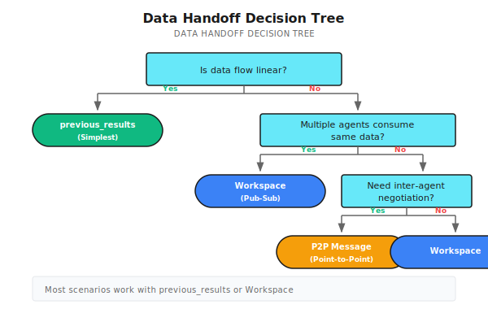
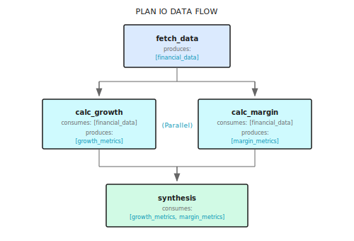
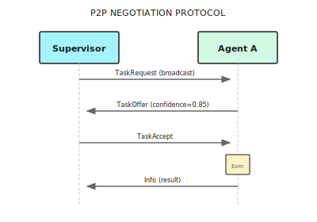

# Chapter 16: Handoff Mechanism

> **Handoff enables precise data and state transfer between Agents—from simple context injection to complex P2P message protocols, choosing the right mechanism matters more than pursuing complete functionality.**

> **Note**: Handoff mechanism should be chosen based on actual collaboration complexity. Simple chain dependencies work fine with context injection—don't introduce unnecessary Workspace or P2P messaging systems just for "architectural completeness."

---

> **Quick Track** (Master the core in 5 minutes)
>
> 1. Three layers of handoff: previous_results (simple) → Workspace (shared) → P2P (negotiation)
> 2. Plan IO declares Produces/Consumes, letting orchestrator understand data dependencies
> 3. Dependency waiting uses incremental timeout checks, balancing response speed and resource consumption
> 4. Use workflow.Now() when writing to workspace to ensure determinism
> 5. Most scenarios only need the first two layers; P2P is for scenarios that truly need bidirectional communication
>
> **10-minute path**: 16.1-16.3 → 16.5 → Shannon Lab

---

## Opening Scenario: Data Flow in Financial Analysis

You have Agent A collecting Tesla's financial data, Agent B calculating growth rates based on that data, Agent C calculating profit margins, and finally Agent D synthesizing analysis of all three results.

Questions arise:
- How does B get A's results?
- Can C and B run in parallel?
- How does D know both B and C are done?

In simple scenarios, stuffing A's output into B's context is enough. But for more complex multi-Agent collaboration—data flowing between multiple Agents, some needing to wait, some running in parallel, some needing mutual negotiation—you need a systematic handoff mechanism.

**Handoff solves exactly this—enabling precise and reliable data and state transfer between Agents.**

---

## 16.1 Three Handoff Methods

From simple to complex, there are three layers:

| Layer | Mechanism | Use Case | Complexity |
|-------|-----------|----------|------------|
| Dependency injection | `previous_results` context | Simple chain dependencies | Low |
| Workspace | `Workspace` + `Topic` | Topic-driven data sharing | Medium |
| P2P messaging | `Mailbox` + protocol | Complex inter-Agent coordination | High |

Most scenarios only need the first two. P2P messaging is for truly complex coordination scenarios—like when Agents need to negotiate, bid, or dynamically delegate tasks.

### Selection Principles



---

## 16.2 Plan IO: Declaring Data Flow

During task decomposition, you can declare what each subtask "produces" and "needs." This lets the orchestrator understand data flow and make correct scheduling decisions.

### Data Structures and Examples

```go
// Subtask defines task data flow dependencies
type Subtask struct {
    ID           string
    Description  string
    Dependencies []string  // Task-level dependency: prerequisite tasks to wait for (e.g., "must wait for A to finish before running B")
    Produces     []string  // Data topics it produces
    Consumes     []string  // Data topics it needs (e.g., "B needs data A produces")
}

// Example: Financial report analysis task decomposition
// fetch_data: produces=["financial_data"], consumes=[]
// calc_growth: produces=["growth_metrics"], consumes=["financial_data"], dependencies=["fetch_data"]
// calc_margin: produces=["margin_metrics"], consumes=["financial_data"], dependencies=["fetch_data"]
// synthesis:   produces=[], consumes=["growth_metrics","margin_metrics"], dependencies=["calc_growth","calc_margin"]
```

**Dependencies vs Consumes**: Usually used together, but can be separate. For example: after A produces data, B and C can consume it in parallel (no ordering dependency), but both depend on A's data (data dependency).

### Data Flow Diagram



When the orchestrator sees this Plan, it knows:
1. `fetch_data` can execute immediately
2. `calc_growth` and `calc_margin` can run in parallel, both wait for `fetch_data` to complete
3. `synthesis` waits for both to complete

---

## 16.3 Previous Results Injection (Simplest Handoff)

The most direct handoff method: stuff previous Agent results directly into subsequent Agent context.

### Code Reference

The following code shows how Shannon implements previous results injection. Core design point: automatically extract numeric results for easier calculation tasks.

```go
// Build previous results
if len(childResults) > 0 {
    previousResults := make(map[string]interface{})
    for j, prevResult := range childResults {
        if j < i {
            resultMap := map[string]interface{}{
                "response":      prevResult.Response,
                "tokens":        prevResult.TokensUsed,
                "success":       prevResult.Success,
                "tools_used":    prevResult.ToolsUsed,
            }

            // Auto-extract numeric results (convenient for calculation tasks)
            if numVal, ok := ParseNumericValue(prevResult.Response); ok {
                resultMap["numeric_value"] = numVal
            }

            previousResults[decomp.Subtasks[j].ID] = resultMap
        }
    }
    childCtx["previous_results"] = previousResults
}
```

### Context Agent Receives

```json
{
  "role": "analyst",
  "task_id": "synthesis",
  "previous_results": {
    "fetch_data": {
      "response": "Tesla 2024 revenue $123.4 billion, net profit $8.9 billion...",
      "tokens": 500,
      "success": true
    },
    "calc_growth": {
      "response": "Revenue growth rate is 15.3%",
      "tokens": 200,
      "success": true,
      "numeric_value": 15.3
    },
    "calc_margin": {
      "response": "Net profit margin is 7.2%",
      "tokens": 180,
      "success": true,
      "numeric_value": 7.2
    }
  }
}
```

Subsequent Agents can directly use data in `previous_results`. The `numeric_value` field is particularly useful—calculation tasks can directly get numbers without parsing text.

### Use Case Suitability

| Scenario | Suitable | Reason |
|----------|----------|--------|
| Linear chain tasks | Suitable | A → B → C, clear data flow |
| Fan-out parallel | Suitable | A → [B, C, D], B/C/D all get A's result |
| Fan-in convergence | Suitable | [A, B, C] → D, D gets all previous results |
| Dynamic data sharing | Not suitable | New data generated during task execution needs sharing |
| Inter-Agent negotiation | Not suitable | Needs bidirectional communication |

---

## 16.4 Workspace System

When data flow is more complex—multiple Agents producing data, multiple Agents consuming data, or needing to dynamically share data during task execution—use workspace.

### Core Concepts

Workspace is a Redis-based publish-subscribe system:
- **Topic**: Logical data classification, e.g., `financial_data`, `growth_metrics`
- **Entry**: One data item written to a topic
- **Seq (sequence number)**: Globally incrementing, used for incremental reads


### Read/Write Operations

The following code from Shannon's `p2p.go` shows workspace read/write implementation:

```go
// ========== Write Data ==========
type WorkspaceAppendInput struct {
    WorkflowID string
    Topic      string                 // Topic name
    Entry      map[string]interface{} // Data entry (limit 1MB)
    Timestamp  time.Time              // Workflow timestamp (ensures deterministic replay)
}

func (a *Activities) WorkspaceAppend(ctx context.Context, in WorkspaceAppendInput) (WorkspaceAppendResult, error) {
    rc := a.sessionManager.RedisWrapper().GetClient()

    // Global sequence number (increments across topics)
    seqKey := fmt.Sprintf("wf:%s:ws:seq", in.WorkflowID)
    seq := rc.Incr(ctx, seqKey).Val()

    // Write to topic list, set 48 hour TTL
    listKey := fmt.Sprintf("wf:%s:ws:%s", in.WorkflowID, in.Topic)
    entry := map[string]interface{}{"seq": seq, "topic": in.Topic, "entry": in.Entry, "ts": in.Timestamp.UnixNano()}
    rc.RPush(ctx, listKey, mustMarshal(entry))
    rc.Expire(ctx, listKey, 48*time.Hour)

    return WorkspaceAppendResult{Seq: uint64(seq)}, nil
}

// ========== Read Data (supports incremental) ==========
type WorkspaceListInput struct {
    WorkflowID string
    Topic      string
    SinceSeq   uint64  // Only return entries after this sequence number (supports incremental read)
    Limit      int64   // Default 200
}

func (a *Activities) WorkspaceList(ctx context.Context, in WorkspaceListInput) ([]WorkspaceEntry, error) {
    rc := a.sessionManager.RedisWrapper().GetClient()
    vals, _ := rc.LRange(ctx, fmt.Sprintf("wf:%s:ws:%s", in.WorkflowID, in.Topic), -in.Limit, -1).Result()

    out := make([]WorkspaceEntry, 0)
    for _, v := range vals {
        var e WorkspaceEntry
        if json.Unmarshal([]byte(v), &e) == nil && e.Seq > in.SinceSeq {
            out = append(out, e)  // Incremental filter
        }
    }
    return out, nil
}
```

### SinceSeq Purpose

`SinceSeq` supports incremental reads—Agent only gets new data since its last read:

```
Timeline:
  T1: Agent A writes seq=1
  T2: Agent B reads (SinceSeq=0) → gets seq=1
  T3: Agent A writes seq=2
  T4: Agent B reads (SinceSeq=1) → only gets seq=2 (incremental)
```

This is useful for long-running collaboration—Agent can continuously poll for new data instead of getting full volume each time.

---

## 16.5 P2P Dependency Synchronization

When Agent B needs to wait for Agent A's data, use **exponential backoff polling**.

### Why Not Fixed Interval?

| Strategy | Problem |
|----------|---------|
| Fixed 1 second | High-frequency polling generates many useless queries, wastes resources |
| Fixed 30 seconds | Slow response, long user wait time |
| Event-driven | Needs additional message queue, increases complexity |

**Exponential backoff is the compromise**: fast initial checks, gradually slowing down, neither wasting resources nor taking too long to respond when data is ready.

### Implementation Code

The following code shows Shannon's dependency waiting logic in Hybrid execution mode:

```go
// waitForDependencies waits for all dependencies to complete, using incremental timeout
func waitForDependencies(
    ctx workflow.Context,
    dependencies []string,
    completedTasks map[string]bool,
    timeout time.Duration,
    checkInterval time.Duration,
) bool {
    logger := workflow.GetLogger(ctx)

    // Default check interval: 30 seconds
    if checkInterval == 0 {
        checkInterval = 30 * time.Second
    }

    startTime := workflow.Now(ctx)
    deadline := startTime.Add(timeout)

    for workflow.Now(ctx).Before(deadline) {
        // Calculate wait time: minimum of check interval and remaining time
        remaining := deadline.Sub(workflow.Now(ctx))
        waitTime := checkInterval
        if remaining < waitTime {
            waitTime = remaining
        }

        // Temporal's AwaitWithTimeout: wait for condition or timeout
        ok, err := workflow.AwaitWithTimeout(ctx, waitTime, func() bool {
            for _, depID := range dependencies {
                if !completedTasks[depID] {
                    return false
                }
            }
            return true
        })

        if err != nil {
            logger.Debug("Context cancelled during dependency wait")
            return false
        }

        if ok {
            return true  // Dependencies satisfied
        }

        // Continue next check iteration
        logger.Debug("Dependency check iteration",
            "dependencies", dependencies,
            "elapsed", workflow.Now(ctx).Sub(startTime),
        )
    }

    logger.Warn("Dependency wait timeout", "dependencies", dependencies)
    return false
}
```

### Backoff Time Sequence

Shannon's implementation uses fixed intervals (30 seconds), but classic exponential backoff looks like this:

```
Attempt 1: wait 1 second
Attempt 2: wait 2 seconds
Attempt 3: wait 4 seconds
Attempt 4: wait 8 seconds
Attempt 5: wait 16 seconds
Attempt 6+: wait 30 seconds (ceiling)

Total wait time (6 minute timeout):
  Fast check period (first 30 seconds): ~5 attempts
  Stable period (remaining 5.5 minutes): ~11 attempts
```

### Producing Data

After Agent completes, write results to workspace for other Agents to consume:

```go
// Produce results to workspace
if len(subtask.Produces) > 0 {
    for _, topic := range subtask.Produces {
        WorkspaceAppend(ctx, WorkspaceAppendInput{
            WorkflowID: workflowID,
            Topic:      topic,
            Entry: map[string]interface{}{
                "subtask_id": subtask.ID,
                "summary":    result.Response,
            },
            Timestamp: workflow.Now(ctx),
        })

        // Notify Agents waiting for this topic (non-blocking channel)
        if ch, ok := topicChans[topic]; ok {
            select {
            case ch <- true:
            default:  // Channel full or no listener, skip
            }
        }
    }
}
```

---

## 16.6 P2P Messaging System

Sometimes Agents need more flexible communication, not just "waiting for data." For example:
- Task request: "Who can handle this data analysis?"
- Offer response: "I can, estimated 2 minutes to complete"
- Accept confirmation: "OK, assigned to you"

### P2P Messaging System Implementation

The following code from Shannon's `p2p.go` shows inter-Agent message sending and negotiation protocol:

```go
// ========== Message Type Definition ==========
type MessageType string
const (
    MessageTypeRequest    MessageType = "request"     // Task request
    MessageTypeOffer      MessageType = "offer"       // Offer response
    MessageTypeAccept     MessageType = "accept"      // Accept confirmation
    MessageTypeDelegation MessageType = "delegation"  // Delegation
    MessageTypeInfo       MessageType = "info"        // Information notification
)

// ========== Message Sending ==========
type SendAgentMessageInput struct {
    WorkflowID string
    From, To   string              // Sender/receiver Agent ID
    Type       MessageType
    Payload    map[string]interface{}  // Limit 1MB
    Timestamp  time.Time               // Workflow timestamp
}

func (a *Activities) SendAgentMessage(ctx context.Context, in SendAgentMessageInput) (SendAgentMessageResult, error) {
    rc := a.sessionManager.RedisWrapper().GetClient()

    // Receiver's message queue (mailbox)
    listKey := fmt.Sprintf("wf:%s:mbox:%s:msgs", in.WorkflowID, in.To)
    seq := rc.Incr(ctx, fmt.Sprintf("wf:%s:mbox:%s:seq", in.WorkflowID, in.To)).Val()

    msg := map[string]interface{}{"seq": seq, "from": in.From, "to": in.To, "type": string(in.Type), "payload": in.Payload}
    rc.RPush(ctx, listKey, mustMarshal(msg))
    rc.Expire(ctx, listKey, 48*time.Hour)

    return SendAgentMessageResult{Seq: uint64(seq)}, nil
}

// ========== Task Negotiation Protocol (Advanced Example) ==========
type TaskRequest struct {  // Supervisor broadcasts request
    TaskID, Description string
    Skills              []string  // Required skills
}
type TaskOffer struct {    // Agent responds with offer
    RequestID, AgentID string
    Confidence         float64   // Completion confidence
}
type TaskAccept struct {   // Supervisor confirms assignment
    RequestID, AgentID string
}
```

### Negotiation Flow Diagram



### When to Use P2P Messaging?

| Scenario | Use Workspace | Use P2P Messaging |
|----------|---------------|-------------------|
| Data sharing | Suitable | Over-engineering |
| Waiting for dependencies | Suitable | Over-engineering |
| Task negotiation | Not suitable | Suitable |
| Dynamic delegation | Not suitable | Suitable |
| State synchronization | Depends | Depends |

**Most scenarios don't need P2P messaging**. Only consider it when Agents need bidirectional interaction (not just data flow).

---

## 16.7 Hybrid Execution and Dependency Passing

Shannon's Hybrid execution mode combines parallelism and dependency management, automatically handling data handoff.

### HybridConfig and Dependency Result Passing

```go
type HybridConfig struct {
    MaxConcurrency          int           // Max concurrency
    DependencyWaitTimeout   time.Duration // Dependency wait timeout
    DependencyCheckInterval time.Duration // Check interval (default 30s)
    PassDependencyResults   bool          // Whether to pass dependency results
}

// When PassDependencyResults=true, automatically inject dependency task results
if config.PassDependencyResults && len(task.Dependencies) > 0 {
    depResults := make(map[string]interface{})
    for _, depID := range task.Dependencies {
        if result, ok := taskResults[depID]; ok {
            depResults[depID] = map[string]interface{}{
                "response": result.Response, "tokens": result.TokensUsed, "success": result.Success,
            }
        }
    }
    taskContext["dependency_results"] = depResults
}
// Subsequent task receives: {"dependency_results": {"calc_growth": {"response": "...", "tokens": 200}}}
```

---

## 16.8 Producer Set Validation

A common problem area: Agent declares consuming a topic, but no Agent produces that topic.

### Problem Scenario

```json
{
  "subtasks": [
    {"id": "A", "produces": ["data_a"]},
    {"id": "B", "consumes": ["missing_data"]}  // Nobody produces this!
  ]
}
```

Without validation, B will wait indefinitely for `missing_data`, eventually timing out.

### Solution: Data Flow Validation

Pre-build producer set, validate during task decomposition to avoid runtime discovery:

```go
func ValidateDataFlow(subtasks []Subtask) error {
    // Option A: Runtime check (lenient) — skip non-existent topics
    producesSet := make(map[string]struct{})
    for _, s := range subtasks {
        for _, t := range s.Produces {
            producesSet[t] = struct{}{}
        }
    }
    // When waiting: if _, ok := producesSet[topic]; !ok { logger.Warn("skip"); continue }

    // Option B: Pre-launch validation (strict) — error on problems
    consumesSet := make(map[string][]string)  // topic -> consumer IDs
    for _, s := range subtasks {
        for _, t := range s.Consumes {
            consumesSet[t] = append(consumesSet[t], s.ID)
        }
    }
    var errs []string
    for topic, consumers := range consumesSet {
        if _, ok := producesSet[topic]; !ok {
            errs = append(errs, fmt.Sprintf("Topic '%s' consumed by [%s] but no producer", topic, strings.Join(consumers, ", ")))
        }
    }
    if len(errs) > 0 {
        return fmt.Errorf("data flow validation failed:\n%s", strings.Join(errs, "\n"))
    }
    return nil
}
```

---

## 16.9 Common Pitfalls

### Common Problems and Solutions

```go
// ========== Pitfall 1: Circular dependency (A waits for B, B waits for A) ==========
// Solution: Use Kahn's algorithm to detect cycles
func DetectCycle(subtasks []Subtask) error {
    inDegree := make(map[string]int)
    for _, s := range subtasks {
        for _, dep := range s.Dependencies { inDegree[dep]++ }
    }
    queue := []string{}
    for _, s := range subtasks {
        if inDegree[s.ID] == 0 { queue = append(queue, s.ID) }
    }
    // Topological sort, if visited != len(subtasks) then cycle exists
    // ...
}

// ========== Pitfall 2: Topic name inconsistency (case-sensitive) ==========
// Solution: Normalize topic names
func NormalizeTopic(topic string) string {
    return strings.ReplaceAll(strings.ToLower(strings.TrimSpace(topic)), " ", "_")
}

// ========== Pitfall 3: Entry too large (exceeds 1MB) ==========
// Wrong: Entry: map[string]interface{}{"full_report": veryLongReport}
// Correct: Store in S3, only pass reference
// Entry: map[string]interface{}{"report_ref": "s3://bucket/reports/12345.json"}

// ========== Pitfall 4: Non-deterministic timestamp ==========
// Wrong: time.Now().UnixNano()          // Breaks Temporal deterministic replay
// Correct: workflow.Now(ctx).UnixNano()   // Deterministic

// ========== Pitfall 5: Forgot to set timeout ==========
// Solution: Always set timeout
deadline := workflow.Now(ctx).Add(6 * time.Minute)
for workflow.Now(ctx).Before(deadline) {
    if checkDependency() { break }
    workflow.Sleep(ctx, 30*time.Second)
}
```

---

## 16.10 Configuration

P2P coordination is controlled through configuration:

```yaml
# config/shannon.yaml
workflows:
  p2p:
    enabled: true          # Off by default (most scenarios don't need it)
    timeout_seconds: 360   # Timeout should be reasonable: too short fails easily, too long wastes time
  hybrid:
    dependency_timeout: 360
    max_concurrency: 5
    pass_dependency_results: true
  sequential:
    pass_results: true
    extract_numeric: true  # Auto-extract numbers, convenient for calculation tasks
```

**Configuration principle**: Enable features based on actual needs, don't "want everything."

---

## 16.11 Framework Comparison

| Feature | Shannon | LangGraph | AutoGen | CrewAI |
|---------|---------|-----------|---------|--------|
| Dependency injection | `previous_results` | State passing | Message History | Task Context |
| Topic workspace | Redis Pub/Sub | No built-in | No built-in | No built-in |
| P2P messaging | Mailbox system | Channel | GroupChat | No built-in |
| Dependency waiting | AwaitWithTimeout | Manual implementation | Manual implementation | Sequential mode |
| Data size limit | 1MB | Unlimited | Unlimited | Unlimited |
| Deterministic timestamp | workflow.Now | No | No | No |

**Selection recommendations**:
- **Simple scenarios**: Any framework works, choose what you're familiar with
- **Complex data flow**: Shannon's Workspace system is most complete
- **Agent negotiation**: Shannon's P2P messaging or AutoGen's GroupChat
- **Production-grade reliability**: Shannon + Temporal provides strongest guarantees

---

## Summary

1. **Three-layer mechanism**: previous_results (simple) → Workspace (medium) → P2P messaging (complex), choose as needed
2. **Plan IO**: Declare data flow via Produces/Consumes, let orchestrator understand dependencies
3. **Exponential backoff**: Dependency waiting uses exponential backoff or fixed interval polling, balancing response speed and resource consumption
4. **Producer validation**: Pre-check data flow completeness, avoid waiting for non-existent topics
5. **Determinism principle**: Use workflow.Now() not time.Now(), ensure Temporal replay correctness

---

## Shannon Lab (10-minute hands-on)

This section helps you map this chapter's concepts to Shannon source code in 10 minutes.

### Required Reading (1 file)

- [`execution/hybrid.go`](https://github.com/Kocoro-lab/Shannon/blob/main/go/orchestrator/internal/workflows/patterns/execution/hybrid.go): Look at `ExecuteHybrid` function, understand how `waitForDependencies` implements dependency waiting, how `PassDependencyResults` passes results, concurrency control uses Semaphore not Mutex

### Optional Deep Dives (2 files, pick based on interest)

- [`activities/p2p.go`](https://github.com/Kocoro-lab/Shannon/blob/main/go/orchestrator/internal/activities/p2p.go): Look at SendAgentMessage, WorkspaceAppend functions, understand Redis data structure design (List + global sequence number) and TTL settings
- [`strategies/dag.go`](https://github.com/Kocoro-lab/Shannon/blob/main/go/orchestrator/internal/workflows/strategies/dag.go): Look at DAGWorkflow, understand how to select execution mode based on `ExecutionStrategy`, how to detect dependencies

---

## Exercises

### Exercise 1: Design Data Flow

Scenario: User asks "Compare Apple and Microsoft's 2024 financial performance"

Design a Plan including:
- What subtasks?
- Each task's Produces/Consumes?
- Which can run in parallel?

Hint: Consider data acquisition, metric calculation, comparison analysis as three phases.

### Exercise 2: Implement Cycle Detection

Using Go or your preferred language, implement:
1. Parse subtask list from JSON Plan
2. Build dependency graph
3. Detect circular dependencies

Test cases:
```json
// No cycle
[{"id": "A", "dependencies": []}, {"id": "B", "dependencies": ["A"]}]

// Has cycle
[{"id": "A", "dependencies": ["B"]}, {"id": "B", "dependencies": ["A"]}]
```

### Exercise 3: Design Workspace Schema

Design Workspace Topic structure for "competitive analysis" scenario:
- What data topics?
- Entry structure for each topic?
- How to support incremental updates?

Hint: Consider competitor list, competitor details, comparison matrix, final report, etc.

---

## Want to Go Deeper?

- [Redis Pub/Sub](https://redis.io/topics/pubsub) - Workspace underlying implementation
- [Temporal Signals & Queries](https://docs.temporal.io/develop/go/message-passing) - P2P messaging workflow layer implementation
- [DAG Scheduling Algorithms](https://en.wikipedia.org/wiki/Directed_acyclic_graph) - Theoretical foundation for dependency scheduling
- [Contract Net Protocol](https://en.wikipedia.org/wiki/Contract_Net_Protocol) - Academic background for task negotiation protocols

---

## Part 5 Summary

Four chapters covering complete multi-Agent orchestration:

| Chapter | Core Concept | Shannon Mapping |
|---------|--------------|-----------------|
| Ch13 Orchestration Fundamentals | Orchestrator's 4 responsibilities, routing decisions | orchestrator_router.go |
| Ch14 DAG Workflows | Parallel/Sequential/Hybrid three modes | strategies/dag.go |
| Ch15 Supervisor | Mailbox system, dynamic teams, smart fault tolerance | supervisor_workflow.go |
| Ch16 Handoff | Data flow declaration, workspace, P2P coordination | activities/p2p.go |

These four components work together:

```
User Request
    │
    ▼
┌─────────────────┐
│   Orchestrator  │  ← Routing decision: select execution mode
└────────┬────────┘
         │
    ┌────┴────┐
    ▼         ▼
┌───────┐  ┌──────────┐
│  DAG  │  │Supervisor│  ← Execution engines
└───┬───┘  └────┬─────┘
    │           │
    └─────┬─────┘
          ▼
    ┌──────────┐
    │ Handoff  │  ← Task handoff: data transfer
    └──────────┘
          │
          ▼
    ┌──────────┐
    │ Synthesis│  ← Result synthesis
    └──────────┘
```

---

## Next Chapter Preview

Part 6 enters **Advanced Reasoning Patterns**:

- **Chapter 17: Tree-of-Thoughts**—When linear thinking isn't enough, how to explore multiple reasoning paths
- **Chapter 18: Debate Pattern**—Let Agents challenge each other, improve answer quality through debate
- **Chapter 19: Research Synthesis**—How to synthesize multi-source information into high-quality research reports

From "multiple Agents doing things" to "multiple Agents thinking."
