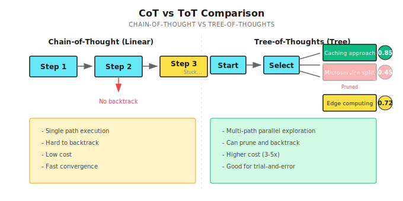

# Chapter 17: Tree-of-Thoughts

> **ToT lets Agents explore multiple reasoning paths simultaneously, finding the optimal solution through scoring and pruning—but it's not a silver bullet; high cost, slow convergence, only suitable for scenarios that truly need "trial and error."**

---

## 17.1 First, the Conclusion: When to Use ToT

Let me share a real case first:

In mid-2024, I was helping a tech consulting firm build an architecture review Agent. Clients would submit system design proposals, and the Agent needed to find potential issues and provide improvement suggestions.

One time, a client submitted a payment system design: microservices architecture, independent database per service, using Kafka for async communication.

I had the Agent analyze it using Chain-of-Thought. Its reasoning went like this:

```
Step 1: Microservices architecture improves scalability ✓
Step 2: Independent databases avoid single point of failure ✓
Step 3: Kafka decouples services, improves throughput ✓
Step 4: Design is reasonable, no obvious issues
```

Review passed, client started implementation.

Two months later, the client came back complaining: **distributed transactions are too complicated!** Order creation, inventory deduction, payment confirmation—three services each with their own database, how do you ensure consistency? 2PC has poor performance, Saga explodes in complexity.

I looked back at the Agent's reasoning and found the problem was in Step 2—the "independent databases" decision planted a landmine early, but CoT didn't explore other possibilities (like shared database, CQRS). It went down one path to the end—each step looked reasonable, but the overall solution had a fatal flaw.

**This is CoT's problem—it's a one-way street; once an early decision is wrong, everything after is wasted.** Tree-of-Thoughts (ToT) can explore multiple paths simultaneously, comparing scores to find better solutions.

But ToT isn't free. Cost is 3-5x that of CoT, and not all problems need it.

### What Problems Suit ToT?

I've seen too many people treat ToT as a cure-all.

**It's not.**

Scenarios suitable for ToT share three characteristics:

1. **Large solution space**: Problem has multiple possible solution paths
2. **Early decisions have big impact**: Wrong first few steps, everything after is wasted
3. **Can evaluate intermediate states**: Can judge if a path "has potential"

| Scenario | Why Suitable | Why Not Suitable |
|----------|-------------|------------------|
| 24 Game | Multiple operation combinations, need to try | Simple arithmetic can solve it |
| Complex math proofs | Multiple proof approaches, need to compare | Standard calculation problems |
| System architecture design | Multiple architecture options, need trade-offs | CRUD systems with mature templates |
| Strategy planning | Multiple strategies, need simulation | Only one obviously correct approach |
| Code debugging (complex bugs) | Multiple possible causes, need investigation | Error message clearly points to a line |

A simple judgment method:

> If you yourself would draw a tree diagram on paper and list multiple options to compare when solving this problem—it's probably suitable for ToT.
> If you already have the answer in mind and just need the Agent to execute—CoT is enough.

---

## 17.2 CoT vs ToT: Core Differences



Core differences in three dimensions:

| Dimension | CoT | ToT |
|-----------|-----|-----|
| **Number of paths** | Single path | Multiple parallel paths |
| **Error recovery** | Hard to backtrack once wrong | Can prune, backtrack |
| **Cost** | Relatively low | Multiplies |
| **Convergence speed** | Fast (goes down one path) | Slow (needs exploration + comparison) |

Honestly, I think ToT's biggest value isn't "finding better answers" but "avoiding falling into pits."

CoT's problem is: the model might go wrong at step one, but it continues confidently reasoning, giving you an answer that "looks reasonable but is completely wrong."

ToT at least tries multiple paths—if one path scores significantly lower than others, you know that direction might have problems.

---

## 17.3 Core Structure of the Thought Tree

### Node Definition

Each node represents a "thinking step":

```go
type ThoughtNode struct {
    ID          string           // Node ID
    Thought     string           // Current thought content
    Score       float64          // Evaluation score (0-1)
    Depth       int              // Tree depth
    ParentID    string           // Parent node
    Children    []*ThoughtNode   // Child nodes
    TokensUsed  int              // Tokens consumed
    IsTerminal  bool             // Is terminal (found answer or dead end)
    Explanation string           // Explanation (why this path)
}
```

Shannon's implementation is in [`patterns/tree_of_thoughts.go`](https://github.com/Kocoro-lab/Shannon/blob/main/go/orchestrator/internal/workflows/patterns/tree_of_thoughts.go). The core idea is simple: each node has a score, low-scoring ones get pruned, high-scoring ones continue exploration.

### Configuration Parameters

```go
type TreeOfThoughtsConfig struct {
    MaxDepth          int     // Max depth, default 3
    BranchingFactor   int     // Branches per node, 2-4, default 3
    PruningThreshold  float64 // Pruning threshold, default 0.3
    ExplorationBudget int     // Max nodes to explore, default 15
    BacktrackEnabled  bool    // Allow backtracking
    EvaluationMethod  string  // "scoring", "voting", "llm"
}
```

How to tune these parameters? My experience:

| Parameter | Low Value Effect | High Value Effect | Suggested Starting Point |
|-----------|------------------|-------------------|-------------------------|
| `MaxDepth` | Shallow fast, may miss deep solutions | Deep precise, high cost | 3 |
| `BranchingFactor` | Focus on few directions | Divergent exploration | 3 |
| `PruningThreshold` | Keep more branches | Aggressive pruning, may miss good options | 0.3 |
| `ExplorationBudget` | Save cost, incomplete coverage | More thorough, high cost | 15 |

**Key formula**: Worst case node count = `BranchingFactor^MaxDepth`

If BranchingFactor=3, MaxDepth=3, worst case is 27 nodes. So setting `ExplorationBudget` to 15 is reasonable—it forces a stop before exploring everything.

---

## 17.4 Exploration Algorithm: Best-First Search

ToT's core is "prioritize exploring the most promising nodes." Shannon uses Best-First Search:

```go
func TreeOfThoughts(
    ctx workflow.Context,
    query string,
    context map[string]interface{},
    sessionID string,
    history []string,
    config TreeOfThoughtsConfig,
    opts Options,
) (*TreeOfThoughtsResult, error) {

    // Initialize root node
    root := &ThoughtNode{
        ID:       "root",
        Thought:  query,
        Score:    1.0,
        Depth:    0,
        Children: make([]*ThoughtNode, 0),
    }

    // Exploration queue (sorted by score)
    queue := []*ThoughtNode{root}
    thoughtsExplored := 0

    // Main loop
    for len(queue) > 0 && thoughtsExplored < config.ExplorationBudget {
        // Sort by score, take best node
        sort.Slice(queue, func(i, j int) bool {
            return queue[i].Score > queue[j].Score
        })

        current := queue[0]
        queue = queue[1:]

        // Depth limit
        if current.Depth >= config.MaxDepth {
            current.IsTerminal = true
            continue
        }

        // Generate branches
        branches := generateBranches(ctx, current, query, config.BranchingFactor, ...)

        // Evaluate and prune
        for _, branch := range branches {
            branch.Score = evaluateThought(branch, query)

            // Prune low-scoring branches
            if branch.Score < config.PruningThreshold {
                continue  // Discard directly
            }

            current.Children = append(current.Children, branch)

            if isTerminalThought(branch.Thought) {
                branch.IsTerminal = true
            } else {
                queue = append(queue, branch)
            }
        }

        thoughtsExplored++
    }

    // Find best path
    bestPath := findBestPath(root)
    return &TreeOfThoughtsResult{BestPath: bestPath, ...}, nil
}
```

Core design points:

1. **Best-First**: Always expand the highest-scoring node, not breadth-first or depth-first
2. **Budget control**: `ExplorationBudget` limits total nodes, prevents runaway costs
3. **Dynamic pruning**: Branches below threshold are discarded directly, no wasted exploration

---

## 17.5 How to Evaluate a "Thought"

This is ToT's most critical part. Inaccurate evaluation, the whole tree is useless.

### Heuristic Scoring (Fast but Crude)

Shannon defaults to heuristic scoring:

```go
func evaluateThought(node *ThoughtNode, originalQuery string) float64 {
    score := 0.5  // Base score
    thought := strings.ToLower(node.Thought)

    // Positive indicators
    if strings.Contains(thought, "therefore") ||
       strings.Contains(thought, "solution") ||
       strings.Contains(thought, "answer") {
        score += 0.2  // Has conclusion tendency
    }

    if strings.Contains(thought, "because") ||
       strings.Contains(thought, "since") {
        score += 0.1  // Has logical connection
    }

    if strings.Contains(thought, "step") ||
       strings.Contains(thought, "first") {
        score += 0.1  // Has concrete steps
    }

    // Negative indicators
    if strings.Contains(thought, "maybe") ||
       strings.Contains(thought, "perhaps") {
        score -= 0.1  // Vague uncertainty
    }

    // Depth penalty (prefer short paths)
    score -= float64(node.Depth) * 0.05

    return math.Max(0, math.Min(1, score))
}
```

This evaluator is "cheap"—it only looks at keywords, doesn't understand semantics.

Pros: Fast, cheap.
Cons: Model can game it by learning to say "therefore" without actually reasoning.

### LLM Evaluation (Accurate but Expensive)

For complex tasks, you can have another LLM evaluate:

```go
// Conceptual example: LLM evaluates thought quality
func evaluateWithLLM(ctx workflow.Context, thought string, query string) float64 {
    prompt := fmt.Sprintf(`Evaluate the quality of this reasoning step (0-1):

Problem: %s
Reasoning step: %s

Evaluation criteria:
1. Is logic coherent
2. Is it progressing toward a solution
3. Are there obvious errors

Return format: {"score": 0.75, "reason": "..."}`, query, thought)

    response := callLLM(prompt)
    return parseScore(response)
}
```

This method is more accurate, but each node requires an LLM call, doubling costs.

### My Recommendation

For most scenarios, heuristic scoring + human validation is enough.

Only when you find heuristic scoring frequently "picks wrong paths" should you consider switching to LLM evaluation.

---

## 17.6 Termination Conditions: When to Stop

ToT needs to know when it's "found an answer" and when it's a "dead end":

```go
func isTerminalThought(thought string) bool {
    lower := strings.ToLower(thought)

    // Solution indicators
    solutionKeywords := []string{
        "the answer is",
        "therefore",
        "in conclusion",
        "final answer",
        "solution:",
    }
    for _, keyword := range solutionKeywords {
        if strings.Contains(lower, keyword) {
            return true
        }
    }

    // Dead end indicators
    deadEndKeywords := []string{
        "impossible",
        "cannot be solved",
        "no solution",
        "contradiction",
    }
    for _, keyword := range deadEndKeywords {
        if strings.Contains(lower, keyword) {
            return true
        }
    }

    return false
}
```

Two types of termination:

1. **Positive termination**: Found an answer ("the answer is...")
2. **Negative termination**: Confirmed dead end ("impossible")

Negative termination is important—it lets ToT quickly abandon hopeless branches and concentrate resources on promising directions.

---

## 17.7 Backtrack Mechanism: What to Do with Low Confidence

If the best path has very low confidence, Shannon will try backtracking to explore alternatives:

```go
// Backtrack logic
if config.BacktrackEnabled && result.Confidence < 0.5 && len(queue) > 0 {
    logger.Info("Backtracking to explore alternative paths")

    // Take top 3 alternatives from queue by score
    alternatives := queue[:min(3, len(queue))]
    for _, alt := range alternatives {
        altPath := getPathToNode(alt, allNodes)
        altConfidence := calculatePathConfidence(altPath)

        if altConfidence > result.Confidence {
            result.BestPath = altPath
            result.Confidence = altConfidence
        }
    }
}
```

Core idea: if even the best solution isn't very certain, maybe the evaluation is off—better look at other candidates.

---

## 17.8 Practice: Research Angle Exploration

Let's look at a real scenario.

**Task**: Analyze AI Agent field development trends in 2024

**Configuration**:

```go
config := TreeOfThoughtsConfig{
    MaxDepth:          3,
    BranchingFactor:   3,
    PruningThreshold:  0.4,
    ExplorationBudget: 12,
    BacktrackEnabled:  true,
}
```

**Exploration Process**:

```
Root: "Analyze AI Agent field development trends in 2024"
├── Technology advances direction (score: 0.75)
│   ├── Multimodal capabilities (score: 0.82) ← Highest score
│   ├── Reasoning capability improvements (score: 0.70)
│   └── Tool use evolution (score: 0.68)
├── Product deployment direction (score: 0.72)
│   ├── Enterprise applications (score: 0.78)
│   └── Developer tools (score: 0.65)
└── Ecosystem development direction (score: 0.55)
    └── (score < 0.4, pruned)

Best path: Root → Technology advances → Multimodal capabilities
Confidence: 0.78
```

This example shows ToT's advantage: it doesn't just see "technology advances" and dive in, but first generates three major directions, then evaluates and finds "ecosystem development" direction has too little information—directly prunes it.

---

## 17.9 Common Pitfalls

### Pitfall 1: Branch Explosion

```go
// Wrong: Unlimited exploration
config := TreeOfThoughtsConfig{
    BranchingFactor:   5,
    ExplorationBudget: 0,  // No budget limit!
}
// Result: 5^3 = 125 nodes, token explosion

// Correct: Control complexity
config := TreeOfThoughtsConfig{
    BranchingFactor:   3,
    ExplorationBudget: 15,
    MaxDepth:          3,
}
```

### Pitfall 2: Over-Pruning

```go
// Wrong: Threshold too high
config.PruningThreshold = 0.8
// Result: Almost all branches pruned, only one path left (no different from CoT)

// Correct: Moderate retention
config.PruningThreshold = 0.3
```

### Pitfall 3: Evaluation Bias

Heuristic evaluation can be gamed by model "boilerplate." Model learns to add "therefore" without actually reasoning.

**Solutions**:

```go
// Use LLM evaluation for complex tasks
config.EvaluationMethod = "llm"

// Or add "content check"
func evaluateThought(node *ThoughtNode, query string) float64 {
    score := heuristicScore(node)

    // Check if actually progressing
    if !containsNewInfo(node.Thought, node.Parent.Thought) {
        score *= 0.5  // Penalize standing still
    }

    return score
}
```

### Pitfall 4: Forgetting Token Budget

ToT costs can easily spiral. Each node is one LLM call.

```go
// In Shannon, budget is allocated like this
tokenBudgetPerThought := opts.BudgetAgentMax / config.ExplorationBudget
```

For example, total budget 15000 tokens, exploring 15 nodes, each node only has 1000 token quota.

---

## 17.10 ToT vs Other Reasoning Patterns

| Pattern | Use Case | Cost | Convergence Speed |
|---------|----------|------|-------------------|
| **CoT** | Problems with clear solutions | Low | Fast |
| **ToT** | Multi-path exploration, needs backtracking | High (2-5x) | Slow |
| **Reflection** | Iteratively improve existing answer | Medium | Medium |
| **Debate** | Controversial topics, multiple perspectives | High | Medium |

**My selection logic**:

1. First try CoT once
2. If results are poor, see if it's "answer quality problem" or "wrong direction problem"
3. Quality problem → Reflection
4. Direction problem → ToT

---

## Summary

Core message in one sentence: **ToT finds optimal solutions through multi-path exploration—generate branches, evaluate scores, prune low scores, select best**.

But it's not a cure-all. High cost, slow convergence, only suitable for scenarios that truly need "trial and error."

Key points:

1. **Best-First Search**: Explore by score priority
2. **Pruning**: Discard branches below threshold directly
3. **Backtracking**: Explore alternatives when confidence is low
4. **Budget control**: ExplorationBudget limits cost
5. **Evaluation methods**: Heuristic is fast but crude, LLM is accurate but expensive

---

## Shannon Lab (10-minute hands-on)

This section helps you map this chapter's concepts to Shannon source code in 10 minutes.

### Required Reading (1 file)

- [`patterns/tree_of_thoughts.go`](https://github.com/Kocoro-lab/Shannon/blob/main/go/orchestrator/internal/workflows/patterns/tree_of_thoughts.go): Find `TreeOfThoughts` function, see how main loop implements Best-First Search; find `evaluateThought` to see heuristic scoring logic

### Optional Deep Dives (2 files, pick based on interest)

- [`patterns/options.go`](https://github.com/Kocoro-lab/Shannon/blob/main/go/orchestrator/internal/workflows/patterns/options.go): Understand how `BudgetAgentMax` is allocated to each node
- [`patterns/chain_of_thought.go`](https://github.com/Kocoro-lab/Shannon/blob/main/go/orchestrator/internal/workflows/patterns/chain_of_thought.go): Compare how much simpler CoT implementation is than ToT, think about why

---

## Exercises

### Exercise 1: Scenario Judgment

Determine if the following scenarios suit CoT or ToT, and explain why:

1. "Help me translate this Python code to Go"
2. "Design a community app architecture that can support 100k DAU"
3. "Explain what microservices are"
4. "Help me find the root cause of this bug (multiple suspicious points in logs)"

### Exercise 2: Parameter Tuning

If you find ToT explored 15 nodes but the best path only has 0.4 confidence, how would you adjust parameters? Give at least two possible adjustment directions.

### Exercise 3 (Advanced): Improve the Evaluator

Shannon's heuristic evaluator only looks at keywords. Design an improved version:

1. Write pseudo-code for improvement logic
2. Consider: how to prevent model from gaming the evaluator with "boilerplate"?
3. Think: how much would improvement add to cost? Worth it?

---

## Want to Go Deeper?

- [Tree of Thoughts: Deliberate Problem Solving with Large Language Models](https://arxiv.org/abs/2305.10601) - Yao et al., 2023, original ToT paper
- [Chain-of-Thought Prompting](https://arxiv.org/abs/2201.11903) - CoT paper, understand ToT's predecessor
- A*, BFS, DFS search algorithm comparison—ToT is essentially a search problem

---

## Next Chapter Preview

ToT solves the "how to choose among multiple paths" problem. But sometimes, the problem itself is controversial—not about finding the optimal solution, but hearing different voices.

For example: "Will AI replace human jobs?"

Questions like this have no standard answer—different perspectives lead to different conclusions. In such cases, you don't need a thought tree, you need a **debate**.

Next chapter we'll discuss **Debate Pattern**—letting multiple Agents debate from different positions, exposing weaknesses through opposition, synthesizing more reliable conclusions.

See you next chapter.
