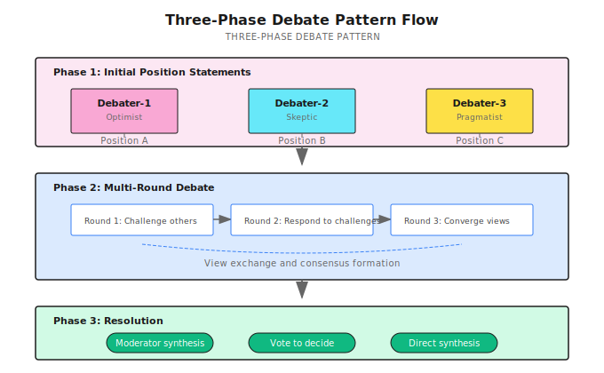

# Chapter 18: Debate Pattern

> **Debate lets multiple Agents argue from different positions, exposing argument weaknesses through opposition—but it's not a cure-all; poorly designed debates just waste tokens.**

---

You ask an Agent:

> "Will AI replace human jobs?"

It answers:

> "Yes, AI will replace many jobs, but will also create new ones. Every technological revolution in history has been like this. Overall, we should be optimistic..."

A wishy-washy, fence-sitting answer.

The problem isn't that the answer is wrong, but that it only thought from one angle once before giving a conclusion. It didn't question itself, didn't consider the opposing view, and didn't test argument strength through opposition.

I first realized how serious this problem was when helping an investment firm with industry research. The Agent gave a seemingly reasonable conclusion, but when I manually played "devil's advocate" and pushed back, its reasoning collapsed immediately.

**Debate Pattern automates this "manual questioning"—letting multiple Agents argue from different positions: optimists, skeptics, pragmatists each expressing their views, exposing weaknesses through opposition, ultimately forming more reliable conclusions.**

---

## 18.1 Why Single Agent Answers to Controversial Questions Are Problematic

When a single Agent answers controversial questions, there are three typical problems:

| Problem | Manifestation | Consequence |
|---------|--------------|-------------|
| **Confirmation bias** | Tends toward first answer that comes to mind | Ignores contrary evidence |
| **Overconfidence** | Lacks questioning and reflection | Argument holes go unpointed |
| **Single perspective** | Doesn't consider other positions | Conclusions are biased, limited applicability |

How does Debate solve these problems?

```
Optimist: AI will create more high-quality jobs than it replaces. Every technological revolution in history has validated this...

Skeptic: Wait, this time is different. Previous automation replaced physical labor, this time it's cognitive labor. And the transition speed is too fast, society can't adapt...

Pragmatist: You both have points. The key question isn't "will it replace" but "how fast" and "who pays for retraining"...

Moderator synthesis: AI's impact on employment depends on three variables: technology advancement speed, policy response speed, retraining system efficiency...
```

Core value:

1. **Multi-perspective coverage**: Avoid blind spots
2. **Adversarial questioning**: Expose argument weaknesses
3. **Consensus formation**: Synthesized conclusions are more reliable

---

## 18.2 When to Use Debate

Debate isn't a cure-all. Using it in the wrong scenario just wastes tokens.

| Scenario | Why Suitable | Why Not Suitable |
|----------|-------------|------------------|
| Policy analysis | Needs to weigh multiple stakeholder interests | Clear right/wrong regulatory interpretation |
| Investment decisions | Needs to consider multiple market scenarios | Pure mathematical calculations |
| Product direction | Needs to balance technical feasibility and business value | Feature implementation with clear requirements |
| Ethics discussions | Needs multi-angle moral examination | Compliance issues with clear industry standards |
| Controversial topics | Needs to present different positions | Factual questions with objective answers |

A simple judgment method:

> If you posted this question on a professional forum, would it trigger heated debate?
> If yes, it's probably suitable for Debate.
> If everyone would give the same answer, using Debate is wasteful.

---

## 18.3 Debate's Three-Phase Flow

Shannon's Debate implementation has three phases:



---

## 18.4 Core Configuration

```go
type DebateConfig struct {
    NumDebaters      int      // Number of debaters (2-5)
    MaxRounds        int      // Maximum debate rounds
    Perspectives     []string // Different perspective list
    RequireConsensus bool     // Require reaching consensus
    ModeratorEnabled bool     // Enable moderator
    VotingEnabled    bool     // Enable voting mechanism
    ModelTier        string   // Model tier
}
```

Parameter tuning recommendations:

| Parameter | Recommended Value | Reason |
|-----------|------------------|--------|
| `NumDebaters` | 3 | Too few lacks opposition, too many hard to coordinate |
| `MaxRounds` | 2-3 | Over 3 rounds easily falls into infinite loops |
| `Perspectives` | Opposing + neutral | Ensure real opposition forms |
| `RequireConsensus` | false | Forced consensus may cause infinite loops |
| `VotingEnabled` | true | Fallback when consensus can't be reached |

---

## 18.5 Phase 1: Initial Positions

Have each Agent state their position from their perspective in parallel:

```go
func Debate(
    ctx workflow.Context,
    query string,
    context map[string]interface{},
    sessionID string,
    history []string,
    config DebateConfig,
    opts Options,
) (*DebateResult, error) {

    // Default perspectives
    if len(config.Perspectives) == 0 {
        config.Perspectives = generateDefaultPerspectives(config.NumDebaters)
    }

    // Get initial positions in parallel
    futures := make([]workflow.Future, config.NumDebaters)

    for i := 0; i < config.NumDebaters; i++ {
        perspective := config.Perspectives[i]
        agentID := fmt.Sprintf("debater-%d-%s", i+1, perspective)

        initialPrompt := fmt.Sprintf(
            "As a %s perspective, provide your position on: %s\n" +
            "Be specific and provide strong arguments.",
            perspective, query,
        )

        futures[i] = workflow.ExecuteActivity(ctx,
            activities.ExecuteAgent,
            activities.AgentExecutionInput{
                Query:     initialPrompt,
                AgentID:   agentID,
                Mode:      "debate",
                SessionID: sessionID,
            })
    }

    // Collect positions
    var positions []DebatePosition
    for i, future := range futures {
        var result AgentResult
        future.Get(ctx, &result)

        positions = append(positions, DebatePosition{
            AgentID:    fmt.Sprintf("debater-%d", i+1),
            Position:   result.Response,
            Arguments:  extractArguments(result.Response),
            Confidence: 0.5,  // Initial confidence
        })
    }

    // Continue to Phase 2...
}
```

Shannon's default perspective generation:

```go
func generateDefaultPerspectives(num int) []string {
    perspectives := []string{
        "optimistic",   // Optimist
        "skeptical",    // Skeptic
        "practical",    // Pragmatist
        "innovative",   // Innovator
        "conservative", // Conservative
    }

    if num <= len(perspectives) {
        return perspectives[:num]
    }
    return perspectives
}
```

**Key point**: Perspective design is critical to Debate success.

If your perspectives are "positive", "very-positive", "somewhat-positive"—that's not debate, that's a choir.

Good perspective design forms real opposition:

| Topic Type | Recommended Perspective Combination |
|------------|-------------------------------------|
| Technology selection | Tech-first + Cost-first + Risk-averse |
| Investment decision | Aggressive + Conservative + Arbitrage |
| Product direction | User experience + Technical feasibility + Business value |
| Policy analysis | Beneficiary + Affected party + Neutral party |

---

## 18.6 Phase 2: Multi-Round Debate

Each debater responds after seeing others' positions:

```go
for round := 1; round <= config.MaxRounds; round++ {
    roundFutures := make([]workflow.Future, len(positions))

    for i, debater := range positions {
        // Collect others' positions
        othersPositions := []string{}
        for j, other := range positions {
            if i != j {
                othersPositions = append(othersPositions,
                    fmt.Sprintf("%s argues: %s", other.AgentID, other.Position))
            }
        }

        responsePrompt := fmt.Sprintf(
            "Round %d: Consider these other perspectives:\n%s\n\n" +
            "As %s, respond with:\n" +
            "1. Counter-arguments to opposing views\n" +
            "2. Strengthen your position\n" +
            "3. Find any common ground\n",
            round, strings.Join(othersPositions, "\n"), debater.AgentID,
        )

        roundFutures[i] = workflow.ExecuteActivity(ctx,
            activities.ExecuteAgent,
            activities.AgentExecutionInput{
                Query:   responsePrompt,
                AgentID: debater.AgentID,
                Context: map[string]interface{}{
                    "round":           round,
                    "other_positions": othersPositions,
                },
            })
    }

    // Collect this round's responses, update positions and confidence
    for i, future := range roundFutures {
        var result AgentResult
        future.Get(ctx, &result)

        positions[i].Position = result.Response
        positions[i].Confidence = calculateArgumentStrength(result.Response)
    }

    // Consensus detection
    if config.RequireConsensus && checkConsensus(positions) {
        break
    }
}
```

### Argument Strength Evaluation

Shannon uses heuristic method to evaluate argument strength:

```go
func calculateArgumentStrength(response string) float64 {
    strength := 0.5

    lower := strings.ToLower(response)

    // Evidence support (+0.15)
    if strings.Contains(lower, "evidence") ||
       strings.Contains(lower, "study") ||
       strings.Contains(lower, "data") {
        strength += 0.15
    }

    // Logical structure (+0.1)
    if strings.Contains(response, "therefore") ||
       strings.Contains(response, "because") {
        strength += 0.1
    }

    // Rebuttal of opposing view (+0.15)
    if strings.Contains(lower, "however") ||
       strings.Contains(lower, "although") {
        strength += 0.15
    }

    // Concrete examples (+0.1)
    if strings.Contains(lower, "for example") ||
       strings.Contains(lower, "such as") {
        strength += 0.1
    }

    return math.Min(1.0, strength)
}
```

This evaluator isn't perfect—it only looks at keywords, doesn't understand semantics. But for most scenarios, it's sufficient.

### Consensus Detection

Detect if majority is converging:

```go
func checkConsensus(positions []DebatePosition) bool {
    agreementCount := 0
    for _, pos := range positions {
        lower := strings.ToLower(pos.Position)
        if strings.Contains(lower, "agree") ||
           strings.Contains(lower, "consensus") ||
           strings.Contains(lower, "common ground") {
            agreementCount++
        }
    }
    // Majority agreement means consensus reached
    return agreementCount > len(positions)/2
}
```

---

## 18.7 Phase 3: Resolution

Three resolution methods:

```go
if config.ModeratorEnabled {
    // Moderator synthesizes all viewpoints
    result.FinalPosition = moderateDebate(ctx, positions, query)
} else if config.VotingEnabled {
    // Voting decides
    result.FinalPosition, result.Votes = conductVoting(positions)
} else {
    // Direct synthesis of strongest arguments
    result.FinalPosition = synthesizePositions(positions, query)
}
```

### Voting Mechanism

Confidence-based voting:

```go
func conductVoting(positions []DebatePosition) (string, map[string]int) {
    votes := make(map[string]int)

    winner := positions[0]
    for _, pos := range positions {
        votes[pos.AgentID] = int(pos.Confidence * 100)
        if pos.Confidence > winner.Confidence {
            winner = pos
        }
    }

    return winner.Position, votes
}
```

### Position Synthesis

Find strongest arguments, synthesize final conclusion:

```go
func synthesizePositions(positions []DebatePosition, query string) string {
    // Find strongest position
    strongest := positions[0]
    for _, pos := range positions {
        if pos.Confidence > strongest.Confidence {
            strongest = pos
        }
    }

    // Collect all arguments
    allArguments := []string{}
    for _, pos := range positions {
        allArguments = append(allArguments, pos.Arguments...)
    }

    // Build synthesis
    synthesis := fmt.Sprintf("After debate on '%s':\n\n", query)
    synthesis += fmt.Sprintf("Strongest Position: %s\n\n", strongest.Position)
    synthesis += "Key Arguments:\n"
    for i, arg := range allArguments[:min(5, len(allArguments))] {
        synthesis += fmt.Sprintf("- %s\n", arg)
    }

    return synthesis
}
```

---

## 18.8 Practical Example

**Task**: Analyze "Will AI Agents replace SaaS in 2025?"

**Configuration**:

```go
config := DebateConfig{
    NumDebaters:      3,
    MaxRounds:        2,
    Perspectives:     []string{"tech-optimist", "risk-aware", "market-focused"},
    RequireConsensus: false,
    VotingEnabled:    true,
}
```

**Debate Process**:

```
=== Phase 1: Initial Positions ===

tech-optimist (confidence: 0.75):
  AI Agents can provide personalized, automated end-to-end solutions.
  Traditional SaaS's generic interfaces and manual workflows will be obsolete.
  Multiple successful cases have proven this trend is irreversible...

risk-aware (confidence: 0.80):
  Current Agent reliability and enterprise security standards are insufficient.
  SaaS's years-optimized stability is hard to replace.
  Enterprise adoption cycles typically take 3-5 years...

market-focused (confidence: 0.70):
  Key is pricing and business model transformation.
  Agent-as-a-Service will be evolution of SaaS, not replacement.
  Market share transfer requires ecosystem rebuilding...

=== Phase 2: Round 1 ===

tech-optimist:
  Responds to risk-aware's security concerns, points to sandbox and policy control advances...
  But acknowledges enterprise adoption indeed takes time...

risk-aware:
  Acknowledges technology advances, but emphasizes compliance and audit reality constraints...
  Cites multiple enterprise IT procurement cycle data...

market-focused:
  Seeks common ground, predicts hybrid models will be mainstream during transition...
  Proposes "Agent-enhanced SaaS" as intermediate form...

=== Phase 2: Round 2 ===

Parties begin converging, forming preliminary consensus:
- Technology direction is clear (Agent is the trend)
- Timeline needs adjustment (2025 too optimistic)
- Form will be evolution, not replacement

=== Phase 3: Resolution ===

Votes: {tech-optimist: 75, risk-aware: 80, market-focused: 70}
Winner: risk-aware

Final Position:
AI Agents will become an enhancement layer for SaaS, not a replacement.
In the short term (2025), enterprises will cautiously adopt, mainly piloting in low-risk scenarios.
Complete replacement requires solving reliability, security, and compliance—three major issues,
estimated to need a 3-5 year transition period.
```

---

## 18.9 Learning and Persistence

Debate results can be persisted for future learning:

```go
workflow.ExecuteActivity(ctx, activities.PersistDebateConsensus,
    activities.PersistDebateConsensusInput{
        SessionID:        sessionID,
        Topic:            query,
        WinningPosition:  result.FinalPosition,
        ConsensusReached: result.ConsensusReached,
        Confidence:       bestConfidence,
        Positions:        positionTexts,
        Metadata: map[string]interface{}{
            "rounds":       result.Rounds,
            "num_debaters": config.NumDebaters,
        },
    })
```

Shannon records:
- Which topics easily reach consensus
- Which perspective combinations are most effective
- Which argumentation patterns are strongest

This data can be used to optimize future debate strategies.

---

## 18.10 Common Pitfalls

### Pitfall 1: Fake Debate

```go
// Wrong: Perspectives too similar, no real opposition
config.Perspectives = []string{"positive", "very-positive", "somewhat-positive"}
// Result: Three Agents nodding at each other, no questioning

// Correct: Form real opposition
config.Perspectives = []string{"optimistic", "skeptical", "practical"}
```

This is the most common mistake. If debate results are similar to single Agent answers, the perspective design is probably wrong.

### Pitfall 2: Infinite Loop

```go
// Wrong: Forced consensus + unlimited rounds
config := DebateConfig{
    RequireConsensus: true,
    MaxRounds:        100,  // May never reach consensus
}
// Result: Token exhaustion with no conclusion

// Correct: Reasonable limits + fallback mechanism
config := DebateConfig{
    RequireConsensus: false,
    MaxRounds:        3,
    VotingEnabled:    true,  // If can't reach consensus, vote
}
```

### Pitfall 3: Token Explosion

```go
// Wrong: Accumulate full history each round
for round := 1; round <= config.MaxRounds; round++ {
    prompt := buildPrompt(fullDebateHistory)  // Getting longer!
}
// Result: Round 3's context may exceed model limits

// Correct: Sliding window + summary
recentHistory := debateHistory[max(0, len(debateHistory)-6):]
summary := summarizeHistory(debateHistory, maxTokens)
```

### Pitfall 4: Ignoring Minority View

Even without consensus, minority views may have value:

```go
if !result.ConsensusReached {
    result.MinorityPositions = extractMinorityViews(positions)
    // Could be risk warnings, shouldn't be ignored
}
```

I've seen a case where the skeptic "lost" the debate, but the security risk they pointed out actually happened later.

---

## 18.11 Debate vs Other Patterns

| Pattern | Use Case | Result Characteristics | Cost |
|---------|----------|----------------------|------|
| **Debate** | Controversial topics, needs multiple angles | Synthesizes multiple viewpoints, may have disagreement | High (N*M calls) |
| **ToT** | Explore solution paths | Find single optimal solution | High (tree exploration) |
| **Reflection** | Improve existing answer | Iteratively optimize same direction | Medium (2-3 rounds) |
| **Ensemble** | Improve robustness | Majority vote/weighted average | Medium (N parallel calls) |

**My selection logic**:

1. Question has objective answer → Don't use Debate
2. Question is controversial, needs multiple perspectives → Debate
3. Have answer but quality not enough → Reflection
4. Need to explore multiple solution paths → ToT

---

## Summary

Core message in one sentence: **Debate lets multiple Agents argue from different positions, exposing weaknesses through opposition, synthesizing more reliable conclusions**.

But it's not a cure-all. Poorly designed debates just waste tokens.

Key points:

1. **Perspective design**: Ensure real opposition forms, not fake debate
2. **Multi-round convergence**: Each round responds to opponents, seeks common ground
3. **Resolution mechanism**: Moderator synthesis, voting, or direct synthesis
4. **Reasonable limits**: MaxRounds and VotingEnabled prevent infinite loops
5. **Preserve minority view**: Minority opinions may be important warnings

---

## Shannon Lab (10-minute hands-on)

This section helps you map this chapter's concepts to Shannon source code in 10 minutes.

### Required Reading (1 file)

- [`patterns/debate.go`](https://github.com/Kocoro-lab/Shannon/blob/main/go/orchestrator/internal/workflows/patterns/debate.go): Find `Debate` function, see how three Phases connect; find `calculateArgumentStrength` to see argument evaluation logic

### Optional Deep Dives (2 files, pick based on interest)

- [`activities/consensus_memory.go`](https://github.com/Kocoro-lab/Shannon/blob/main/go/orchestrator/internal/activities/consensus_memory.go): Look at `PersistDebateConsensus`, understand how debate results are persisted for learning
- [`patterns/reflection.go`](https://github.com/Kocoro-lab/Shannon/blob/main/go/orchestrator/internal/workflows/patterns/reflection.go): Compare Debate (multi-perspective opposition) and Reflection (self-iteration) differences

---

## Exercises

### Exercise 1: Perspective Design

Design 3 debate perspectives for the following topics, ensuring real opposition forms:

1. "Should companies fully adopt remote work?"
2. "Should startups build infrastructure themselves or use cloud services?"
3. "Should AI-generated code be used in production?"

### Exercise 2: Configuration Tuning

If you find debate went 3 rounds, but three Agents never reached consensus, and final voting was very close (scores differ by less than 5%), how would you handle it?

Give at least two solutions.

### Exercise 3 (Advanced): Improve Argument Evaluation

Shannon's `calculateArgumentStrength` only looks at keywords. Design an improved version:

1. What evaluation dimensions to add?
2. How to prevent model from gaming with "boilerplate"?
3. Cost-benefit analysis: Is improvement worth it?

---

## Want to Go Deeper?

- [Improving Factuality and Reasoning in Language Models through Multiagent Debate](https://arxiv.org/abs/2305.19118) - Du et al., 2023, theoretical foundation for Debate pattern
- Game theory fundamentals: Debate as zero-sum game vs cooperative game
- Critical thinking: Argument structure analysis (premises, reasoning, conclusion)

---

## Next Chapter Preview

Debate solves the "how to synthesize multiple perspectives" problem. But sometimes, what you need isn't debate, but **systematic research**.

For example: "Help me research this company and write a complete analysis report."

This requires: parallel research across multiple dimensions, evaluate information coverage, identify gaps and supplement, finally synthesize into a report.

Next chapter we'll discuss **Research Synthesis**—how to integrate multi-source parallel research, coverage evaluation, iterative supplementation into high-quality comprehensive reports.

This is also the final chapter of Part 6 Advanced Reasoning. ToT, Debate, Research Synthesis—three patterns covering "exploration," "opposition," and "synthesis"—three types of advanced reasoning needs.

See you in Chapter 19.
