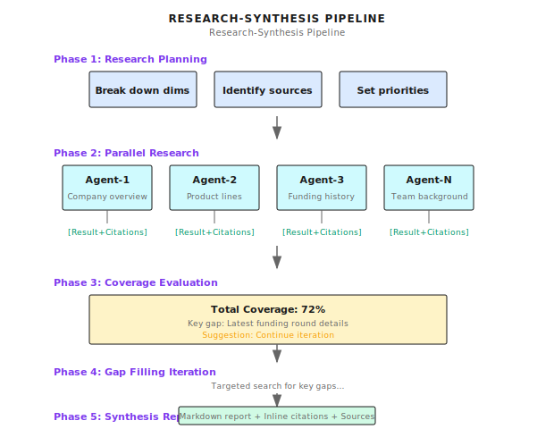

# Chapter 19: Research Synthesis

> **Research Synthesis integrates multi-source parallel research, coverage evaluation, and iterative supplementation into high-quality comprehensive reports—the key isn't "done searching" but "evaluating if information is enough, what's missing, what to supplement."**

---

> **Quick Track** (Master the core in 5 minutes)
>
> 1. Systematic research vs simple search: multi-source parallel + coverage evaluation + iterative supplementation
> 2. Five-phase flow: Planning → Parallel research → Coverage evaluation → Iterative supplementation → Comprehensive report
> 3. Coverage threshold: Continue iterating below 80%, max 3 rounds to prevent infinite loops
> 4. Cross-validation: Same fact confirmed by multiple sources, mark confidence when conflicts exist
> 5. Output standard: Structured Markdown + inline citations + Sources list
>
> **10-minute path**: 19.1-19.3 → 19.5 → Shannon Lab

---

You ask an Agent to research a company:

> "Help me research Anthropic and write an analysis report."

It searches and returns summaries of the top 3 results:

```
Anthropic is an AI safety company founded by former OpenAI members...
Main product is Claude...
Recently completed a funding round...
```

Is this enough?

**Not enough.**

The problem isn't "found something," but:
- Information isn't comprehensive (product line? team? competitors?)
- No cross-validation (funding amount differs across reports)
- Lacks structured organization (scattered fragments, not a report)
- Can't identify information gaps (don't know what's missing)

I first realized how serious this problem was when helping an investment firm with due diligence. The Agent's "research report" looked pretty good, but on closer inspection, many key pieces were "reportedly," "sources say"—no solid evidence.

**Research Synthesis upgrades "simple search" to "systematic research"—parallel research across multiple dimensions, evaluate information coverage, identify and fill gaps, finally synthesize into structured reports.**

This is the practical application scenario for ToT, Debate, and other patterns—truly bringing advanced reasoning to production.

---

## 19.1 Simple Search vs Systematic Research

First, the differences:

| Dimension | Simple Search | Systematic Research |
|-----------|---------------|---------------------|
| **Information sources** | Top 3 search results | Multi-source parallel (website, news, financials, social...) |
| **Coverage evaluation** | Done when searched | Evaluate coverage, identify gaps |
| **Information verification** | Use directly | Cross-validate, mark confidence |
| **Iterative supplementation** | None | Targeted search for gaps |
| **Output format** | Fragment summaries | Structured report + citations |

Complete flow for systematic research:



---

## 19.2 Coverage Evaluation: This Is the Core

This is Research Synthesis's most critical design—not "done when searched" but "evaluate if information is enough."

### Data Structures

Shannon's coverage evaluation is defined in [`activities/coverage_evaluator.go`](https://github.com/Kocoro-lab/Shannon/blob/main/go/orchestrator/internal/activities/coverage_evaluator.go):

```go
type CoverageEvaluationInput struct {
    Query               string              // Research question
    ResearchDimensions  []ResearchDimension // Research dimensions
    CurrentSynthesis    string              // Current synthesis result
    CoveredAreas        []string            // Already covered areas
    KeyFindings         []string            // Key findings
    Iteration           int                 // Current iteration
    MaxIterations       int                 // Maximum iterations
}

type CoverageEvaluationResult struct {
    OverallCoverage    float64            // Overall coverage 0.0-1.0
    DimensionCoverage  map[string]float64 // Per-dimension coverage
    CriticalGaps       []CoverageGap      // Required gaps
    OptionalGaps       []CoverageGap      // Optional gaps
    RecommendedAction  string             // "continue"/"complete"
    ShouldContinue     bool               // Whether to continue iterating
    ConfidenceLevel    string             // "high"/"medium"/"low"
    Reasoning          string             // Decision reasoning
}

type CoverageGap struct {
    Area        string   // Missing area
    Importance  string   // "critical"/"important"/"minor"
    Questions   []string // Questions to answer
    SourceTypes []string // Suggested source types
}
```

### Distinguishing Real Coverage vs Acknowledged Gaps

This is the core challenge of coverage evaluation: distinguishing real information from acknowledged gaps.

```go
func buildCoverageEvaluationPrompt(input CoverageEvaluationInput) string {
    return `## CRITICAL: Distinguish Real Coverage from Acknowledged Gaps

**Real Coverage** means finding substantial information:
- Specific facts, numbers, dates, names
- Verified claims with evidence support
- Concrete details about the target entity

**Not Real Coverage** (should count as gap):
- "We could not find information about X"
- "No data available for Y"
- "This remains unverified/unknown"
- Using competitor/industry info to substitute target info
- General market context without target-specific data

Important: If synthesis says "we don't know X about [target],
but here's how competitors do it"—that's a gap, not coverage.

## Evaluation Criteria:
- CRITICAL gap: Missing primary entity info (founding date, products, team)
- IMPORTANT gap: Missing context that significantly improves understanding
- MINOR gap: Nice-to-have info needed for completeness

## Decision Logic:
- coverage >= 0.85 + no critical gaps + has substantial info → "complete"
- If synthesis is mostly "we don't know" statements → coverage should be low (<0.4)
- coverage < 0.6 + multiple gaps → "continue"
- Reached max iterations → "complete" regardless
`
}
```

The most common problem I've seen is "inflated coverage": Agent says "I checked this topic," but actually just said "I didn't find relevant information." That's not coverage, that's confirming a gap.

---

## 19.3 Deterministic Guardrails: Ensuring Workflow Consistency

This is a key Shannon design.

LLM judgments can be inconsistent (same input, different `ShouldContinue` at different times). But Temporal workflows need **deterministic replay**—same input must produce same output.

So use deterministic guardrails to override LLM judgments:

```go
func EvaluateCoverage(ctx context.Context, input CoverageEvaluationInput) (*CoverageEvaluationResult, error) {
    // ... LLM evaluation ...

    // === Deterministic Guardrails ===
    // Override LLM judgment with deterministic rules, ensure replay consistency

    // Rule 1: First iteration + low coverage → must continue
    if input.Iteration == 1 && result.OverallCoverage < 0.5 {
        result.ShouldContinue = true
        result.RecommendedAction = "continue"
    }

    // Rule 2: Critical gaps exist + iterations remaining → must continue
    if len(result.CriticalGaps) > 0 && input.Iteration < input.MaxIterations {
        result.ShouldContinue = true
        result.RecommendedAction = "continue"
    }

    // Rule 3: Very low coverage → must continue
    if result.OverallCoverage < 0.3 && input.Iteration < input.MaxIterations {
        result.ShouldContinue = true
        result.RecommendedAction = "continue"
    }

    // Rule 4: Synthesis too short but claims high coverage → lower confidence
    if len(input.CurrentSynthesis) < 500 && result.OverallCoverage > 0.7 {
        result.ConfidenceLevel = "low"
    }

    // Rule 5: Reached max iterations → must stop (highest priority)
    if input.Iteration >= input.MaxIterations {
        result.ShouldContinue = false
        result.RecommendedAction = "complete"
    }

    return result, nil
}
```

Guardrail priority (high to low):

1. **Max iterations** → Force stop (fallback)
2. **First iteration low coverage** → Force continue
3. **Critical gaps exist** → Force continue
4. **Extremely low coverage** → Force continue
5. **Report too short claims high coverage** → Mark low confidence

This design ensures: no matter how the LLM "goes haywire," workflow behavior is predictable.

---

## 19.4 Entity Relevance Filtering

### Problem Scenario

When researching a specific company, search results may include many irrelevant references:

```
Query: "Research Anthropic company"

Search results:
  [1] anthropic.com/company ← Highly relevant (official site)
  [2] TechCrunch: Anthropic raises $4B ← Highly relevant
  [3] "AI company valuation study" ← Possibly relevant (mentions multiple companies)
  [4] "Deep learning tutorial" ← Not relevant
  [5] "OpenAI latest news" ← Competitor, indirectly relevant
```

If you feed all results to the LLM for synthesis, two problems arise:
1. Tokens wasted on irrelevant content
2. Synthesis report may mix in irrelevant information

### Entity Filter

Shannon uses a scoring system to filter citations ([`strategies/research.go`](https://github.com/Kocoro-lab/Shannon/blob/main/go/orchestrator/internal/workflows/strategies/research.go)):

```go
// Scoring system (OR logic, not AND):
//   - Official domain match: +0.6 points
//   - URL contains alias: +0.4 points
//   - Title/snippet/source contains alias: +0.4 points
//   - Threshold: 0.3 (any single match passes)
//
// Filtering strategy:
//  1. Always keep all official domain citations (bypass threshold)
//  2. Keep non-official citations scoring >= threshold
//  3. Backfill to minKeep (10) using quality×credibility+entity_score

func FilterCitationsByEntity(
    citations []Citation,
    canonicalName string,
    aliases []string,
    officialDomains []string,
) []Citation {

    const (
        threshold = 0.3  // Title/snippet match (0.4) can pass
        minKeep   = 10   // Deep research keeps at least 10
    )

    // Normalize name and aliases
    canonical := strings.ToLower(canonicalName)
    aliasSet := make(map[string]bool)
    aliasSet[canonical] = true
    for _, a := range aliases {
        aliasSet[strings.ToLower(a)] = true
    }

    var officialSites []scoredCitation
    var scored []scoredCitation

    for _, c := range citations {
        score := 0.0
        isOfficial := false
        urlLower := strings.ToLower(c.URL)

        // Check 1: Official domain match (+0.6)
        for domain := range domainSet {
            if strings.Contains(urlLower, domain) {
                score += 0.6
                isOfficial = true
                break
            }
        }

        // Check 2: URL contains alias (+0.4)
        if !isOfficial {
            for alias := range aliasSet {
                if len(alias) >= 5 && strings.Contains(urlLower, alias) {
                    score += 0.4
                    break
                }
            }
        }

        // Check 3: Title/snippet contains alias (+0.4)
        combined := strings.ToLower(c.Title + " " + c.Snippet)
        for alias := range aliasSet {
            if strings.Contains(combined, alias) {
                score += 0.4
                break
            }
        }

        scored = append(scored, scoredCitation{citation: c, score: score, isOfficial: isOfficial})
        if isOfficial {
            officialSites = append(officialSites, sc)
        }
    }

    // Step 1: Keep all official domains
    var filtered []Citation
    for _, sc := range officialSites {
        filtered = append(filtered, sc.citation)
    }

    // Step 2: Non-official but pass threshold
    for _, sc := range scored {
        if !sc.isOfficial && sc.score >= threshold {
            filtered = append(filtered, sc.citation)
        }
    }

    // Step 3: Safety floor backfill
    if len(filtered) < minKeep {
        // Sort by quality×credibility+entity_score and backfill
        // ...
    }

    return filtered
}
```

### Word Boundary Matching

Prevent short alias false matches (e.g., "mind" matching "minders.io"):

```go
func containsAsWord(text, term string) bool {
    if term == "" {
        return false
    }
    idx := strings.Index(text, term)
    if idx < 0 {
        return false
    }

    // Check left boundary
    if idx > 0 {
        prev := text[idx-1]
        if (prev >= 'a' && prev <= 'z') || (prev >= '0' && prev <= '9') {
            // Previous char is alphanumeric, not word boundary
            rest := text[idx+len(term):]
            return containsAsWord(rest, term)  // Recursively find next
        }
    }

    // Check right boundary
    endIdx := idx + len(term)
    if endIdx < len(text) {
        next := text[endIdx]
        if (next >= 'a' && next <= 'z') || (next >= '0' && next <= '9') {
            rest := text[idx+len(term):]
            return containsAsWord(rest, term)
        }
    }

    return true
}
```

This detail matters. I've seen a case: searching for "Mind" company, results included a bunch of "remind," "minding" content, making the report a mess.

---

## 19.5 Comprehensive Report Generation

### Agent Result Preprocessing

Before synthesis, preprocess Agent results:

```go
func preprocessAgentResults(results []AgentExecutionResult) []AgentExecutionResult {
    // Step 1: Exact deduplication (hash-based)
    exact := deduplicateExact(results)

    // Step 2: Similarity deduplication (Jaccard similarity > 0.85)
    near := deduplicateSimilar(exact, 0.85)

    // Step 3: Filter low quality results
    filtered := filterLowQuality(near)

    return filtered
}

// Low quality filter
var noInfoPatterns = []string{
    // English: Access failures
    "unfortunately, i cannot access",
    "unable to retrieve",
    "network connection error",

    // Chinese: Access failures
    "unfortunately, unable to access",
    "cannot connect to",
    "network connection error",

    // English: Info not found
    "i couldn't find",
    "no information available",
    "no results found",

    // Chinese: Info not found
    "no relevant found",
    "not found",
}

func filterLowQuality(results []AgentExecutionResult) []AgentExecutionResult {
    var filtered []AgentExecutionResult
    for _, r := range results {
        resp := strings.TrimSpace(r.Response)
        if !r.Success || resp == "" {
            continue
        }
        if containsNoInfoPatterns(resp) {
            continue  // Filter error messages
        }
        filtered = append(filtered, r)
    }
    return filtered
}
```

This preprocessing solves three problems:
1. **Exact duplicates**: Same Agent may be called multiple times
2. **Similar duplicates**: Different Agents may return nearly identical content
3. **Invalid results**: Access failures, info not found results

### Synthesis Activity

```go
func SynthesizeResultsLLM(ctx context.Context, input SynthesisInput) (SynthesisResult, error) {
    // Preprocess
    input.AgentResults = preprocessAgentResults(input.AgentResults)

    // Calculate target word count
    targetWords := 1200
    if len(areas) > 0 {
        targetWords = len(areas) * 400  // 400 words per area
    }
    if targetWords < 1800 {
        targetWords = 1800  // Minimum guarantee
    }

    // Build synthesis prompt
    prompt := fmt.Sprintf(`# Synthesis Requirements:

## Coverage Checklist (all must be satisfied to stop):
- Dedicated subsection for each research area
- Each subsection at least 250-400 words
- Executive Summary contains key insights (250-400 words)
- Reply uses same language as query

## Output Format:
## Executive Summary
## Detailed Findings
## Limitations and Uncertainties (only when significant gaps exist)

## Citation Integration:
- Use inline citations [1], [2] to mark all factual claims
- At least %d inline citations
- Do NOT include "## Sources" section; system will auto-add
`, minCitations)

    // Add Agent results
    for _, r := range input.AgentResults {
        sanitized := sanitizeAgentOutput(r.Response)
        prompt += fmt.Sprintf("=== Agent %s ===\n%s\n\n", r.AgentID, sanitized)
    }

    // Call LLM
    response := callLLM(prompt, maxTokens)

    return SynthesisResult{
        FinalResult: response,
        TokensUsed:  tokensUsed,
    }, nil
}
```

### Synthesis Continuation Mechanism

When LLM-generated report is truncated (token limit), auto-continue:

```go
func looksComplete(s string, style string) bool {
    txt := strings.TrimSpace(s)
    if txt == "" {
        return false
    }
    runes := []rune(txt)
    last := runes[len(runes)-1]

    // Check sentence-ending punctuation (ASCII + CJK)
    if last == '.' || last == '!' || last == '?' ||
       last == '。' || last == '！' || last == '？' {
        // Check for incomplete phrases
        tail := strings.ToLower(txt)
        if len(tail) > 40 {
            tail = tail[len(tail)-40:]
        }
        bad := []string{" and", " or", " with", " to", "、", "and", "or"}
        for _, b := range bad {
            if strings.HasSuffix(tail, b) {
                return false
            }
        }

        // Minimum length check
        minLength := 1000
        if style == "comprehensive" {
            minLength = 3000
        }
        if len(runes) < minLength {
            return false
        }

        return true
    }

    return false
}

// Trigger continuation
if finishReason == "stop" && !looksComplete(finalResponse, style) {
    // Extract last 2000 chars as context
    excerpt := string(runes[max(0, len(runes)-2000):])

    contQuery := "Continue the previous synthesis in the SAME language.\n" +
        "- Continue from the last sentence; do NOT repeat\n" +
        "- Maintain same headings and citation style\n" +
        "Previous excerpt:\n" + excerpt

    // Call LLM to continue
    contResult := callLLM(contQuery, maxTokens/2)

    // Concatenate
    finalResponse = strings.TrimRight(finalResponse, "\n") + "\n\n" +
        strings.TrimSpace(contResult.Response)
}
```

---

## 19.6 Complete Research Workflow

Putting the above components together:

```go
func executeResearch(query string) (*ResearchResult, error) {
    // Phase 1: Research planning
    dimensions := []ResearchDimension{
        {Dimension: "Company Overview", Priority: "high"},
        {Dimension: "Products & Services", Priority: "high"},
        {Dimension: "Funding History", Priority: "medium"},
        {Dimension: "Team Background", Priority: "medium"},
        {Dimension: "Market Competition", Priority: "low"},
    }

    // Phase 2: Parallel research
    var agentResults []AgentExecutionResult
    for _, dim := range dimensions {
        result := executeAgent(ctx, AgentInput{
            Query:   fmt.Sprintf("Research %s: %s", dim.Dimension, query),
            AgentID: fmt.Sprintf("researcher-%s", dim.Dimension),
            Mode:    "research",
        })
        agentResults = append(agentResults, result)
    }

    // Phase 3-4: Coverage evaluation + Iterative supplementation
    var coverageResult *CoverageEvaluationResult
    for iteration := 1; iteration <= 3; iteration++ {
        coverageResult = EvaluateCoverage(ctx, CoverageEvaluationInput{
            Query:              query,
            ResearchDimensions: dimensions,
            CurrentSynthesis:   currentSynthesis,
            CoveredAreas:       extractCoveredAreas(agentResults),
            KeyFindings:        extractKeyFindings(agentResults),
            Iteration:          iteration,
            MaxIterations:      3,
        })

        if !coverageResult.ShouldContinue {
            break
        }

        // Iterative supplementation for critical gaps
        for _, gap := range coverageResult.CriticalGaps {
            additionalResult := executeAgent(ctx, AgentInput{
                Query:   gap.Questions[0],
                AgentID: fmt.Sprintf("gap-filler-%s", gap.Area),
            })
            agentResults = append(agentResults, additionalResult)
        }
    }

    // Phase 5: Comprehensive report
    synthesis := SynthesizeResultsLLM(ctx, SynthesisInput{
        Query:        query,
        AgentResults: agentResults,
        Context: map[string]interface{}{
            "synthesis_style": "comprehensive",
            "research_areas":  dimensionNames(dimensions),
        },
    })

    return &ResearchResult{
        Report:     synthesis.FinalResult,
        TokensUsed: synthesis.TokensUsed,
        Coverage:   coverageResult.OverallCoverage,
    }, nil
}
```

---

## 19.7 Example Output

Final report for researching "Anthropic company":

```markdown
## Executive Summary

Anthropic is an AI safety company founded in 2021 by former OpenAI members Dario Amodei and Daniela Amodei [1].
The company's core product is the Claude large language model series, now in its third generation [2].
As of 2024, the company has raised over $7 billion in funding with a valuation of approximately $18.4 billion [3].

## Detailed Findings

### Company Overview
Anthropic was founded in 2021 and is headquartered in San Francisco [1]. The company's core mission is AI safety research,
focusing on developing controllable, interpretable AI systems. The founding team includes several former OpenAI core researchers [4]...

### Products & Services
The main product is the Claude series of large language models. The Claude 3 series released in 2024 includes three versions:
Opus (most capable), Sonnet (balanced), Haiku (fastest) [2]. Claude emphasizes safety and alignment...

### Funding History
Raised over $7 billion in total [3]. Major investors include Google ($2 billion),
Salesforce, Zoom, and others [5]. 2024 additional funding brought valuation to $18.4 billion...

### Team Background
CEO Dario Amodei and President Daniela Amodei are both former OpenAI executives [4].
Core research team includes several prominent scholars in AI safety...

## Limitations and Uncertainties

- Specific terms of latest funding round not publicly disclosed
- Commercialization progress (revenue, customer count) lacks official data

## Sources
[1] https://www.anthropic.com/company
[2] https://www.anthropic.com/claude
[3] https://www.crunchbase.com/organization/anthropic
[4] https://www.linkedin.com/company/anthropic
[5] https://www.theverge.com/2024/01/...
```

---

## 19.8 Common Pitfalls

### Pitfall 1: Inflated Coverage

```go
// Wrong: Count "not found" as coverage
if strings.Contains(synthesis, "company") {
    coverage = 0.9  // Inflated!
}

// Correct: Distinguish substantial info vs acknowledged gap
if containsSubstantiveInfo(synthesis) && !isAcknowledgedGap(synthesis) {
    coverage = calculateActualCoverage(synthesis)
}
```

### Pitfall 2: Infinite Iteration

```go
// Wrong: No forced termination
for coverageResult.ShouldContinue {
    // May never stop
}

// Correct: Deterministic guardrail
if input.Iteration >= input.MaxIterations {
    result.ShouldContinue = false  // Force termination
}
```

### Pitfall 3: Over-filtering Citations

```go
// Wrong: Threshold too high, lose useful info
threshold = 0.8
// Result: Only official site remains, no news, analysis, external perspectives

// Correct: Lenient threshold + safety floor
threshold = 0.3
minKeep = 10  // Keep at least 10
```

### Pitfall 4: Token Explosion

```go
// Wrong: Concatenate all Agent results directly
for _, r := range results {
    prompt += r.Response  // May exceed context window
}

// Correct: Limit each Agent's length
const maxPerAgentChars = 4000
for _, r := range results[:maxAgents] {
    if len(r.Response) > maxPerAgentChars {
        r.Response = r.Response[:maxPerAgentChars] + "..."
    }
}
```

---

## 19.9 Research Synthesis vs Other Patterns

| Pattern | Goal | Use Case | Output |
|---------|------|----------|--------|
| **Research Synthesis** | Comprehensive research + synthesis report | Due diligence, industry analysis, competitive research | Structured report |
| **ToT** | Explore solution paths | Problems with multiple possible solutions | Optimal solution |
| **Debate** | Multi-perspective synthesis | Controversial topics | Synthesized position |
| **ReAct** | Problem solving | Tasks requiring tool calls | Task result |

**What makes Research Synthesis unique**:

1. **Iterative**: Not one-time search, but evaluate → supplement → re-evaluate
2. **Structured**: Output is a report with sections and citations, not fragments
3. **Coverage-aware**: Knows "what it doesn't know," proactively identifies gaps

---

## What This Chapter Covered

Core message in one sentence: **Research Synthesis integrates multi-source research into high-quality comprehensive reports through coverage evaluation, iterative supplementation, and entity filtering**.

The key isn't "done searching" but "evaluate if enough, what's missing, what to supplement."

Key points:

1. **Coverage evaluation**: Distinguish real information from acknowledged gaps
2. **Deterministic guardrails**: Ensure Temporal workflow replay consistency
3. **Entity filtering**: Only keep citations related to target entity
4. **Iterative supplementation**: Launch targeted searches for critical gaps
5. **Synthesis continuation**: Auto-handle truncated reports

---

## Shannon Lab (10-minute hands-on)

This section helps you map this chapter's concepts to Shannon source code in 10 minutes.

### Required Reading (1 file)

- [`activities/coverage_evaluator.go`](https://github.com/Kocoro-lab/Shannon/blob/main/go/orchestrator/internal/activities/coverage_evaluator.go): Find `EvaluateCoverage` function, see how deterministic guardrails override LLM judgment; find `buildCoverageEvaluationPrompt` to see how to distinguish real coverage from acknowledged gaps

### Optional Deep Dives (2 files, pick based on interest)

- [`strategies/research.go`](https://github.com/Kocoro-lab/Shannon/blob/main/go/orchestrator/internal/workflows/strategies/research.go): Understand how complete research workflow chains phases together, find `FilterCitationsByEntity` to see entity filtering logic
- [`activities/synthesis.go`](https://github.com/Kocoro-lab/Shannon/blob/main/go/orchestrator/internal/activities/synthesis.go): Understand Agent result preprocessing and comprehensive report generation, find `preprocessAgentResults` to see deduplication and filtering logic

---

## Exercises

### Exercise 1: Coverage Evaluation

Given this synthesis report fragment, evaluate its coverage (0-1) and identify critical gaps:

```
About XYZ company, we found the following:
- Founded in 2020, headquartered in Beijing
- Main product is a SaaS platform (specific features not found)
- Funding: reportedly completed Series A, amount not disclosed
- Team: founder background unknown
- Competitors: multiple similar companies in market, but no direct comparison data found
```

### Exercise 2: Guardrail Design

If you were to design stricter coverage guardrails, what rules would you add? Consider:

1. Relationship between report length and claimed coverage
2. Relationship between citation count and information credibility
3. How to handle "couldn't find info" vs "info doesn't exist"

### Exercise 3 (Advanced): Multi-language Research

When researching a Japanese company, you may need Japanese sources. Design a solution:

1. How to identify need for multi-language search?
2. How to synthesize multi-language results?
3. How to ensure report language consistency?

---

## Want to Go Deeper?

- Systematic Literature Review methodology
- Meta-analysis methods
- Related chapters: Ch10 Planning pattern, Ch13 Orchestration fundamentals, Ch14 DAG workflows

---

## Part 6 Conclusion

This is the final chapter of Part 6 Advanced Reasoning.

Three patterns covering three types of advanced reasoning needs:

| Pattern | Core Question | Use Case |
|---------|---------------|----------|
| **Tree-of-Thoughts** | How to choose among multiple paths? | Need to explore multiple solutions |
| **Debate** | How to synthesize multiple perspectives? | Controversial topics, need multiple angles |
| **Research Synthesis** | How to integrate multi-source information? | Systematic research, due diligence, analysis reports |

Starting in Part 7, we enter **Production Architecture**—Chapter 20 covers three-layer architecture design, showing how Go/Rust/Python collaborate.
