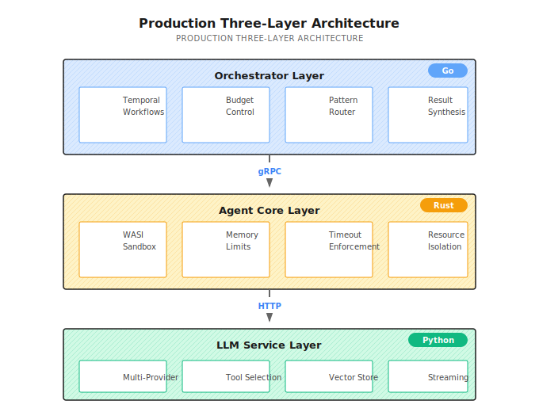

# Chapter 20: Three-Layer Architecture

> **Three-layer architecture isn't about showing off—it's about letting each language do what it does best: Go for orchestration, Rust for isolation, Python for AI ecosystem integration.**
> **But it comes with costs: deployment complexity, debugging overhead, inter-layer latency. Think carefully about whether your scale actually needs this before committing.**

---

You wrote an Agent in Python. Single process, asyncio concurrency, tools executed directly in-process.

Ran for a week, went smoothly. Then user volume picked up, and problems started appearing:

1. A user submitted malicious Python code, and your Agent dutifully executed it, reading `/etc/passwd` and returning it to them
2. 10 requests came in simultaneously, the GIL locked up tight, response time went from 2 seconds to 20 seconds
3. Process crashed in the middle of the night, 5 research tasks in progress were all lost, users complained the next day
4. One tool call consumed 8GB of memory, the entire service died, didn't even have time to write logs

These problems aren't "poorly written code"—they're the **ceiling of monolithic architecture**.

Three-layer architecture is designed to break through this ceiling—separating orchestration, secure execution, and LLM calls into different services, letting each language maximize its strengths.

---

## 20.1 Why Layer?

### Limitations of Monolithic Architecture

I've seen many Agent frameworks with this structure:

```
┌───────────────────────────────────────┐
│  Python Monolith                      │
│  ┌─────────────────────────────────┐  │
│  │ Orchestration (asyncio)         │  │
│  │ Agent Execution (same process)  │  │
│  │ Tool Calling (direct execution) │  │
│  │ LLM API (requests)              │  │
│  └─────────────────────────────────┘  │
└───────────────────────────────────────┘
```

This architecture is fast to develop, simple to deploy, and convenient to debug. For prototypes and small-scale use, it's completely sufficient.

**But it has several unavoidable problems:**

| Problem | Root Cause | Consequence |
|---------|------------|-------------|
| **Fuzzy Security Boundaries** | Tool code shares memory space with main process | Malicious code can access any data |
| **Limited Concurrency** | Python GIL limits true parallelism | 10 requests can lock up the service |
| **State Easily Lost** | In-memory state not persisted | Process crash = all tasks lost |
| **Poor Resource Isolation** | All tools share same process resources | One tool OOMs, entire service dies |

If your Agent is just for personal use, or users are controlled, these problems may never surface.

But if you're building a **production system for external users**, these problems will eventually become incidents.

### How Three-Layer Architecture Solves This

Three-layer architecture separates these responsibilities:



### Why These Three Languages?

This wasn't chosen randomly. Each language has unique advantages in its position:

| Layer | Language | Why Choose It | What If You Used Python Instead |
|-------|----------|---------------|--------------------------------|
| Orchestrator | Go | High concurrency, native Temporal support, compiled language less prone to runtime errors | asyncio can do it, but Temporal SDK isn't as mature as Go |
| Agent Core | Rust | Memory safety, WASI sandbox support, zero-cost abstractions | Cannot provide same level of security isolation |
| LLM Service | Python | Richest LLM SDK ecosystem, most AI libraries, fastest iteration | It's already Python, ecosystem advantage is obvious |

**But I must say: three-layer architecture is not a silver bullet.**

Its costs are:
- Increased deployment complexity (at least 3 services + Temporal + database)
- Difficult debugging (problem could be in any layer)
- Inter-layer communication has latency overhead

If your user volume isn't large, security requirements aren't high, and you can accept occasional service restarts, monolithic Python might suit you better.

---

## 20.2 Orchestrator Layer (Go)

The Orchestrator is the system's "brain"—it doesn't execute specific tasks, but decides **who executes, in what order, and how to synthesize results**.

### Core Responsibilities

| Responsibility | Description | Key Implementation |
|----------------|-------------|-------------------|
| **Workflow Orchestration** | Durable execution based on Temporal | Automatic crash recovery |
| **Budget Control** | Token budget, cost tracking | Auto-stop on budget exceeded |
| **Routing Decisions** | Choose execution strategy (ReAct/DAG/Supervisor) | Based on complexity scoring |
| **Result Synthesis** | Merge multi-Agent results | LLM-assisted + rule-based synthesis |

### Entry Program Structure

Shannon's Orchestrator entry is in [`main.go`](https://github.com/Kocoro-lab/Shannon/blob/main/go/orchestrator/main.go). Let me highlight a few key parts:

**1. Health Check Starts First**

```go
// Health check starts before other components
hm := health.NewManager(logger)
healthHandler := health.NewHTTPHandler(hm, logger)
healthHandler.RegisterRoutes(httpMux)

go func() {
    _ = hm.Start(ctx)
    server := &http.Server{
        Addr:    ":" + strconv.Itoa(healthPort),
        Handler: httpMux,
    }
    logger.Info("Admin HTTP server listening", zap.Int("port", healthPort))
    server.ListenAndServe()
}()
```

Why start health check first? Because Kubernetes readiness probe will start checking immediately after service starts. If the health endpoint isn't up yet, the Pod will be marked unhealthy and killed, forming an infinite restart loop.

**2. Database Connection and Health Check**

```go
dbClient, err := db.NewClient(dbConfig, logger)
if err != nil {
    logger.Fatal("Failed to initialize database client", zap.Error(err))
}
defer dbClient.Close()

// Register database health check
if dbClient != nil {
    dbChecker := health.NewDatabaseHealthChecker(dbClient.GetDB(), dbClient.Wrapper(), logger)
    _ = hm.RegisterChecker(dbChecker)
}
```

**3. Temporal Worker Startup (with Retry)**

```go
// TCP pre-check
for i := 1; i <= 60; i++ {
    c, err := net.DialTimeout("tcp", host, 2*time.Second)
    if err == nil {
        _ = c.Close()
        break
    }
    logger.Warn("Waiting for Temporal TCP endpoint", zap.String("host", host), zap.Int("attempt", i))
    time.Sleep(1 * time.Second)
}

// SDK connection retry
var tClient client.Client
for attempt := 1; ; attempt++ {
    tClient, err = client.Dial(client.Options{
        HostPort: host,
        Logger:   temporal.NewZapAdapter(logger),
    })
    if err == nil {
        break
    }
    delay := time.Duration(min(attempt, 15)) * time.Second
    logger.Warn("Temporal not ready, retrying", zap.Int("attempt", attempt), zap.Duration("sleep", delay))
    time.Sleep(delay)
}
```

Why two-layer checking? TCP check is fast (2 second timeout), can quickly determine if Temporal service is reachable. SDK connection is heavier, retries with exponential backoff on failure.

**4. Workflow and Activity Registration**

```go
orchestratorRegistry := registry.NewOrchestratorRegistry(registryConfig, logger, dbClient.GetDB(), sessionManager)

startWorker := func(queue string, actSize, wfSize int) worker.Worker {
    wk := worker.New(tClient, queue, worker.Options{
        MaxConcurrentActivityExecutionSize:     actSize,
        MaxConcurrentWorkflowTaskExecutionSize: wfSize,
    })
    if err := orchestratorRegistry.RegisterWorkflows(wk); err != nil {
        logger.Error("Failed to register workflows", zap.String("queue", queue), zap.Error(err))
    }
    if err := orchestratorRegistry.RegisterActivities(wk); err != nil {
        logger.Error("Failed to register activities", zap.String("queue", queue), zap.Error(err))
    }
    go wk.Run(worker.InterruptCh())
    return wk
}
```

### Priority Queues

Shannon supports multi-queue mode, different priority tasks go to different queues:

```go
if priorityQueues {
    _ = startWorker("shannon-tasks-critical", 12, 12)  // Critical tasks, high concurrency
    _ = startWorker("shannon-tasks-high", 10, 10)
    w = startWorker("shannon-tasks", 8, 8)              // Normal tasks
    _ = startWorker("shannon-tasks-low", 4, 4)          // Low priority
} else {
    w = startWorker("shannon-tasks", 10, 10)            // Single queue mode
}
```

Typical uses for priority queues:
- **Critical**: Real-time requests where user is waiting
- **High**: Important but can wait a bit
- **Normal**: Regular background tasks
- **Low**: Report generation, data cleanup, etc.

---

## 20.3 Agent Core Layer (Rust)

Agent Core is the system's "bodyguard"—responsible for executing potentially unsafe operations in a **controlled environment**.

### Core Responsibilities

| Responsibility | Description | Implementation |
|----------------|-------------|----------------|
| **Sandbox Execution** | Isolated running of user code | WASI sandbox |
| **Resource Limits** | Memory, CPU, network | cgroups + WASI capability limits |
| **Timeout Control** | Force terminate long-running tasks | System-level timeout |
| **Tool Running** | Safe tool invocation | Whitelist + parameter validation |

### Why Rust?

Can Python do resource limiting? Yes, but it's hard to match Rust's level:

| Capability | Python | Rust |
|------------|--------|------|
| Memory Safety | Runtime checks | Compile-time guarantees |
| WASI Sandbox | Requires external process | Native integration (wasmtime) |
| Resource Isolation | Process level | Thread level |
| Performance Overhead | High | Extremely low |

If your security requirements aren't high, Python's subprocess + ulimit can do basic isolation. But if you're serving external users, Rust's security guarantees are more reliable.

### gRPC Service Definition

Agent Core exposes services via gRPC:

```protobuf
service AgentService {
  rpc ExecuteTask(ExecuteTaskRequest) returns (ExecuteTaskResponse);
  rpc StreamExecuteTask(ExecuteTaskRequest) returns (stream TaskUpdate);
  rpc HealthCheck(HealthCheckRequest) returns (HealthCheckResponse);
  rpc DiscoverTools(DiscoverToolsRequest) returns (DiscoverToolsResponse);
}

message ExecuteTaskRequest {
  TaskMetadata metadata = 1;
  string query = 2;
  google.protobuf.Struct context = 3;
  ExecutionMode mode = 4;
  repeated string available_tools = 5;
  AgentConfig config = 6;
}

message AgentConfig {
  int32 max_iterations = 1;      // Maximum iterations
  int32 timeout_seconds = 2;     // Timeout
  bool enable_sandbox = 3;       // Enable sandbox
  int64 memory_limit_mb = 4;     // Memory limit
}
```

### Tool Capability Description

Each tool has detailed capability descriptions:

```protobuf
message ToolCapability {
  string id = 1;
  string name = 2;
  string description = 3;
  string category = 4;
  google.protobuf.Struct input_schema = 5;   // JSON Schema
  google.protobuf.Struct output_schema = 6;
  repeated string required_permissions = 7;  // Required permissions
  int64 estimated_duration_ms = 8;           // Estimated duration
  bool is_dangerous = 9;                     // Dangerous flag
  RateLimit rate_limit = 14;                 // Rate limit config
}
```

The `is_dangerous` flag is used to trigger additional approval workflows or sandbox isolation. For example, `code_execution` and `file_system` tools would be marked as dangerous.

---

## 20.4 LLM Service Layer (Python)

LLM Service is the system's "voice"—responsible for conversing with various AI models.

### Core Responsibilities

| Responsibility | Description | Implementation |
|----------------|-------------|----------------|
| **Multi-Provider Calls** | OpenAI, Anthropic, Google, etc. | Provider abstraction layer |
| **Tool Selection** | Select appropriate tools based on query | Semantic matching + rules |
| **Vector Storage** | Embedding generation and retrieval | Qdrant + cache |
| **Streaming Response** | Token-level streaming output | SSE/WebSocket |

### Why Python?

AI ecosystem is almost always Python-first:
- OpenAI SDK: Python version updates first
- Anthropic SDK: Python version has most complete features
- LangChain/LlamaIndex: Native Python
- Vector database clients: Best Python support

Using Go or Rust to call LLMs is certainly possible, but you'll spend a lot of time on SDK adaptation, not business logic.

### Key Endpoints

```python
# /agent/query - Main query endpoint
@app.post("/agent/query")
async def query(request: QueryRequest):
    response = await llm_client.query(
        query=request.query,
        context=request.context,
        tools=request.allowed_tools,
        model_tier=request.model_tier,
        max_tokens=request.max_tokens,
    )
    return {
        "success": True,
        "response": response.content,
        "tokens_used": response.usage.total_tokens,
        "model_used": response.model,
    }

# /embeddings - Vector generation
@app.post("/embeddings")
async def embeddings(request: EmbeddingRequest):
    vectors = await embedding_service.generate(
        texts=request.texts,
        model=request.model or "text-embedding-3-small",
    )
    return {"embeddings": vectors}
```

---

## 20.5 Inter-Layer Communication

The three layers communicate via gRPC and HTTP. Here are a few key designs:

### Workflow ID Propagation

Cross-service calls automatically inject Workflow ID for tracing:

```go
// HTTP requests automatically inject Workflow ID
type WorkflowHTTPRoundTripper struct {
    base http.RoundTripper
}

func (w *WorkflowHTTPRoundTripper) RoundTrip(req *http.Request) (*http.Response, error) {
    info := activity.GetInfo(req.Context())
    if info.WorkflowExecution.ID != "" {
        req.Header.Set("X-Workflow-ID", info.WorkflowExecution.ID)
        req.Header.Set("X-Run-ID", info.WorkflowExecution.RunID)
    }
    return w.base.RoundTrip(req)
}
```

Benefits of this approach:
- **Distributed Tracing**: Logs can be aggregated by Workflow ID
- **Resource Attribution**: Token consumption can be attributed to specific tasks
- **Problem Localization**: Can see complete call chain when issues occur

### Timeout Hierarchy

Inter-layer timeouts must **decrease from outer to inner**:

```yaml
# Correct timeout configuration
orchestrator: timeout=120s  # Outermost has longest
agent-core: timeout=60s
llm-service: timeout=30s    # Innermost has shortest

# Wrong configuration - will cause unexpected timeouts
# orchestrator: timeout=60s
# agent-core: timeout=30s  # Might timeout while orchestrator is waiting
```

If inner layer timeout is longer than outer layer, the outer layer will timeout first, and the inner layer's work is wasted.

---

## 20.6 Configuration Management

### Hot-Reload Configuration

Shannon supports configuration hot-reload without restarting services:

```go
shannonCfgMgr.RegisterCallback(func(oldConfig, newConfig *cfg.ShannonConfig) error {
    // Update health check config
    newHealthConfig := &health.HealthConfiguration{
        Enabled:       newConfig.Health.Enabled,
        CheckInterval: newConfig.Health.CheckInterval,
        GlobalTimeout: newConfig.Health.Timeout,
    }
    hm.UpdateConfiguration(newHealthConfig)

    // Reinitialize if policy engine changed
    if policyChanged(oldConfig, newConfig) {
        activities.InitializePolicyEngineFromShannonConfig(&newConfig.Policy)
    }

    return nil
})

// Model pricing hot-reload
configMgr.RegisterHandler("models.yaml", func(ev cfg.ChangeEvent) error {
    pricing.Reload()
    logger.Info("Pricing configuration reloaded")
    return nil
})
```

### Environment Variable Priority

In production, environment variables should override config files:

```go
// Environment variable > Config file
jwtSecret := shCfgForAuth.Auth.JWTSecret
if envSecret := os.Getenv("JWT_SECRET"); envSecret != "" {
    jwtSecret = envSecret  // Environment variable overrides
}
```

This allows injecting sensitive configuration through Kubernetes Secrets without writing secrets into config files.

---

## 20.7 Request Flow Example

How a query flows through the three layers:

```
User Request: "Analyze a certain AI company"
          ↓
[Orchestrator (Go)]
  1. gRPC receives request
  2. Creates Temporal Workflow
  3. Route selection: ResearchWorkflow
  4. Decompose task: company overview, products, funding...
          ↓ gRPC
[Agent Core (Rust)]
  5. Sandbox executes search tool
  6. Resource limits: 1GB memory, 30s timeout
  7. Returns search results
          ↓ HTTP
[LLM Service (Python)]
  8. Calls LLM API to analyze results
  9. Generates structured summary
  10. Vectorizes and stores to Qdrant
          ↓
[Orchestrator (Go)]
  11. Synthesizes multi-Agent results
  12. Evaluates coverage
  13. Returns final report
```

---

## 20.8 Common Pitfalls

### Pitfall 1: Cross-Layer Transaction Consistency

Three-layer architecture has no cross-service transaction guarantees. If you write:

```go
// Wrong: Assumes cross-layer atomicity
func processTask() {
    orchestrator.StartWorkflow()  // Succeeds
    agentCore.ExecuteTask()       // Might fail
    llmService.Synthesize()       // Inconsistent state
}
```

The correct approach is to wrap with Temporal's Activity:

```go
// Correct: Use Temporal guarantees
workflow.ExecuteActivity(ctx, activities.ExecuteAgent, ...)
// Temporal automatically handles retry and recovery
```

### Pitfall 2: Resource Leaks

Not closing gRPC connections leads to resource leaks:

```go
// Wrong: Connection not closed
conn, _ := grpc.Dial(addr, ...)
// Forgot defer conn.Close()

// Correct: Graceful shutdown
defer func() {
    grpcServer.GracefulStop()
    w.Stop()
    dbClient.Close()
}()
```

### Pitfall 3: Configuration Inconsistency

Independent configuration management for three layers easily leads to inconsistency:

```yaml
# Wrong: Mismatched timeout configuration
# orchestrator: token_budget=10000
# llm-service: max_tokens=20000  # Larger than orchestrator budget, will be truncated

# Correct: Maintain consistency
# orchestrator: token_budget=10000
# llm-service: max_tokens=10000  # Consistent with orchestrator
```

### Pitfall 4: Debugging Difficulty

Problems could be in any layer. Recommendations:
- Use Workflow ID to correlate logs uniformly
- Output key metrics from each layer
- Use distributed tracing (OpenTelemetry)

---

## What This Chapter Covered

1. **Three-Layer Division of Labor**: Orchestrator for orchestration, Agent Core for isolation, LLM Service for AI integration
2. **Language Selection**: Go for high concurrency, Rust for safety, Python for ecosystem
3. **Inter-Layer Communication**: gRPC + Workflow ID propagation
4. **Configuration Management**: Hot-reload + environment variable priority
5. **Cost Awareness**: Deployment complexity, debugging costs, inter-layer latency

---

## Shannon Lab (10-Minute Quickstart)

This section helps you map this chapter's concepts to Shannon source code in 10 minutes.

### Required Reading (1 file)

- [`docs/multi-agent-workflow-architecture.md`](https://github.com/Kocoro-lab/Shannon/blob/main/docs/multi-agent-workflow-architecture.md): System overview diagram, understand how Router/Strategy/Pattern three layers divide responsibilities

### Optional Deep Dive (pick 2 based on interest)

- [`main.go`](https://github.com/Kocoro-lab/Shannon/blob/main/go/orchestrator/main.go): See service startup order—why health check comes first, how Temporal connection retries
- [`health/manager.go`](https://github.com/Kocoro-lab/Shannon/blob/main/go/orchestrator/internal/health/manager.go): Health check manager, understand the difference between Critical and Non-Critical checks

---

## Exercises

### Exercise 1: Draw the Request Chain

Draw a sequence diagram showing the complete call chain from "user sends query -> returns result", marking:
- Each service's responsibilities
- Inter-layer communication protocols
- Possible failure points

### Exercise 2: Timeout Configuration Design

Design a timeout configuration for three layers:
- User waits maximum 2 minutes
- Single tool call maximum 30 seconds
- Write the timeout value each layer should configure, explain why

### Exercise 3 (Advanced): Degradation Strategy

If the Agent Core layer becomes unavailable, how should the Orchestrator handle it? Design a degradation strategy:
- Which tasks can be degraded
- What's the behavior after degradation
- How to notify the user

---

## Want to Go Deeper?

- [gRPC Best Practices](https://grpc.io/docs/guides/performance/): Connection pooling, load balancing, health checking
- [Microservices Patterns](https://microservices.io/patterns/): Sidecar, Service Mesh, Circuit Breaker
- [Temporal Architecture](https://docs.temporal.io/concepts/what-is-temporal): Understanding the principles of durable execution

---

## Next Chapter Preview

Three-layer architecture solved the "how to divide labor" problem, but there's still one issue unsolved: **what if it crashes in the middle?**

Search took 30 seconds, then the process crashed—those 30 seconds are wasted.

Next chapter covers **Temporal Workflows**: how to make workflows execute durably, recover from the nearest checkpoint after crashes, and even "time travel" to any point to see execution state.

Let's continue in the next chapter.
