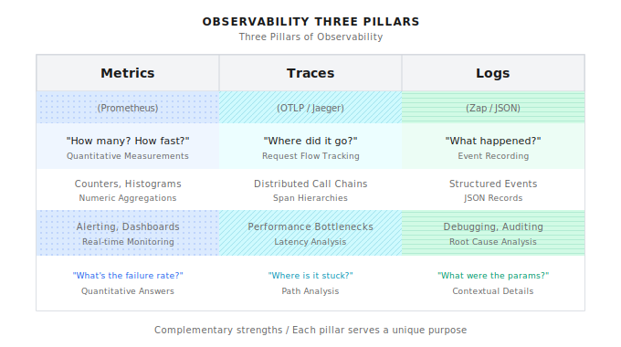

# Chapter 22: Observability

> **Observability makes your system transparent like glass—using metrics to quantify performance, traces to locate bottlenecks, logs to record details.**
> **But over-observing also has costs: metric explosion, storage costs, performance overhead. Choosing what to observe is more important than observing itself.**

---

> **Quick Path** (5 minutes to grasp the core)
>
> 1. Three pillars have different strengths: Metrics for trends, Traces for call chains, Logs for details
> 2. Prometheus metric naming uses `{system}_{module}_{action}_{unit}` format
> 3. OpenTelemetry Trace chains cross-service calls, uses Spans to record each hop
> 4. Structured logs must include trace_id for correlating all three
> 5. Sampling strategy: 10-20% in production, up to 50% for critical paths
>
> **10-minute path**: 22.1-22.3 -> 22.5 -> Shannon Lab

---

Monday morning, user complains: "Agent response is too slow, was fine last week."

You open logs, search for an hour:

- Did LLM API slow down, or is our code slow?
- Are all requests slow, or just certain task types?
- Is token consumption normal or abnormal?
- Which Agent takes the most time? What's the failure rate?

The answer is: **Don't know, can only guess**.

This is why you need observability.

---

## 22.1 Three Pillars of Observability



Each has different strengths, complementing each other:

| Pillar | Strengths | Weaknesses | Typical Question |
|--------|-----------|------------|------------------|
| **Metrics** | Aggregation, trends, alerting | Don't know single request details | "What's the failure rate?" |
| **Traces** | Full chain for single request | High storage cost | "Where is this request stuck?" |
| **Logs** | Detailed context | Hard to aggregate and analyze | "What were the parameters when it errored?" |

---

## 22.2 Prometheus Metrics

### Why Choose Prometheus?

- Time series database, naturally suited for performance metrics
- Pull mode, services don't need to know monitoring system exists
- Powerful query language PromQL
- Mature ecosystem: Grafana, Alertmanager

### Shannon's Metrics System

Shannon defines Pattern-level metrics in `go/orchestrator/internal/workflows/metrics/pattern_metrics.go`:

```go
package metrics

import (
    "github.com/prometheus/client_golang/prometheus"
    "github.com/prometheus/client_golang/prometheus/promauto"
)

var (
    // Pattern execution counter
    PatternExecutions = promauto.NewCounterVec(
        prometheus.CounterOpts{
            Name: "shannon_pattern_executions_total",
            Help: "Total number of pattern executions by type",
        },
        []string{"pattern", "workflow_version"},
    )

    // Pattern execution duration
    PatternDuration = promauto.NewHistogramVec(
        prometheus.HistogramOpts{
            Name:    "shannon_pattern_duration_seconds",
            Help:    "Duration of pattern executions in seconds",
            Buckets: prometheus.DefBuckets,
        },
        []string{"pattern", "workflow_version"},
    )

    // Agent executions per Pattern
    AgentExecutionsByPattern = promauto.NewCounterVec(
        prometheus.CounterOpts{
            Name: "shannon_agents_by_pattern_total",
            Help: "Total number of agents executed by pattern type",
        },
        []string{"pattern", "workflow_version"},
    )

    // Token usage
    TokenUsageByPattern = promauto.NewCounterVec(
        prometheus.CounterOpts{
            Name: "shannon_tokens_by_pattern_total",
            Help: "Total tokens used by pattern type",
        },
        []string{"pattern", "workflow_version"},
    )

    // Reflection improvement count
    ReflectionImprovements = promauto.NewCounterVec(
        prometheus.CounterOpts{
            Name: "shannon_reflection_improvements_total",
            Help: "Number of times reflection improved quality",
        },
        []string{"workflow_version"},
    )
)
```

### Metric Categories

What metrics does a complete Agent system need?

**1. Workflow-Level Metrics**

```go
// Workflow completion count
WorkflowsCompleted = promauto.NewCounterVec(
    prometheus.CounterOpts{
        Name: "shannon_workflows_completed_total",
        Help: "Total number of workflows completed",
    },
    []string{"workflow_type", "mode", "status"},  // research/react/dag, sync/async, success/failed
)

// Workflow latency distribution
WorkflowDuration = promauto.NewHistogramVec(
    prometheus.HistogramOpts{
        Name:    "shannon_workflow_duration_seconds",
        Help:    "Workflow execution duration in seconds",
        Buckets: []float64{1, 5, 10, 30, 60, 120, 300},  // 1s to 5min
    },
    []string{"workflow_type", "mode"},
)
```

**2. Token/Cost Metrics**

```go
// Token consumption per task
TaskTokensUsed = promauto.NewHistogram(
    prometheus.HistogramOpts{
        Name:    "shannon_task_tokens_used",
        Help:    "Number of tokens used per task",
        Buckets: []float64{100, 500, 1000, 5000, 10000, 50000},
    },
)

// Cost (USD)
TaskCostUSD = promauto.NewHistogram(
    prometheus.HistogramOpts{
        Name:    "shannon_task_cost_usd",
        Help:    "Cost in USD per task",
        Buckets: []float64{0.001, 0.01, 0.05, 0.1, 0.5, 1, 5},
    },
)
```

**3. Memory System Metrics**

```go
// Memory fetch operations
MemoryFetches = promauto.NewCounterVec(
    prometheus.CounterOpts{
        Name: "shannon_memory_fetches_total",
        Help: "Total number of memory fetch operations",
    },
    []string{"type", "source", "result"},  // session/semantic, qdrant/redis, hit/miss
)

// Compression ratio
CompressionRatio = promauto.NewHistogram(
    prometheus.HistogramOpts{
        Name:    "shannon_compression_ratio",
        Help:    "Compression ratio (original/compressed)",
        Buckets: []float64{1.5, 2, 3, 5, 10, 20},
    },
)
```

**4. Vector Search Metrics**

```go
// Vector search count
VectorSearches = promauto.NewCounterVec(
    prometheus.CounterOpts{
        Name: "shannon_vector_search_total",
        Help: "Total number of vector searches",
    },
    []string{"collection", "status"},
)

// Vector search latency
VectorSearchLatency = promauto.NewHistogramVec(
    prometheus.HistogramOpts{
        Name:    "shannon_vector_search_latency_seconds",
        Help:    "Vector search latency in seconds",
        Buckets: prometheus.DefBuckets,
    },
    []string{"collection"},
)
```

### Metric Recording

Shannon encapsulates metric recording in `activities/metrics.go`:

```go
// PatternMetricsInput contains pattern execution metrics
type PatternMetricsInput struct {
    Pattern      string
    Version      string
    AgentCount   int
    TokensUsed   int
    Duration     time.Duration
    Improved     bool // For reflection pattern
    WorkflowType string
}

// RecordPatternMetrics records pattern execution metrics
func RecordPatternMetrics(ctx context.Context, input PatternMetricsInput) error {
    // Record pattern execution
    metrics.RecordPatternExecution(input.Pattern, input.Version)

    // Record duration if provided
    if input.Duration > 0 {
        metrics.RecordPatternDuration(input.Pattern, input.Version, input.Duration.Seconds())
    }

    // Record agent executions
    if input.AgentCount > 0 {
        metrics.RecordAgentExecution(input.Pattern, input.Version, input.AgentCount)
    }

    // Record token usage
    if input.TokensUsed > 0 {
        metrics.RecordTokenUsage(input.Pattern, input.Version, input.TokensUsed)
    }

    // Record reflection improvement
    if input.Pattern == "reflection" && input.Improved {
        metrics.RecordReflectionImprovement(input.Version)
    }

    return nil
}
```

### Metrics Server

```go
go func() {
    http.Handle("/metrics", promhttp.Handler())
    port := cfg.MetricsPort(2112)
    addr := ":" + fmt.Sprintf("%d", port)
    logger.Info("Metrics server listening", zap.String("address", addr))
    if err := http.ListenAndServe(addr, nil); err != nil {
        logger.Error("Failed to start metrics server", zap.Error(err))
    }
}()
```

---

## 22.3 OpenTelemetry Tracing

### Why Need Tracing?

Metrics tell you "system is slow overall", but don't tell you "where is this request stuck".

Tracing solves this: records the complete path from when a request enters the system to when it returns.

### Initialization

Shannon initializes tracing in `go/orchestrator/internal/tracing/tracing.go`:

```go
package tracing

import (
    "context"
    "fmt"

    "go.opentelemetry.io/otel"
    "go.opentelemetry.io/otel/exporters/otlp/otlptrace/otlptracegrpc"
    "go.opentelemetry.io/otel/sdk/resource"
    "go.opentelemetry.io/otel/sdk/trace"
    "go.opentelemetry.io/otel/semconv/v1.27.0"
    oteltrace "go.opentelemetry.io/otel/trace"
    "go.uber.org/zap"
)

var tracer oteltrace.Tracer

// Config holds tracing configuration
type Config struct {
    Enabled      bool   `mapstructure:"enabled"`
    ServiceName  string `mapstructure:"service_name"`
    OTLPEndpoint string `mapstructure:"otlp_endpoint"`
}

// Initialize sets up minimal OTLP tracing
func Initialize(cfg Config, logger *zap.Logger) error {
    // Always initialize a tracer handle
    if cfg.ServiceName == "" {
        cfg.ServiceName = "shannon-orchestrator"
    }
    tracer = otel.Tracer(cfg.ServiceName)

    if !cfg.Enabled {
        logger.Info("Tracing disabled")
        return nil
    }

    if cfg.OTLPEndpoint == "" {
        cfg.OTLPEndpoint = "localhost:4317"
    }

    // Create OTLP exporter
    exporter, err := otlptracegrpc.New(
        context.Background(),
        otlptracegrpc.WithEndpoint(cfg.OTLPEndpoint),
        otlptracegrpc.WithInsecure(),
    )
    if err != nil {
        return fmt.Errorf("failed to create OTLP exporter: %w", err)
    }

    // Create resource
    res, _ := resource.New(context.Background(),
        resource.WithAttributes(
            semconv.ServiceName(cfg.ServiceName),
            semconv.ServiceVersion("1.0.0"),
        ),
    )

    // Create tracer provider
    tp := trace.NewTracerProvider(
        trace.WithBatcher(exporter),
        trace.WithResource(res),
    )

    otel.SetTracerProvider(tp)
    tracer = otel.Tracer(cfg.ServiceName)

    logger.Info("Tracing initialized", zap.String("endpoint", cfg.OTLPEndpoint))
    return nil
}
```

### Span Creation

```go
// StartSpan creates a new span with the given name
func StartSpan(ctx context.Context, spanName string) (context.Context, oteltrace.Span) {
    return tracer.Start(ctx, spanName)
}

// StartHTTPSpan creates a span for HTTP operations with method and URL
func StartHTTPSpan(ctx context.Context, method, url string) (context.Context, oteltrace.Span) {
    if tracer == nil {
        tracer = otel.Tracer("shannon-orchestrator")
    }
    spanName := fmt.Sprintf("HTTP %s", method)
    ctx, span := tracer.Start(ctx, spanName)
    span.SetAttributes(
        semconv.HTTPRequestMethodKey.String(method),
        semconv.URLFull(url),
    )
    return ctx, span
}
```

### W3C Traceparent Propagation

Cross-service calls need to propagate Trace Context:

```go
// W3CTraceparent generates a W3C traceparent header value
func W3CTraceparent(ctx context.Context) string {
    span := oteltrace.SpanFromContext(ctx)
    if !span.SpanContext().IsValid() {
        return ""
    }

    sc := span.SpanContext()
    return fmt.Sprintf("00-%s-%s-%02x",
        sc.TraceID().String(),
        sc.SpanID().String(),
        sc.TraceFlags(),
    )
}

// InjectTraceparent adds W3C traceparent header to HTTP request
func InjectTraceparent(ctx context.Context, req *http.Request) {
    if traceparent := W3CTraceparent(ctx); traceparent != "" {
        req.Header.Set("traceparent", traceparent)
    }
}
```

### Cross-Service Tracing Example

```go
func (a *Activities) ExecuteAgent(ctx context.Context, input AgentExecutionInput) (...) {
    // Create HTTP Span
    ctx, span := tracing.StartHTTPSpan(ctx, "POST", llmServiceURL)
    defer span.End()

    // Build request
    req, _ := http.NewRequestWithContext(ctx, "POST", llmServiceURL, body)

    // Inject Trace Context
    tracing.InjectTraceparent(ctx, req)

    // Execute request
    resp, err := client.Do(req)

    // Record result
    if err != nil {
        span.RecordError(err)
        span.SetStatus(codes.Error, err.Error())
    }

    return result, nil
}
```

This way, the entire chain from Orchestrator to LLM Service can be viewed in Jaeger or other tracing systems.

---

## 22.4 Structured Logging

### Zap Logger Configuration

Shannon uses Zap as the logging library:

```go
logger, err := zap.NewProduction()
if err != nil {
    log.Fatalf("Failed to initialize logger: %v", err)
}
defer logger.Sync()
```

### Logging Best Practices

**1. Include Context**

```go
// Good logging: includes sufficient context
logger.Info("Workflow started",
    zap.String("workflow_id", workflowID),
    zap.String("workflow_type", workflowType),
    zap.String("session_id", sessionID),
    zap.Int("subtasks", len(subtasks)),
)

// Bad logging: lacks context
logger.Info("Workflow started")  // Which workflow?
```

**2. Error Logs Should Be Detailed**

```go
logger.Error("Agent execution failed",
    zap.Error(err),
    zap.String("agent_id", agentID),
    zap.String("workflow_id", workflowID),
    zap.Int("attempt", attempt),
    zap.Duration("duration", duration),
)
```

**3. Use Warn for Performance Issues**

```go
logger.Warn("Slow LLM response",
    zap.Duration("duration", duration),
    zap.String("model", modelUsed),
    zap.Int("tokens", tokensUsed),
)
```

**4. Control Debug Log Volume**

```go
// Summarize rather than log each one
logger.Debug("Processing items",
    zap.Int("count", len(items)),
    zap.Duration("total_duration", totalDuration),
)
```

---

## 22.5 Health Checks

### Health Manager

Shannon's health check system is in `go/orchestrator/internal/health/manager.go`:

```go
// Manager implements the HealthManager interface
type Manager struct {
    checkers      map[string]*CheckerState
    lastResults   map[string]CheckResult
    config        *HealthConfiguration
    started       bool
    checkInterval time.Duration
    stopCh        chan struct{}
    logger        *zap.Logger
    mu            sync.RWMutex
}

// CheckerState represents the runtime state of a health checker
type CheckerState struct {
    checker   Checker
    enabled   bool
    interval  time.Duration
    timeout   time.Duration
    critical  bool          // Critical dependency vs non-critical dependency
    lastCheck time.Time
}
```

Key design: distinguish between **Critical** and **Non-Critical** checks.

```go
// Calculate overall health status
func (m *Manager) calculateOverallStatus(components map[string]CheckResult, summary HealthSummary) OverallHealth {
    criticalFailures := 0
    nonCriticalFailures := 0
    degradedComponents := 0

    for _, result := range components {
        if result.Status == StatusUnhealthy {
            if result.Critical {
                criticalFailures++
            } else {
                nonCriticalFailures++
            }
        }
    }

    // Only critical dependency failures are judged as Unhealthy
    if criticalFailures > 0 {
        return OverallHealth{
            Status:  StatusUnhealthy,
            Message: fmt.Sprintf("%d critical component(s) failing", criticalFailures),
            Ready:   false,
            Live:    true,  // Still alive, just not ready
        }
    } else if nonCriticalFailures > 0 {
        return OverallHealth{
            Status:  StatusDegraded,  // Degraded but usable
            Message: fmt.Sprintf("%d non-critical component(s) failing", nonCriticalFailures),
            Ready:   true,
            Live:    true,
        }
    }
    // ...
}
```

### Registering Checkers

```go
// Create health manager
hm := health.NewManager(logger)

// Register various checkers
if dbClient != nil {
    dbChecker := health.NewDatabaseHealthChecker(dbClient.GetDB(), dbClient.Wrapper(), logger)
    _ = hm.RegisterChecker(dbChecker)
}

// Redis check
if rw := orchestratorService.SessionManager().RedisWrapper(); rw != nil {
    rc := health.NewRedisHealthChecker(rw.GetClient(), rw, logger)
    _ = hm.RegisterChecker(rc)
}

// Agent Core check
if agentAddr != "" {
    conn, err := grpc.Dial(agentAddr, grpc.WithTransportCredentials(insecure.NewCredentials()))
    if err == nil {
        client := agentpb.NewAgentServiceClient(conn)
        ac := health.NewAgentCoreHealthChecker(client, conn, logger)
        _ = hm.RegisterChecker(ac)
    }
}

// LLM Service check
lc := health.NewLLMServiceHealthChecker(llmBase, logger)
_ = hm.RegisterChecker(lc)
```

### Health Endpoints

```bash
# Liveness check (for Kubernetes liveness probe)
GET /health/live

# Readiness check (for Kubernetes readiness probe)
GET /health/ready

# Detailed status
GET /health
```

Response example:

```json
{
  "status": "healthy",
  "ready": true,
  "live": true,
  "checks": {
    "database": {"status": "healthy", "critical": true, "latency_ms": 5},
    "redis": {"status": "healthy", "critical": false, "latency_ms": 2},
    "llm_service": {"status": "healthy", "critical": true, "latency_ms": 150},
    "agent_core": {"status": "healthy", "critical": true, "latency_ms": 10}
  }
}
```

---

## 22.6 Alerting Strategy

### Prometheus Alertmanager Rules

```yaml
groups:
  - name: shannon-alerts
    rules:
      # High workflow failure rate
      - alert: HighWorkflowFailureRate
        expr: |
          sum(rate(shannon_workflows_completed_total{status="failed"}[5m]))
          / sum(rate(shannon_workflows_completed_total[5m])) > 0.1
        for: 5m
        labels:
          severity: critical
        annotations:
          summary: "Workflow failure rate > 10%"
          description: "{{ $value | humanizePercentage }} of workflows failed in last 5m"

      # High LLM latency
      - alert: HighLLMLatency
        expr: |
          histogram_quantile(0.95,
            sum(rate(shannon_pattern_duration_seconds_bucket{pattern="react"}[5m])) by (le)
          ) > 30
        for: 10m
        labels:
          severity: warning
        annotations:
          summary: "P95 pattern execution > 30s"

      # Abnormal token consumption
      - alert: AbnormalTokenUsage
        expr: |
          sum(rate(shannon_tokens_by_pattern_total[1h])) > 1000000
        for: 1h
        labels:
          severity: warning
        annotations:
          summary: "Token consumption > 1M/hour"

      # Critical dependency unhealthy
      - alert: CriticalDependencyDown
        expr: |
          shannon_health_check_status{critical="true"} == 0
        for: 2m
        labels:
          severity: critical
        annotations:
          summary: "Critical dependency {{ $labels.component }} is down"
```

### Alert Severity Levels

| Level | Trigger Condition | Response Time | Notification Channel |
|-------|-------------------|---------------|---------------------|
| **Critical** | Critical dependency down, failure rate >10% | Immediate | PagerDuty/Phone |
| **Warning** | Latency increase, non-critical dependency issues | Within 1 hour | Slack |
| **Info** | Resource usage approaching threshold | Next business day | Email |

---

## 22.7 Dashboard Design

### Grafana Panel Layout

**Overview Row**
- Active workflow count (Gauge)
- Requests per minute (Counter rate)
- Success rate (Percentage)
- Total token consumption (Counter)

**Performance Row**
- Workflow latency distribution (Heatmap)
- Pattern execution time (Histogram)
- P50/P95/P99 trends (Graph)

**Resource Row**
- Token consumption trends (Graph)
- Cost trends (Graph)
- Pattern usage distribution (Pie)

**Error Row**
- Error rate time series (Graph)
- Error type distribution (Pie)
- Recent error list (Table)

### PromQL Examples

```promql
# Workflow success rate
sum(rate(shannon_workflows_completed_total{status="success"}[5m]))
/ sum(rate(shannon_workflows_completed_total[5m]))

# P99 latency
histogram_quantile(0.99,
  sum(rate(shannon_workflow_duration_seconds_bucket[5m])) by (le, workflow_type)
)

# Token consumption rate (per minute)
sum(rate(shannon_tokens_by_pattern_total[5m])) * 60

# Pattern usage proportion
sum by (pattern) (rate(shannon_pattern_executions_total[1h]))
/ sum(rate(shannon_pattern_executions_total[1h]))

# Reflection improvement rate
sum(rate(shannon_reflection_improvements_total[1h]))
/ sum(rate(shannon_pattern_executions_total{pattern="reflection"}[1h]))
```

---

## 22.8 Common Pitfalls

### Pitfall 1: Cardinality Explosion

```go
// Wrong: High cardinality labels
AgentExecutions.WithLabelValues(userID, taskID, timestamp)
// userID * taskID * timestamp = infinite combinations, Prometheus will OOM

// Correct: Limited cardinality
AgentExecutions.WithLabelValues(agentType, mode)
// agentType * mode = limited combinations (e.g., 5 * 3 = 15)
```

Rule of thumb: Label combinations per metric should not exceed 1000.

### Pitfall 2: Improper Trace Sampling

```go
// Wrong: Sample all requests (production storage cost too high)
tp := trace.NewTracerProvider(
    trace.WithSampler(trace.AlwaysSample()),
)

// Correct: Probabilistic sampling
tp := trace.NewTracerProvider(
    trace.WithSampler(trace.TraceIDRatioBased(0.1)),  // 10% sampling
)

// Better: Full sampling for errors, proportional for normal requests
tp := trace.NewTracerProvider(
    trace.WithSampler(trace.ParentBased(
        trace.TraceIDRatioBased(0.1),
    )),
)
```

### Pitfall 3: Too Many Logs

```go
// Wrong: Logging in loops
for _, item := range items {
    logger.Info("Processing item", zap.String("id", item.ID))
}
// If items has 10000 entries, that's 10000 log lines

// Correct: Batch summary
logger.Info("Processing items",
    zap.Int("count", len(items)),
    zap.Duration("total_duration", totalDuration),
)
```

### Pitfall 4: Overly Strict Health Checks

```go
// Wrong: Any dependency failure reports unhealthy
if !db.Ping() || !redis.Ping() || !llm.Ping() {
    return unhealthy
}
// Redis temporary flicker, entire service judged unhealthy, Kubernetes restarts

// Correct: Distinguish critical and non-critical
type CheckerState struct {
    Critical bool  // Only Critical=true affects overall health
}
// Redis is cache, doesn't affect core functionality, set as Non-Critical
```

### Pitfall 5: Missing Trace ID Correlation

```go
// Wrong: Log and trace not correlated
logger.Error("Request failed", zap.Error(err))

// Correct: Log includes Trace ID
traceID := oteltrace.SpanFromContext(ctx).SpanContext().TraceID().String()
logger.Error("Request failed",
    zap.Error(err),
    zap.String("trace_id", traceID),
)
// This allows jumping from log to trace details
```

---

## What This Chapter Covered

1. **Three Pillars Division**: Metrics quantify trends, Traces locate single requests, Logs record details
2. **Metrics Design**: Categorize by layer (workflow/Agent/memory/vector), control label cardinality
3. **Trace Propagation**: W3C Traceparent for cross-service propagation
4. **Health Checks**: Distinguish Critical and Non-Critical dependencies
5. **Alert Severity**: Critical for immediate response, Warning within 1 hour, Info next business day

---

## Shannon Lab (10-Minute Quickstart)

This section helps you map this chapter's concepts to Shannon source code in 10 minutes.

### Required Reading (1 file)

- `go/orchestrator/internal/workflows/metrics/pattern_metrics.go`: Pattern-level metric definitions, see metric naming and label design

### Optional Deep Dive (pick 2 based on interest)

- `go/orchestrator/internal/tracing/tracing.go`: Tracing initialization and W3C Traceparent propagation
- `go/orchestrator/internal/health/manager.go`: Health check manager, see Critical/Non-Critical distinction

---

## Exercises

### Exercise 1: Design Metrics System

Design a metrics system for a "code review Agent", including:
- Workflow-level metrics
- Agent-level metrics
- LLM call metrics
- Cost metrics

List metric names, labels, types (Counter/Histogram/Gauge).

### Exercise 2: Alert Rules

Based on Exercise 1's metrics, design 3 alert rules:
- 1 Critical level
- 1 Warning level
- 1 Info level

Write PromQL expressions and trigger conditions.

### Exercise 3 (Advanced): Debugging Scenario

User reports: "Yesterday from 3pm to 4pm, Agent was especially slow."

Describe what you would:
1. Look at first which metrics
2. If metrics show LLM latency increased, what to check next
3. How to find the specific slow requests
4. How to confirm root cause

---

## Further Reading

- [Prometheus Best Practices](https://prometheus.io/docs/practices/naming/): Naming conventions, label design
- [OpenTelemetry Documentation](https://opentelemetry.io/docs/): Sampling strategies, Span design
- [SRE Book - Monitoring](https://sre.google/sre-book/monitoring-distributed-systems/): Google's monitoring experience

---

## Next Chapter Preview

This is the last chapter of Part 7 Production Architecture. We covered three-layer architecture, Temporal workflows, observability—these are the foundations for making Agent systems "run reliably".

From Part 8, we enter **Enterprise Features**.

Chapter 23 covers **Token Budget Control**: how to implement hard cost controls at task/session/tenant three levels, preventing runaway Agents from blowing up your bills.
