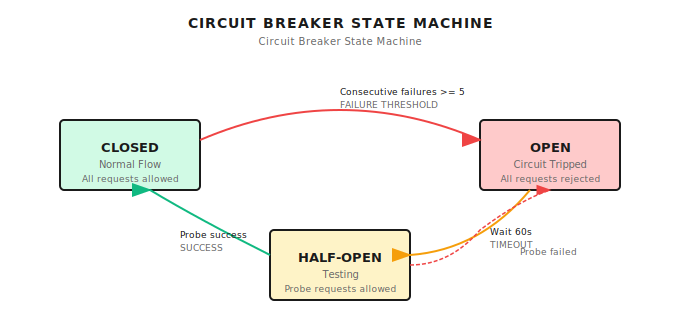
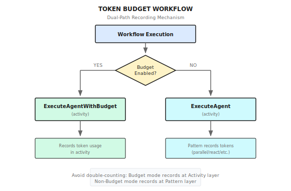

# Chapter 23: Token Budget Control

> **Token budget is your Agent system's cost firewall—it can significantly reduce the probability of cost overruns, but doesn't guarantee precision every time; real protection comes from combining multiple defense layers.**

---

> **Quick Path** (5 minutes to grasp the core)
>
> 1. Three-level budget: Task (single task) -> Session (cumulative session) -> Agent (single Agent)
> 2. Soft/Hard limits: Soft limit warns but continues, hard limit terminates immediately
> 3. Budget allocation strategy: Equal division or complexity-weighted, reserve 10-20% synthesis buffer
> 4. Token estimation has error: Actual vs estimated can differ 20%+, use tiktoken for precision
> 5. Overspend handling: Graceful degradation is better than direct error
>
> **10-minute path**: 23.1-23.3 -> 23.6 -> Shannon Lab

---

You deployed a Research Agent, and a user submitted "deep analysis of global AI market".

Next morning you check the bill—$15. One task, $15.

Turns out the Agent launched 12 sub-Agents in parallel, each calling the LLM 10 times, using the most expensive model. Total 500K tokens, 45 minutes. User expected to spend $0.50, actually spent 30x more.

The first time I encountered this problem, I was really shocked. We had launched a seemingly smart multi-Agent research system, and after one weekend, the bill was higher than the entire month's budget.

What went wrong? **No budget control.**

Agents are diligent, but they don't know what "enough" means. If you don't tell them the budget limit, they'll keep digging, keep thinking, keep calling—until the task is complete or your money runs out.

This chapter solves this problem.

---

## 23.1 Why Do We Need Token Budget?

### Consequences of Runaway

What happens without budget control:

| Problem | Impact | Real Case |
|---------|--------|-----------|
| Single task cost overrun | One task $15, expected $0.50 | Research Agent infinite recursive search |
| Shocking monthly bills | $5000, expected $500 | Batch tasks without limits |
| Unpredictable operating costs | Financial planning difficult | Can't quote prices to customers |
| Poor user experience | Wait 45 minutes vs expected 5 minutes | Users think system is frozen |
| Cascading failure | One task drags down entire system | Shared resources exhausted |

### Three-Level Budget Control

Honestly, relying on a single budget number isn't enough. Like company financial management—you can't just have annual budget, you also need quarterly budget, project budget, even travel budget.

Agent systems are the same, needing multi-level budget control:

| Level | Control Target | Default Value | Purpose |
|-------|----------------|---------------|---------|
| Task | Single task | 10K tokens | Prevent single task runaway |
| Session | Session cumulative | 50K tokens | Control interaction cost |
| Agent | Single Agent execution | Allocated per task | Fair resource distribution |

Why three levels?

- **Task level**: Prevent "one user submits one extreme task and drags down the system"
- **Session level**: Prevent "one user submits many small tasks accumulating to big bill"
- **Agent level**: Prevent "in multi-Agent collaboration, one Agent monopolizes budget"

These three levels work together, like a company's three lines of financial defense: department budget, project budget, personnel budget.

---

## 23.2 Core Data Structures

### TokenBudget

This is the core structure for managing budgets in Shannon. Note this is a typical implementation approach, not the only design.

```go
type TokenBudget struct {
    // Task level budget
    TaskBudget     int `json:"task_budget"`
    TaskTokensUsed int `json:"task_tokens_used"`

    // Session level budget
    SessionBudget     int `json:"session_budget"`
    SessionTokensUsed int `json:"session_tokens_used"`

    // Cost tracking
    EstimatedCostUSD float64 `json:"estimated_cost_usd"`
    ActualCostUSD    float64 `json:"actual_cost_usd"`

    // Execution strategy
    HardLimit        bool    `json:"hard_limit"`        // Terminate immediately on exceed
    WarningThreshold float64 `json:"warning_threshold"` // Warning threshold (0.8 = 80%)
    RequireApproval  bool    `json:"require_approval"`  // Wait for approval on exceed
}
```

Three execution modes, corresponding to three business scenarios:

| Mode | Behavior | Use Case |
|------|----------|----------|
| `HardLimit` | Terminate immediately on exceed | Cost-sensitive batch tasks |
| `WarningThreshold` | Warn at 80% | Interactive tasks, give users reaction time |
| `RequireApproval` | Pause on exceed | High-value tasks, need human decision |

### BudgetTokenUsage

Records detailed information for each token usage. There's a key field `IdempotencyKey` here—I'll explain later why this field can save your life.

```go
type BudgetTokenUsage struct {
    ID             string  `json:"id"`
    UserID         string  `json:"user_id"`
    SessionID      string  `json:"session_id"`
    TaskID         string  `json:"task_id"`
    AgentID        string  `json:"agent_id"`
    Model          string  `json:"model"`
    Provider       string  `json:"provider"`
    InputTokens    int     `json:"input_tokens"`
    OutputTokens   int     `json:"output_tokens"`
    TotalTokens    int     `json:"total_tokens"`
    CostUSD        float64 `json:"cost_usd"`
    IdempotencyKey string  `json:"idempotency_key,omitempty"`
}
```

---

## 23.3 BudgetManager Implementation

### Core Structure

In Shannon, BudgetManager is the hub for budget control. It manages three things: budget checking, backpressure control, circuit breaker protection.

The following code references Shannon's `go/orchestrator/internal/budget/` directory:

```go
type BudgetManager struct {
    db     *sql.DB
    logger *zap.Logger

    // In-memory cache for active sessions
    sessionBudgets map[string]*TokenBudget
    userBudgets    map[string]*TokenBudget
    mu             sync.RWMutex

    // Default budgets
    defaultTaskBudget    int  // 10K tokens
    defaultSessionBudget int  // 50K tokens

    // Backpressure control
    backpressureThreshold float64  // 80% triggers
    maxBackpressureDelay  int      // Max delay ms

    // Rate limiting
    rateLimiters map[string]*rate.Limiter

    // Circuit breakers
    circuitBreakers map[string]*CircuitBreaker

    // Idempotency tracking
    processedUsage map[string]bool
    idempotencyMu  sync.RWMutex
}
```

This structure looks complex, but it's really three layers at its core:

1. **Budget layer**: `sessionBudgets` + `userBudgets`
2. **Protection layer**: `rateLimiters` + `circuitBreakers`
3. **Audit layer**: `processedUsage` (prevents duplicate billing)

### Budget Checking

The core logic for budget checking references Shannon's implementation:

```go
func (bm *BudgetManager) CheckBudget(ctx context.Context,
    userID, sessionID, taskID string, estimatedTokens int) (*BudgetCheckResult, error) {

    // Phase 1: Read lock check existing budget
    bm.mu.RLock()
    userBudget, userExists := bm.userBudgets[userID]
    sessionBudget, sessionExists := bm.sessionBudgets[sessionID]
    bm.mu.RUnlock()

    // Phase 2: Create default budget if not exists (Double-check locking)
    if !userExists || !sessionExists {
        bm.mu.Lock()
        // Double-check to prevent race condition
        if !sessionExists {
            sessionBudget = &TokenBudget{
                TaskBudget:       bm.defaultTaskBudget,
                SessionBudget:    bm.defaultSessionBudget,
                HardLimit:        false,
                WarningThreshold: 0.8,
            }
            bm.sessionBudgets[sessionID] = sessionBudget
        }
        bm.mu.Unlock()
    }

    result := &BudgetCheckResult{
        CanProceed:      true,
        RequireApproval: false,
        Warnings:        []string{},
    }

    // Check Task level budget
    if taskTokensUsed+estimatedTokens > taskBudget {
        if hardLimit {
            result.CanProceed = false
            result.Reason = fmt.Sprintf("Task budget exceeded: %d/%d tokens",
                taskTokensUsed+estimatedTokens, taskBudget)
        } else {
            result.RequireApproval = requireApproval
            result.Warnings = append(result.Warnings, "Task budget will be exceeded")
        }
    }

    return result, nil
}
```

Key design points:

1. **Double-check locking**: Read lock check first, create with write lock if not exists. Standard pattern for high-concurrency scenarios
2. **Warning mechanism**: Fire events when threshold is reached, not just when exceeded
3. **Flexible execution**: Three modes for hard limit/soft limit/require approval

---

## 23.4 Backpressure Control

### What is Backpressure?

This is the most elegant design in budget control, in my opinion.

Traditional approach: Budget exhausted? Reject request. Terrible user experience—one second it works, next second it doesn't.

Backpressure approach: Budget almost exhausted? **Gradually slow down execution speed**. Give users reaction time, and give the system breathing room.

Like a highway—when traffic is heavy, you don't just close the entrance, you control traffic flow speed with traffic lights.

```
Budget Usage Rate -> Delay Strategy
─────────────────────────────────
< 80%     -> No delay (smooth)
80-85%    -> 50ms (slight slowdown)
85-90%    -> 300ms (noticeable slowdown)
90-95%    -> 750ms (major slowdown)
95-100%   -> 1500ms (severe congestion)
>= 100%   -> 5000ms (maximum delay)
```

### Implementation

```go
func (bm *BudgetManager) CheckBudgetWithBackpressure(
    ctx context.Context, userID, sessionID, taskID string, estimatedTokens int,
) (*BackpressureResult, error) {

    // First do regular budget check
    baseResult, err := bm.CheckBudget(ctx, userID, sessionID, taskID, estimatedTokens)
    if err != nil {
        return nil, err
    }

    result := &BackpressureResult{
        BudgetCheckResult: baseResult,
    }

    // Calculate usage rate (including estimated new tokens)
    projectedUsage := sbTokensUsed + estimatedTokens
    usagePercent := float64(projectedUsage) / float64(sbBudgetLimit)

    // Enable backpressure if over threshold
    if usagePercent >= bm.backpressureThreshold {
        result.BackpressureActive = true
        result.BackpressureDelay = bm.calculateBackpressureDelay(usagePercent)
    }

    result.BudgetPressure = bm.calculatePressureLevel(usagePercent)
    return result, nil
}

func (bm *BudgetManager) calculateBackpressureDelay(usagePercent float64) int {
    if usagePercent >= 1.0 {
        return bm.maxBackpressureDelay
    } else if usagePercent >= 0.95 {
        return 1500
    } else if usagePercent >= 0.9 {
        return 750
    } else if usagePercent >= 0.85 {
        return 300
    } else if usagePercent >= 0.8 {
        return 50
    }
    return 0
}
```

### Applying Backpressure at Workflow Layer

Here's a key detail: **The delay must be done at the Workflow layer, not in the Activity layer**.

```go
func BudgetPreflight(ctx workflow.Context, input TaskInput, estimatedTokens int) (*budget.BackpressureResult, error) {
    actx := workflow.WithActivityOptions(ctx, workflow.ActivityOptions{
        StartToCloseTimeout: 30 * time.Second,
    })

    var res budget.BackpressureResult
    err := workflow.ExecuteActivity(actx,
        constants.CheckTokenBudgetWithBackpressureActivity,
        activities.BudgetCheckInput{
            UserID:          input.UserID,
            SessionID:       input.SessionID,
            TaskID:          workflow.GetInfo(ctx).WorkflowExecution.ID,
            EstimatedTokens: estimatedTokens,
        }).Get(ctx, &res)

    if err != nil {
        return nil, err
    }

    // Key: Sleep at Workflow layer, not Activity layer!
    if res.BackpressureActive && res.BackpressureDelay > 0 {
        logger.Info("Applying budget backpressure delay",
            "delay_ms", res.BackpressureDelay,
            "pressure_level", res.BudgetPressure,
        )
        if err := workflow.Sleep(ctx, time.Duration(res.BackpressureDelay)*time.Millisecond); err != nil {
            return nil, err
        }
    }

    return &res, nil
}
```

Why must you Sleep at the Workflow layer?

| Where to Sleep | Consequence |
|----------------|-------------|
| Activity layer `time.Sleep` | Blocks Worker thread, limited Workers, quickly exhausted |
| Workflow layer `workflow.Sleep` | Deterministic, supports Temporal replay, can be cancelled |

This is one of the most common pitfalls I've seen. Many people's first instinct is to Sleep in the Activity, and then Workers all get blocked and the system crashes.

---

## 23.5 Circuit Breaker Pattern

### Design

Backpressure is "slow down", circuit breaker is "emergency brake".

When a user repeatedly triggers budget overruns, it means either the user is abusing the system, or there's a bug. Either way, continuing to let requests through isn't a good idea.

```go
type CircuitBreaker struct {
    failureCount    int32
    lastFailureTime time.Time
    state           string // "closed", "open", "half-open"
    config          CircuitBreakerConfig
    successCount    int32
    mu              sync.RWMutex
}

type CircuitBreakerConfig struct {
    FailureThreshold int           // Failures to trigger circuit break
    ResetTimeout     time.Duration // How long until recovery attempt
    HalfOpenRequests int           // Test requests allowed in half-open state
}
```

### State Transitions



This pattern comes from classic microservices design. Netflix's Hystrix made it popular, and now it's practically standard for distributed systems.

### Implementation

```go
func (bm *BudgetManager) CheckBudgetWithCircuitBreaker(
    ctx context.Context, userID, sessionID, taskID string, estimatedTokens int,
) (*BackpressureResult, error) {

    // First check circuit breaker state
    state := bm.GetCircuitState(userID)
    if state == "open" {
        return &BackpressureResult{
            BudgetCheckResult: &BudgetCheckResult{
                CanProceed: false,
                Reason:     "Circuit breaker is open due to repeated failures",
            },
            CircuitBreakerOpen: true,
        }, nil
    }

    // In half-open state, only allow limited requests
    if state == "half-open" {
        cb := bm.circuitBreakers[userID]
        if int(atomic.LoadInt32(&cb.successCount)) >= cb.config.HalfOpenRequests {
            return &BackpressureResult{
                BudgetCheckResult: &BudgetCheckResult{
                    CanProceed: false,
                    Reason:     "Circuit breaker in half-open state, test quota exceeded",
                },
                CircuitBreakerOpen: true,
            }, nil
        }
    }

    return bm.CheckBudgetWithBackpressure(ctx, userID, sessionID, taskID, estimatedTokens)
}
```

---

## 23.6 Cost Calculation

### Separating Input/Output Billing

This is a big pitfall I've stepped into.

At first, we used "total tokens x unit price" to calculate cost. Then we found the bill was 30% different from actual.

The reason: Input and output prices differ significantly for different models.

| Model | Input/1K | Output/1K | Ratio |
|-------|----------|-----------|-------|
| GPT-4 | $0.03 | $0.06 | 1:2 |
| Claude Sonnet | $0.003 | $0.015 | 1:5 |

Output tokens are typically 2-5x more expensive than input. If you combine billing, you either underestimate costs (using input price) or overestimate (using output price).

> LLM pricing changes frequently, above is for illustration only. Check each provider's official pricing page for current prices.

### Pricing Configuration

Shannon uses YAML configuration to manage pricing, so price changes only require updating config:

```yaml
# config/models.yaml
pricing:
  defaults:
    combined_per_1k: 0.005

  models:
    openai:
      gpt-4o:
        input_per_1k: 0.0025
        output_per_1k: 0.010
      gpt-4o-mini:
        input_per_1k: 0.00015
        output_per_1k: 0.0006
    anthropic:
      claude-sonnet-4:
        input_per_1k: 0.003
        output_per_1k: 0.015
```

### Calculation Logic

Shannon's pricing calculation references `go/orchestrator/internal/pricing/pricing.go`:

```go
func CostForSplit(model string, inputTokens, outputTokens int) float64 {
    if inputTokens < 0 {
        inputTokens = 0
    }
    if outputTokens < 0 {
        outputTokens = 0
    }

    cfg := get()
    for _, models := range cfg.Pricing.Models {
        if m, ok := models[model]; ok {
            in := m.InputPer1K
            out := m.OutputPer1K
            if in > 0 && out > 0 {
                return (float64(inputTokens)/1000.0)*in +
                       (float64(outputTokens)/1000.0)*out
            }
        }
    }
    // Fall back to default pricing
    return float64(inputTokens+outputTokens) * DefaultPerToken()
}
```

---

## 23.7 Idempotency: Preventing Retry Duplicate Billing

This is the most easily overlooked but most fatal problem in token budgets, in my opinion.

### Problem Scenario

One of Temporal's core features is automatic retry. Activity failed? Auto retry. Network glitch? Auto retry.

But if your "record token usage" Activity executed successfully, but the network dropped when returning the result, Temporal thinks it failed, then retries.

Result: Same LLM call recorded twice. Bill doubled.

### Solution

Shannon uses IdempotencyKey to prevent duplicate billing, referencing `go/orchestrator/internal/activities/budget.go`:

```go
func (b *BudgetActivities) RecordTokenUsage(ctx context.Context, input TokenUsageInput) error {
    // Get Activity info to generate idempotency key
    info := activity.GetInfo(ctx)

    // Generate idempotency key: WorkflowID + ActivityID + Attempt number
    // This ensures retries of the same Activity generate the same Key
    idempotencyKey := fmt.Sprintf("%s-%s-%d",
        info.WorkflowExecution.ID, info.ActivityID, info.Attempt)

    usage := &budget.BudgetTokenUsage{
        UserID:         input.UserID,
        // ... other fields ...
        IdempotencyKey: idempotencyKey,
    }

    err := b.budgetManager.RecordUsage(ctx, usage)
    // RecordUsage internally checks if IdempotencyKey already exists, skips if so
    return err
}
```

Key points:

- `IdempotencyKey = WorkflowID + ActivityID + Attempt`
- Temporal retries generate the same Key
- `RecordUsage` skips when detecting duplicate Key

---

## 23.8 Budget-Aware Agent Execution

Stringing together all the components we discussed, let's see the complete budget-aware execution flow.

The following references Shannon's `ExecuteAgentWithBudget` function in `go/orchestrator/internal/activities/budget.go`:

```go
func (b *BudgetActivities) ExecuteAgentWithBudget(ctx context.Context,
    input BudgetedAgentInput) (*AgentExecutionResult, error) {

    // 1. Check budget before execution
    budgetCheck, err := b.budgetManager.CheckBudget(
        ctx,
        input.UserID,
        input.AgentInput.SessionID,
        input.TaskID,
        input.MaxTokens,
    )
    if err != nil {
        return nil, fmt.Errorf("budget check failed: %w", err)
    }

    if !budgetCheck.CanProceed {
        return &AgentExecutionResult{
            AgentID: input.AgentInput.AgentID,
            Success: false,
            Error:   fmt.Sprintf("Budget exceeded: %s", budgetCheck.Reason),
        }, nil
    }

    // 2. Execute Agent
    input.AgentInput.Context["max_tokens"] = input.MaxTokens
    input.AgentInput.Context["model_tier"] = input.ModelTier
    result, err := executeAgentCore(ctx, input.AgentInput, logger)
    if err != nil {
        return nil, fmt.Errorf("agent execution failed: %w", err)
    }

    // 3. Generate idempotency key to prevent retry duplicate billing
    info := activity.GetInfo(ctx)
    idempotencyKey := fmt.Sprintf("%s-%s-%d",
        info.WorkflowExecution.ID, info.ActivityID, info.Attempt)

    // 4. Record actual usage
    err = b.budgetManager.RecordUsage(ctx, &budget.BudgetTokenUsage{
        UserID:         input.UserID,
        SessionID:      input.AgentInput.SessionID,
        TaskID:         input.TaskID,
        AgentID:        input.AgentInput.AgentID,
        Model:          result.ModelUsed,
        Provider:       result.Provider,
        InputTokens:    result.InputTokens,
        OutputTokens:   result.OutputTokens,
        IdempotencyKey: idempotencyKey,
    })

    return &result, nil
}
```

This flow covers the complete lifecycle of budget control: Check -> Execute -> Record.

---

## 23.9 Dual-Path Recording: Avoiding Duplicates

An important design in Shannon is "dual-path recording"—deciding where to record token usage based on whether budget is enabled.

According to Shannon's `docs/token-budget-tracking.md` document:



Why this design? Because if you don't differentiate, **duplicate recording will occur**:

| Scenario | Activity Records | Pattern Records | Result |
|----------|-----------------|-----------------|--------|
| Budget Enabled | Yes | Yes | Duplicate! |
| Budget Enabled | Yes | No (Guard) | Correct |
| Budget Disabled | No | Yes | Correct |

Shannon's solution is to add a Guard at the Pattern layer:

```go
// Pattern layer recording logic
if budgetPerAgent <= 0 {  // Only record when budget is disabled
    _ = workflow.ExecuteActivity(ctx, constants.RecordTokenUsageActivity, ...)
}
```

---

## 23.10 Configuration and Monitoring

### Configuration

```yaml
# config/shannon.yaml
session:
  token_budget_per_task: 10000
  token_budget_per_session: 50000

budget:
  backpressure:
    threshold: 0.8
    max_delay_ms: 5000

  circuit_breaker:
    failure_threshold: 5
    reset_timeout: "5m"
    half_open_requests: 3
```

### Monitoring Metrics

| Metric | Type | Description |
|--------|------|-------------|
| `budget_tokens_used` | Counter | Tokens used |
| `budget_cost_usd` | Counter | Cumulative cost |
| `budget_exceeded_total` | Counter | Exceeded count |
| `backpressure_delay_seconds` | Histogram | Backpressure delay distribution |
| `circuit_breaker_state` | Gauge | Circuit breaker state (0=closed, 1=half-open, 2=open) |

### Alert Rules

```yaml
- alert: BudgetExceededRate
  expr: rate(budget_exceeded_total[5m]) > 0.1
  for: 5m
  labels:
    severity: warning
  annotations:
    summary: "High budget exceeded rate"
    description: "More than 10% of requests are exceeding budget"

- alert: CircuitBreakerOpen
  expr: circuit_breaker_state == 2  # 2 = open
  for: 1m
  labels:
    severity: critical
  annotations:
    summary: "Circuit breaker open for user {{ $labels.user_id }}"
```

---

## 23.11 Common Pitfalls

### Pitfall 1: Forgetting Idempotency

```go
// Wrong: Records on every retry
err = bm.RecordUsage(ctx, &budget.BudgetTokenUsage{
    TaskID: taskID,
    // No IdempotencyKey!
})

// Correct: Use Activity info to generate idempotency key
info := activity.GetInfo(ctx)
idempotencyKey := fmt.Sprintf("%s-%s-%d",
    info.WorkflowExecution.ID, info.ActivityID, info.Attempt)
```

I've seen this pitfall way too many times. A system runs fine for three months, then one day network glitches are frequent, and suddenly the bill doubles.

### Pitfall 2: Activity Layer Sleep

```go
// Wrong: Blocks Worker thread
func (b *BudgetActivities) CheckWithBackpressure(...) {
    if delay > 0 {
        time.Sleep(time.Duration(delay) * time.Millisecond) // Blocking!
    }
}

// Correct: Use workflow.Sleep at Workflow layer
if res.BackpressureDelay > 0 {
    workflow.Sleep(ctx, time.Duration(res.BackpressureDelay)*time.Millisecond)
}
```

Worker threads are limited. If you Sleep in Activities, each delayed request occupies a Worker thread. When budget pressure is high, that's exactly when backpressure triggers frequently, exactly when Workers are most likely to be exhausted.

### Pitfall 3: Concurrent Budget Updates

```go
// Wrong: Read-modify-write has race condition
sessionBudget := bm.sessionBudgets[sessionID]
sessionBudget.TaskTokensUsed += tokens  // Unsafe!

// Correct: Update with lock held
bm.mu.Lock()
if sessionBudget, ok := bm.sessionBudgets[sessionID]; ok {
    sessionBudget.TaskTokensUsed += tokens
}
bm.mu.Unlock()
```

### Pitfall 4: Only Counting Total, Not Ratio

```go
// Wrong: Only looking at how much is used
if sessionBudget.TaskTokensUsed > 10000 {
    // Over budget
}

// Correct: Calculate ratio, support dynamic budgets
usagePercent := float64(sessionBudget.TaskTokensUsed) / float64(sessionBudget.TaskBudget)
if usagePercent >= 0.8 {
    // Approaching budget
}
```

The problem with absolute values: Different users may have different budgets. VIP users 100K tokens, regular users 10K tokens. If you judge by absolute value, VIP users get limited at 10K.

---

## 23.12 Framework Comparison

Token budget control isn't unique to Shannon. How do other frameworks do it?

| Framework | Budget Control Method | Backpressure | Circuit Breaker | Idempotency |
|-----------|----------------------|--------------|-----------------|-------------|
| **Shannon** | Three-level budget | Built-in | Built-in | IdempotencyKey |
| **LangChain** | Callback manual implementation | None | None | None |
| **LangGraph** | Can implement via State | Write yourself | Write yourself | Write yourself |
| **CrewAI** | max_rpm/max_tokens | Limited | None | None |
| **AutoGen** | No built-in | None | None | None |

Honestly, this is something Shannon does pretty well. Most frameworks treat budget control as "something users solve themselves", but in production environments, this is exactly where things are most likely to go wrong.

---

## What This Chapter Covered

1. **Three-level budget**: Task/Session/Agent layered control, like a company's three lines of financial defense
2. **Backpressure control**: Gradually slow down when approaching limit instead of direct rejection, give users and system breathing room
3. **Circuit breaker**: Temporarily reject on continuous overruns, prevent cascading failures
4. **Idempotency**: IdempotencyKey prevents Temporal retry causing duplicate billing
5. **Separate billing**: Input/output tokens priced separately, more accurate estimation

---

## Shannon Lab (10-Minute Quickstart)

This section helps you map this chapter's concepts to Shannon source code in 10 minutes.

### Required Reading (1 file)

- `go/orchestrator/internal/activities/budget.go`: See the `ExecuteAgentWithBudget` function's budget check -> execute -> record flow, understand `idempotencyKey` generation logic and why not to Sleep in Activity layer

### Optional Deep Dive (pick 2 based on interest)

- `docs/token-budget-tracking.md`: Understand the dual-path recording design thinking, search "Guard Pattern" to see how various Workflow Patterns avoid duplicate recording
- `go/orchestrator/internal/pricing/pricing.go`: See the `CostForSplit` function, understand why input/output billing needs to be separated and fallback logic

---

## Exercises

### Exercise 1: Design User Notification for Budget Overrun

User task is about to exceed budget (80%), you need to design a notification message. Requirements:
- Current usage and budget limit
- What can/cannot still be done
- Actions user can take

### Exercise 2: Source Code Understanding

Read Shannon's `go/orchestrator/internal/activities/budget.go`:
1. Find the `ExecuteAgentWithBudget` function, explain why it records usage after execution (rather than before)
2. If Agent execution fails, will token usage be recorded? Is this reasonable?

### Exercise 3 (Advanced): Design "Dynamic Budget Adjustment" Feature

Scenario: VIP users have loose budget at month start, tight budget at month end. Design a "dynamic budget" mechanism:
- Write out core data structures
- Describe trigger conditions for budget adjustment
- Consider: What if a running task suddenly gets its "budget lowered"?

---

## Further Reading

- **Temporal Retry Mechanism**: [Temporal Retry Policies](https://docs.temporal.io/retry-policies) - Understanding why idempotency is needed
- **Circuit Breaker Pattern**: [Microservices Circuit Breaker Pattern](https://martinfowler.com/bliki/CircuitBreaker.html) - Martin Fowler's classic article
- **LLM Provider Pricing Pages**: Prices change frequently, recommend regularly checking and updating configuration

---

## Next Chapter Preview

Token budget solved the "how much to spend" problem. But there's another question: **who can do what?**

What tools can an Agent call? What data can it access? What operations can it execute? These aren't budget problems, they're permission problems.

Next chapter we'll discuss **OPA Policy Governance**—using Open Policy Agent to implement fine-grained access control.

Imagine: User says "help me delete all test data". The Agent should first check: Does this user have delete permission? Does this operation require approval? Is this time period allowed for execution?

These questions, OPA answers.

See you in the next chapter.
