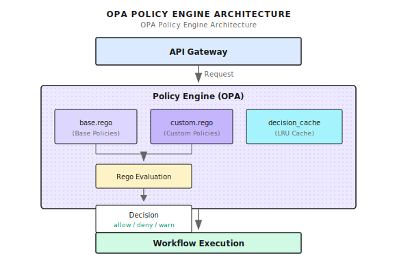

# Chapter 24: Policy Governance (OPA)

> **OPA takes Agent system access control from hardcoded to declarative—policy updates don't require redeploying code, but it's not omnipotent; real security comes from defense in depth.**

---

> **Quick Path** (5 minutes to grasp the core)
>
> 1. OPA extracts security rules from code, change policies without redeployment
> 2. Default deny + deny takes priority: Unmatched requests are denied, deny rules have highest priority
> 3. Canary release: First dry-run to observe, then gradually enforce by percentage
> 4. Cache decision results, note cache key must include all fields affecting the decision
> 5. FailOpen is more suitable for production than FailClosed (combined with alerting)
>
> **10-minute path**: 24.1-24.3 -> 24.6 -> Shannon Lab

---

Your Agent system needs a new rule: "Block queries containing 'password'."

How to do it? Modify code, add an `if strings.Contains(req.Query, "password")`, then deploy.

A week later, security team wants ten more rules. Modify code again, deploy again.

A month later, code is full of if-else everywhere, no one can explain "why this request was rejected". Every rule change needs the full CI/CD process, urgent security fixes take 2 hours to go live.

The most extreme case I've seen: A system had 200+ security checkpoints scattered across 30+ files. A new engineer wanted to add one rule, took three days just to find all the places that needed changing.

**This is the predicament of hardcoded policies.**

---

## 24.1 Why Do We Need a Policy Engine?

### The Predicament of Hardcoding

Comparing hardcoded vs OPA declarative policies:

```go
// ========== Traditional Approach: Hardcoded Security Checks ==========
func SubmitTask(ctx context.Context, req *TaskRequest) error {
    if strings.Contains(req.Query, "password") { return errors.New("forbidden") }
    if req.TokenBudget > 10000 { return errors.New("budget too high") }
    if req.UserID == "blocked_user" { return errors.New("user blocked") }
    // More if-else... 50 lines later you've forgotten why you're checking
}
```

```rego
# ========== OPA Approach: Declarative Policy File ==========
package shannon.task

deny["dangerous pattern"] { contains(lower(input.query), "password") }
deny["budget too high"]   { input.token_budget > 10000 }
deny["user blocked"]      { blocked_users[input.user_id] }
```

| Comparison | Hardcoded | OPA |
|------------|-----------|-----|
| Policy Changes | Modify code -> Test -> Deploy | Modify .rego -> Hot reload |
| Rule Location | Scattered everywhere | Centralized in policies/ |
| Audit Trail | None | Every decision logged |
| Release Method | Full rollout | Supports canary/Dry-run |
| Version Management | None | Hash versioned |

---

## 24.2 OPA Integration Architecture

### Policy Execution Flow

In Shannon, OPA serves as an independent policy engine, evaluating requests before they enter the Workflow:



### Core Components

| Component | Responsibility |
|-----------|----------------|
| OPAEngine | Main entry for policy loading, compilation, evaluation |
| PolicyInput | Context data for evaluation (user, query, budget, etc.) |
| Decision | Evaluation result (allow/deny + reason) |
| base.rego | Base security policies (default deny, deny priority) |

---

## 24.3 OPAEngine Implementation

### Engine Interface

Shannon's OPA Engine design references `go/orchestrator/internal/policy/` directory:

```go
type Engine interface {
    Evaluate(ctx context.Context, input *PolicyInput) (*Decision, error)
    LoadPolicies() error
    IsEnabled() bool
    Environment() string
    Mode() Mode
}
```

Behind the simple interface are several key design decisions:

1. **Pre-compilation**: Policies compiled at startup, directly executed during evaluation
2. **Caching**: Decision results for same input are cached
3. **Mode switching**: Supports off/dry-run/enforce three modes

### Core Data Structures

```go
// ========== PolicyInput: Evaluation Context ==========
type PolicyInput struct {
    SessionID   string    `json:"session_id"`        // Session identifier
    UserID      string    `json:"user_id"`           // User identifier
    AgentID     string    `json:"agent_id"`          // Agent identifier
    Query       string    `json:"query"`             // Request content
    Mode        string    `json:"mode"`              // simple/standard/complex
    Environment string    `json:"environment"`       // dev/staging/prod (key: differentiate environment strictness)
    TokenBudget int       `json:"token_budget"`      // Budget limit
    Timestamp   time.Time `json:"timestamp"`
}

// ========== Decision: Evaluation Result ==========
type Decision struct {
    Allow           bool              `json:"allow"`            // Whether allowed
    Reason          string            `json:"reason"`           // Decision reason
    RequireApproval bool              `json:"require_approval"` // Needs human confirmation (allow but confirm)
    PolicyVersion   string            `json:"policy_version"`   // Policy version hash (for audit)
    AuditTags       map[string]string `json:"audit_tags"`       // Audit tags
}
```

The `Environment` field lets you write policies like "loose in development, strict in production". `RequireApproval` supports "allowed but needs human confirmation" scenarios.

---

## 24.4 Policy Loading and Compilation

The following code shows the core policy loading flow, referencing Shannon's implementation:

```go
func (e *OPAEngine) LoadPolicies() error {
    if !e.config.Enabled {
        return nil
    }

    policies := make(map[string]string)

    // Recursively load all .rego files
    err := filepath.Walk(e.config.Path, func(path string, info os.FileInfo, err error) error {
        if err != nil {
            return err
        }

        if !info.IsDir() && strings.HasSuffix(info.Name(), ".rego") {
            content, err := os.ReadFile(path)
            if err != nil {
                return fmt.Errorf("failed to read policy file %s: %w", path, err)
            }

            relPath, _ := filepath.Rel(e.config.Path, path)
            moduleName := strings.TrimSuffix(relPath, ".rego")
            policies[moduleName] = string(content)

            e.logger.Debug("Loaded policy file",
                zap.String("path", path),
                zap.String("module", moduleName),
            )
        }
        return nil
    })

    if err != nil {
        return fmt.Errorf("failed to walk policy directory: %w", err)
    }

    // Pre-compile policies
    regoOptions := []func(*rego.Rego){
        rego.Query("data.shannon.task.decision"),
    }

    for moduleName, content := range policies {
        regoOptions = append(regoOptions, rego.Module(moduleName, content))
    }

    regoBuilder := rego.New(regoOptions...)
    compiled, err := regoBuilder.PrepareForEval(context.Background())
    if err != nil {
        return fmt.Errorf("failed to compile policies: %w", err)
    }

    e.compiled = &compiled

    // Record policy version for audit
    versionHash := e.calculatePolicyVersion(policies)
    RecordPolicyVersion(e.config.Path, versionHash, loadTimestamp)

    return nil
}
```

Key design points:

1. **Recursive loading**: Supports subdirectories under policies/, convenient for organizing policies by domain
2. **Pre-compilation**: Uses `PrepareForEval` instead of compiling on every evaluation, 10x+ performance improvement
3. **Version tracking**: Calculates hash of policy content, convenient for auditing "which version of policy was used for this decision"

---

## 24.5 Policy Evaluation Flow

The evaluation flow is the core of the OPA Engine, below shows the complete evaluation logic:

```go
func (e *OPAEngine) Evaluate(ctx context.Context, input *PolicyInput) (*Decision, error) {
    startTime := time.Now()

    defaultDecision := &Decision{
        Allow:  !e.config.FailClosed,
        Reason: "policy engine disabled or no policies loaded",
    }

    if !e.enabled || e.compiled == nil {
        return defaultDecision, nil
    }

    // Check cache first
    if d, ok := e.cache.Get(input); ok {
        RecordCacheHit(string(e.config.Mode))
        return d, nil
    }

    RecordCacheMiss(string(e.config.Mode))

    // Convert input to map
    inputMap, err := e.inputToMap(input)
    if err != nil {
        if e.config.FailClosed {
            return &Decision{Allow: false, Reason: "input conversion failed"}, err
        }
        return defaultDecision, nil
    }

    // Evaluate policy
    results, err := e.compiled.Eval(ctx, rego.EvalInput(inputMap))
    if err != nil {
        RecordError("policy_evaluation", string(e.config.Mode))
        if e.config.FailClosed {
            return &Decision{Allow: false, Reason: "policy evaluation error"}, err
        }
        return defaultDecision, nil
    }

    // Parse results
    decision := e.parseResults(results, input)

    // Apply canary mode
    effectiveMode := e.determineEffectiveMode(input)
    decision = e.applyModeToDecision(decision, effectiveMode, input)

    // Record metrics and audit log
    duration := time.Since(startTime)
    e.recordComprehensiveMetrics(input, decision, effectiveMode, duration)

    // Write to cache
    e.cache.Set(input, decision)
    return decision, nil
}
```

There's a key concept here: **FailClosed vs FailOpen**.

| Mode | Behavior When OPA Errors | Use Case |
|------|--------------------------|----------|
| FailClosed | Reject request | Security-sensitive systems |
| FailOpen | Allow request | Availability-priority systems |

For production I recommend FailOpen + alerting, rather than FailClosed. The reason: Policy engine being down causing entire system unavailability is worse than letting through a few requests. Of course, this depends on your business scenario.

### Decision Cache

Decision results for same input should be cached. Key is designing the cache key well:

```go
type decisionCache struct {
    cap    int
    ttl    time.Duration
    mu     sync.Mutex
    list   *list.List
    m      map[string]*list.Element
    hits   int64
    misses int64
}

func (c *decisionCache) makeKey(input *PolicyInput) string {
    h := fnv.New64a()
    h.Write([]byte(strings.ToLower(input.Query)))
    qh := h.Sum64()
    comp := fmt.Sprintf("%.2f", input.ComplexityScore)
    return fmt.Sprintf("%s|%s|%s|%s|%d|%s|%x",
        input.Environment, input.Mode, input.UserID,
        input.AgentID, input.TokenBudget, comp, qh,
    )
}
```

Cache key design considerations:

- **Include environment**: Same request in dev and prod may have different decisions
- **Hash the query**: Avoid key being too long
- **Keep 2 decimal places for complexity**: Reduce key changes due to floating point precision

---

## 24.6 Writing Rego Policies

Shannon's base policy references `config/opa/policies/base.rego`. Core design principle: **default deny, deny takes priority**.

### Basic Structure and Environment Differentiation

```rego
package shannon.task
import future.keywords.in

# ========== Default Deny (Most Important) ==========
default decision := {"allow": false, "reason": "default deny - no matching rule"}

# Deny rules take priority over all allow rules
decision := {"allow": false, "reason": reason} { some reason; deny[reason] }

# ========== Environment Differentiation ==========
# Development environment: Loose (but still has budget limits)
decision := {"allow": true, "reason": "dev environment"} {
    input.environment == "dev"
    input.token_budget <= 10000
}
# Production environment: Strict (requires user whitelist + no suspicious queries)
decision := {"allow": true, "reason": "authorized user"} {
    input.environment == "prod"
    allowed_users[input.user_id]
    input.token_budget <= 5000
    not suspicious_query
}
```

Why default deny? Default allow means you must foresee all dangerous situations; default deny only needs to list known safe situations, unknown situations are automatically denied.

### User Management and Query Pattern Matching

```rego
# ========== User Whitelist/Blacklist ==========
allowed_users := {"admin", "orchestrator", "shannon_system", "api_user"}
privileged_users := {"admin", "shannon_system", "security_admin"}
blocked_users := {"blocked_user", "suspended_account"}

# ========== Query Pattern Levels ==========
safe_patterns := {"what is", "how to", "explain", "summarize"}  # Safe
suspicious_patterns := {"delete", "hack", "bypass", "admin", "sudo"}  # Suspicious
dangerous_patterns := {"rm -rf", "drop table", "/etc/passwd", "api key"}  # Dangerous

suspicious_query { count([p | suspicious_patterns[p]; contains(lower(input.query), p)]) > 0 }
dangerous_query { count([p | dangerous_patterns[p]; contains(lower(input.query), p)]) > 0 }
```

### Deny Rules (Highest Priority)

```rego
# Dangerous query patterns
deny[sprintf("dangerous: %s", [p])] { dangerous_patterns[p]; contains(lower(input.query), p) }
# Exceeds budget limit
deny[sprintf("budget %d exceeds max %d", [input.token_budget, 50000])] { input.token_budget > 50000 }
# Blocked user
deny[sprintf("user %s blocked", [input.user_id])] { blocked_users[input.user_id] }
# Unauthorized user in production
deny["unauthorized user in prod"] {
    input.environment == "prod"; input.user_id != ""
    not allowed_users[input.user_id]; not privileged_users[input.user_id]
}
```

### Budget Limits

```rego
max_budgets := {"simple": 1000, "standard": 5000, "complex": 15000}
system_limits := {"max_tokens": 50000, "max_concurrent_requests": 20}

decision := {"allow": false, "reason": sprintf("budget %d exceeds max %d for %s",
    [input.token_budget, max_budgets[input.mode], input.mode])} {
    max_budgets[input.mode] < input.token_budget
}
```

---

## 24.7 Execution Modes and Canary Release

One of OPA's most valuable features: Safely releasing new policies.

| Mode | Policy Evaluation | Actual Blocking | Log Recording | Purpose |
|------|-------------------|-----------------|---------------|---------|
| off | No | No | No | Maintenance mode |
| dry-run | Yes | No | Yes | Testing new policies |
| enforce | Yes | Yes | Yes | Official execution |

### Mode and Canary Configuration

```go
// ========== Execution Modes ==========
type Mode string
const (
    ModeOff     Mode = "off"      // Policy disabled
    ModeDryRun  Mode = "dry-run"  // Log only, don't execute
    ModeEnforce Mode = "enforce"  // Enforce
)

// ========== Canary Configuration ==========
type CanaryConfig struct {
    Enabled           bool     `yaml:"enabled"`
    EnforcePercentage int      `yaml:"enforce_percentage"` // 0-100%
    EnforceUsers      []string `yaml:"enforce_users"`      // Whitelist users
    DryRunUsers       []string `yaml:"dry_run_users"`      // Force dry-run users
}

// ========== Determine Effective Mode (Priority: Emergency Switch > Explicit User > Percentage) ==========
func (e *OPAEngine) determineEffectiveMode(input *PolicyInput) Mode {
    if e.config.EmergencyKillSwitch { return ModeDryRun }  // Emergency switch overrides everything
    if !e.config.Canary.Enabled { return e.config.Mode }
    // Explicit dry-run/enforce user check
    for _, u := range e.config.Canary.DryRunUsers { if input.UserID == u { return ModeDryRun } }
    for _, u := range e.config.Canary.EnforceUsers { if input.UserID == u { return ModeEnforce } }
    // Percentage-based canary
    if e.config.Canary.EnforcePercentage > 0 {
        if int(hash(input.UserID) % 100) < e.config.Canary.EnforcePercentage { return ModeEnforce }
    }
    return ModeDryRun
}

// ========== Dry-Run Handling: Evaluate But Don't Block ==========
func (e *OPAEngine) applyModeToDecision(decision *Decision, mode Mode) *Decision {
    if mode == ModeDryRun && !decision.Allow {
        decision.Allow = true  // Force allow
        decision.Reason = "DRY-RUN: would have denied - " + decision.Reason
    }
    return decision
}
```

Canary release flow: Write new policy -> Deploy as dry-run -> Observe logs for a week -> Gradually increase enforce percentage -> Full enforce

---

## 24.8 Configuration and Deployment

### Complete Configuration

```yaml
# config/shannon.yaml
policy:
  enabled: true
  path: "/app/config/opa/policies"
  mode: "dry-run"  # off, dry-run, enforce
  environment: "prod"

  fail_closed: false  # On failure: true=reject, false=allow

  emergency_kill_switch: false  # Force dry-run

  cache:
    enabled: true
    size: 1000
    ttl: "5m"

  canary:
    enabled: true
    enforce_percentage: 10  # 10% of requests will be enforced
    enforce_users:
      - "admin"
      - "senior_engineer"
    enforce_agents:
      - "synthesis-agent"
    dry_run_users:
      - "test_user"
```

### Policy Hot Update

Shannon supports updating policies without restarting services:

```bash
# 1. Modify policy file
vim config/opa/policies/custom.rego

# 2. Trigger reload (send SIGHUP)
docker compose exec orchestrator kill -HUP 1

# 3. Verify loading
docker compose logs orchestrator | grep "Policies loaded"
```

### Policy Testing

Always test before going live. OPA provides command line tools:

```bash
# Test using OPA CLI
opa eval --bundle config/opa/policies \
  --input test/policy_input.json \
  --data config/opa/policies \
  'data.shannon.task.decision'
```

Test input sample:

```json
{
  "user_id": "test_user",
  "query": "help me understand machine learning",
  "mode": "simple",
  "token_budget": 500,
  "environment": "dev"
}
```

---

## 24.9 Monitoring and Audit

### Key Metrics

| Metric | Type | Description |
|--------|------|-------------|
| `policy_evaluations_total` | Counter | Policy evaluation count |
| `policy_evaluation_duration_seconds` | Histogram | Evaluation duration |
| `policy_decisions_total{decision}` | Counter | Count by decision type |
| `policy_cache_hits_total` | Counter | Cache hits |
| `policy_deny_reasons_total{reason}` | Counter | Count by deny reason |

### Audit Log

Every policy evaluation should be logged:

```json
{
  "timestamp": "2024-01-15T10:30:00Z",
  "event": "policy_evaluation",
  "user_id": "developer_1",
  "session_id": "sess-abc123",
  "query_hash": "a1b2c3d4",
  "decision": "deny",
  "reason": "dangerous pattern detected: drop table",
  "effective_mode": "enforce",
  "policy_version": "abc123ef",
  "duration_ms": 2.5
}
```

Key fields:

- **query_hash**: Hash of query content, don't log original text (privacy consideration)
- **policy_version**: Hash of policy files, convenient for tracing "which version was used for this decision"
- **effective_mode**: Actual execution mode (after considering canary configuration)

### Alert Rules

```yaml
- alert: HighPolicyDenyRate
  expr: |
    sum(rate(policy_decisions_total{decision="deny"}[5m])) /
    sum(rate(policy_decisions_total[5m])) > 0.1
  for: 5m
  labels:
    severity: warning
  annotations:
    summary: "High policy deny rate (> 10%)"

- alert: PolicyEvaluationSlow
  expr: histogram_quantile(0.95, policy_evaluation_duration_seconds) > 0.05
  for: 5m
  labels:
    severity: warning
  annotations:
    summary: "Policy evaluation P95 latency > 50ms"
```

---

## 24.10 Common Pitfalls

| Pitfall | Problem | Solution |
|---------|---------|----------|
| Forgetting Default Deny | Unmatched rules return undefined (interpreted as allow) | Explicitly define `default decision` |
| Deny Priority | Allow rules might bypass deny | Use deny set + `count(deny)==0` check |
| Incomplete Cache Key | Field changes return wrong cached result | Include all fields affecting decision |
| Ignoring Compile Errors | Policy syntax errors cause undefined behavior | Explicitly handle errors, decide fail-open/closed |

```rego
# ========== Pitfall 1: Forgetting Default Deny ==========
decision := {"allow": true} { input.mode == "simple" }  # Wrong: no default
default decision := {"allow": false, "reason": "no match"}  # Correct

# ========== Pitfall 2: Deny Priority ==========
decision := {"allow": true} { ... }                        # Wrong: might bypass deny
decision := {"allow": false} { dangerous_query }
# Correct: deny set checked first
deny["dangerous"] { dangerous_query }
decision := {"allow": false, "reason": r} { some r; deny[r] }
decision := {"allow": true, ...} { count(deny) == 0; ... }
```

```go
// ========== Pitfall 3: Incomplete Cache Key ==========
return fmt.Sprintf("%s|%s", input.UserID, input.Mode)  // Wrong: missing Environment etc.
return fmt.Sprintf("%s|%s|%s|%s|%d|%s",                // Correct: include all decision-affecting fields
    input.Environment, input.Mode, input.UserID, input.AgentID, input.TokenBudget, queryHash)

// ========== Pitfall 4: Ignoring Compile Errors ==========
compiled, _ := regoBuilder.PrepareForEval(ctx)         // Wrong: ignoring error
compiled, err := regoBuilder.PrepareForEval(ctx)       // Correct: explicit handling
if err != nil {
    if failClosed { return nil, err }                  // FailClosed: reject all
    e.enabled = false                                  // FailOpen: disable policy engine
}
```

---

## 24.11 Framework Comparison

OPA isn't the only policy engine. How do other frameworks handle access control?

| Framework | Policy Mechanism | Hot Update | Canary Release | Audit Log |
|-----------|-----------------|------------|----------------|-----------|
| **Shannon + OPA** | Declarative Rego | Supported | Built-in Canary | Complete |
| **LangChain** | No built-in | N/A | Implement yourself | Implement yourself |
| **LangGraph** | Callback | Requires restart | Implement yourself | Implement yourself |
| **CrewAI** | No built-in | N/A | N/A | N/A |
| **Kubernetes** | OPA Gatekeeper | Supported | Supported | Complete |

OPA's advantage is that it's a general-purpose policy engine, not just designed for Agent systems. You can use the same tech stack to manage Kubernetes admission control, API gateway authorization, microservices access control.

---

## What This Chapter Covered

1. **Default Deny**: Always define `default decision` as deny, safety first
2. **Deny Priority**: Use `deny` set to implement deny rule priority, avoid bypasses
3. **Canary Release**: First dry-run to validate, then canary rollout by percentage
4. **Decision Cache**: LRU cache reduces evaluation overhead, note cache key design
5. **Complete Audit**: Record every decision's reason and policy version

---

## Shannon Lab (10-Minute Quickstart)

This section helps you map this chapter's concepts to Shannon source code in 10 minutes.

### Required Reading (1 file)

- `config/opa/policies/base.rego`: See where `default decision` is defined to understand "default deny", usage of `deny` set, query pattern matching design with `dangerous_patterns` set

### Optional Deep Dive (pick 2 based on interest)

- `go/orchestrator/internal/policy/engine.go` (if exists): Understand OPA Engine initialization and evaluation flow, see `LoadPolicies` and `Evaluate` functions
- OPA Playground (https://play.openpolicyagent.org/): Test Rego policies online, copy base.rego there and test with different inputs

---

## Exercises

### Exercise 1: Design a New Policy

Scenario: Product requires "no complex tasks during off-hours (22:00-08:00)". Write the corresponding Rego rule, requirements:
- Use `input.timestamp` field
- Only affects tasks where `mode == "complex"`
- Provide clear deny reason

### Exercise 2: Source Code Understanding

Read Shannon's `config/opa/policies/base.rego`:
1. If a request matches both `allowed_users` and `dangerous_query`, will it ultimately be allowed or denied? Why?
2. What's the purpose of the `safe_query_check` rule? What happens if you delete it?

### Exercise 3 (Advanced): Design Canary Release Plan

You wrote a new deny rule and need to roll it out to production. Design a canary release plan including:
- What to do first week (hint: dry-run)
- How to confirm new rule won't false-positive normal requests
- How to rollback if problems occur

---

## Further Reading

- **OPA Official Documentation**: https://www.openpolicyagent.org/docs - Rego syntax and best practices
- **Rego Playground**: https://play.openpolicyagent.org/ - Test policies online
- **OPA and Kubernetes**: https://www.openpolicyagent.org/docs/latest/kubernetes-introduction/ - If you also use K8s, you can reuse the same policy skills

---

## Next Chapter Preview

OPA solved the "who can do what" problem. But there's another question: **Is tool execution safe?**

An Agent called a Python script. Will this script:
- Read sensitive files?
- Make network requests to leak data?
- Consume lots of CPU/memory dragging down the system?
- Execute malicious code?

These questions, OPA can't handle. You need **sandboxing**.

Next chapter we'll discuss **WASI Sandbox Secure Execution**—using WebAssembly to isolate tool execution, preventing malicious code from escaping.

See you in Chapter 25.
