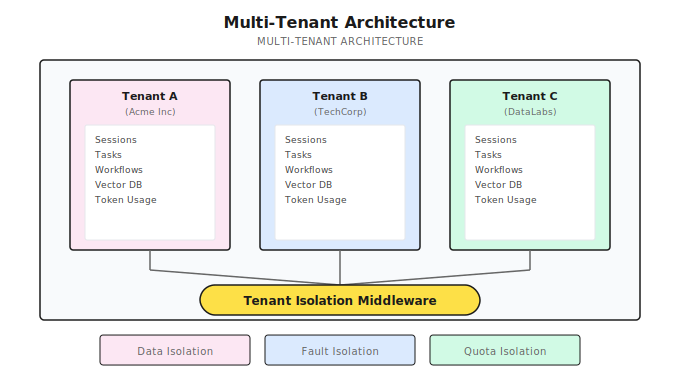
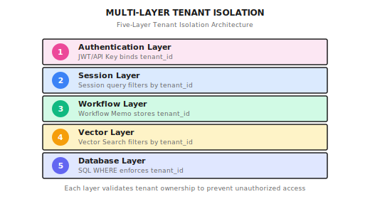

# Chapter 26: Multi-Tenant Design

> **Multi-tenant isolation isn't just "adding a WHERE clause" and calling it done—it requires every layer of data access to go through tenant verification. One oversight means one data leak.**

---

> **Quick Track** (5 minutes to grasp the core)
>
> 1. Three isolation modes: Row-level (cheapest), Schema-level (moderate), Instance-level (most expensive, most secure)
> 2. Tenant ID must be extracted from authentication Context—never trust user input
> 3. Vector databases use namespace isolation with physically separated tenant data
> 4. Every layer of data access must verify tenant—middleware is just the first line of defense
> 5. Isolation testing needs dedicated cross-tenant verification test cases—CI must include them
>
> **10-minute path**: 26.1-26.3 -> 26.5 -> Shannon Lab

---

## A Real Incident First

Your Agent system starts serving multiple enterprise customers. Acme Inc and TechCorp are both using it, everything looks great.

One day, Acme's admin notices some strange entries in their session list—content from TechCorp's internal project discussions.

Even worse, he curiously tries a vector search and can actually retrieve TechCorp's technical documentation.

Post-mortem analysis revealed a simple cause: someone forgot to add `WHERE tenant_id = ?` when writing the Session list query.

Just that one line of missing code caused a cross-tenant data leak.

**This is the challenge of multi-tenant design: it's not a feature, it's a system constraint that permeates all data access.**

---

## 26.1 Why Do We Need Multi-Tenancy?

### Problems with Single-Tenant Architecture

Let's look at a "naive" architecture—all users sharing the same data space:

```
+--------------------------------------+
|           Shared Database            |
|  +------+ +------+ +------+          |
|  | User | | User | | User | <- Mixed |
|  |   A  | |   B  | |   C  |  together|
|  +------+ +------+ +------+          |
+--------------------------------------+
```

What's the problem?

| Issue | Impact | Why It's Serious |
|-------|--------|------------------|
| **Data leak risk** | One API bug could expose all user data | Compliance requirements (GDPR, SOC2) don't allow this |
| **No independent billing** | Hard to track resource usage by organization | Can't implement SaaS business model |
| **No custom configuration** | All users share the same quota limits | Enterprise and free users competing for resources |
| **Compliance difficulties** | Can't isolate and delete data by organization | "Right to be forgotten" can't be implemented |

### Goals of Multi-Tenant Architecture



Three core guarantees:

1. **Data isolation**: Tenant A cannot see any of Tenant B's data
2. **Fault isolation**: Tenant A's issues don't affect Tenant B (at least at the application layer)
3. **Quota isolation**: Each tenant has independent resource limits and billing

---

## 26.2 Multi-Tenancy Implementation Strategies

Before discussing specific implementations, let's understand three common multi-tenancy strategies:

| Strategy | Description | Isolation Level | Cost | Use Case |
|----------|-------------|-----------------|------|----------|
| **Separate database per tenant** | Each tenant gets a physical database | Strongest | Highest | Finance, healthcare, strict compliance scenarios |
| **Shared database, separate Schema** | Same database, each tenant gets a schema | Moderate | Moderate | Large enterprise customers |
| **Shared database, shared Schema** | All tenants share tables, isolated by tenant_id column | Weakest | Lowest | SaaS, small to medium customers |

**Most SaaS products choose the third option**—lowest cost, most flexible scaling. But the tradeoff is: you must enforce tenant_id filtering at every layer of data access.

One oversight means one leak.

---

## 26.3 Data Model Design

### Core Table Structure

Here's a typical multi-tenant data model. Key point: **every business table has a tenant_id field**.

```sql
-- Tenants table (organizations)
CREATE TABLE auth.tenants (
    id UUID PRIMARY KEY,
    name VARCHAR(255),
    slug VARCHAR(100) UNIQUE,           -- User-visible identifier
    plan VARCHAR(50),                   -- free, pro, enterprise
    token_limit INTEGER,                -- Monthly token quota
    monthly_token_usage INTEGER DEFAULT 0,
    is_active BOOLEAN DEFAULT TRUE,
    created_at TIMESTAMP DEFAULT NOW()
);

-- Users table (bound to tenant)
CREATE TABLE auth.users (
    id UUID PRIMARY KEY,
    email VARCHAR(255) UNIQUE,
    username VARCHAR(100) UNIQUE,
    password_hash VARCHAR(255),
    tenant_id UUID REFERENCES auth.tenants(id),  -- Tenant binding
    role VARCHAR(50),                   -- owner, admin, user
    is_active BOOLEAN DEFAULT TRUE,
    created_at TIMESTAMP DEFAULT NOW()
);

-- Sessions table (with tenant isolation)
CREATE TABLE sessions (
    id VARCHAR(255) PRIMARY KEY,
    user_id VARCHAR(255),
    tenant_id UUID,                     -- Tenant isolation
    created_at TIMESTAMP,
    deleted_at TIMESTAMP,               -- Soft delete
    metadata JSONB
);

-- Task executions table (with tenant isolation)
CREATE TABLE task_executions (
    id UUID PRIMARY KEY,
    workflow_id VARCHAR(255) UNIQUE NOT NULL,
    user_id UUID,
    tenant_id UUID,                     -- Tenant isolation
    status VARCHAR(50),
    created_at TIMESTAMP
);
```

### Design Principles

1. **tenant_id is required**: Business table tenant_id cannot be NULL
2. **Soft delete over hard delete**: Use `deleted_at` instead of DELETE for audit and recovery
3. **slug for user-facing scenarios**: UUID is for internal use, slug is for users to see

---

## 26.4 Five-Layer Tenant Isolation

This is the core of multi-tenant design. Adding tenant_id at just the database layer isn't enough—you need to verify tenant ownership at every layer.



Let me explain each layer.

### Layer 1: Authentication Layer Isolation

After user login, tenant_id is embedded in the JWT Token:

**Implementation reference (Shannon)**: `go/orchestrator/internal/auth/jwt.go` - CustomClaims struct

```go
// JWT claims include tenant_id
type CustomClaims struct {
    jwt.RegisteredClaims
    TenantID string   `json:"tenant_id"`  // Key for tenant isolation
    Username string   `json:"username"`
    Email    string   `json:"email"`
    Role     string   `json:"role"`
    Scopes   []string `json:"scopes"`
}

func (j *JWTManager) ValidateAccessToken(tokenString string) (*UserContext, error) {
    token, err := jwt.ParseWithClaims(tokenString, &CustomClaims{}, func(token *jwt.Token) (interface{}, error) {
        if _, ok := token.Method.(*jwt.SigningMethodHMAC); !ok {
            return nil, fmt.Errorf("unexpected signing method: %v", token.Header["alg"])
        }
        return j.signingKey, nil
    })
    // ... after validation, return UserContext
    return &UserContext{
        UserID:   userID,
        TenantID: tenantID,  // Tenant parsed from token
        // ...
    }, nil
}
```

**Design point**: tenant_id is bound to context at authentication time, all subsequent layers read from here—never from user input.

### Layer 2: Session Layer Isolation

Session queries must filter by tenant_id, and cross-tenant access should fail silently:

**Implementation reference (Shannon)**: `go/orchestrator/internal/session/manager.go` - GetSession method

```go
func (m *Manager) GetSession(ctx context.Context, sessionID string) (*Session, error) {
    // ... load session from Redis ...

    // Key: enforce tenant isolation
    if userCtx, err := authFromContext(ctx); err == nil && userCtx.TenantID != "" {
        if session.TenantID != "" && session.TenantID != userCtx.TenantID {
            // Silent failure, don't leak existence
            return nil, ErrSessionNotFound
        }
    }

    return &session, nil
}
```

**Why NotFound instead of AccessDenied?**

If you return "Access Denied", attackers know this session exists but doesn't belong to them. Returning "Not Found" leaks no information—this is called "silent failure".

### Layer 3: Workflow Layer Isolation

Temporal workflows pass tenant information through Memo:

```go
func (h *TaskHandler) SubmitTask(ctx context.Context, req *SubmitTaskRequest) (*SubmitTaskResponse, error) {
    userCtx, err := auth.GetUserContext(ctx)
    if err != nil {
        return nil, err
    }

    workflowOptions := client.StartWorkflowOptions{
        ID:        workflowID,
        TaskQueue: "shannon-tasks",
        Memo: map[string]interface{}{
            "tenant_id": userCtx.TenantID.String(),  // Store in Memo
            "user_id":   userCtx.UserID.String(),
        },
    }

    _, err = h.temporalClient.ExecuteWorkflow(ctx, workflowOptions, ...)
    // ...
}

func (h *TaskHandler) GetTaskStatus(ctx context.Context, taskID string) (*TaskStatus, error) {
    userCtx, err := auth.GetUserContext(ctx)
    if err != nil {
        return nil, err
    }

    wf := h.temporalClient.GetWorkflow(ctx, taskID, "")
    desc, _ := wf.Describe(ctx)

    // Check tenant from Memo
    var memoTenantID string
    if desc.WorkflowExecutionInfo.Memo != nil {
        if tid, ok := desc.WorkflowExecutionInfo.Memo.Fields["tenant_id"]; ok {
            memoTenantID = tid.GetStringValue()
        }
    }

    // Verify tenant ownership
    if memoTenantID != userCtx.TenantID.String() {
        return nil, ErrTaskNotFound  // Silent failure
    }
    // ...
}
```

**Why use Memo?**

Temporal Workflows have their own storage, not in your database. Memo is a Workflow metadata field specifically for storing this kind of business context.

### Layer 4: Vector Storage Layer Isolation

Vector search must include tenant filter, otherwise users can search other people's private documents:

**Implementation reference (Shannon)**: `go/orchestrator/internal/vectordb/search.go` - FindSimilarQueries method

```go
func (c *Client) FindSimilarQueries(ctx context.Context, embedding []float32, limit int) ([]SimilarQuery, error) {
    // Extract tenant_id from context
    var filter map[string]interface{}
    if userCtx, ok := ctx.Value(auth.UserContextKey).(*auth.UserContext); ok &&
       userCtx.TenantID.String() != "00000000-0000-0000-0000-000000000000" {
        filter = map[string]interface{}{
            "must": []map[string]interface{}{
                {"key": "tenant_id", "match": map[string]interface{}{"value": userCtx.TenantID.String()}},
            },
        }
    }

    // Search with mandatory filter
    pts, err := c.search(ctx, c.cfg.TaskEmbeddings, embedding, limit, c.cfg.Threshold, filter)
    // ...
}
```

**This is the most commonly overlooked layer.** Because vector search is typically "similarity matching", developers easily forget it also needs "permission filtering".

### Layer 5: Database Layer Isolation

All SQL queries include tenant_id condition:

```go
func (r *TaskRepository) GetTask(ctx context.Context, taskID uuid.UUID) (*Task, error) {
    userCtx, err := auth.GetUserContext(ctx)
    if err != nil {
        return nil, err
    }

    var task Task
    err = r.db.QueryRowContext(ctx, `
        SELECT id, workflow_id, user_id, tenant_id, status, created_at
        FROM task_executions
        WHERE id = $1 AND tenant_id = $2  -- Mandatory tenant filter
    `, taskID, userCtx.TenantID).Scan(...)

    if err == sql.ErrNoRows {
        return nil, ErrTaskNotFound
    }
    return &task, err
}
```

---

## 26.5 Authentication Middleware Design

The first line of defense for multi-tenant isolation is authentication middleware—it extracts user identity from requests and injects tenant_id into context.

### HTTP Middleware

**Implementation reference (Shannon)**: `go/orchestrator/internal/auth/middleware.go` - HTTPMiddleware method

```go
func (m *Middleware) HTTPMiddleware(next http.Handler) http.Handler {
    return http.HandlerFunc(func(w http.ResponseWriter, r *http.Request) {
        // Development mode skips authentication
        if m.skipAuth {
            ctx := context.WithValue(r.Context(), UserContextKey, &UserContext{
                UserID:   uuid.MustParse("00000000-0000-0000-0000-000000000002"),
                TenantID: uuid.MustParse("00000000-0000-0000-0000-000000000001"),
                Username: "dev",
                Role:     RoleOwner,
            })
            next.ServeHTTP(w, r.WithContext(ctx))
            return
        }

        // Try API Key
        apiKey := r.Header.Get("X-API-Key")
        if apiKey != "" {
            userCtx, err := m.authService.ValidateAPIKey(r.Context(), apiKey)
            if err != nil {
                http.Error(w, "Invalid API key", http.StatusUnauthorized)
                return
            }
            ctx := context.WithValue(r.Context(), UserContextKey, userCtx)
            next.ServeHTTP(w, r.WithContext(ctx))
            return
        }

        // Try Bearer Token
        authHeader := r.Header.Get("Authorization")
        if authHeader == "" {
            http.Error(w, `{"error":"API key is required"}`, http.StatusUnauthorized)
            return
        }

        token, err := ExtractBearerToken(authHeader)
        if err != nil {
            http.Error(w, "Invalid authorization header", http.StatusUnauthorized)
            return
        }

        userCtx, err := m.jwtManager.ValidateAccessToken(token)
        if err != nil {
            http.Error(w, "Invalid token", http.StatusUnauthorized)
            return
        }

        // Inject user context (includes TenantID)
        ctx := context.WithValue(r.Context(), UserContextKey, userCtx)
        next.ServeHTTP(w, r.WithContext(ctx))
    })
}
```

### gRPC Interceptor

gRPC services also need similar authentication interceptors:

**Implementation reference (Shannon)**: `go/orchestrator/internal/auth/middleware.go` - UnaryServerInterceptor method

```go
func (m *Middleware) UnaryServerInterceptor() grpc.UnaryServerInterceptor {
    return func(ctx context.Context, req interface{}, info *grpc.UnaryServerInfo, handler grpc.UnaryHandler) (interface{}, error) {
        // Health checks skip authentication
        if strings.HasSuffix(info.FullMethod, "/Health") {
            return handler(ctx, req)
        }

        // Development mode can pass user info via metadata
        if m.skipAuth {
            userID := uuid.MustParse("00000000-0000-0000-0000-000000000002")
            tenantID := uuid.MustParse("00000000-0000-0000-0000-000000000001")

            if md, ok := metadata.FromIncomingContext(ctx); ok {
                if vals := md.Get("x-user-id"); len(vals) > 0 {
                    if parsed, err := uuid.Parse(vals[0]); err == nil {
                        userID = parsed
                    }
                }
                if vals := md.Get("x-tenant-id"); len(vals) > 0 {
                    if parsed, err := uuid.Parse(vals[0]); err == nil {
                        tenantID = parsed
                    }
                }
            }

            ctx = context.WithValue(ctx, UserContextKey, &UserContext{
                UserID:   userID,
                TenantID: tenantID,
                Username: "dev",
                Role:     RoleOwner,
            })
            return handler(ctx, req)
        }

        // Production: validate API Key or JWT
        md, ok := metadata.FromIncomingContext(ctx)
        if !ok {
            return nil, status.Error(codes.Unauthenticated, "missing metadata")
        }

        var userCtx *UserContext
        if apiKeys := md.Get("x-api-key"); len(apiKeys) > 0 {
            var err error
            userCtx, err = m.authService.ValidateAPIKey(ctx, apiKeys[0])
            if err != nil {
                return nil, status.Error(codes.Unauthenticated, "invalid API key")
            }
        }

        if userCtx == nil {
            return nil, status.Error(codes.Unauthenticated, "missing authentication")
        }

        ctx = context.WithValue(ctx, UserContextKey, userCtx)
        return handler(ctx, req)
    }
}
```

---

## 26.6 Tenant Quota Management

Different tenants have different resource quotas—this is the foundation of SaaS pricing.

### Quota Structure

**Implementation reference (Shannon)**: `go/orchestrator/internal/auth/types.go` - Tenant struct

```go
type Tenant struct {
    ID                uuid.UUID  `json:"id" db:"id"`
    Name              string     `json:"name" db:"name"`
    Slug              string     `json:"slug" db:"slug"`
    Plan              string     `json:"plan" db:"plan"` // free, pro, enterprise
    TokenLimit        int        `json:"token_limit" db:"token_limit"`
    MonthlyTokenUsage int        `json:"monthly_token_usage" db:"monthly_token_usage"`
    DailyTokenLimit   *int       `json:"daily_token_limit,omitempty" db:"daily_token_limit"`
    DailyTokenUsage   int        `json:"daily_token_usage" db:"daily_token_usage"`
    RateLimitPerHour  int        `json:"rate_limit_per_hour" db:"rate_limit_per_hour"`
    IsActive          bool       `json:"is_active" db:"is_active"`
    // ...
}
```

### Differentiated Quotas by Plan

```go
type TenantQuotas struct {
    MonthlyTokenLimit   int `json:"monthly_token_limit"`
    RateLimitPerMinute  int `json:"rate_limit_per_minute"`
    RateLimitPerHour    int `json:"rate_limit_per_hour"`
    MaxSessions         int `json:"max_sessions"`
    MaxVectorDocs       int `json:"max_vector_docs"`
}

var PlanQuotas = map[string]TenantQuotas{
    "free": {
        MonthlyTokenLimit:  100000,    // 100K tokens/month
        RateLimitPerMinute: 20,
        RateLimitPerHour:   500,
        MaxSessions:        10,
        MaxVectorDocs:      1000,
    },
    "pro": {
        MonthlyTokenLimit:  1000000,   // 1M tokens/month
        RateLimitPerMinute: 60,
        RateLimitPerHour:   2000,
        MaxSessions:        100,
        MaxVectorDocs:      50000,
    },
    "enterprise": {
        MonthlyTokenLimit:  -1,        // Unlimited (pay-per-use)
        RateLimitPerMinute: 300,
        RateLimitPerHour:   10000,
        MaxSessions:        -1,
        MaxVectorDocs:      -1,
    },
}
```

### Quota Checking

```go
func (s *QuotaService) CheckQuota(ctx context.Context, quotaType string, amount int) error {
    userCtx, err := auth.GetUserContext(ctx)
    if err != nil {
        return err
    }

    tenant, err := s.tenantRepo.GetTenant(ctx, userCtx.TenantID)
    if err != nil {
        return err
    }

    quotas := PlanQuotas[tenant.Plan]

    switch quotaType {
    case "tokens":
        if quotas.MonthlyTokenLimit > 0 {  // -1 means unlimited
            usage, _ := s.usageRepo.GetMonthlyTokens(ctx, tenant.ID)
            if usage+amount > quotas.MonthlyTokenLimit {
                return ErrQuotaExceeded
            }
        }
    case "sessions":
        if quotas.MaxSessions > 0 {
            count, _ := s.sessionRepo.CountSessions(ctx, tenant.ID)
            if count >= quotas.MaxSessions {
                return ErrQuotaExceeded
            }
        }
    }

    return nil
}
```

---

## 26.7 API Key Management

API Keys are an important authentication method in multi-tenant systems—they're bound to specific users and tenants.

### Secure Storage

Only store the hash, never the plaintext:

**Implementation reference (Shannon)**: `go/orchestrator/internal/auth/types.go` - APIKey struct

```go
type APIKey struct {
    ID               uuid.UUID      `json:"id" db:"id"`
    KeyHash          string         `json:"-" db:"key_hash"`      // Only store hash
    KeyPrefix        string         `json:"key_prefix" db:"key_prefix"` // sk_live_
    UserID           uuid.UUID      `json:"user_id" db:"user_id"`
    TenantID         uuid.UUID      `json:"tenant_id" db:"tenant_id"`
    Name             string         `json:"name" db:"name"`
    Scopes           pq.StringArray `json:"scopes" db:"scopes"`
    RateLimitPerHour int            `json:"rate_limit_per_hour" db:"rate_limit_per_hour"`
    LastUsed         *time.Time     `json:"last_used,omitempty" db:"last_used"`
    ExpiresAt        *time.Time     `json:"expires_at,omitempty" db:"expires_at"`
    IsActive         bool           `json:"is_active" db:"is_active"`
    // ...
}
```

### Validating API Keys

```go
func (s *AuthService) ValidateAPIKey(ctx context.Context, key string) (*UserContext, error) {
    // Normalize format: sk-shannon-xxx -> sk_xxx
    if strings.HasPrefix(key, "sk-shannon-") {
        key = "sk_" + strings.TrimPrefix(key, "sk-shannon-")
    }

    // Hash lookup
    keyHash := sha256.Sum256([]byte(key))
    hashStr := hex.EncodeToString(keyHash[:])

    apiKey, err := s.apiKeyRepo.GetByHash(ctx, hashStr)
    if err != nil {
        return nil, ErrInvalidAPIKey
    }

    if !apiKey.IsActive {
        return nil, ErrAPIKeyRevoked
    }

    // Check expiration
    if apiKey.ExpiresAt != nil && apiKey.ExpiresAt.Before(time.Now()) {
        return nil, ErrAPIKeyExpired
    }

    // Update last used time (async, don't block request)
    go func() {
        apiKey.LastUsed = &time.Time{}
        *apiKey.LastUsed = time.Now()
        s.apiKeyRepo.Update(context.Background(), apiKey)
    }()

    // Get user info, build UserContext
    user, err := s.userRepo.GetByID(ctx, apiKey.UserID)
    if err != nil {
        return nil, err
    }

    return &UserContext{
        UserID:   user.ID,
        TenantID: user.TenantID,  // Tenant comes from user, not from Key
        Username: user.Username,
        Email:    user.Email,
        Role:     user.Role,
        Scopes:   apiKey.Scopes,
        IsAPIKey: true,
        APIKeyID: apiKey.ID,
    }, nil
}
```

---

## 26.8 Common Pitfalls

I've seen too many multi-tenant implementations fail at these points:

### Pitfall 1: Missing tenant_id Filter

This is the most common issue. Pay special attention during code review to queries without tenant_id:

```go
// Wrong: forgot to add tenant_id filter
rows, _ := db.Query("SELECT * FROM sessions WHERE user_id = $1", userID)

// Correct: always filter by tenant_id
rows, _ := db.Query(`
    SELECT * FROM sessions
    WHERE user_id = $1 AND tenant_id = $2
`, userID, tenantID)
```

**Protection measure**: Consider adding detection at the SQL execution layer to warn about queries without tenant_id conditions.

### Pitfall 2: Vector Storage Not Isolated

Vector search is the most commonly overlooked, because it doesn't have WHERE syntax like SQL:

```go
// Wrong: no tenant filter in query
searchResult, _ := v.client.Search(ctx, &qdrant.SearchPoints{
    CollectionName: "memory",
    Vector:         embedding,
    Limit:          10,
    // Missing Filter!
})

// Correct: add tenant filter
filter := &qdrant.Filter{
    Must: []*qdrant.Condition{{
        ConditionOneOf: &qdrant.Condition_Field{
            Field: &qdrant.FieldCondition{
                Key: "tenant_id",
                Match: &qdrant.Match{
                    MatchValue: &qdrant.Match_Keyword{Keyword: tenantID},
                },
            },
        },
    }},
}

searchResult, _ := v.client.Search(ctx, &qdrant.SearchPoints{
    CollectionName: "memory",
    Vector:         embedding,
    Limit:          10,
    Filter:         filter,  // Mandatory tenant filter
})
```

### Pitfall 3: Temporal Memo Oversight

Workflow data isn't in your database, so tenant_id must be passed through Memo:

```go
// Wrong: not storing tenant in Memo
workflowOptions := client.StartWorkflowOptions{
    ID: workflowID,
    // Memo is empty!
}

// Correct: store tenant ID
workflowOptions := client.StartWorkflowOptions{
    ID: workflowID,
    Memo: map[string]interface{}{
        "tenant_id": tenantID,
        "user_id":   userID,
    },
}
```

### Pitfall 4: Dev Mode Leaking to Production

During development, authentication is often skipped for convenience. But this config absolutely cannot go to production:

```yaml
# Wrong: skip_auth enabled in production
auth:
  skip_auth: true  # Dangerous!

# Correct: must be disabled in production
auth:
  enabled: true
  skip_auth: false
```

**Protection measure**: Check skip_auth at production startup—if it's true, exit with error.

### Pitfall 5: Returning AccessDenied Instead of NotFound

Cross-tenant access shouldn't return "access denied", it should return "not found":

```go
// Wrong: leaking existence
if task.TenantID != userCtx.TenantID {
    return nil, ErrAccessDenied  // Attacker knows resource exists
}

// Correct: silent failure
if task.TenantID != userCtx.TenantID {
    return nil, ErrTaskNotFound  // Doesn't leak existence
}
```

---

## 26.9 Security Best Practices

| Practice | Description | Why Important |
|----------|-------------|---------------|
| **JWT Secret length** | At least 32 characters | Prevents brute force |
| **Token expiration** | Access 30 minutes, Refresh 7 days | Balance security and UX |
| **API Key storage** | Only store hash, not plaintext | Database leak won't expose Keys |
| **Password hashing** | Use bcrypt | Prevents rainbow table attacks |
| **HTTPS mandatory** | Required in production | Prevents man-in-the-middle attacks |
| **Cross-tenant access** | Silently return NotFound | Don't leak data existence |
| **Audit logging** | Record all access attempts | Compliance and incident investigation |

### Audit Logging Example

```go
func (a *AuditLogger) LogAccess(ctx context.Context, event AuditEvent) {
    userCtx, _ := auth.GetUserContext(ctx)

    a.logger.Info("access_audit",
        zap.String("user_id", userCtx.UserID.String()),
        zap.String("tenant_id", userCtx.TenantID.String()),
        zap.String("action", event.Action),
        zap.String("resource", event.Resource),
        zap.String("resource_id", event.ResourceID),
        zap.Bool("allowed", event.Allowed),
        zap.String("ip_address", event.IPAddress),
        zap.Time("timestamp", time.Now()),
    )
}
```

---

## 26.10 Framework Comparison

| Feature | Shannon | LangGraph | Dify | Flowise |
|---------|---------|-----------|------|---------|
| **JWT authentication** | Native support | Native support | Native support | Native support |
| **API Keys** | Native support | Native support | Native support | Native support |
| **Multi-tenant isolation** | Complete 5-layer isolation | Partial support | Full support | UI layer only |
| **Session isolation** | Redis + tenant_id | Supported | Supported | Not supported |
| **Vector isolation** | Qdrant Filter | Not supported | Partial support | Not supported |
| **Workflow isolation** | Temporal Memo | Supported | Supported | N/A |
| **Audit logging** | Full support | Partial support | Full support | Not supported |

---

## Chapter Summary

One sentence: **Multi-tenant isolation requires five layers—authentication, session, workflow, vector storage, database—each layer must verify tenant_id. One oversight can lead to data leaks.**

---

## Review

1. **Five-layer isolation**: Auth/session/workflow/vector/database, each layer must verify tenant_id
2. **Silent failure**: Cross-tenant access returns NotFound, not AccessDenied
3. **JWT binding**: tenant_id is injected into context at authentication, all subsequent layers read from there
4. **Vector filtering**: Vector search must include tenant filter—this is the most commonly overlooked layer
5. **Quota management**: Differentiated quotas by Plan, implementing SaaS pricing model

---

## Shannon Lab (10-Minute Hands-On)

This section helps you map the concepts from this chapter to Shannon source code in 10 minutes.

### Must Read (1 file)

- `go/orchestrator/internal/auth/middleware.go`: Look at HTTPMiddleware and UnaryServerInterceptor functions to understand how tenant_id is extracted from Token and injected into Context

### Deep Dive (Pick 2 based on interest)

- `go/orchestrator/internal/session/manager.go`: Find the tenant check logic in GetSession method, understand why it returns ErrSessionNotFound instead of ErrAccessDenied
- `go/orchestrator/internal/vectordb/search.go`: Find the filter construction in FindSimilarQueries method, understand how vector search implements tenant isolation

---

## Exercises

### Exercise 1: Code Audit

Review the following code and identify the multi-tenant isolation issues:

```go
func (r *DocumentRepo) GetDocument(ctx context.Context, docID string) (*Document, error) {
    var doc Document
    err := r.db.QueryRowContext(ctx, `
        SELECT id, title, content, user_id
        FROM documents
        WHERE id = $1
    `, docID).Scan(&doc.ID, &doc.Title, &doc.Content, &doc.UserID)
    return &doc, err
}
```

### Exercise 2: Design Vector Isolation

Design a vector search isolation scheme:
- Where should each tenant's vectors be stored?
- How to filter during queries?
- How to design "cross-tenant public knowledge base" support?

### Exercise 3 (Advanced): PostgreSQL RLS

Learn about PostgreSQL's Row-Level Security (RLS) feature:
- Can it enforce tenant isolation at the database layer?
- What are the pros and cons compared to application-layer filtering?
- Why did Shannon choose application-layer filtering instead of RLS?

---

## Further Reading

- **PostgreSQL RLS**: [Row Security Policies](https://www.postgresql.org/docs/current/ddl-rowsecurity.html) - Database-layer tenant isolation
- **Multi-tenant SaaS Architecture**: AWS Well-Architected Framework multi-tenancy guide
- **Shannon Authentication Docs**: [Authentication and Multitenancy](https://github.com/anthropics/anthropic-cookbook/blob/main/misc/prompt_caching.ipynb)

---

## Part 8 Complete

Part 8 Enterprise Features is now complete. We covered:

- Token Budget Control (Chapter 23)
- OPA Policy Governance (Chapter 24)
- WASI Secure Sandbox (Chapter 25)
- Multi-Tenant Design (Chapter 26)

These four chapters solve the problem of "how Agents run safely in enterprise environments".

Next, Part 9 takes us into **Frontier Practices**—Computer Use, Agentic Coding, Hooks System, Plugin Architecture. These are the hottest directions in the Agent field for 2025-2026.
