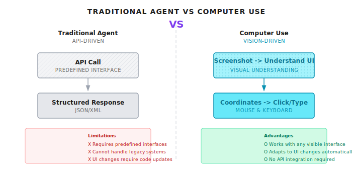
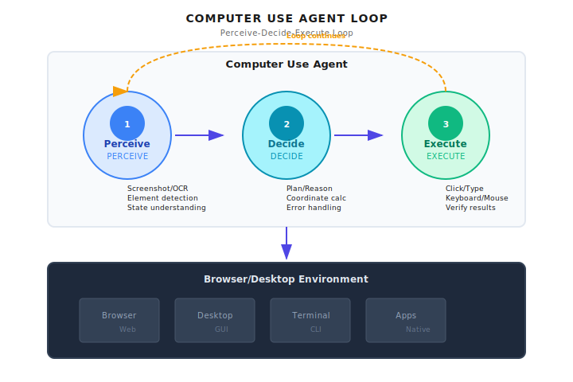
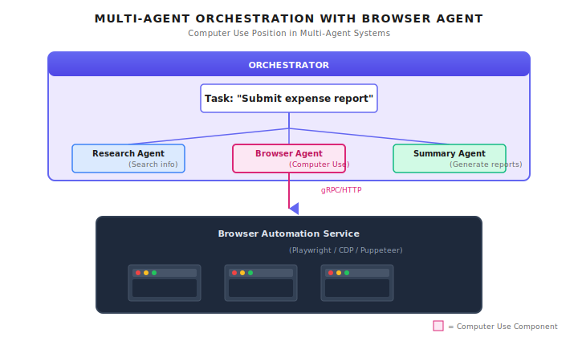

# Chapter 27: Computer Use

> **Computer Use gives Agents "eyes" and "hands," enabling them to see screens, click mice, and type on keyboards like humans do. This is the ultimate weapon for breaking through API boundaries -- but also the most easily uncontrollable capability. Production environments must include sandboxing and human confirmation checkpoints.**

---

Your Agent needs to help a user fill out an internal expense reimbursement form.

The problem is -- this form lives in a decade-old OA system with no API, only a web interface. The development team left long ago, and nobody dares touch the backend code.

Traditional Agents encountering this situation can only say: "Sorry, I cannot operate this system for you."

But Computer Use changes the game. It lets Agents act like humans: open a browser, see the interface, find input fields, enter data, and click submit.

The first time I saw this capability, I was a bit shocked. The Agent was actually "seeing" the screen -- it could identify where the login button was, where the input fields were, and how to operate dropdown menus. This wasn't calling APIs anymore -- this was "using a computer."

Of course, this is also the most dangerous Agent capability I've seen. Think about it: an Agent that can click any button at will -- what happens if it makes a wrong judgment and clicks "Delete All Data"? So in this chapter, we'll cover not just how to implement it, but more importantly, how to control it.

---

## 27.1 What is Computer Use

### From API Calls to Interface Operations

Traditional Agents interact with external systems through predefined APIs: calling search interfaces, reading databases, sending messages. Each operation has a clear input-output format with predictable results.

But in the real world, a huge number of applications don't have open APIs:

| Scenario | Example | Why No API |
|----------|---------|------------|
| Legacy enterprise systems | 10-year-old OA/ERP | Dev team left, nobody dares modify |
| Desktop software | Excel, Photoshop | Designed for humans, not programs |
| Third-party websites | Competitor sites, government portals | They don't want you automating |
| Internal tools | Company-built utilities | No budget for APIs |

The essence of Computer Use is: **turning interface operation from "human-exclusive" to "Agents can do it too"**.

```
Traditional Agent                Computer Use Agent
    |                              |
    v                              v
+----------+                 +--------------+
| API Call |                 | Screenshot->Understand UI|
| Predefined Interface|      | Coordinates->Click/Input|
| Structured Response|       | Feedback->Verify Results|
+----------+                 +--------------+
```



### Core Capability Breakdown

Computer Use isn't a single capability, but a combination of four:

| Capability | Description | Technical Implementation | Typical Failure Scenarios |
|------------|-------------|-------------------------|--------------------------|
| **Visual Understanding** | Parse screenshots, identify UI elements | Multimodal LLM | Elements too small, low color contrast |
| **Coordinate Positioning** | Determine precise click/input locations | Bounding box detection | Resolution/scaling inconsistencies |
| **Mouse/Keyboard Operations** | Simulate user input behavior | Browser automation | Slow page loading, element position changes |
| **State Verification** | Confirm operation results are correct | Screenshot comparison | Async loading, animation effects |

Simply put, Computer Use gives Agents "hand-eye coordination" ability. See something, decide what to do, do it, then verify the result.

### Difference from Traditional Automation

You might ask: Isn't this just Selenium/Playwright?

Not exactly. Traditional automation is "script-driven" -- you hardcode "click id=submit-button". If the button ID changes, the script breaks.

Computer Use is "vision-driven" -- the Agent sees a blue "Submit" button on screen and clicks it. If the button moves or changes style, as long as it still looks like a "Submit" button, it can still find it.

| Feature | Traditional Automation (Selenium) | Computer Use |
|---------|----------------------------------|--------------|
| Locating method | CSS/XPath selectors | Visual recognition |
| Script dependency | Must be pre-written | Agent decides autonomously |
| Interface changes | Script fails | Auto-adapts |
| Applicable scope | Can only operate DOM | Any visible interface |
| Cost | Low (local computation) | High (vision model call per frame) |

Of course, this flexibility comes at a cost: each "look at screen" is a multimodal model call, costing two orders of magnitude more than Selenium.

---

## 27.2 Architecture Design

### Perceive-Decide-Execute Loop

The core of Computer Use is a continuous loop, similar to the ReAct pattern, except "observation" becomes "looking at the screen":

```
+-----------------------------------------------------------+
|                    Computer Use Agent                      |
+-----------------------------------------------------------+
|  +-----------+    +-----------+    +-----------+          |
|  |  Perceive |--->|   Decide  |--->|   Execute |          |
|  +-----------+    +-----------+    +-----------+          |
|        |               |               |                   |
|    Screenshot/OCR    Planning/     Click/Input            |
|    Element ID       Reasoning     Keyboard/Mouse          |
|    State Understanding  Coordinate Calc  Result Verify    |
|        ^               |               |                   |
|        |               |               |                   |
|        +---------------+---------------+                   |
|                   Loop Continues                           |
+-----------------------------------------------------------+
                             |
                             v
+-----------------------------------------------------------+
|                    Browser/Desktop Environment             |
|  +--------+  +--------+  +--------+  +--------+           |
|  | Browser|  | Desktop|  |Terminal|  |  Apps  |           |
|  +--------+  +--------+  +--------+  +--------+           |
+-----------------------------------------------------------+
```



### Three-Layer Decoupling

For production systems, I recommend splitting Computer Use into three layers:

**Agent Layer**: Responsible for understanding tasks and making decisions. This is the "brain."

```
User: "Help me submit an expense reimbursement in the OA system"
Agent:
1. Open OA system
2. Login (may require user confirmation)
3. Navigate to "Expense Reimbursement"
4. Fill out form
5. Submit and verify
```

**Tool Layer**: Provides basic browser operation capabilities. These are the "hands and feet."

```python
# Tool definitions
tools = [
    screenshot(),    # Capture current screen
    click(x, y),     # Click at specified coordinates
    type(text),      # Type text
    scroll(dir),     # Scroll page
    wait(seconds),   # Wait
]
```

**Sandbox Layer**: Isolates execution environment, preventing unauthorized operations. This is the "guardrail."

```
Execution Environment:
- Isolated browser instance
- Network isolation (only whitelisted domains)
- File system isolation
- Timeout and resource limits
```

### Position in Multi-Agent Systems

Computer Use typically exists as a dedicated "Browser Agent," orchestrated by the Orchestrator:

```
+-----------------------------------------------------------+
|              Orchestrator                                  |
|                                                           |
|  Task: "Submit expense reimbursement"                      |
|      |                                                    |
|      v                                                    |
|  +----------------+  +----------------+  +----------------+|
|  | Research Agent |  | Browser Agent  |  | Summary Agent ||
|  | (Search info)  |  | (Computer Use) |  | (Generate report)||
|  +----------------+  +----------------+  +----------------+|
|                            |                               |
+----------------------------|-------------------------------+
                             | gRPC/HTTP
+--------------------------v---------------------------------+
|           Browser Automation Service                       |
|  (Playwright / CDP / Puppeteer)                           |
+-----------------------------------------------------------+
```



---

## 27.3 Multimodal Model Integration

### Model Capability Requirements

Computer Use requires multimodal models -- ones that can both understand images and output structured instructions. Not all models can do this.

In Shannon's model configuration, we mark which models support vision:

```yaml
# Excerpt from config/models.yaml
model_capabilities:
  multimodal_models:
    - gpt-5.1
    - gpt-5-pro-2025-08-07
    - claude-sonnet-4-5-20250929
    - gemini-2.5-flash
    - gemini-2.0-flash
```

> Timeliness Note (2026-01): Multimodal model capabilities change rapidly. The list above is based on late 2025; please check vendor documentation for the latest support information.

### Visual Understanding Tool Design

Tool definitions need to include basic operations like screenshots, clicks, and input. Here's a conceptual example:

```python
# Conceptual Example: Computer Use Tool Definitions

class ScreenshotTool(Tool):
    """Capture current screen or browser window"""

    def _get_metadata(self) -> ToolMetadata:
        return ToolMetadata(
            name="screenshot",
            description="Capture current screen or browser window",
            category="computer_use",
            requires_auth=True,
            rate_limit=30,  # Max 30 screenshots per minute
            timeout_seconds=5,
            dangerous=False,
            cost_per_use=0.01,  # Vision model call cost
        )


class ClickTool(Tool):
    """Execute mouse click at specified coordinates"""

    def _get_metadata(self) -> ToolMetadata:
        return ToolMetadata(
            name="click",
            description="Click at specified coordinates",
            category="computer_use",
            requires_auth=True,
            rate_limit=60,
            timeout_seconds=2,
            dangerous=True,  # May trigger irreversible operations
            cost_per_use=0.0,
        )
```

Note the `dangerous=True` marker -- click operations may trigger irreversible side effects, requiring additional safety checks.

### Prompt Design for Visual Understanding

To make multimodal models understand screens and output operation instructions, carefully designed prompts are needed:

```python
# Conceptual Example: Visual Understanding Prompt

COMPUTER_USE_PROMPT = """
You are helping a user complete an interface operation task.

Current task: {task}
History: {history}

Please analyze the current screenshot and decide the next action.

Output format (JSON):
{
    "observation": "Description of current screen state",
    "reasoning": "Why this action was chosen",
    "action": {
        "type": "click|type|scroll|wait|done",
        "x": 100,  // if click
        "y": 200,  // if click
        "text": "content to type",  // if type
        "direction": "up|down",  // if scroll
    },
    "confidence": 0.9,  // Confidence in this action (0-1)
    "needs_confirmation": false  // Whether user confirmation is needed
}

Notes:
- If you see a login page, set needs_confirmation=true
- If you see critical buttons like "Delete", "Submit", "Pay", set needs_confirmation=true
- If uncertain about the action location, set confidence to a lower value
"""
```

---

## 27.4 Browser Automation Implementation

### Playwright + Vision LLM in Practice

Here's a complete browser automation loop. Note: this is a conceptual example showing the core approach:

```python
# Conceptual Example: Vision-Driven Browser Automation

from playwright.async_api import async_playwright
import base64

async def browser_agent(task: str, client, max_iterations: int = 20):
    """Vision-driven browser automation Agent"""

    history = []

    async with async_playwright() as p:
        browser = await p.chromium.launch(headless=False)
        page = await browser.new_page()

        for iteration in range(max_iterations):
            # 1. Take screenshot and convert to base64
            screenshot_bytes = await page.screenshot()
            screenshot_b64 = base64.b64encode(screenshot_bytes).decode("utf-8")

            # 2. Send to Vision LLM
            response = await client.messages.create(
                model="claude-sonnet-4-5-20250929",  # Vision-capable model
                max_tokens=1024,
                messages=[
                    {
                        "role": "user",
                        "content": [
                            {
                                "type": "image",
                                "source": {
                                    "type": "base64",
                                    "media_type": "image/png",
                                    "data": screenshot_b64,
                                }
                            },
                            {
                                "type": "text",
                                "text": COMPUTER_USE_PROMPT.format(
                                    task=task,
                                    history=history[-5:]  # Keep only last 5 steps
                                )
                            }
                        ]
                    }
                ]
            )

            # 3. Parse and execute action
            action = parse_action(response)
            history.append(action)

            # 4. Check if human confirmation is needed
            if action.needs_confirmation:
                confirmed = await request_human_confirmation(action)
                if not confirmed:
                    continue

            # 5. Execute action
            if action.type == "done":
                break
            elif action.type == "click":
                await page.mouse.click(action.x, action.y)
            elif action.type == "type":
                await page.keyboard.type(action.text)
            elif action.type == "scroll":
                await page.mouse.wheel(0, 300 if action.direction == "down" else -300)
            elif action.type == "wait":
                await asyncio.sleep(action.seconds)

            # 6. Wait for page to stabilize
            await page.wait_for_load_state("networkidle")
            await asyncio.sleep(0.5)  # Extra wait for animations

        await browser.close()
```

### Coordinate Calibration: An Often Overlooked Pitfall

Different devices have different resolutions and DPI scaling. The model sees a 1920x1080 screenshot, but the actual screen might be 2880x1620 (Retina display).

I've seen too many projects fail here: the Agent clearly "sees" the button at (500, 300), but clicks somewhere else entirely.

```python
# Conceptual Example: Coordinate Calibration

class CoordinateCalibrator:
    """Handle different resolutions and scaling ratios"""

    def __init__(self, screen_width: int, screen_height: int, scale: float = 1.0):
        self.screen_width = screen_width
        self.screen_height = screen_height
        self.scale = scale  # DPI scaling

    def normalize(self, x: int, y: int) -> tuple[float, float]:
        """Normalize coordinates (0-1)"""
        return (x / self.screen_width, y / self.screen_height)

    def to_screen(self, norm_x: float, norm_y: float) -> tuple[int, int]:
        """Convert normalized coordinates to actual screen coordinates"""
        x = int(norm_x * self.screen_width * self.scale)
        y = int(norm_y * self.screen_height * self.scale)
        return (x, y)
```

Best practice: **Always use normalized coordinates (0-1) when passing position information between Agent and execution layer**. Actual pixel coordinates are only calculated in the execution layer.

---

## 27.5 Security and Risk Control

This is the most important part of the entire chapter. Computer Use grants Agents enormous capability, but also enormous risk.

### Risk Matrix

| Risk Type | Description | Consequences | Mitigation |
|-----------|-------------|--------------|------------|
| **Misoperation** | Clicking wrong buttons | Data deletion, sending wrong emails | Human confirmation for critical ops |
| **Information Leakage** | Screenshots contain sensitive info | Passwords, personal info recorded | Mask sensitive areas |
| **Injection Attack** | Malicious webpage induces Agent | Execute dangerous operations | Sandbox isolation, whitelisting |
| **Runaway Loop** | Agent stuck in infinite retry | Resource exhaustion, cost explosion | Max iteration limits |
| **Unauthorized Access** | Accessing unauthorized systems | Security audit issues | Domain whitelisting |

### Critical Operations Need Human Confirmation

In Shannon's design philosophy, some operations should not be auto-executed by Agents:

```python
# Conceptual Example: Operations Requiring Human Confirmation

DANGEROUS_PATTERNS = [
    "delete", "remove",
    "submit", "confirm",
    "pay", "purchase",
    "send", "email",
    "logout", "sign out",
]

def needs_confirmation(action: dict, page_text: str) -> bool:
    """Determine if operation needs human confirmation"""

    # 1. Model itself says confirmation needed
    if action.get("needs_confirmation"):
        return True

    # 2. Click operation in dangerous area
    if action["type"] == "click":
        # Check text around click target
        target_text = extract_text_around(action["x"], action["y"])
        for pattern in DANGEROUS_PATTERNS:
            if pattern in target_text.lower():
                return True

    # 3. Typing sensitive information
    if action["type"] == "type":
        if looks_like_password(action["text"]):
            return True

    return False
```

### OPA Policy Protection

OPA policies can be used to restrict Computer Use behavior. This is Shannon-style security boundaries:

```rego
# computer_use.rego

package computer_use

# Forbidden dangerous zones (screen coordinate percentages)
dangerous_zones := [
    {"name": "system_tray", "x_min": 0.9, "y_min": 0.0, "y_max": 0.05},
    {"name": "start_menu", "x_min": 0.0, "x_max": 0.05, "y_min": 0.95},
]

# Forbidden text input patterns
dangerous_inputs := [
    "sudo", "rm -rf", "format", "DELETE FROM", "DROP TABLE",
]

# Click coordinate check
deny[msg] {
    input.action == "click"
    zone := dangerous_zones[_]
    in_zone(input.x, input.y, zone)
    msg := sprintf("Click blocked: in dangerous zone '%s'", [zone.name])
}

# Input content check
deny[msg] {
    input.action == "type_text"
    pattern := dangerous_inputs[_]
    contains(lower(input.text), pattern)
    msg := sprintf("Input blocked: dangerous pattern '%s'", [pattern])
}

# Domain whitelist
allow[msg] {
    input.action == "navigate"
    input.url == allowed_domains[_]
    msg := "Navigation allowed"
}
```

---

## 27.6 Error Recovery and Verification

Computer Use operations can fail -- page didn't load, element disappeared, clicked wrong spot. Robust systems need verification loops.

### Visual Verification Loop

```python
# Conceptual Example: Operation Execution with Verification

class ComputerUseAgent:
    """Computer Use Agent with verification"""

    async def execute_with_verification(
        self,
        action: dict,
        expected_result: str,
        max_retries: int = 3,
    ) -> bool:
        """Execute operation and verify result"""

        for attempt in range(max_retries):
            # 1. Screenshot to get current state
            before_screenshot = await self.take_screenshot()

            # 2. Execute operation
            await self.execute_action(action)

            # 3. Wait for page response
            await asyncio.sleep(1.0)
            await self.page.wait_for_load_state("networkidle")

            # 4. Screenshot to verify result
            after_screenshot = await self.take_screenshot()

            # 5. Use vision model to verify
            verification = await self.verify_action(
                before=before_screenshot,
                after=after_screenshot,
                expected=expected_result,
            )

            if verification["success"]:
                return True

            # 6. On failure, analyze cause and attempt recovery
            if attempt < max_retries - 1:
                recovery_action = await self.plan_recovery(
                    verification["error"],
                    before_screenshot,
                    after_screenshot,
                )
                if recovery_action:
                    await self.execute_action(recovery_action)

        return False
```

### Common Failure Modes and Recovery Strategies

| Failure Mode | Detection Method | Recovery Strategy |
|--------------|------------------|-------------------|
| Element not loaded | Screenshot comparison shows no change | Wait longer |
| Click position offset | Expected element didn't respond | Re-locate element |
| Popup blocking | Popup detected | Close popup first |
| Page navigation | URL changed | Navigate back to correct page |
| Timeout | Operation incomplete | Reduce concurrency, retry |

---

## 27.7 Cost Control

Computer Use costs mainly come from vision model calls. Each screenshot frame is an API call.

### Cost Estimation

Assume a simple form-filling task requiring 15 steps, with each step needing screenshot analysis:

```
Per screenshot analysis:
- Input: ~2000 tokens (image encoding)
- Output: ~200 tokens (decision)
- Cost: ~$0.01 (using claude-sonnet)

15 steps:
- Screenshot analysis: 15 * $0.01 = $0.15
- Verification screenshots: 15 * $0.01 = $0.15 (if verifying each step)
- Total: ~$0.30 per task

Compared to traditional automation:
- Selenium: Nearly free (local computation)
```

### Optimization Strategies

1. **Reduce screenshot frequency**: Not every action needs a screenshot. When typing continuous text, input everything then screenshot to verify.

2. **Use cheaper models**: Simple element positioning can use small models; complex decisions use large models.

3. **Cache interface state**: If interface hasn't changed, no need to re-analyze.

4. **Batch operations**: Combine multiple simple operations into one decision.

---

## 27.8 Implementation Approach Comparison

There are several Computer Use implementation approaches on the market:

| Feature | Vision LLM + Playwright | Dedicated Computer Use API | Traditional DOM Automation |
|---------|------------------------|----------------------------|---------------------------|
| Visual understanding | General multimodal model | Specifically optimized | None (relies on selectors) |
| Autonomy | High (Agent decides) | High | Low (script-driven) |
| Element positioning | Visual coordinates | Visual coordinates | CSS/XPath |
| Complex pages | Any visible interface | Any visible interface | Requires DOM access |
| Cost | High | Medium | Low |
| Maintainability | No script updates needed | No script updates needed | Interface changes require updates |

### Hybrid Approach

In actual production, I recommend mixing approaches:

- **Known stable interfaces**: Use traditional DOM automation, fast and reliable
- **Unknown or changing interfaces**: Use Computer Use, flexible adaptation
- **Critical operations**: Regardless of approach, require human confirmation

---

## 27.9 Common Pitfalls

### Pitfall 1: Coordinate Offset

Coordinates fail under different resolutions/scaling.

```python
# Wrong: Hardcoded coordinates
await click(890, 62)  # May offset on other screens

# Right: Use normalized coordinates
normalized = {"x": 0.9, "y": 0.05}
x, y = calibrator.to_screen(normalized["x"], normalized["y"])
await click(x, y)
```

### Pitfall 2: Page Load Timing

Operating when page hasn't finished loading.

```python
# Wrong: Screenshot immediately after click
await click(x, y)
screenshot = await page.screenshot()  # Might still be old interface

# Right: Wait for page to stabilize
await click(x, y)
await asyncio.sleep(0.5)  # Wait for animations
await page.wait_for_load_state("networkidle")
screenshot = await page.screenshot()
```

### Pitfall 3: Infinite Retry

Infinite retry in error state consumes massive resources.

```python
# Wrong: No exit condition
while not success:
    success = await execute_action()

# Right: Limit retry count
for attempt in range(3):
    success = await execute_action()
    if success:
        break
    if attempt == 2:
        raise ComputerUseError("Max retries exceeded")
```

### Pitfall 4: Sensitive Information Leakage

Screenshots sent to LLM API may contain sensitive information like passwords.

```python
# Solution: Mask sensitive areas
async def safe_screenshot():
    screenshot = await page.screenshot()

    # Detect and mask password input fields
    password_fields = await page.query_selector_all('input[type="password"]')
    for field in password_fields:
        box = await field.bounding_box()
        if box:
            screenshot = cover_area(screenshot, box)

    return screenshot
```

---

## 27.10 Recap

1. **Computer Use Definition**: Gives Agents visual understanding and interface operation capability, breaking through API boundaries
2. **Core Loop**: Perceive (screenshot) -> Decide (LLM) -> Execute (click/type) -> Verify
3. **Coordinate Calibration**: Use normalized coordinates, handle resolution and DPI differences
4. **Security Protection**: Human confirmation for dangerous operations, OPA policy restrictions, domain whitelisting
5. **Cost Awareness**: Each visual call has cost, control screenshot frequency appropriately

---

## Shannon Lab (10-Minute Quickstart)

This section helps you map this chapter's concepts to Shannon source code in 10 minutes. Shannon currently doesn't have a complete Computer Use module, but related tool design patterns can be referenced.

### Required Reading (1 file)

- `config/models.yaml` under `model_capabilities.multimodal_models`: Understand which models support visual understanding

### Optional Deep Dives (2, pick by interest)

- `python/llm-service/llm_service/tools/builtin/file_ops.py`: Reference the safety marker design with `dangerous=True` and `requires_auth=True`
- `docs/pattern-usage-guide.md`: Understand how to configure new tool types in Shannon

---

## Exercises

### Exercise 1: Design Safety Boundaries

Design an OPA policy for Computer Use that:
- Blocks clicks in the top-right 5% of the screen (typically close/settings buttons)
- Blocks text input containing "password" or "secret"
- Only allows access to 3 specified domains

### Exercise 2: Failure Recovery

Design an operation failure detection and recovery flow:
1. How do you determine "click didn't work"?
2. How do you distinguish "page still loading" from "operation failed"?
3. Design recovery strategies for 3 different failure scenarios

### Exercise 3 (Advanced): Cost Optimization

Suppose you need to use Computer Use to automate a 10-step form-filling task, currently costing $0.50 per execution. Design an optimization plan to reduce cost below $0.20 while maintaining reliability.

---

## Further Reading

- **Playwright Official Documentation** - https://playwright.dev/
- **Chrome DevTools Protocol** - https://chromedevtools.github.io/devtools-protocol/
- **Anthropic Computer Use** - https://docs.anthropic.com/en/docs/computer-use

---

## Next Chapter Preview

Computer Use lets Agents operate interfaces, but writing code is another more complex scenario.

The next chapter covers **Agentic Coding** -- enabling Agents to understand codebases, write code, run tests, and fix bugs. This isn't code completion; it's autonomous programming.

Code has structure: functions call functions, modules depend on modules. Agents need not just to write code, but to understand the overall architecture of a codebase.

Moreover, generated code must execute in a sandbox -- you don't want an Agent running `rm -rf /` on your production server.

We'll continue in the next chapter.
