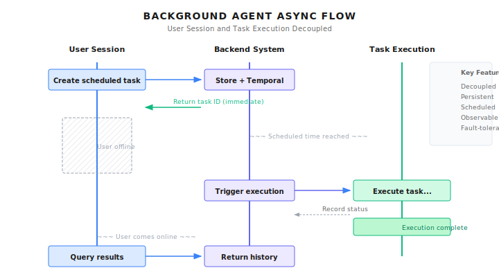

# Chapter 29: Background Agents

> **Background Agents let tasks run independently from user sessions -- scheduled execution, continuous monitoring, automatic failure recovery. This is a key step in evolving Agents from "tools" to "employees," but it also means losing real-time human supervision, requiring budget controls and safety measures to be designed in from the start.**

---

> **Quick Track** (Master the core in 5 minutes)
>
> 1. Core value: Decouple user sessions from task execution, support long-running and scheduled tasks
> 2. Temporal trio: Schedule (timing), Workflow (logic), Activity (execution)
> 3. Unattended operation requires preset: Token budget caps + execution time limits + alert thresholds
> 4. State queries: Use Query for real-time progress, Signal for dynamic behavior adjustment
> 5. Failure recovery: RetryPolicy with exponential backoff + max retries + human intervention fallback
>
> **10-Minute Path**: 29.1-29.3 -> 29.5 -> Shannon Lab

---

Your user says: "Generate an AI industry news digest for me every morning at 9 AM."

The traditional way, you'd have to tell them to set an alarm, open the webpage daily to trigger it. Or write a cron job, but that needs a server, plus handling failure retries, log monitoring...

Background Agents change this game. Users only need to say one sentence, and the system will:
1. Create a scheduled task
2. Automatically trigger Agent execution at 9 AM every day
3. Send notification when task completes
4. Auto-retry and alert on failure
5. Users can pause, resume, or view history anytime

This isn't just a scheduled script -- it's a continuously running Agent that can handle unexpected situations autonomously, remember context, and adjust behavior based on feedback.

But this is also the most dangerous Agent form. Users aren't online -- who's supervising? What if tokens explode after 8 hours of running? How does a stuck task auto-recover?

In this chapter, we'll look at how Shannon implements reliable Background Agents using Temporal.

---

## 29.1 Why Background Agents Are Needed

### Limitations of Synchronous Execution

Traditional Agent interaction is synchronous: user sends request, waits for result, gets response. This works fine for short tasks, but falls short in these scenarios:

| Scenario | Execution Duration | Why Sync Doesn't Work |
|----------|-------------------|----------------------|
| Deep research report | 30 min - 2 hours | HTTP timeout, connection drops |
| Data analysis tasks | Hours | Browser closes, network fluctuations |
| Periodic monitoring | 24/7 continuous | Users can't stay online forever |
| Batch processing | Hours to days | Needs checkpoint recovery |

Problems with synchronous execution:

```
User Session                  Task Execution
    |                              |
    +--------Start Task----------->|
    |                              |-- Executing...
    |                              |-- Executing...
    |<-------Waiting...            |
    |                              |-- Executing...
    X Connection Drops             |-- Continue executing?
                                   |-- Results lost!
```

### Core Characteristics of Background Agents

Background Agents break the binding between user sessions and task execution:

```
User Session                    Backend System                   Task Execution
    |                              |                                 |
    +-----Create Scheduled Task--->|                                 |
    |<---Return Task ID (immediate)|                                 |
    |                              |                                 |
    X User Goes Offline            |                                 |
                                   |                                 |
    ~~~ Scheduled Time Arrives ~~~ |                                 |
                                   +--------Trigger Execution------->|
                                   |                                 |-- Executing...
                                   |<--------Record State------------|
                                   |                                 |-- Executing...
                                   |<--------Execution Complete------|
                                   |                                 |
    ~~~ User Comes Online ~~~      |                                 |
    |                              |                                 |
    +-------Query Results--------->|                                 |
    |<------Return History---------|                                 |
```



Core characteristics:

1. **Decoupling**: User sessions and task execution completely separated
2. **Persistence**: Task state stored in database/workflow engine
3. **Scheduling**: Support Cron expression-based triggers
4. **Observability**: Task status, progress, results queryable anytime
5. **Fault tolerance**: Automatic retry on failure, checkpoint recovery

---

## 29.2 Architecture Design: Temporal + Schedule Manager

Shannon's Background Agents are built on the Temporal workflow engine. Temporal was chosen because it provides:

- Native scheduling capability (Schedule)
- Persistent workflow state
- Automatic retry and failure recovery
- Observability and audit logs

### Core Components

```
+-----------------------------------------------------------+
|                    Orchestrator (Go)                       |
|                                                           |
|  +-----------------------------------------------------+  |
|  |              Schedule Manager                        |  |
|  |  - CreateSchedule()  Create scheduled task           |  |
|  |  - PauseSchedule()   Pause task                     |  |
|  |  - ResumeSchedule()  Resume task                    |  |
|  |  - DeleteSchedule()  Delete task                    |  |
|  |  - ListSchedules()   List tasks                     |  |
|  +-------------------------+---------------------------+  |
+-----------------------------|-----------------------------+
                              |
           +------------------+------------------+
           v                  v                  v
    +------------+     +------------+     +------------+
    | PostgreSQL |     |  Temporal  |     |   Worker   |
    | (Metadata) |     | (Scheduler)|     | (Executor) |
    +------------+     +------------+     +------------+
```

**Schedule Manager**: Manages the lifecycle of scheduled tasks, enforces business rules (quotas, budgets, minimum intervals).

**PostgreSQL**: Stores schedule metadata, execution history, user configuration.

**Temporal**: The actual scheduling engine, responsible for triggering workflows according to Cron expressions.

**Worker**: Executes the actual Agent tasks.

### Why Two Storage Layers?

You might ask: Temporal already stores schedule information, why also PostgreSQL?

Because they're responsible for different things:

| Storage Layer | Responsible For | Query Needs |
|---------------|-----------------|-------------|
| **Temporal** | Workflow state, schedule triggers | Used internally by Temporal |
| **PostgreSQL** | Business metadata, user config, execution history | User UI, analytics reports, auditing |

For example, "query all scheduled tasks for a user" -- querying PostgreSQL directly is much faster than traversing Temporal.

---

## 29.3 Creating Scheduled Tasks

Creating scheduled tasks requires multiple validations. Here's Shannon's implementation:

```go
// Excerpt from go/orchestrator/internal/schedules/manager.go

// CreateSchedule creates a new scheduled task
func (m *Manager) CreateSchedule(ctx context.Context, req *CreateScheduleInput) (*Schedule, error) {
    // 1. Validate Cron expression
    schedule, err := m.cronParser.Parse(req.CronExpression)
    if err != nil {
        return nil, fmt.Errorf("%w: %v", ErrInvalidCronExpression, err)
    }

    // 2. Enforce minimum interval
    if !m.validateMinInterval(req.CronExpression) {
        return nil, fmt.Errorf("%w: must be at least %d minutes",
            ErrIntervalTooShort, m.config.MinCronIntervalMins)
    }

    // 3. Check user quota
    count, err := m.dbOps.CountSchedulesByUser(ctx, req.UserID, req.TenantID)
    if err != nil {
        return nil, fmt.Errorf("failed to check schedule limit: %w", err)
    }
    if count >= m.config.MaxPerUser {
        return nil, fmt.Errorf("%w: %d/%d schedules",
            ErrScheduleLimitReached, count, m.config.MaxPerUser)
    }

    // 4. Validate budget limit
    if req.MaxBudgetPerRunUSD < 0 {
        return nil, fmt.Errorf("budget cannot be negative: $%.2f", req.MaxBudgetPerRunUSD)
    }
    if req.MaxBudgetPerRunUSD > m.config.MaxBudgetPerRunUSD {
        return nil, fmt.Errorf("%w: $%.2f > $%.2f", ErrBudgetExceeded,
            req.MaxBudgetPerRunUSD, m.config.MaxBudgetPerRunUSD)
    }

    // 5. Validate timezone
    timezone := req.Timezone
    if timezone == "" {
        timezone = "UTC"
    }
    tz, err := time.LoadLocation(timezone)
    if err != nil {
        return nil, fmt.Errorf("%w: %s", ErrInvalidTimezone, timezone)
    }

    // 6. Generate ID
    scheduleID := uuid.New()
    temporalScheduleID := fmt.Sprintf("schedule-%s", scheduleID.String())

    // 7. Create schedule in Temporal
    _, err = m.temporalClient.ScheduleClient().Create(ctx, client.ScheduleOptions{
        ID: temporalScheduleID,
        Spec: client.ScheduleSpec{
            CronExpressions: []string{req.CronExpression},
            TimeZoneName:    timezone,
        },
        Action: &client.ScheduleWorkflowAction{
            Workflow:           "ScheduledTaskWorkflow",
            TaskQueue:          "shannon-tasks",
            WorkflowRunTimeout: time.Duration(req.TimeoutSeconds) * time.Second,
            Args: []interface{}{
                ScheduledTaskInput{
                    ScheduleID:         scheduleID.String(),
                    TaskQuery:          req.TaskQuery,
                    TaskContext:        req.TaskContext,
                    MaxBudgetPerRunUSD: req.MaxBudgetPerRunUSD,
                    UserID:             req.UserID.String(),
                    TenantID:           req.TenantID.String(),
                },
            },
        },
        Paused: false,
    })
    if err != nil {
        return nil, fmt.Errorf("failed to create Temporal schedule: %w", err)
    }

    // 8. Calculate next execution time
    nextRun := schedule.Next(time.Now().In(tz))

    // 9. Persist to database
    dbSchedule := &Schedule{
        ID:                 scheduleID,
        UserID:             req.UserID,
        TenantID:           req.TenantID,
        Name:               req.Name,
        CronExpression:     req.CronExpression,
        Timezone:           timezone,
        TaskQuery:          req.TaskQuery,
        MaxBudgetPerRunUSD: req.MaxBudgetPerRunUSD,
        TemporalScheduleID: temporalScheduleID,
        Status:             ScheduleStatusActive,
        NextRunAt:          &nextRun,
    }

    if err := m.dbOps.CreateSchedule(ctx, dbSchedule); err != nil {
        // Rollback: delete Temporal schedule
        _ = m.temporalClient.ScheduleClient().GetHandle(ctx, temporalScheduleID).Delete(ctx)
        return nil, fmt.Errorf("failed to persist schedule: %w", err)
    }

    return dbSchedule, nil
}
```

### Design Points

1. **Temporal first, database second**: If database write fails, rollback the Temporal schedule. Reverse order is harder to rollback.

2. **Multiple validations**: Cron syntax, minimum interval, user quota, budget limit, timezone validity -- all validated at creation time.

3. **Pre-calculate next execution time**: Convenient for UI display, no need to query Temporal each time.

### Minimum Interval Validation

Prevents users from creating overly frequent schedules (like every minute), which would exhaust resources and budgets:

```go
// validateMinInterval checks if Cron expression meets minimum interval
func (m *Manager) validateMinInterval(cronExpression string) bool {
    if m.config.MinCronIntervalMins <= 0 {
        return true // No limit
    }

    schedule, err := m.cronParser.Parse(cronExpression)
    if err != nil {
        return false
    }

    // Calculate next two execution times
    now := time.Now().In(time.UTC)
    next1 := schedule.Next(now)
    next2 := schedule.Next(next1)

    // Check if interval meets minimum requirement
    intervalMinutes := next2.Sub(next1).Minutes()
    return intervalMinutes >= float64(m.config.MinCronIntervalMins)
}
```

---

## 29.4 Pause and Resume

Users may need to temporarily pause schedules (like during vacation when reports aren't needed), then resume later.

### Pause

```go
// PauseSchedule pauses a scheduled task
func (m *Manager) PauseSchedule(ctx context.Context, scheduleID uuid.UUID, reason string) error {
    // 1. Get schedule
    dbSchedule, err := m.dbOps.GetSchedule(ctx, scheduleID)
    if err != nil {
        return fmt.Errorf("schedule not found: %w", err)
    }

    if dbSchedule.Status == ScheduleStatusPaused {
        return nil // Already paused, idempotent
    }

    // 2. Pause in Temporal
    handle := m.temporalClient.ScheduleClient().GetHandle(ctx, dbSchedule.TemporalScheduleID)
    if err := handle.Pause(ctx, client.SchedulePauseOptions{
        Note: reason,
    }); err != nil {
        return fmt.Errorf("failed to pause Temporal schedule: %w", err)
    }

    // 3. Update database status
    if err := m.dbOps.UpdateScheduleStatus(ctx, scheduleID, ScheduleStatusPaused); err != nil {
        return fmt.Errorf("failed to update schedule status: %w", err)
    }

    m.logger.Info("Schedule paused",
        zap.String("schedule_id", scheduleID.String()),
        zap.String("reason", reason),
    )

    return nil
}
```

### Resume

```go
// ResumeSchedule resumes a paused scheduled task
func (m *Manager) ResumeSchedule(ctx context.Context, scheduleID uuid.UUID, reason string) (*time.Time, error) {
    // 1. Get schedule
    dbSchedule, err := m.dbOps.GetSchedule(ctx, scheduleID)
    if err != nil {
        return nil, fmt.Errorf("schedule not found: %w", err)
    }

    if dbSchedule.Status == ScheduleStatusActive {
        return dbSchedule.NextRunAt, nil // Already active, return next execution time
    }

    // 2. Resume in Temporal
    handle := m.temporalClient.ScheduleClient().GetHandle(ctx, dbSchedule.TemporalScheduleID)
    if err := handle.Unpause(ctx, client.ScheduleUnpauseOptions{
        Note: reason,
    }); err != nil {
        return nil, fmt.Errorf("failed to unpause Temporal schedule: %w", err)
    }

    // 3. Calculate new next execution time
    schedule, _ := m.cronParser.Parse(dbSchedule.CronExpression)
    tz, _ := time.LoadLocation(dbSchedule.Timezone)
    nextRun := schedule.Next(time.Now().In(tz))

    // 4. Update database
    m.dbOps.UpdateScheduleStatus(ctx, scheduleID, ScheduleStatusActive)
    m.dbOps.UpdateScheduleNextRun(ctx, scheduleID, nextRun)

    return &nextRun, nil
}
```

### Idempotency

Note both methods are idempotent:
- Pausing an already paused schedule returns success directly
- Resuming an already active schedule returns the next execution time directly

This way callers don't need to query status before deciding whether to operate.

---

## 29.5 Cron Expression Deep Dive

Cron is the standard language for scheduled execution. Shannon uses the standard 5-field format:

```
+------------- Minute (0 - 59)
| +----------- Hour (0 - 23)
| | +--------- Day of Month (1 - 31)
| | | +------- Month (1 - 12)
| | | | +----- Day of Week (0 - 6, 0=Sunday)
| | | | |
* * * * *
```

### Common Examples

| Expression | Meaning |
|------------|---------|
| `0 9 * * *` | Every day at 9 AM |
| `0 9 * * 1-5` | Monday to Friday at 9 AM |
| `0 */4 * * *` | Every 4 hours on the hour |
| `0 0 1 * *` | First day of every month at midnight |
| `30 8 * * 1` | Every Monday at 8:30 AM |
| `0 9,18 * * *` | Every day at 9 AM and 6 PM |

### Timezone Support

Timezone is a key feature of Background Agents. When a user says "every day at 9 AM," they mean 9 AM in their timezone, not UTC.

```go
// Temporal schedules support timezones
_, err = m.temporalClient.ScheduleClient().Create(ctx, client.ScheduleOptions{
    Spec: client.ScheduleSpec{
        CronExpressions: []string{"0 9 * * *"},
        TimeZoneName:    "Asia/Tokyo",  // 9 AM Tokyo time
    },
})
```

Supports standard IANA timezone names: `America/New_York`, `Europe/London`, `Asia/Shanghai`, etc.

---

## 29.6 Budget and Cost Control

Background Agents run when users aren't present, making cost control even more important.

### Three-Layer Budget Control

1. **System-level limit**: Max budget per execution (admin configured)
2. **User-level budget**: User-set budget per execution
3. **Cumulative budget**: Total consumption cap for a schedule (optional)

```go
// System configuration
type Config struct {
    MaxPerUser          int     // Max schedules per user (default: 50)
    MinCronIntervalMins int     // Minimum execution interval (default: 60 minutes)
    MaxBudgetPerRunUSD  float64 // Max budget per execution (default: $10)
}

// Validation at creation
if req.MaxBudgetPerRunUSD > m.config.MaxBudgetPerRunUSD {
    return nil, fmt.Errorf("%w: $%.2f > $%.2f", ErrBudgetExceeded,
        req.MaxBudgetPerRunUSD, m.config.MaxBudgetPerRunUSD)
}
```

### Budget Injection into Workflow

```go
// Inject budget in ScheduledTaskWorkflow
if input.MaxBudgetPerRunUSD > 0 {
    if taskInput.Context == nil {
        taskInput.Context = make(map[string]interface{})
    }
    taskInput.Context["max_budget_usd"] = input.MaxBudgetPerRunUSD
}
```

The main workflow checks this budget and stops execution when exceeded.

### Cost Tracking

Record cost after each execution for analysis and alerting:

```go
// Record after execution completes
workflow.ExecuteActivity(activityCtx, "RecordScheduleExecutionComplete",
    RecordScheduleExecutionCompleteInput{
        ScheduleID: scheduleID,
        TaskID:     childWorkflowID,
        Status:     status,
        TotalCost:  totalCost,  // Extracted from child workflow
        ErrorMsg:   errorMsg,
    },
).Get(ctx, nil)
```

---

## 29.7 Orphan Detection and Cleanup

Database and Temporal states can become inconsistent. For example:
- Someone manually deleted a schedule in Temporal UI
- Data lost during database migration
- Network issues interrupted the creation flow

Regular detection and cleanup is needed:

```go
// VerifyScheduleExists checks if schedule exists in Temporal
func (m *Manager) VerifyScheduleExists(ctx context.Context, schedule *Schedule) (bool, error) {
    if schedule.Status != ScheduleStatusActive && schedule.Status != ScheduleStatusPaused {
        return true, nil // Only verify active/paused schedules
    }

    handle := m.temporalClient.ScheduleClient().GetHandle(ctx, schedule.TemporalScheduleID)
    _, err := handle.Describe(ctx)
    if err != nil {
        if strings.Contains(err.Error(), "not found") {
            m.logger.Warn("Detected orphaned schedule - Temporal schedule not found",
                zap.String("schedule_id", schedule.ID.String()),
                zap.String("temporal_id", schedule.TemporalScheduleID),
            )
            // Mark as deleted in database
            m.dbOps.UpdateScheduleStatus(ctx, schedule.ID, ScheduleStatusDeleted)
            return false, nil
        }
        // Other errors uncertain, assume exists
        return true, nil
    }
    return true, nil
}

// DetectAndCleanOrphanedSchedules batch detects orphan schedules
func (m *Manager) DetectAndCleanOrphanedSchedules(ctx context.Context) ([]uuid.UUID, error) {
    schedules, err := m.dbOps.GetAllActiveSchedules(ctx)
    if err != nil {
        return nil, fmt.Errorf("failed to get active schedules: %w", err)
    }

    var orphanedIDs []uuid.UUID
    for _, schedule := range schedules {
        exists, err := m.VerifyScheduleExists(ctx, schedule)
        if err != nil {
            continue
        }
        if !exists {
            orphanedIDs = append(orphanedIDs, schedule.ID)
        }
    }

    if len(orphanedIDs) > 0 {
        m.logger.Info("Cleaned up orphaned schedules",
            zap.Int("count", len(orphanedIDs)),
        )
    }

    return orphanedIDs, nil
}
```

Recommend running orphan detection daily via another scheduled task.

---

## 29.8 Security Considerations

Background Agents run when users aren't present, making security risks higher.

### Risk Matrix

| Risk | Description | Mitigation |
|------|-------------|------------|
| **Budget runaway** | Background task consumes massive tokens | Per-execution budget limit |
| **Infinite loop** | Agent stuck in retry loop | Max retry count, execution timeout |
| **Privilege abuse** | Scheduled task executes sensitive operations | Operation audit, minimize privileges |
| **Resource exhaustion** | Too many schedules running simultaneously | User quota, minimum interval |
| **State inconsistency** | Database and Temporal out of sync | Orphan detection, state verification |

### Operation Audit

Every execution should have complete audit records:

```go
type ScheduleExecution struct {
    ID          uuid.UUID
    ScheduleID  uuid.UUID
    StartedAt   time.Time
    CompletedAt *time.Time
    Status      string    // RUNNING, COMPLETED, FAILED
    TotalCost   float64
    ErrorMsg    *string
    Metadata    map[string]interface{}
}
```

### Sensitive Operation Restrictions

Background tasks shouldn't execute certain sensitive operations (at least not without additional authorization):

```python
# Conceptual Example: Background Task Operation Restrictions

BACKGROUND_RESTRICTED_OPERATIONS = [
    "delete_data",        # Delete data
    "send_email",         # Send email (could be spam)
    "make_purchase",      # Purchase operations
    "modify_permissions", # Modify permissions
]

def check_background_operation(operation: str, is_background: bool) -> bool:
    if is_background and operation in BACKGROUND_RESTRICTED_OPERATIONS:
        raise BackgroundOperationRestricted(
            f"Operation '{operation}' is not allowed in background tasks. "
            f"Please trigger manually with user confirmation."
        )
    return True
```

---

## 29.9 Practical Examples

### Example 1: Daily News Digest

```python
# Conceptual Example: Create Daily News Digest

async def create_daily_news_schedule(
    topic: str,
    user_id: str,
    timezone: str = "UTC",
) -> dict:
    """Create daily news digest scheduled task"""

    request = {
        "name": f"Daily News: {topic}",
        "cron_expression": "0 9 * * *",  # Every day at 9 AM
        "timezone": timezone,
        "task_query": f"""
Generate a daily news digest about {topic}.

Include:
1. Top 5 news from the past 24 hours
2. Key insights and trends
3. Notable quotes or data points
4. Links to original sources

Format: Markdown, suitable for email newsletter.
""",
        "task_context": {
            "output_format": "markdown",
            "max_sources": 10,
        },
        "max_budget_per_run_usd": 2.0,
        "timeout_seconds": 600,
        "user_id": user_id,
    }

    return await schedule_client.create(request)
```

### Example 2: Competitor Monitoring

```python
# Conceptual Example: Competitor Website Monitoring

async def create_competitor_monitor(
    competitor_urls: List[str],
    user_id: str,
) -> dict:
    """Create competitor monitoring scheduled task"""

    request = {
        "name": "Competitor Price Monitor",
        "cron_expression": "0 */6 * * *",  # Every 6 hours
        "timezone": "UTC",
        "task_query": f"""
Monitor these competitor websites for changes:
{chr(10).join(competitor_urls)}

Report:
1. Any price changes detected
2. New products or features
3. Marketing message changes
4. Compare with previous check

If significant changes detected, flag as ALERT.
""",
        "task_context": {
            "previous_state_key": "competitor_state",  # Persisted state
            "alert_threshold": "significant",
        },
        "max_budget_per_run_usd": 3.0,
        "timeout_seconds": 900,
        "user_id": user_id,
    }

    return await schedule_client.create(request)
```

### Example 3: Weekly Summary Report

```python
# Conceptual Example: Weekly Summary

async def create_weekly_summary(
    topics: List[str],
    user_id: str,
) -> dict:
    """Create weekly summary report"""

    request = {
        "name": "Weekly AI Industry Summary",
        "cron_expression": "0 9 * * 1",  # Every Monday at 9 AM
        "timezone": "America/New_York",
        "task_query": f"""
Generate a comprehensive weekly summary for:
{', '.join(topics)}

Include:
1. Major announcements and releases
2. Funding and acquisitions
3. Research paper highlights
4. Industry trends analysis
5. Predictions for next week
""",
        "max_budget_per_run_usd": 5.0,
        "timeout_seconds": 1800,
        "user_id": user_id,
    }

    return await schedule_client.create(request)
```

---

## 29.10 Common Pitfalls

### Pitfall 1: Timezone Confusion

User says "every day at 9 AM," but system executes in UTC.

```go
// Wrong: Default UTC, user unaware
cron := "0 9 * * *"  // User thinks local 9 AM, actually UTC 9 AM

// Right: Explicitly require timezone, clearly state in response
if req.Timezone == "" {
    req.Timezone = "UTC"
}
response.Timezone = req.Timezone
response.NextRunAt = schedule.Next(time.Now().In(tz))
response.NextRunLocal = response.NextRunAt.Format("2006-01-02 15:04 MST")
```

### Pitfall 2: Forgetting to Rollback

When creating a schedule, if database write fails, forgetting to delete the already-created Temporal schedule.

```go
// Wrong: No rollback
_, err = m.temporalClient.ScheduleClient().Create(ctx, ...)
// ... Temporal creation succeeded

err = m.dbOps.CreateSchedule(ctx, dbSchedule)
if err != nil {
    return nil, err  // Temporal schedule becomes orphan!
}

// Right: Rollback on failure
if err := m.dbOps.CreateSchedule(ctx, dbSchedule); err != nil {
    _ = m.temporalClient.ScheduleClient().GetHandle(ctx, temporalScheduleID).Delete(ctx)
    return nil, fmt.Errorf("failed to persist schedule: %w", err)
}
```

### Pitfall 3: Only Deleting from Database

```go
// Wrong: Only delete database record
m.dbOps.DeleteSchedule(ctx, scheduleID)
// Temporal schedule keeps running, becomes orphan!

// Right: Delete Temporal first, then update database
handle := m.temporalClient.ScheduleClient().GetHandle(ctx, dbSchedule.TemporalScheduleID)
handle.Delete(ctx)
m.dbOps.UpdateScheduleStatus(ctx, scheduleID, ScheduleStatusDeleted)
```

### Pitfall 4: No Budget Limit

```go
// Wrong: User can set any budget
request.MaxBudgetPerRunUSD = 1000.0  // $1000 per execution

// Right: Enforce system cap
if req.MaxBudgetPerRunUSD > m.config.MaxBudgetPerRunUSD {
    return nil, fmt.Errorf("%w: $%.2f > $%.2f", ErrBudgetExceeded,
        req.MaxBudgetPerRunUSD, m.config.MaxBudgetPerRunUSD)
}
```

---

## 29.11 Recap

1. **Background Agent Definition**: Tasks run independently from user sessions, support scheduled execution, pause/resume
2. **Dual-layer storage**: Temporal handles scheduling execution, PostgreSQL handles business queries
3. **Multiple validations**: Cron syntax, minimum interval, user quota, budget limit
4. **Timezone support**: Users expect local time, must handle timezones explicitly
5. **Orphan cleanup**: Regularly detect inconsistent state between database and Temporal

---

## Shannon Lab (10-Minute Quickstart)

This section helps you map this chapter's concepts to Shannon source code in 10 minutes.

### Required Reading (1 file)

- `go/orchestrator/internal/schedules/manager.go`: Complete Schedule Manager implementation, including create, pause, resume, delete

### Optional Deep Dives (2, pick by interest)

- `go/orchestrator/internal/workflows/scheduled/scheduled_task_workflow.go`: Workflow wrapper executed when schedule triggers
- Budget configuration in `config/models.yaml`: Understand how to set system-level resource limits

---

## Exercises

### Exercise 1: Design Alert Scheduling

Design a monitoring alert system:
1. Check system status every 5 minutes
2. If anomaly detected, send alert notification
3. After alerting, enter "cooldown period" to avoid repeated alerts
4. When anomaly recovers, send recovery notification

### Exercise 2: Implement Execution History Query

Design execution history API and storage:
1. Store start time, end time, status, cost for each execution
2. Support query by schedule ID
3. Support filter by time range
4. Calculate cumulative cost for a schedule

### Exercise 3 (Advanced): Cascade Pause

Design a system that, when a schedule fails 3 consecutive times:
1. Auto-pause the schedule
2. Send notification to user
3. Record pause reason
4. Check if failure cause is resolved when user resumes

---

## Further Reading

- **Temporal Schedules** - https://docs.temporal.io/workflows#schedule
- **Cron Expression** - https://crontab.guru/
- **IANA Time Zone Database** - https://www.iana.org/time-zones

---

## Next Chapter Preview

Background Agents execute tasks on schedule, but which model to use each time? Always the most expensive large model? That's too costly.

The next chapter covers **Tiered Model Strategy** -- how to achieve 50-70% cost reduction through intelligent model selection.

The core idea is simple: simple tasks use small models, complex tasks use large models. But implementation isn't that simple:
- How do you judge task complexity?
- Should small model failures upgrade to large models?
- What models suit different types of tasks?

In the next chapter, we'll look at Shannon's tiered model routing strategy.
