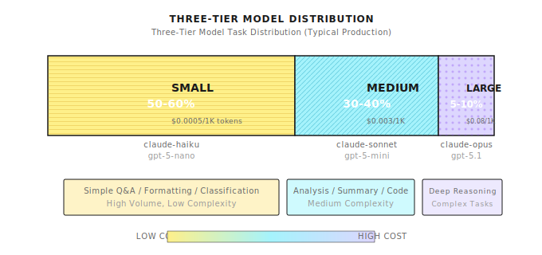

# Chapter 30: Tiered Model Strategy

> **"Tiered routing can save 80% costs" -- but only if you can correctly judge task complexity, which is harder than it sounds.**

---

> **Quick Track** (Master the core in 5 minutes)
>
> 1. Three tiers: Small (50% traffic) -> Medium (40%) -> Large (10%)
> 2. Complexity judgment: Rules first (keywords/length), LLM fallback (fuzzy tasks)
> 3. Upgrade mechanism: Auto-upgrade to Medium/Large when Small output quality is poor
> 4. Cost monitoring: Track token consumption by tier, investigate if Large exceeds 20%
> 5. Cache first: Same queries hitting cache saves more than model tiering
>
> **10-Minute Path**: 30.1-30.3 -> 30.5 -> Shannon Lab

---

## 30.1 Starting with a Bill

Your AI Agent system has been live for three months, and the boss calls you in for a chat:

"This month's LLM bill is $15,000, ten times over budget."

You pull up usage logs and find the problem:

```
[2025-01-10 09:15:22] User asked: "What day is today?"
                       Model: claude-opus-4-1
                       Cost: 0.12 USD

[2025-01-10 09:15:45] User asked: "Help me analyze the core risk points in this 200-page financial report"
                       Model: claude-opus-4-1
                       Cost: 0.35 USD
```

Two tasks used the same expensive top-tier model. Asking "what day is today" cost $0.12 -- Haiku could answer that 200 times for the same price.

**The core problem**: Your system is "over-serving" -- using a Rolls-Royce for grocery delivery, using rocket launchers on mosquitoes.

This chapter solves one problem: **How to match the right tasks with the right models**.

---

## 30.2 Three-Tier Model Architecture

### Why Three Tiers?

| Tier | Use Cases | Representative Models | Relative Cost |
|------|-----------|----------------------|---------------|
| **Small** | Simple Q&A, formatting, classification | claude-haiku, gpt-5-nano | 1x |
| **Medium** | Standard analysis, summarization, code assistance | claude-sonnet, gpt-5-mini | 3-5x |
| **Large** | Complex reasoning, creative writing, deep analysis | claude-opus, gpt-5.1 | 50-150x |

The three-tier design comes from practical observation -- most production traffic can be categorized into these three buckets:



**Target distribution**: 50% Small / 40% Medium / 10% Large.

This isn't a mandatory quota -- it's a reference baseline. Actual distribution depends on your business scenario. But if your Large exceeds 20%, your complexity judgment might have issues.

### Configuration Structure

**Implementation Reference (Shannon)**: [`config/models.yaml`](https://github.com/Kocoro-lab/Shannon/blob/main/config/models.yaml) - model_tiers configuration

```yaml
# Shannon three-tier model configuration
model_tiers:
  small:
    # Target share: 50% - fast, low cost, handles basic tasks
    providers:
      - provider: anthropic
        model: claude-haiku-4-5-20251015
        priority: 1  # Primary
      - provider: openai
        model: gpt-5-nano-2025-08-07
        priority: 2  # Backup
      - provider: xai
        model: grok-3-mini
        priority: 3
      - provider: google
        model: gemini-2.5-flash-lite
        priority: 4

  medium:
    # Target share: 40% - capability/cost balance
    providers:
      - provider: anthropic
        model: claude-sonnet-4-5-20250929
        priority: 1
      - provider: openai
        model: gpt-5-mini-2025-08-07
        priority: 2
      - provider: xai
        model: grok-4-fast-non-reasoning
        priority: 3
      - provider: google
        model: gemini-2.5-flash
        priority: 4

  large:
    # Target share: 10% - deep reasoning tasks
    providers:
      - provider: openai
        model: gpt-5.1
        priority: 1
      - provider: anthropic
        model: claude-opus-4-1-20250805
        priority: 2
      - provider: xai
        model: grok-4-fast-reasoning
        priority: 3
      - provider: google
        model: gemini-2.5-pro
        priority: 4
```

**Priority explanation**: Lower numbers mean higher priority. Within a tier, try in priority order -- auto-switch to backup when primary is unavailable.

---

## 30.3 The Math of Cost vs Capability

### Actual Pricing Comparison

> **Timeliness Note** (2026-01): Model pricing and capability lists change frequently. Below are illustrative configurations; check vendor sites for latest prices: [OpenAI Pricing](https://openai.com/pricing) | [Anthropic Pricing](https://www.anthropic.com/pricing) | [Google AI Pricing](https://ai.google.dev/pricing)

| Model | Input/1K tokens | Output/1K tokens | Relative Cost |
|-------|-----------------|------------------|---------------|
| claude-haiku-4-5 | $0.0001 | $0.0005 | 1x |
| gpt-5-nano | $0.00005 | $0.0004 | ~0.75x |
| claude-sonnet-4-5 | $0.0003 | $0.0015 | 3x |
| gpt-5-mini | $0.00025 | $0.002 | 3.5x |
| claude-opus-4-1 | $0.015 | $0.075 | 150x |
| gpt-5.1 | $0.00125 | $0.01 | 20x |

**Key insight**: Opus's per-call cost is **150x** that of Haiku.

### Cost Savings Calculation

Assume 1 million API calls per month, averaging 1000 tokens each:

**Scenario A: All Large Models**
```
1M * 1K tokens * ($0.015 + $0.075) / 1K = $90,000/month
```

**Scenario B: Smart Tiering (50/40/10)**
```
Small:  500K * 1K * ($0.0001 + $0.0005) / 1K = $300
Medium: 400K * 1K * ($0.0003 + $0.0015) / 1K = $720
Large:  100K * 1K * ($0.015 + $0.075) / 1K   = $9,000
Total: $10,020/month
```

**Savings**: $90,000 - $10,020 = **$79,980/month (89% reduction)**

This is the power of tiered strategy. But the premise is -- you must accurately judge which tasks belong to which tier.

---

## 30.4 Complexity Analysis: The Core of Routing

### Complexity Threshold Configuration

```yaml
# Complexity -> Tier mapping
workflows:
  complexity:
    simple_threshold: 0.3   # complexity < 0.3 -> small
    medium_threshold: 0.5   # 0.3 <= complexity < 0.5 -> medium
                            # complexity >= 0.5 -> large
```

### Heuristic Complexity Calculation

**Implementation Reference (Shannon)**: [`llm_service/api/complexity.py`](https://github.com/Kocoro-lab/Shannon/blob/main/python/llm-service/llm_service/api/complexity.py) - _heuristic_analysis function

```python
def calculate_complexity(query: str, context: Dict) -> float:
    """
    Calculate task complexity score (0.0 - 1.0)

    Heuristic rules, no LLM call -- for fast routing decisions.
    """
    score = 0.0
    query_lower = query.lower()

    # 1. Query length (longer queries usually more complex)
    word_count = len(query.split())
    if word_count > 100:
        score += 0.2
    elif word_count > 50:
        score += 0.1

    # 2. Keyword detection
    complex_keywords = [
        "analyze", "compare", "evaluate", "synthesize",
        "design", "architect", "optimize", "debug",
        "explain why", "trade-offs", "implications",
    ]
    simple_keywords = [
        "what is", "define", "list", "format",
        "convert", "translate", "summarize",
    ]

    for kw in complex_keywords:
        if kw in query_lower:
            score += 0.15

    for kw in simple_keywords:
        if kw in query_lower:
            score -= 0.1

    # 3. Context information
    if context.get("requires_reasoning"):
        score += 0.3
    if context.get("requires_code_generation"):
        score += 0.2
    if context.get("multi_step"):
        score += 0.2
    if context.get("available_tools") and len(context["available_tools"]) > 5:
        score += 0.1  # Multi-tool scenarios usually more complex

    return max(0.0, min(1.0, score))


def select_tier(complexity: float, config: Dict) -> str:
    """Select model tier based on complexity"""
    simple_threshold = config.get("simple_threshold", 0.3)
    medium_threshold = config.get("medium_threshold", 0.5)

    if complexity < simple_threshold:
        return "small"
    elif complexity < medium_threshold:
        return "medium"
    else:
        return "large"
```

### Model-Based Complexity Analysis

Heuristic rules are fast but not accurate enough. For important decisions, use a small model to judge complexity first:

```python
async def model_based_complexity(query: str, providers) -> Dict:
    """Use small model to analyze complexity, cost ~$0.0001"""

    sys_prompt = (
        "You classify tasks into simple, standard, or complex. "
        "IMPORTANT: Tasks requiring calculations or tool usage "
        "must be 'standard' mode (not 'simple'). "
        "Simple mode is ONLY for direct Q&A without tools. "
        'Respond with JSON: {"recommended_mode": ..., '
        '"complexity_score": 0..1, "reasoning": ...}'
    )

    result = await providers.generate_completion(
        messages=[
            {"role": "system", "content": sys_prompt},
            {"role": "user", "content": f"Query: {query}"},
        ],
        tier=ModelTier.SMALL,  # Use small model to judge
        max_tokens=256,
        temperature=0.0,
        response_format={"type": "json_object"},
    )

    return json.loads(result.get("output_text", "{}"))
```

**Cost tradeoff**: Model judgment is more accurate, but costs ~$0.0001 per call. For Large models ($0.09/call), avoiding one misjudgment covers 900 judgment costs.

---

## 30.5 LLM Manager: Unified Routing Layer

### Core Architecture

**Implementation Reference (Shannon)**: [`llm_provider/manager.py`](https://github.com/Kocoro-lab/Shannon/blob/main/python/llm-service/llm_provider/manager.py) - LLMManager class

```python
class LLMManager:
    """
    Unified LLM management:
    - Provider registration and routing
    - Model tiering and selection
    - Caching and rate limiting
    - Token budget control
    - Usage tracking
    """

    def __init__(self, config_path: Optional[str] = None):
        self.registry = LLMProviderRegistry()
        self.cache = CacheManager(max_size=1000)
        self.rate_limiters: Dict[str, RateLimiter] = {}
        self._breakers: Dict[str, _CircuitBreaker] = {}

        # Token usage tracking
        self.session_usage: Dict[str, TokenUsage] = {}
        self.task_usage: Dict[str, TokenUsage] = {}

        # Tier routing preferences
        self.tier_preferences: Dict[str, List[str]] = {}

        # Load configuration
        if config_path:
            self.load_config(config_path)
```

### Provider Selection Logic

```python
def _select_provider(self, request: CompletionRequest) -> tuple[str, LLMProvider]:
    """Select best provider for request"""

    # 1. Explicit provider override (highest priority)
    if request.provider_override:
        provider_name = request.provider_override
        if provider_name not in self.registry.providers:
            raise ValueError(f"Invalid provider_override: {provider_name}")
        if self._is_breaker_open(provider_name):
            raise RuntimeError(f"Provider '{provider_name}' circuit breaker is open")
        return provider_name, self.registry.providers[provider_name]

    # 2. Explicit model specified, find corresponding provider
    if request.model:
        for pname, pprovider in self.registry.providers.items():
            if self._is_breaker_open(pname):
                continue
            if request.model in pprovider.models:
                return pname, pprovider
        # Not found, clear and fall back to tier selection
        request.model = None

    # 3. Select by tier preference
    tier_prefs = self.tier_preferences.get(request.model_tier.value, [])

    for pref in tier_prefs:
        if ":" in pref:
            provider_name, model_id = pref.split(":", 1)
            if provider_name in self.registry.providers:
                if self._is_breaker_open(provider_name):
                    continue
                provider = self.registry.providers[provider_name]
                if model_id in provider.models:
                    request.model = model_id  # Lock in model
                    return provider_name, provider

    # 4. Fall back to registry default selection
    return self.registry.select_provider_for_request(request)
```

**Design points**:
1. **Override highest priority**: Allow callers to force specific provider/model
2. **Circuit Breaker aware**: Skip unhealthy providers
3. **Tier routing**: Try multiple options within same tier by priority
4. **Graceful degradation**: Has fallback when no perfect match

---

## 30.6 Fallback and Circuit Breaking

### Circuit Breaker Pattern

When a provider fails consecutively, auto-break and switch to backup:

```python
class _CircuitBreaker:
    """
    State machine: closed -> open -> half-open -> closed

    - closed: Working normally, counting failures
    - open: Broken state, rejecting all requests
    - half-open: After cooldown, allow probe requests
    """

    def __init__(
        self,
        name: str,
        failure_threshold: int = 5,      # Trigger after N consecutive failures
        recovery_timeout: float = 60.0,  # Cooldown time (seconds)
    ):
        self.name = name
        self.failure_threshold = max(1, failure_threshold)
        self.recovery_timeout = recovery_timeout
        self.failures = 0
        self.state = "closed"
        self.opened_at = 0.0

    def allow(self) -> bool:
        if self.state == "closed":
            return True
        if self.state == "open":
            # Enter half-open after cooldown, add jitter to avoid thundering herd
            jitter = self.recovery_timeout * random.uniform(-0.1, 0.1)
            if (time.time() - self.opened_at) >= (self.recovery_timeout + jitter):
                self.state = "half-open"
                return True  # Allow one probe
            return False
        return True  # half-open allows probes

    def on_success(self):
        if self.state in ("open", "half-open"):
            self._close()
        self.failures = 0

    def on_failure(self, transient: bool):
        if not transient:
            return  # Non-transient errors don't count
        self.failures += 1
        if self.failures >= self.failure_threshold and self.state != "open":
            self._open()
```

### Fallback Selection

```python
def _get_fallback_provider(
    self, failed_provider: str, tier: ModelTier
) -> Optional[tuple[str, LLMProvider]]:
    """Select backup when primary provider fails"""

    tier_prefs = self.tier_preferences.get(tier.value, [])

    for pref in tier_prefs:
        provider_name = pref.split(":")[0] if ":" in pref else pref
        if (
            provider_name != failed_provider
            and provider_name in self.registry.providers
            and not self._is_breaker_open(provider_name)
        ):
            return provider_name, self.registry.providers[provider_name]

    return None  # No backup available
```

**Key design**:
- Select backup by priority within same tier
- Skip circuit-broken providers
- Return None to let upper layer decide whether to degrade to another tier

---

## 30.7 Model Capability Matrix

Not all models can do everything. Some tasks need visual understanding, some need deep reasoning.

### Capability Markers

**Implementation Reference (Shannon)**: [`config/models.yaml`](https://github.com/Kocoro-lab/Shannon/blob/main/config/models.yaml) - model_capabilities configuration

```yaml
model_capabilities:
  # Models supporting image input
  multimodal_models:
    - gpt-5.1
    - gpt-5-pro-2025-08-07
    - claude-sonnet-4-5-20250929
    - gemini-2.5-flash
    - gemini-2.0-flash

  # Models supporting deep reasoning/thinking
  thinking_models:
    - gpt-5-pro-2025-08-07
    - gpt-5.1
    - claude-opus-4-1-20250805
    - gemini-2.5-pro
    - deepseek-r1
    - grok-4-fast-reasoning

  # Models strong at programming
  coding_specialists:
    - codestral-22b-v0.1
    - deepseek-v3.2
    - claude-sonnet-4-5-20250929
    - gpt-5.1

  # Models supporting ultra-long context
  long_context_models:
    - llama-4-scout-17b-16e-instruct  # 10M tokens
    - gemini-2.5-flash               # 1M tokens
    - claude-sonnet-4-5-20250929     # 200K tokens
```

### Capability-Aware Routing

```python
def select_model_by_capability(
    requirement: str,
    capabilities: Dict[str, List[str]],
    tier_preferences: Dict[str, List[str]],
) -> str:
    """Select appropriate model based on task requirements"""

    # Detect requirements
    needs_vision = "image" in requirement.lower() or "screenshot" in requirement.lower()
    needs_reasoning = any(
        kw in requirement.lower()
        for kw in ["analyze", "evaluate", "trade-off", "why"]
    )
    needs_coding = any(
        kw in requirement.lower()
        for kw in ["code", "implement", "debug", "function"]
    )
    needs_long_context = len(requirement) > 50000

    # Filter models meeting requirements
    candidates = set()

    if needs_vision:
        candidates.update(capabilities.get("multimodal_models", []))
    if needs_reasoning:
        candidates.update(capabilities.get("thinking_models", []))
    if needs_coding:
        candidates.update(capabilities.get("coding_specialists", []))
    if needs_long_context:
        candidates.update(capabilities.get("long_context_models", []))

    if not candidates:
        # Default to medium primary
        return tier_preferences.get("medium", [])[0].split(":")[1]

    # From candidates, select most economical (by tier low to high)
    for tier in ["small", "medium", "large"]:
        for pref in tier_preferences.get(tier, []):
            model = pref.split(":")[1] if ":" in pref else pref
            if model in candidates:
                return model

    return list(candidates)[0]
```

**Core logic**: Capability match > Cost optimization. First ensure the model can do the job, then consider cost.

---

## 30.8 Rate Limiting

### Differentiated Limits by Tier

```yaml
rate_limits:
  default_rpm: 60    # Default requests per minute
  default_tpm: 100000  # Default tokens per minute

  tier_overrides:
    small:
      rpm: 120        # Fast models allow higher frequency
      tpm: 200000
    medium:
      rpm: 60
      tpm: 100000
    large:
      rpm: 30         # Complex models limit frequency
      tpm: 50000
```

**Design thinking**:
- Small models are fast and cheap, can be more aggressive
- Large models are slow and expensive, limit frequency to prevent bill explosion

### Token Bucket Rate Limiter

```python
class RateLimiter:
    """Token bucket rate limiter"""

    def __init__(self, requests_per_minute: int):
        self.requests_per_minute = requests_per_minute
        self.tokens = requests_per_minute
        self.last_refill = time.time()
        self._lock = asyncio.Lock()

    async def acquire(self):
        async with self._lock:
            now = time.time()
            elapsed = now - self.last_refill

            # Refill tokens (by elapsed time)
            refill_amount = elapsed * (self.requests_per_minute / 60.0)
            self.tokens = min(self.requests_per_minute, self.tokens + refill_amount)
            self.last_refill = now

            if self.tokens >= 1:
                self.tokens -= 1
                return True

            # Wait for enough tokens
            wait_time = (1 - self.tokens) / (self.requests_per_minute / 60.0)
            await asyncio.sleep(wait_time)
            self.tokens = 0
            return True
```

---

## 30.9 Centralized Pricing Management

### Pricing Configuration

```yaml
# Centralized model pricing (USD per 1K tokens)
# For cost tracking and budget control
pricing:
  defaults:
    combined_per_1k: 0.005  # Default for unknown models

  models:
    openai:
      gpt-5-nano-2025-08-07:
        input_per_1k: 0.00005
        output_per_1k: 0.00040
      gpt-5-mini-2025-08-07:
        input_per_1k: 0.00025
        output_per_1k: 0.00200
      gpt-5.1:
        input_per_1k: 0.00125
        output_per_1k: 0.01000

    anthropic:
      claude-haiku-4-5-20251015:
        input_per_1k: 0.00010
        output_per_1k: 0.00050
      claude-sonnet-4-5-20250929:
        input_per_1k: 0.00030
        output_per_1k: 0.00150
      claude-opus-4-1-20250805:
        input_per_1k: 0.0150
        output_per_1k: 0.0750
```

### Cost Tracking

```python
def _update_usage_tracking(
    self, request: CompletionRequest, response: CompletionResponse
):
    """Update usage tracking"""

    # Track by session
    if request.session_id:
        if request.session_id not in self.session_usage:
            self.session_usage[request.session_id] = TokenUsage(0, 0, 0, 0.0)
        self.session_usage[request.session_id] += response.usage

    # Track by task
    if request.task_id:
        if request.task_id not in self.task_usage:
            self.task_usage[request.task_id] = TokenUsage(0, 0, 0, 0.0)
        self.task_usage[request.task_id] += response.usage
```

### Observability Integration

```python
# Prometheus metrics
LLM_MANAGER_COST = Counter(
    "llm_manager_cost_usd_total",
    "Accumulated cost tracked by manager (USD)",
    labelnames=("provider", "model"),
)

# Record after each call
if _METRICS_ENABLED:
    LLM_MANAGER_COST.labels(
        response.provider, response.model
    ).inc(max(0.0, float(response.usage.estimated_cost)))
```

Monitor tier distribution: `llm_requests_total{tier="small|medium|large"}`

---

## 30.10 Common Pitfalls

### Pitfall 1: Over-Reliance on Complexity Estimation

Inaccurate complexity estimation leads to wrong model selection:

```python
# Wrong: Only use complexity, don't verify results
tier = select_tier_by_complexity(query)
response = await llm.complete(query, tier=tier)

# Right: Add verification and upgrade mechanism
tier = select_tier_by_complexity(query)
response = await llm.complete(query, tier=tier)
if response.confidence < 0.7 or response.quality_score < threshold:
    # Upgrade to larger model and retry
    tier = upgrade_tier(tier)
    response = await llm.complete(query, tier=tier)
```

**Rule of thumb**: For important tasks, reserve 10-20% "upgrade budget."

### Pitfall 2: Ignoring Model Capability Differences

Some tasks can only be done well by specific models:

```python
# Wrong: Only look at cost
tier = "small"  # Cheapest

# Right: Check capability match
if has_image_input(query):
    model = select_from_multimodal_models()
elif needs_deep_reasoning(query):
    model = select_from_thinking_models()
elif is_coding_task(query):
    model = select_from_coding_specialists()
else:
    tier = select_tier_by_complexity(query)
```

### Pitfall 3: Missing Fallback

Task fails when primary provider unavailable:

```python
# Wrong: Only use one provider
response = await anthropic.complete(query)

# Right: Auto fallback
try:
    response = await manager.complete(query, tier="medium")
    # Auto-tries multiple providers by priority
except AllProvidersUnavailable:
    # Degrade to another tier
    response = await manager.complete(query, tier="small")
```

### Pitfall 4: Static Complexity Judgment

User questions often exceed expectations:

```python
# Wrong: One-time judgment
tier = classify_once(query)

# Right: Dynamic adjustment
tier = initial_classification(query)
response = await llm.complete(query, tier=tier)

# Adjust based on result quality
if needs_more_capability(response, query):
    tier = upgrade_tier(tier)
    response = await llm.complete(query, tier=tier)
```

### Pitfall 5: Ignoring Prompt Caching

Repeated prompts waste money:

```yaml
# Enable prompt caching
prompt_cache:
  enabled: true
  similarity_threshold: 0.95
  ttl_seconds: 3600
  max_cache_size_mb: 2048
```

For scenarios where System Prompt doesn't change, caching can save 50%+ input cost.

---

## 30.11 Framework Comparison

| Feature | Shannon | LangChain | LlamaIndex |
|---------|---------|-----------|------------|
| Multi-Provider support | Native 9+ | Via integration | Via integration |
| Tiered routing | Config-driven | Need to build | Need to build |
| Circuit Breaker | Built-in | Needs extra lib | Needs extra lib |
| Cost tracking | Prometheus native | Callbacks | Callbacks |
| Capability matrix | YAML config | Code-defined | Code-defined |
| Fallback | Automatic | Manual | Manual |

---

## Recap

1. **Three-tier model strategy**: Small (50%) / Medium (40%) / Large (10%) is the golden distribution
2. **Complexity routing**: Heuristic fast judgment + optional model verification
3. **Capability matrix**: Match capability first, then optimize cost
4. **Resilience design**: Circuit Breaker + auto Fallback
5. **Observability**: Track tier distribution, detect cost anomalies

---

## Shannon Lab (10-Minute Quickstart)

This section helps you map this chapter's concepts to Shannon source code in 10 minutes.

### Required Reading (1 file)

- `config/models.yaml`: Three-tier model configuration + capability matrix + pricing, where "tiered strategy" actually lands

### Optional Deep Dives (2, pick by interest)

- `python/llm-service/llm_provider/manager.py`: How LLMManager does routing, circuit breaking, Fallback
- `python/llm-service/llm_service/api/complexity.py`: Complexity analysis API (you'll find "judging task difficulty" is harder than writing routing)

---

## Exercises

### Exercise 1: Complexity Analyzer

Implement a complexity analyzer that can distinguish these queries' tiers:
- "What day is today?" -> Small
- "Summarize this 2000-word article" -> Medium
- "Analyze the risk points in this financial report and give investment advice" -> Large

Requirements:
1. Keyword and length-based heuristic rules
2. Output complexity score (0-1) and recommended tier
3. Write test cases to verify accuracy

### Exercise 2: Cost Tracking Dashboard

Design a cost tracking dashboard based on Prometheus metrics:
- Show request distribution by tier
- Show cost trends by provider
- Set cost overrun alerts (daily_budget_usd)

### Exercise 3: Dynamic Upgrade Strategy

Implement a "probing routing" strategy:
1. First try with Small model
2. If response quality doesn't meet standards (e.g., confidence < 0.7), upgrade to Medium
3. If still not meeting standards, upgrade to Large
4. Record upgrade counts for optimizing initial judgment

---

## Further Reading

- Token Budget Control - See Chapter 23
- Observability and Monitoring - See Chapter 22
- Provider Configuration Practice - See Shannon config/models.yaml

---

## Part 9 Summary

Part 9 explored frontier practices for AI Agents:

| Chapter | Topic | Core Capability |
|---------|-------|-----------------|
| Ch27 | Computer Use | Visual understanding + Interface operation |
| Ch28 | Agentic Coding | Code generation + Sandbox execution |
| Ch29 | Background Agents | Temporal scheduling + Persistence |
| Ch30 | Tiered Model Strategy | Smart routing + Cost optimization |

These capabilities combined with enterprise infrastructure (Part 7-8) form a complete production-grade AI Agent platform.

From single Agents to enterprise multi-agent systems, the core challenge remains: **how to find balance between capability, cost, and reliability**. Tiered model strategy is the key lever for this balance -- using the right model for the right task is both a technical problem and an architectural philosophy.
