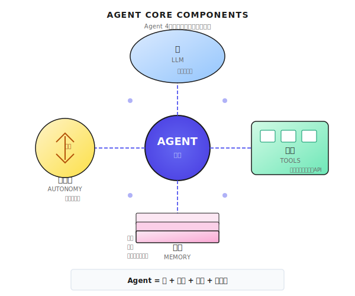
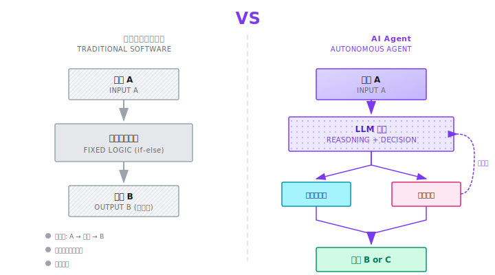
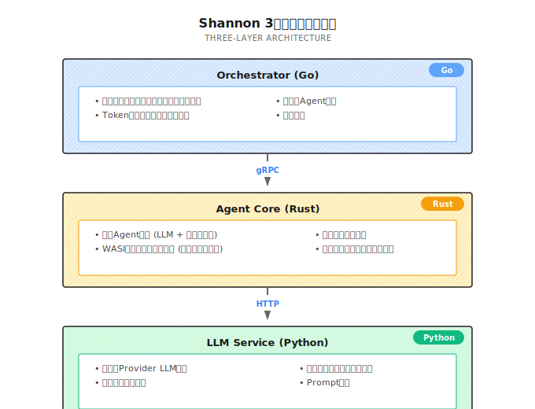

# 第1章 エージェントの本質
── 「自律的に動く」って、どういうこと？

> **エージェント（Agent）は自分でタスクを完遂できるAIです。ポイントは「自分で判断する」こと。言われた通りに動くだけじゃない。**

---

ChatGPTと話したことありますか？

めちゃくちゃ賢いですよね。何を聞いても答えてくれる。でも一つ問題があるんです。**こっちが1つ言うと、向こうが1つ返す**。ずっと追加で聞いて、誘導して、コピペして……の繰り返し。

筆者がこの問題に気づいたのは、新幹線のチケットを取ろうとしたときでした。

「明日の東京から大阪の新幹線、取っておいて」と頼んだんです。

返ってきた答えは：「承知しました。こちらにいくつかの列車がありますね。予約サイトで取れますよ。」

……で、終わり。

まあ、これはChatGPTだけの責任じゃないんですよね。

新幹線の予約って「副作用」がある操作なんです。ログインして、列車を選んで、乗車人数を入力して、決済して、キャンセル規定も確認しないといけない。どこかでミスったら、痛い目を見るのは自分です。

だから、ツールもなく、権限もなく、「大事なところで確認を取る」仕組みもない状態では、情報は出せても代わりに予約はできない。当然といえば当然です。

本当のエージェントとの違いもここにあります。会話がうまいかどうかじゃない。システムとして**安全に行動できる**かどうか。必要な権限があり、ヤバいところでは止まって承認を求め、全プロセスがログに残る。

これがチャットボットとエージェントの分水嶺です。

---

## 1.1 エージェントって何？

### 一言で言うと

**自分で仕事ができるAI**です。

もうちょっとエンジニア的に言うと：目標とツールボックス、そして制約（予算・権限・承認フロー・サンドボックス）を渡すと、ループの中でタスクを進めていく。完了するか、停止条件に達するまで。

1つ言って1つ返すんじゃなくて、ゴールを伝えたら自分で何とかする：
- 調べ物が必要？　自分で調べる
- コード書く？　自分で書く
- API叩く？　自分で叩く
- 途中でコケた？　自分で直す

### 4つのコアパーツ

SF映画っぽいですか？　実はそんな複雑じゃないんです。核心は4つだけ：



```
エージェント = 脳 + 手足 + 記憶 + 自律性
              (LLM)  (Tools) (Memory) (Autonomy)
```

**脳（LLM）**：考える担当。次に何するか決める。エージェントのコアエンジンですね。これがないとただの硬いスクリプト。

**手足（Tools）**：実行する担当。Web検索、ファイル読み書き、API呼び出し、ブラウザ操作とか。LLMは「考える」だけ。Toolsがあって初めて「動ける」。

**記憶（Memory）**：今まで何があったか覚えておく担当。短期記憶は今の会話のコンテキスト。長期記憶はセッションをまたいだ知識の蓄積。これがないと毎回ゼロからスタートで、効率悪すぎます。

**自律性（Autonomy）**：これが一番大事。自分で判断を下せないといけない。1歩言われて1歩動くんじゃなくて。普通のチャットボットとの根本的な違いはここ。

一つ補足。本番システムでは「ガードレール」も必要です。エージェントの部品じゃないけど、本番に出せるかどうかを決める。予算、権限、承認、監査、サンドボックス。ガードレールなしのエージェントは、遅かれ早かれ「自分で仕事する」から「自分でトラブル起こす」に変わりますよ。

### 従来のソフトウェアとの違い

従来のソフトウェアは**決定論的**。入力Aなら、必ず出力B。`if-else`書いたら、永遠にそのロジック通り。

エージェントは**非決定的**。入力Aに対して「考えて」、Bを出すかもしれないし、Cを出すかもしれない。出力や経路が毎回揺れる可能性がある。

柔軟性が生まれる反面、不確実性も生まれる。この不確実性をどうコントロールするかが、エージェント設計の核心的な課題の一つです。



```
従来ソフトウェア:  入力 → 固定ロジック → 出力
エージェント:      入力 → LLM思考 → ツール呼び出し → 結果観察 → また思考 → ... → 出力
```

---

## 1.2 具体例で見てみよう

エージェントにこう頼んだとします：

> 「メルカリについて調べて、分析レポート書いて。」

### チャットボットの場合

ChatGPTは学習データにある情報を返して、「最新情報が必要なら、自分で検索してくださいね」と言う。

以上。検索も整理もレポート作成も、全部自分でやることになります。

### エージェントの場合

本物のエージェントはこう動く：

**ステップ1：タスク分解**

```
ユーザー目標: メルカリを調査し、分析レポート作成
サブタスク:
├── 1. 会社の背景を検索
├── 2. 事業構造とサービスを調査
├── 3. 競合（ヤフオク、ラクマ等）を分析
├── 4. 財務・上場情報を調査
└── 5. レポートにまとめる
```

**ステップ2：順番に実行**

```
[サブタスク1を実行]
思考: メルカリの背景情報を調べないと
行動: 検索ツール呼び出し、query="メルカリ 創業 歴史"
観察: 10件ヒット。創業者、設立年、成長過程の情報あり
思考: OK、これは十分。記憶に保存して次へ

[サブタスク2を実行]
思考: サービス内容を把握しないと
行動: 検索ツール呼び出し、query="メルカリ 事業 サービス一覧"
観察: メルカリ、メルペイ、メルカリShopsなどの情報
思考: もう少し詳しく必要だな
行動: 再検索、query="メルカリ 売上構成 2024"
観察: IR資料の分析記事発見
...
```

**ステップ3：セルフチェック**

```
チェックリスト:
✓ 会社背景 - 収集済み
✓ 事業構造 - 収集済み
✓ 競合分析 - 収集済み
✗ 財務情報 - ちょっと足りない、補足必要
```

**ステップ4：最終出力**

全部の情報を構造化したレポートにまとめて、提出。

このプロセス全体で、あなたが言ったのは一言だけ。残りはエージェントが全部やった。

**これがエージェントです。**

「会社調査」がコンサルっぽすぎるなら、もっとエンジニア寄りのタスクにしましょうか：

> 「Shannonのリポジトリ開いて、ReActループの停止条件を見つけて、各条件が何の事故を防いでるか説明して。」

チャットボットは「こうあるべき」的な答えを並べがち。エージェントは実際にファイルを開いて、関数を特定して、設計意図をちゃんと説明する。

---

## 1.3 エージェントの自律性レベル

エージェントは白か黒かじゃなくて、**グラデーション**です。筆者は6段階に分けてます：

注意：このL0〜L5の分類は、議論しやすくするために筆者が作った尺度です。学術的な標準じゃありません。まずこれで感覚を掴んで、後の章でShannonの実装と照らし合わせていきます。

| レベル | 名前 | あなたが言う | エージェントがやる | 例 |
|--------|------|-------------|-------------------|-----|
| **L0** | Chatbot | 1つ質問 | 1つ回答 | ChatGPT基本会話 |
| **L1** | Tool Agent | 天気調べて | API叩いて結果返す | GPTsのActions |
| **L2** | ReAct Agent | 複雑な問題 | 思考→行動→観察ループ | LangChain ReAct |
| **L3** | Planning Agent | 大きいタスク | まず計画立てて、順に実行 | 本書の主題 |
| **L4** | Multi-Agent | もっと大きいタスク | 複数エージェントで分業 | Shannon Supervisor |
| **L5** | Autonomous | 曖昧な目標 | 長期自律運用、自己改善 | Devin、Manus |

### 各レベルの中身

**L0 - Chatbot**：純粋な会話だけ。ツール呼び出しなし。天気聞いても「リアルタイム情報は取得できません」で終わり。

**L1 - Tool Agent**：ツール呼び出せるけど、「調べてって言われたから調べた」レベル。複数ステップの推論はない。

**L2 - ReAct Agent**：「思考-行動-観察」を複数ラウンド回せる。エージェントの入門形態。次章で詳しくやります。

**L3 - Planning Agent**：複雑なタスクをサブタスクに分解して、計画立ててから実行。L2に「考えてから動く」能力が加わったもの。

**L4 - Multi-Agent**：専門化した複数のエージェントが協力。検索担当、分析担当、執筆担当、みたいな。エンタープライズ用途の主流形態です。

**L5 - Autonomous**：長期間自律運用して、環境のフィードバックで戦略調整して、自己改善までできる。正直、**今の時点で本当に信頼できるL5エージェントは存在しない**。DevinやManusがこの方向を探ってるけど、まだまだ。

### 本書のカバー範囲

多くの人が使ってるのはL0〜L1。本書は主に**L2〜L4**の作り方を解説します。

L5？　「ある」って言う人がいたら、話半分で聞いといてください。

---

## 1.4 エージェントにできること、できないこと

エージェントを過大評価してる人、多すぎます。何でもできると思ってる。

**違います。**

### エージェントが得意なシナリオ

| 特徴 | 例 | なぜ向いてる？ |
|------|-----|---------------|
| **目標が明確** | 「この記事を要約して」 | 成功基準がはっきりしてる |
| **ステップに分解できる** | 「この手順でデータ処理して」 | サブタスクに分けられる |
| **結果が検証できる** | 「コード動けばOK」 | 完了判定ができる |
| **情報が取れる** | 「この会社について調べて」 | データ取得のツールがある |
| **繰り返しが多い** | 「毎朝ニュースまとめて送って」 | 自動化の価値が高い |

### エージェントが苦手なシナリオ

| 特徴 | 例 | なぜ向いてない？ |
|------|-----|-----------------|
| **オープンな創造性** | 「革新的なビジネスモデル考えて」 | 基準がない、イテレーション困難 |
| **主観的判断** | 「このデザイン、いい感じ？」 | 人間の美的感覚や価値観が必要 |
| **複雑な人間関係** | 「このクライアント何とかして」 | EQ、関係性、空気を読む力が要る |
| **高リスクな意思決定** | 「投資するか決めて」 | 責任の所在問題 |
| **取り返しのつかない操作** | 「全社メール一斉送信して」「本番DB消して」 | ミスったら終わり |
| **リアルタイムの物理操作** | 「料理作って」 | 物理ロボットが必要 |

### シナリオ選びが全て

いいシナリオ選べば、エージェントは時間を大幅に節約してくれる。間違えると、**トークン燃やすだけのマシン**になる。

多くのことは「できない」んじゃなくて、「確認ポイント入れないとやらせられない」んです。決済、公開、削除、一斉送信……デフォルトは人間が承認、エージェントが実行。

判断の簡単な目安：

> インターン生に任せるとして、テキストで「こうやって」と説明できるなら、たぶんエージェント向き。
> 自分でも「何をもって完了？」が説明できないなら、エージェントにも無理。

---

## 1.5 エージェント技術の進化

エージェントは急に出てきた概念じゃありません。ちゃんと系譜がある。

### 2022年以前：ルールベース

初期の「インテリジェントアシスタント」（Siri、Alexaとか）は、本質的にはルールエンジン＋意図認識。ユーザーが話すと、意図を認識して、プリセットのルールにマッチさせて、対応アクションを実行。

```
ユーザー: 「明日の朝7時に起こして」
システム: 意図=アラーム設定、パラメータ=7:00、実行=アラーム作成
```

柔軟性ゼロ。プリセット外の意図には対応できない。

### 2023年：LLMが脳になる

GPT-4とかの大規模モデルが出てきて、ゲームが変わった。LLMができるようになったこと：
- 複雑で曖昧な自然言語指示の理解
- 複数ステップの推論
- 構造化出力（JSONとか）の生成

「LLMでツール呼び出しを駆動する」のが現実的になった。

### 2023〜2024年：ReActとFunction Calling

重要なブレイクスルーが2つ：

1. **ReAct論文**（2022年）：「Reason + Act」のループパターン提案。LLMが考えながら行動できるように
2. **Function Calling**（2023年）：OpenAIとかがネイティブでツール呼び出しサポート。LLMが構造化された関数呼び出しを出力できるように

この2つが組み合わさって、エージェントが実用的になり始めた。

### 2024〜2025年：マルチエージェントと本番化

単体エージェントには限界がある。マルチエージェント協調が主流に。同時に企業が気にし始めたこと：
- コスト管理（トークン予算）
- セキュリティ（サンドボックス実行）
- 信頼性（永続化、リトライ）
- オブザーバビリティ（監視、トレーシング）

これが本書の焦点です：**本番で動くエージェントシステム**。

---

## 1.6 Shannonアーキテクチャ概要

本書は[Shannon](https://github.com/Kocoro-lab/Shannon)を参考実装として使います。3層アーキテクチャのマルチエージェントシステムです：



### なぜ3層？

| 層 | 言語 | 役割 | なぜこの言語？ |
|----|------|------|---------------|
| Orchestrator | Go | 編成、スケジューリング | 並行処理に強い |
| Agent Core | Rust | 実行、隔離 | 高性能、メモリ安全 |
| LLM Service | Python | モデル、ツール | エコシステム豊富 |

### Shannonがカバーするエージェントレベル

| やりたいこと | Shannonのパターン | レベル |
|-------------|------------------|--------|
| シンプルQ&A + ツール | SimpleTask | L1 |
| 思考-行動ループ | ReAct | L2 |
| 複雑なタスク分解 | DAG | L3 |
| マルチエージェント協調 | Supervisor | L4 |

### Shannonだけじゃない

Shannonは唯一の選択肢じゃないです。LangGraph、CrewAI、AutoGenでも似たことはできる。Shannonを選んだ理由：

1. **本番レベル設計**：Temporal永続化、トークン予算、WASIサンドボックス搭載
2. **3層分離**：責務が明確で理解しやすい
3. **オープンソースで読みやすい**：コード量が適度

本書の目的は**設計パターン**を教えること。Shannonの使い方じゃない。他のフレームワークでも同じパターンは実装できます。

## Shannon Lab（10分で始める）

本章の概念をShannonソースに対応付けます。

### 必読（1ファイル）

- [`docs/multi-agent-workflow-architecture.md`](https://github.com/Kocoro-lab/Shannon/blob/main/docs/multi-agent-workflow-architecture.md)：全体図を見て「Router/Strategy/Pattern」の分業を掴む

### 選択で深掘り（興味に応じて）

- [`orchestrator_router.go`](https://github.com/Kocoro-lab/Shannon/blob/main/go/orchestrator/internal/workflows/orchestrator_router.go)：ReAct/DAG/Supervisorの使い分け判定
- [`wasi_sandbox.rs`](https://github.com/Kocoro-lab/Shannon/blob/main/rust/agent-core/src/wasi_sandbox.rs)：サンドボックスがどうツール実行を隔離してるか

---

## 1.7 よくある誤解

### 誤解1：エージェント = ChatGPT + プラグイン

ちょっと違います。プラグインは「ツール」でしかない。エージェントの核心は**自律的な意思決定ループ**。ツールがあればエージェントってわけじゃなくて、「いつ何のツールを使うか」を自分で決められることが重要。

### 誤解2：エージェントは人間を置き換える

無理です。少なくとも今は。エージェントは**強化ツール**であって、代替品じゃない。繰り返しの多い構造化タスクは助けてくれるけど、目標設定、監視、検収は人間の仕事。

### 誤解3：自律的であればあるほどいい

そうとも限らない。自律性が高いほど不確実性も高い。本番環境では「自律性」と「コントロール可能性」のバランスが大事。完全自律は暴走リスク。完全制御は意味がない。

### 誤解4：最強モデル使えばOK

モデル能力は基礎でしかない。エージェントの品質を決めるのは：
- ツール設計が妥当か
- プロンプトが明確か
- エラーハンドリングが充実してるか
- アーキテクチャが拡張に耐えるか

GPT-4で雑なプロンプト動かすより、GPT-3.5で練り込んだシステム動かす方がいい結果出ます。

---

## 1.8 本章のポイント

1. **エージェントの定義**：自分でタスク完遂できるAI。核心は「自分で判断」
2. **4つのパーツ**：脳(LLM) + 手足(Tools) + 記憶(Memory) + 自律性(Autonomy)
3. **自律性レベル**：L0〜L5。本書はL2〜L4にフォーカス
4. **向いてるシナリオ**：目標明確、分解可能、検証可能なタスク
5. **Shannonの位置づけ**：3層構成の本番レベルマルチエージェント、本書の参考実装

### 演習（先にやってから読み進めてください）

1. 「新幹線取って」を実行可能なエージェント目標に書き換える。含めるべき：**成功基準**、**確認が必要なステップ**、「失敗したらどうする」
2. 自分なりのエージェント定義を一文で書いて、Shannonで「根拠ファイル」を3つ探す（ルーティング、実行、ガードレール等）

---

## 1.9 参考文献

- **ReAct論文**：[ReAct: Synergizing Reasoning and Acting in Language Models](https://arxiv.org/abs/2210.03629) - 思考-行動ループの理論
- **Generative Agents**：[Generative Agents: Interactive Simulacra of Human Behavior](https://arxiv.org/abs/2304.03442) - Stanford Agent村実験
- **OpenAI Function Calling**：[公式ドキュメント](https://platform.openai.com/docs/guides/function-calling) - ツール呼び出しの実装

---

## 次章の予告

「エージェントは自分で仕事するって言うけど、具体的にどうやって思考して、行動して、また思考するの？」

それが次章の内容──**ReActループ**。

ReActはエージェントの心臓部。これを理解すれば、エージェントの最も核心的な動作メカニズムを理解したことになります。
