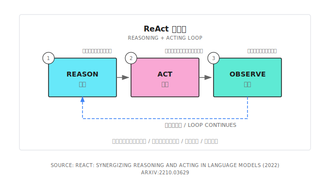

# 第 2 章：ReAct ループ

> **ReAct はエージェントの心臓だ。一歩考え、一歩動き、結果を見て、また考える。これで AI のでっち上げが減り、ちゃんと「仕事してる」感が出る。**
> **ただし、正解が保証されるわけじゃない。予算、停止条件、検収こそが本番での本当のガードレールになる。**

---

前章で、エージェントの核心は「自分で動く」ことだと話した。

でも、具体的にはどう動いてるの？ 頭の中で何を考えてる？ 毎ステップ、どうやって決めてるの？

答えは **ReAct**。Reasoning + Acting、つまり推論と行動の交互ループだ。

エージェントの最も根本的な動作原理がこれ。ReAct が分かれば、エージェントの心臓が分かる。

---

## 2.1 具体的なシナリオから始めよう

「競合の価格戦略を調べて」とエージェントに頼んだとする。

### 普通の ChatGPT の場合

> 「価格戦略には一般的にコストプラス法、競争ベース価格設定、バリューベース価格設定などがあります...」

間違いじゃないけど、これ、質問を回避してるよね。欲しいのは「競合は誰で、いくらで、どんなプランがあって、制限は何か」。「価格戦略の百科事典」じゃない。

競合が誰かも知らないし、調べに行ってもいない。だから得られるのは「それっぽく聞こえるけど、行動に移せない」回答。

### ReAct エージェントの場合

```
[ラウンド 1]
思考：ユーザーは「競合」と言ったけど、どこの会社かは言ってない。先に確認しないと、調べても意味がない。
行動：ユーザーに追加質問：「競合とは具体的にどの会社ですか？名前か URL を教えてください」
観察：ユーザー回答「主に『競合A社』を見てほしい」

[ラウンド 2]
思考：名前が分かった。まず公式の価格ページを探す。優先順位は公式サイト、次にドキュメント/FAQ。
行動：検索ツール呼び出し、query="競合A社 pricing"
観察：公式価格ページ + レビュー記事2件を発見

[ラウンド 3]
思考：公式価格ページを読んで、正確な数字とプランの違いを把握しよう。
行動：Webページ読み取りツールで公式価格ページにアクセス
観察：ベーシック $29/月、プロ $99/月、エンタープライズは要問い合わせ。機能比較表あり...

[ラウンド 4]
思考：情報を比較表にまとめて、「うちと競合」の違いも付け加えよう。
行動：分析レポート生成（ソースリンク付き）
観察：レポート生成完了

[出力]
競合A社の価格戦略分析：
- ベーシック：$29/月、個人ユーザー向け
- プロ：$99/月、小規模チーム向け
- エンタープライズ：要問い合わせ、大企業向け
段階的価格戦略を採用。当社の $49/月と比較すると...
```

違いが分かるよね？

一気に答えを当てずっぽうで出すんじゃなく、**考えながら動いて、動いた後にまた考える**。

これが ReAct の核心：**Reason（思考）→ Act（行動）→ Observe（観察）**のループを、タスクが終わるまで繰り返す。

> **注意**：ReAct は魔法じゃない。「自動的に正解になる」んじゃなくて、「当てずっぽう」を「調べる＋証拠＋巻き戻し可能」に変えるだけ。間違えることはあるけど、どこで間違えたか見えるし、軌道修正もしやすい。

---

## 2.2 ReAct の本質：なぜこのループが効くのか？

### LLM の生まれつきの弱点

LLM は本来「一気に言い切る」タイプ。質問すると、まとまった段落をドバっと生成する。途中で「さっき言ったこと、合ってるかな」とは考えないし、資料を調べに行くこともない。

これが2つの問題を生む：

| 問題 | 症状 | 結果 |
|------|------|------|
| **情報が古い** | 訓練データの知識しか使えない | 回答が数ヶ月前の古い情報かも |
| **検証できない** | 言ったら終わり、確認しない | 細部をでっち上げて、自信満々に嘘をつく |

### ReAct はどう解決するか

ReAct は LLM に「止まれ」と強制する：

```
こうじゃなく：質問 → 一気に回答生成
こう：質問 → 一歩考える → 一歩動く → 結果を見る → また考える → また動く → ... → 回答
```

これで3つの重要なメリットが生まれる：

| メリット | 説明 | 例 |
|----------|------|------|
| **新しい情報を取れる** | 既存知識ででっち上げず、調べに行ける | 最新の製品価格を検索 |
| **間違いを直せる** | 道を間違えたら、戻れる | 検索結果がダメなら、別のキーワードで再検索 |
| **過程を追える** | 全ステップが記録され、どこで問題が起きたか分かる | デバッグ時にどのステップが間違いか特定 |

### 学術的な背景

ReAct は 2022 年の論文から来ている：[ReAct: Synergizing Reasoning and Acting in Language Models](https://arxiv.org/abs/2210.03629)

核心となる発見はシンプル：

> **推論と行動を交互に行うと、どちらか一方だけより強い。**

- 推論だけで行動なし（Chain-of-Thought）：考えは良いけど、新しい情報が取れない
- 行動だけで推論なし（直接 Function Calling）：無計画にツールを叩いて、なぜ叩いたか分からない
- 推論＋行動（ReAct）：なぜやるか考えてから動き、結果を見て次を決める

この洞察が現代エージェントの基盤になった。

---

## 2.3 3つのフェーズを分解する



```
┌──────────────────────────────────────────────────────────────┐
│                        ReAct ループ                          │
│                                                              │
│    ┌──────────┐     ┌──────────┐     ┌──────────┐           │
│    │  REASON  │ ──▶ │   ACT    │ ──▶ │ OBSERVE  │           │
│    │   思考    │     │   行動    │     │   観察    │           │
│    └──────────┘     └──────────┘     └──────────┘           │
│         ▲                                  │                 │
│         │                                  │                 │
│         └────────── ループ継続 ◀──────────────┘                 │
│                                                              │
│    停止条件：タスク完了 / 最大ラウンド数到達 / 進展なし           │
└──────────────────────────────────────────────────────────────┘
```

### Reason（思考）

現状を分析して、次に何をするか決める。

```
入力：ユーザーの目標 + これまでの観察結果
出力：次にやること、なぜやるか
```

**重要な原則：一歩だけ考える。** LLM に先のことまで考えさせると発散する。「今ある情報で、次のアクションは何？」とだけ聞く。

### Act（行動）

ツールを呼び出し、アクションを実行。

```
入力：思考フェーズで決めたアクション
出力：実行結果
```

> **提示**：1ラウンドにつき1つの重要アクションだけ進める。特に初期のデバッグ時は大事。アクションが小さいほど、問題の特定が楽。フローが安定したら、ツールの並列呼び出しで高速化を検討。

よくあるアクションの種類：
- 追加質問／確認（Clarify）
- 検索（Web Search）
- ファイル読み取り（Read File）
- ファイル書き込み（Write File）
- API 呼び出し（HTTP Request）
- コード実行（Code Execution）

### Observe（観察）

実行結果を記録して、次ラウンドの Reason フェーズに渡す。

```
入力：アクションの実行結果
出力：構造化された観察記録
```

**重要な原則：観察は客観的に。** このフェーズでは判断しない。事実だけ記録。判断は次の Reason に任せる。

---

## 2.4 いつ止めるべきか？

これは ReAct で最も重要な問題の一つ。止めるのが早すぎればタスクは未完了。遅すぎればトークンを使い果たす。

### 6つの停止条件（2つはハードなガードレール）

| 条件 | 説明 | 優先度 |
|------|------|--------|
| **ユーザー中断** | ユーザーが自分で停止 | 最高 |
| **タスク完了** | LLM が明示的にタスク完了を宣言 | 高 |
| **予算切れ** | トークン/コスト上限に到達、強制停止 | 高（ガードレール） |
| **タイムアウト** | エンドツーエンドの時間上限に到達、強制停止 | 高（ガードレール） |
| **結果の収束** | 2回連続で観察結果がほぼ同じ、進展なし | 中 |
| **最大ラウンド数** | 事前設定の MaxIterations に到達 | 兜底 |

### 判定ロジックの例

```go
func shouldStop(state *ReactState) bool {
    // 0. ユーザー中断、即座に停止
    if state.UserCanceled {
        return true
    }

    // 0.5 予算/タイムアウトはハードなガードレール
    if state.TokensUsed >= state.Config.TokenBudget {
        return true
    }
    if time.Since(state.StartTime) > state.Config.Timeout {
        return true
    }

    // 1. 最大ラウンド数に到達、強制停止
    if state.Iteration >= state.Config.MaxIterations {
        return true
    }

    // 2. 最小ラウンド数未満なら継続
    if state.Iteration < state.Config.MinIterations {
        return false
    }

    // 3. LLM が明示的に完了を宣言
    if containsCompletionSignal(state.LastThought) {
        return true
    }

    // 4. 結果が収束、進展なし
    if isResultConverged(state.Observations) {
        return true
    }

    return false
}
```

---

## 2.5 デバッグの完全な事例

ユーザーが「なんで API が 500 エラー返すか調べて」と言ったとする。

### ループの実行過程

```
[ラウンド 1]
思考：500 エラーは通常サーバー側の問題。ログを見る必要がある
行動：実行 tail -n 50 /var/log/app.log
観察：NullPointerException at UserService.java:45 を発見

[ラウンド 2]
思考：NPE を見つけた。場所は UserService.java の 45 行目。コードを見よう
行動：src/UserService.java の 40-50 行目を読み取り
観察：45 行目は user.getProfile().getName()

[ラウンド 3]
思考：問題が分かった。user.getProfile() が null を返す可能性があり、null チェックがない
行動：修正案を生成
観察：アクセス前に null チェックを追加する提案

[ラウンド 4]
思考：問題特定完了、解決策もある。タスク完了
行動：最終レポートを出力
観察：レポート生成完了

[終了：LLM がタスク完了を宣言]
```

### 最終出力

```
問題分析：
API が 500 エラーを返すのは、UserService.java の 45 行目で
NullPointerException が発生しているため。
ユーザーが profile を設定していない場合、getProfile() が null を返し、
直接 getName() を呼ぶと NullPointerException になる。

修正案：
profile にアクセスする前に null チェックを追加：
if (user.getProfile() != null) {
    String name = user.getProfile().getName();
}
または Optional を使用：
String name = Optional.ofNullable(user.getProfile())
    .map(Profile::getName)
    .orElse("Unknown");
```

4ラウンドで、問題を特定し、解決策も出た。

**ReAct がなかったら？** LLM はおそらく「よくある 500 の原因」を並べる——データベース接続失敗、メモリ不足、設定ミス——でもどれも実際の問題じゃない。

---

## 2.6 本番環境での重要な設定

本番環境では、ReAct は「動けばいい」じゃなく、「動き続けて、止まるべき時に止まって、問題が起きたら振り返れる」ことが求められる。

この設定を説明するのに Shannon を使うのが好きだ。よくある事故が直接コードに書き込まれているから。「無限ループ / 早すぎる終了 / コンテキスト爆発 / 証拠なしの結論」をどう防いでいるか、ソースで確認できる。

Shannon では主に2層のパラメータに触れる：
- **ループパラメータ**（ReAct 自体の形態）：`ReactConfig`
- **予算ガードレール**（パターン共通）：`Options.BudgetAgentMax` + workflow/activity のタイムアウト

Shannon の `ReactConfig` は [`patterns/react.go`](https://github.com/Kocoro-lab/Shannon/blob/main/go/orchestrator/internal/workflows/patterns/react.go) で定義されている（抜粋）：

```go
type ReactConfig struct {
    MaxIterations     int
    MinIterations     int
    ObservationWindow int
    // MaxObservations / MaxThoughts / MaxActions ...
}
```

トークン予算は `ReactConfig` ではなく、汎用の `Options`（[`patterns/options.go`](https://github.com/Kocoro-lab/Shannon/blob/main/go/orchestrator/internal/workflows/patterns/options.go)）に置かれている：

```go
type Options struct {
    BudgetAgentMax int
    // ...
}
```

この分け方が良いと思う。予算は ReAct 専用じゃなく、Chain-of-Thought、Debate、Tree-of-Thoughts も同じ予算制約を受けるべきだから。

### なぜ MaxIterations が必要か？

エージェントが一つの検索結果にハマって何度もループし、数万トークン消費しても止まらないのを見たことがある。

**実際の事例**：エージェントが「Python インストール方法」を検索。最初の結果が広告ページで、読んだけど使えない。再検索しても同じ広告ページ（検索ワードが変わってないから）。また読んで、また使えない... 20回ループして、何も成果なし。

だからハード制限が必須。本番環境では MaxIterations = 10-15 を推奨。

### なぜ MinIterations が必要か？

タスクによっては、エージェントが1ラウンド目で「完了しました」と言うけど、実際は何もしてない。

**実際の事例**：ユーザーが「明日の東京の天気を教えて」と聞くと、エージェントが「明日の東京は晴れ、気温 15 度です」と回答——でも天気 API を一切呼んでない。これはでっち上げ。

MinIterations = 1 を強制して、最低1回は実際にツールを呼ばせる。

### なぜ ObservationWindow が必要か？

観察履歴がどんどん溜まると、コンテキストがどんどん大きくなり、トークンコストが制御不能に。

```go
// 直近 5 件の観察だけ保持
recentObservations := observations[max(0, len(observations)-5):]
```

古い観察は要約に圧縮して、キーとなる情報を残し、詳細は捨てる。

### Shannon が追加でやっている「本番向け」の2つのこと

1. **早めに停止（MaxIterations を使い切るまで待たない）**：`shouldStopReactLoop` が「結果の収束 / 新しい情報なし」を検出する。例えば2回連続で observation が似ていれば停止（ソースには cheap だけど効果的な `areSimilar` がある）
2. **証拠がないと終われない**：research モードでは `toolExecuted`、`observations` などの条件をチェックし、モデルが何も調べずに「完了」と言うのを防ぐ

## Shannon Lab（10分で始める）

本セクションで、本章の概念を Shannon ソースコードにマッピングする。

### 必読（1ファイル）

- [`patterns/react.go`](https://github.com/Kocoro-lab/Shannon/blob/main/go/orchestrator/internal/workflows/patterns/react.go)：`Phase 1/2/3` + `shouldStopReactLoop` を検索して、ループと「早期停止」の理由を理解する

### 選読（2つ、興味に応じて）

- [`patterns/options.go`](https://github.com/Kocoro-lab/Shannon/blob/main/go/orchestrator/internal/workflows/patterns/options.go)：`BudgetAgentMax` がなぜ汎用 Options に入っているか（ReactConfig に入れない理由）を確認
- [`strategies/react.go`](https://github.com/Kocoro-lab/Shannon/blob/main/go/orchestrator/internal/workflows/strategies/react.go)：ReactWorkflow がどう設定をロードし、memory を注入し、ReactLoop を実行するか確認

---

## 2.7 よくある落とし穴

### 落とし穴 1：無限ループ

**症状**：エージェントが同じことを繰り返し、止まらない。

**原因**：検索ワードが変わらず、結果も変わらないが、エージェントは繰り返していることに気づかない。

**解決策**：
- MaxIterations のハード制限を追加
- 類似性検出を追加：2回連続で観察結果が非常に似ていたら、強制停止または戦略変更（Shannon には `areSimilar` という cheap なヒューリスティックがある）
- プロンプトで注意：「結果が前回と同じなら、別の方法を試して」

### 落とし穴 2：早すぎる終了

**症状**：エージェントが1ラウンド目で「完了しました」と言うが、実際は何もしてない。

**原因**：LLM がサボって、既存知識でそれっぽい回答をでっち上げ。

**解決策**：
- MinIterations を追加、最低1回はツール呼び出しを強制
- プロンプトで明示：「ツールを使って情報を取得すること。直接回答してはいけない」

### 落とし穴 3：トークン爆発

**症状**：数ラウンドでコンテキスト長が急増、コストが制御不能に。

**原因**：毎回の観察を全部保持し、履歴がどんどん増える。

**解決策**：
- ObservationWindow を制限、直近数件だけ見る
- 古い観察を要約圧縮
- 予算ガードレールを設定（例：Shannon の `Options.BudgetAgentMax`）

### 落とし穴 4：思考と行動が乖離

**症状**：LLM が考えていることと、やっていることが別物。

**原因**：Reason と Act フェーズのプロンプトがうまく繋がっていない。

**解決策**：Act フェーズで Reason の出力を明示的に参照：

```
あなたの直前の思考：{thought}
この思考に基づいて、対応するアクションを実行してください。
```

---

## 2.8 他のフレームワークはどうしてる？

ReAct は汎用パターンであり、Shannon 専用じゃない。各社が実装している：

| フレームワーク | 実装方法 | 特徴 |
|----------------|----------|------|
| **LangChain** | `create_react_agent()` | 最も広く使われている、エコシステムが豊富 |
| **LangGraph** | 状態グラフ + ノード | 可視化デバッグ、フロー制御可能 |
| **OpenAI** | Function Calling | ネイティブサポート、低レイテンシー |
| **Anthropic** | Tool Use | Claude ネイティブサポート |
| **AutoGPT** | カスタムループ | 高度に自律的、ただし不安定 |

コアロジックは全部同じ：思考 → 行動 → 観察 → ループ。

違いは：
- ツール定義のフォーマット（JSON Schema vs カスタムフォーマット）
- ループ制御の粒度（フレームワーク制御 vs ユーザー制御）
- エコシステム統合（ベクトル DB、モニタリング、永続化）

どれを選ぶ？ シナリオ次第。クイックプロトタイプなら LangChain、本番システムなら LangGraph か自前ビルドを検討。

---

## 2.9 本章のポイント

1. **ReAct の定義**：Reasoning + Acting、推論と行動の交互ループ
2. **3つのフェーズ**：Reason（思考）→ Act（行動）→ Observe（観察）
3. **なぜ効くか**：LLM が新しい情報を取得でき、間違いを修正でき、過程を追跡できる
4. **停止条件**：タスク完了 / 結果収束 / 最大ラウンド数 / ユーザー中断 + 予算/タイムアウトのガードレール
5. **重要な設定**：MaxIterations（無限ループ防止）、MinIterations（サボり防止）、ObservationWindow（コスト管理）+ Budget/Timeout（ハードなガードレール）

---

## 2.10 延伸資料

- **ReAct 論文**：[ReAct: Synergizing Reasoning and Acting in Language Models](https://arxiv.org/abs/2210.03629) - 元論文、設計動機を理解する
- **LangChain ReAct**：[公式ドキュメント](https://python.langchain.com/docs/modules/agents/agent_types/react) - 最も人気のある実装
- **Chain-of-Thought との比較**：[Chain-of-Thought Prompting](https://arxiv.org/abs/2201.11903) - 「推論だけで行動なし」の限界を理解
- **Shannon Pattern Guide**：[`docs/pattern-usage-guide.md`](https://github.com/Kocoro-lab/Shannon/blob/main/docs/pattern-usage-guide.md)（ユーザー視点で各種推論パターンの設定方法を確認）

---

## 次章の予告

「エージェントは何を使って『動く』の？」と思うかもしれない。検索、ファイル読み取り、API 呼び出し、これらの能力はどこから来るのか？

それが次章の内容——**ツール呼び出しの基礎**。

ツールはエージェントの手足。ReAct は考え方を教え、ツールが実際に動けるようにする。

ツールのないエージェントは、手のない人と同じ——どんなに良いことを考えても、何も実行できない。
