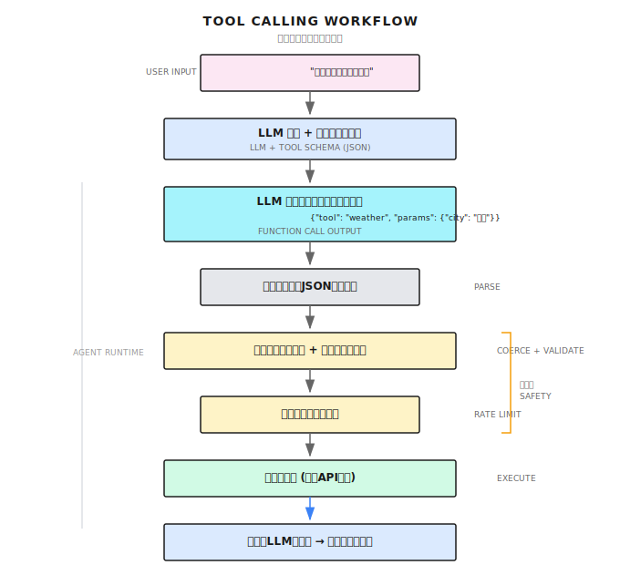
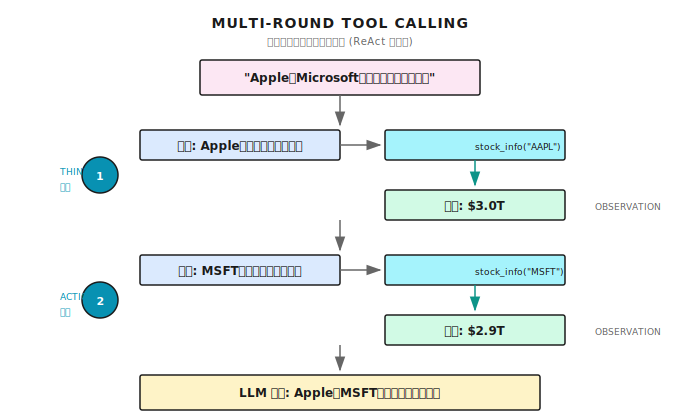

# 第 3 章：ツール呼び出しの基礎

> **ツールがあれば、LLM は「話すだけ」から「実行できる」に変わる。ただし、ツールは万能薬じゃない。description がダメだと、LLM は間違ったツールを選んで、パラメータも間違える。**

---

## 3.1 LLM の根本的な問題

まず、実際にあった話をしよう。

2023 年末、ある金融テック企業でカスタマーサポート用のエージェント（Agent）をデプロイした。最初の一週間は順調だったね。回答もスムーズで、ユーザー満足度も悪くなかった。

二週目に問題が起きた。ユーザーがこう聞いたんだ。「最新の住宅ローン金利はいくらですか？」

エージェントの回答はこうだった。「私のトレーニングデータによると、現在の基準金利は 4.35% です。」

クレームの電話が来た。「これ 2020 年の金利じゃないか！今は 3.65% だよ！」

**これが LLM の根本的な問題なんだ。LLM はトレーニングデータをもとに「でっち上げる」ことしかできない。リアルタイムの情報を調べることはできない。** モデルの知識はトレーニング時点で止まっている。今日の金利も、今日の天気も、今日のニュースも知らないわけさ。

一週間後、エージェントに金利照会 API を繋いだ。同じ質問に対して、まずツールを呼び出して調べてから、正確な答えを返すようになった。同じモデルでも、ツールを追加したら別物みたいになったよ。

### ツールがない LLM にできること

LLM には致命的な欠点がある。**調べることができない。でっち上げることしかできない。**

「今日の東京の天気はどう？」と聞くと、

「私のトレーニングデータによると、東京の気候は...」と答える。

**これはでっち上げだ。** 知識がトレーニング時点で止まっているから、今日の天気なんて知るわけがない。

| 質問タイプ | LLM の挙動 | 理由 |
|----------|-----------|------|
| **リアルタイム情報** | でっち上げか拒否 | トレーニングデータは過去のもの |
| **正確な計算** | よく間違える | 言語モデルであって電卓じゃない |
| **外部システム** | 何もできない | リクエストもファイル読み込みもできない |
| **プライベートデータ** | 全く知らない | トレーニング時に見ていない |

これらの問題を解決するには、LLM が「手を動かす」必要がある。API を叩いて天気を調べる、ウェブを検索して情報を探す、ファイルを読んでデータを確認する。

こういう「手を動かす」能力、それがツールだ。

---

## 3.2 Function Calling って何？

この用語で混乱する人が多いけど、実はシンプルなんだ。

**Function Calling = LLM に直接答えさせるんじゃなくて、「このツールを呼び出したい」と言わせる仕組み**

従来の LLM：
```
ユーザー：5 の階乗は？
LLM：5 の階乗は 120 です。
```

一見正しく見える。でも大きな数だと、LLM は計算を間違える可能性がある。13 の階乗を聞いてみな。間違った答えが返ってくることがあるよ。

Function Calling を使う LLM：
```
ユーザー：5 の階乗は？
LLM：{
  "tool": "calculator",
  "parameters": { "expression": "5!" }
}
```

直接計算するんじゃなくて、JSON を出力して「calculator ツールを呼び出したい」と言っているわけだ。

で、プログラムがこの JSON をパースして、本当に電卓を呼び出して、結果を LLM に返す。LLM がその結果をもとにユーザーに答える。

**これが Function Calling の本質。LLM に「助けを求める」ことを教える。「でっち上げる」んじゃなくてね。**

### なぜ JSON なのか？

プログラムがパースする必要があるからだ。LLM が自然言語で出力したら：

```
電卓を呼び出して、5 の階乗を計算してほしい
```

プログラムはどうやって「電卓」がどの関数かわかる？「5 の階乗」をどうやってパラメータに変換する？

JSON は構造化されているから、プログラムが直接パースできる：

```json
{"tool": "calculator", "parameters": {"expression": "5!"}}
```

`tool` がツール名、`parameters` がパラメータ。一目瞭然だよね。

---

## 3.3 ツールの構造

Shannon の実装を例に見てみよう。ツールは三つの部分で構成されている。

### 第一部分：メタデータ（このツールは何をするか）

**実装参考 (Shannon)**: [`tools/base.py`](https://github.com/Kocoro-lab/Shannon/blob/main/python/llm-service/llm_service/tools/base.py) - ToolMetadata クラス

```python
@dataclass
class ToolMetadata:
    name: str               # ツール名
    version: str            # バージョン
    description: str        # 何をするか（LLM 向け）
    category: str           # カテゴリ：search, calculation, file...

    # 本番環境で必須のフィールド
    requires_auth: bool = False      # 認証が必要か
    rate_limit: Optional[int] = None # 1 分あたりの最大呼び出し回数
    timeout_seconds: int = 30        # 最大実行時間
    memory_limit_mb: int = 512       # メモリ制限
    sandboxed: bool = True           # サンドボックス隔離するか
    dangerous: bool = False          # 危険な操作か
    cost_per_use: float = 0.0        # 1 回あたりのコスト
```

**なぜこれらのフィールドが必要なのか？**

| フィールド | 何を防ぐか | 実際のケース |
|---------|---------|-----------|
| `timeout_seconds` | ツールがハングしてエージェント全体を止める | ウェブページが 30 秒応答なし |
| `rate_limit` | エージェントが暴走して API 枠を使い切る | 1 分で検索 API を 200 回呼び出し |
| `dangerous` | 危険な操作はユーザー確認が必要 | ファイル削除、メール送信 |
| `cost_per_use` | コスト追跡と予算管理 | GPT-4 を 100 回呼んで請求書が爆発 |
| `sandboxed` | 悪意あるコードの脱出を防ぐ | ユーザー入力にシェルコマンドが含まれる |

これはオプションの「高度な機能」じゃない。本番環境では**必須項目**だよ。

こんなケースを見たことがある。エージェントがネットワーク問題をデバッグしていて、同じアドレスに延々と ping し続けた。1 分間に数百回ネットワークツールを呼び出して、クラウドプロバイダーの DDoS 保護を発動させた。IP がブロックされたよ。`rate_limit` があれば、こんなことにはならなかった。

### 第二部分：パラメータ定義（このツールは何を入力として必要とするか）

```python
@dataclass
class ToolParameter:
    name: str                    # パラメータ名
    type: ToolParameterType      # 型：STRING, INTEGER, FLOAT, BOOLEAN, ARRAY, OBJECT
    description: str             # 説明（LLM 向け）
    required: bool = True        # 必須か
    default: Any = None          # デフォルト値
    enum: Optional[List[Any]] = None      # 列挙値
    min_value: Optional[Union[int, float]] = None  # 最小値
    max_value: Optional[Union[int, float]] = None  # 最大値
    pattern: Optional[str] = None  # 正規表現バリデーション
```

> **重要**：description はめちゃくちゃ大事だ。一番多く見る問題は、LLM がパラメータの埋め方がわからないこと。description が曖昧すぎるからだ。

| 書き方 | 効果 |
|------|-----|
| `"The query"` | LLM はどんな形式で入力すればいいかわからない |
| `"検索キーワード。具体的な企業名、製品名、トピックを含める。例：'OpenAI GPT-4 料金 2024'"` | LLM は何を入力すればいいかわかる |

LLM は description を見てパラメータの埋め方を理解する。description が明確であればあるほど、LLM は正確に入力できる。

description の品質をチェックする方法がある：

> description を技術に詳しくない人に見せて、「何を入力すればいいかわかる？」と聞く。「わからない」と言われたら、LLM もたぶんわからない。

### 第三部分：実行ロジック（このツールは具体的に何をするか）

```python
async def _execute_impl(self, session_context=None, **kwargs) -> ToolResult:
    expression = kwargs["expression"]
    try:
        result = safe_eval(expression)  # 安全な計算、直接 eval() じゃない
        return ToolResult(success=True, output=result)
    except Exception as e:
        return ToolResult(success=False, error=str(e))
```

いくつかポイントがある：

1. **非同期**：`async` を使って他のリクエストをブロックしない
2. **安全**：直接 `eval()` せずに、AST ホワイトリストを使う
3. **構造化された返り値**：`ToolResult` には `success` フィールドがあり、エージェントは成功か失敗かがわかる

`ToolResult` の構造：

```python
@dataclass
class ToolResult:
    success: bool              # 成功か失敗か
    output: Any                # 返り値
    error: Optional[str] = None            # エラーメッセージ
    metadata: Optional[Dict[str, Any]] = None  # 追加メタデータ
    execution_time_ms: Optional[int] = None    # 実行時間
    tokens_used: Optional[int] = None          # 消費トークン（ツール内部で LLM を呼んだ場合）
```

---

## 3.4 ツールはどうやって LLM に理解されるか？

LLM は Python コードを直接読めない。「説明書」が必要だ。それが JSON Schema。

Shannon はツール定義を自動的にこんな JSON に変換する：

```json
{
  "name": "calculator",
  "description": "数学式を計算する。四則演算、べき乗、三角関数などをサポート",
  "parameters": {
    "type": "object",
    "properties": {
      "expression": {
        "type": "string",
        "description": "計算する数学式。例：'2 + 2'、'sqrt(16)'、'sin(3.14/2)'"
      }
    },
    "required": ["expression"]
  }
}
```

この JSON は LLM のプロンプトに埋め込まれる。LLM はこの「説明書」を見て、calculator というツールがあって、expression パラメータが必要だとわかる。

**だから、ツール定義の品質が LLM の呼び出し品質に直結するんだ。**

変換ロジックは `base.py` の `get_schema()` メソッドにある：

```python
def get_schema(self) -> Dict[str, Any]:
    properties = {}
    required = []

    for param in self.parameters:
        prop = {
            "type": param.type.value,
            "description": param.description,
        }
        if param.enum:
            prop["enum"] = param.enum
        if param.min_value is not None:
            prop["minimum"] = param.min_value
        # ... 他のフィールド

        properties[param.name] = prop
        if param.required:
            required.append(param.name)

    return {
        "name": self.metadata.name,
        "description": self.metadata.description,
        "parameters": {
            "type": "object",
            "properties": properties,
            "required": required,
        },
    }
```

---

## 3.5 LLM がパラメータを正確に埋めないときは？

これは実際に遭遇する問題だ。

たとえば整数パラメータを定義しても、LLM が `10` じゃなくて `"10"` を出力することがある。数値じゃなくて文字列ってことだね。

Shannon は型の強制変換をやっている（`_coerce_parameters` メソッドで）：

```python
def _coerce_parameters(self, kwargs: Dict[str, Any]) -> Dict[str, Any]:
    out = dict(kwargs)
    spec = {p.name: p for p in self.parameters}

    for name, param in spec.items():
        if name not in out:
            continue
        val = out[name]

        # 整数：浮動小数点（例：3.0）と数字文字列を受け入れる
        if param.type == ToolParameterType.INTEGER:
            if isinstance(val, float) and float(val).is_integer():
                out[name] = int(val)
            elif isinstance(val, str) and val.strip().isdigit():
                out[name] = int(val.strip())

        # ブーリアン：一般的な文字列形式を受け入れる
        elif param.type == ToolParameterType.BOOLEAN:
            if isinstance(val, str):
                s = val.strip().lower()
                if s in ("true", "1", "yes", "y"):
                    out[name] = True
                elif s in ("false", "0", "no", "n"):
                    out[name] = False

    return out
```

これは**フォールトトレランス**だ。LLM が常に完璧なデータ形式を出力すると思っちゃいけない。

もう一つ細かいポイントがある。パラメータに `min_value` と `max_value` がある場合、強制変換時に自動的にクランプする：

```python
# ユーザーが 999 を渡したけど max_value が 100 なら、自動的に 100 に切り詰める
if param.max_value is not None and out[name] > param.max_value:
    out[name] = param.max_value
```

これで後続のバリデーション失敗を避けられる。

---

## 3.6 ツール呼び出しの実際のフロー

ここまでの知識をつなげると、完全なフローはこうなる：



```
ユーザー：「東京の今日の天気は？」
         |
         v
    LLM が質問 + 利用可能なツールリスト（JSON Schema）を受け取る
         |
         v
    LLM がツール呼び出しが必要と判断し、出力：
    {
      "tool": "weather",
      "parameters": { "city": "東京" }
    }
         |
         v
    プログラムが JSON をパース
         |
         v
    パラメータ強制変換 + バリデーション（_coerce_parameters + _validate_parameters）
         |
         v
    レート制限チェック（rate limit）
         |
         v
    _execute_impl を呼び出し、実際の天気 API を実行
         |
         v
    API が結果を返し、ToolResult にラップ
         |
         v
    結果を LLM にフィードバック
         |
         v
    LLM が結果を統合して、ユーザーに回答：「東京は今日晴れ、気温 25 度です。」
```

これが一回の完全なツール呼び出しだ。

### 複数回のツール呼び出し

複雑なタスクは複数回のツール呼び出しが必要になることがある：



```
ユーザー：「Apple と Microsoft の時価総額を比較して」
         |
         v
    LLM が stock_info(symbol="AAPL") を呼び出す
         |
         v
    Apple の時価総額が返る
         |
         v
    LLM が stock_info(symbol="MSFT") を呼び出す
         |
         v
    Microsoft の時価総額が返る
         |
         v
    LLM が二つの結果を統合して、ユーザーに回答
```

これが前章で説明した ReAct ループだ。思考 -> 行動 -> 観察 -> 再思考 -> 再行動...

---

## 3.7 複数のツールを管理する

実際のシナリオでは、エージェントは一つのツールだけじゃない。検索、計算、ファイル読み込み、リクエスト送信...いろいろあるよね。

**実装参考 (Shannon)**: [`tools/registry.py`](https://github.com/Kocoro-lab/Shannon/blob/main/python/llm-service/llm_service/tools/registry.py) - ToolRegistry クラス

```python
class ToolRegistry:
    def __init__(self):
        self._tools: Dict[str, Type[Tool]] = {}      # ツールクラス
        self._instances: Dict[str, Tool] = {}         # ツールインスタンス（シングルトン）
        self._categories: Dict[str, List[str]] = {}   # カテゴリ別インデックス

    def register(self, tool_class: Type[Tool], override: bool = False) -> None:
        """ツールクラスを登録"""
        temp_instance = tool_class()
        metadata = temp_instance.metadata

        if metadata.name in self._tools and not override:
            raise ValueError(f"Tool '{metadata.name}' is already registered")

        self._tools[metadata.name] = tool_class

        # カテゴリインデックスを更新
        if metadata.category not in self._categories:
            self._categories[metadata.category] = []
        self._categories[metadata.category].append(metadata.name)

    def get_tool(self, name: str) -> Optional[Tool]:
        """ツールインスタンスを取得（シングルトンパターン）"""
        if name not in self._tools:
            return None
        if name not in self._instances:
            self._instances[name] = self._tools[name]()
        return self._instances[name]
```

### タスクに応じたツールのフィルタリング

```python
def filter_tools_for_agent(
    self,
    categories: Optional[List[str]] = None,
    exclude_dangerous: bool = True,
    max_cost: Optional[float] = None,
) -> List[str]:
    """条件に応じてツールをフィルタリング"""
    filtered = []

    for name in self._tools:
        tool = self.get_tool(name)
        metadata = tool.metadata

        # カテゴリフィルタリング
        if categories and metadata.category not in categories:
            continue

        # 危険なツールをフィルタリング
        if exclude_dangerous and metadata.dangerous:
            continue

        # コストフィルタリング
        if max_cost is not None and metadata.cost_per_use > max_cost:
            continue

        filtered.append(name)

    return filtered
```

**なぜフィルタリングが必要なのか？**

ツールが多すぎると、LLM は混乱する。

テストしたことがあるけど、LLM に 20 個のツールを渡すと、選択精度が明らかに下がる。関連するツールを 5 個だけ渡すと、精度がずっと高くなる。

これは LLM の問題じゃない。人間だって同じミスをする。選択肢が多すぎると決定疲れが起きるんだ。

だからタスクタイプに応じて、関連するツールだけを公開する：

```python
# リサーチタスク：検索とウェブだけ必要
if task_type == "research":
    tools = registry.filter_tools_for_agent(categories=["search", "web"])

# データ分析：計算とデータベースだけ必要
elif task_type == "analysis":
    tools = registry.filter_tools_for_agent(categories=["calculation", "database"])

# コーディングタスク：ファイル操作だけ必要
elif task_type == "coding":
    tools = registry.filter_tools_for_agent(categories=["file", "shell"])
```

---

## 3.8 レート制限メカニズム

Shannon には二層のレート制限がある：

### 第一層：ツールレベルのレート制限

`Tool.execute()` 内で、毎回呼び出し前にチェックする：

```python
async def execute(self, session_context=None, **kwargs) -> ToolResult:
    # レート制限キーを取得（session または agent ベース）
    tracker_key = self._get_tracker_key(session_id, agent_id)

    # 制限を超えていないかチェック
    if self.metadata.rate_limit and self.metadata.rate_limit < 100:
        retry_after = self._get_retry_after(tracker_key)
        if retry_after is not None:
            return ToolResult(
                success=False,
                error=f"Rate limit exceeded. Retry after {retry_after:.1f}s",
                metadata={"retry_after_seconds": int(retry_after) + 1},
            )

    # ツールを実行...
```

### 第二層：スライディングウィンドウベース

```python
def _get_retry_after(self, tracker_key: str) -> Optional[float]:
    if tracker_key not in self._execution_tracker:
        return None

    last_execution = self._execution_tracker[tracker_key]
    min_interval = timedelta(seconds=60.0 / self.metadata.rate_limit)
    elapsed = datetime.now() - last_execution

    if elapsed >= min_interval:
        return None  # 呼び出し可能

    return (min_interval - elapsed).total_seconds()  # あとどれくらい待つか
```

一つ細かいポイントがある。高スループットのツール（`rate_limit >= 100`）はレート制限チェックをスキップする。毎回のチェックにもオーバーヘッドがあるからね。

---

## 3.9 よくある落とし穴

### 落とし穴 1：description がひどい

**症状**：LLM がいつこのツールを使うべきかわからない、またはパラメータを間違える。

**ケース**：

```python
# ダメ
ToolParameter(
    name="query",
    description="The query"  # LLM：???
)

# 良い
ToolParameter(
    name="query",
    description="検索キーワード。具体的なエンティティ名（企業、人名、製品）と時間範囲を含めること。"
                "例：'OpenAI GPT-4 リリース日 2023'、'Tesla Q3 決算'"
)
```

**解決策**：description には使用シナリオ、フォーマット要件、例を明確に書く。

### 落とし穴 2：失敗を処理しない

**症状**：ツールは失敗する。ネットワークタイムアウト、API エラー、不正なパラメータ。処理しないと、エージェントがクラッシュする。

**ケース**：

```python
# ダメ：例外をそのまま投げる
async def _execute_impl(self, **kwargs) -> ToolResult:
    result = requests.get(url)  # タイムアウトするかも
    return ToolResult(success=True, output=result.json())

# 良い：キャッチして構造化エラーを返す
async def _execute_impl(self, **kwargs) -> ToolResult:
    try:
        result = await httpx.get(url, timeout=10)
        return ToolResult(success=True, output=result.json())
    except httpx.TimeoutException:
        return ToolResult(success=False, error="リクエストタイムアウト。後でリトライしてください")
    except httpx.HTTPStatusError as e:
        return ToolResult(success=False, error=f"HTTP {e.response.status_code}")
```

**解決策**：常に `ToolResult` を返す。`success` と `error` フィールドを含めること。

### 落とし穴 3：セキュリティを忘れる

**症状**：ツールはユーザー入力を実行する。悪意あるコードが注入される可能性がある。

**ケース**：

```python
# 危険：ユーザー入力を直接 eval
async def _execute_impl(self, **kwargs) -> ToolResult:
    result = eval(kwargs["expression"])  # ユーザーが "__import__('os').system('rm -rf /')" を入力
    return ToolResult(success=True, output=result)

# 安全：AST 解析 + ホワイトリスト
import ast
import operator

SAFE_OPS = {
    ast.Add: operator.add,
    ast.Sub: operator.sub,
    ast.Mult: operator.mul,
    ast.Div: operator.truediv,
    # ...
}

def safe_eval(expr: str):
    tree = ast.parse(expr, mode='eval')
    # AST を走査して、ホワイトリストの操作だけ許可
    return _eval_node(tree.body)
```

**解決策**：絶対にユーザー入力を直接 `eval()` しない。AST 解析 + ホワイトリストを使う。

### 落とし穴 4：ツールを渡しすぎる

**症状**：LLM が選択困難になり、間違ったツールを呼び出す。

**ケース**：15 個のツールを渡して、そのうち 3 個が検索できる（web_search、google_search、bing_search）。LLM はどれを使えばいいかわからない。

**解決策**：タスクタイプでフィルタリングして、毎回 3〜5 個の関連ツールだけ渡す。機能が重複するツールは一つだけ残す。

### 落とし穴 5：タイムアウト制御がない

**症状**：あるツールがハングすると、エージェント全体がハングする。

**解決策**：metadata に `timeout_seconds` を設定して、実行時に強制タイムアウトする：

```python
async def execute_with_timeout(tool, **kwargs):
    try:
        return await asyncio.wait_for(
            tool.execute(**kwargs),
            timeout=tool.metadata.timeout_seconds
        )
    except asyncio.TimeoutError:
        return ToolResult(success=False, error="実行タイムアウト")
```

---

## 3.10 他のフレームワークはどうやっている？

ツール呼び出しは共通パターンで、各社が実装している：

| フレームワーク | ツール定義方法 | 特徴 |
|-------------|-------------|-----|
| **OpenAI** | API 内の JSON Schema | ネイティブサポート、最もシンプル |
| **Anthropic** | API 内の JSON Schema | `input_examples` で精度向上をサポート |
| **LangChain** | `@tool` デコレータ | エコシステムが豊富、多数のプリセットツール |
| **LangGraph** | `BaseTool` を継承 | 状態グラフと統合 |
| **CrewAI** | `BaseTool` を継承 | マルチエージェントシナリオ向け |

コアコンセプトは同じ：
1. 構造化フォーマット（JSON Schema）でツールを記述
2. LLM が呼び出しリクエストを出力
3. プログラムがパースして実行
4. 結果を LLM に返す

違いは：
- 定義構文（デコレータ vs クラス継承 vs JSON）
- エコシステム統合（プリセットツール、監視、永続化）
- 本番機能（レート制限、サンドボックス、監査）

---

## 本章のまとめ

1. **ツールで LLM は「手を動かせる」ようになる**。話すだけじゃなくて。リアルタイム情報、正確な計算、外部システムアクセスの問題を解決する
2. **Function Calling は構造化出力**。LLM に「何を呼び出したい」と言わせる。でっち上げるんじゃなくて
3. **ツール定義は明確に**。特に description。LLM の選択とパラメータ入力の精度に直結する
4. **本番環境では必須**：タイムアウト、レート制限、セキュリティ（eval しない）、コスト追跡
5. **ツール数は制御する**。多すぎると LLM が選択困難になる。タスクタイプでフィルタリングして 3〜5 個に

---

## Shannon Lab（10 分で始める）

このセクションでは、10 分で本章のコンセプトを Shannon ソースコードと対応させる。

### 必読（1 ファイル）

- [`tools/base.py`](https://github.com/Kocoro-lab/Shannon/blob/main/python/llm-service/llm_service/tools/base.py)：`Tool` 基底クラスの三つの抽象メソッド（`_get_metadata`、`_get_parameters`、`_execute_impl`）を見て、ツールのコア構造を理解する

### 選読（2 つ、興味に応じて選ぶ）

- [`tools/builtin/calculator.py`](https://github.com/Kocoro-lab/Shannon/blob/main/python/llm-service/llm_service/tools/builtin/calculator.py)：シンプルだけど完全なツール実装。安全な計算のやり方を見る
- [`tools/registry.py`](https://github.com/Kocoro-lab/Shannon/blob/main/python/llm-service/llm_service/tools/registry.py)：ツールの登録、発見、フィルタリングのメカニズムを理解する

---

## 演習

### 演習 1：ツール設計を分析する

Shannon の [`web_search.py`](https://github.com/Kocoro-lab/Shannon/blob/main/python/llm-service/llm_service/tools/builtin/web_search.py) を読んで、答えよ：

1. `description` には何が書かれている？なぜそう書いたのか？
2. どんなパラメータがある？どれが必須？
3. `rate_limit` はいくつ？なぜその値に設定した？

### 演習 2：ツールを設計する

「為替レート照会」ツールを設計せよ。以下を書き出すこと：

1. ToolMetadata（name, description, category, rate_limit, timeout_seconds）
2. ToolParameter リスト（source_currency, target_currency, amount）
3. 考察：`dangerous=True` に設定すべきか？なぜ？

### 演習 3（発展）：description を改善する

使ったことのある API（天気、株価、翻訳など）を一つ選び、そのツールの description を書け。

要件：
- この API を知らない人が読んでも、パラメータの入力方法がわかること
- 具体的な使用例を 2〜3 個含めること
- このツールを使うべき状況と、使うべきでない状況を説明すること

---

## 参考文献

- [OpenAI Function Calling 公式ドキュメント](https://platform.openai.com/docs/guides/function-calling) - Function Calling のオリジナル仕様
- [Anthropic Tool Use ドキュメント](https://docs.anthropic.com/claude/docs/tool-use) - Claude のツール呼び出し実装
- [JSON Schema 仕様](https://json-schema.org/) - ツールパラメータ定義の基盤フォーマット

---

## 次章の予告

ツールは「エージェントに何ができるか」の問題を解決した。でも、プロジェクトごとに GitHub ツール、Slack ツール、データベースツールを書き直すのは大変じゃない？

異なるシステムのツールを相互運用して再利用する方法はないのかな？

それが次章の内容だ。**MCP プロトコル**。

MCP は 2024 年に Anthropic がオープンソース化したプロトコルで、今やエージェントツール統合の事実上の標準になっている。Cursor、Windsurf、ChatGPT が使っている。

次章で会おう。
