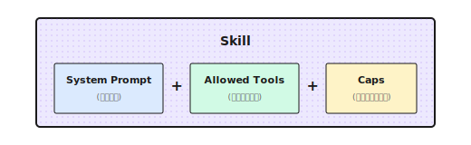

# 第 5 章：Skills システム

> **Skill は万能テンプレートじゃない。System Prompt、ツールのホワイトリスト、パラメータ制約をひとまとめにしただけ。ロール設計がダメなら、どんなにきれいにパッケージしても意味がない。**

---

## 5.1 Skill って結局なに？

前の章で、単体エージェント（Agent）のツールと推論能力について解説した。でもね、ひとつ問題が見えてきたんだ。同じエージェントでも、タスクが変わると途端に使えなくなる。

以前、あるクライアント向けにコードレビュー用のエージェントを作ったことがある。設定はシンプルだった。System Prompt で「潜在的なバグとセキュリティ問題を見つけろ」と指示して、ツールはファイル読み取りとコード検索だけ。結果は上々で、隠れた問題をかなり見つけてくれた。

1ヶ月後、クライアントから新しい要望が来た。「このエージェントで市場調査もできない？」

試してみたけど、まあ全然ダメだった。コードレビュー用の Prompt は「バグを探せ」「型安全性をチェックしろ」と言ってる。でも市場調査に必要なのは「トレンドを検索しろ」「データを比較しろ」「ソースを引用しろ」だ。ツールも合わない。ファイル読み取りは役に立たないし、必要なのはウェブ検索とデータ取得だ。

結局、午後いっぱいかけて「リサーチャー」ロールを一から作り直した。2つの設定、全く別物だ。

**これが Skill で解決したい問題なんだよね。毎回ゼロからロールを設定し直す必要はない。あらかじめ用意したロールをワンクリックで切り替えればいい。** コードレビューには `code_reviewer` ロール、市場調査には `researcher` ロール。

一言でまとめると：**Skill = System Prompt + ツールホワイトリスト + パラメータ制約**



```
┌──────────────────────────────────────────────────┐
│                    Skill                          │
│                                                   │
│  System Prompt  +  Allowed Tools  +  Caps        │
│    (キャラ設定)     (使えるツール)    (パラメータ制限)  │
└──────────────────────────────────────────────────┘
```

たとえば「リサーチャー」Skill はこんな感じ：

```python
"research": {
    "system_prompt": "You are a research assistant. Gather facts from authoritative sources...",
    "allowed_tools": ["web_search", "web_fetch"],
    "caps": {"max_tokens": 16000, "temperature": 0.3},
}
```

「批評家」Skill ならこう：

```python
"critic": {
    "system_prompt": "You are a critical reviewer. Point out flaws and suggest fixes.",
    "allowed_tools": ["file_read"],
    "caps": {"max_tokens": 800, "temperature": 0.2},
}
```

呼び出すときは「research という Skill を使いたい」と言うだけ。設定は自動で読み込まれる。

---

## 5.2 Shannon の Presets レジストリ

Shannon では Skills を「Presets」と呼んでいて、辞書に格納している：

```python
_PRESETS: Dict[str, Dict[str, object]] = {
    "analysis": {
        "system_prompt": "You are an analytical assistant. Provide concise reasoning...",
        "allowed_tools": ["web_search", "file_read"],
        "caps": {"max_tokens": 30000, "temperature": 0.2},
    },
    "research": {
        "system_prompt": "You are a research assistant. Gather facts from authoritative sources...",
        "allowed_tools": ["web_search", "web_fetch", "web_crawl"],
        "caps": {"max_tokens": 16000, "temperature": 0.3},
    },
    "writer": {
        "system_prompt": "You are a technical writer. Produce clear, organized prose.",
        "allowed_tools": ["file_read"],
        "caps": {"max_tokens": 8192, "temperature": 0.6},
    },
    "generalist": {
        "system_prompt": "You are a helpful AI assistant.",
        "allowed_tools": [],
        "caps": {"max_tokens": 8192, "temperature": 0.7},
    },
}
```

3つのフィールドにはそれぞれ役割がある：

| フィールド | 役割 | 設計上の考慮点 |
|------|--------|----------|
| `system_prompt` | キャラ設定と行動規範を定義 | 具体的であるほど良い |
| `allowed_tools` | ツールのホワイトリスト | 最小権限の原則 |
| `caps` | パラメータ制約 | コストとスタイルを制御 |

### 安全なフォールバック

Preset を取得する関数には、いくつか注目すべきポイントがある：

```python
def get_role_preset(name: str) -> Dict[str, object]:
    key = (name or "").strip().lower() or "generalist"

    # エイリアスマッピング（後方互換性）
    alias_map = {
        "researcher": "research",
        "research_supervisor": "deep_research_agent",
    }
    key = alias_map.get(key, key)

    return _PRESETS.get(key, _PRESETS["generalist"]).copy()
```

1. **大文字小文字を区別しない**：`Research` と `research` は同じ
2. **エイリアス対応**：古い名前は自動的に新しい名前にマッピング
3. **安全なフォールバック**：見つからないロールは `generalist` を使用
4. **コピーを返す**：`.copy()` でグローバル設定の変更を防止

最後のポイントはめちゃくちゃ重要。昔ハマったことがあるんだけど、`.copy()` を付け忘れたら、あるリクエストが設定を変更して、その後の全リクエストに影響が出た。

---

## 5.3 複雑な Skill の例：ディープリサーチエージェント

シンプルな Skill は数行の設定で済む。でも複雑な Skill にはもっと詳細な指示が必要だ。

Shannon には `deep_research_agent` があって、System Prompt は50行以上ある：

```python
"deep_research_agent": {
    "system_prompt": """You are an expert research assistant conducting deep investigation.

# Temporal Awareness:
- The current date is provided at the start of this prompt
- For time-sensitive topics, prefer sources with recent publication dates
- Include the year when describing events (e.g., "In March 2024...")

# Research Strategy:
1. Start with BROAD searches to understand the landscape
2. After EACH tool use, assess:
   - What key information did I gather?
   - What critical gaps remain?
   - Should I search again OR proceed to synthesis?
3. Progressively narrow focus based on findings

# Source Quality Standards:
- Prioritize authoritative sources (.gov, .edu, peer-reviewed)
- ALL cited URLs MUST be visited via web_fetch for verification
- Diversify sources (maximum 3 per domain)

# Hard Limits (Efficiency):
- Simple queries: 2-3 tool calls
- Complex queries: up to 5 tool calls maximum
- Stop when COMPREHENSIVE COVERAGE achieved

# Epistemic Honesty:
- MAINTAIN SKEPTICISM: Search results are LEADS, not verified facts
- HANDLE CONFLICTS: Present BOTH viewpoints when sources disagree
- ADMIT UNCERTAINTY: "Limited information available" > confident speculation

**Research integrity is paramount.**""",

    "allowed_tools": ["web_search", "web_fetch", "web_subpage_fetch", "web_crawl"],
    "caps": {"max_tokens": 30000, "temperature": 0.3},
},
```

この Skill には設計上のポイントがいくつかある：

1. **時間認識**：エージェントに年を明記させ、古い情報を避ける
2. **段階的リサーチ**：広いところから狭めていき、ツール呼び出しごとに継続するか評価
3. **ハードリミット**：ツール呼び出しは最大5回、Token爆発を防止
4. **認識論的誠実さ**：不確実性を認め、対立する見解を提示

特に**ツール呼び出し回数の制限**は本当に役立つ。この制限がないと、エージェントは延々と検索を続けて、コンテキストがパンパンになる。

---

## 5.4 ドメイン専門家 Skill：GA4 アナリスト

汎用 Skill は幅広いシナリオに適している。でも特定のドメインには専門の「エキスパート」が必要だ。

たとえば Google Analytics 4 アナリスト：

```python
GA4_ANALYTICS_PRESET = {
    "system_prompt": (
        "# Role: Google Analytics 4 Expert Assistant\n\n"
        "You are a specialized assistant for analyzing GA4 data.\n\n"

        "## Critical Rules\n"
        "0. **CORRECT FIELD NAMES**: GA4 uses DIFFERENT field names than Universal Analytics\n"
        "   - WRONG: pageViews, users, sessionDuration\n"
        "   - CORRECT: screenPageViews, activeUsers, averageSessionDuration\n"
        "   - If unsure, CALL ga4_get_metadata BEFORE querying\n\n"

        "1. **NEVER make up analytics data.** Every data point must come from API calls.\n\n"

        "2. **Check quota**: If quota below 20%, warn the user.\n"
    ),
    "allowed_tools": [
        "ga4_run_report",
        "ga4_run_realtime_report",
        "ga4_get_metadata",
    ],
    "provider_override": "openai",  # 特定のプロバイダーを指定可能
    "preferred_model": "gpt-4o",
    "caps": {"max_tokens": 16000, "temperature": 0.2},
}
```

ドメイン Skill には特殊な設定がある：

- `provider_override`：特定のプロバイダーを強制（たとえば特定タスクで GPT の方が効果的な場合）
- `preferred_model`：優先モデルを指定

これらは汎用 Skill にはない設定だ。

### 動的ツールファクトリ

ドメイン Skill にはもうひとつよくある要件がある：**設定に基づいてツールを動的に生成する**こと。

たとえば GA4 ツールは特定のアカウントにバインドする必要がある：

```python
def create_ga4_tool_functions(property_id: str, credentials_path: str):
    """アカウント設定に基づいて GA4 ツールを生成"""
    client = GA4Client(property_id, credentials_path)

    def ga4_run_report(**kwargs):
        return client.run_report(**kwargs)

    def ga4_get_metadata():
        return client.get_available_dimensions_and_metrics()

    return {
        "ga4_run_report": ga4_run_report,
        "ga4_get_metadata": ga4_get_metadata,
    }
```

こうすれば、異なるユーザーが異なる GA4 アカウントを使える。同じ Skill だけど、異なる認証情報をバインドできるわけだ。

---

## 5.5 Prompt テンプレートのレンダリング

同じ Skill でもシナリオに応じて異なる変数を注入したいことがある。

たとえばデータ分析 Skill：

```python
"data_analytics": {
    "system_prompt": (
        "# Setup\n"
        "profile_id: ${profile_id}\n"
        "User's account ID: ${aid}\n"
        "Date of today: ${current_date}\n\n"
        "You are a data analytics assistant..."
    ),
    "allowed_tools": ["processSchemaQuery"],
}
```

呼び出し時にパラメータを渡す：

```python
context = {
    "role": "data_analytics",
    "prompt_params": {
        "profile_id": "49598h6e",
        "aid": "7b71d2aa-dc0d-4179-96c0-27330587fb50",
        "current_date": "2026-01-03",
    }
}
```

レンダリング関数が `${variable}` を実際の値に置き換える：

```python
def render_system_prompt(prompt: str, context: Dict) -> str:
    variables = context.get("prompt_params", {})

    def substitute(match):
        var_name = match.group(1)
        return str(variables.get(var_name, ""))

    return re.sub(r"\$\{(\w+)\}", substitute, prompt)
```

レンダリング後：

```
# Setup
profile_id: 49598h6e
User's account ID: 7b71d2aa-dc0d-4179-96c0-27330587fb50
Date of today: 2026-01-03

You are a data analytics assistant...
```

---

## 5.6 実行時の動的拡張

Skill が定義するのは静的な設定だ。でも実行時には動的にコンテンツが注入される：

```python
# 現在日付を注入
current_date = datetime.now().strftime("%Y-%m-%d")
system_prompt = f"Current date: {current_date} (UTC).\n\n" + system_prompt

# 言語指示を注入
if context.get("target_language") and context["target_language"] != "English":
    lang = context["target_language"]
    system_prompt = f"CRITICAL: Respond in {lang}.\n\n" + system_prompt

# リサーチモード拡張
if context.get("research_mode"):
    system_prompt += "\n\nRESEARCH MODE: Do not rely on snippets. Use web_fetch to read full content."
```

こうして Skill の静的設定と実行時コンテキストが組み合わさって、最終的に LLM に送られる System Prompt になる。

---

## 5.7 Vendor Adapter パターン

外部システムと深く統合する必要がある Skill には、Shannon は巧みな設計を使っている：

```
roles/
├── presets.py              # 汎用プリセット
├── ga4/
│   └── analytics_agent.py  # GA4 専用
├── ptengine/
│   └── data_analytics.py   # Ptengine 専用
└── vendor/
    └── custom_client.py    # クライアントカスタム（コミットしない）
```

読み込みロジック：

```python
# オプションで vendor ロールを読み込み
try:
    from .ga4.analytics_agent import GA4_ANALYTICS_PRESET
    _PRESETS["ga4_analytics"] = GA4_ANALYTICS_PRESET
except Exception:
    pass  # モジュールが存在しない場合はサイレントに失敗

try:
    from .ptengine.data_analytics import DATA_ANALYTICS_PRESET
    _PRESETS["data_analytics"] = DATA_ANALYTICS_PRESET
except Exception:
    pass
```

メリットは：

1. **コアコードがきれい**：汎用 presets は vendor モジュールに依存しない
2. **優雅なフォールバック**：モジュールが存在しなくてもエラーにならない
3. **クライアントカスタマイズ**：プライベートな vendor ディレクトリにコミットしないコードを格納できる

---

## 5.8 新しい Skill の設計

「コードレビュアー」Skill を作るとしたら、どう設計する？

```python
"code_reviewer": {
    "system_prompt": """You are a senior code reviewer with 10+ years of experience.

## Mission
Review code for bugs, security issues, and maintainability problems.
Focus on HIGH-IMPACT issues that matter for production.

## Severity Levels
1. CRITICAL: Security vulnerabilities, data corruption risks
2. HIGH: Logic errors, race conditions, resource leaks
3. MEDIUM: Code smells, performance issues
4. LOW: Style, naming, documentation

## Output Format
For each issue:
- **Severity**: CRITICAL/HIGH/MEDIUM/LOW
- **Location**: file:line
- **Issue**: Brief description
- **Suggestion**: How to fix
- **Confidence**: HIGH/MEDIUM/LOW

## Rules
- Only report issues with MEDIUM+ confidence
- Limit to 10 most important issues per review
- Skip style issues unless explicitly asked

## Anti-patterns to Watch
- SQL injection, XSS, command injection
- Hardcoded secrets in code
- Unchecked null access
- Resource leaks
""",
    "allowed_tools": ["file_read", "grep_search"],
    "caps": {"max_tokens": 8000, "temperature": 0.1},
}
```

設計の判断：

| 判断 | 理由 |
|------|------|
| 低い temperature (0.1) | コードレビューは正確さが重要、創造性は不要 |
| 10件に制限 | 情報過多を避ける |
| 確信度の表示 | どれを優先的に確認すべきかユーザーに伝える |
| 最小限のツールセット | ファイル読み取りと検索だけで十分、書き込みは不要 |

---

## 5.9 よくある落とし穴

### 落とし穴 1：System Prompt が曖昧すぎる

```python
# 曖昧すぎる - 具体性がない
"system_prompt": "You are a helpful assistant."

# 具体的で明確
"system_prompt": """You are a research assistant.

RULES:
- Cite sources for all factual claims
- Use bullet points for readability
- Maximum 3 paragraphs unless asked for more

OUTPUT FORMAT:
## Summary
[1-2 sentences]

## Key Findings
- Finding 1 (Source: ...)
"""
```

### 落とし穴 2：ツール権限が広すぎる

```python
# 権限が広すぎる - ツールを与えすぎ
"allowed_tools": ["web_search", "file_write", "shell_execute", "database_query"]

# 最小権限 - 必要なものだけ
"allowed_tools": ["web_search", "web_fetch"]  # リサーチタスクには検索だけで十分
```

ツールを与えすぎると、LLM が混乱する（どれを使えばいいかわからない）し、セキュリティリスクも増える。

### 落とし穴 3：パラメータ制約を設定しない

```python
# 制限なし - 制御不能になりやすい
"caps": {}

# タスクに応じて制約を設定
"caps": {"max_tokens": 1000, "temperature": 0.3}  # 短い応答
"caps": {"max_tokens": 16000, "temperature": 0.6}  # 長文生成
```

`max_tokens` を設定しないと、Token 消費が制御不能になる。

### 落とし穴 4：フォールバック戦略がない

```python
# モジュールが存在しないとクラッシュ
from .custom_module import CUSTOM_PRESET
_PRESETS["custom"] = CUSTOM_PRESET

# 優雅なフォールバック
try:
    from .custom_module import CUSTOM_PRESET
    _PRESETS["custom"] = CUSTOM_PRESET
except Exception:
    pass  # デフォルトの generalist を使用
```

---

## 5.10 他のフレームワークではどうしてる？

| フレームワーク | 概念名 | 特徴 |
|------|----------|------|
| **CrewAI** | Agent Role | role, goal, backstory を含む |
| **AutoGen** | Agent Config | system_message, llm_config を含む |
| **LangGraph** | Node State | グラフノード内で設定 |
| **Dify** | Prompt Template | ビジュアル編集 |

核心の考え方は同じ。ロール設定をパッケージして再利用しやすくする。違いは：
- 設定の粒度（CrewAI には backstory があるが、Shannon にはない）
- 設定方法（コード vs ビジュアル vs YAML）
- フレームワークとの統合の深さ

---

## 本章のまとめ

1. **Skill = System Prompt + ツールホワイトリスト + パラメータ制約** - ロール設定を再利用可能な単位にパッケージ
2. **Skill は設定の分散と漏れの問題を解決** - 名前で参照するから、パラメータを忘れることがない
3. **ツールホワイトリストは重要** - 判断の負担を減らし、セキュリティを高め、コストを制御
4. **Skill 設計で気をつけること**：境界を明確に、ルールを具体的に、エッジケースを処理、ツール数を制御
5. **Skill は万能じゃない** - 良い LLM をもっと良くするが、ダメな LLM を良くはできない

---

## Shannon Lab（10分で体験）

このセクションでは、10分で本章の概念を Shannon ソースコードに対応づける。

### 必読（1ファイル）

- [`roles/presets.py`](https://github.com/Kocoro-lab/Shannon/blob/main/python/llm-service/llm_service/roles/presets.py)：`_PRESETS` 辞書を見て、ロールプリセットの構造を理解する。`deep_research_agent` という複雑な例に注目

### 選読（興味に応じて2つ選択）

- [`roles/ga4/analytics_agent.py`](https://github.com/Kocoro-lab/Shannon/blob/main/python/llm-service/llm_service/roles/ga4/analytics_agent.py)：実際のベンダーカスタムロールを見る
- `research` と `analysis` の2つのプリセットを比較して、なぜツールリストが異なるか考える

---

## 演習

### 演習 1：既存の Skill を分析する

Shannon の `presets.py` を読んで、以下に答えよ：

1. `research` と `analysis` の2つのロールはどう違う？
2. なぜ `writer` ロールの temperature は `analysis` より高い？
3. `critic` ロールの `max_tokens` はなぜ 800 だけ？

### 演習 2：Skill を設計する

「コードレビュー」タスク用の Skill を設計せよ：

1. System Prompt を書く（少なくとも：職責、レビュー基準、出力形式を含む）
2. 必要なツールをリストアップ（file_read？git_diff？その他？）
3. temperature と max_tokens を設定（理由も説明）

### 演習 3（発展）：Skill をテストする

設計したコードレビュー Skill のテストケースを3つ書け：

1. よくある問題（未処理の例外など）を発見できるかテスト
2. 具体的な改善提案ができるかテスト
3. コードに問題がない場合に正しく応答できるかテスト

---

## 参考資料

- [Anthropic System Prompts](https://docs.anthropic.com/en/docs/build-with-claude/prompt-caching) - Claude 公式 Prompt 設計ガイド
- [CrewAI Agent Roles](https://docs.crewai.com/core-concepts/agents) - CrewAI のロール設計思想
- [LangChain Prompt Templates](https://python.langchain.com/docs/modules/model_io/prompts/) - LangChain のテンプレートシステム
- [Shannon Roles Source Code](https://github.com/Kocoro-lab/Shannon/tree/main/python/llm-service/llm_service/roles) - コード実装

---

## 次章の予告

Skill は「エージェントがどう振る舞うべきか」という問題を解決した。でもまだ別の問題がある。

エージェントがタスクを実行しているとき、何をしているか知りたいよね。重要なポイントでカスタムロジックを挿入したいこともある。

たとえば：
- ツール呼び出しごとにログを記録
- Token 消費が閾値を超えたら警告を出す
- 特定の操作の前にユーザーの確認（承認）を求める

これが次章の内容 - **Hooks とイベントシステム**だ。

次の章で続けよう。
