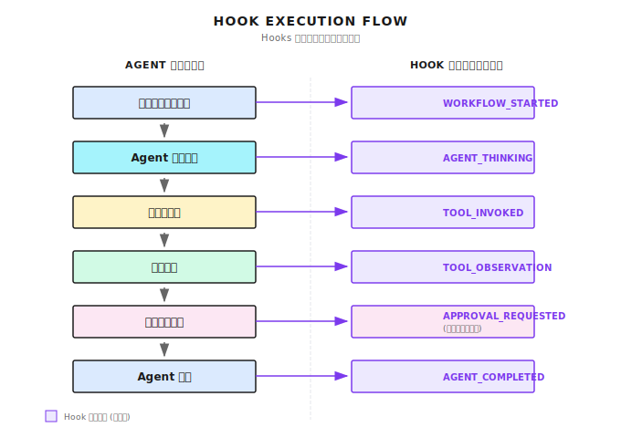

# 第 6 章：Hooks とイベントシステム

> **Hooks はエージェントの神経系だ。コアのコードをいじらずに、実行状態を観察したり、カスタムロジックを挿入できる。ただし Hook が多すぎたり遅すぎたりすると、エージェント全体が重くなるから要注意。**

---

本番環境でエージェント（Agent）が動いているとする。
そこにユーザーから問い合わせが来た。

> 「今なにやってるの？なんでこんなに遅いの？」

ログを開いてみると、ぐちゃぐちゃな print 文だらけ。
どこまで実行が進んだのか、さっぱりわからない。

これが Hooks システムがないときの辛さだよ。

---

## 6.1 Hooks は何を解決するのか？

3つのキーワードで説明できる。**見る、管理する、拡張する**。

1. **見る**（可観測性）：エージェントが今なにをしてる？どこまで進んだ？
2. **管理する**（制御性）：重要なポイントで一時停止して、人間の確認後に再開できる？
3. **拡張する**（拡張性）：コアのコードを変えずに機能を追加できる？

Hooks がないと、各実行ポイントに手動でログを追加して、ポーリングで状態チェックして、機能追加のたびにコアのコードを修正することになる。

Hooks があれば：



```
エージェント実行フロー              Hook トリガーポイント
──────────────────────────────────────────────
ワークフロー開始    ────────▶     WORKFLOW_STARTED
  ↓
エージェント思考中  ────────▶     AGENT_THINKING
  ↓
ツール呼び出し     ────────▶     TOOL_INVOKED
  ↓
結果取得          ────────▶     TOOL_OBSERVATION
  ↓
承認が必要？      ────────▶     APPROVAL_REQUESTED
  ↓                           (人間の判断を待つ)
実行継続          ────────▶     APPROVAL_DECISION
  ↓
エージェント完了   ────────▶     AGENT_COMPLETED
```

どのイベントポイントでも購読できる。ログを記録する、通知を送る、フローを一時停止する、人間の承認を求める。やりたいことができるわけだ。

---

## 6.2 Shannon のイベント型体系

Shannon は完全なイベント型セットを定義している。カテゴリ別に見ていこう。

### ワークフローライフサイクル

```go
StreamEventWorkflowStarted   = "WORKFLOW_STARTED"
StreamEventWorkflowCompleted = "WORKFLOW_COMPLETED"
StreamEventAgentStarted      = "AGENT_STARTED"
StreamEventAgentCompleted    = "AGENT_COMPLETED"
```

### 実行状態

```go
StreamEventToolInvoked    = "TOOL_INVOKED"     // ツール呼び出し
StreamEventToolObs        = "TOOL_OBSERVATION" // ツールの戻り値
StreamEventAgentThinking  = "AGENT_THINKING"   // 思考中
StreamEventErrorOccurred  = "ERROR_OCCURRED"   // エラー発生
```

### ワークフロー制御

```go
StreamEventWorkflowPaused     = "WORKFLOW_PAUSED"     // 一時停止
StreamEventWorkflowResumed    = "WORKFLOW_RESUMED"    // 再開
StreamEventWorkflowCancelled  = "WORKFLOW_CANCELLED"  // キャンセル
StreamEventApprovalRequested  = "APPROVAL_REQUESTED"  // 承認リクエスト
StreamEventApprovalDecision   = "APPROVAL_DECISION"   // 承認結果
```

### LLM イベント

```go
StreamEventLLMPrompt  = "LLM_PROMPT"  // LLM に送った内容
StreamEventLLMPartial = "LLM_PARTIAL" // LLM の増分出力
StreamEventLLMOutput  = "LLM_OUTPUT"  // LLM の最終出力
```

なんでこんなに細かく分けるのか？

シーンによって必要なイベントが違うからだよ。フロントエンドで進捗を表示するなら `AGENT_THINKING` や `TOOL_INVOKED`。LLM のデバッグには `LLM_PROMPT` と `LLM_OUTPUT`。監査には `WORKFLOW_COMPLETED`。目的に応じて使い分ける。

---

## 6.3 イベントはどうやって発信するのか？

各イベントはこんな構造をしている：

```go
type EmitTaskUpdateInput struct {
    WorkflowID string                 // どのワークフローに関連するか
    EventType  StreamEventType        // イベントの種類
    AgentID    string                 // どのエージェントが発信したか
    Message    string                 // 人間が読める説明
    Timestamp  time.Time              // いつ発生したか
    Payload    map[string]interface{} // 追加データ
}
```

送信ロジック：

```go
func EmitTaskUpdate(ctx context.Context, in EmitTaskUpdateInput) error {
    // 1. ログ出力
    logger.Info("streaming event",
        "workflow_id", in.WorkflowID,
        "type", string(in.EventType),
        "message", in.Message,
    )

    // 2. ストリームに発行
    streaming.Get().Publish(in.WorkflowID, streaming.Event{
        WorkflowID: in.WorkflowID,
        Type:       string(in.EventType),
        Message:    in.Message,
        Timestamp:  in.Timestamp,
    })

    return nil
}
```

ここで**二重発行**していることに注目。ログへの書き込みとストリームへの発行を同時にやっている。ログはデバッグ用、ストリームはフロントエンドへのリアルタイムプッシュ用だ。

---

## 6.4 ストリーミングイベントマネージャー

Shannon はイベント転送層に Redis Streams を使っている。なぜ Redis Streams なのか？

1. **高スループット**：毎秒数十万件のメッセージを処理できる
2. **永続化**：メッセージが失われない
3. **コンシューマーグループ**：複数のコンシューマーで負荷分散できる

Manager の構造：

```go
type Manager struct {
    redis       *redis.Client
    dbClient    *db.Client     // PostgreSQL
    subscribers map[string]map[chan Event]*subscription
    capacity    int            // 容量制限
}
```

### イベントの発行

```go
func (m *Manager) Publish(workflowID string, evt Event) {
    if m.redis != nil {
        // 1. シーケンス番号をインクリメント（順序を保証）
        seq, _ := m.redis.Incr(ctx, m.seqKey(workflowID)).Result()
        evt.Seq = uint64(seq)

        // 2. Redis Stream に書き込み、古いイベントを自動トリム
        m.redis.XAdd(ctx, &redis.XAddArgs{
            Stream: m.streamKey(workflowID),
            MaxLen: int64(m.capacity),  // 容量制限
            Approx: true,
            Values: eventData,
        })

        // 3. TTL を設定（24時間後に自動クリーンアップ）
        m.redis.Expire(ctx, streamKey, 24*time.Hour)
    }

    // 4. 重要なイベントは PostgreSQL に永続化
    if shouldPersistEvent(evt.Type) {
        select {
        case m.persistCh <- eventLog:
        default:
            // キューが満杯なら捨てる、メインフローをブロックしない
        }
    }
}
```

いくつかの重要な設計ポイント：

- **シーケンス番号**：イベントの順序を保証
- **容量制限**：Stream の無限増大を防止
- **TTL**：24時間後に自動クリーンアップ
- **ノンブロッキング永続化**：キューが満杯なら捨てる、メインフローを遅くしない

### どのイベントを永続化するのか？

```go
func shouldPersistEvent(eventType string) bool {
    switch eventType {
    // 永続化が必要：重要なイベント
    case "WORKFLOW_COMPLETED", "WORKFLOW_FAILED",
         "TOOL_INVOKED", "TOOL_OBSERVATION",
         "LLM_OUTPUT", "BUDGET_THRESHOLD":
        return true

    // 永続化しない：一時的なイベント
    case "LLM_PARTIAL", "HEARTBEAT", "PING":
        return false

    // デフォルトは永続化（保守的な戦略）
    default:
        return true
    }
}
```

`LLM_PARTIAL` は増分出力で、1秒に数十件発生することもある。永続化しても意味がない。`WORKFLOW_COMPLETED` は最終結果だから、必ず保存する。

---

## 6.5 ワークフロー制御：一時停止/再開/キャンセル

これが Hooks システムの最も強力な機能の一つ。**実行中のワークフローをリアルタイムで制御できる**。

Shannon は Temporal Signal でこれを実現している。Signal は Temporal の機能で、実行中のワークフローにメッセージを送れる。

### シグナルハンドラー

```go
type SignalHandler struct {
    State      *WorkflowControlState
    WorkflowID string
}

func (h *SignalHandler) Setup(ctx workflow.Context) {
    h.State = &WorkflowControlState{}

    // 3つのシグナルチャネルを登録
    pauseCh := workflow.GetSignalChannel(ctx, SignalPause)
    resumeCh := workflow.GetSignalChannel(ctx, SignalResume)
    cancelCh := workflow.GetSignalChannel(ctx, SignalCancel)

    // バックグラウンドでシグナルを監視
    workflow.Go(ctx, func(gCtx workflow.Context) {
        for {
            sel := workflow.NewSelector(gCtx)

            sel.AddReceive(pauseCh, func(c workflow.ReceiveChannel, more bool) {
                var req PauseRequest
                c.Receive(gCtx, &req)
                h.handlePause(gCtx, req)
            })

            sel.AddReceive(resumeCh, func(c workflow.ReceiveChannel, more bool) {
                var req ResumeRequest
                c.Receive(gCtx, &req)
                h.handleResume(gCtx, req)
            })

            sel.AddReceive(cancelCh, func(c workflow.ReceiveChannel, more bool) {
                var req CancelRequest
                c.Receive(gCtx, &req)
                h.handleCancel(gCtx, req)
            })

            sel.Select(gCtx)
        }
    })
}
```

### 一時停止と再開

```go
func (h *SignalHandler) handlePause(ctx workflow.Context, req PauseRequest) {
    if h.State.IsPaused {
        return  // すでに一時停止中
    }

    h.State.IsPaused = true
    h.State.PauseReason = req.Reason

    // フロントエンドに通知イベントを送信
    emitEvent(ctx, StreamEventWorkflowPausing, "Workflow pausing: "+req.Reason)

    // すべての子ワークフローに伝播
    h.propagateSignalToChildren(ctx, SignalPause, req)
}
```

### チェックポイント機構

ワークフローは任意の場所で一時停止できるわけじゃない。「チェックポイント」でのみ一時停止できる。これは Temporal の制限だけど、理にかなった設計でもある。

```go
func (h *SignalHandler) CheckPausePoint(ctx workflow.Context, checkpoint string) error {
    // 実行権を譲渡して、シグナルが処理されることを保証
    _ = workflow.Sleep(ctx, 0)

    // キャンセルされたかチェック
    if h.State.IsCancelled {
        return temporal.NewCanceledError("workflow cancelled")
    }

    // 一時停止されたかチェック
    if h.State.IsPaused {
        emitEvent(ctx, StreamEventWorkflowPaused, "Paused at: "+checkpoint)

        // 再開を待つ（ポーリングじゃなくて本当のブロッキング待機！）
        _ = workflow.Await(ctx, func() bool {
            return !h.State.IsPaused || h.State.IsCancelled
        })
    }

    return nil
}
```

使い方：

```go
func MyWorkflow(ctx workflow.Context, input Input) error {
    handler := &control.SignalHandler{...}
    handler.Setup(ctx)

    // チェックポイント 1
    if err := handler.CheckPausePoint(ctx, "before_research"); err != nil {
        return err
    }
    doResearch(ctx)

    // チェックポイント 2
    if err := handler.CheckPausePoint(ctx, "before_synthesis"); err != nil {
        return err
    }
    doSynthesis(ctx)

    return nil
}
```

重要なステップの前にチェックポイントを挿入しておけば、ユーザーはそこでワークフローを一時停止できる。

---

## 6.6 人間の承認 Hook

リスクの高い操作では、エージェントにまず人間に確認させたいことがある。

### 承認ポリシー

```go
type ApprovalPolicy struct {
    ComplexityThreshold float64  // 複雑度がこの値を超えたら承認が必要
    TokenBudgetExceeded bool     // Token が予算超過したら承認が必要
    RequireForTools     []string // これらのツールは承認が必要
}

func EvaluateApprovalPolicy(policy ApprovalPolicy, context map[string]interface{}) (bool, string) {
    // 複雑度をチェック
    if complexity := context["complexity_score"].(float64); complexity >= policy.ComplexityThreshold {
        return true, fmt.Sprintf("Complexity %.2f exceeds threshold", complexity)
    }

    // 危険なツールをチェック
    if tools := context["tools_to_use"].([]string); containsAny(tools, policy.RequireForTools) {
        return true, "Dangerous tool requires approval"
    }

    return false, ""
}
```

### 承認リクエスト

```go
func RequestAndWaitApproval(ctx workflow.Context, input TaskInput, reason string) (*HumanApprovalResult, error) {
    // 1. 承認リクエストを送信
    var approval HumanApprovalResult
    workflow.ExecuteActivity(ctx, "RequestApproval", HumanApprovalInput{
        SessionID:      input.SessionID,
        WorkflowID:     workflow.GetInfo(ctx).WorkflowExecution.ID,
        Query:          input.Query,
        Reason:         reason,
    }).Get(ctx, &approval)

    // 2. フロントエンドに通知イベントを送信
    emitEvent(ctx, StreamEventApprovalRequested, "Approval requested: "+reason)

    // 3. 人間の判断を待つ（最大 60 分）
    sigName := "human-approval-" + approval.ApprovalID
    ch := workflow.GetSignalChannel(ctx, sigName)
    timer := workflow.NewTimer(ctx, 60*time.Minute)

    var result HumanApprovalResult
    sel := workflow.NewSelector(ctx)
    sel.AddReceive(ch, func(c workflow.ReceiveChannel, more bool) {
        c.Receive(ctx, &result)
    })
    sel.AddFuture(timer, func(f workflow.Future) {
        result = HumanApprovalResult{Approved: false, Feedback: "timeout"}
    })
    sel.Select(ctx)

    // 4. 結果イベントを送信
    decision := "denied"
    if result.Approved {
        decision = "approved"
    }
    emitEvent(ctx, StreamEventApprovalDecision, "Approval "+decision)

    return &result, nil
}
```

使い方：

```go
func ResearchWorkflow(ctx workflow.Context, input TaskInput) error {
    // 承認が必要かどうか評価
    needsApproval, reason := EvaluateApprovalPolicy(policy, context)

    if needsApproval {
        approval, err := RequestAndWaitApproval(ctx, input, reason)
        if err != nil {
            return err
        }

        if !approval.Approved {
            return fmt.Errorf("rejected: %s", approval.Feedback)
        }
    }

    // 実行継続...
    return executeResearch(ctx, input)
}
```

---

## 6.7 実践：Token 消費監視 Hook

実用的な Hook を書いてみよう。Token 消費を監視して、予算に近づいたら警告を出すやつだ。

```go
type TokenUsageHook struct {
    WarningThreshold  float64 // 80%
    CriticalThreshold float64 // 95%
    TotalBudget       int
    CurrentUsage      int
}

func (h *TokenUsageHook) OnTokensUsed(ctx workflow.Context, tokensUsed int) error {
    h.CurrentUsage += tokensUsed
    ratio := float64(h.CurrentUsage) / float64(h.TotalBudget)

    if ratio >= h.CriticalThreshold {
        return emitEvent(ctx, StreamEventBudgetThreshold,
            fmt.Sprintf("CRITICAL: Token budget at %.0f%% (%d/%d)",
                ratio*100, h.CurrentUsage, h.TotalBudget),
            map[string]interface{}{"level": "critical", "ratio": ratio},
        )
    }

    if ratio >= h.WarningThreshold {
        return emitEvent(ctx, StreamEventBudgetThreshold,
            fmt.Sprintf("WARNING: Token budget at %.0f%%", ratio*100),
            map[string]interface{}{"level": "warning", "ratio": ratio},
        )
    }

    return nil
}
```

この Hook は LLM 呼び出しごとにトリガーされて、Token 消費が予算に近づいているかチェックする。80% で警告、95% で重大警告を出す。

---

## 6.8 よくあるハマりポイント

### ハマり 1：ブロッキング型 Hook

Hook の実行時間が長すぎて、メインフローが遅くなる。

```go
// ブロッキング型 - メインフローが遅くなる
result, err := publishEvent(ctx, event)
if err != nil {
    return err  // 失敗したら停止
}

// ノンブロッキング型 - 推奨
select {
case eventCh <- event:
    // 成功
default:
    logger.Warn("Event dropped - channel full")
}
```

### ハマり 2：イベントストーム

大量の低価値イベントが重要なイベントを埋もれさせる。

解決策：イベントの優先度分け、選択的な永続化。`LLM_PARTIAL` は保存しない、`WORKFLOW_COMPLETED` は必ず保存。

### ハマり 3：状態の不整合

Signal 処理と状態チェックの間に競合状態が発生する。

解決策：状態チェック前に `workflow.Sleep(ctx, 0)` で実行権を譲渡して、Signal が処理されることを保証する。

### ハマり 4：子ワークフローへのシグナル伝播漏れ

親ワークフローを一時停止しても、子ワークフローが動き続ける。

解決策：シグナル伝播機構を実装する。

```go
func (h *SignalHandler) handlePause(ctx workflow.Context, req PauseRequest) {
    h.State.IsPaused = true
    // すべての子ワークフローに伝播
    h.propagateSignalToChildren(ctx, SignalPause, req)
}
```

---

## 6.9 他のフレームワークはどうしてる？

| フレームワーク | Hook 機構 | 特徴 |
|---------------|----------|------|
| **LangChain** | Callbacks | `on_llm_start`, `on_tool_end` などのコールバック |
| **LangGraph** | Node hooks | グラフノードの入出時にトリガー |
| **CrewAI** | Step callback | 各エージェントステップ後のコールバック |
| **Claude Code** | Hooks ディレクトリ | 独立スクリプトで実装、stdin/stdout で通信 |
| **Shannon** | Temporal Signal + Redis Streams | 一時停止/再開/キャンセルをサポート |

主な違い：

| 観点 | シンプルな Callbacks | Temporal シグナル方式 |
|------|---------------------|----------------------|
| **状態管理** | メモリ内 | 永続化 |
| **障害復旧** | 失われる | 復旧可能 |
| **一時停止/再開** | 実装が難しい | ネイティブサポート |
| **複雑度** | 低 | 高 |

ログと簡単な通知だけなら Callbacks で十分。長時間実行で中断可能、復旧可能なワークフローが必要なら、Temporal シグナル方式がより適している。

---

## 6.10 Claude Code の Hooks：軽量な実装アプローチ

Claude Code にはシンプルだけど実用的な Hooks 機構がある。参考になるよ。

Hooks は `.claude/hooks/` ディレクトリに定義して、独立スクリプトとして実装する：

```bash
.claude/
└── hooks/
    ├── pre-tool-use.sh     # ツール呼び出し前
    ├── post-tool-use.sh    # ツール呼び出し後
    ├── notification.sh     # ユーザーへの通知
    └── stop.sh             # エージェント停止時
```

呼び出し方はシンプル。stdin でイベントデータを渡して、スクリプトが処理後に返す。

```bash
# pre-tool-use.sh の例
#!/bin/bash
# JSON 入力を読み取る
read -r input
tool_name=$(echo "$input" | jq -r '.tool')

# ログを記録
echo "$(date): Tool called: $tool_name" >> ~/.claude/hooks.log

# 危険なツールなら実行をブロック
if [[ "$tool_name" == "shell_execute" ]]; then
    echo '{"action": "block", "reason": "Shell execution not allowed"}'
    exit 1
fi

# 実行を許可
echo '{"action": "allow"}'
```

この設計の利点：

| 利点 | 説明 |
|------|------|
| **言語非依存** | スクリプトが書ける言語ならなんでも OK |
| **分離性** | Hook は独立プロセス、クラッシュしてもメインプログラムに影響しない |
| **シンプル** | フレームワークを学ぶ必要なし、スクリプトが書ければ OK |

欠点はパフォーマンスオーバーヘッド（呼び出しごとにプロセス起動）と機能制限（状態の永続化ができない）だね。

---

## 本章のポイントまとめ

1. **Hooks が解決する 3 つの問題**：見る（可観測性）、管理する（制御性）、拡張する（拡張性）
2. **イベントの優先度分けが重要**：すべてのイベントを永続化する必要はない。`LLM_PARTIAL` は保存しない、`WORKFLOW_COMPLETED` は必ず保存
3. **一時停止/再開には Temporal Signal を使う**：ポーリングじゃなくて、本当のブロッキング待機
4. **人間の承認はセーフティガード**：ポリシーベースでトリガー、タイムアウト時は自動拒否をサポート
5. **Hook はノンブロッキングで**：キューが満杯なら捨てる、メインフローを遅くしちゃダメ

---

## Shannon Lab（10 分で手を動かす）

このセクションで、本章の概念を Shannon のソースコードと対応づけよう。

### 必読（1 ファイル）

- [`streaming/manager.go`](https://github.com/Kocoro-lab/Shannon/blob/main/go/orchestrator/internal/streaming/manager.go)：`Publish` メソッドと `shouldPersistEvent` 関数を見て、イベント発行と優先度分けのロジックを理解しよう

### 選読（興味に応じて 2 つ選んで）

- [`control/handler.go`](https://github.com/Kocoro-lab/Shannon/blob/main/go/orchestrator/internal/workflows/control/handler.go)：`SignalHandler` が一時停止/再開/キャンセルをどう処理するか見てみよう
- [`control/signals.go`](https://github.com/Kocoro-lab/Shannon/blob/main/go/orchestrator/internal/workflows/control/signals.go)：シグナル型の定義を確認しよう

---

## 練習問題

### 練習 1：イベント優先度の設計

以下のイベント型があるとして、どれを永続化すべき？なぜ？

1. `USER_MESSAGE_RECEIVED`
2. `LLM_TOKEN_GENERATED`
3. `TOOL_EXECUTION_STARTED`
4. `TOOL_EXECUTION_COMPLETED`
5. `AGENT_ERROR`
6. `HEARTBEAT`

### 練習 2：シンプルな Hook の実装

使い慣れた言語で「ツール呼び出しログ」Hook を実装してみよう：

1. ツール呼び出しごとに記録：時刻、ツール名、パラメータの要約
2. ファイルに書き込む（JSON Lines 形式）
3. 考えてみよう：この Hook は同期と非同期、どちらにすべき？なぜ？

### 練習 3（上級）：承認ポリシーの設計

「リサーチアシスタント」エージェント用の承認ポリシーを設計してみよう：

1. どんな状況で人間の承認が必要？
2. 承認タイムアウト時はどう処理する（自動承認 vs 自動拒否）？
3. ユーザーへの頻繁な割り込みをどう避ける？

---

## 参考文献

- [Shannon Streaming Manager](https://github.com/Kocoro-lab/Shannon/blob/main/go/orchestrator/internal/streaming/manager.go) - コード実装
- [Temporal Signals Documentation](https://docs.temporal.io/workflows#signal) - Temporal シグナル機構
- [Redis Streams Documentation](https://redis.io/docs/data-types/streams/) - Redis Streams 入門
- [Claude Code Hooks](https://claude.ai/code) - Claude Code の Hooks ドキュメント

---

## 次章の予告

Part 2「ツールと拡張」はここまで。

4 つのことを学んだね：
- **ツール呼び出し**：エージェントが「手を動かせる」ようにする
- **MCP プロトコル**：ツールの「USB インターフェース」
- **Skills**：ロール設定のパッケージ化
- **Hooks**：実行の観測と制御

次は Part 3「コンテキストとメモリ」に入る。

エージェントの実行中には大量の情報が生成されるけど、LLM のコンテキストウィンドウには限りがある。限られたスペースに最も有用な情報をどう詰め込むか？

次章では**コンテキストウィンドウ管理**について話そう。
