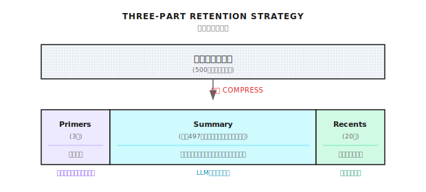
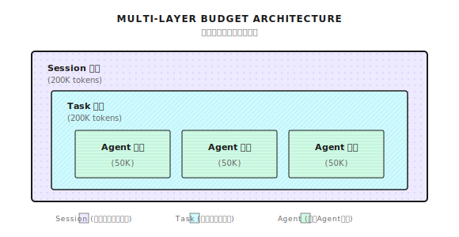

# 第 7 章：コンテキストウィンドウ管理

> **コンテキストウィンドウはエージェント（Agent）の「作業台」だ。小さすぎると材料が載らない、大きすぎるとコストが爆発する。うまく管理してこそ、複雑なタスクでもエージェントは冷静でいられる。**
> **でも魔法じゃない。圧縮すれば情報は失われるし、予算には限界がある。タダ飯なんてないよね。**

---

エージェントに本番環境の問題をデバッグしてもらったとする。

50ラウンドも会話して、やっとデータベースのコネクションプール設定がおかしいと特定できた。

で、聞いてみた。「さっき言ってたコネクションプールの設定って何だっけ？」

返ってきたのは「すみません、覚えていません」

**えっ、となるよね。**

50ラウンドも会話して、数万トークン使って、肝心な情報を忘れた？

これはエージェントの問題じゃない。**コンテキスト管理ができてなかった**んだ。

---

## 7.1 何が問題なのか

LLMには「コンテキストウィンドウ」というものがある。エージェントの「作業台」だと思えばいい。

作業台にどれだけ載せられるかは、ウィンドウのサイズ次第。

> **鮮度注意** (2026-01): モデルのコンテキストウィンドウと価格は頻繁に変わる。以下は目安程度に。最新情報は公式ドキュメントを確認してほしい。

| モデル | コンテキストウィンドウ | 文字数換算（ざっくり） |
|------|-----------|------------------|
| GPT-4o | 128K tokens | 約50万字 |
| Claude 3.5 Sonnet | 200K tokens | 約80万字 |
| Gemini 1.5 Pro | 2M tokens | 約800万字 |
| 一般的なOSSモデル | 4K - 32K | 約1.6-13万字 |

結構大きいでしょ？800万字って、本1冊入るじゃん。

でも実際の場面を考えてみて：

- 50ラウンドの会話、1ラウンド平均500トークン
- システムプロンプトで2000トークン
- ツール定義（1つ約200トークン、10個で2000）
- 履歴はどんどん増えていく...

あっという間にいっぱいになる。

**もっとヤバいのは、トークン1つ1つがお金だってこと：**

```
1ラウンド 500 tokens x 50ラウンド = 25,000 tokens（入力）
GPT-4o 入力価格 $2.5/100万 tokens
50ラウンドの入力コスト ≈ $0.0625

大したことない？これ1セッションだよ。
毎日10万セッション、それぞれ50ラウンドだと...
1日のコスト = $6,250 = 月額 $187,500
```

しかもこれ出力トークン（もっと高い）は計算に入れてない。

**コンテキスト管理で解決すべき問題は4つ：**

| 問題 | 結果 | 解決の方向性 |
|------|------|----------|
| **上限超過** | リクエストが失敗、ユーザー体験崩壊 | 圧縮、トリミング |
| **コスト** | 履歴が長いほど、毎回のリクエストが高くなる | 予算管理 |
| **情報損失** | 重要なコンテキストが切り捨てられ、エージェントがポンコツになる | 賢い保持 |
| **ノイズ干渉** | 関係ない情報が多すぎて、回答の質が下がる | 関連性フィルタリング |

この4つは互いに矛盾する。圧縮すれば情報が失われる、圧縮しないと上限超過やコスト超過。

**完璧な解決策なんてない。トレードオフがあるだけ。**

---

## 7.2 トークン：エージェントの計量単位

解決策の話をする前に、まずトークンって何なのかをはっきりさせよう。

### トークンって何？

> **鮮度注意** (2026-01): トークンのカウントは具体的なtokenizerに依存する（GPT-4はcl100k_base、Claudeは独自のトークナイザー）。以下は概算で、実際には `tiktoken` や対応SDKのトークンカウントAPIを使ってほしい。

トークンは文字でも単語でもない。LLMがテキストを「分割」する最小単位だ。

```
英語: "Hello world" → ["Hello", " world"] → 2 tokens
日本語: "こんにちは" → ["こん", "にち", "は"] → 3 tokens（だいたい）
コード: "function foo() {}" → ["function", " foo", "()", " {}"] → 4 tokens
```

言語によってトークン効率が違う：

| 言語 | 平均 token/文字 | 説明 |
|------|----------------|------|
| 英語 | 約4文字/token | 語根で分割 |
| 日本語 | 約1-2文字/token | ひらがな・漢字で変動 |
| コード | 約3文字/token | 記号が多くてtoken密度が高い |

つまり：同じ意味の内容でも、日本語は英語よりトークンを消費しがち。

### なぜ正確なカウントをしないの？

トークンを正確に計算するにはtokenizerを呼ぶ必要があるけど、それだと遅すぎる（毎回APIを叩くかモデルをロードしないといけない）。

Shannonでは実測で十分正確な推定方法を使ってる：

```go
// シンプル版トークン推定
func EstimateTokens(messages []Message) int {
    total := 0
    for _, msg := range messages {
        // 4文字で約1トークン
        total += len([]rune(msg.Content)) / 4
        // メッセージごとにフォーマットのオーバーヘッド（role, content構造）
        total += 5
    }
    // 10%の安全マージン
    return int(float64(total) * 1.1)
}
```

| 構成要素 | 推定方法 | 説明 |
|----------|----------|------|
| 普通のテキスト | 文字数 / 4 | 標準的なGPT推定 |
| メッセージフォーマット | 1件あたり +5 | role/content構造のオーバーヘッド |
| コード | 文字数 / 3 | コードはtoken密度が高い |
| 安全マージン | +10% | 推定が小さすぎるのを防ぐ |

テストしてみたけど、この推定の誤差は10-15%以内。予算管理には十分だね。

---

## 7.3 スライディングウィンドウ圧縮

これがShannonのコア戦略：**重要なものは残し、中間を圧縮する**。

### 基本的な考え方

```
元の会話履歴 (500件のメッセージ、約100Kトークン)
                ↓
    [最初の3件] + [中間を要約に圧縮] + [最新の20件]
                ↓
圧縮後 (23件のメッセージ + 要約、約15Kトークン)
```

なぜこう設計するのか？

- **最初の3件（Primers）**：コンテキスト確立を保持。ユーザーが最初に何を求めたか、システムが何を設定したか。
- **中間部分（Summary）**：セマンティックな要約に圧縮。重要な決定、発見、未解決の問題。
- **最新の20件（Recents）**：最近の会話を保持。一貫性を保ち、ユーザーが「さっきの」と言ったら見つかるように。

### いつ圧縮がトリガーされる？

毎回圧縮するわけじゃない。それだと計算リソースがもったいない。Shannonの戦略は：

```
予算使用率 >= 75%  →  圧縮トリガー
圧縮目標         →  予算の37.5%
```

例えば予算が50Kトークンなら、37.5K使った時点で圧縮開始、18.75Kくらいまで圧縮する。

なぜ75%と37.5%なの？

- **75%**：現在のラウンドの入出力用に25%の余裕を残す
- **37.5%**：半分以下に圧縮して、後続の会話用にもっとスペースを残す

この数字は固定じゃなくて、シーンに応じて調整できる。デバッグシーンならトリガー閾値を上げて（例えば85%）、エージェントがもっと履歴を見られるようにするとか。

### 圧縮の代償

**圧縮は情報を失う。これは認めないといけない。**

10000字の会話を500字の要約に圧縮したら、全ての詳細を残すなんて無理。

要約で残せるのは：
- 重要な決定ポイント
- 重要な発見
- 未解決の問題
- エンティティと関係性

要約で失われるのは：
- 具体的なコードの詳細
- 途中の試行錯誤
- ユーザーの感情表現
- コンテキストの暗示

だから圧縮は万能薬じゃない。コードデバッグみたいな場面では、もっと大きなコンテキストウィンドウが必要で、もっと激しい圧縮じゃないんだ。

---

## 7.4 三段式保持戦略



### Primers：なぜ冒頭を残すのか

会話の「コンテキスト」は往々にして冒頭で確立される。

ユーザーの最初の一言がこうかもしれない：「Kubernetesクラスタのネットワーク問題をデバッグしてるんだけど、Pod同士が通信できないんだ」

この背景情報は会話全体で重要だ。失われたら、エージェントは後で全く関係ない提案をするかもしれない。

デフォルトで冒頭3件を保持：

```yaml
primers_count: 3  # 設定可能
```

どんな場面で調整が必要？

- **複数ラウンドで確認するシーン**：ユーザーが最初の5ラウンドで要件を確認してるなら、5に調整
- **シンプルなQ&Aシーン**：最初の一言で完全な質問なら、1に調整

### Summary：中間の圧縮

中間の会話は、LLMを使って要約に圧縮する。

Shannonではllm-serviceの `/context/compress` エンドポイントを呼び出す：

```python
# llm-service側の圧縮実装（概念例）
async def compress_context(messages: list, target_tokens: int = 400):
    prompt = f"""Compress this conversation into a factual summary.

Focus on:
- Key decisions made
- Important discoveries
- Unresolved questions
- Named entities and their relationships

Keep the summary under {target_tokens} tokens.
Use the SAME LANGUAGE as the conversation.

Conversation:
{format_messages(messages)}
"""

    result = await providers.generate_completion(
        messages=[{"role": "user", "content": prompt}],
        tier=ModelTier.SMALL,  # 小さいモデルを使って節約
        max_tokens=target_tokens,
        temperature=0.2,  # 低温度で正確性を確保
    )
    return result["output_text"]
```

要約はこんな感じになる：

```
Previous context summary:
ユーザーはKubernetesのネットワーク問題をデバッグ中。重要な発見：
- Podが外部サービスにアクセスできない
- CoreDNS設定は正常
- NetworkPolicyに制限がある
未解決：NetworkPolicyルールの具体的な設定を確認
```

### Recents：会話の一貫性を保つ

最新の20件のメッセージを保持する。

これが「ホット」なコンテキスト。ユーザーが最近何を言ったか、エージェントが最近何を答えたか、全部ここにある。

ユーザーが「さっきの案」って言ったら、エージェントはRecentsで見つけられる。

```yaml
recents_count: 20  # 設定可能
```

調整のアドバイス：

- **デバッグシーン**：30-50に調整、もっと詳細を残す
- **シンプルなQ&A**：10に調整、トークン節約

---

## 7.5 トークン予算管理

圧縮だけじゃ足りない。**予算管理**も必要。ハードリミットを設定して、超えたら止める。

### 多層予算アーキテクチャ

Shannonでは三層の予算管理を実装してる：



- **セッション予算**：会話全体の総予算
- **タスク予算**：1回のタスクの予算
- **エージェント予算**：個々のエージェントの予算（マルチエージェントシーン）

なぜ階層化するの？

複雑なタスクは複数のエージェント（リサーチ、分析、ライティング）を呼ぶかもしれない。総予算が1つだけだと、最初のエージェントが予算を使い果たして、後のエージェントが使えなくなる。

階層化予算なら、各エージェントが自分の枠を持って、お互いに奪い合わない。

### 予算チェックのロジック

リクエストごとに予算をチェック：

```go
func (bm *BudgetManager) CheckBudget(sessionID string, estimatedTokens int) *BudgetCheckResult {
    budget := bm.sessionBudgets[sessionID]
    result := &BudgetCheckResult{CanProceed: true}

    // 超過チェック
    if budget.TaskTokensUsed + estimatedTokens > budget.TaskBudget {
        if budget.HardLimit {
            result.CanProceed = false
            result.Reason = "Task budget exceeded"
        } else {
            result.RequireApproval = budget.RequireApproval
            result.Warnings = append(result.Warnings, "Will exceed budget")
        }
    }

    // 警告閾値チェック（例えば80%で警告）
    usagePercent := float64(budget.TaskTokensUsed) / float64(budget.TaskBudget)
    if usagePercent > budget.WarningThreshold {
        bm.emitWarningEvent(sessionID, usagePercent)
    }

    return result
}
```

### ハードリミット vs ソフトリミット vs 承認モード

| モード | 動作 | 適用シーン |
|------|------|----------|
| **ハードリミット** | 予算超過で即拒否 | コスト重視、APIサービス |
| **ソフトリミット** | 予算超過で警告、実行は継続 | タスク優先、社内ツール |
| **承認モード** | 予算超過で一時停止、人間の確認を待つ | 人間のチェックが必要なシーン |

どれを選ぶ？シーン次第：

- **外部API**：ハードリミット、1ユーザーがリソースを使い果たすのを防ぐ
- **社内デバッグ**：ソフトリミット、タスク完了が優先
- **重要タスク**：承認モード、予算超過したら続けるか人間に確認

---

## 7.6 バックプレッシャー機構

予算の圧力が高まったとき、突然止めるんじゃなくて、段階的にスロットリング。

```go
func calculateBackpressureDelay(usagePercent float64) time.Duration {
    switch {
    case usagePercent >= 0.95:
        return 1500 * time.Millisecond  // 強いスロットリング
    case usagePercent >= 0.9:
        return 750 * time.Millisecond
    case usagePercent >= 0.85:
        return 300 * time.Millisecond
    case usagePercent >= 0.8:
        return 50 * time.Millisecond    // 軽いスロットリング
    default:
        return 0                         // 通常実行
    }
}
```

こうする利点：

1. **ユーザーが気づく**：レスポンスが遅くなって、節約しなきゃと分かる
2. **なめらかな劣化**：突然切れるんじゃなくて、バッファ時間がある
3. **自動回復**：使用量が下がれば自動的に正常に戻る

バックプレッシャーも万能じゃない。ユーザーが遅くなったサインを無視してガンガン使い続けたら、結局ハードリミットに引っかかる。

---

## 7.7 設定のベストプラクティス

### シーン別設定

シーンによって設定を変える必要がある：

**普通のQ&Aシーン**

```yaml
session:
  context_window_default: 30
  token_budget_per_agent: 25000
  primers_count: 2
  recents_count: 10
```

特徴：予算小、ウィンドウ小、節約。シンプルなQ&A、カスタマーサポート向け。

**デバッグ/開発シーン**

```yaml
session:
  context_window_debugging: 100
  token_budget_per_agent: 75000
  primers_count: 5
  recents_count: 30
```

特徴：予算大、ウィンドウ大、もっとコンテキストを残す。コードデバッグ、複雑な分析向け。

**長時間タスクシーン**

```yaml
session:
  context_window_default: 75
  token_budget_per_task: 300000
  max_history: 1000
```

特徴：タスク予算大、履歴件数多。リサーチタスク、ドキュメント生成向け。

### リクエストレベルのオーバーライド

たまにリクエストレベルで設定を上書きしたいことがある：

```json
{
  "query": "Fix the race condition in worker pool",
  "context": {
    "use_case_preset": "debugging",
    "history_window_size": 100,
    "token_budget_per_agent": 60000
  }
}
```

優先順位：
1. リクエストレベルのオーバーライド（最高）
2. ユースケースプリセット（use_case_preset）
3. 環境変数
4. 設定ファイルのデフォルト値

---

## 7.8 圧縮効果

実測データ：

| シーン | 元のトークン | 圧縮後 | 圧縮率 | 説明 |
|------|-----------|--------|--------|------|
| 50件のメッセージ | 約10k | 圧縮なし | 0% | 閾値未達 |
| 100件のメッセージ | 約25k | 約12k | 52% | 軽い圧縮 |
| 500件のメッセージ | 約125k | 約15k | 88% | 重い圧縮 |
| 1000件のメッセージ | 約250k | 約15k | 94% | 極限圧縮 |

圧縮のオーバーヘッド：

| 操作 | 所要時間 | 説明 |
|------|------|------|
| トークン推定 | <5ms | ローカル計算 |
| 履歴整形 | <1ms | スライス操作 |
| 要約生成（LLM） | 200-500ms | 主なオーバーヘッド |
| 総圧縮オーバーヘッド | 約500ms | トリガー時のみ実行 |

要約生成が一番遅いけど、圧縮がトリガーされた時だけ走る。毎回のリクエストで走るわけじゃない。

---

## 7.9 よくあるハマりポイント

### ハマり1：圧縮閾値が高すぎる

```yaml
# トリガーが遅すぎて、現在のラウンド用の余裕がない
COMPRESSION_TRIGGER_RATIO=0.95

# 余裕を残す（推奨）
COMPRESSION_TRIGGER_RATIO=0.75
```

**結果**：圧縮トリガー時にはもう上限近くで、圧縮しても足りなくて、リクエスト失敗。

### ハマり2：Primers/Recentsの設定ミス

```yaml
# Primersが少なすぎて、初期コンテキストが失われる
primers_count: 1
recents_count: 50

# バランスの取れた設定（推奨）
primers_count: 3
recents_count: 20
```

**結果**：Primersが少なすぎると、エージェントが最初の要件を忘れる。Recentsが多すぎると、要約が短すぎて中間の情報が全部失われる。

### ハマり3：ハードリミット + 小さい予算

```yaml
# 予算が小さすぎて、ハードリミットでタスクがよく失敗する
token_budget_per_agent: 10000
hard_limit: true

# 適切な予算 + ソフトリミット（推奨）
token_budget_per_agent: 50000
hard_limit: false
require_approval: true
```

**結果**：ちょっと複雑なタスクですぐ予算超過、ユーザー体験が最悪。

### ハマり4：セッションIDが一貫してない

```bash
# 毎回新しいセッションで、履歴が連続しない
SESSION_ID="session-$(date +%s)"

# 関連する作業には同じセッションIDを使う（推奨）
SESSION_ID="feature-xyz-debug"
```

**結果**：毎回新しいセッションになって、コンテキストウィンドウ管理が機能しない、履歴が全く連続しない。

### ハマり5：圧縮品質を無視

圧縮要約の品質はこれらに依存する：
- 要約モデルの能力
- 圧縮プロンプトの設計
- 目標トークン数の妥当性

**結果**：要約が短すぎると重要な情報が失われる。要約が大雑把すぎると、実行可能な詳細がない。

アドバイス：定期的に圧縮要約の品質をサンプリングして、重要な情報が保持されてるか確認しよう。

---

## Shannon Lab（10分で入門）

このセクションでは10分で本章の概念をShannonのソースコードに対応させる。

### 必読（1ファイル）

- [`docs/context-window-management.md`](https://github.com/Kocoro-lab/Shannon/blob/main/docs/context-window-management.md)：「Sliding Window Compression」「Token Budget Management」「Configuration」のセクションを重点的に。圧縮トリガー条件と多層予算を理解しよう

### 選読・深掘り（2つ、興味に応じて選んで）

- [`activities/context_compress.go`](https://github.com/Kocoro-lab/Shannon/blob/main/go/orchestrator/internal/activities/context_compress.go)：`CompressAndStoreContext` 関数を見て、圧縮フロー、PII削除、ベクトルストレージを理解
- [`budget/manager.go`](https://github.com/Kocoro-lab/Shannon/blob/main/go/orchestrator/internal/budget/manager.go)：`CheckBudget`、`calculateBackpressureDelay` を見て、予算チェックロジックとバックプレッシャー機構を理解

---

## 練習問題

### 練習1：設定の最適化

コードデバッグのシーンがあって、ユーザーが「エージェントが前に言ったことを忘れる」とよく文句を言ってる。

設定の調整案を書いてみよう：
- どのパラメータを調整する？
- なぜそう調整する？
- 代償は何？

### 練習2：ソースコードリーディング

`context_compress.go` を読んで答えてみよう：
1. `redactPII` 関数はどんな種類の機密情報を処理してる？
2. なぜ `string` を直接切り詰めずに `[]rune` を使う？
3. embeddingサービスが利用できない場合、何が起こる？

### 練習3（応用）：新機能の設計

「重要メッセージのマーク」機能を設計しよう：ユーザーが特定のメッセージを「重要」とマークして、圧縮時にそれらのメッセージが削除されないようにする。

考えてみよう：
- データ構造はどう設計する？
- 圧縮ロジックはどう修正する？
- マークされたメッセージが多すぎて予算を超えたらどうする？

---

## まとめ

コアは一言：**コンテキストウィンドウはエージェントの作業台、うまく管理しないと忘れるし、上限超えるし、お金が飛ぶ**。

要点：

1. **トークン推定**：約4文字/token + メッセージごとに5トークンのフォーマットオーバーヘッド
2. **スライディングウィンドウ圧縮**：Primers(最初の3件) + Summary(中間を圧縮) + Recents(最新の20件)
3. **多層予算**：Session - Task - エージェント の三段階管理
4. **バックプレッシャー機構**：使用率に応じて段階的に遅延を増やす
5. **圧縮には損失がある**：重要な情報が失われるかもしれない、万能薬じゃない

コンテキストウィンドウ管理は「短期記憶」問題を解決する。1回の会話内のコンテキストだ。でもエージェントがセッションをまたいで、タスクをまたいで「長期記憶」を保つにはどうする？

次の章では**メモリアーキテクチャ**を話そう。ベクトルデータベースでセマンティック検索と知識の蓄積を実現する方法だ。

準備できた？先に進もう。

---

## 参考資料

- [OpenAI Tokenizer](https://platform.openai.com/tokenizer) - オンラインでトークン分割を体験
- [Anthropic Context Window](https://docs.anthropic.com/en/docs/build-with-claude/context-windows) - Claudeのコンテキストウィンドウの説明
- [Shannon Context Window Management](https://github.com/Kocoro-lab/Shannon/blob/main/docs/context-window-management.md) - Shannonの完全ドキュメント
