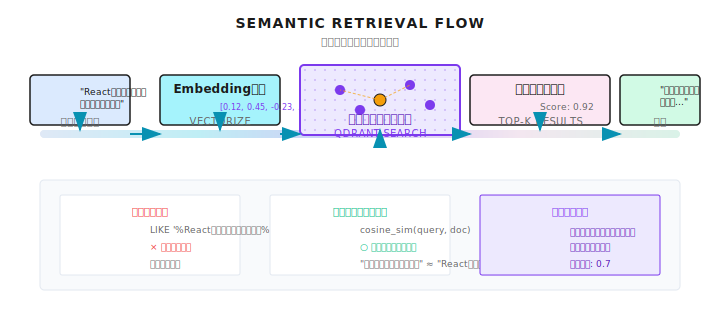
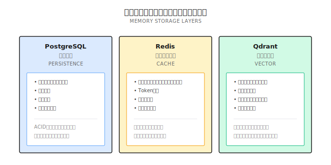

# 第 8 章：メモリアーキテクチャ

> **メモリシステムがあれば、エージェントは「毎回初対面の人」から「使うほど分かってくれる相棒」に変わる。ただし、全部覚えてくれると思ったら大間違い。ベクトル類似度は完全一致じゃないし、再現率と精度のトレードオフは避けられない。**

---

エージェント（Agent）に1週間かけて技術方針を調べてもらったとする。

毎日チャットして、何十もの細かい点を議論した。やっと方針が決まった。

1週間後に戻ってきて聞く：「前に決めた方針ってどれだっけ？」

返事：「申し訳ありません、何のことか分かりません」

**え、マジで？**

1週間の議論、全部忘れた？ ふざけてるの？

これはエージェントの問題じゃない。**メモリシステムがない**のが問題なんだ。

前章のコンテキストウィンドウ管理は、「単一の会話内」のメモリを扱った。でもユーザーがブラウザを閉じたり、デバイスを変えたり、数日後に戻ってきたりしたら、そのコンテキストは消えてしまう。

実際のシナリオでは、ユーザーは：
- 中断した後、昨日の話題を続けたい
- エージェントに自分の好みを覚えてほしい
- 毎回背景を説明し直すのは嫌

メモリシステムがないエージェントは、記憶喪失の患者みたいなもんだ——会うたびに自己紹介からやり直し。

---

## 8.1 メモリの種類

メモリは全部同じじゃない。4種類に分けて考えよう：

| 種類 | 時間スパン | 例 | 保存方法 |
|------|----------|------|----------|
| **ワーキングメモリ** | 秒〜分 | 今処理中のコード片 | コンテキストウィンドウ |
| **セッションメモリ** | 分〜時間 | 今回の会話履歴 | Redis キャッシュ |
| **長期メモリ** | 日〜月 | ユーザーの好み、成功パターン | PostgreSQL |
| **セマンティックメモリ** | 永続 | 関連する過去の Q&A、知識ベース | ベクトルデータベース |

ワーキングメモリとセッションメモリは、前章のコンテキストウィンドウ管理でカバーした。

この章では**長期メモリとセマンティックメモリ**に焦点を当てる——セッションをまたいでエージェントに記憶させる方法だ。

---

## 8.2 なぜ従来のデータベースじゃダメなの？

「MySQL や PostgreSQL で履歴を保存すればいいじゃん」と思うかもしれない。

問題は：**ユーザーは正確なクエリをしない**ってこと。

ユーザーが「React コンポーネントの最適化方法は？」と聞いても、保存してあるのは「フロントエンドレンダリング性能向上方策」かもしれない。

文字列は全然違うけど、意味は関連してる。

```sql
-- 従来のクエリ：見つからない
SELECT * FROM memories WHERE content LIKE '%Reactコンポーネント最適化%';

-- ユーザーが本当に必要なのは：意味的に関連した履歴
-- 「フロントエンドレンダリング性能」≈「Reactコンポーネント最適化」
```

これがベクトルデータベースの価値だ：**完全一致じゃなく、意味的類似度で検索する**。



---

## 8.3 ストレージ層の設計

Shannon のメモリシステムは3種類のストレージを使っている。それぞれ役割がある：



### なぜ3種類なの？

**PostgreSQL**：ACID トランザクションが必要なデータ向け。
- 実行履歴：どのエージェントが何をしたか、成功したか失敗したか
- 監査ログ：誰がいつ何をしたか
- ユーザー設定：明示的に保存された設定

**Redis**：ホットデータのキャッシュ、ミリ秒単位のアクセス。
- アクティブセッション：データベースクエリを減らす
- Token 予算：リアルタイム追跡、アトミック操作が必要
- レート制限：高頻度の読み書き

**Qdrant**：ベクトル類似度検索。
- セマンティックメモリ：「意味が近い」履歴を見つける
- 圧縮サマリー：前章で説明したサマリーの保存
- ドキュメントチャンク：RAG シナリオの知識ベース

### なぜ Qdrant？

ベクトルデータベースは選択肢が多い：Pinecone、Milvus、Weaviate、Qdrant...

Shannon が Qdrant を選んだ主な理由：
- **オープンソースでセルフホスト可能**：SaaS に依存せず、データは自分の手元に
- **高性能**：Rust 実装、単一マシンで100万ベクトル級
- **シンプルな API**：学習コスト低い

ただし、これが唯一の選択肢じゃない。Pinecone や Milvus を使っても、コアコンセプトは同じ。

### 別のアプローチ：ローカルファイルストレージ

上で説明したのはサーバーサイドのストレージね。でも2025年以降、開発者ツール界隈では別のパターンが人気になってきてる：**ローカルファイルで永続化する**方式だ。

代表例：
- **Claude Code**：`CLAUDE.md` ファイルでプロジェクトレベルのメモリを保存、`~/.claude/` ディレクトリでユーザーレベルの設定を保存
- **Cursor**：`.cursor/` ディレクトリでプロジェクトのコンテキストとルールを保存
- **Windsurf**：同様のローカルファイル方式

この方式のメリットはストレート：
- **デプロイ不要**：データベースサービスがいらない
- **バージョン管理と相性良い**：そのまま git commit できる
- **ユーザーが読み書き可能**：Markdown ファイルだから人間にやさしい
- **プライバシー**：データがローカルから出ない

でも明確な制限もある：
- **マルチデバイス同期に向かない**：クラウドストレージを使わない限り
- **セマンティック検索が弱い**：ファイル内容はキーワードマッチだけ、ベクトル類似度はない
- **スケールに限界**：ファイルが大きくなると読み込み速度に影響

Shannon はサーバーサイドストレージを選んだ。マルチテナント、マルチデバイス、セマンティック検索が必要なエンタープライズ向けアプリケーションがターゲットだからね。

でもシングルマシンの開発者ツールを作るなら、ローカルファイル方式は検討に値する——シンプル、透明、ユーザーがコントロールできる。

---

## 8.4 セマンティック検索はどうやる？

コアフロー：

```
ユーザーの質問: 「React コンポーネントの最適化方法は？」
            │
            ▼
    質問の Embedding ベクトルを生成
            │
            ▼
    Qdrant で類似ベクトルを検索
            │
            ▼
    返却: 「以前議論したフロントエンド性能最適化方策...」
```

### Embedding って何？

テキストを数値の列（ベクトル）に変換すること。意味が近いテキストは、ベクトルも近くなる。

```python
# 意味が近い2つの文
text1 = "React コンポーネント性能最適化"
text2 = "フロントエンドレンダリング効率向上"

vec1 = embedding_model.encode(text1)  # [0.12, 0.45, -0.23, ...]
vec2 = embedding_model.encode(text2)  # [0.11, 0.43, -0.21, ...]

# コサイン類似度を計算
similarity = cosine_sim(vec1, vec2)  # 0.92 - かなり似てる
```

ベクトルの次元は通常 768 か 1536。OpenAI の `text-embedding-3-small` は 1536 次元だ。

### Embedding モデルの選択

> **鮮度注意** (2026-01): モデルの価格は頻繁に変わるため、各ベンダーの公式サイトで最新価格を確認してほしい。

| モデル | 次元 | 価格 | 説明 |
|------|------|------|------|
| `text-embedding-3-small` | 1536 | $0.02/M tokens | OpenAI 推奨 |
| `text-embedding-3-large` | 3072 | $0.13/M tokens | より正確だけど高い |
| `bge-large-zh` | 1024 | 無料（ローカル） | 中国語最適化 |
| `multilingual-e5-large` | 1024 | 無料（ローカル） | 多言語対応 |

Shannon はデフォルトで `text-embedding-3-small` を使ってる。コストと効果のバランスが良い。

### 類似度の閾値

検索時に閾値を設定する必要がある。高すぎると見つからない、低すぎるとゴミが返ってくる：

```go
// 高すぎ、ほとんどマッチしない
Threshold: 0.95

// 低すぎ、無関係なものが返ってくる
Threshold: 0.3

// 実測でバランス良い
Threshold: 0.7
```

自分でテストした結果、0.7 が良いスタートポイントだね。具体的なシナリオで調整できる：
- **精度重視（コード検索）**：0.8 に上げる
- **広く探す（アイデア探索）**：0.6 に下げる

---

## 8.5 階層的メモリ検索

単純なセマンティック検索だけじゃ足りない。実際には複数の戦略を融合する必要がある：

```
ユーザーの質問: 「さっきの議論を続けて」
              │
              ├── Recent（直近5件）
              │   └── 会話の連続性を保つ
              │
              ├── Semantic（意味的に関連する3件）
              │   └── 履歴から関連するものを探す
              │
              └── Summary（サマリー2件）
                  └── 長期コンテキストを素早く把握
```

### なぜ階層化するの？

- **Recent**：ユーザーが「さっきの」と言ったら、最近の会話が必要
- **Semantic**：ユーザーが関連トピックを聞いたら、履歴から関連するものが必要
- **Summary**：長い会話の圧縮サマリー、素早くコンテキストを構築

3層を融合して、重複を除いて返す。

### 実装リファレンス

Shannon の `FetchHierarchicalMemory` 関数：

```go
func FetchHierarchicalMemory(ctx context.Context, in Input) (Result, error) {
    result := Result{Items: []Item{}, Sources: map[string]int{}}
    seen := make(map[string]bool)  // 重複排除用

    // 1. 時間軸：直近 N 件
    if in.RecentTopK > 0 {
        recent := FetchSessionMemory(ctx, in.SessionID, in.RecentTopK)
        for _, item := range recent {
            item["_source"] = "recent"  // ソースをマーク
            result.Items = append(result.Items, item)
            seen[item.ID] = true
        }
    }

    // 2. 意味軸：関連 N 件
    if in.SemanticTopK > 0 && in.Query != "" {
        semantic := FetchSemanticMemory(ctx, in.Query, in.SemanticTopK)
        for _, item := range semantic {
            if !seen[item.ID] {  // 重複排除
                item["_source"] = "semantic"
                result.Items = append(result.Items, item)
                seen[item.ID] = true
            }
        }
    }

    // 3. 圧縮軸：履歴サマリー
    if in.SummaryTopK > 0 {
        summaries := FetchSummaries(ctx, in.Query, in.SummaryTopK)
        for _, item := range summaries {
            item["_source"] = "summary"
            result.Items = append(result.Items, item)
        }
    }

    // 4. 総数を制限、コンテキスト爆発を防ぐ
    maxTotal := 10
    if len(result.Items) > maxTotal {
        result.Items = result.Items[:maxTotal]
    }

    return result, nil
}
```

`_source` マークが重要なんだ。後続の処理で、ソースに応じて優先度を決められる：
- Recent ソースの情報：ユーザーが明示的に言及したとき優先使用
- Semantic ソースの情報：背景参考として
- Summary ソースの情報：長期コンテキストの構築を助ける

---

## 8.6 メモリ保存：重複排除とチャンキング

メモリを保存するのは「全部放り込む」ほど単純じゃない。3つの重要な問題がある：

### 問題 1：重複コンテンツ

ユーザーが似たような質問をしたら、複数回保存すべきじゃない。

```go
// 重複チェック（95%類似度閾値）
const duplicateThreshold = 0.95

similar, _ := vdb.Search(ctx, queryEmbedding, 1, duplicateThreshold)
if len(similar) > 0 && similar[0].Score > duplicateThreshold {
    // スキップ、似たものが既にある
    return
}
```

### 問題 2：長い回答のチャンキング

回答がめちゃくちゃ長くなることがある。1つの大きなベクトルとしてそのまま保存すると、検索効果が悪い——長いテキストの embedding は意味が「薄まる」から。

チャンクに分けて保存し、検索時に集約する必要がある：

```go
// 長いテキストをチャンク分割して保存
if len(answer) > chunkThreshold {  // 例えば 2000 tokens
    chunks := chunker.ChunkText(answer, ChunkConfig{
        MaxTokens:    2000,
        OverlapTokens: 200,  // チャンク間でオーバーラップ、コンテキスト維持
    })

    // バッチで embedding 生成（1回の API 呼び出し、節約）
    embeddings := svc.GenerateBatchEmbeddings(ctx, chunks)

    // 各チャンクを別々に保存、ただし qa_id を共有
    qaID := uuid.New().String()
    for i, chunk := range chunks {
        payload := map[string]interface{}{
            "query":       query,
            "chunk_text":  chunk.Text,
            "qa_id":       qaID,           // 集約用
            "chunk_index": i,
            "chunk_count": len(chunks),
        }
        vdb.Upsert(ctx, embeddings[i], payload)
    }
}
```

検索時に、`qa_id` で同じ回答のチャンクを集約する：

```go
// 検索後に集約
results := vdb.Search(ctx, queryVec, 10, 0.7)

// qa_id でグループ化
grouped := make(map[string][]Result)
for _, r := range results {
    qaID := r.Payload["qa_id"].(string)
    grouped[qaID] = append(grouped[qaID], r)
}

// 完全な回答を再構築
for qaID, chunks := range grouped {
    // chunk_index でソート
    sort.Slice(chunks, func(i, j int) bool {
        return chunks[i].Payload["chunk_index"].(int) < chunks[j].Payload["chunk_index"].(int)
    })
    // 連結
    fullAnswer := ""
    for _, chunk := range chunks {
        fullAnswer += chunk.Payload["chunk_text"].(string)
    }
}
```

### 問題 3：価値の低いコンテンツ

全てのコンテンツを保存する価値があるわけじゃない：

```go
// 価値の低いコンテンツはスキップ
if len(answer) < 50 {
    return  // 短すぎ、情報量なし
}

if containsError(answer) {
    return  // エラーメッセージ、メモリを汚染しない
}

if isSmallTalk(query) {
    return  // 雑談、保存価値なし
}
```

---

## 8.7 エージェントレベルの分離

マルチエージェントシナリオでは、各エージェントが独自のメモリ空間を持てる。

```go
type FetchAgentMemoryInput struct {
    SessionID string
    AgentID   string  // 重要：エージェントレベルの分離
    TopK      int
}

func FetchAgentMemory(ctx context.Context, in Input) (Result, error) {
    // session_id + agent_id でフィルタリング
    filter := map[string]interface{}{
        "session_id": in.SessionID,
        "agent_id":   in.AgentID,
    }
    items := vdb.SearchWithFilter(ctx, queryVec, filter, in.TopK)
    return Result{Items: items}, nil
}
```

シナリオ：リサーチエージェントとコードエージェントがそれぞれ独自のメモリを持ち、互いに干渉しない。

リサーチエージェントは「ユーザーの競合に対する見方」を覚えていて、コードエージェントは「ユーザーのコーディングの好み」を覚えている。

混ぜてしまうと、コードエージェントがコードを書くときに競合分析の話を始めるかもしれない——それは変だよね。

---

## 8.8 戦略学習（上級）

より高度なメモリは単に「Q&A ペア」を保存するだけじゃなく、「何が効果的か」も学習できる。

### 分解パターンのメモリ

成功したタスク分解方法を記憶する：

```go
type DecompositionMemory struct {
    QueryPattern string    // 「API 性能を最適化」
    Subtasks     []string  // 分解されたサブタスク
    Strategy     string    // "parallel" or "sequential"
    SuccessRate  float64   // この分解方法の成功率
    UsageCount   int       // 何回使われたか
}
```

次に似たタスクに遭遇したら、成功した分解パターンを再利用できる：

```go
func (advisor *DecompositionAdvisor) Suggest(query string) Suggestion {
    // 履歴から似た成功分解を探す
    for _, prev := range advisor.Memory.DecompositionHistory {
        if similar(query, prev.QueryPattern) > 0.8 && prev.SuccessRate > 0.9 {
            return Suggestion{
                Subtasks:   prev.Subtasks,
                Strategy:   prev.Strategy,
                Confidence: prev.SuccessRate,
                Reason:     "Based on similar successful task",
            }
        }
    }
    return Suggestion{Confidence: 0}  // 再利用できるものが見つからなかった
}
```

### 失敗パターンの認識

失敗パターンを記憶して、同じ轍を踏まないようにする：

```go
type FailurePattern struct {
    Pattern    string   // "rate_limit"
    Indicators []string // ["quickly", "urgent", "asap"]
    Mitigation string   // 「レート制限を避けるため直列実行を検討」
    Severity   int      // 1-5
}

func (advisor *DecompositionAdvisor) CheckRisks(query string) []Warning {
    warnings := []Warning{}
    for _, pattern := range advisor.Memory.FailurePatterns {
        if matches(query, pattern.Indicators) {
            warnings = append(warnings, Warning{
                Pattern:    pattern.Pattern,
                Mitigation: pattern.Mitigation,
                Severity:   pattern.Severity,
            })
        }
    }
    return warnings
}
```

こうすればエージェントは使うほど賢くなる——何が効果的だったかを覚えて、繰り返し失敗を避ける。

---

## 8.9 性能最適化

### MMR 多様性

純粋な類似度検索だと、重複した内容がたくさん返ってくることがある。MMR（Maximal Marginal Relevance）を使って関連性と多様性のバランスを取る：

```
MMR = lambda * 関連性 - (1-lambda) * 選択済み結果との最大類似度

lambda = 0.7: 関連性重視（デフォルト）
lambda = 0.5: バランス
lambda = 0.3: 多様性重視
```

実装：

```go
// 3倍の候補を取得、MMR で再ランキング
poolSize := topK * 3
candidates := vdb.Search(ctx, vec, poolSize)
results := applyMMR(candidates, vec, topK, 0.7)  // lambda=0.7
```

効果：返される結果は関連性があり、かつ重複しない。

### バッチ Embedding

チャンク保存時、1回の API 呼び出しで全チャンクを処理：

```go
// ダメ：N チャンク → N 回の API 呼び出し
for _, chunk := range chunks {
    embedding := svc.GenerateEmbedding(ctx, chunk.Text)  // 遅い
}

// 良い：N チャンク → 1 回の API 呼び出し
embeddings := svc.GenerateBatchEmbeddings(ctx, chunkTexts)  // 5倍速い
```

性能向上：5倍速く、コストは変わらない。

### Payload インデックス

Qdrant で、よく使うフィルタフィールドにインデックスを作成：

```go
indexFields := []string{
    "session_id",
    "tenant_id",
    "agent_id",
    "timestamp",
}
for _, field := range indexFields {
    vdb.CreatePayloadIndex(ctx, collection, field, "keyword")
}
```

フィルタ性能が 50-90% 向上する。

### Embedding キャッシュ

同じテキストで何度も embedding を計算しないように：

```go
type EmbeddingCache struct {
    lru   *lru.Cache  // メモリ LRU、2048 件
    redis *redis.Client  // Redis 永続化
}

func (c *EmbeddingCache) Get(text string) ([]float32, bool) {
    key := hash(text)
    // まずメモリを確認
    if vec, ok := c.lru.Get(key); ok {
        return vec.([]float32), true
    }
    // 次に Redis を確認
    if vec, err := c.redis.Get(ctx, key).Bytes(); err == nil {
        c.lru.Add(key, vec)  // メモリにバックフィル
        return vec, true
    }
    return nil, false
}
```

---

## 8.10 プライバシー保護

メモリシステムはユーザーデータを保存するから、プライバシーはめちゃくちゃ重要。

### PII マスキング

保存前に自動で機密情報を検出して削除：

```go
func redactPII(text string) string {
    // メールアドレス
    text = emailRe.ReplaceAllString(text, "[REDACTED_EMAIL]")
    // 電話番号
    text = phoneRe.ReplaceAllString(text, "[REDACTED_PHONE]")
    // クレジットカード
    text = ccRe.ReplaceAllString(text, "[REDACTED_CC]")
    // マイナンバー/SSN
    text = ssnRe.ReplaceAllString(text, "[REDACTED_SSN]")
    // IP アドレス
    text = ipRe.ReplaceAllString(text, "[REDACTED_IP]")
    // API キー
    text = apiKeyRe.ReplaceAllString(text, "[REDACTED_API_KEY]")
    return text
}
```

Shannon は圧縮サマリーとメモリ保存の前にこの関数を呼び出してる。

### データ保持ポリシー

| データ種別 | 保持期間 | 説明 |
|----------|----------|------|
| 会話履歴 | 30 日 | 期限切れで自動削除 |
| 分解パターン | 90 日 | 成功パターンを保持 |
| ユーザー設定 | セッションレベル、24時間 | セッション跨ぎなし |
| 監査ログ | 永久 | コンプライアンス要件 |

### テナント分離

マルチテナントシナリオでは、異なるテナントのメモリは絶対に互いにアクセスできちゃダメ：

```go
func (m *Manager) GetSession(ctx context.Context, sessionID string) (*Session, error) {
    session := m.loadFromCache(sessionID)

    // テナント分離チェック
    userCtx := authFromContext(ctx)
    if userCtx.TenantID != "" && session.TenantID != userCtx.TenantID {
        // セッションの存在情報を漏らさない
        return nil, ErrSessionNotFound  // ErrUnauthorized じゃなく
    }

    return session, nil
}
```

返すのは `ErrSessionNotFound` であって `ErrUnauthorized` じゃないことに注意——セッションが存在するかどうかを漏らさないためだ。

---

## 8.11 よくあるハマりどころ

### ハマりどころ 1：Embedding サービス未設定

メモリ機能がサイレントにデグレードして、エージェントが「物忘れ」するように見える。

```bash
# 必須の設定
OPENAI_API_KEY=sk-...
```

OpenAI キーがないと、Shannon のメモリ機能はサイレントにデグレードする：エラーは出ないけど、動かない。

### ハマりどころ 2：類似度閾値が不適切

高すぎると見つからない、低すぎるとゴミが返ってくる。0.7 から調整を始めよう。

### ハマりどころ 3：重複排除なし

同じコンテンツが繰り返し出てきて、コンテキストを浪費する。`qa_id` と類似度閾値で重複排除。

### ハマりどころ 4：価値の低いコンテンツを保存

エラーメッセージや短い回答がメモリを汚染する。自動でスキップしよう。

### ハマりどころ 5：_source マークを無視

Recent/Semantic/Summary のソースが違えば、優先度も違う。区別して処理すること。

### ハマりどころ 6：チャンクが大きすぎまたは小さすぎ

```go
// 大きすぎ：意味が薄まる、検索効果が悪い
ChunkConfig{MaxTokens: 8000}

// 小さすぎ：コンテキストが失われる、断片化
ChunkConfig{MaxTokens: 200}

// 推奨
ChunkConfig{MaxTokens: 2000, OverlapTokens: 200}
```

---

## Shannon Lab（10分で始める）

このセクションで、本章のコンセプトを Shannon のソースコードにマッピングする。

### 必読（1ファイル）

- [`docs/memory-system-architecture.md`](https://github.com/Kocoro-lab/Shannon/blob/main/docs/memory-system-architecture.md)：「Storage Layers」「Memory Types」「Advanced Chunking System」セクションを重点的に見て、3層ストレージとチャンキングメカニズムを理解する

### 選読（2つ、興味に応じて）

- [`activities/semantic_memory.go`](https://github.com/Kocoro-lab/Shannon/blob/main/go/orchestrator/internal/activities/semantic_memory.go)：`FetchHierarchicalMemory` 関数を見て、階層検索ロジックと重複排除メカニズムを理解する
- [`vectordb/client.go`](https://github.com/Kocoro-lab/Shannon/blob/main/go/orchestrator/internal/vectordb/client.go)：`Search`、`Upsert` メソッドを見て、ベクトルデータベースの基本操作を理解する

---

## 練習

### 練習 1：メモリ戦略を設計

カスタマーサポートエージェントを作っていて、以下を記憶する必要がある：
- ユーザーの過去のチケット
- ユーザーの製品の好み
- よくある質問の解決策

メモリアーキテクチャを設計しよう：
- 何を使って保存する？
- どうやって検索する？
- どうやって重複排除する？

### 練習 2：ソースコードリーディング

`semantic_memory.go` を読んで、以下に答えよう：
1. `_source` フィールドの取りうる値は？
2. Recent と Semantic が同じレコードを返したら、何が起こる？
3. なぜ総数を 10 に制限している？

### 練習 3（上級）：MMR を実装

MMR の再ランキング関数を自分で書いてみよう：

```go
func applyMMR(candidates []SearchResult, queryVec []float32, topK int, lambda float64) []SearchResult {
    // あなたの実装
}
```

考えてみよう：
- 時間計算量は？
- 最適化できる？

---

## まとめ

核心は一言：**メモリシステムがあれば、エージェントは「ステートレス」から「経験あり」になる**。

要点：

1. **3層ストレージ**：PostgreSQL + Redis + Qdrant、それぞれ役割がある
2. **セマンティック検索**：Embedding + ベクトル類似度で「意味が近い」履歴を探す
3. **階層融合**：Recent + Semantic + Summary、3層で重複排除しながらマージ
4. **スマートな重複排除**：95%類似度閾値 + qa_id
5. **戦略学習**：成功パターンを記憶、失敗パターンを認識

**でも期待しすぎないで**：ベクトル類似度は完全一致じゃないし、再現率と精度のトレードオフは避けられない。「見つからない」のは閾値の問題かもしれないし、「見つかったけど違う」のは embedding モデルの限界かもしれない。

メモリシステムは情報の保存と検索を解決した。でもマルチターン対話には、セッション管理、状態追跡、プライバシー保護などの問題もある。

次章では**マルチターン対話設計**——連続したやり取りでどう一貫性を保つか——を話そう。

次章で会おう。

---

## 延伸資料

- [Qdrant Vector Database](https://qdrant.tech/documentation/) - Qdrant 公式ドキュメント
- [RAG Best Practices](https://www.pinecone.io/learn/retrieval-augmented-generation/) - Pinecone の RAG ガイド
- [MMR for Information Retrieval](https://www.cs.cmu.edu/~jgc/publication/The_Use_MMR_Diversity_Based_LTMIR_1998.pdf) - MMR 原論文
- [Shannon Memory System](https://github.com/Kocoro-lab/Shannon/blob/main/docs/memory-system-architecture.md) - Shannon メモリシステムドキュメント
