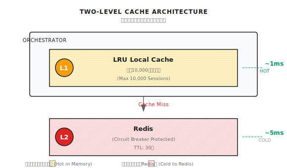

# 第 9 章：マルチターン対話設計

> **マルチターン対話は「メッセージを繋げるだけ」じゃ済まない。状態管理、プライバシー保護、重複排除——どれか一つでも抜けると、エージェント（Agent）が事故る。**
> **でもね、難しく考えすぎなくていい。本質は「会話を継続させる、データを守る、検索を正確に」の3つだけ。**

---

ユーザーがエージェントと20ターン会話した。

突然、ページをリロードした。

戻ってきたら——対話が全部消えていた。

**これが Session 管理をちゃんとやってない結果さ。**

もっとヤバいケースもある。

ユーザー A の対話履歴が、ユーザー B の会話に表示された。

**これがテナント分離をちゃんとやってない結果だ。**

---

## 9.1 マルチターン対話の課題

前の2章でコンテキストウィンドウとメモリシステムを解説した。この章では、それを実際の対話シーンに落とし込んでいく。

本番レベルの対話システムで解決すべき課題はこれだ：

| 課題 | 結果 | 解決の方向性 |
|------|------|----------|
| **Session 状態** | リロードで対話消失 | 永続化ストレージ |
| **メッセージ増加** | 履歴が長すぎる | スライディングウィンドウ + 圧縮 |
| **プライバシー保護** | 機密情報の漏洩 | PII マスキング |
| **会話識別** | 過去の対話が見つからない | 自動タイトル生成 |
| **意味的重複** | 検索結果が重複 | MMR リランキング |
| **テナント分離** | データ漏洩 | 厳格な権限チェック |

一つずつ見ていこう。

---

## 9.2 Session 管理

### 二層キャッシュアーキテクチャ

HTTP はステートレスだけど、対話はステートフル。リクエストのたびに会話をロードする必要があって、レイテンシに敏感なんだよね。

解決策：メモリキャッシュ + Redis 永続化。



ローカルキャッシュヒットは 1ms レベル、Redis は 5ms レベル。ホットデータはメモリに、コールドデータは Redis に落とす。

### Session 構造

Shannon の Session 構造はこうなってる：

```go
type Session struct {
    ID        string
    UserID    string
    TenantID  string                    // マルチテナント分離
    CreatedAt time.Time
    UpdatedAt time.Time
    ExpiresAt time.Time                 // TTL 期限
    History   []Message                 // メッセージ履歴
    Context   map[string]interface{}    // 会話変数（タイトル、設定など）
    Metadata  map[string]interface{}    // メタデータ

    // コスト追跡
    TotalTokensUsed int
    TotalCostUSD    float64
}

type Message struct {
    ID        string
    Role      string     // "user", "assistant", "system"
    Content   string
    Timestamp time.Time
    TokensUsed int
}
```

重要なフィールドをいくつか：

- **TenantID**：マルチテナント分離。異なるテナントの会話は相互アクセス不可
- **ExpiresAt**：TTL 期限切れ機構。30日間アイドルで自動クリーンアップ
- **TotalTokensUsed**：コスト追跡。予算管理をサポート

### テナント分離

これ、見落としがちだけどめちゃくちゃ重要：

```go
func (m *Manager) GetSession(ctx context.Context, sessionID string) (*Session, error) {
    session := m.loadFromCache(sessionID)

    // テナント分離チェック
    userCtx := authFromContext(ctx)
    if userCtx.TenantID != "" && session.TenantID != userCtx.TenantID {
        // Session の存在情報を漏らさない
        return nil, ErrSessionNotFound  // 注意：ErrUnauthorized ではない
    }

    return session, nil
}
```

**なぜ `ErrUnauthorized` じゃなくて `ErrSessionNotFound` を返すのか？**

セキュリティの原則：情報を漏らさないこと。

`ErrUnauthorized` を返すと、攻撃者に「この Session ID は存在する、ただ権限がないだけ」と教えてしまう。攻撃者はゆっくり列挙して、有効な Session ID を見つけ、他の攻撃を試みることができる。

`ErrSessionNotFound` を返せば、攻撃者は「存在しない」と「権限がない」を区別できない。

### ハイジャック防止

ユーザーが送ってきた Session ID が他人のものかもしれない：

```go
func (m *Manager) CreateSessionWithID(ctx context.Context, sessionID, userID string) (*Session, error) {
    // 既存チェック
    existing, _ := m.GetSession(ctx, sessionID)
    if existing != nil {
        if existing.UserID != userID {
            // Session は存在するが別の人のもの——ハイジャック試行の可能性
            m.logger.Warn("Attempted session hijacking",
                zap.String("session_id", sessionID),
                zap.String("attacker", userID),
                zap.String("owner", existing.UserID),
            )
            // 新しい ID を生成、再利用しない
            return m.CreateSession(ctx, userID, "", nil)
        }
        // 同一ユーザー、既存のものを返す
        return existing, nil
    }
    // 存在しない、通常通り作成
    return m.createNewSession(sessionID, userID)
}
```

シナリオ：攻撃者が Session ID を推測して、そのユーザーになりすまそうとした。システムは不一致を検出し、再利用を拒否、新しい ID を生成する。

---

## 9.3 メッセージ履歴管理

### スライディングウィンドウ

対話は数百ターンになることもある。全部保存するわけにはいかないから、上限を設定する：

```go
func (m *Manager) AddMessage(ctx context.Context, sessionID string, msg Message) error {
    session, _ := m.GetSession(ctx, sessionID)
    session.History = append(session.History, msg)

    // スライディングウィンドウでトリミング
    if len(session.History) > m.maxHistory {
        session.History = session.History[len(session.History)-m.maxHistory:]
    }

    return m.UpdateSession(ctx, session)
}
```

`maxHistory` は通常 500 に設定。超えたら最も古いものから削除。

**なぜ 500 なのか？**

- 小さすぎ（例：50）：履歴が短すぎてコンテキスト不足
- 大きすぎ（例：5000）：Redis のストレージ負荷が大きく、ロードが遅い

500 はバランスポイントだね。普通の対話は 500 ターンを超えない。

### トークン予算での充填

maxHistory 内でも、トークン予算を超える可能性がある。最新から遡って、予算いっぱいまで詰めていく：

```go
func (s *Session) GetHistoryWithinBudget(maxTokens int) []Message {
    result := []Message{}
    currentTokens := 0

    // 最新のメッセージから開始
    for i := len(s.History) - 1; i >= 0; i-- {
        msg := s.History[i]
        msgTokens := estimateTokens(msg.Content)

        if currentTokens + msgTokens > maxTokens {
            break  // 予算使い切り
        }

        // 先頭に挿入して順序を維持
        result = append([]Message{msg}, result...)
        currentTokens += msgTokens
    }

    return result
}
```

これで保証されるのは：
1. 最新のメッセージを優先的に保持
2. トークン予算を超えない
3. メッセージの順序が正しい

---

## 9.4 PII マスキング

これ、見落とされがちだけど極めて重要な問題だよ。

### 問題のシナリオ

```
ユーザー入力: "クレジットカード番号は 4532-1234-5678-9012 です"
    │
    ▼
[LLM が要約に圧縮]
    │
    ▼
要約: "ユーザーがカード 4532-1234-5678-9012 の残高を照会"
    │
    ▼
[ベクトル DB に保存、永続保存]
    │
    ▼
[後続の対話で検索される可能性]
    │
    ▼
[他のユーザーやログシステムに漏洩]
```

クレジットカード番号が永続保存されてしまった。これは深刻なプライバシー漏洩だ。

### 解決策：保存前にマスキング

Shannon は2箇所で PII マスキングを行う：
1. 圧縮要約時
2. ベクトル DB への保存時

```go
func redactPII(s string) string {
    if s == "" {
        return s
    }

    // Email
    emailRe := regexp.MustCompile(`(?i)[a-z0-9._%+\-]+@[a-z0-9.\-]+\.[a-z]{2,}`)
    s = emailRe.ReplaceAllString(s, "[REDACTED_EMAIL]")

    // 電話番号
    phoneRe := regexp.MustCompile(`(?i)(\+?\d[\d\s\-()]{8,}\d)`)
    s = phoneRe.ReplaceAllString(s, "[REDACTED_PHONE]")

    // SSN（米国社会保障番号）
    ssnRe := regexp.MustCompile(`\b\d{3}-\d{2}-\d{4}\b`)
    s = ssnRe.ReplaceAllString(s, "[REDACTED_SSN]")

    // クレジットカード
    ccRe := regexp.MustCompile(`\b(?:\d{4}[-\s]?){3}\d{4}\b`)
    s = ccRe.ReplaceAllString(s, "[REDACTED_CC]")

    // IP アドレス
    ipRe := regexp.MustCompile(`\b(?:\d{1,3}\.){3}\d{1,3}\b`)
    s = ipRe.ReplaceAllString(s, "[REDACTED_IP]")

    // API Key
    apiKeyRe := regexp.MustCompile(`(?i)(api[_-]?key|token)[\s:=]+[\w-]{20,}`)
    s = apiKeyRe.ReplaceAllString(s, "[REDACTED_API_KEY]")

    // パスワード
    secretRe := regexp.MustCompile(`(?i)(password|secret|pwd)[\s:=]+\S{8,}`)
    s = secretRe.ReplaceAllString(s, "[REDACTED_SECRET]")

    return s
}
```

### 対応している PII タイプ

| タイプ | 例 | 置換後 |
|------|------|--------|
| Email | `user@example.com` | `[REDACTED_EMAIL]` |
| 電話番号 | `+1-234-567-8900` | `[REDACTED_PHONE]` |
| クレジットカード | `4532-1234-5678-9012` | `[REDACTED_CC]` |
| SSN | `123-45-6789` | `[REDACTED_SSN]` |
| IP | `192.168.1.1` | `[REDACTED_IP]` |
| API Key | `api_key=sk-xxx` | `[REDACTED_API_KEY]` |
| パスワード | `password=abc123` | `[REDACTED_SECRET]` |

### 限界

正規表現マスキングは万能じゃない：

- **誤検出**：`192.168.1.1` がコード内の定数で、本当の IP じゃないかもしれない
- **検出漏れ**：複雑な PII フォーマットは漏れる可能性がある
- **コンテキスト喪失**：マスキング後は LLM の理解に影響することがある

**本番環境での推奨事項**：
1. 正規表現を基本防衛ラインに
2. 機密性の高いシーンでは専門の PII 検出サービスを使用（AWS Comprehend、Google DLP など）
3. 保存内容を定期的に監査

---

## 9.5 会話タイトル生成

ユーザーが過去の対話を探しに戻ってきて、「Session 1」「Session 2」がずらっと並んでたら、識別できないよね。

意味のあるタイトルを自動生成する必要がある。

### LLM 生成

Shannon は LLM でタイトルを生成する：

```go
func (a *Activities) generateTitleWithLLM(ctx context.Context, query string) (string, error) {
    prompt := fmt.Sprintf(`Generate a chat session title from this user query.

Rules:
- Use the SAME LANGUAGE as the user's query
- For English: 3-5 words, Title Case
- For Chinese/Japanese/Korean: 5-15 characters
- No quotes, no trailing punctuation, no emojis

Query: %s`, query)

    result, err := llmCall(prompt)
    if err != nil {
        return "", err
    }

    // 結果をクリーンアップ
    title := strings.TrimSpace(result)
    title = strings.Trim(title, `"'`)

    return title, nil
}
```

### 冪等性

重要：一度だけ生成する。繰り返し生成しない。

```go
func GenerateSessionTitle(ctx context.Context, sessionID, query string) (string, error) {
    // 1. 冪等性チェック
    sess := getSession(sessionID)
    if title := sess.Context["title"]; title != "" {
        return title, nil  // 既存のタイトルあり、スキップ
    }

    // 2. LLM 生成
    title, err := generateTitleWithLLM(ctx, query)
    if err != nil {
        // 3. フォールバック：元のクエリを切り詰め
        title = truncateQuery(query, 40)
    }

    // 4. 長さ制限（UTF-8 に注意）
    titleRunes := []rune(title)
    if len(titleRunes) > 60 {
        title = string(titleRunes[:57]) + "..."
    }

    // 5. 保存
    updateContext(sessionID, "title", title)
    return title, nil
}
```

### フォールバック戦略

LLM 呼び出しは失敗する可能性がある（タイムアウト、API レート制限）。フォールバック方法は元のクエリを切り詰めること：

```go
func truncateQuery(query string, maxLen int) string {
    // 最初の行を取得
    if idx := strings.Index(query, "\n"); idx > 0 {
        query = query[:idx]
    }

    // 文字単位で切り詰め（バイトではなく、UTF-8 破壊を避ける）
    runes := []rune(query)
    if len(runes) > maxLen {
        // 単語境界で切り詰めを試みる
        truncated := string(runes[:maxLen])
        if lastSpace := strings.LastIndex(truncated, " "); lastSpace > maxLen/2 {
            truncated = truncated[:lastSpace]
        }
        return truncated + "..."
    }
    return query
}
```

**なぜ `string` を直接切り詰めるんじゃなくて `[]rune` を使うのか？**

Go の string は UTF-8 エンコードされたバイトシーケンス。日本語1文字は3バイト占める。バイト単位で切り詰めると、日本語文字の途中で切れて文字化けする可能性がある。

```go
// 間違い：バイト単位で切り詰め
s := "こんにちは"
s[:3]  // 文字化けの可能性

// 正しい：rune 単位で切り詰め
runes := []rune("こんにちは")
string(runes[:2])  // "こん"
```

---

## 9.6 意味的重複排除（MMR）

前章で意味検索について解説した。でも問題がある：返される結果が非常に似通っていることがあるんだ。

```
Query: "Kubernetes のネットワーク設定方法は？"

検索結果：
1. [0.95] K8s ネットワーク設定には CNI を先に設定...
2. [0.94] Kubernetes ネットワークは CNI プラグインで設定...
3. [0.93] K8s ネットワークの設定、まず CNI を選択...
4. [0.92] K8s のネットワークは CNI 設定に依存...
5. [0.85] Service Mesh でネットワーク機能を強化...
```

上位4つは同じことを言ってる。トークンの無駄遣いだ。

### MMR アルゴリズム

MMR（Maximal Marginal Relevance）は関連性と多様性のバランスを取る：

```
MMR(d) = lambda * Sim(d, query) - (1-lambda) * max(Sim(d, d_i))

ここで：
- Sim(d, query): ドキュメント d とクエリの類似度
- max(Sim(d, d_i)): ドキュメント d と選択済みドキュメントの最大類似度
- lambda: 重みパラメータ
  - 0.7: 関連性重視（デフォルト）
  - 0.5: バランス
  - 0.3: 多様性重視
```

### 実装

```go
func mmrReorder(queryVec []float32, items []SearchResult, topK int, lambda float64) []SearchResult {
    if len(items) <= topK {
        return items
    }

    selected := []int{}
    remaining := make(map[int]bool)
    for i := range items {
        remaining[i] = true
    }

    // 貪欲法で選択
    for len(selected) < topK && len(remaining) > 0 {
        bestIdx := -1
        bestScore := -1e9

        for i := range remaining {
            // クエリとの関連性
            relevance := cosineSim(queryVec, items[i].Vector)

            // 選択済み結果との最大類似度（ペナルティ項）
            maxSim := 0.0
            for _, s := range selected {
                sim := cosineSim(items[i].Vector, items[s].Vector)
                if sim > maxSim {
                    maxSim = sim
                }
            }

            // MMR 式
            score := lambda*relevance - (1-lambda)*maxSim

            if score > bestScore {
                bestScore = score
                bestIdx = i
            }
        }

        if bestIdx >= 0 {
            selected = append(selected, bestIdx)
            delete(remaining, bestIdx)
        }
    }

    // 結果を再構築
    result := make([]SearchResult, len(selected))
    for i, idx := range selected {
        result[i] = items[idx]
    }
    return result
}
```

### 使い方

```go
// 5件必要、先に15件取得（3倍）
candidates := vdb.Search(query, 15)
// MMR リランキング
results := mmrReorder(queryVec, candidates, 5, 0.7)
```

### 効果

```
重複排除後：
1. [0.95] K8s ネットワーク設定には CNI を先に設定...
2. [0.85] Service Mesh でネットワーク機能を強化...
3. [0.80] NetworkPolicy でセキュリティ分離...
```

より少ない結果で、より高い情報密度。

---

## 9.7 Circuit Breaker

Redis が落ちたらどうする？サービス全体を道連れにするわけにはいかない。

### 問題

```
ユーザーリクエスト → Session 読み込み → Redis タイムアウト（5秒）→ ユーザー待機 → 失敗
ユーザーリクエスト → Session 読み込み → Redis タイムアウト（5秒）→ ユーザー待機 → 失敗
...
```

Redis が落ちてると、各リクエストが5秒のタイムアウトを待つことになって、ユーザー体験は最悪だ。

### 解決策：Circuit Breaker

```go
type CircuitBreaker struct {
    failureCount    int
    lastFailure     time.Time
    state           State  // Closed, Open, HalfOpen
    failureThreshold int   // 5
    resetTimeout    time.Duration  // 30s
}

func (cb *CircuitBreaker) Execute(fn func() error) error {
    switch cb.state {
    case Open:
        // 回路開放、即座に拒否
        if time.Since(cb.lastFailure) > cb.resetTimeout {
            cb.state = HalfOpen  // 回復を試みる
        } else {
            return ErrCircuitOpen
        }
    case HalfOpen:
        // 半開状態、1回試す
        err := fn()
        if err != nil {
            cb.state = Open  // まだ失敗、開放を継続
            return err
        }
        cb.state = Closed  // 成功、回復
        cb.failureCount = 0
        return nil
    }

    // Closed 状態、通常実行
    err := fn()
    if err != nil {
        cb.failureCount++
        cb.lastFailure = time.Now()
        if cb.failureCount >= cb.failureThreshold {
            cb.state = Open  // 失敗が多すぎ、開放
        }
    }
    return err
}
```

Shannon の Redis クライアントは Circuit Breaker でラップされてる：

```go
client := circuitbreaker.NewRedisWrapper(redisClient, logger)
```

### フォールバック戦略

Circuit Breaker が開いたら、ローカルキャッシュにフォールバック：

```go
func (m *Manager) GetSession(ctx context.Context, sessionID string) (*Session, error) {
    // まずローカルキャッシュをチェック
    if session, ok := m.localCache[sessionID]; ok {
        return session, nil
    }

    // Redis をチェック（Circuit Breaker 付き）
    session, err := m.client.GetSession(ctx, sessionID)
    if err == ErrCircuitOpen {
        // Redis が切断、空の会話を返す（新規ユーザー体験）
        m.logger.Warn("Redis circuit open, creating new session")
        return m.createLocalSession(sessionID)
    }

    return session, err
}
```

---

## 9.8 よくある落とし穴

### 落とし穴 1：Session ID の衝突

```go
// インクリメント ID、衝突しやすい（特に分散環境で）
sessionID := fmt.Sprintf("session_%d", counter)

// UUID（推奨）
sessionID := uuid.New().String()
```

### 落とし穴 2：UTF-8 切り詰め

```go
// バイト単位で切り詰め、日本語文字を破壊する可能性
if len(title) > 50 {
    title = title[:50]  // 文字化けの可能性
}

// rune 単位で切り詰め（正しい）
runes := []rune(title)
if len(runes) > 50 {
    title = string(runes[:47]) + "..."
}
```

### 落とし穴 3：テナント分離の漏れ

```go
// そのまま返す（安全でない）
return session, nil

// テナント分離をチェック
if session.TenantID != userCtx.TenantID {
    return nil, ErrSessionNotFound  // ErrUnauthorized ではない
}
```

### 落とし穴 4：PII マスキングが不完全

Email だけ処理しても足りない。電話番号、クレジットカード、SSN、IP、API Key、パスワードなどをカバーする必要がある。

### 落とし穴 5：意味検索の重複排除なし

top-k 結果をそのまま使うと、重複だらけになる可能性がある。MMR リランキングを使おう。

### 落とし穴 6：Redis が落ちてサービス全体が落ちる

Circuit Breaker がないと、Redis タイムアウトがすべてのリクエストを遅くする。

### 落とし穴 7：タイトルの重複生成

リクエストのたびに LLM でタイトルを生成すると、お金の無駄。冪等性チェックを入れよう。

---

## Shannon Lab（10分で始める）

このセクションで、本章の概念を Shannon ソースコードに対応させる。10分でできるよ。

### 必読（1ファイル）

- [`session/manager.go`](https://github.com/Kocoro-lab/Shannon/blob/main/go/orchestrator/internal/session/manager.go)：`GetSession`、`CreateSessionWithID`、`AddMessage` 関数を見て、テナント分離、ハイジャック防止、スライディングウィンドウを理解

### 深掘り選読（2つ、興味に応じて）

- [`activities/context_compress.go`](https://github.com/Kocoro-lab/Shannon/blob/main/go/orchestrator/internal/activities/context_compress.go)：`redactPII` 関数を見て、PII マスキングの具体的な実装を理解
- [`activities/session_title.go`](https://github.com/Kocoro-lab/Shannon/blob/main/go/orchestrator/internal/activities/session_title.go)：`GenerateSessionTitle` 関数を見て、タイトル生成の冪等性とフォールバック戦略を理解

---

## 練習問題

### 練習 1：Session 構造の設計

EC カスタマーサポートエージェントを作るとして、以下をサポートする必要がある：
- マルチターンの商品相談
- 注文ステータス照会
- クレーム対応

Session 構造を設計してみよう：
- どんなフィールドが必要？
- テナント分離はどうする？
- 機密情報（注文番号、住所）はどう処理する？

### 練習 2：ソースコードリーディング

`session/manager.go` を読んで、答えてみよう：
1. `cleanupLocalCache` 関数はどんなキャッシュ追い出し戦略を使ってる？
2. なぜ `CreateSessionWithID` で `existing.UserID != userID` をチェックしてる？
3. Circuit Breaker はどこでラップされてる？

### 練習 3（応用）：PII 検出の実装

`redactPII` 関数を拡張して、以下の検出を追加してみよう：
- マイナンバー（12桁）
- 銀行口座番号（7桁）
- パスポート番号

考えてみよう：
- 誤検出（普通の数字を PII と判定）をどう避ける？
- フォーマットのバリエーション（スペースあり、ハイフンあり）はどう処理する？

---

## まとめ

要点は一言で言える：**マルチターン対話は、状態を管理し、長さを制御し、プライバシーを守り、重複を排除する**。

ポイント：

1. **二層キャッシュ**：LRU ローカルキャッシュ + Redis 永続化
2. **テナント分離**：`ErrUnauthorized` ではなく `ErrSessionNotFound` を返す
3. **PII マスキング**：保存前に機密情報をクリーンアップ
4. **タイトル生成**：LLM 生成 + 冪等性チェック + フォールバック切り詰め
5. **MMR 重複排除**：lambda=0.7 で関連性と多様性のバランス

---

ここまでで、Part 3（コンテキストとメモリ）は終わりだ。

解説した内容は：
- **第 7 章**：コンテキストウィンドウ管理——単一対話内の「短期記憶」
- **第 8 章**：メモリアーキテクチャ——セッションをまたぐ「長期記憶」
- **第 9 章**：マルチターン対話設計——本番環境への落とし込み

3章を通して、本番レベルのエージェントがどうやって「物事を記憶する」か理解できたはずだ。

次章からは Part 4（単体エージェントパターン）に入る。**プランニング**を解説する——エージェントが複雑なタスクを実行可能なステップに分解する方法だ。

「記憶する」から「行動する」へ。これがエージェント能力の重要な飛躍だよ。

---

## 参考資料

- [Redis Data Types](https://redis.io/docs/data-types/) - Redis データ構造
- [Circuit Breaker Pattern](https://martinfowler.com/bliki/CircuitBreaker.html) - Martin Fowler の定番記事
- [MMR 論文](https://www.cs.cmu.edu/~jgc/publication/The_Use_MMR_Diversity_Based_LTMIR_1998.pdf) - MMR の原論文
- [GDPR PII Categories](https://gdpr.eu/eu-gdpr-personal-data/) - GDPR の個人データ定義
- [Shannon Session Management](https://github.com/Kocoro-lab/Shannon/blob/main/go/orchestrator/internal/session/manager.go) - Shannon の Session 管理実装
