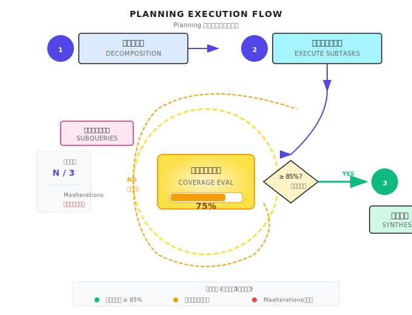

# 第10章：Planning パターン

> **Planning は「考えてから動く」じゃない。「考えながら動いて、動きながら評価する」の繰り返しだ。大事なのは完璧な計画を立てることじゃなくて、いつ止まるべきかを知ること。**

---

## 10.1 なぜ計画が必要なのか？

こんな場面を想像してみてほしい。

インターン生に「競合3社を調べてくれ」と頼んだとする。トヨタ、Tesla、BYD について。期待するのは何だろう？各社の製品ライン、技術的特徴、市場ポジション、強みと弱みを整理した比較レポートだよね。

でも、返ってきたのがこんな感じだったら？

トヨタの Wikipedia 要約 + Tesla のニュース切り抜き + BYD の公式サイトコピペ。情報はあるけど、構造がバラバラで比較できない。洞察なんてもってのほか。

**何が問題だったか？計画がなかったんだよ。** 彼はいきなり検索して、コピーして、整理し始めた。でも「何に答えるのか」「どう構成するのか」「どの情報が重要なのか」を考えてなかった。

エージェント（Agent）も同じ間違いを犯す。「OpenAI について調査して競合分析レポートを書いて」と直接言うと、すぐに検索・抽出・生成を始める。でも、出てくるのはたいてい情報の山積み。構造も深みもない。

これが Planning で解決したい問題だ。

### 複雑なタスクの特徴

### 直感的な説明

家をリフォームするとき、いきなり壁を塗り始めたりしないよね？まず考えるだろう：

1. 水道・電気は変更する？
2. 壁は取り壊す？
3. フローリングはいつ敷く？
4. 家具はいつ搬入する？

そうすると気づく。先にやらなきゃいけないこと（水道・電気）、並行でできること（天井と壁の塗装）、最後にやるべきこと（家具）があるって。

**これが Planning だ。**

エージェントも同じ。複雑なタスクに直面したら：

1. **分解**：大きなタスクを小さなタスクに分ける
2. **順序付け**：どれを先にやって、どれを後にするか
3. **評価**：終わったら十分か、続ける必要があるか

### 計画がないとどうなる？

こんなリクエストを考えてみよう：「OpenAI について調べて、完全な競合分析レポートを書いて」

LLM に直接やらせると：

| 問題 | 症状 | 結果 |
|------|------|------|
| **情報量が多すぎる** | コンテキストに一気に詰め込む | コンテキストウィンドウ超過、情報喪失 |
| **構造がない** | あっちこっちに話が飛ぶ | 出力がぐちゃぐちゃ |
| **追跡できない** | ユーザーは進捗がわからない | 体験最悪、途中で調整できない |
| **重複作業** | 同じ情報を何度も検索 | Token の無駄遣い |

### 計画があるとどうなる？

```
1. 会社の基本情報（設立、創業者、資金調達）
2. 製品マトリクス（GPT、API、ChatGPT）
3. 技術革新（Transformer、RLHF）
4. 競合分析（Google、Meta）
5. 市場ポジションと戦略
6. 総合レポート作成
```

各サブタスクが独立してコントロールできる。1つ目が終わったら保存。2つ目が終わったら保存。最後に統合。

途中でどこかが失敗した？その部分だけやり直せばいい。最初からやり直す必要はない。

---

## 10.2 Planning の3つのコア問題

Planning パターンは3つの問いに答える：

| 問い | 核心的な課題 | 本番環境での考慮点 |
|------|----------|----------|
| **どう分解する？** | 曖昧な要求を具体的なサブタスクに | 分解の粒度、スコープの境界 |
| **どう実行する？** | 依存関係と実行順序を決める | 並列 vs 直列、失敗時のリトライ |
| **いつ止める？** | 現在の進捗を評価、続けるか終わるか | カバー率の閾値、最大イテレーション |

3番目が一番見落とされがち。でも本番環境では一番重要だ。

この部分で事故を起こすエージェントを何度も見てきた。いつ止まるべきかわからず、無限ループに陥って、Token を使い果たして、何も有用なものを出せないまま終わる。

---

## 10.3 タスク分解

### 分解の入出力

タスク分解は Planning の第一歩だ。Shannon では LLM Service を通じて行われる：

```go
// 分解リクエストの入力
type DecompositionInput struct {
    Query          string                 // ユーザーの元のリクエスト
    Context        map[string]interface{} // コンテキスト情報
    AvailableTools []string               // 利用可能なツールリスト
}

// 分解の結果
type DecompositionResult struct {
    Mode              string    // "simple", "standard", "complex"
    ComplexityScore   float64   // 0.0 - 1.0
    Subtasks          []Subtask // サブタスクリスト
    ExecutionStrategy string    // "parallel", "sequential", "dag"
}
```

LLM はリクエストを見て教えてくれる：
- このタスクはどれくらい複雑か（0-1 スコア）
- いくつのサブタスクに分けるべきか
- サブタスク間の実行戦略

**実装参考 (Shannon)**: [`activities/decompose.go`](https://github.com/Kocoro-lab/Shannon/blob/main/go/orchestrator/internal/activities/decompose.go) - DecomposeTask 関数

### サブタスクの構造

各サブタスクは単なる説明文じゃない。完全な実行制約を持つ必要がある：

```go
type Subtask struct {
    ID              string
    Description     string
    Dependencies    []string  // 依存する他のサブタスク ID

    // 入出力の宣言
    Produces []string  // このサブタスクが生成するもの
    Consumes []string  // このサブタスクが必要とするもの

    // 実行制約
    SuggestedTools   []string
    SuggestedPersona string

    // スコープ境界
    Boundaries *BoundariesSpec
}
```

この構造はかなり細かく設計されている。いくつかの重要なフィールドを説明しよう。

**Produces/Consumes：依存関係の宣言**

```
Subtask 1: "会社の基本情報を収集"
  - Produces: ["company_info", "founding_date"]
  - Dependencies: []

Subtask 2: "製品マトリクスを分析"
  - Consumes: ["company_info"]
  - Produces: ["products", "pricing"]
  - Dependencies: ["subtask-1"]

Subtask 3: "競合分析"
  - Consumes: ["company_info", "products"]
  - Dependencies: ["subtask-1", "subtask-2"]
```

実行時はトポロジカルソート順で：subtask-1 が完了してから subtask-2 が開始できる（company_info が必要だから）。

**Boundaries：スコープの宣言**

これはサブタスク間の重複を防ぐためだ：

```go
// 製品を調査
subtask1 := Subtask{
    Description: "会社の製品を調査",
    Boundaries: &BoundariesSpec{
        InScope:    []string{"software products", "pricing"},
        OutOfScope: []string{"professional services"},
    },
}

// サービスを調査
subtask2 := Subtask{
    Description: "プロフェッショナルサービスを分析",
    Boundaries: &BoundariesSpec{
        InScope:    []string{"consulting", "implementation"},
        OutOfScope: []string{"software products"},
    },
}
```

境界宣言がないと、両方のサブタスクが「製品とサービス」を調べてしまうかもしれない。重複作業だ。

---

## 10.4 実行戦略

タスクを分解したら、どう実行するか決める必要がある。Shannon は3つの戦略をサポートしている：

| 戦略 | 適用場面 | 特徴 |
|------|----------|------|
| **parallel** | サブタスク同士が独立 | 最速、同時実行 |
| **sequential** | サブタスクに厳密な順序あり | 最も安定、でも最も遅い |
| **dag** | サブタスクに部分的な依存あり | 柔軟、トポロジカルソート順 |

### どう選ぶ？

```go
// 依存関係があるかチェック
hasDependencies := false
for _, subtask := range decomp.Subtasks {
    if len(subtask.Dependencies) > 0 {
        hasDependencies = true
        break
    }
}

// 依存ありなら hybrid（DAG）、なしなら parallel
if hasDependencies {
    executeHybridPattern(...)
} else {
    executeParallelPattern(...)
}
```

**実装参考 (Shannon)**: [`strategies/dag.go`](https://github.com/Kocoro-lab/Shannon/blob/main/go/orchestrator/internal/workflows/strategies/dag.go) - DAGWorkflow 関数

### トポロジカルソート

サブタスクに依存関係があるとき、トポロジカル順で実行する必要がある：

```
A (依存なし)
    |
B (A に依存)    C (A に依存)
    |           |
       D (B, C に依存)
```

実行順序：A → [B, C を並列] → D

これは LLM 特有の問題じゃない。標準的なグラフ理論のアルゴリズムだ。でもエージェントシステムでよく見落とされて、実行順序がめちゃくちゃになる。

---

## 10.5 カバー率評価

ここが Planning パターンで一番重要な部分だ。

Planning は一回きりじゃない。サブタスクを実行した後、こう問う必要がある：**十分か？続ける必要があるか？**



### 評価構造

```go
type CoverageEvaluationInput struct {
    Query            string
    CurrentSynthesis string  // 現在の統合結果
    CoveredAreas     []string
    Iteration        int
    MaxIterations    int
}

type CoverageEvaluationResult struct {
    OverallCoverage   float64         // 0.0 - 1.0
    CriticalGaps      []CoverageGap   // 必ず埋めるべきギャップ
    OptionalGaps      []CoverageGap   // オプションの改善点
    ShouldContinue    bool
    RecommendedAction string          // "continue", "complete"
}
```

### 確定的なガードレール

ここは特に強調したいポイントだ：**LLM の判断は不安定。ルールでカバーしなきゃダメ。**

```go
func EvaluateCoverage(ctx context.Context, input Input) (*Result, error) {
    // LLM による評価
    result := llmEvaluate(input)

    // === 確定的なガードレール ===

    // ルール 1: 最初のイテレーション + 低カバー率 → 必ず続行
    if input.Iteration == 1 && result.OverallCoverage < 0.5 {
        result.ShouldContinue = true
        result.RecommendedAction = "continue"
    }

    // ルール 2: 重要なギャップあり + まだ回数ある → 必ず続行
    if len(result.CriticalGaps) > 0 && input.Iteration < input.MaxIterations {
        result.ShouldContinue = true
    }

    // ルール 3: 最大イテレーション到達 → 必ず停止
    if input.Iteration >= input.MaxIterations {
        result.ShouldContinue = false
        result.RecommendedAction = "complete"
    }

    // ルール 4: 統合結果が短すぎるのに高カバー率を主張 → 信頼できない
    if len(input.CurrentSynthesis) < 500 && result.OverallCoverage > 0.7 {
        result.ConfidenceLevel = "low"
    }

    return result, nil
}
```

なぜこのガードレールが必要か？

- LLM は「カバー率 95%」と言うかもしれないが、統合結果は 200 文字しかない。ルール 4 が「信頼できない」とマークする。
- LLM は「終わっていい」と言うかもしれないが、まだ重要なギャップがある。ルール 2 が強制的に続行させる。
- LLM は「まだ続ける必要がある」と言い続けて、無限ループに陥るかもしれない。ルール 3 が強制的に停止させる。

**ガードレールが動作を予測可能にする。**

---

## 10.6 補足クエリの生成

評価でギャップが見つかったら、ターゲットを絞った補足クエリを生成する必要がある：

```go
type GeneratedSubquery struct {
    ID             string
    Query          string
    TargetGap      string   // どのギャップを対象にするか
    Priority       string   // "high", "medium", "low"
    SuggestedTools []string
}
```

生成時のプロンプトで LLM を誘導する：

```
あなたは調査クエリ生成器です。タスクはカバレッジギャップを埋めるための
ターゲットを絞ったサブクエリを生成することです。

## 目標：
1. カバレッジギャップを直接解決するクエリを生成
2. CRITICAL ギャップを優先
3. 重複や重なりのあるクエリを避ける

## 代替検索戦略（重要！）

標準検索で情報が見つからない場合は：
1. 会社のドメインに直接アクセス（web_fetch）
2. 日本企業なら日本語/ローカル言語で検索
3. LinkedIn/Crunchbase を検索
```

鍵は**多言語認識**だ。日本企業を調べるとき、日本語で検索したほうが結果がいい。これは多くのエージェントシステムが見落とす細かいポイントだ。

---

## 10.7 完全なフロー

これまでのコンポーネントをつなげてみよう：

```go
const MaxIterations = 3

func Research(ctx context.Context, query string) (string, error) {
    // 1. 初期分解
    decomposition := DecomposeTask(ctx, DecompositionInput{
        Query:          query,
        AvailableTools: []string{"web_search", "web_fetch"},
    })

    fmt.Printf("%d 個のサブタスクに分解、戦略: %s\n",
        len(decomposition.Subtasks), decomposition.ExecutionStrategy)

    // 2. サブタスク実行（トポロジカル順）
    var results []Result
    for _, subtask := range topologicalSort(decomposition.Subtasks) {
        result := executeSubtask(ctx, subtask)
        results = append(results, result)
    }

    // 3. 初期結果を統合
    synthesis := synthesize(ctx, query, results)

    // 4. 反復改善ループ
    for iteration := 1; iteration <= MaxIterations; iteration++ {
        // カバー率を評価
        coverage := EvaluateCoverage(ctx, CoverageEvaluationInput{
            Query:            query,
            CurrentSynthesis: synthesis,
            Iteration:        iteration,
            MaxIterations:    MaxIterations,
        })

        fmt.Printf("イテレーション %d: カバー率 %.0f%%, 続行: %v\n",
            iteration, coverage.OverallCoverage*100, coverage.ShouldContinue)

        if !coverage.ShouldContinue {
            break
        }

        // 補足クエリを生成
        subqueries := GenerateSubqueries(ctx, SubqueryGeneratorInput{
            Query:         query,
            CoverageGaps:  coverage.CriticalGaps,
            MaxSubqueries: 3,
        })

        // 補足クエリを実行
        for _, sq := range subqueries {
            result := executeSubquery(ctx, sq)
            results = append(results, result)
        }

        // 再統合
        synthesis = synthesize(ctx, query, results)
    }

    return synthesis, nil
}
```

出力例：

```
5 個のサブタスクに分解、戦略: sequential
イテレーション 1: カバー率 60%, 続行: true
イテレーション 2: カバー率 82%, 続行: true
イテレーション 3: カバー率 91%, 続行: false
調査完了
```

---

## 10.8 よくある落とし穴

### 落とし穴 1：過度な分解

**症状**：20 個以上のサブタスクに分解。それぞれがめちゃくちゃ小さい。

**問題**：調整コストが実行コストより高くなる。各サブタスクで LLM を呼び出し、待ち、失敗のリスクがある。

```go
// 分解しすぎ
subtasks := []Subtask{
    {Description: "会社名を検索"},
    {Description: "公式サイトを開く"},
    {Description: "About ページを探す"},
    {Description: "創業者情報を読む"},
    // ... 100 個のサブタスク
}

// 適度な粒度
subtasks := []Subtask{
    {Description: "会社の基本情報を収集（創業者、設立日、本社）"},
    {Description: "製品とサービスを分析"},
    {Description: "資金調達の歴史を調査"},
}
```

**経験則**：調査タスクなら、3-7 個のサブタスクで十分。

### 落とし穴 2：スコープの重複

**症状**：異なるサブタスクが重複するコンテンツを生成。

**問題**：Token の無駄遣い。統合時に重複除去が必要になる。

```go
// スコープが曖昧
subtask1 := Subtask{Description: "会社の製品を調査"}
subtask2 := Subtask{Description: "会社のサービスを分析"}
// 「製品」と「サービス」が重なるかも

// 明確な境界
subtask1 := Subtask{
    Description: "会社の製品を調査",
    Boundaries: &BoundariesSpec{
        InScope:    []string{"software products"},
        OutOfScope: []string{"professional services"},
    },
}
```

### 落とし穴 3：無限イテレーション

**症状**：10 回イテレーションしてもまだ止まらない。Token を使い果たす。

**問題**：LLM は常に「もっと良くできる」と思って、100% に到達することはない。

```go
// 停止条件がない
for {
    coverage := evaluateCoverage()
    if coverage.OverallCoverage < 1.0 {
        // 絶対に 100% にならない
        generateMoreQueries()
    }
}

// 複数の停止条件
for iteration := 1; iteration <= MaxIterations; iteration++ {
    coverage := evaluateCoverage()

    if coverage.OverallCoverage >= 0.85 && len(coverage.CriticalGaps) == 0 {
        break  // 品質達成
    }
    if iteration >= MaxIterations {
        break  // 予算切れ
    }
}
```

### 落とし穴 4：依存順序を無視

**症状**：サブタスク B がサブタスク A の出力を必要としているのに、B が先に実行されて、空のデータを受け取る。

```go
// 依存関係のあるタスクを並列実行（失敗する）
go execute(subtask1)  // company_info を生成
go execute(subtask2)  // company_info を消費（失敗！）

// トポロジカルソート後に実行
ordered := topologicalSort(subtasks)
for _, subtask := range ordered {
    execute(subtask)
}
```

---

## 10.9 いつ Planning を使うべきか？

すべてのタスクに計画が必要なわけじゃない。

| タスクタイプ | Planning 使う？ | 理由 |
|----------|-------------|------|
| 「今日の天気は？」 | いいえ | 直接調べるだけ |
| 「関数を書いて」 | いいえ | ReAct で十分 |
| 「この会社を調べてレポート書いて」 | はい | 分解が必要 |
| 「このコードベースのアーキテクチャを分析して」 | はい | 分解が必要 |
| 「この3つの選択肢を比較して」 | はい | 分解が必要 |

**経験則**：

- 1ステップで完了できる → 不要
- 複数回の検索/分析が必要 → 必要
- 構造化された出力が必要 → 必要
- 複数の視点が関わる → 必要

もっと簡単な判断基準もある：

> インターン生にこの仕事を頼むとき、まずアウトラインを説明するか？説明するなら、エージェントにも Planning が必要だ。

---

## 10.10 他のフレームワークはどうしてる？

Planning は汎用パターンで、Shannon 専用じゃない。各フレームワークに実装がある：

| フレームワーク | 実装方法 | 特徴 |
|------|----------|------|
| **LangGraph** | Plan-and-Execute ノード | 可視化、フロー制御可能 |
| **AutoGPT** | Task Queue | 高度に自律的、でも不安定 |
| **CrewAI** | Task 割り当て | チームコラボレーションのメタファー |
| **OpenAI Assistants** | 組み込み Planning（限定的） | ブラックボックス、制御不可 |

コアロジックはどれも同じ：分解 → 実行 → 評価 → 反復。

違いは：
- 分解の粒度とコントロール
- 反復のトリガー条件
- ガードレールの実装方法

---

## まとめ

1. **Planning の核心**：複雑なタスクはまず分解、それから実行、やりながら評価
2. **タスク分解**：Produces/Consumes で依存関係を宣言、Boundaries で重複を防止
3. **実行戦略**：依存なしなら parallel、依存ありなら DAG（トポロジカルソート）
4. **カバー率評価**：LLM 判断 + 確定的ガードレール、二重の保険
5. **停止条件**：品質達成、予算切れ、最大イテレーションのどれかで停止

---

## Shannon Lab（10 分で体験）

この節では、本章の概念を Shannon のソースコードに対応させる。10 分でできる。

### 必読（1 ファイル）

- [`strategies/dag.go`](https://github.com/Kocoro-lab/Shannon/blob/main/go/orchestrator/internal/workflows/strategies/dag.go)：`DAGWorkflow` 関数を見つけて、`DecomposeTask` でタスクを分解し、`hasDependencies` で実行戦略を選び、最後に `ReflectOnResult` で品質評価する流れを確認

### 選択読み（2 つ、興味に応じて）

- [`activities/decompose.go`](https://github.com/Kocoro-lab/Shannon/blob/main/go/orchestrator/internal/activities/decompose.go)：`DecompositionResult` 構造を見て、LLM Service が何を返すか理解する
- [`activities/types.go`](https://github.com/Kocoro-lab/Shannon/blob/main/go/orchestrator/internal/activities/types.go)：`Subtask` 構造を見て、Produces/Consumes/Boundaries の使い方を理解する

---

## 練習問題

### 練習 1：分解を設計する

「Anthropic を調べて、2000 字の会社分析を書いて」というタスクを手動で分解してみよう：

- 4-6 個のサブタスクをリストアップ
- 各サブタスクの Produces と Consumes を記述
- 依存グラフを描く（誰が誰に依存するか）
- parallel か sequential かを決める

### 練習 2：ソースコードを読む

`strategies/dag.go` の `executeHybridPattern` 関数を読んでみよう：

1. 依存関係のあるタスクをどう処理しているか？
2. `DependencyWaitTimeout` は何のためか？
3. 依存タスクが失敗したら、後続タスクはどうなるか？

### 練習 3（発展）：ガードレールを設計する

「Token 予算切れ」の停止条件を設計してみよう：

- 判断ロジックの擬似コードを書く
- 考えてみよう：この条件はループのどこでチェックすべきか？
- 考えてみよう：予算切れのとき、既存の結果を返すべきか、エラーを返すべきか？

---

## 参考文献

- [Task Decomposition in LLM Agents](https://www.promptingguide.ai/techniques/decomposition) - タスク分解のさまざまな技術
- [Topological Sort Algorithm](https://en.wikipedia.org/wiki/Topological_sorting) - 依存関係ソートのアルゴリズム基礎
- [MECE Framework](https://www.mckinsey.com/capabilities/strategy-and-corporate-finance/our-insights/mece) - コンサルティング会社の分解原則、エージェントにも適用可能

---

## 次章予告

ここまでで、エージェントは計画して実行できるようになった。でも一つ問題がある：自分がうまくやれているかどうか、どうやって知るんだろう？

自己反省しないエージェントは、コードをチェックしないプログラマーみたいなもの。いつかは事故る。

次章では **Reflection パターン** を話そう：エージェントに自己点検させて、出力品質を評価して、基準に達してなければフィードバック付きでリトライさせる方法だ。

第 11 章で会おう。
