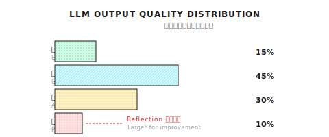
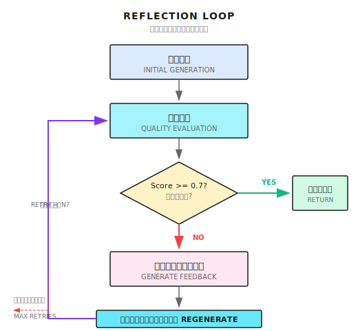

# 第11章 Reflectionパターン
── 自分の出力を振り返って、改善する

> **Reflectionはエージェントを完璧にするものじゃない。自分の問題を見つけられるようにするだけ。問題を見つけることが改善の第一歩だけど、改善そのものにはガードレールが必要だよ。**

---

## 11.1 なぜReflectionが必要なの？

Reflectionは、エージェントが自分で自分をチェックして、問題を見つけて、イテレーションで改善していくパターンです。核心的な価値は：**出力品質の下限を上げて、明らかなミスを減らす**こと。

LLMの1回の出力って、品質が安定しないんですよね。同じ質問を10回投げると、バラバラな回答が返ってくる。すごくいいのもあれば、普通のもあれば、明らかにダメなのもある。Reflectionの役割は「明らかにダメ」な出力を見つけて、もう1回チャンスをあげること。

ただ、先に言っとくと：**Reflectionは万能薬じゃない。** ダメな回答を良い回答に変えることはできない。できるのは「明らかな問題がある」回答を「まあ及第点」にすることだけ。LLM自体の能力が足りないとか知識が欠けてるなら、Reflectionじゃ救えない。

じゃあ何に使うの？　主に3つのシナリオ：

1. **高価値な出力**：調査レポート、技術ドキュメント──2倍のコストをかけてでも品質を保証したいもの
2. **客観的に評価できるタスク**：明確な評価基準があるシナリオ（完全性、正確性、フォーマット規約）
3. **イテレーションで改善**：初稿の品質が足りないとき、フィードバックで誘導して改善

### LLMの品質分布問題

### LLMの1回出力は品質が安定しない

同じ質問でも、ランダムシードが違うと全然違う回答が出てくることがある。ちょっと非公式な実験をやってみたんですよ。同じ調査質問を10回投げたら、品質分布はこんな感じだった：



ユーザーは1回のリクエストで、この分布から1つのサンプルしか受け取れない。たまたま「不良」ゾーンに当たったら、体験は最悪になる。

### Reflectionの役割

Reflectionパターンの核心は超シンプル：

1. 回答を1つ生成する
2. 別のLLM呼び出しでその回答の品質を評価する
3. 品質が基準に達してなければ、評価フィードバックを戻して再生成
4. 基準に達するか、最大リトライ回数に達するまで繰り返す



簡単に言うと：**エージェントに自己チェックを覚えさせる。**

### これは万能薬じゃない

続ける前に、はっきりさせとかないと。Reflectionはダメな回答を良い回答に変えることはできない。できるのは：

1. **問題を見つける**：回答の欠陥を識別する
2. **方向を示す**：再生成時に何に注意すべきか教える
3. **確率を上げる**：良い回答が出る確率を上げる

でも改善を保証することはできないし、無限にリトライもできない（コストが爆発する）。本番環境では、Reflectionは「錦上添花」的な最適化であって、コア依存じゃない。

---

## 11.2 Reflectionのコア構成要素

Reflectionパターンには3つのコア構成要素がある：

| 構成要素 | 責務 | 出力 |
|---------|------|------|
| **品質評価** | 回答にスコアをつける | Score (0.0 - 1.0) + フィードバック |
| **フィードバック生成** | 具体的な問題を指摘 | 具体的な改善提案 |
| **フィードバック付き再生成** | フィードバックに基づいて改善 | 改善後の回答 |

### 品質評価

```go
type EvaluateResultInput struct {
    Query    string   // 元の質問
    Response string   // 評価対象の回答
    Criteria []string // 評価基準
}

type EvaluateResultOutput struct {
    Score    float64 // 0.0 - 1.0
    Feedback string  // 改善提案
}
```

評価基準はシナリオに応じてカスタマイズできる：

```go
// 汎用基準
defaultCriteria := []string{
    "completeness",  // 質問のすべての側面をカバーしてるか
    "correctness",   // 情報は正確か
    "clarity",       // 表現は明確か
}

// 調査シナリオ
researchCriteria := []string{
    "completeness",
    "correctness",
    "clarity",
    "citation_coverage",  // 引用は十分か
    "source_quality",     // 情報源の品質
}

// コード生成シナリオ
codeCriteria := []string{
    "correctness",    // コードは正しいか
    "efficiency",     // 効率は適切か
    "readability",    // 可読性
    "edge_cases",     // エッジケースの処理
}
```

### 評価プロンプト

これが評価フェーズのプロンプトテンプレート：

```
以下の回答の品質を評価してください。

質問: {query}
回答: {response}

評価基準：
- completeness: すべての側面をカバーしているか
- correctness: 情報は正確か
- clarity: 表現は明確か

各基準を0.0-1.0でスコアリングし、加重平均を算出。
総合スコアが0.7未満の場合、具体的な改善提案を提示。

出力JSON:
{
  "overall_score": 0.75,
  "criteria_scores": {"completeness": 0.8, "correctness": 0.9, "clarity": 0.6},
  "feedback": "回答は以下の点で改善可能..."
}
```

---

## 11.3 ShannonのReflection実装

ShannonのReflection実装は`patterns/reflection.go`にあって、コア関数は`ReflectOnResult`：

```go
type ReflectionConfig struct {
    Enabled             bool     // 有効かどうか
    MaxRetries          int      // 最大リトライ回数、通常1-2
    ConfidenceThreshold float64  // 品質閾値、通常0.7
    Criteria            []string // 評価基準
    TimeoutMs           int      // タイムアウト
}
```

**実装参考 (Shannon)**: [`patterns/reflection.go`](https://github.com/Kocoro-lab/Shannon/blob/main/go/orchestrator/internal/workflows/patterns/reflection.go) - ReflectOnResult関数

### コアフロー

```go
func ReflectOnResult(
    ctx workflow.Context,
    query string,
    initialResult string,
    agentResults []activities.AgentExecutionResult,
    baseContext map[string]interface{},
    config ReflectionConfig,
    opts Options,
) (string, float64, int, error) {

    finalResult := initialResult
    var totalTokens int
    var retryCount int
    var lastScore float64 = 0.5

    // Reflectionが無効なら即座に返す
    if !config.Enabled {
        return finalResult, lastScore, totalTokens, nil
    }

    for retryCount < config.MaxRetries {
        // 1. 現在の結果を評価
        evalResult := evaluateResult(ctx, query, finalResult, config.Criteria)
        lastScore = evalResult.Score

        // 2. 基準を満たしてたら返す
        if evalResult.Score >= config.ConfidenceThreshold {
            return finalResult, evalResult.Score, totalTokens, nil
        }

        // 3. 基準未達、まだリトライできるかチェック
        retryCount++
        if retryCount >= config.MaxRetries {
            // 最大リトライ回数に達したら、今の最良結果を返す
            return finalResult, evalResult.Score, totalTokens, nil
        }

        // 4. フィードバック付きコンテキストを構築
        reflectionContext := map[string]interface{}{
            "reflection_feedback": evalResult.Feedback,
            "previous_response":   finalResult,
            "improvement_needed":  true,
        }

        // 5. フィードバック付きで再生成
        improvedResult := synthesizeWithFeedback(ctx, query, reflectionContext)
        finalResult = improvedResult
        totalTokens += improvedResult.TokensUsed
    }

    return finalResult, lastScore, totalTokens, nil
}
```

### 重要な設計判断

1. **MaxRetries制限**：無限ループ防止、通常1-2回に設定
2. **ConfidenceThreshold**：0.7が妥当なスタート地点、高すぎると頻繁にリトライが発生
3. **優雅な降格**：評価や再生成が失敗したら、エラーじゃなくて元の結果を返す

---

## 11.4 フィードバック付き再生成

評価で問題が見つかったら、フィードバックを再生成プロセスに渡す：

```go
// フィードバック付きコンテキストを構築
reflectionContext := map[string]interface{}{
    "reflection_feedback": "回答に以下の内容が欠けています：1) 資金調達履歴 2) 創業チーム",
    "previous_response":   previousResult,
    "improvement_needed":  true,
}
```

Synthesis（統合）フェーズでこのフィードバックを処理する：

```go
func SynthesizeWithFeedback(ctx context.Context, query string, context map[string]interface{}) string {
    var prompt strings.Builder

    // フィードバックがあるかチェック
    if feedback, ok := context["reflection_feedback"].(string); ok && feedback != "" {
        prompt.WriteString("重要：前回の回答は改善が必要です。\n")
        prompt.WriteString("フィードバック：" + feedback + "\n\n")
    }

    if prev, ok := context["previous_response"].(string); ok && prev != "" {
        prompt.WriteString("前回の回答（改善が必要）：\n" + prev + "\n\n")
    }

    prompt.WriteString("フィードバックに基づいて回答を改善してください：" + query)

    return callLLM(prompt.String())
}
```

ここで重要な設計：**前回の回答とフィードバックを一緒にLLMに渡す**。こうすることでLLMは：

1. 前回何を書いたか見える
2. 具体的にどこが問題か分かる
3. ピンポイントで改善できる

---

## 11.5 コストのトレードオフ

ReflectionはToken消費を増やす。これが最大の欠点。

```
Reflectionなし:
  - 入力: ~3000 tokens
  - 出力: ~5000 tokens
  - 合計: ~8000 tokens

Reflectionあり（1回イテレーション）:
  - 初期: ~8000 tokens
  - 評価: ~1000 tokens
  - 再生成: ~8000 tokens
  - 合計: ~17000 tokens (+112%)
```

コストが倍増するから、慎重に使わないと。

### コスト削減戦略

| 戦略 | 説明 | 効果 |
|------|------|------|
| **高価値出力だけに適用** | 調査レポートには使う、シンプルQ&Aには使わない | トリガー回数を減らす |
| **評価は小さいモデルで** | 評価はGPT-3.5、生成はGPT-4 | 評価コストを下げる |
| **リトライ回数を制限** | MaxRetries = 1で大体十分 | 最悪ケースを限定 |
| **妥当な閾値** | 0.7であって0.95じゃない | 不要なリトライを減らす |

```go
// コスト意識した設定
config := ReflectionConfig{
    Enabled:             true,
    MaxRetries:          1,        // 最大1回リトライ
    ConfidenceThreshold: 0.7,      // 妥当な閾値
    Criteria:            []string{"completeness", "correctness"},
}
```

### Shannonのやり方

ShannonはDAGワークフローでReflectionをこう呼び出してる：

```go
// 複雑なタスクでsynthesisサブタスクがない場合だけReflect
if config.ReflectionEnabled &&
   shouldReflect(decomp.ComplexityScore, &config) &&
   !hasSynthesisSubtask {

    reflectionConfig := patterns.ReflectionConfig{
        Enabled:             true,
        MaxRetries:          config.ReflectionMaxRetries,
        ConfidenceThreshold: config.ReflectionConfidenceThreshold,
        Criteria:            config.ReflectionCriteria,
    }

    improvedResult, score, reflectionTokens, err := patterns.ReflectOnResult(...)
}
```

`shouldReflect`関数に注目。全部のタスクにReflectionが必要なわけじゃなくて、複雑度が十分高いものだけがこのコストをかける価値がある。

---

## 11.6 よくある落とし穴

### 落とし穴1：閾値が高すぎる

**症状**：ほぼ毎回リトライが発生して、Token消費がめちゃくちゃ高い。

**原因**：0.95の閾値はほぼ達成不可能。LLMは自分の評価でほとんど満点をつけない。

```go
// 閾値0.95はほぼ達成不可能
config := ReflectionConfig{
    ConfidenceThreshold: 0.95,
    MaxRetries:          5,  // tokensの無駄
}

// 妥当な設定
config := ReflectionConfig{
    ConfidenceThreshold: 0.7,
    MaxRetries:          1,
}
```

### 落とし穴2：評価に高いモデルを使う

**症状**：Reflectionコストが生成コストより高い。

**原因**：評価タスクは比較的シンプルなので、小さいモデルで十分。

```go
// 評価時に model_tier = "small" を指定
// GPT-3.5とか安いモデルを使う
evalConfig := EvaluateConfig{
    ModelTier: "small",  // 大きいモデルは不要
}
```

### 落とし穴3：フィードバックが具体的じゃない

**症状**：リトライしても品質が上がらない。

**原因**：フィードバックが曖昧すぎて、LLMが具体的に何を直せばいいか分からない。

```go
// 曖昧なフィードバックは役に立たない
feedback := "回答の品質が十分じゃないので改善が必要"

// 具体的なフィードバックが効果的
feedback := "回答に欠けている項目：1) 資金調達履歴 2) 創業チームの経歴。" +
            "現在の引用はニュースサイトのみ。公式ソースを追加推奨。"
```

これは評価プロンプトの設計問題。LLMが具体的で実行可能なフィードバックを出すように誘導しないと。

### 落とし穴4：Reflection失敗でエラーを返す

**症状**：たまに起きる評価失敗でタスク全体が失敗。

**原因**：優雅な降格の仕組みがない。

```go
// ダメ：Reflection失敗でユーザーにエラーを見せる
if err != nil {
    return "", err
}

// 良い：優雅に降格して、初期結果を返す
if err != nil {
    log.Warn("Reflection failed, using initial result")
    return initialResult, nil
}
```

Reflectionは最適化であって、コア機能じゃない。失敗したら、ユーザーは初期結果を受け取るべきで、エラーじゃなく。

### 落とし穴5：無限ループ

**症状**：スコアが同じレベルで振動して、永遠に閾値に達しない。

**原因**：リトライ回数を制限してない。

```go
// 危険：スコアが同じレベルで振動する可能性
for score < 0.7 {
    improved = regenerate(feedback)
    score = evaluate(improved)
    // 永遠に0.7に達しないかも
}

// 安全：リトライ回数を制限
for retryCount := 0; retryCount < config.MaxRetries; retryCount++ {
    if score >= config.ConfidenceThreshold {
        break
    }
    // ...
}
```

---

## 11.7 Reflection vs 他の品質保証手段

Reflectionだけが品質保証の手段じゃない。いろんな方法を比較してみよう：

| 方法 | コスト | レイテンシ | 適用シナリオ |
|------|--------|-----------|-------------|
| **Reflection** | 高（2x+ tokens） | 高（2x+ 時間） | 高価値出力、レポート生成 |
| **Self-Consistency** | とても高（3x+ tokens） | 高（並列or直列複数回） | 数学推論、確定的回答 |
| **Human Review** | 人件費 | とても高（人を待つ） | 重要な意思決定、コンプライアンス要件 |
| **1回生成** | 最低 | 最低 | シンプルタスク、リアルタイム会話 |

### Self-Consistencyとは

Self-Consistencyは別の品質保証方法：複数の回答を生成して、最も一貫性のあるものを投票で選ぶ。

```
5つの回答を生成：
  回答1: 答えはA
  回答2: 答えはA
  回答3: 答えはB
  回答4: 答えはA
  回答5: 答えはA

投票結果：Aが4票、Aを採用
```

確定的な答えがあるシナリオ（数学問題、論理推論）には向いてるけど、オープンエンドな生成（回答が毎回違うから投票できない）には向かない。

### いつReflectionを使う？

| シナリオ | Reflection使う？ | 理由 |
|----------|-----------------|------|
| シンプルQ&A | いいえ | コストに見合わない |
| コード補完 | いいえ | 直接テストを実行できる |
| 調査レポート | はい | 出力価値が高い |
| ドキュメント生成 | はい | 品質要求が高い |
| 創作ライティング | 場合による | 助けになるかもだけど主観性が高い |
| リアルタイム会話 | いいえ | レイテンシに敏感 |

**経験則**：

- 出力価値が高い → 使う
- 客観的な評価基準がある → 使う
- シンプルタスク → 使わない
- レイテンシに敏感 → 使わない
- コストに敏感 → 慎重に使う

---

## 11.8 他のフレームワークはどうしてる？

Reflectionは汎用パターンで、各社が実装してる：

| フレームワーク | 実装方式 | 特徴 |
|---------------|----------|------|
| **LangGraph** | Reflectionノード | 可視化、デバッグしやすい |
| **Reflexion** | 論文実装 | 学術研究、言語フィードバック重視 |
| **Self-Refine** | イテレーション改善 | 自己批判 + 改善ループ |
| **Constitutional AI** | 原則駆動 | Anthropicの手法、安全性重視 |

コアロジックは全部同じ：評価 → フィードバック → リトライ。

違いは：
- 評価の次元（品質、安全性、フォーマット）
- フィードバックの粒度（曖昧 vs 具体的）
- 停止条件（閾値、回数、時間）

---

## 11.9 高度なトピック：評価の評価

ちょっとメタな問題がある：評価自体が正確かどうか、どうやって分かる？

LLMがLLMの出力を評価する。ここにはいくつか問題がある：

1. **評価者のバイアス**：評価モデルに独自の好みがあるかも
2. **スコアの校正**：モデルによってスコアの尺度が違う
3. **過信**：LLMは自分の出力に高いスコアをつけがち

### 緩和策

```go
// 方法1：別のモデルで評価
// ClaudeでGPT-4の出力を評価、またはその逆
evalConfig := EvaluateConfig{
    Provider: "anthropic",  // 生成はOpenAI、評価はAnthropic
}

// 方法2：確定的ルールを追加
if len(response) < 500 && evalResult.Score > 0.8 {
    // 短すぎる回答に高スコアはおかしい
    evalResult.Score = 0.5
    evalResult.Confidence = "low"
}

// 方法3：複数評価者で投票（コスト高い）
scores := []float64{
    evaluate(response, "model_a"),
    evaluate(response, "model_b"),
    evaluate(response, "model_c"),
}
finalScore := average(scores)
```

実際には方法2（確定的ルール）が最もよく使われる。コストがコントロールできるから。

---

## ポイントまとめ

1. **Reflectionの核心**：出力を評価 → フィードバック生成 → フィードバック付きリトライ
2. **コストのトレードオフ**：Token消費が倍増、高価値出力だけに有効化
3. **重要な設定**：MaxRetries = 1-2、ConfidenceThreshold = 0.7
4. **優雅な降格**：Reflection失敗時は元の結果を返す、エラーじゃなく
5. **具体的なフィードバック**：曖昧なフィードバックは役に立たない、何を直すか具体的に伝える

---

## Shannon Lab（10分で始める）

この節で、本章の概念をShannonソースコードに対応付けます。

### 必読（1ファイル）

- [`patterns/reflection.go`](https://github.com/Kocoro-lab/Shannon/blob/main/go/orchestrator/internal/workflows/patterns/reflection.go)：`ReflectOnResult`関数を探して、リトライ回数のループ、結果評価による信頼度判定、`reflectionContext`構築によるフィードバック注入を見る

### 選択で深掘り（2つ、興味に応じて）

- [`patterns/options.go`](https://github.com/Kocoro-lab/Shannon/blob/main/go/orchestrator/internal/workflows/patterns/options.go)：`ReflectionConfig`構造体を見て、各フィールドの役割を理解
- [`strategies/dag.go`](https://github.com/Kocoro-lab/Shannon/blob/main/go/orchestrator/internal/workflows/strategies/dag.go)：`ReflectOnResult`の呼び出し箇所を検索、DAGワークフローが「Reflectするかどうか」をどう決めてるか見る

---

## 演習

### 演習1：評価基準を設計する

以下のシナリオ向けに評価基準（Criteria）を設計してください：

1. **技術ドキュメント生成**：開発者向けにAPIドキュメントを書く
2. **カスタマーサポート返信**：ユーザーの製品質問に回答する
3. **競合分析**：競合の製品戦略を調査する

各シナリオで3-5個の評価次元を列挙し、なぜその次元を選んだか説明してください。

### 演習2：ソースコードリーディング

`patterns/reflection.go`の`ReflectOnResult`関数を読んでください：

1. `config.Enabled = false`だと何が起きる？
2. 評価アクティビティが失敗（errorを返す）したら、関数はどう処理する？
3. `totalTokens`はどう累積される？どの呼び出しのtokenが含まれる？

### 演習3（上級）：確定的ガードレールを設計する

Reflection評価用に3つの確定的ガードレールルールを設計してください：

- ルール1：「短い回答で高スコア」を防ぐ（短すぎる回答に高スコアは不適切）
- ルール2：「ソースなしで高スコア」を防ぐ（調査レポートで引用なしは高スコア不適切）
- ルール3：「フォーマットエラーで高スコア」を防ぐ（JSONフォーマットエラーは高スコア不適切）

各ルールの疑似コードを書いてください。

---

## もっと深く学びたい人へ

- [Self-Refine: Iterative Refinement with Self-Feedback](https://arxiv.org/abs/2303.17651) - 自己改善の原論文
- [Reflexion: Language Agents with Verbal Reinforcement Learning](https://arxiv.org/abs/2303.11366) - 言語フィードバックによる強化学習
- [Constitutional AI](https://arxiv.org/abs/2212.08073) - Anthropicの安全性アライメント手法、原則駆動の自己批判

---

## 次章の予告

ここまでで、エージェントは計画を立てられるし、実行もできるし、振り返りもできる。でもまだ1つ疑問がある：どうやって「推論」してるの？

気づいたことない？　LLMって時々「ステップを飛ばす」んですよね。いきなり答えを出すけど、どう考えたか分からない。

次章では**Chain-of-Thought (CoT)**について話します：LLMの推論プロセスを外に出して、一歩ずつ考えさせて、飛躍的なエラーを減らす方法。

次章で会いましょう。
