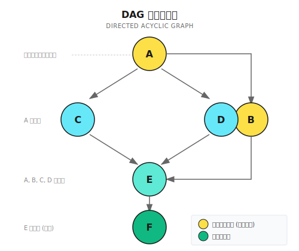
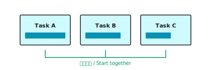
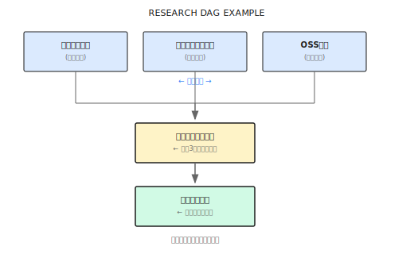

# 第 14 章：DAG ワークフロー

> **DAG ワークフローの本質は依存関係グラフだ。どのタスクを同時に実行できて、どれは待たないといけないのかをオーケストレーターに教える。ただし、グラフをどんなに綺麗に描いても、実行エンジンがポンコツなら意味がないよ。**

---

> **5分で核心を掴む**
>
> 1. DAG = 有向非巡回グラフ。依存関係でタスクの実行順序をモデル化する
> 2. 3つのパターン：Parallel（独立）、Sequential（チェーン）、Hybrid（複雑な依存）
> 3. Temporal のシングルスレッドモデルではロック不要。ただし決定論的 API を使うこと
> 4. 依存待機はインクリメンタルなタイムアウトチェックで。全タイムアウト時間を待ち続けない
> 5. シンプルな並列タスクなら DAG で十分。サブタスクが 5 個を超えたら Supervisor を検討
>
> **10分コース**：14.1-14.2 → 14.4 → Shannon Lab

---

## 14.1 何が問題なのか？

こんな場面を想像してみてほしい。

財務分析レポートを作成するとしよう。必要なデータは3つ：売上トレンド、コスト構造、利益率の変化。

一人で作業するなら、こうなる。まず売上データを調べて整理・分析、30分。次にコストデータ、また30分。最後に利益率、さらに30分。合計90分かかる。

でも、3人のアシスタントがいれば同時に動ける。Alice が売上を調べ、Bob がコストを調べ、Carol が利益率を調べる。30分後には3つのデータが揃って、あとは統合分析するだけ。

効率が3倍になるわけだ。

**DAG ワークフローの核心的な価値はここにある。どのタスクを並列実行できて、どれは待たないといけないのかをエージェントに教えることで、実行効率を最大化する。**

でも問題がある。後続タスクが前のタスクの結果に依存している場合はどうする？たとえば「利益率を計算」するには「売上」と「コスト」の両方のデータが揃ってからじゃないと始められない。これには依存関係の管理が必要だ。DAG（有向非巡回グラフ）はまさにこの依存関係を表現するためのものなんだ。

### 実際の複雑なタスク

実際のリサーチタスクを見てみよう：

```
ユーザー：テスラの2024年の財務パフォーマンスを分析して。売上成長、利益率の変化、競合との比較を含めて
```

このタスクは次のように分解できる：

```
Task A: テスラの決算データを取得
Task B: 競合他社の決算データを取得
Task C: テスラの売上成長率を計算    ← A に依存
Task D: 利益率の変化トレンドを計算  ← A に依存
Task E: 競合他社との比較分析        ← A, B, C, D に依存
Task F: 総合レポートを生成          ← E に依存
```

ここで重要なポイント：

- **A と B は並列実行可能**——互いに無関係だから
- **C と D も並列実行可能**——どちらも A に依存するが、互いには独立
- **E は待たないといけない**——A、B、C、D が全部終わるまで
- **F は最後のステップ**——E の結果に依存

こういう複雑な依存関係は、単純な直列や並列では処理できない。DAG が必要になる。

### 3つの実行方式の比較

| 特性 | 純粋な直列 | 純粋な並列 | DAG |
|------|-----------|-----------|-----|
| 依存関係管理 | 自然な順序 | 処理できない | 明示的な依存グラフ |
| 実行効率 | 最も遅い | 速いが乱れやすい | スマートな並列化 |
| リソース制御 | 予測可能 | 爆発しやすい | 制御可能 |
| 結果の受け渡し | シンプル | 調整が難しい | 依存性注入 |
| 複雑度 | 低い | 中程度 | やや高い |

> **注意**：DAG は万能じゃない。タスクが「3社を検索」して「統合」するだけなら、シンプルに「まず並列、次に直列」で十分。わざわざ DAG を描く必要はない。依存関係が本当に複雑なとき——多層のネスト、一部は並列で一部は直列——そういうときに DAG は価値を発揮する。過剰設計された DAG は、DAG がないより悪い。

---

## 14.2 DAG とは？

DAG = Directed Acyclic Graph、有向非巡回グラフ。

**有向**：辺に方向がある。依存関係を表す（A → C は C が A に依存することを意味）

**非巡回**：循環依存がない（A が B に依存、B が C に依存、C が A に依存——これはデッドロック）

図にするとこんな感じ：



### なぜ「非巡回」と呼ぶのか？

エラーの例を見てみよう：

```
A → B → C → A  (循環！)
```

A は C を待ち、C は B を待ち、B は A を待つ。3つのタスクが互いに待ち合って、誰も始められない。

これが**デッドロック**だ。DAG の「非巡回」制約は、まさにこの状況を防ぐためにある。

### サブタスクのデータ構造と依存関係の宣言

各サブタスクには以下の情報が必要：

```go
type Subtask struct {
    ID           string
    Description  string
    Dependencies []string  // 方式1：タスク依存（「誰の完了を待つか」を明示的に宣言）
    Produces     []string  // 何のデータを生成するか
    Consumes     []string  // 方式2：データ依存（「このデータが必要」、オーケストレーターが自動的に生産者を見つける）
    SuggestedTools []string
}

// 比較例：
// タスク依存：{"id": "calc_growth", "dependencies": ["fetch_data"]}
// データ依存：{"id": "calc_growth", "consumes": ["financial_data"]}
// データ依存の方が柔軟——どのタスクが生成したかを知る必要がない
```

**実装参考 (Shannon)**: [`go/orchestrator/internal/workflows/strategies/dag.go`](https://github.com/Kocoro-lab/Shannon/blob/main/go/orchestrator/internal/workflows/strategies/dag.go) - Subtask 構造体の定義

---

## 14.3 実行フロー

DAGWorkflow の実行は6ステップ：

```
Step 1: タスク分解
        └─► LLM がタスクを分析し、サブタスクリストと依存関係を生成

Step 2: 特徴チェック
        └─► ツールはある？依存関係は？複雑度は？

Step 3: 戦略選択
        ├─► シンプルなタスク（単一ステップ、ツールなし）→ SimpleTask
        ├─► 依存関係あり → Hybrid モード
        ├─► 依存関係なし + LLM が直列を推奨 → Sequential
        └─► 依存関係なし + デフォルト → Parallel

Step 4: 実行
        └─► 戦略に従ってエージェントをスケジューリング

Step 5: 統合
        └─► LLM が全結果を統合

Step 6: オプションの振り返り
        └─► 品質評価（設定で有効化されている場合）
```

### コアロジック

```go
func DAGWorkflow(ctx workflow.Context, input TaskInput) (TaskResult, error) {
    // 1. タスク分解（上流から来る場合もあれば、その場で実行する場合も）
    var decomp DecompositionResult
    if input.PreplannedDecomposition != nil {
        decomp = *input.PreplannedDecomposition
    } else {
        err = workflow.ExecuteActivity(ctx, DecomposeTaskActivity, ...).Get(ctx, &decomp)
    }

    // 2. 依存関係があるかチェック
    hasDependencies := false
    for _, subtask := range decomp.Subtasks {
        if len(subtask.Dependencies) > 0 || len(subtask.Consumes) > 0 {
            hasDependencies = true
            break
        }
    }

    // 3. 実行戦略を選択
    execStrategy := decomp.ExecutionStrategy
    if execStrategy == "" {
        execStrategy = "parallel"  // デフォルトは並列
    }

    // 4. 戦略に従って実行
    var agentResults []AgentExecutionResult
    if hasDependencies {
        agentResults = executeHybridPattern(ctx, decomp.Subtasks, ...)
    } else if execStrategy == "sequential" {
        agentResults = executeSequentialPattern(ctx, decomp.Subtasks, ...)
    } else {
        agentResults = executeParallelPattern(ctx, decomp.Subtasks, ...)
    }

    // 5. 結果を統合
    synthesis := synthesizeResults(ctx, agentResults, input.Query)

    return TaskResult{Result: synthesis, Success: true}, nil
}
```

**実装参考 (Shannon)**: [`go/orchestrator/internal/workflows/strategies/dag.go`](https://github.com/Kocoro-lab/Shannon/blob/main/go/orchestrator/internal/workflows/strategies/dag.go) - DAGWorkflow 関数

---

## 14.4 3つの実行モード詳解

### モード1：並列実行（Parallel）

適用シーン：サブタスクが完全に独立していて、依存関係がない。



核心は**セマフォによる制御**——同時実行するエージェントの数を制限する：

```go
func ExecuteParallel(ctx workflow.Context, tasks []ParallelTask, config ParallelConfig) (*ParallelResult, error) {
    // セマフォで並行処理を制御（デフォルト MaxConcurrency=5）
    semaphore := workflow.NewSemaphore(ctx, int64(config.MaxConcurrency))
    futuresChan := workflow.NewChannel(ctx)

    for i, task := range tasks {
        i, task := i, task
        workflow.Go(ctx, func(ctx workflow.Context) {
            semaphore.Acquire(ctx, 1)  // セマフォを取得（並行数を超えるとブロック）
            future := workflow.ExecuteActivity(ctx, ExecuteAgent, task)
            futuresChan.Send(ctx, futureWithIndex{Index: i, Future: future})
            semaphore.Release(1)       // セマフォを解放、待機中のタスクが補充
        })
    }
    // 結果を収集...
}
// タイミング例（MaxConcurrency=3）：
// t0: [Task 1] [Task 2] [Task 3] ← 3つが同時スタート
// t1: [1 done] [Task 4 starts]   ← 1が完了、4がすぐに補充
```

**実装参考 (Shannon)**: [`parallel.go`](https://github.com/Kocoro-lab/Shannon/blob/main/go/orchestrator/internal/workflows/patterns/execution/parallel.go)

並行処理を制限しないと、10個のタスクが同時に起動して、LLM サービスがレート制限（429）を受けたり、レスポンスが遅くなったり、OOM が発生したりする可能性がある。

### モード2：直列実行（Sequential）

適用シーン：タスクに暗黙の依存関係があり、後のタスクが前の結果を必要とする。

```
Task 1 ──► Task 2 ──► Task 3 ──► Task 4
  |          ^
  +----------+ 結果の受け渡し
```

```go
func ExecuteSequential(ctx workflow.Context, tasks []Task, config SequentialConfig) []Result {
    var results []Result
    for _, task := range tasks {
        if config.PassPreviousResults && len(results) > 0 {
            // 前の結果を現在のタスクのコンテキストに注入
            task.Context["previous_results"] = buildPreviousResults(results)
            // エージェント B が受け取る：{"previous_results": {"task_1": {"response": "...", "numeric_value": 1234}}}
            // numeric_value を直接計算に使える。テキストを再度パースする必要はない
        }
        results = append(results, executeTask(ctx, task))
    }
    return results
}
```

### モード3：ハイブリッド実行（Hybrid）

適用シーン：明示的な依存関係があるが、依存関係のないタスクは並列実行できる。

これが最も複雑なモード。核心は**依存関係の待機**：

```go
func ExecuteHybrid(ctx workflow.Context, tasks []HybridTask, config HybridConfig) (*HybridResult, error) {
    completedTasks := make(map[string]bool)      // Temporal のシングルスレッドモデルでは安全、ロック不要
    taskResults := make(map[string]AgentExecutionResult)
    semaphore := workflow.NewSemaphore(ctx, int64(config.MaxConcurrency))

    for i := range tasks {
        task := tasks[i]
        workflow.Go(ctx, func(ctx workflow.Context) {
            // 依存関係の完了を待機
            waitForDependencies(ctx, task.Dependencies, completedTasks, config.DependencyWaitTimeout)
            semaphore.Acquire(ctx, 1)
            result := executeTask(ctx, task)
            completedTasks[task.ID] = true
            taskResults[task.ID] = result
            semaphore.Release(1)
        })
    }
    // 結果を収集...
}

func waitForDependencies(ctx workflow.Context, deps []string, completed map[string]bool, timeout time.Duration) bool {
    deadline := workflow.Now(ctx).Add(timeout)
    checkInterval := 30 * time.Second  // インクリメンタルチェック、ずっと待ち続けない。UX が良い
    for workflow.Now(ctx).Before(deadline) {
        ok, _ := workflow.AwaitWithTimeout(ctx, checkInterval, func() bool {
            for _, depID := range deps {
                if !completed[depID] { return false }
            }
            return true
        })
        if ok { return true }
    }
    return false  // タイムアウト
}
```

**実装参考 (Shannon)**: [`hybrid.go`](https://github.com/Kocoro-lab/Shannon/blob/main/go/orchestrator/internal/workflows/patterns/execution/hybrid.go)

**なぜインクリメンタルチェック（30秒）で、全体待機（6分）じゃないのか**：ユーザーにとって「30秒待機中」は「6分待機中」より遥かに印象がいい。それに、依存タスクが10秒で完了したら、30秒後にはすぐ開始できる。

**実行タイミング例**：

```
想定：A、B は依存なし、C は A に依存、D は A+B に依存、E は C+D に依存

t0s:   [A starts] [B starts]      ← A、B が同時に並列スタート
t10s:  [A done]                   ← A 完了
t11s:  [C starts]                 ← C の依存が満たされ、すぐスタート
t15s:  [B done]                   ← B 完了
t16s:  [D starts]                 ← D の依存（A+B）が両方満たされた
t20s:  [C done]                   ← C 完了
t25s:  [D done]                   ← D 完了
t26s:  [E starts]                 ← E の依存（C+D）が両方満たされた
t35s:  [E done]                   ← 全部完了

総所要時間：35秒
直列の場合：10+5+10+10+9 = 44秒
節約：20%以上
```

---

## 14.5 Temporal のシングルスレッドモデル

Temporal ワークフローは**シングルスレッドで決定論的**なイベントループで動作する：

```go
// Temporal ワークフロー内では、map への並行書き込みは安全（協調スケジューリング、sync.Mutex 不要）
completedTasks := make(map[string]bool)
for i := range tasks {
    workflow.Go(ctx, func(ctx workflow.Context) {
        completedTasks[task.ID] = true  // 並行に見えるが、実際はシングルスレッドで安全
    })
}

// ========== 決定論ルール（必ず守ること）==========
// 正しい                                      // 間違い（決定性を壊す、リプレイ失敗）
workflow.Now(ctx)                              // time.Now()
workflow.NewTimer(ctx, 30*time.Second)         // time.Sleep(30*time.Second)
workflow.SideEffect(ctx, func(ctx workflow.Context) interface{} { return rand.Intn(100) })  // rand.Intn(100)
```

**なぜ決定論が必要なのか**：ワークフローがクラッシュした後、Temporal はイベント履歴からリプレイする。`time.Now()` を使うと、リプレイ時に異なる時刻が得られ、状態が不整合になる。

---

## 14.6 戦略選択ロジック

オーケストレーターはどのモードを使うかをどうやって決めるのか？

```go
func selectExecutionStrategy(decomp DecompositionResult) string {
    // 1. 明示的な依存関係があるかチェック
    hasDependencies := false
    for _, st := range decomp.Subtasks {
        if len(st.Dependencies) > 0 || len(st.Consumes) > 0 {
            hasDependencies = true
            break
        }
    }

    // 2. 依存関係あり → Hybrid
    if hasDependencies {
        return "hybrid"
    }

    // 3. LLM が戦略を提案した？尊重する
    if decomp.ExecutionStrategy == "sequential" {
        return "sequential"
    }

    // 4. デフォルト → Parallel
    return "parallel"
}
```

### LLM はいつ直列を推奨するのか？

タスク分解のプロンプトで LLM に判断させる：

```
このタスクのサブタスク間に順序依存があるか分析してください：
- 後のタスクが前の結果を必要とする場合 → sequential を選択
- タスク間が完全に独立している場合 → parallel を選択
- 一部が独立、一部が依存している場合 → dependencies フィールドで依存を宣言
```

例えば：

```
タスク：「まずテスラの株価を検索して、次に昨日からの変動率を計算」
LLM の判断：2番目のステップは1番目の結果が必要 → sequential

タスク：「テスラ、BYD、Rivian の株価を検索」
LLM の判断：3つの検索は完全に独立 → parallel

タスク：「3社の株価を検索して、比較分析を行う」
LLM の判断：検索は独立、比較は検索結果に依存 → hybrid
```

### 設定項目

```go
type WorkflowConfig struct {
    ParallelMaxConcurrency  int   // 並列の最大並行数、デフォルト 5
    HybridDependencyTimeout int   // 依存待機タイムアウト（秒）、デフォルト 360
    SequentialPassResults   bool  // 直列で結果を渡すか、デフォルト true
}
```

---

## 14.7 実践：Research Agent v0.5

前章までの Research Agent を DAG ワークフロー版にアップグレードしよう：

```
ユーザー：2024年の AI エージェント領域の主な進展を調査して
```

### タスク分解

LLM が分解した構造：



実行戦略：Hybrid

### タスク分解 JSON

```json
{
  "execution_strategy": "hybrid",
  "subtasks": [
    {
      "id": "academic_search",
      "description": "2024年のAIエージェント関連トップカンファレンス論文を検索（NeurIPS、ICML、ACL など）",
      "suggested_tools": ["web_search"],
      "dependencies": [],
      "produces": ["academic_findings"]
    },
    {
      "id": "product_search",
      "description": "2024年の主要AIエージェント製品リリースを追跡（Claude、GPT、Gemini など）",
      "suggested_tools": ["web_search"],
      "dependencies": [],
      "produces": ["product_findings"]
    },
    {
      "id": "opensource_search",
      "description": "2024年の人気AIエージェントOSSプロジェクトを調査（LangChain、AutoGen、CrewAI など）",
      "suggested_tools": ["web_search"],
      "dependencies": [],
      "produces": ["opensource_findings"]
    },
    {
      "id": "trend_analysis",
      "description": "AIエージェントの発展トレンドを総合分析",
      "dependencies": ["academic_search", "product_search", "opensource_search"],
      "consumes": ["academic_findings", "product_findings", "opensource_findings"],
      "produces": ["trend_analysis"]
    },
    {
      "id": "report_generation",
      "description": "総合調査レポートを生成",
      "dependencies": ["trend_analysis"],
      "consumes": ["trend_analysis"]
    }
  ]
}
```

### 実行タイミング

```
t=0s:   オーケストレーター起動
        ├── タスク分解結果をパース
        ├── 依存関係を検出 → Hybrid モードを選択
        └── 5つのタスク実行器を起動

t=1s:   3つの検索タスクが並列スタート
        ├── academic_search:  検索中...
        ├── product_search:   検索中...
        └── opensource_search: 検索中...
        (trend_analysis と report_generation は依存待ち)

t=12s:  opensource_search 完了（コンテンツが少ない）
t=15s:  product_search 完了
t=18s:  academic_search 完了（論文が多い）

t=19s:  trend_analysis 開始
        ├── 依存関係が全て満たされた
        └── コンテキストに3つの検索結果を含む

t=28s:  trend_analysis 完了

t=29s:  report_generation 開始
        └── コンテキストにトレンド分析結果を含む

t=38s:  report_generation 完了
        └── 最終レポートを返却
```

**総所要時間**：約38秒

**直列実行の場合**：12 + 15 + 18 + 9 + 9 = 63秒

**節約**：約40%

---

## 14.8 よくある落とし穴

| 落とし穴 | 問題の内容 | 解決策 |
|---------|-----------|--------|
| 循環依存 | A→B→C→A でデッドロック | Kahn アルゴリズムでサイクル検出 |
| 依存タイムアウト | 60秒タイムアウトだがタスクは2分かかる | 適切なタイムアウト設定（デフォルト6分） |
| 並行度が高すぎる | 20並行で LLM が過負荷 | 並行数を制御：個人アカウント 3-5、チーム 5-10 |
| 結果の受け渡し忘れ | 後続タスクが前のデータを取得できない | PassDependencyResults を有効化 |
| 大文字小文字の不一致 | `Financial_Data` vs `financial_data` | トピック名を正規化（全て小文字+アンダースコア） |

```go
// サイクル検出の例（Kahn アルゴリズム）
func detectCycle(subtasks []Subtask) error {
    inDegree := make(map[string]int)
    for _, st := range subtasks {
        for _, dep := range st.Dependencies { inDegree[dep]++ }
    }
    queue := []string{}
    for _, st := range subtasks {
        if inDegree[st.ID] == 0 { queue = append(queue, st.ID) }
    }
    visited := 0
    for len(queue) > 0 {
        node := queue[0]; queue = queue[1:]; visited++
        // ... inDegree を更新、入次数が 0 になったらキューに追加
    }
    if visited != len(subtasks) { return fmt.Errorf("cycle detected") }
    return nil
}
```

---

## 14.9 他のフレームワークの DAG 実装

| フレームワーク | DAG 表現 | 実行エンジン | 特徴 |
|--------------|----------|------------|------|
| **LangGraph** | StateGraph | 独自実装 | 柔軟だが学習曲線が急 |
| **Prefect** | Task dependencies | Prefect Orion | ヘビー級、フル機能 |
| **Airflow** | DAG 定義ファイル | Airflow Scheduler | 従来型データエンジニアリング |
| **Shannon** | Subtask.Dependencies | Temporal | 本番レベルの信頼性 |

LangGraph の例：

```python
from langgraph.graph import StateGraph, START, END

class ResearchState(TypedDict):
    query: str
    academic: str
    products: str
    opensource: str
    analysis: str
    report: str

graph = StateGraph(ResearchState)

# ノードを追加
graph.add_node("academic_search", academic_node)
graph.add_node("product_search", product_node)
graph.add_node("opensource_search", opensource_node)
graph.add_node("analysis", analysis_node)
graph.add_node("report", report_node)

# エッジを追加（依存関係を定義）
graph.add_edge(START, "academic_search")
graph.add_edge(START, "product_search")
graph.add_edge(START, "opensource_search")
graph.add_edge("academic_search", "analysis")
graph.add_edge("product_search", "analysis")
graph.add_edge("opensource_search", "analysis")
graph.add_edge("analysis", "report")
graph.add_edge("report", END)

app = graph.compile()
```

---

## この章のまとめ

核心は一言で言える：**DAG ワークフローは依存グラフでスマートなスケジューリングを実現する——並列できるものは並列、待つべきものは待つ**。

## 要点

1. **DAG とは**：有向非巡回グラフ。タスクの依存関係を表現する
2. **3つのモード**：Parallel（独立）、Sequential（チェーン）、Hybrid（複雑な依存）
3. **Temporal のシングルスレッド**：ロック不要だが、決定論的 API を使う
4. **依存待機**：インクリメンタルなタイムアウトチェック、ずっと待ち続けない
5. **設定駆動**：並行度、タイムアウト、結果受け渡しは全て設定可能

---

## Shannon Lab（10分ハンズオン）

このセクションでは、10分で本章の概念を Shannon のソースコードに対応付ける。

### 必読（1ファイル）

- [`execution/hybrid.go`](https://github.com/Kocoro-lab/Shannon/blob/main/go/orchestrator/internal/workflows/patterns/execution/hybrid.go)：`ExecuteHybrid` 関数の全体構造、`waitForDependencies` の依存待機実装、`HybridConfig` 設定項目を確認し、セマフォがどのように並行処理を制御するか理解する

### 選択して深掘り（2つ、興味に応じて）

- [`execution/parallel.go`](https://github.com/Kocoro-lab/Shannon/blob/main/go/orchestrator/internal/workflows/patterns/execution/parallel.go)：futuresChan + Selector の結果収集パターンを理解、なぜ結果処理完了後にセマフォを解放するのかを把握
- [`strategies/dag.go`](https://github.com/Kocoro-lab/Shannon/blob/main/go/orchestrator/internal/workflows/strategies/dag.go)：戦略選択ロジック、依存関係の有無をどう判定するかを理解

---

## 演習

### 演習 1：DAG 設計

「EC セールの効果分析」の DAG を設計せよ：

入力：ダブルイレブン（双十一）セールの効果を分析

要件：
1. DAG 図を描く
2. 各タスクの dependencies と produces/consumes を記述
3. 直列と比べてどれくらい時間を節約できるか見積もる

### 演習 2：サイクル検出

以下の依存関係にサイクルはあるか？あれば、どう修正する？

```json
{
  "subtasks": [
    {"id": "data_fetch", "dependencies": []},
    {"id": "preprocess", "dependencies": ["data_fetch"]},
    {"id": "train_model", "dependencies": ["preprocess", "validate"]},
    {"id": "validate", "dependencies": ["train_model"]},
    {"id": "deploy", "dependencies": ["validate"]}
  ]
}
```

### 演習 3（応用）：依存待機の最適化

現在の `waitForDependencies` は固定間隔でチェックしている。最適化案を設計せよ：

要件：
1. 依存が完了したら即座に通知（次のチェックを待たない）
2. Temporal の決定性を維持
3. 最適化前後を比較するタイミング図を描く

---

## もっと深く学びたい？

- [Temporal Workflows](https://docs.temporal.io/develop/go/foundations#workflows) - Temporal ワークフローの基礎
- [Topological Sorting](https://en.wikipedia.org/wiki/Topological_sorting) - トポロジカルソートアルゴリズム
- [LangGraph](https://python.langchain.com/docs/langgraph) - Python のグラフオーケストレーションフレームワーク

---

## 次章の予告

DAG ワークフローは「既知の依存関係」のスケジューリング問題を解決した。でも、もっと複雑なシーンもある：

- タスク数が不確定（途中で人を追加する必要があるかも）
- エージェント間の動的なコミュニケーションが必要
- 部分的な失敗にインテリジェントにフォールバックしたい

次章では **Supervisor パターン**を解説する。DAG では足りないとき、動的なチーム管理でより複雑なマルチエージェントシーンをどう処理するか。

準備はいい？先に進もう。
