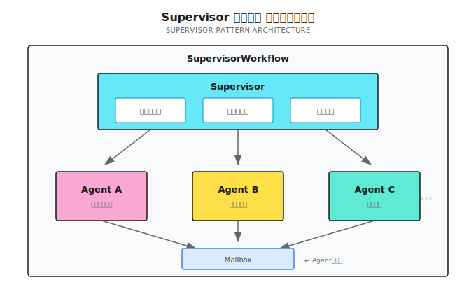
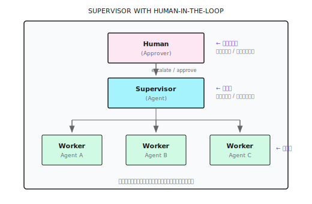

# 第 15 章：Supervisor パターン

> **Supervisor はマルチエージェントシステムの管理層だ。実際の作業はしないけど、誰がやるか、どう連携するか、失敗したらどうするかを決める。管理層の価値はチーム全体のアウトプットを個々の合計より大きくすること。管理が多ければいいってわけじゃないよ。**

---

> **5 分で核心をつかむ**
>
> 1. サブタスクが 5 個超、またはチームを動的に調整する必要があるなら Supervisor を使う
> 2. メールボックスシステムでエージェント間の非同期通信。必ず非ブロッキング送信で
> 3. 動的リクルートは Signal でトリガー。実行中にメンバー追加できる
> 4. スマート耐障害：50%+1 の失敗閾値で、部分的な失敗は全体に影響しない
> 5. **Human-in-the-Loop**：人間は階層の最上位にいる Supervisor。重要な判断はエスカレーション
> 6. シンプルなタスクは DAG に任せよう。Supervisor はオーバーヘッドが大きい
>
> **10 分コース**：15.1-15.3 → 15.5 → 15.12 (HITL) → Shannon Lab

---

## 15.1 どんなときに Supervisor を使う？

前章では DAG ワークフローを説明した。依存グラフでタスクをスケジューリングして、並列できるものは並列、待つべきものは待つ。DAG は強力だけど、前提がある：**タスク構造が固定されている**こと。

事前に「どんなタスクがあって、何が何に依存するか」を計画できるなら、DAG で十分。でも、そうじゃないケースもある。

去年、あるコンサルティング会社の競合分析エージェントを手伝った。最初の要件は明確だった：5社の競合他社の製品、価格設定、市場シェアを分析する。DAG で 5 つの並列リサーチタスク + 1 つの統合タスクを設計した。

リリース後、クライアントから新しい要望が来た：「分析中に特に重要な会社が見つかったら、その技術特許を自動で深掘りできない？」

これは DAG の能力を超えている。DAG のタスクは固定で、途中で「人を追加」できない。実行中に「おい、この会社は深く調べる価値がある、特許アナリストをもう一人派遣しろ」なんて言えないんだ。

**Supervisor パターンはこういう問題を解決するためにある。タスク構造を動的に調整する必要があるとき、エージェント同士がコミュニケーションする必要があるとき、チーム規模が大きいとき、「管理層」が必要になる。**

DAG は強力だけど、限界がある。比較してみよう：

| シナリオ | DAG | Supervisor |
|---------|-----|-----------|
| 事前定義されたタスク構造 | 得意 | 同様にサポート |
| 動的タスク生成 | 非対応 | 実行時リクルート |
| エージェント間通信 | 依存関係経由のみ | メールボックスシステム |
| タスク数 > 5 | オーバーロードの可能性 | 階層管理 |
| 役割の専門化 | 基本的なサポート | 動的な役割割り当て |
| スマート障害復旧 | 基本的なリトライ | 閾値ベースの耐障害 |
| 実行時間 | 短い（分単位） | 長くできる（時間単位） |

**Supervisor をトリガーする条件**：

```go
switch {
case len(decomp.Subtasks) > 5 || hasDeps:
    // サブタスクが多い or 依存が複雑 → Supervisor
    return SupervisorWorkflow(ctx, input)
default:
    return DAGWorkflow(ctx, input)
}
```

シンプルに言うと：5 タスク以下は DAG、超えたら Supervisor。

> **注意**：Supervisor は DAG よりオーバーヘッドが大きい。メールボックスシステム、チームディレクトリ、動的リクルート...どれもコストがかかる。「3 社を並列検索」程度なら DAG で十分。Supervisor を使う必要はない。

判断基準：
- タスク数 > 5？Supervisor を検討
- 途中でメンバー追加が必要？Supervisor を使う
- エージェント間で通信が必要？Supervisor を使う
- タスク構造が完全に固定？DAG を使う

---

## 15.2 アーキテクチャ概要

Supervisor のコアコンポーネント：



**3 つの主要機能**：

1. **チーム管理**：リクルート、退役、役割割り当て
2. **メールボックス通信**：エージェント間の非同期メッセージ
3. **スマート耐障害**：部分的な失敗は全体に影響しない

**実装参考 (Shannon)**: [`go/orchestrator/internal/workflows/supervisor_workflow.go`](https://github.com/Kocoro-lab/Shannon/blob/main/go/orchestrator/internal/workflows/supervisor_workflow.go) - SupervisorWorkflow 関数

---

## 15.3 メールボックスシステム

エージェント同士はどうやって通信する？メールボックスを使う。

### なぜメールボックスが必要？

DAG モードでは、エージェント間のデータ受け渡しは依存関係経由のみ：A が完了 → 結果を B に渡す。

でも、もっと柔軟な通信が必要なケースもある：

```
Agent A (リサーチャー)                 Agent B (アナリスト)
     │                                    │
     │  発見：競合が新製品を発表した       │
     │                                    │
     │── 「おい、これ注目した方がいいぞ」─►│
     │                                    │ メッセージ受信
     │                                    │ 分析の重点を調整
```

A は B の依存関係じゃないけど、A が見つけた情報は B に役立つ。これがメールボックスの出番だ。

### メールボックス実装

```go
type MailboxMessage struct {
    From, To, Role, Content string
}

func SupervisorWorkflow(ctx workflow.Context, input TaskInput) (TaskResult, error) {
    var messages []MailboxMessage
    sig := workflow.GetSignalChannel(ctx, "mailbox_v1")
    msgChan := workflow.NewChannel(ctx)

    // メッセージ受信用ゴルーチン（非ブロッキング送信でデッドロック防止）
    workflow.Go(ctx, func(ctx workflow.Context) {
        for {
            var msg MailboxMessage
            sig.Receive(ctx, &msg)
            // ポイント：Selector + Default で非ブロッキング送信
            sel := workflow.NewSelector(ctx)
            sel.AddSend(msgChan, msg, func() {})
            sel.AddDefault(func() {})  // チャネルが満杯ならスキップ、ブロックしない
            sel.Select(ctx)
        }
    })

    // クエリハンドラ：競合状態防止のためコピーを返す
    workflow.SetQueryHandler(ctx, "getMailbox", func() ([]MailboxMessage, error) {
        result := make([]MailboxMessage, len(messages))
        copy(result, messages)
        return result, nil
    })
    // ...
}
```

**なぜ非ブロッキングが必要か**：Temporal はシングルスレッド。受信ゴルーチンがブロックするとワークフロー全体が止まる。

---

## 15.4 動的チーム管理

Supervisor の最強の機能：実行時にエージェントをリクルートまたは退役させる。

### リクルートシグナルとチームディレクトリ

```go
type RecruitRequest struct {
    Description string  // タスクの説明
    Role        string  // 期待する役割
}

type AgentInfo struct {
    AgentID, Role, Status string  // Status: running/completed/failed
}

var teamAgents []AgentInfo

// 動的リクルート用ゴルーチン
recruitCh := workflow.GetSignalChannel(ctx, "recruit_v1")
workflow.Go(ctx, func(ctx workflow.Context) {
    for {
        var req RecruitRequest
        recruitCh.Receive(ctx, &req)

        // 1. ポリシー認可チェック（オプション）
        // 2. 子ワークフローを起動
        future := workflow.ExecuteChildWorkflow(ctx, SimpleTaskWorkflow, TaskInput{
            Query: req.Description, Context: map[string]interface{}{"role": req.Role},
        })
        var res TaskResult
        future.Get(ctx, &res)

        // 3. 結果を収集
        childResults = append(childResults, AgentExecutionResult{AgentID: "dynamic_" + req.Role, Response: res.Result})
    }
})

// チームディレクトリクエリ
workflow.SetQueryHandler(ctx, "listTeamAgents", func() ([]AgentInfo, error) {
    result := make([]AgentInfo, len(teamAgents))
    copy(result, teamAgents)
    return result, nil
})
```

リクルートフロー：`Signal: recruit_v1` → ポリシー認可 → 子ワークフロー起動 → 結果収集

---

## 15.5 スマート障害処理

エージェントは失敗する。ネットワークタイムアウト、LLM エラー、ツールエラー。

DAG の処理方法：3 回リトライして、ダメならタスク全体が失敗。

Supervisor はもっと賢い：**部分的な失敗を許容する。ただし半分を超えてはダメ**。

### 50%+1 閾値

```go
failedTasks := 0
maxFailures := len(decomp.Subtasks)/2 + 1  // 50%+1：半分以上失敗したら中止
taskRetries := make(map[string]int)

for _, st := range decomp.Subtasks {
    for taskRetries[st.ID] < 3 {  // 各タスク最大 3 回リトライ
        err := workflow.ExecuteActivity(ctx, ExecuteAgent, st).Get(ctx, &res)
        if err == nil { break }
        taskRetries[st.ID]++
    }
    if taskRetries[st.ID] >= 3 {
        failedTasks++
        if failedTasks >= maxFailures {
            return TaskResult{Success: false, ErrorMessage: "Too many failures"}, nil
        }
    }
}
// 閾値は設定可能：リサーチタスク 50%、データ分析 20%、クリティカルビジネス 0%
```

**なぜ 50%+1 か**：6 タスクなら maxFailures=4。2 つ失敗しても続行、4 つ失敗したら中止（結果の信頼性が低い）。

---

## 15.6 役割割り当て

各エージェントに異なる役割を割り当てて、それぞれの領域に集中させる。

### 役割割り当てメカニズム

LLM が分解時に役割を指定し、Supervisor がそれを読み取ってエージェントに割り当てる：

```go
// LLM 分解結果：{"subtasks": [...], "agent_types": ["researcher", "analyst"]}

for i, st := range decomp.Subtasks {
    role := "generalist"  // デフォルト役割
    if i < len(decomp.AgentTypes) && decomp.AgentTypes[i] != "" {
        role = decomp.AgentTypes[i]  // LLM 指定の役割
    }
    childCtx["role"] = role
    teamAgents = append(teamAgents, AgentInfo{AgentID: agentName, Role: role})
    // 役割を system prompt に注入："あなたは researcher です。情報収集が専門です..."
}
```

| 役割 | 得意なこと | 傾向 |
|------|-----------|------|
| researcher | 情報収集 | 網羅的、詳細 |
| analyst | データ分析 | 数字、トレンド |
| strategist | 戦略立案 | 俯瞰的視点、長期 |
| writer | コンテンツ作成 | 可読性、構造 |

---

## 15.7 履歴から学習

Supervisor は過去の実行から学習して、より良い分解提案ができる。

### メモリ検索と適用

```go
if input.SessionID != "" {
    // 1. 履歴メモリを取得
    var memory *SupervisorMemoryContext
    workflow.ExecuteActivity(ctx, "FetchSupervisorMemory", input.SessionID).Get(ctx, &memory)

    // 2. アドバイザーを作成、類似タスクの履歴分解戦略を検索
    advisor := NewDecompositionAdvisor(memory)
    suggestion := advisor.SuggestDecomposition(input.Query)

    // 3. 高い確信度なら履歴戦略を直接適用
    if suggestion.Confidence > 0.8 {
        decomp.ExecutionStrategy = suggestion.Strategy
    }
}
// 学習効果：「AI Agent 市場を分析」成功 → 「RPA 市場を分析」で自動的に類似戦略を再利用
```

---

## 15.8 DAG との連携

Supervisor は DAG を置き換えるものじゃない。シンプルなタスクは DAG の方が効率的。

```go
// シンプルタスクかどうか判定
simpleByShape := len(decomp.Subtasks) == 0 ||
                 (len(decomp.Subtasks) == 1 && !needsTools)
isSimpleTask := (decomp.ComplexityScore < 0.3) && simpleByShape

if isSimpleTask {
    // DAGWorkflow に委譲
    dagFuture := workflow.ExecuteChildWorkflow(ctx, DAGWorkflow, strategiesInput)

    var childExec workflow.Execution
    dagFuture.GetChildWorkflowExecution().Get(ctx, &childExec)
    controlHandler.RegisterChildWorkflow(childExec.ID)

    dagFuture.Get(ctx, &strategiesResult)
    controlHandler.UnregisterChildWorkflow(childExec.ID)

    return convertFromStrategiesResult(strategiesResult), nil
}
```

**役割分担**：

| タスクタイプ | 担当 | 理由 |
|-------------|------|------|
| シンプルタスク（1-2 ステップ） | SimpleTask | オーバーヘッド最小 |
| 中程度タスク（3-5 ステップ） | DAG | 並列効率が高い |
| 複雑タスク（6+ ステップ） | Supervisor | チーム管理が必要 |
| 動的タスク | Supervisor | 途中でメンバー追加できる |
| 通信が必要 | Supervisor | メールボックスシステムがある |

例えるなら：Supervisor は「部門マネージャー」、DAG は「プロジェクトリーダー」。

シンプルなタスクは、プロジェクトリーダーが数人連れて片付けられる。
複雑なタスクは、部門マネージャーが複数のプロジェクトチームを調整して、リソースを動的に配分する必要がある。

---

## 15.9 実践：階層型市場分析

シナリオ：

```
ユーザー：AI Agent 市場の完全な競合分析をして
```

### Supervisor の分解

```
├── 市場規模調査 (Agent A - リサーチャー)
├── 競合他社の特定 (Agent B - アナリスト)
├── 製品比較分析 (Agent C - プロダクト専門家)
│   └── 動的リクルートの可能性: 価格アナリスト
├── 技術トレンド分析 (Agent D - 技術専門家)
├── SWOT 統合 (Agent E - 戦略アナリスト)
│   └── 依存: A, B, C, D の結果
└── レポート生成 (Agent F - ライター)
    └── 依存: E の結果
```

### 実行フロー

```
t0:  Supervisor 開始
     ├── タスク分解 → 6 サブタスク
     ├── メールボックスシステム初期化
     ├── チームディレクトリ登録
     └── 制御シグナルハンドラ設定

t1:  A, B, C, D を並列起動（依存なしのタスク）
     ├── Agent A (market-research): 市場規模調査
     ├── Agent B (competitor-scan): 競合他社特定
     ├── Agent C (product-compare): 製品比較分析
     └── Agent D (tech-trend): 技術トレンド分析

t2:  Agent C が価格分析の必要性を発見
     ├── recruit_v1 シグナル送信
     │   {Description: "各製品の価格戦略を深く分析", Role: "pricing_analyst"}
     ├── Supervisor がシグナル受信
     ├── ポリシー認可チェック通過
     └── Agent C' (pricing-deep) を動的リクルート

t3:  A, B 完了
     ├── 結果を childResults に格納
     ├── completedTasks["market-research"] = true をマーク
     └── E にメールボックスメッセージ送信（オプション）

t4:  C, C', D 完了
     └── 全ての前提タスク完了

t5:  Agent E 開始 (SWOT 分析)
     ├── 依存チェック：A, B, C, D 全て完了
     ├── 前提結果をコンテキストに注入
     └── 統合分析

t6:  E 完了 → F 開始 (レポート生成)

t7:  F 完了 → Supervisor 統合
     ├── 全 childResults を収集
     ├── 前処理（重複排除、フィルタ）
     └── 最終レポートを返却
```

### 時間比較

```
Supervisor モード：
├── A, B, C, D 並列: 20s
├── C' (動的リクルート): 10s (C、D と並列)
├── E (SWOT): 15s
├── F (レポート): 10s
└── 合計: 約45s

シリアル実行の場合：
├── A: 15s
├── B: 12s
├── C: 18s
├── D: 15s
├── E: 15s
├── F: 10s
└── 合計: 約85s

削減: 約47%
```

---

## 15.10 よくある落とし穴

| 落とし穴 | 問題の説明 | 解決策 |
|---------|-----------|--------|
| シグナルチャネルのブロック | `msgChan.Send` がワークフロー全体をブロック | Selector + Default で非ブロッキング送信 |
| クエリハンドラの競合状態 | スライスを直接返すのは安全じゃない | コピーを返す：`copy(result, messages)` |
| 子ワークフローのシグナル欠落 | 子ワークフローが一時停止/キャンセルシグナルを受け取れない | 登録：`controlHandler.RegisterChildWorkflow(childExec.ID)` |
| 失敗閾値が厳しすぎる | 1 つ失敗で中止 | 50%+1 を使う：`len(subtasks)/2 + 1` |
| 動的リクルートに制限なし | エージェントを増やしすぎ | チームサイズ制限：`maxTeamSize = 10` |
| メールボックスメッセージの蓄積 | メッセージがクリアされずに OOM | 数を制限、後半だけ保持 |

```go
// よくある間違い vs 正しいやり方
// 間違い：msgChan.Send(ctx, msg)  // ブロックする可能性
// 正解：sel.AddSend(msgChan, msg, func() {}); sel.AddDefault(func() {}); sel.Select(ctx)

// 間違い：return messages  // Query Handler の競合状態
// 正解：result := make([]T, len(messages)); copy(result, messages); return result
```

---

## 15.11 他のフレームワークでの実装

Supervisor/Manager パターンはマルチエージェント協調のコアで、各フレームワークに類似の実装がある：

| フレームワーク | 実装 | 特徴 |
|--------------|------|------|
| **AutoGen** | `GroupChatManager` | 対話駆動、自動発言者選択 |
| **CrewAI** | `Crew` + hierarchical | 役割定義が明確、プロセス指向 |
| **LangGraph** | カスタム Supervisor ノード | 完全にカスタマイズ可能、高い柔軟性 |
| **OpenAI Swarm** | `handoff()` メカニズム | 軽量、エージェントが自律的に引き継ぎ |

### AutoGen の例

```python
from autogen import GroupChat, GroupChatManager

# Agent を作成
researcher = AssistantAgent("researcher", llm_config=llm_config)
analyst = AssistantAgent("analyst", llm_config=llm_config)
writer = AssistantAgent("writer", llm_config=llm_config)

# GroupChat を作成
groupchat = GroupChat(
    agents=[researcher, analyst, writer],
    messages=[],
    max_round=10,
    speaker_selection_method="auto"  # LLM が自動で次の発言者を選択
)

# Manager を作成（Supervisor に相当）
manager = GroupChatManager(groupchat=groupchat, llm_config=llm_config)

# 対話を開始
user_proxy.initiate_chat(manager, message="AI Agent 市場を分析して")
```

### CrewAI の例

```python
from crewai import Crew, Agent, Task, Process

# Agent を定義
researcher = Agent(
    role="リサーチャー",
    goal="市場データを収集する",
    backstory="あなたは経験豊富な市場リサーチャーです"
)

analyst = Agent(
    role="アナリスト",
    goal="データの洞察を分析する",
    backstory="あなたはデータ分析の専門家です"
)

# タスクを定義
research_task = Task(description="AI Agent 市場を調査", agent=researcher)
analysis_task = Task(description="市場データを分析", agent=analyst)

# Crew を作成（階層モード）
crew = Crew(
    agents=[researcher, analyst],
    tasks=[research_task, analysis_task],
    process=Process.hierarchical,  # 階層モード、Manager あり
    manager_llm=llm
)

result = crew.kickoff()
```

### 選択の指針

| シナリオ | 推奨フレームワーク |
|---------|------------------|
| 対話型コラボレーション | AutoGen |
| プロセス指向タスク | CrewAI |
| 完全カスタマイズ | LangGraph |
| 本番レベルの信頼性 | Shannon (Temporal) |

---

## 15.12 Human-in-the-Loop 統合

ここまで説明した Supervisor は全部「全自動」だった。エージェントがチームを組んで、Supervisor が調整して、最後に結果を出力。人間は最初に質問して、最後に結果を見るだけ。

でも本番環境では、それじゃ足りない。

去年、ある金融クライアントにエージェントシステムをデプロイした。最初の週に問題が起きた。エージェントがクライアントにメールを自動送信したんだけど、内容は基本的に正しかったが、言い回しがちょっとまずかった。クライアントからクレームはなかったけど、CEO が心配した：「こういうのは送る前に人に見てもらえない？」

これが **Human-in-the-Loop (HITL)** の核心的なニーズだ：**人間が階層構造の最高意思決定者として、重要なポイントで介入する**。

### 15.12.1 階層における人間の位置

Supervisor のアーキテクチャをもう一度見てみよう。人間ノードを追加すると：



**人間は「傍観者」じゃなく、階層構造の中のノードだ**。ただ、このノードはレスポンスが遅くてコストが高いから、必要なときだけ呼び出す。

### 15.12.2 エスカレーショントリガー

どんな状況で人間にエスカレーションが必要か？「感覚」に頼っちゃダメ。明確なトリガー条件が必要だ。

```go
// 概念例：エスカレーショントリガー設定
type EscalationTriggers struct {
    // 確信度トリガー
    ConfidenceThreshold float64 `json:"confidence_threshold"` // これ未満でエスカレーション、例：0.6

    // コストトリガー
    SingleActionCostLimit float64 `json:"single_action_cost_limit"` // 単一操作のコスト上限、例：$1.00

    // センシティブ操作トリガー
    SensitiveActions []string `json:"sensitive_actions"` // 例：["delete", "publish", "pay", "send_email"]

    // 失敗トリガー
    ConsecutiveFailures int `json:"consecutive_failures"` // 連続失敗回数、例：3

    // タイムアウトトリガー
    DecisionTimeout time.Duration `json:"decision_timeout"` // エージェント判断タイムアウト
}

// エスカレーションが必要か判定
func (s *Supervisor) ShouldEscalate(ctx context.Context, result AgentResult) (bool, string) {
    // 1. 確信度チェック
    if result.Confidence < s.triggers.ConfidenceThreshold {
        return true, fmt.Sprintf("確信度が低い: %.2f < %.2f", result.Confidence, s.triggers.ConfidenceThreshold)
    }

    // 2. センシティブ操作チェック
    for _, action := range s.triggers.SensitiveActions {
        if result.ProposedAction == action {
            return true, fmt.Sprintf("センシティブ操作には承認が必要: %s", action)
        }
    }

    // 3. コストチェック
    if result.EstimatedCost > s.triggers.SingleActionCostLimit {
        return true, fmt.Sprintf("コスト上限超過: $%.2f > $%.2f", result.EstimatedCost, s.triggers.SingleActionCostLimit)
    }

    // 4. 連続失敗チェック
    if s.consecutiveFailures >= s.triggers.ConsecutiveFailures {
        return true, fmt.Sprintf("連続 %d 回失敗", s.consecutiveFailures)
    }

    return false, ""
}
```

**トリガー条件の優先順位**：

| トリガー | 閾値例 | 優先度 | 説明 |
|---------|--------|--------|------|
| センシティブ操作 | delete/pay/publish | 最高 | 不可逆、人間の確認必須 |
| コスト超過 | > $1.00 | 高 | 暴走を防止 |
| 確信度が低い | < 0.6 | 中 | エージェント自身が不確実 |
| 連続失敗 | > 3 回 | 中 | 無限ループの可能性 |
| 範囲外 | マッチするツールなし | 低 | エージェントの能力不足 |

> **注意**：全てのエスカレーションが人間の応答を必要とするわけじゃない。「タイムアウトで自動拒否」を設定できるものもあれば、「タイムアウトで自動承認」のものもある。重要な操作は「タイムアウトで自動拒否」を推奨。

### 15.12.3 3 つの HITL モード

人間の関与度に応じて、HITL には 3 つのモードがある：

| モード | 人間の関与度 | エージェントの自律度 | 適用シナリオ |
|--------|-------------|---------------------|-------------|
| **Human-in-Command** | 全ステップ確認 | 最低 | 高リスク、新システム、信頼構築期 |
| **Human-in-the-Loop** | 重要ポイントで承認 | 中程度 | 本番環境の通常状態 |
| **Human-on-the-Loop** | モニタリング、必要時に介入 | 最高 | 低リスク、高信頼、成熟したシステム |

```go
type HITLMode string

const (
    ModeHumanInCommand HITLMode = "human_in_command"  // 全ステップ確認
    ModeHumanInTheLoop HITLMode = "human_in_the_loop" // 重要ポイント
    ModeHumanOnTheLoop HITLMode = "human_on_the_loop" // モニタリングモード
)

// モードに応じて承認が必要か判定
func (s *Supervisor) NeedsApproval(mode HITLMode, action AgentAction) bool {
    switch mode {
    case ModeHumanInCommand:
        return true  // 全てのアクションに承認が必要
    case ModeHumanInTheLoop:
        return action.IsSensitive || action.Cost > s.triggers.SingleActionCostLimit
    case ModeHumanOnTheLoop:
        return false // モニタリングのみ、能動的に中断しない
    }
    return false
}
```

**選択の指針**：

```
新システムローンチ ──────► Human-in-Command（1-2 週間）
     │
     │ 50+ タスク完了、重大インシデントなし
     ▼
段階的に権限委譲 ──────► Human-in-the-Loop（通常状態）
     │
     │ 90 日間で 99% 成功率
     ▼
高い信頼 ──────► Human-on-the-Loop（オプション）
```

### 15.12.4 中断とテイクオーバー

ユーザーはいつでも「ハンドルを奪える」。これは HITL の最も重要な機能の一つだ。

**4 つの中断操作**：

| 操作 | 説明 | 状態変化 |
|------|------|---------|
| **一時停止** (Pause) | 実行を停止、状態を保存 | Running → Paused |
| **再開** (Resume) | 実行を継続 | Paused → Running |
| **テイクオーバー** (Takeover) | 人間が残りのステップを完了 | Running → HumanControl |
| **キャンセル** (Cancel) | タスクを放棄、オプションでロールバック | Any → Cancelled |

```go
// ControlHandler を拡張して人間のテイクオーバーをサポート
type ControlHandler struct {
    // ... 既存フィールド
    humanTakeover bool
    takeoverChan  workflow.Channel
}

// 人間テイクオーバーシグナル処理
func (h *ControlHandler) HandleTakeover(ctx workflow.Context) {
    takeoverSig := workflow.GetSignalChannel(ctx, "human_takeover_v1")
    workflow.Go(ctx, func(ctx workflow.Context) {
        var req TakeoverRequest
        takeoverSig.Receive(ctx, &req)
        h.humanTakeover = true
        h.takeoverReason = req.Reason
        // 全子ワークフローに一時停止を通知
        h.PauseAllChildren(ctx)
    })
}

// 実行ループ内でチェック
func (s *Supervisor) executeWithHITL(ctx workflow.Context, task Task) (Result, error) {
    for {
        // 人間がテイクオーバーしたかチェック
        if s.controlHandler.IsHumanTakeover() {
            return Result{
                Status:  "handed_to_human",
                Message: "タスクは人間に引き継がれました",
                Context: s.getCurrentContext(),  // 現在のコンテキストを渡す
            }, nil
        }

        // 一時停止中かチェック
        if s.controlHandler.IsPaused() {
            workflow.Await(ctx, func() bool { return !s.controlHandler.IsPaused() })
        }

        // 通常の実行...
    }
}
```

**テイクオーバー時のコンテキスト引き継ぎ**：

```go
type TakeoverContext struct {
    // 現在の状態
    CurrentStep     int                    `json:"current_step"`
    TotalSteps      int                    `json:"total_steps"`
    CompletedTasks  []string               `json:"completed_tasks"`
    PendingTasks    []string               `json:"pending_tasks"`

    // 収集済みの情報
    IntermediateResults map[string]interface{} `json:"intermediate_results"`

    // 推奨する次のステップ
    SuggestedNextAction string               `json:"suggested_next_action"`

    // 失敗理由（失敗によるテイクオーバーの場合）
    FailureReason       string               `json:"failure_reason,omitempty"`
}
```

人間がテイクオーバーした後、できること：
1. エージェントが完了した作業を確認
2. 残りのステップを手動で完了
3. 計画を修正してエージェントに続行させる
4. タスクを直接キャンセル

### 15.12.5 承認ワークフローの実装

Temporal での承認待機の実装：

```go
// 承認リクエスト
type ApprovalRequest struct {
    TaskID      string                 `json:"task_id"`
    Action      string                 `json:"action"`
    Description string                 `json:"description"`
    Risk        string                 `json:"risk"`       // low/medium/high/critical
    Context     map[string]interface{} `json:"context"`
    Timeout     time.Duration          `json:"timeout"`
}

// 承認レスポンス
type ApprovalResponse struct {
    Approved  bool   `json:"approved"`
    Approver  string `json:"approver"`
    Comment   string `json:"comment,omitempty"`
    Timestamp int64  `json:"timestamp"`
}

// 人間の承認を待機（タイムアウト付き）
func (s *Supervisor) WaitForApproval(ctx workflow.Context, req ApprovalRequest) (ApprovalResponse, error) {
    // 1. 通知を送信（Slack/Email/Dashboard）
    workflow.ExecuteActivity(ctx, NotifyForApproval, req).Get(ctx, nil)

    // 2. 承認シグナルを待機
    approvalCh := workflow.GetSignalChannel(ctx, "approval_response_v1")

    var response ApprovalResponse
    timeout := workflow.NewTimer(ctx, req.Timeout)

    sel := workflow.NewSelector(ctx)

    // 承認を受信
    sel.AddReceive(approvalCh, func(c workflow.ReceiveChannel, more bool) {
        c.Receive(ctx, &response)
    })

    // タイムアウト処理
    sel.AddFuture(timeout, func(f workflow.Future) {
        response = ApprovalResponse{
            Approved:  false,
            Comment:   "承認タイムアウト、自動拒否",
            Timestamp: time.Now().Unix(),
        }
    })

    sel.Select(ctx)

    // 3. 承認結果を記録
    workflow.ExecuteActivity(ctx, LogApprovalResult, req, response).Get(ctx, nil)

    return response, nil
}
```

**Supervisor メインループでの使用**：

```go
func SupervisorWorkflow(ctx workflow.Context, input TaskInput) (TaskResult, error) {
    // ... 初期化 ...

    for _, subtask := range decomp.Subtasks {
        // 承認が必要かチェック
        shouldEscalate, reason := supervisor.ShouldEscalate(ctx, subtask)

        if shouldEscalate {
            approval, err := supervisor.WaitForApproval(ctx, ApprovalRequest{
                TaskID:      subtask.ID,
                Action:      subtask.Action,
                Description: subtask.Description,
                Risk:        subtask.RiskLevel,
                Context:     subtask.Context,
                Timeout:     30 * time.Minute,  // 30 分タイムアウト
            })

            if err != nil || !approval.Approved {
                // 拒否理由を記録、スキップまたは終了
                if subtask.Required {
                    return TaskResult{Success: false, ErrorMessage: "必須タスクが拒否された: " + reason}, nil
                }
                continue  // 必須じゃないタスクはスキップ
            }
        }

        // タスクを実行
        result, err := supervisor.ExecuteSubtask(ctx, subtask)
        // ...
    }
    // ...
}
```

### 15.12.6 信頼度アップグレードメカニズム

ずっと Human-in-Command じゃダメだ。システムが信頼性を証明したら、段階的に権限を委譲すべき。

```go
type TrustLevel struct {
    Level           string  `json:"level"`            // novice/proficient/expert
    TasksCompleted  int     `json:"tasks_completed"`
    SuccessRate     float64 `json:"success_rate"`
    DaysSinceStart  int     `json:"days_since_start"`
    LastIncident    *time.Time `json:"last_incident,omitempty"`
}

// 信頼度アップグレード条件
var trustUpgradeRules = map[string]struct {
    MinTasks       int
    MinSuccessRate float64
    MinDays        int
    NoIncidentDays int
}{
    "novice_to_proficient": {
        MinTasks:       50,
        MinSuccessRate: 0.90,
        MinDays:        7,
        NoIncidentDays: 7,
    },
    "proficient_to_expert": {
        MinTasks:       200,
        MinSuccessRate: 0.98,
        MinDays:        30,
        NoIncidentDays: 30,
    },
}

// アップグレード可能かチェック
func (t *TrustLevel) CanUpgrade() (bool, string) {
    var targetLevel string
    var rules struct {
        MinTasks       int
        MinSuccessRate float64
        MinDays        int
        NoIncidentDays int
    }

    switch t.Level {
    case "novice":
        targetLevel = "proficient"
        rules = trustUpgradeRules["novice_to_proficient"]
    case "proficient":
        targetLevel = "expert"
        rules = trustUpgradeRules["proficient_to_expert"]
    default:
        return false, "既に最高レベル"
    }

    if t.TasksCompleted < rules.MinTasks {
        return false, fmt.Sprintf("タスク数不足: %d/%d", t.TasksCompleted, rules.MinTasks)
    }
    if t.SuccessRate < rules.MinSuccessRate {
        return false, fmt.Sprintf("成功率不足: %.1f%%/%.1f%%", t.SuccessRate*100, rules.MinSuccessRate*100)
    }
    if t.DaysSinceStart < rules.MinDays {
        return false, fmt.Sprintf("運用日数不足: %d/%d", t.DaysSinceStart, rules.MinDays)
    }
    if t.LastIncident != nil {
        daysSinceIncident := int(time.Since(*t.LastIncident).Hours() / 24)
        if daysSinceIncident < rules.NoIncidentDays {
            return false, fmt.Sprintf("前回インシデントからの日数不足: %d/%d", daysSinceIncident, rules.NoIncidentDays)
        }
    }

    return true, targetLevel
}
```

**信頼レベルと HITL モードの対応**：

| 信頼レベル | HITL モード | 承認範囲 | アップグレード条件 |
|-----------|-------------|---------|------------------|
| Novice | Human-in-Command | 全操作 | 初期状態 |
| Proficient | Human-in-the-Loop | センシティブ操作のみ | 50 タスク + 90% 成功率 + 7 日間インシデントなし |
| Expert | Human-on-the-Loop | 異常時のみ | 200 タスク + 98% 成功率 + 30 日間インシデントなし |

> **注意**：信頼はアップグレードできるし、ダウングレードもできる。一度の重大インシデントで Expert が直接 Novice に戻ることもある。これは保護メカニズムであって、罰じゃない。

### 15.12.7 LangGraph の interrupt() との比較

LangGraph はネイティブの `interrupt()` 関数で HITL を実装できる：

```python
# LangGraph の interrupt() パターン
from langgraph.types import interrupt, Command

def human_approval_node(state):
    """人間の承認が必要なノード"""
    # 実行を一時停止、承認リクエストをフロントエンドに返す
    human_response = interrupt({
        "question": "以下の操作を承認しますか？",
        "action": state["proposed_action"],
        "risk_level": state["risk_assessment"],
        "context": state["context"]
    })

    if human_response["approved"]:
        return Command(goto="execute_action")
    else:
        return Command(
            goto="revise_plan",
            update={"feedback": human_response["feedback"]}
        )

# グラフを構築
graph = StateGraph(State)
graph.add_node("plan", plan_node)
graph.add_node("human_approval", human_approval_node)
graph.add_node("execute_action", execute_node)
graph.add_node("revise_plan", revise_node)

# コンパイル時に checkpointer を有効化（中断からの復旧をサポート）
app = graph.compile(checkpointer=MemorySaver())

# 中断点まで実行
result = app.invoke(initial_state, config={"configurable": {"thread_id": "task-123"}})

# 実行を再開（人間の入力付き）
result = app.invoke(
    Command(resume={"approved": True, "feedback": ""}),
    config={"configurable": {"thread_id": "task-123"}}
)
```

**Temporal Signal vs LangGraph interrupt() の比較**：

| 特徴 | Temporal Signal | LangGraph interrupt() |
|------|-----------------|----------------------|
| 状態の永続化 | ネイティブサポート | Checkpointer が必要 |
| タイムアウト処理 | Timer + Selector | 自分で実装が必要 |
| 分散 | 天然の分散対応 | 主に単一プロセス |
| 学習曲線 | 急 | 緩やか |
| 適用シナリオ | 本番レベルの長時間タスク | プロトタイプや中小規模 |

### 15.12.8 実践：承認付き市場分析

15.9 の市場分析例に戻って、HITL を追加する：

```
t0:  Supervisor 開始
     ├── タスク分解 → 6 サブタスク
     └── 「レポート公開」はセンシティブ操作として検出、承認が必要とマーク

t1:  A, B, C, D を並列実行（承認不要のタスク）

t5:  Agent E (SWOT) 完了
     ├── 結果を人間がレビュー（オプション、高リスクシナリオ）
     └── 承認通過 / 修正提案

t6:  Agent F (レポート生成) 完了
     ├── エスカレーションをトリガー：レポート公開はセンシティブ操作
     ├── Slack に承認リクエストを送信
     │   「市場分析レポートが生成されました。クライアントに公開しますか？」
     │   [レポートを見る] [承認] [拒否] [修正して再試行]
     └── 人間の応答を待機（30 分タイムアウト）

t7:  人間が [承認] をクリック
     ├── 承認ログを記録
     └── 公開を実行

t8:  タスク完了
     └── 信頼指標を更新：tasks_completed++, success_rate 更新
```

```go
// 市場分析でのセンシティブ操作検出
func detectSensitiveActions(subtasks []Subtask) {
    sensitiveKeywords := []string{"publish", "send", "delete", "pay", "share"}

    for i := range subtasks {
        for _, kw := range sensitiveKeywords {
            if strings.Contains(strings.ToLower(subtasks[i].Action), kw) {
                subtasks[i].RequiresApproval = true
                subtasks[i].RiskLevel = "high"
                break
            }
        }
    }
}
```

---

## この章のまとめ

核心は一言で言える：**Supervisor はマルチエージェントの管理層だ。動的にメンバーを追加し、通信を調整し、失敗を許容し、重要な判断は人間にエスカレーションする**。

## まとめ

1. **メールボックスシステム**：エージェント間の非同期通信、非ブロッキング送信
2. **動的チーム**：実行時のリクルート/退役、ポリシー認可
3. **スマート耐障害**：50%+1 の失敗閾値、部分的失敗でも続行
4. **役割割り当て**：LLM がエージェントタイプを指定
5. **履歴学習**：過去の実行から分解戦略を学習
6. **Human-in-the-Loop**：人間は最上位階層のノード。エスカレーショントリガー、中断テイクオーバー、信頼度アップグレードで人間とエージェントの協調を実現

---

## Shannon Lab（10 分で始める）

このセクションで、本章の概念を Shannon ソースコードと対応づける。

### 必読（1 ファイル）

- [`supervisor_workflow.go`](https://github.com/Kocoro-lab/Shannon/blob/main/go/orchestrator/internal/workflows/supervisor_workflow.go)：`SupervisorWorkflow` 関数の全体構造、`mailbox_v1` シグナル処理、`recruit_v1` 動的リクルート実装、失敗カウントロジック（`failedTasks` と `maxFailures`）を確認

### 選読で深掘り（2 つ、興味に応じて）

- チームディレクトリ実装：`teamAgents` 変数を検索、`listTeamAgents` と `findTeamAgentsByRole` クエリを理解
- DAG との連携：`isSimpleTask` 判定ロジックを検索、どんな場合に DAGWorkflow に委譲するか理解

---

## 演習

### 演習 1：メールボックスシステム設計

シナリオを設計する：リサーチャーが重要な情報を発見し、アナリストに分析の重点を調整するよう通知する必要がある。

要件：
1. メッセージフロー図を描く
2. MailboxMessage の内容を書く
3. アナリストがメッセージを受け取った後、どう処理する？

### 演習 2：失敗閾値分析

8 つのサブタスクがあると仮定して、以下のケースを分析：

1. 2 つ失敗 → ワークフローは続行する？中止する？
2. 4 つ失敗 → どうなる？
3. クリティカルなビジネスタスクの場合、閾値をどう調整する？

### 演習 3（上級）：動的リクルート戦略

「スマートリクルート」戦略を設計する：

シナリオ：製品比較分析中に、価格戦略の深い分析が必要だと判明。

要件：
1. リクルートをトリガーする条件は？
2. どの役割をリクルートすべきかどう判断する？
3. リクルートしすぎをどう防ぐ？

---

## もっと深く学びたい？

- [Temporal Signals](https://docs.temporal.io/develop/go/message-passing#signals) - シグナルメカニズムを理解
- [Temporal Query Handlers](https://docs.temporal.io/develop/go/message-passing#queries) - クエリハンドラ
- [AutoGen GroupChat](https://microsoft.github.io/autogen/docs/tutorial/conversation-patterns) - 対話型マルチエージェント

---

## 次章の予告

Supervisor はチームを管理し、DAG はタスクをスケジューリングする。でもまだ解決してない問題がある：

Agent A が完了した後、どうやってデータを正確に Agent B に渡す？

- シンプルなケース：結果をコンテキストに入れる
- 複雑なケース：ワークスペース共有
- もっと複雑：P2P プロトコル

次章では **Handoff メカニズム** を説明する。エージェント間でデータと状態を正確かつ確実に受け渡す方法だ。

次は...
