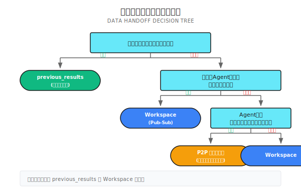
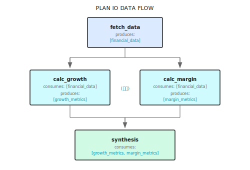
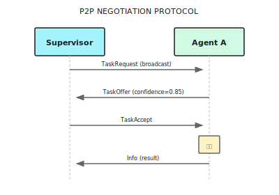

# 第 16 章：Handoff メカニズム

> **Handoff はエージェント間でデータと状態を正確に受け渡す仕組みだ。シンプルなコンテキスト注入から複雑な P2P メッセージングまで、機能の完全性を追い求めるより、適切な選択をすることのほうが大事。**

> **注意**：Handoff は実際の協調の複雑さに応じて選ぼう。単純なチェーン依存ならコンテキスト注入で十分。「アーキテクチャの完全性」のために不要な Workspace や P2P メッセージを導入する必要はない。

---

> **5分で掴む核心ポイント**
>
> 1. 三層の引き継ぎ：previous_results（シンプル）→ Workspace（共有）→ P2P（交渉）
> 2. Plan IO で Produces/Consumes を宣言し、オーケストレーターにデータ依存を理解させる
> 3. 依存待ちは増分タイムアウトチェックで、応答速度とリソース消費のバランスを取る
> 4. ワークスペースへの書き込みには workflow.Now() を使い、決定性を保証する
> 5. ほとんどのケースは最初の二層で事足りる。P2P は本当に双方向通信が必要な場面向け
>
> **10分コース**：16.1-16.3 → 16.5 → Shannon Lab

---

## 冒頭シナリオ：決算分析のデータフロー

こんな状況を考えてみよう。エージェント A にテスラの決算データを収集させ、エージェント B でその成長率を計算し、エージェント C で利益率を算出。最後にエージェント D が三つの結果を総合分析する。

さて、問題が出てくる：
- B は A の結果をどうやって受け取る？
- C と B は並列で動ける？
- D は B と C の両方が終わったことをどう知る？

シンプルなケースなら、A の出力を B のコンテキストに突っ込めばいい。でも、もっと複雑なマルチエージェント協調になると——データが複数のエージェント間を流れ、待機が必要なもの、並列で走らせたいもの、互いに交渉が必要なものが混在する——体系的な引き継ぎメカニズムが必要になる。

**Handoff はまさにこの問題を解決する——エージェント間でデータと状態を正確かつ確実に受け渡す仕組みだ。**

---

## 16.1 三つの引き継ぎ方式

シンプルなものから複雑なものまで、三つのレイヤーがある：

| レイヤー | メカニズム | 適用シーン | 複雑度 |
|----------|------------|------------|--------|
| 依存注入 | `previous_results` コンテキスト | シンプルなチェーン依存 | 低 |
| ワークスペース | `Workspace` + `Topic` | トピック駆動のデータ共有 | 中 |
| P2P メッセージ | `Mailbox` + プロトコル | 複雑なエージェント間調整 | 高 |

ほとんどの場面では最初の二つで十分だ。P2P メッセージは本当に複雑な調整シナリオ向け——たとえばエージェント間で交渉したり、入札したり、動的にタスクを委任したりする場合ね。

### 選択の指針



---

## 16.2 Plan IO：データフローの宣言

タスク分解の段階で、各サブタスクが「何を生成するか」と「何を必要とするか」を宣言できる。これによりオーケストレーターがデータフローを理解し、正しいスケジューリング判断ができるようになる。

### データ構造と例

```go
// Subtask はタスクのデータフロー依存を定義
type Subtask struct {
    ID           string
    Description  string
    Dependencies []string  // タスクレベルの依存：待つべき先行タスク（例：「B を動かす前に A を完了させる」）
    Produces     []string  // 生成するデータトピック
    Consumes     []string  // 必要なデータトピック（例：「B は A が生成したデータが必要」）
}

// 例：決算分析のタスク分解
// fetch_data: produces=["financial_data"], consumes=[]
// calc_growth: produces=["growth_metrics"], consumes=["financial_data"], dependencies=["fetch_data"]
// calc_margin: produces=["margin_metrics"], consumes=["financial_data"], dependencies=["fetch_data"]
// synthesis:   produces=[], consumes=["growth_metrics","margin_metrics"], dependencies=["calc_growth","calc_margin"]
```

**Dependencies と Consumes の違い**：通常は両方セットで使うけど、分けるケースもある。たとえば A がデータを生成した後、B と C は並列で消費できる（順序依存なし）が、どちらも A のデータに依存している（データ依存あり）という場合だ。

### データフロー図



オーケストレーターはこの Plan を見て、こう判断する：
1. `fetch_data` は即座に実行可能
2. `calc_growth` と `calc_margin` は並列可能、どちらも `fetch_data` の完了待ち
3. `synthesis` は前二者の両方が完了するまで待つ

---

## 16.3 前段結果の注入（最もシンプルな Handoff）

一番直接的な引き継ぎ方法：前のエージェントの結果を後続エージェントのコンテキストにそのまま突っ込む。

### コード参照

以下のコードは Shannon での前段結果注入の実装を示している。コア設計ポイント：数値結果を自動抽出し、後続の計算タスクで使いやすくしている。

```go
// 前段結果の構築
if len(childResults) > 0 {
    previousResults := make(map[string]interface{})
    for j, prevResult := range childResults {
        if j < i {
            resultMap := map[string]interface{}{
                "response":      prevResult.Response,
                "tokens":        prevResult.TokensUsed,
                "success":       prevResult.Success,
                "tools_used":    prevResult.ToolsUsed,
            }

            // 数値結果の自動抽出（計算系タスクに便利）
            if numVal, ok := ParseNumericValue(prevResult.Response); ok {
                resultMap["numeric_value"] = numVal
            }

            previousResults[decomp.Subtasks[j].ID] = resultMap
        }
    }
    childCtx["previous_results"] = previousResults
}
```

### エージェントが受け取るコンテキスト

```json
{
  "role": "analyst",
  "task_id": "synthesis",
  "previous_results": {
    "fetch_data": {
      "response": "テスラ 2024年売上高 1234億ドル、純利益 89億ドル...",
      "tokens": 500,
      "success": true
    },
    "calc_growth": {
      "response": "売上成長率は 15.3%",
      "tokens": 200,
      "success": true,
      "numeric_value": 15.3
    },
    "calc_margin": {
      "response": "純利益率は 7.2%",
      "tokens": 180,
      "success": true,
      "numeric_value": 7.2
    }
  }
}
```

後続エージェントは `previous_results` のデータを直接使える。`numeric_value` フィールドは特に便利——計算系タスクがテキスト解析なしで数値を直接取得できる。

### 適用シーン

| シーン | 適切か | 理由 |
|--------|--------|------|
| 線形チェーンタスク | 適切 | A → B → C、データフローが明確 |
| ファンアウト並列 | 適切 | A → [B, C, D]、B/C/D すべてが A の結果を取得可能 |
| ファンイン集約 | 適切 | [A, B, C] → D、D がすべての前段結果を取得可能 |
| 動的データ共有 | 不適切 | タスク実行中に生成される新データの共有が必要 |
| エージェント間交渉 | 不適切 | 双方向通信が必要 |

---

## 16.4 ワークスペースシステム（Workspace）

データフローがもっと複雑になったとき——たとえば複数エージェントがデータを生成し、複数エージェントがそれを消費する、あるいはタスク実行中に動的にデータを共有する必要がある——ワークスペースを使う。

### 核心コンセプト

ワークスペースは Redis ベースの Pub/Sub システムだ：
- **Topic（トピック）**：データの論理的分類。`financial_data`、`growth_metrics` など
- **Entry（エントリ）**：トピックに書き込まれる一件のデータ
- **Seq（シーケンス番号）**：グローバルに増分、増分読み取りに使用


### 読み書き操作

以下のコードは Shannon の `p2p.go` から。ワークスペースの読み書き実装を示している：

```go
// ========== データの書き込み ==========
type WorkspaceAppendInput struct {
    WorkflowID string
    Topic      string                 // トピック名
    Entry      map[string]interface{} // データエントリ（1MB 制限）
    Timestamp  time.Time              // ワークフロータイムスタンプ（決定性リプレイ保証用）
}

func (a *Activities) WorkspaceAppend(ctx context.Context, in WorkspaceAppendInput) (WorkspaceAppendResult, error) {
    rc := a.sessionManager.RedisWrapper().GetClient()

    // グローバルシーケンス番号（トピック横断で増分）
    seqKey := fmt.Sprintf("wf:%s:ws:seq", in.WorkflowID)
    seq := rc.Incr(ctx, seqKey).Val()

    // トピックリストに書き込み、48時間 TTL を設定
    listKey := fmt.Sprintf("wf:%s:ws:%s", in.WorkflowID, in.Topic)
    entry := map[string]interface{}{"seq": seq, "topic": in.Topic, "entry": in.Entry, "ts": in.Timestamp.UnixNano()}
    rc.RPush(ctx, listKey, mustMarshal(entry))
    rc.Expire(ctx, listKey, 48*time.Hour)

    return WorkspaceAppendResult{Seq: uint64(seq)}, nil
}

// ========== データの読み取り（増分対応）==========
type WorkspaceListInput struct {
    WorkflowID string
    Topic      string
    SinceSeq   uint64  // このシーケンス番号以降のエントリのみ返す（増分読み取り対応）
    Limit      int64   // デフォルト 200
}

func (a *Activities) WorkspaceList(ctx context.Context, in WorkspaceListInput) ([]WorkspaceEntry, error) {
    rc := a.sessionManager.RedisWrapper().GetClient()
    vals, _ := rc.LRange(ctx, fmt.Sprintf("wf:%s:ws:%s", in.WorkflowID, in.Topic), -in.Limit, -1).Result()

    out := make([]WorkspaceEntry, 0)
    for _, v := range vals {
        var e WorkspaceEntry
        if json.Unmarshal([]byte(v), &e) == nil && e.Seq > in.SinceSeq {
            out = append(out, e)  // 増分フィルタリング
        }
    }
    return out, nil
}
```

### SinceSeq の役割

`SinceSeq` は増分読み取りをサポートする——エージェントは前回読み取り以降の新しいデータだけを取得できる：

```
タイムライン：
  T1: エージェント A が seq=1 を書き込み
  T2: エージェント B が読み取り (SinceSeq=0) → seq=1 を取得
  T3: エージェント A が seq=2 を書き込み
  T4: エージェント B が読み取り (SinceSeq=1) → seq=2 のみ取得（増分）
```

これは長時間実行の協調に便利——エージェントは新しいデータを継続的にポーリングできる。毎回全量を取得する必要がない。

---

## 16.5 P2P 依存同期

エージェント B がエージェント A のデータを待つ必要があるとき、**指数バックオフポーリング**を使う。

### なぜ固定間隔じゃダメなのか？

| 戦略 | 問題点 |
|------|--------|
| 固定 1 秒 | 高頻度ポーリングで無駄なクエリが大量発生、リソース浪費 |
| 固定 30 秒 | 応答が遅い、ユーザー待ち時間が長い |
| イベント駆動 | 追加のメッセージキューが必要、複雑度が増す |

**指数バックオフは折衷案**：最初は素早くチェックし、徐々に間隔を広げる。リソースを無駄にせず、データが準備できたら比較的早く応答できる。

### 実装コード

以下のコードは Shannon の Hybrid 実行モードにおける依存待ちロジックを示している：

```go
// waitForDependencies はすべての依存が完了するのを待つ。増分タイムアウトを使用
func waitForDependencies(
    ctx workflow.Context,
    dependencies []string,
    completedTasks map[string]bool,
    timeout time.Duration,
    checkInterval time.Duration,
) bool {
    logger := workflow.GetLogger(ctx)

    // デフォルトのチェック間隔：30 秒
    if checkInterval == 0 {
        checkInterval = 30 * time.Second
    }

    startTime := workflow.Now(ctx)
    deadline := startTime.Add(timeout)

    for workflow.Now(ctx).Before(deadline) {
        // 待機時間を計算：チェック間隔と残り時間の小さい方
        remaining := deadline.Sub(workflow.Now(ctx))
        waitTime := checkInterval
        if remaining < waitTime {
            waitTime = remaining
        }

        // Temporal の AwaitWithTimeout：条件が満たされるかタイムアウトまで待機
        ok, err := workflow.AwaitWithTimeout(ctx, waitTime, func() bool {
            for _, depID := range dependencies {
                if !completedTasks[depID] {
                    return false
                }
            }
            return true
        })

        if err != nil {
            logger.Debug("Context cancelled during dependency wait")
            return false
        }

        if ok {
            return true  // 依存が満たされた
        }

        // 次のチェックへ
        logger.Debug("Dependency check iteration",
            "dependencies", dependencies,
            "elapsed", workflow.Now(ctx).Sub(startTime),
        )
    }

    logger.Warn("Dependency wait timeout", "dependencies", dependencies)
    return false
}
```

### バックオフ時間シーケンス

Shannon の実装は固定間隔（30 秒）を使っているが、古典的な指数バックオフはこんな感じだ：

```
試行 1: 1 秒待機
試行 2: 2 秒待機
試行 3: 4 秒待機
試行 4: 8 秒待機
試行 5: 16 秒待機
試行 6+: 30 秒待機（上限）

合計待機時間（6 分タイムアウト）：
  高速チェック期（最初の 30 秒）：約 5 回
  安定期（残り 5.5 分）：約 11 回
```

### データの生成

エージェントは完了後、結果をワークスペースに書き込んで他のエージェントが消費できるようにする：

```go
// ワークスペースに結果を生成
if len(subtask.Produces) > 0 {
    for _, topic := range subtask.Produces {
        WorkspaceAppend(ctx, WorkspaceAppendInput{
            WorkflowID: workflowID,
            Topic:      topic,
            Entry: map[string]interface{}{
                "subtask_id": subtask.ID,
                "summary":    result.Response,
            },
            Timestamp: workflow.Now(ctx),
        })

        // このトピックを待っているエージェントに通知（ノンブロッキングチャネル）
        if ch, ok := topicChans[topic]; ok {
            select {
            case ch <- true:
            default:  // チャネルがいっぱいか誰も待っていない場合はスキップ
            }
        }
    }
}
```

---

## 16.6 P2P メッセージシステム

ときにはエージェント間でもっと柔軟な通信が必要になる。「データを待つ」だけじゃなくてね。たとえば：
- タスクリクエスト：「このデータ分析、誰か処理できる？」
- 提案レスポンス：「できるよ、2 分で終わる見込み」
- 承認確認：「OK、君に任せた」

### P2P メッセージシステムの実装

以下のコードは Shannon の `p2p.go` から。エージェント間メッセージ送信と交渉プロトコルを示している：

```go
// ========== メッセージタイプ定義 ==========
type MessageType string
const (
    MessageTypeRequest    MessageType = "request"     // タスクリクエスト
    MessageTypeOffer      MessageType = "offer"       // 提案レスポンス
    MessageTypeAccept     MessageType = "accept"      // 承認確認
    MessageTypeDelegation MessageType = "delegation"  // 委任
    MessageTypeInfo       MessageType = "info"        // 情報通知
)

// ========== メッセージ送信 ==========
type SendAgentMessageInput struct {
    WorkflowID string
    From, To   string              // 送信者/受信者のエージェント ID
    Type       MessageType
    Payload    map[string]interface{}  // 1MB 制限
    Timestamp  time.Time               // ワークフロータイムスタンプ
}

func (a *Activities) SendAgentMessage(ctx context.Context, in SendAgentMessageInput) (SendAgentMessageResult, error) {
    rc := a.sessionManager.RedisWrapper().GetClient()

    // 受信者のメッセージキュー（メールボックス）
    listKey := fmt.Sprintf("wf:%s:mbox:%s:msgs", in.WorkflowID, in.To)
    seq := rc.Incr(ctx, fmt.Sprintf("wf:%s:mbox:%s:seq", in.WorkflowID, in.To)).Val()

    msg := map[string]interface{}{"seq": seq, "from": in.From, "to": in.To, "type": string(in.Type), "payload": in.Payload}
    rc.RPush(ctx, listKey, mustMarshal(msg))
    rc.Expire(ctx, listKey, 48*time.Hour)

    return SendAgentMessageResult{Seq: uint64(seq)}, nil
}

// ========== タスク交渉プロトコル（発展的な例）==========
type TaskRequest struct {  // Supervisor がリクエストをブロードキャスト
    TaskID, Description string
    Skills              []string  // 必要なスキル
}
type TaskOffer struct {    // エージェントが提案を返す
    RequestID, AgentID string
    Confidence         float64   // 完了の確信度
}
type TaskAccept struct {   // Supervisor が委任を確認
    RequestID, AgentID string
}
```

### 交渉フロー図



### いつ P2P メッセージを使うか？

| シーン | Workspace を使う | P2P メッセージを使う |
|--------|------------------|----------------------|
| データ共有 | 適切 | オーバーエンジニアリング |
| 依存待ち | 適切 | オーバーエンジニアリング |
| タスク交渉 | 不適切 | 適切 |
| 動的委任 | 不適切 | 適切 |
| 状態同期 | 状況次第 | 状況次第 |

**ほとんどの場面で P2P メッセージは不要**。エージェントに双方向のやり取り（単なるデータフローではない）が必要な場合だけ検討しよう。

---

## 16.7 Hybrid 実行と依存結果の伝達

Shannon の Hybrid 実行モードは並列処理と依存管理を組み合わせ、データの引き継ぎを自動処理する。

### HybridConfig と依存結果の伝達

```go
type HybridConfig struct {
    MaxConcurrency          int           // 最大並行数
    DependencyWaitTimeout   time.Duration // 依存待ちタイムアウト
    DependencyCheckInterval time.Duration // チェック間隔（デフォルト 30s）
    PassDependencyResults   bool          // 依存結果を伝達するか
}

// PassDependencyResults=true の場合、依存タスクの結果を自動注入
if config.PassDependencyResults && len(task.Dependencies) > 0 {
    depResults := make(map[string]interface{})
    for _, depID := range task.Dependencies {
        if result, ok := taskResults[depID]; ok {
            depResults[depID] = map[string]interface{}{
                "response": result.Response, "tokens": result.TokensUsed, "success": result.Success,
            }
        }
    }
    taskContext["dependency_results"] = depResults
}
// 後続タスクが受け取る：{"dependency_results": {"calc_growth": {"response": "...", "tokens": 200}}}
```

---

## 16.8 プロデューサー集合の検証

問題が起きやすいポイントがある：エージェントがあるトピックを消費すると宣言しているのに、誰もそのトピックを生成していない場合だ。

### 問題シナリオ

```json
{
  "subtasks": [
    {"id": "A", "produces": ["data_a"]},
    {"id": "B", "consumes": ["missing_data"]}  // 誰も生成してない！
  ]
}
```

チェックしないと、B は `missing_data` を無限に待ち続け、最終的にタイムアウトで失敗する。

### 解決策：データフロー検証

プロデューサー集合を事前に構築し、タスク分解の段階で検証を行う。実行時になってから問題を発見するのを避けよう：

```go
func ValidateDataFlow(subtasks []Subtask) error {
    // 方式 A：実行時チェック（緩め）—— 存在しないトピックはスキップ
    producesSet := make(map[string]struct{})
    for _, s := range subtasks {
        for _, t := range s.Produces {
            producesSet[t] = struct{}{}
        }
    }
    // 待機時：if _, ok := producesSet[topic]; !ok { logger.Warn("スキップ"); continue }

    // 方式 B：起動前検証（厳格）—— 問題があれば即エラー
    consumesSet := make(map[string][]string)  // topic -> consumer IDs
    for _, s := range subtasks {
        for _, t := range s.Consumes {
            consumesSet[t] = append(consumesSet[t], s.ID)
        }
    }
    var errs []string
    for topic, consumers := range consumesSet {
        if _, ok := producesSet[topic]; !ok {
            errs = append(errs, fmt.Sprintf("Topic '%s' consumed by [%s] but no producer", topic, strings.Join(consumers, ", ")))
        }
    }
    if len(errs) > 0 {
        return fmt.Errorf("data flow validation failed:\n%s", strings.Join(errs, "\n"))
    }
    return nil
}
```

---

## 16.9 よくあるハマりどころ

### よくある問題と解決策

```go
// ========== 落とし穴 1：循環依存（A が B を待ち、B が A を待つ）==========
// 解決：Kahn のアルゴリズムで循環を検出
func DetectCycle(subtasks []Subtask) error {
    inDegree := make(map[string]int)
    for _, s := range subtasks {
        for _, dep := range s.Dependencies { inDegree[dep]++ }
    }
    queue := []string{}
    for _, s := range subtasks {
        if inDegree[s.ID] == 0 { queue = append(queue, s.ID) }
    }
    // トポロジカルソート、visited != len(subtasks) なら循環あり
    // ...
}

// ========== 落とし穴 2：トピック名の不一致（大文字小文字を区別）==========
// 解決：トピック名を正規化
func NormalizeTopic(topic string) string {
    return strings.ReplaceAll(strings.ToLower(strings.TrimSpace(topic)), " ", "_")
}

// ========== 落とし穴 3：エントリが大きすぎる（1MB 超過）==========
// ダメ：Entry: map[string]interface{}{"full_report": veryLongReport}
// 正解：S3 に保存し、参照だけ渡す
// Entry: map[string]interface{}{"report_ref": "s3://bucket/reports/12345.json"}

// ========== 落とし穴 4：非決定性タイムスタンプ ==========
// ダメ：time.Now().UnixNano()          // Temporal の決定性リプレイを壊す
// 正解：workflow.Now(ctx).UnixNano()   // 決定性を保証

// ========== 落とし穴 5：タイムアウト設定忘れ ==========
// 解決：常にタイムアウトを設定
deadline := workflow.Now(ctx).Add(6 * time.Minute)
for workflow.Now(ctx).Before(deadline) {
    if checkDependency() { break }
    workflow.Sleep(ctx, 30*time.Second)
}
```

---

## 16.10 設定

P2P 調整は設定で制御する：

```yaml
# config/shannon.yaml
workflows:
  p2p:
    enabled: true          # デフォルトは無効（ほとんどの場面で不要）
    timeout_seconds: 360   # タイムアウトは適切に：短すぎると失敗しやすく、長すぎると無駄
  hybrid:
    dependency_timeout: 360
    max_concurrency: 5
    pass_dependency_results: true
  sequential:
    pass_results: true
    extract_numeric: true  # 数値を自動抽出、計算系タスクに便利
```

**設定の原則**：実際のニーズに応じて機能を有効化する。「全部入り」は避けよう。

---

## 16.11 フレームワーク比較

| 特性 | Shannon | LangGraph | AutoGen | CrewAI |
|------|---------|-----------|---------|--------|
| 依存注入 | `previous_results` | State 伝達 | Message History | Task Context |
| トピックワークスペース | Redis Pub/Sub | 組み込みなし | 組み込みなし | 組み込みなし |
| P2P メッセージ | Mailbox システム | Channel | GroupChat | 組み込みなし |
| 依存待ち | AwaitWithTimeout | 手動実装 | 手動実装 | Sequential モード |
| データサイズ制限 | 1MB | 制限なし | 制限なし | 制限なし |
| 決定性タイムスタンプ | workflow.Now | なし | なし | なし |

**選択の目安**：
- **シンプルなシーン**：どのフレームワークでも十分。使い慣れたものを選ぼう
- **複雑なデータフロー**：Shannon の Workspace システムが最も充実
- **エージェント間交渉**：Shannon の P2P メッセージか AutoGen の GroupChat
- **本番レベルの信頼性**：Shannon + Temporal が最も強力な保証を提供

---

## まとめ

1. **三層メカニズム**：previous_results（シンプル）→ Workspace（中程度）→ P2P メッセージ（複雑）、必要に応じて選択
2. **Plan IO**：Produces/Consumes でデータフローを宣言し、オーケストレーターに依存関係を理解させる
3. **指数バックオフ**：依存待ちは指数バックオフか固定間隔ポーリングで、応答速度とリソース消費のバランスを取る
4. **プロデューサー検証**：データフローの完全性を事前にチェック、存在しないトピックを待つ事態を避ける
5. **決定性の原則**：time.Now() ではなく workflow.Now() を使い、Temporal のリプレイが正しく動くことを保証

---

## Shannon Lab（10分で体験）

このセクションでは、10 分で本章のコンセプトを Shannon のソースコードに対応させる。

### 必読（1 ファイル）

- [`execution/hybrid.go`](https://github.com/Kocoro-lab/Shannon/blob/main/go/orchestrator/internal/workflows/patterns/execution/hybrid.go)：`ExecuteHybrid` 関数を見て、`waitForDependencies` がどう依存待ちを実装しているか、`PassDependencyResults` がどう結果を伝達するか、並行制御が Mutex ではなく Semaphore を使っていることを理解しよう

### 深掘り選択（興味に応じて 2 つ選ぼう）

- [`activities/p2p.go`](https://github.com/Kocoro-lab/Shannon/blob/main/go/orchestrator/internal/activities/p2p.go)：SendAgentMessage、WorkspaceAppend 関数を見て、Redis データ構造設計（List + グローバルシーケンス番号）と TTL 設定を理解しよう
- [`strategies/dag.go`](https://github.com/Kocoro-lab/Shannon/blob/main/go/orchestrator/internal/workflows/strategies/dag.go)：DAGWorkflow を見て、`ExecutionStrategy` に基づいて実行モードをどう選択するか、依存があるかどうかをどう検出するかを理解しよう

---

## 練習問題

### 練習 1：データフローを設計する

シナリオ：ユーザーが「Apple と Microsoft の 2024 年財務実績を比較して」と質問

Plan を設計してみよう：
- どんなサブタスクがある？
- 各タスクの Produces/Consumes は？
- どれが並列実行可能？

ヒント：データ取得、指標計算、比較分析の三つのフェーズを考えてみよう。

### 練習 2：循環検出を実装する

Go か得意な言語で実装してみよう：
1. JSON Plan からサブタスクリストをパース
2. 依存グラフを構築
3. 循環依存があるか検出

テストケース：
```json
// 循環なし
[{"id": "A", "dependencies": []}, {"id": "B", "dependencies": ["A"]}]

// 循環あり
[{"id": "A", "dependencies": ["B"]}, {"id": "B", "dependencies": ["A"]}]
```

### 練習 3：ワークスペーススキーマを設計する

「競合分析」シナリオ向けに Workspace Topic 構造を設計してみよう：
- どんなデータトピックが必要？
- 各トピックの Entry 構造は？
- 増分更新をどうサポートする？

ヒント：競合リスト、各競合の詳細、比較マトリックス、最終レポートなどを考えてみよう。

---

## 深掘りしたい人へ

- [Redis Pub/Sub](https://redis.io/topics/pubsub) - Workspace の基盤実装
- [Temporal Signals & Queries](https://docs.temporal.io/develop/go/message-passing) - P2P メッセージのワークフロー層実装
- [DAG Scheduling Algorithms](https://en.wikipedia.org/wiki/Directed_acyclic_graph) - 依存スケジューリングの理論的基盤
- [Contract Net Protocol](https://en.wikipedia.org/wiki/Contract_Net_Protocol) - タスク交渉プロトコルの学術的背景

---

## Part 5 のまとめ

四章を通じて、マルチエージェント編成を体系的に学んだ：

| 章 | 核心コンセプト | Shannon 対応 |
|----|----------------|--------------|
| Ch13 編成基礎 | Orchestrator の四つの責務、ルーティング判断 | orchestrator_router.go |
| Ch14 DAG ワークフロー | Parallel/Sequential/Hybrid の三モード | strategies/dag.go |
| Ch15 Supervisor | メールボックスシステム、動的チーム、インテリジェントな耐障害性 | supervisor_workflow.go |
| Ch16 Handoff | データフロー宣言、ワークスペース、P2P 調整 | activities/p2p.go |

この四つのコンポーネントが連携して動く：

```
ユーザーリクエスト
    │
    ▼
┌─────────────────┐
│   Orchestrator  │  <- ルーティング判断：実行モードを選択
└────────┬────────┘
         │
    ┌────┴────┐
    ▼         ▼
┌───────┐  ┌──────────┐
│  DAG  │  │Supervisor│  <- 実行エンジン
└───┬───┘  └────┬─────┘
    │           │
    └─────┬─────┘
          ▼
    ┌──────────┐
    │ Handoff  │  <- タスクの引き継ぎ：データフロー
    └──────────┘
          │
          ▼
    ┌──────────┐
    │ Synthesis│  <- 結果統合
    └──────────┘
```

---

## 次章の予告

Part 6 では**高度な推論パターン**に入る：

- **第 17 章：Tree-of-Thoughts**——線形思考では足りないとき、複数の推論パスをどう探索するか
- **第 18 章：Debate パターン**——エージェント同士に挑戦させ、議論を通じて回答品質を向上させる
- **第 19 章：Research Synthesis**——複数ソースの情報を統合し、高品質なリサーチレポートを生成する

「マルチエージェントで実行する」から「マルチエージェントで思考する」へのステップアップだ。
