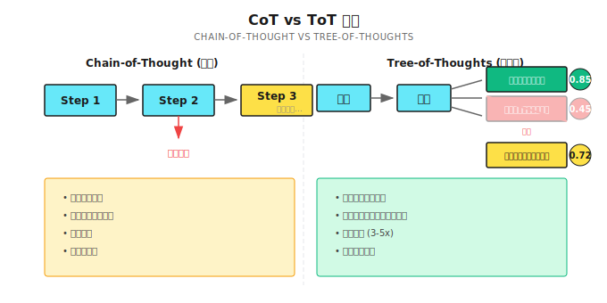

# 第17章 Tree-of-Thoughts
── 複数の推論経路を同時に探索する

> **ToTはエージェントに複数の推論経路を同時に探索させ、スコアリングと枝刈りで最適解を見つけるパターン。ただし万能じゃない。コストは高いし収束は遅い。本当に「試行錯誤」が必要な場面でだけ使うもの。**

---

## 17.1 まず結論：いつToTを使うべきか

実際の案件から話します。

2024年半ば、筆者は技術コンサル会社のアーキテクチャレビューAgentの構築を手伝ってました。クライアントがシステム設計案を提出して、Agentが潜在的な問題を見つけて改善提案を出す、という仕組みです。

ある時、クライアントが決済システムの設計を提出してきました。マイクロサービスアーキテクチャで、サービスごとに独立したデータベース、Kafkaで非同期通信という構成。

Chain-of-Thoughtで分析させてみたんです。推論はこんな感じでした：

```
Step 1: マイクロサービスでスケーラビリティ向上 OK
Step 2: 独立DBで単一障害点を回避 OK
Step 3: Kafkaでサービス間を疎結合に、スループット向上 OK
Step 4: 設計は妥当、明らかな問題なし
```

レビュー通過。クライアントは実装を始めました。

2ヶ月後、クライアントから苦情が来たんです。**分散トランザクションが複雑すぎる！** 注文作成、在庫引き落とし、決済確認。3つのサービスがそれぞれDB持ってて、どうやって整合性取るんだ？2PCは性能悪いし、Sagaは複雑度が爆発する。

Agentの推論を振り返ってみたら、問題はStep 2にあった。「独立DB」という判断は最初の段階で落とし穴を埋め込んでいた。でもCoTは他の可能性（共有DB、CQRSなど）を探索しなかった。一本道を最後まで進んで、各ステップは合理的に見えるけど、全体設計には致命的な欠陥があった。

**これがCoTの問題なんです。一方通行だから、初期の判断が間違うと後は全部ダメになる。** Tree-of-Thoughts（ToT）なら複数の経路を同時に探索して、比較スコアリングでより良い案を発見できる。

ただ、ToTはタダじゃない。コストはCoTの3〜5倍。そして全ての問題に必要なわけじゃない。

### どんな問題にToTが向いてる？

ToTを万能薬だと思ってる人、多すぎます。

**違うんですよ。**

ToTが向いてるシナリオには3つの共通点がある：

1. **解空間が広い**：問題に複数の解決経路がある
2. **初期判断の影響が大きい**：最初の数ステップを間違えると後は全部ダメ
3. **中間状態を評価できる**：ある経路が「見込みあるか」判断できる

| シナリオ | なぜ向いてる | なぜ向いてない |
|---------|-------------|---------------|
| 24点ゲーム | 複数の演算組み合わせを試す必要あり | 単純な加減乗除で答えが出る場合 |
| 複雑な数学証明 | 複数の証明アプローチを比較する必要あり | 標準的な解法がある計算問題 |
| システムアーキテクチャ設計 | 複数のアーキテクチャ案を比較検討する必要あり | 成熟したテンプレートがあるCRUDシステム |
| 戦略立案 | 複数の戦略をシミュレーションする必要あり | 明らかに正しい方法が1つだけの場合 |
| コードデバッグ（複雑なバグ）| 複数の原因候補を調査する必要あり | エラーメッセージが特定の行を指してる場合 |

シンプルな判断方法：

> 自分でこの問題を解くとき、紙にツリー図を描いて複数の案を比較するなら、たぶんToT向き。
> 心の中で答えがわかってて、Agentに実行してほしいだけなら、CoTで十分。

---

## 17.2 CoT vs ToT：核心的な違い



核心的な違いは3点：

| 次元 | CoT | ToT |
|------|-----|-----|
| **経路数** | 単一経路 | 複数経路を並行 |
| **エラー回復** | 間違えると戻れない | 枝刈り・バックトラック可能 |
| **コスト** | 比較的低い | 数倍に増加 |
| **収束速度** | 速い（一本道で進む）| 遅い（探索＋比較が必要）|

正直なところ、ToTの最大の価値は「より良い答えを見つける」ことじゃなくて、「落とし穴にハマるのを避ける」ことだと思ってます。

CoTの問題は：モデルが最初のステップで間違えても、自信満々で推論を続けて、最終的に「合理的に見えるけど完全に間違った」答えを出すこと。

ToTは少なくとも複数の経路を試す。ある経路のスコアが他より明らかに低ければ、その方向に問題があるとわかる。

---

## 17.3 思考ツリーのコア構造

### ノード定義

各ノードは「思考ステップ」を表す：

```go
type ThoughtNode struct {
    ID          string           // ノードID
    Thought     string           // 現在の思考内容
    Score       float64          // 評価スコア (0-1)
    Depth       int              // ツリーの深さ
    ParentID    string           // 親ノード
    Children    []*ThoughtNode   // 子ノード
    TokensUsed  int              // 消費トークン
    IsTerminal  bool             // 終端か（答え発見または行き止まり）
    Explanation string           // 説明（なぜこの経路を選んだか）
}
```

Shannonの実装は[`patterns/tree_of_thoughts.go`](https://github.com/Kocoro-lab/Shannon/blob/main/go/orchestrator/internal/workflows/patterns/tree_of_thoughts.go)にあります。コアの考え方はシンプルで、各ノードにスコアがあって、スコアの低いものは枝刈り、高いものは探索続行。

### 設定パラメータ

```go
type TreeOfThoughtsConfig struct {
    MaxDepth          int     // 最大深さ、デフォルト 3
    BranchingFactor   int     // ノードごとの分岐数、2-4、デフォルト 3
    PruningThreshold  float64 // 枝刈り閾値、デフォルト 0.3
    ExplorationBudget int     // 最大探索ノード数、デフォルト 15
    BacktrackEnabled  bool    // バックトラック許可するか
    EvaluationMethod  string  // "scoring", "voting", "llm"
}
```

これらのパラメータ、どう調整するか？筆者の経験では：

| パラメータ | 小さい値の効果 | 大きい値の効果 | おすすめの初期値 |
|-----------|---------------|---------------|----------------|
| `MaxDepth` | 浅くて速いが、深い解を見つけられないかも | 深くて精密だがコスト高 | 3 |
| `BranchingFactor` | 少数の方向に集中 | より多くの可能性を発散的に探索 | 3 |
| `PruningThreshold` | より多くの分岐を保持 | 積極的に枝刈り、良い案を逃すかも | 0.3 |
| `ExplorationBudget` | コスト節約、カバー範囲不足 | より網羅的、コスト高 | 15 |

**重要な公式**：最悪ケースのノード数 = `BranchingFactor^MaxDepth`

BranchingFactor=3、MaxDepth=3なら、最悪ケースは27ノード。だから`ExplorationBudget`を15に設定するのは妥当。探索完了前に強制停止させる。

---

## 17.4 探索アルゴリズム：Best-First Search

ToTのコアは「最も見込みのありそうなノードを優先的に探索する」こと。ShannonはBest-First Searchを使ってます：

```go
func TreeOfThoughts(
    ctx workflow.Context,
    query string,
    context map[string]interface{},
    sessionID string,
    history []string,
    config TreeOfThoughtsConfig,
    opts Options,
) (*TreeOfThoughtsResult, error) {

    // ルートノード初期化
    root := &ThoughtNode{
        ID:       "root",
        Thought:  query,
        Score:    1.0,
        Depth:    0,
        Children: make([]*ThoughtNode, 0),
    }

    // 探索キュー（スコア順にソート）
    queue := []*ThoughtNode{root}
    thoughtsExplored := 0

    // メインループ
    for len(queue) > 0 && thoughtsExplored < config.ExplorationBudget {
        // スコアでソートして最良ノードを取得
        sort.Slice(queue, func(i, j int) bool {
            return queue[i].Score > queue[j].Score
        })

        current := queue[0]
        queue = queue[1:]

        // 深さ制限
        if current.Depth >= config.MaxDepth {
            current.IsTerminal = true
            continue
        }

        // 分岐生成
        branches := generateBranches(ctx, current, query, config.BranchingFactor, ...)

        // 評価と枝刈り
        for _, branch := range branches {
            branch.Score = evaluateThought(branch, query)

            // 低スコアの分岐を枝刈り
            if branch.Score < config.PruningThreshold {
                continue  // 直接破棄
            }

            current.Children = append(current.Children, branch)

            if isTerminalThought(branch.Thought) {
                branch.IsTerminal = true
            } else {
                queue = append(queue, branch)
            }
        }

        thoughtsExplored++
    }

    // 最適経路を見つける
    bestPath := findBestPath(root)
    return &TreeOfThoughtsResult{BestPath: bestPath, ...}, nil
}
```

コア設計ポイント：

1. **Best-First**：幅優先や深さ優先じゃなく、毎回スコア最高のノードを展開
2. **予算制御**：`ExplorationBudget`で総ノード数を制限、コスト暴走を防ぐ
3. **動的枝刈り**：閾値以下の分岐は直接破棄、後続の探索を無駄にしない

---

## 17.5 「思考」をどう評価するか

ここがToTで一番重要なところ。評価が不正確だと、ツリー全体がダメになる。

### ヒューリスティックスコアリング（速いけど粗い）

Shannonはデフォルトでヒューリスティックスコアリングを使う：

```go
func evaluateThought(node *ThoughtNode, originalQuery string) float64 {
    score := 0.5  // 基本スコア
    thought := strings.ToLower(node.Thought)

    // 正の指標
    if strings.Contains(thought, "therefore") ||
       strings.Contains(thought, "solution") ||
       strings.Contains(thought, "answer") {
        score += 0.2  // 結論に向かう傾向あり
    }

    if strings.Contains(thought, "because") ||
       strings.Contains(thought, "since") {
        score += 0.1  // 論理的つながりあり
    }

    if strings.Contains(thought, "step") ||
       strings.Contains(thought, "first") {
        score += 0.1  // 具体的ステップあり
    }

    // 負の指標
    if strings.Contains(thought, "maybe") ||
       strings.Contains(thought, "perhaps") {
        score -= 0.1  // 曖昧で不確実
    }

    // 深さペナルティ（短い経路を優先）
    score -= float64(node.Depth) * 0.05

    return math.Max(0, math.Min(1, score))
}
```

この評価器はかなり「安上がり」。キーワードしか見てなくて、意味は理解してない。

メリット：速い、安い。
デメリット：モデルの「決まり文句」に騙される可能性あり（"therefore"と言うだけで実際には推論してない）。

### LLM評価（正確だけど高い）

複雑なタスクでは別のLLMに評価させることもできる：

```go
// 概念例：LLMで思考の質を評価
func evaluateWithLLM(ctx workflow.Context, thought string, query string) float64 {
    prompt := fmt.Sprintf(`以下の推論ステップの質を評価してください（0-1点）：

問題：%s
推論ステップ：%s

評価基準：
1. 論理が一貫しているか
2. 解決策に向かって進んでいるか
3. 明らかな誤りがないか

返答形式：{"score": 0.75, "reason": "..."}`, query, thought)

    response := callLLM(prompt)
    return parseScore(response)
}
```

この方法はより正確だけど、各ノードでLLMを呼び出すからコストが倍になる。

### 筆者のおすすめ

ほとんどのシナリオでは、ヒューリスティックスコアリング＋人間の検収で十分。

ヒューリスティックスコアリングが頻繁に「間違った経路を選ぶ」ようなら、LLM評価への切り替えを検討する。

---

## 17.6 停止条件：いつ止めるか

ToTは「答えが見つかった」のか「行き止まり」なのかを知る必要がある：

```go
func isTerminalThought(thought string) bool {
    lower := strings.ToLower(thought)

    // 解決策の指標
    solutionKeywords := []string{
        "the answer is",
        "therefore",
        "in conclusion",
        "final answer",
        "solution:",
    }
    for _, keyword := range solutionKeywords {
        if strings.Contains(lower, keyword) {
            return true
        }
    }

    // 行き止まりの指標
    deadEndKeywords := []string{
        "impossible",
        "cannot be solved",
        "no solution",
        "contradiction",
    }
    for _, keyword := range deadEndKeywords {
        if strings.Contains(lower, keyword) {
            return true
        }
    }

    return false
}
```

停止条件は2種類：

1. **正の終了**：答えが見つかった（"the answer is..."）
2. **負の終了**：行き止まりと確認（"impossible"）

負の終了は重要。見込みのない分岐を素早く諦めて、見込みのある方向にリソースを集中できる。

---

## 17.7 バックトラック機構：確信度が低いとき

最適経路の確信度が低い場合、Shannonは代替案を探索するためにバックトラックを試みる：

```go
// バックトラックロジック
if config.BacktrackEnabled && result.Confidence < 0.5 && len(queue) > 0 {
    logger.Info("Backtracking to explore alternative paths")

    // キューから最高スコアの3つの代替案を取得
    alternatives := queue[:min(3, len(queue))]
    for _, alt := range alternatives {
        altPath := getPathToNode(alt, allNodes)
        altConfidence := calculatePathConfidence(altPath)

        if altConfidence > result.Confidence {
            result.BestPath = altPath
            result.Confidence = altConfidence
        }
    }
}
```

この設計の核心的な考え方：最適解でさえ確信度が低いなら、評価に問題があるかもしれない。他の候補も見てみよう、ということ。

---

## 17.8 実践例：研究角度の探索

実際のシナリオを見てみましょう。

**タスク**：AIエージェント領域の2024年の発展トレンドを分析

**設定**：

```go
config := TreeOfThoughtsConfig{
    MaxDepth:          3,
    BranchingFactor:   3,
    PruningThreshold:  0.4,
    ExplorationBudget: 12,
    BacktrackEnabled:  true,
}
```

**探索プロセス**：

```
Root: "AIエージェント領域の2024年の発展トレンドを分析"
├── 技術進歩の方向 (score: 0.75)
│   ├── マルチモーダル能力 (score: 0.82) ← 最高スコア
│   ├── 推論能力の向上 (score: 0.70)
│   └── ツール使用の進化 (score: 0.68)
├── プロダクト展開の方向 (score: 0.72)
│   ├── エンタープライズ応用 (score: 0.78)
│   └── 開発者ツール (score: 0.65)
└── エコシステム発展の方向 (score: 0.55)
    └── (スコア < 0.4、枝刈り)

最適経路: Root → 技術進歩 → マルチモーダル能力
確信度: 0.78
```

この例はToTの強みを示してる：「技術進歩」だけ見て突っ込むんじゃなくて、まず3つの大きな方向を生成して、評価後に「エコシステム発展」方向は情報が少なすぎると判断して直接枝刈り。

---

## 17.9 よくある落とし穴

### 落とし穴1：分岐爆発

```go
// 間違い：無制限の探索
config := TreeOfThoughtsConfig{
    BranchingFactor:   5,
    ExplorationBudget: 0,  // 予算制限なし！
}
// 結果：5^3 = 125ノード、トークン爆発

// 正解：複雑度を制御
config := TreeOfThoughtsConfig{
    BranchingFactor:   3,
    ExplorationBudget: 15,
    MaxDepth:          3,
}
```

### 落とし穴2：過剰な枝刈り

```go
// 間違い：閾値が高すぎ
config.PruningThreshold = 0.8
// 結果：ほとんど全ての分岐が枝刈りされて、1本道だけ残る（CoTと変わらない）

// 正解：適度に保持
config.PruningThreshold = 0.3
```

### 落とし穴3：評価バイアス

ヒューリスティック評価はモデルの「決まり文句」に騙される可能性がある。モデルが回答に"therefore"を入れるようになっても、実際には推論してない。

**解決方法**：

```go
// 複雑なタスクではLLM評価を使う
config.EvaluationMethod = "llm"

// または「内容チェック」を追加
func evaluateThought(node *ThoughtNode, query string) float64 {
    score := heuristicScore(node)

    // 本当に進展してるかチェック
    if !containsNewInfo(node.Thought, node.Parent.Thought) {
        score *= 0.5  // 足踏みにペナルティ
    }

    return score
}
```

### 落とし穴4：トークン予算を忘れる

ToTのコストは簡単に暴走する。各ノードがLLM呼び出し1回。

```go
// Shannonでは、予算はこう配分される
tokenBudgetPerThought := opts.BudgetAgentMax / config.ExplorationBudget
```

例えば総予算15000トークン、15ノード探索なら、各ノードは1000トークンの枠しかない。

---

## 17.10 ToT vs 他の推論パターン

| パターン | 向いてるシナリオ | コスト | 収束速度 |
|---------|----------------|-------|---------|
| **CoT** | 明確な解法がある問題 | 低 | 速い |
| **ToT** | 複数経路探索、バックトラック必要 | 高（2-5倍）| 遅い |
| **Reflection** | 既存の回答を反復改善 | 中 | 中 |
| **Debate** | 議論のあるトピック、多視点 | 高 | 中 |

**筆者の選択ロジック**：

1. まずCoTで1回試す
2. 結果がイマイチなら、「答えの質の問題」か「方向を間違えた問題」かを見る
3. 質の問題 → Reflection
4. 方向の問題 → ToT

---

## 小結

核心は一言：**ToTは複数経路探索で最適解を見つける。分岐生成、評価スコアリング、低スコア枝刈り、最適選択。**

ただし万能薬じゃない。コスト高、収束遅。本当に「試行錯誤」が必要な場面だけで使うもの。

要点：

1. **Best-First Search**：スコア優先で探索
2. **枝刈り**：閾値以下の分岐は直接破棄
3. **バックトラック**：確信度が低いとき代替経路を探索
4. **予算制御**：ExplorationBudgetでコスト制限
5. **評価方法**：ヒューリスティックは速いけど粗い、LLMは正確だけど高い

---

## Shannon Lab（10分で始める）

本章の概念をShannonソースに対応付けます。

### 必読（1ファイル）

- [`patterns/tree_of_thoughts.go`](https://github.com/Kocoro-lab/Shannon/blob/main/go/orchestrator/internal/workflows/patterns/tree_of_thoughts.go)：`TreeOfThoughts`関数を探して、メインループがBest-First Searchをどう実装してるか見る。`evaluateThought`でヒューリスティックスコアリングのロジックを見る

### 選択で深掘り（興味に応じて2つ）

- [`patterns/options.go`](https://github.com/Kocoro-lab/Shannon/blob/main/go/orchestrator/internal/workflows/patterns/options.go)：`BudgetAgentMax`が各ノードにどう配分されるか理解する
- [`patterns/chain_of_thought.go`](https://github.com/Kocoro-lab/Shannon/blob/main/go/orchestrator/internal/workflows/patterns/chain_of_thought.go)：CoTの実装がToTよりどれだけシンプルか比較して、なぜかを考える

---

## 練習

### 練習1：シナリオ判断

以下のシナリオがCoT向きかToT向きか判断して、理由を説明してください：

1. 「このPythonコードをGoに翻訳して」
2. 「DAU10万人を支えるコミュニティアプリのアーキテクチャを設計して」
3. 「マイクロサービスって何か説明して」
4. 「このバグの根本原因を見つけて（ログに複数の怪しい箇所あり）」

### 練習2：パラメータチューニング

ToTが15ノード探索したけど、最適経路の確信度が0.4しかなかったとします。パラメータをどう調整しますか？少なくとも2つの調整方向を挙げてください。

### 練習3（発展）：評価器の改善

Shannonのヒューリスティック評価器はキーワードしか見てない。改善版を設計してください：

1. 改善ロジックの疑似コードを書く
2. 考える：モデルの「決まり文句」に騙されないようにするには？
3. 考える：改善でどのくらいコストが増える？それだけの価値がある？

---

## 参考文献

- [Tree of Thoughts: Deliberate Problem Solving with Large Language Models](https://arxiv.org/abs/2305.10601) - Yao et al., 2023、ToTのオリジナル論文
- [Chain-of-Thought Prompting](https://arxiv.org/abs/2201.11903) - CoT論文、ToTの前身を理解する
- A*、BFS、DFS探索アルゴリズムの比較 ── ToTは本質的に探索問題

---

## 次章の予告

ToTが解決するのは「複数の経路からどう選ぶか」という問題。でも時には、問題自体が議論の余地があるもので、最適解を見つけるんじゃなく、異なる声を聞く必要がある。

例えば：「AIは人間の仕事を奪うのか？」

こういう問題には標準的な答えがない。異なる視点から異なる結論が出る。このとき必要なのは思考ツリーじゃなくて、**ディベート**。

次章は**Debateパターン**。複数のエージェントに異なる立場から議論させて、対立の中で弱点を暴き、統合してより信頼できる結論を形成する。

次章で。
