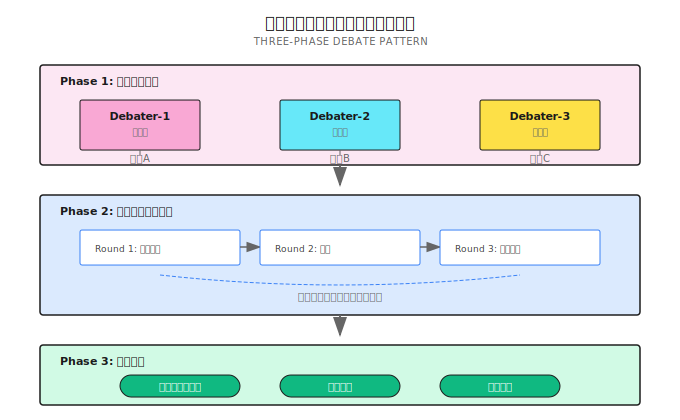

# 第 18 章：Debate パターン

> **Debate は複数のエージェントに異なる立場から討論させ、対立を通じて論証の弱点を暴く。ただし万能じゃない。設計が悪い討論は Token を無駄遣いするだけだ。**

---

エージェントに聞いてみよう：

> 「AI は人間の仕事を奪うのか？」

返ってくる答え：

> 「はい、AI は多くの仕事を奪いますが、新しい仕事も生み出します。歴史上、技術革命のたびにそうでした。全体として楽観的に...」

どっちつかずで、立場のない回答だね。

問題は答え自体が間違っているわけじゃない。一つの角度から一度だけ考えて結論を出したこと。自分を疑わず、反対意見を考慮せず、対立の中で論証の強度を検証していない。

この問題の深刻さに気づいたのは、ある投資機関の業界調査を手伝った時だった。エージェントがもっともらしい結論を出したんだけど、僕が手動で「反対派」を演じて追及したら、その論証はあっさり崩れた。

**Debate パターンは、この「手動での追及」を自動化する。複数のエージェントに異なる立場から討論させる。楽観派、懐疑派、実用派がそれぞれ意見を述べ、対立の中で弱点を暴き、最終的により信頼できる結論を形成する。**

---

## 18.1 なぜ単一エージェントは論争的な質問でつまずくのか

単一エージェントが論争的な質問に答える時、典型的な問題が三つある：

| 問題 | 症状 | 結果 |
|------|------|------|
| **確証バイアス** | 最初に思いついた答えに偏る | 反対の証拠を無視 |
| **過信** | 疑問や反省がない | 論証の穴を誰も指摘しない |
| **視点の単一化** | 他の立場を考慮しない | 結論が偏り、適用性が低い |

Debate はこれをどう解決する？

```
楽観派：AI は奪う以上に多くの質の高い仕事を創出する。歴史上の技術革命がこれを証明している...

懐疑派：ちょっと待って、今回は違う。以前の自動化は肉体労働を代替した。今回は認知労働だ。しかも変化が速すぎて、社会が適応する時間がない...

実用派：どちらも正しいね。重要な問いは「奪うかどうか」じゃなく、「移行の速度」と「再教育の費用を誰が負担するか」だ...

司会者の総括：AI が雇用に与える影響は三つの変数に依存する。技術進歩の速度、政策対応の速度、再教育システムの効率...
```

コアバリュー：

1. **多視点カバレッジ**：盲点を避ける
2. **対立的な質疑**：論証の弱点を暴く
3. **コンセンサス形成**：統合後の結論がより信頼できる

---

## 18.2 いつ Debate を使うべきか

Debate は万能じゃない。間違ったシーンで使うと、Token の無駄遣いになるだけ。

| シーン | 適している理由 | 適さない理由 |
|--------|---------------|-------------|
| 政策分析 | 複数の利害関係者を考慮する必要 | 明確な正解がある法規解釈 |
| 投資判断 | 複数の市場シナリオを考慮する必要 | 純粋な数学計算 |
| 製品方向性 | 技術的実現可能性とビジネス価値のバランス | 明確な要件がある機能実装 |
| 倫理的議論 | 多角的な道徳的検討が必要 | 明確な業界規範があるコンプライアンス問題 |
| 論争的トピック | 異なる立場を提示する必要 | 客観的な答えがある事実の問題 |

シンプルな判断方法：

> この質問を専門家フォーラムに投稿したら、激しい議論になるだろうか？
> なるなら、Debate が適している可能性が高い。
> 皆が同じ答えを出すなら、Debate は無駄だ。

---

## 18.3 Debate の三段階フロー

Shannon の Debate 実装は三段階に分かれる：



---

## 18.4 コア設定

```go
type DebateConfig struct {
    NumDebaters      int      // 討論者数 (2-5)
    MaxRounds        int      // 最大討論ラウンド数
    Perspectives     []string // 異なる視点のリスト
    RequireConsensus bool     // コンセンサス必須かどうか
    ModeratorEnabled bool     // 司会者を有効にするか
    VotingEnabled    bool     // 投票メカニズムを有効にするか
    ModelTier        string   // モデル層
}
```

パラメータ調整のアドバイス：

| パラメータ | 推奨値 | 理由 |
|------------|--------|------|
| `NumDebaters` | 3 | 少なすぎると対立がない、多すぎると調整が難しい |
| `MaxRounds` | 2-3 | 3ラウンドを超えると無限ループになりやすい |
| `Perspectives` | 対立+中立 | 真の対立を確保 |
| `RequireConsensus` | false | 強制コンセンサスは無限ループを引き起こす可能性 |
| `VotingEnabled` | true | コンセンサスが得られない時の兜底策 |

---

## 18.5 Phase 1：初期立場

各エージェントに自分の視点から並行して立場を表明させる：

```go
func Debate(
    ctx workflow.Context,
    query string,
    context map[string]interface{},
    sessionID string,
    history []string,
    config DebateConfig,
    opts Options,
) (*DebateResult, error) {

    // デフォルト視点
    if len(config.Perspectives) == 0 {
        config.Perspectives = generateDefaultPerspectives(config.NumDebaters)
    }

    // 並行して初期立場を取得
    futures := make([]workflow.Future, config.NumDebaters)

    for i := 0; i < config.NumDebaters; i++ {
        perspective := config.Perspectives[i]
        agentID := fmt.Sprintf("debater-%d-%s", i+1, perspective)

        initialPrompt := fmt.Sprintf(
            "As a %s perspective, provide your position on: %s\n" +
            "Be specific and provide strong arguments.",
            perspective, query,
        )

        futures[i] = workflow.ExecuteActivity(ctx,
            activities.ExecuteAgent,
            activities.AgentExecutionInput{
                Query:     initialPrompt,
                AgentID:   agentID,
                Mode:      "debate",
                SessionID: sessionID,
            })
    }

    // 立場を収集
    var positions []DebatePosition
    for i, future := range futures {
        var result AgentResult
        future.Get(ctx, &result)

        positions = append(positions, DebatePosition{
            AgentID:    fmt.Sprintf("debater-%d", i+1),
            Position:   result.Response,
            Arguments:  extractArguments(result.Response),
            Confidence: 0.5,  // 初期信頼度
        })
    }

    // Phase 2 へ続く...
}
```

Shannon のデフォルト視点生成：

```go
func generateDefaultPerspectives(num int) []string {
    perspectives := []string{
        "optimistic",   // 楽観派
        "skeptical",    // 懐疑派
        "practical",    // 実用派
        "innovative",   // 革新派
        "conservative", // 保守派
    }

    if num <= len(perspectives) {
        return perspectives[:num]
    }
    return perspectives
}
```

**重要**：視点設計が Debate の成否を決める。

もし設計した視点が "positive"、"very-positive"、"somewhat-positive" だったら、それは討論じゃない。合唱団だ。

良い視点設計は真の対立を形成する：

| トピックタイプ | 推奨視点の組み合わせ |
|----------------|---------------------|
| 技術選定 | 技術優先派 + コスト優先派 + リスク回避派 |
| 投資判断 | アグレッシブ派 + 保守派 + 裁定派 |
| 製品方向性 | ユーザー体験派 + 技術実現派 + ビジネス価値派 |
| 政策分析 | 受益者 + 損害者 + 中立者 |

---

## 18.6 Phase 2：複数ラウンドの討論

各討論者が他者の立場を見た後、応答する：

```go
for round := 1; round <= config.MaxRounds; round++ {
    roundFutures := make([]workflow.Future, len(positions))

    for i, debater := range positions {
        // 他者の立場を収集
        othersPositions := []string{}
        for j, other := range positions {
            if i != j {
                othersPositions = append(othersPositions,
                    fmt.Sprintf("%s argues: %s", other.AgentID, other.Position))
            }
        }

        responsePrompt := fmt.Sprintf(
            "Round %d: Consider these other perspectives:\n%s\n\n" +
            "As %s, respond with:\n" +
            "1. Counter-arguments to opposing views\n" +
            "2. Strengthen your position\n" +
            "3. Find any common ground\n",
            round, strings.Join(othersPositions, "\n"), debater.AgentID,
        )

        roundFutures[i] = workflow.ExecuteActivity(ctx,
            activities.ExecuteAgent,
            activities.AgentExecutionInput{
                Query:   responsePrompt,
                AgentID: debater.AgentID,
                Context: map[string]interface{}{
                    "round":           round,
                    "other_positions": othersPositions,
                },
            })
    }

    // このラウンドの応答を収集、立場と信頼度を更新
    for i, future := range roundFutures {
        var result AgentResult
        future.Get(ctx, &result)

        positions[i].Position = result.Response
        positions[i].Confidence = calculateArgumentStrength(result.Response)
    }

    // コンセンサス検出
    if config.RequireConsensus && checkConsensus(positions) {
        break
    }
}
```

### 論点強度の評価

Shannon はヒューリスティックな方法で論証強度を評価する：

```go
func calculateArgumentStrength(response string) float64 {
    strength := 0.5

    lower := strings.ToLower(response)

    // 証拠サポート (+0.15)
    if strings.Contains(lower, "evidence") ||
       strings.Contains(lower, "study") ||
       strings.Contains(lower, "data") {
        strength += 0.15
    }

    // 論理構造 (+0.1)
    if strings.Contains(response, "therefore") ||
       strings.Contains(response, "because") {
        strength += 0.1
    }

    // 相手への反論 (+0.15)
    if strings.Contains(lower, "however") ||
       strings.Contains(lower, "although") {
        strength += 0.15
    }

    // 具体例 (+0.1)
    if strings.Contains(lower, "for example") ||
       strings.Contains(lower, "such as") {
        strength += 0.1
    }

    return math.Min(1.0, strength)
}
```

この評価器は完璧じゃない。キーワードを見るだけで、意味は理解していない。でもほとんどのシーンでは十分だ。

### コンセンサス検出

多数が一致に向かっているかを検出する：

```go
func checkConsensus(positions []DebatePosition) bool {
    agreementCount := 0
    for _, pos := range positions {
        lower := strings.ToLower(pos.Position)
        if strings.Contains(lower, "agree") ||
           strings.Contains(lower, "consensus") ||
           strings.Contains(lower, "common ground") {
            agreementCount++
        }
    }
    // 多数が同意すればコンセンサスとみなす
    return agreementCount > len(positions)/2
}
```

---

## 18.7 Phase 3：解決段階

三つの解決方法がある：

```go
if config.ModeratorEnabled {
    // 司会者が各方の観点を統合
    result.FinalPosition = moderateDebate(ctx, positions, query)
} else if config.VotingEnabled {
    // 投票で決定
    result.FinalPosition, result.Votes = conductVoting(positions)
} else {
    // 最強の論点を直接合成
    result.FinalPosition = synthesizePositions(positions, query)
}
```

### 投票メカニズム

信頼度に基づく投票：

```go
func conductVoting(positions []DebatePosition) (string, map[string]int) {
    votes := make(map[string]int)

    winner := positions[0]
    for _, pos := range positions {
        votes[pos.AgentID] = int(pos.Confidence * 100)
        if pos.Confidence > winner.Confidence {
            winner = pos
        }
    }

    return winner.Position, votes
}
```

### 立場の統合

最強の論点を見つけ、最終結論を合成する：

```go
func synthesizePositions(positions []DebatePosition, query string) string {
    // 最強の立場を探す
    strongest := positions[0]
    for _, pos := range positions {
        if pos.Confidence > strongest.Confidence {
            strongest = pos
        }
    }

    // すべての論点を収集
    allArguments := []string{}
    for _, pos := range positions {
        allArguments = append(allArguments, pos.Arguments...)
    }

    // 統合を構築
    synthesis := fmt.Sprintf("After debate on '%s':\n\n", query)
    synthesis += fmt.Sprintf("Strongest Position: %s\n\n", strongest.Position)
    synthesis += "Key Arguments:\n"
    for i, arg := range allArguments[:min(5, len(allArguments))] {
        synthesis += fmt.Sprintf("- %s\n", arg)
    }

    return synthesis
}
```

---

## 18.8 実践例

**タスク**：「AI エージェントは 2025 年に SaaS を置き換えるか？」を分析

**設定**：

```go
config := DebateConfig{
    NumDebaters:      3,
    MaxRounds:        2,
    Perspectives:     []string{"tech-optimist", "risk-aware", "market-focused"},
    RequireConsensus: false,
    VotingEnabled:    true,
}
```

**討論プロセス**：

```
=== Phase 1: 初期立場 ===

tech-optimist (confidence: 0.75):
  AI エージェントはパーソナライズされた自動化のエンドツーエンドソリューションを提供できる。
  従来の SaaS の汎用インターフェースと手動ワークフローは淘汰される。
  複数の成功事例がこのトレンドは不可逆だと証明している...

risk-aware (confidence: 0.80):
  現在のエージェントの信頼性と企業セキュリティ基準は不十分。
  SaaS が何年もかけて最適化してきた安定性は代替が難しい。
  企業の採用サイクルは通常 3-5 年かかる...

market-focused (confidence: 0.70):
  鍵は価格設定とビジネスモデルの変革だ。
  Agent-as-a-Service は SaaS の進化であり、置き換えではない。
  市場シェアの移行にはエコシステムの再構築が必要...

=== Phase 2: Round 1 ===

tech-optimist:
  risk-aware のセキュリティ懸念に対し、サンドボックスとポリシー制御の進歩を指摘...
  ただし企業の採用には確かに時間がかかることを認める...

risk-aware:
  技術の進歩は認めるが、コンプライアンスと監査の現実的制約を強調...
  複数の企業 IT 調達サイクルのデータを引用...

market-focused:
  共通点を探り、ハイブリッドモデルが過渡期の主流になると予測...
  「Agent-enhanced SaaS」を中間形態として提案...

=== Phase 2: Round 2 ===

各方が収束し始め、初期コンセンサスを形成：
- 技術方向は明確（エージェントがトレンド）
- タイムラインは調整が必要（2025 は楽観的すぎる）
- 形態は置き換えではなく進化になる

=== Phase 3: 解決 ===

Votes: {tech-optimist: 75, risk-aware: 80, market-focused: 70}
Winner: risk-aware

Final Position:
AI エージェントは SaaS の代替ではなく、強化レイヤーになる。
短期的（2025）には企業は慎重に採用し、主に低リスクシナリオで試験運用する。
完全な置き換えには信頼性、セキュリティ、コンプライアンスの三大問題の解決が必要で、
3-5 年の移行期間が予想される。
```

---

## 18.9 学習と永続化

討論結果を永続化し、後の学習に使える：

```go
workflow.ExecuteActivity(ctx, activities.PersistDebateConsensus,
    activities.PersistDebateConsensusInput{
        SessionID:        sessionID,
        Topic:            query,
        WinningPosition:  result.FinalPosition,
        ConsensusReached: result.ConsensusReached,
        Confidence:       bestConfidence,
        Positions:        positionTexts,
        Metadata: map[string]interface{}{
            "rounds":       result.Rounds,
            "num_debaters": config.NumDebaters,
        },
    })
```

Shannon は以下を記録する：
- どのトピックがコンセンサスに達しやすいか
- どの視点の組み合わせが最も効果的か
- どの論証パターンが最強か

これらのデータは将来の討論戦略の最適化に使える。

---

## 18.10 よくある落とし穴

### 落とし穴 1：偽討論

```go
// 間違い：視点が似すぎて、真の対立がない
config.Perspectives = []string{"positive", "very-positive", "somewhat-positive"}
// 結果：三つのエージェントが互いにうなずくだけで、質疑がない

// 正解：真の対立を形成
config.Perspectives = []string{"optimistic", "skeptical", "practical"}
```

これが最もよくある間違いだ。討論結果が単一エージェントの回答とほぼ同じなら、視点設計に問題がある可能性が高い。

### 落とし穴 2：無限ループ

```go
// 間違い：強制コンセンサス + 無限ラウンド
config := DebateConfig{
    RequireConsensus: true,
    MaxRounds:        100,  // 永遠にコンセンサスに達しない可能性
}
// 結果：Token を使い果たしても結論が出ない

// 正解：合理的な制限 + 兜底メカニズム
config := DebateConfig{
    RequireConsensus: false,
    MaxRounds:        3,
    VotingEnabled:    true,  // コンセンサスに達しなければ投票
}
```

### 落とし穴 3：Token 爆発

```go
// 間違い：毎ラウンド全履歴を累積
for round := 1; round <= config.MaxRounds; round++ {
    prompt := buildPrompt(fullDebateHistory)  // どんどん長くなる！
}
// 結果：第3ラウンドのコンテキストはモデル制限を超える可能性

// 正解：スライディングウィンドウ + 要約
recentHistory := debateHistory[max(0, len(debateHistory)-6):]
summary := summarizeHistory(debateHistory, maxTokens)
```

### 落とし穴 4：少数派を無視

コンセンサスに達しなくても、少数派の意見には価値があるかもしれない：

```go
if !result.ConsensusReached {
    result.MinorityPositions = extractMinorityViews(positions)
    // リスク警告かもしれない、無視すべきじゃない
}
```

あるケースを見たことがある。懐疑派は討論で「負けた」が、指摘したセキュリティリスクは後で実際に起きた。

---

## 18.11 Debate vs 他のパターン

| パターン | 適用シーン | 結果の特徴 | コスト |
|----------|-----------|-----------|--------|
| **Debate** | 論争的トピック、多角度が必要 | 複数の観点を統合、分歧がある場合も | 高（N*M 回の呼び出し）|
| **ToT** | 解決パスの探索 | 最適な単一ソリューションを発見 | 高（ツリー探索）|
| **Reflection** | 既存の回答を改善 | 同じ方向で反復最適化 | 中（2-3 ラウンド）|
| **Ensemble** | 頑健性の向上 | 多数決/加重平均 | 中（N 回並行）|

**僕の選択ロジック**：

1. 問題に客観的な答えがある → Debate を使わない
2. 問題に論争があり、多視点が必要 → Debate
3. 答えはあるが品質が不十分 → Reflection
4. 複数の解決パスを探索する必要がある → ToT

---

## まとめ

コアは一言：**Debate は複数のエージェントに異なる立場から討論させ、対立を通じて弱点を暴き、統合してより信頼できる結論を形成する**。

でも万能じゃない。設計が悪い討論は Token を無駄遣いするだけだ。

ポイント：

1. **視点設計**：真の対立を確保、偽討論にしない
2. **複数ラウンドの収束**：毎ラウンド相手に応答、共通点を探す
3. **解決メカニズム**：司会者統合、投票、または直接合成
4. **合理的な制限**：MaxRounds と VotingEnabled で無限ループを防ぐ
5. **少数派を保持**：少数意見は重要な警告かもしれない

---

## Shannon Lab（10 分間のハンズオン）

このセクションでは、本章の概念を Shannon ソースコードにマッピングする。

### 必読（1 ファイル）

- [`patterns/debate.go`](https://github.com/Kocoro-lab/Shannon/blob/main/go/orchestrator/internal/workflows/patterns/debate.go)：`Debate` 関数を探して、三つの Phase がどう連携するか確認。`calculateArgumentStrength` で論点評価ロジックを見る

### 選読（2 つ、興味に応じて）

- [`activities/consensus_memory.go`](https://github.com/Kocoro-lab/Shannon/blob/main/go/orchestrator/internal/activities/consensus_memory.go)：`PersistDebateConsensus` を見て、討論結果がどう永続化されて学習に使われるか理解
- [`patterns/reflection.go`](https://github.com/Kocoro-lab/Shannon/blob/main/go/orchestrator/internal/workflows/patterns/reflection.go)：Debate（多視点対立）と Reflection（自己反復）の違いを比較

---

## 練習

### 練習 1：視点設計

以下のトピックに対して 3 つの討論視点を設計し、真の対立を確保せよ：

1. 「会社は完全リモートワークを採用すべきか？」
2. 「スタートアップは自前でインフラを構築すべきか、クラウドサービスを使うべきか？」
3. 「AI 生成コードを本番環境で使うべきか？」

### 練習 2：設定チューニング

討論が 3 ラウンド行われたが、三つのエージェントが終始コンセンサスに達せず、最終投票結果が非常に接近（スコア差が 5% 未満）だった場合、どう対処する？

少なくとも二つの解決策を示せ。

### 練習 3（上級）：論点評価の改善

Shannon の `calculateArgumentStrength` はキーワードだけを見ている。改良版を設計せよ：

1. どの評価次元を追加する？
2. モデルが「お決まりフレーズ」で高得点を取るのをどう防ぐ？
3. コスト対効果分析：改善する価値はあるか？

---

## もっと深く学びたい？

- [Improving Factuality and Reasoning in Language Models through Multiagent Debate](https://arxiv.org/abs/2305.19118) - Du et al., 2023、Debate パターンの理論的基礎
- ゲーム理論の基礎：討論をゼロサムゲーム vs 協力ゲームとして
- クリティカルシンキング：論証構造分析（前提、推論、結論）

---

## 次章の予告

Debate は「多視点をどう統合するか」の問題を解決する。でも時には討論じゃなく、**体系的なリサーチ**が必要なこともある。

例えば：「この会社について調べて、完全な分析レポートを書いて。」

これには：複数の次元を並行調査、情報カバレッジを評価、ギャップを特定して補完、最後にレポートに統合することが必要だ。

次章では **Research Synthesis** について話そう。複数ソースの並行調査、カバレッジ評価、反復補完をどう高品質な統合レポートにまとめるか。

これは Part 6 高度な推論の最終章でもある。ToT、Debate、Research Synthesis の三つのパターンが、「探索」「対立」「統合」という三つの高度な推論ニーズをカバーする。

第 19 章で会おう。
