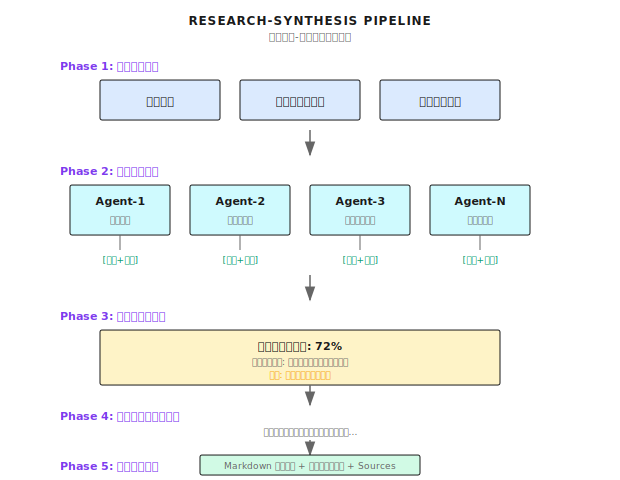

# 第19章 Research Synthesis
── 「検索した」で終わりにしない、ちゃんとした調査の設計

> **Research Synthesisは複数ソースの並列調査、カバレッジ評価、反復補完を統合して、質の高い総合レポートを作る。ポイントは「検索したら終わり」じゃなくて「情報は足りてるか、何が欠けてるか、どう補うか」を評価すること。**

---

> **5分で掴むコア概念**
>
> 1. 体系的調査 vs 単純検索：複数ソース並列 + カバレッジ評価 + 反復補完
> 2. 5フェーズの流れ：計画 → 並列調査 → カバレッジ評価 → 反復補完 → 総合レポート
> 3. カバレッジ閾値：80%未満なら反復継続、最大3回で無限ループ防止
> 4. クロス検証：同じ事実を複数ソースで確認、矛盾があれば信頼度を明記
> 5. 出力標準：構造化Markdown + インライン引用 + Sourcesリスト
>
> **10分パス**：19.1-19.3 → 19.5 → Shannon Lab

---

エージェントにある会社の調査を頼んだとします：

> 「Anthropicについて調べて、分析レポート書いて。」

検索して、上位3件の結果をまとめて返してきた：

```
Anthropicは元OpenAIメンバーが創業したAI安全企業です...
主要製品はClaude...
最近資金調達を完了...
```

これで十分？

**全然足りない。**

問題は「検索できたか」じゃないんです：
- 情報が網羅的じゃない（製品ライン？チーム？競合？）
- クロス検証してない（調達額、各社報道でバラバラ）
- 構造化されてない（断片の寄せ集め、レポートじゃない）
- 情報ギャップを認識してない（何が足りないか分からない）

筆者がこの問題の深刻さに気づいたのは、投資機関のデューデリジェンス支援をしたときでした。エージェントが出してきた「調査レポート」、見た目はそれっぽいんですよ。でもよく見ると、重要な情報が「報道によると」「情報筋によれば」ばっかり。裏取りがない。

**Research Synthesisは「単純検索」を「体系的調査」にアップグレードするもの──複数の切り口を並行調査して、情報カバレッジを評価して、ギャップを特定して補完して、最終的に構造化レポートにまとめる。**

ToTやDebateといったパターンの実践的な応用シーンです。高度な推理を本番で使うとこうなる、という話ですね。

---

## 19.1 単純検索 vs 体系的調査

まず違いを見てみましょう：

| 観点 | 単純検索 | 体系的調査 |
|------|----------|----------|
| **情報ソース** | 検索上位3件 | 複数ソース並列（公式サイト、ニュース、財務情報、SNS...）|
| **カバレッジ評価** | 検索したら終わり | カバレッジ率を評価、ギャップ特定 |
| **情報検証** | そのまま使う | クロス検証、信頼度を明記 |
| **反復補完** | なし | ギャップに対して追加検索 |
| **出力形式** | 断片的なサマリ | 構造化レポート + 引用 |

体系的調査の全体フロー：



---

## 19.2 カバレッジ評価：これが核心

Research Synthesisの最も重要な設計がこれです。「検索したら終わり」じゃなくて「情報は足りてるか」を評価する。

### データ構造

Shannonのカバレッジ評価は [`activities/coverage_evaluator.go`](https://github.com/Kocoro-lab/Shannon/blob/main/go/orchestrator/internal/activities/coverage_evaluator.go) に定義されてます：

```go
type CoverageEvaluationInput struct {
    Query               string              // 調査対象
    ResearchDimensions  []ResearchDimension // 調査の切り口
    CurrentSynthesis    string              // 現在の統合結果
    CoveredAreas        []string            // カバー済み領域
    KeyFindings         []string            // 重要な発見
    Iteration           int                 // 現在の反復回数
    MaxIterations       int                 // 最大反復回数
}

type CoverageEvaluationResult struct {
    OverallCoverage    float64            // 総合カバレッジ 0.0-1.0
    DimensionCoverage  map[string]float64 // 各切り口のカバレッジ
    CriticalGaps       []CoverageGap      // 必須ギャップ
    OptionalGaps       []CoverageGap      // 任意ギャップ
    RecommendedAction  string             // "continue"/"complete"
    ShouldContinue     bool               // 反復を続けるか
    ConfidenceLevel    string             // "high"/"medium"/"low"
    Reasoning          string             // 判断理由
}

type CoverageGap struct {
    Area        string   // 欠落領域
    Importance  string   // "critical"/"important"/"minor"
    Questions   []string // 回答すべき質問
    SourceTypes []string // 推奨ソースタイプ
}
```

### 真のカバレッジ vs ギャップの認知

カバレッジ評価の核心的な課題がこれ：本当の情報と、欠落の認知を区別すること。

```go
func buildCoverageEvaluationPrompt(input CoverageEvaluationInput) string {
    return `## 重要: 真のカバレッジとギャップ認知を区別する

**真のカバレッジ** = 実質的な情報を発見した：
- 具体的な事実、数字、日付、名前
- 証拠に裏付けられた検証済みの主張
- 対象エンティティに関する具体的詳細

**カバレッジではない**（ギャップとしてカウント）：
- 「Xに関する情報は見つかりませんでした」
- 「Yに関するデータはありません」
- 「これはまだ未検証/不明です」
- 対象の情報を競合/業界情報で代替
- 対象固有データなしの一般的な市場背景

重要：統合レポートが「[対象]のXは不明だが、
競合はこうしている」と言っていたら──それはギャップであり、カバレッジではない。

## 評価基準：
- CRITICALギャップ: 主要エンティティ情報の欠落（創業日、製品、チーム）
- IMPORTANTギャップ: 理解を大幅に改善するコンテキストの欠落
- MINORギャップ: 完全性のための補足情報

## 判断ロジック：
- coverage >= 0.85 + 重要ギャップなし + 実質的情報あり → "complete"
- 統合レポートが主に「不明」の羅列 → カバレッジは低い（<0.4）
- coverage < 0.6 + 複数ギャップ → "continue"
- 最大反復到達 → いずれにせよ "complete"
`
}
```

一番よくある問題は「カバレッジの水増し」ですね。エージェントが「このトピック調べました」って言うんだけど、実際には「関連情報は見つかりませんでした」って言ってるだけ。それはカバレッジじゃない、ギャップの確認でしかない。

---

## 19.3 決定論的ガードレール：ワークフローの一貫性を保証する

Shannonの重要な設計の一つです。

LLMの判断は不安定になりえます（同じ入力でも、タイミングによって違う `ShouldContinue` を返すことがある）。でもTemporalワークフローには**決定論的リプレイ**が必要──同じ入力なら同じ出力じゃないといけない。

だから決定論的ガードレールでLLM判断をオーバーライドする：

```go
func EvaluateCoverage(ctx context.Context, input CoverageEvaluationInput) (*CoverageEvaluationResult, error) {
    // ... LLM評価 ...

    // === 決定論的ガードレール ===
    // LLM判断を決定論的ルールでオーバーライド、リプレイの一貫性を保証

    // ルール1: 初回反復 + 低カバレッジ → 必ず継続
    if input.Iteration == 1 && result.OverallCoverage < 0.5 {
        result.ShouldContinue = true
        result.RecommendedAction = "continue"
    }

    // ルール2: 重要ギャップあり + 反復回数残ってる → 必ず継続
    if len(result.CriticalGaps) > 0 && input.Iteration < input.MaxIterations {
        result.ShouldContinue = true
        result.RecommendedAction = "continue"
    }

    // ルール3: 非常に低いカバレッジ → 必ず継続
    if result.OverallCoverage < 0.3 && input.Iteration < input.MaxIterations {
        result.ShouldContinue = true
        result.RecommendedAction = "continue"
    }

    // ルール4: レポート短すぎなのに高カバレッジを主張 → 信頼度を下げる
    if len(input.CurrentSynthesis) < 500 && result.OverallCoverage > 0.7 {
        result.ConfidenceLevel = "low"
    }

    // ルール5: 最大反復到達 → 必ず停止（最優先）
    if input.Iteration >= input.MaxIterations {
        result.ShouldContinue = false
        result.RecommendedAction = "complete"
    }

    return result, nil
}
```

ガードレールの優先順位（高→低）：

1. **最大反復回数** → 強制停止（セーフティネット）
2. **初回反復で低カバレッジ** → 強制継続
3. **重要ギャップあり** → 強制継続
4. **カバレッジが極端に低い** → 強制継続
5. **レポート短いのに高カバレッジ主張** → 低信頼度マーク

この設計で保証されるのは：LLMがどう「ブレ」ようが、ワークフローの挙動は予測可能ってこと。

---

## 19.4 エンティティ関連性フィルタリング

### 問題シナリオ

特定企業を調査するとき、検索結果に関係ない引用が大量に混じることがある：

```
クエリ: 「Anthropic社を調査」

検索結果:
  [1] anthropic.com/company ← 高い関連性（公式サイト）
  [2] TechCrunch: Anthropic raises $4B ← 高い関連性
  [3] 「AI企業のバリュエーション研究」 ← 関連あるかも（複数企業に言及）
  [4] 「ディープラーニング入門」 ← 関係なし
  [5] 「OpenAI最新ニュース」 ← 競合、間接的に関連
```

全部の結果をLLMに渡して統合させると、2つの問題が起きる：
1. 関係ないコンテンツでトークンを浪費
2. 統合レポートに無関係な情報が混入

### エンティティフィルター

Shannonはスコアリングシステムで引用をフィルタリングする（[`strategies/research.go`](https://github.com/Kocoro-lab/Shannon/blob/main/go/orchestrator/internal/workflows/strategies/research.go)）：

```go
// スコアリングシステム（ORロジック、ANDじゃない）：
//   - 公式ドメインマッチ: +0.6点
//   - URLにエイリアス含む: +0.4点
//   - タイトル/概要/ソースにエイリアス含む: +0.4点
//   - 閾値: 0.3（単一マッチでパス可能）
//
// フィルタ戦略：
//  1. 公式ドメインの引用は常に全保持（閾値バイパス）
//  2. 閾値以上の非公式引用を保持
//  3. minKeep (10)まで quality×credibility+entity_score でバックフィル

func FilterCitationsByEntity(
    citations []Citation,
    canonicalName string,
    aliases []string,
    officialDomains []string,
) []Citation {

    const (
        threshold = 0.3  // タイトル/スニペットマッチ(0.4)でパス
        minKeep   = 10   // 深い調査は最低10件保持
    )

    // 名前とエイリアスを正規化
    canonical := strings.ToLower(canonicalName)
    aliasSet := make(map[string]bool)
    aliasSet[canonical] = true
    for _, a := range aliases {
        aliasSet[strings.ToLower(a)] = true
    }

    var officialSites []scoredCitation
    var scored []scoredCitation

    for _, c := range citations {
        score := 0.0
        isOfficial := false
        urlLower := strings.ToLower(c.URL)

        // Check 1: 公式ドメインマッチ (+0.6)
        for domain := range domainSet {
            if strings.Contains(urlLower, domain) {
                score += 0.6
                isOfficial = true
                break
            }
        }

        // Check 2: URLにエイリアス含む (+0.4)
        if !isOfficial {
            for alias := range aliasSet {
                if len(alias) >= 5 && strings.Contains(urlLower, alias) {
                    score += 0.4
                    break
                }
            }
        }

        // Check 3: タイトル/概要にエイリアス含む (+0.4)
        combined := strings.ToLower(c.Title + " " + c.Snippet)
        for alias := range aliasSet {
            if strings.Contains(combined, alias) {
                score += 0.4
                break
            }
        }

        scored = append(scored, scoredCitation{citation: c, score: score, isOfficial: isOfficial})
        if isOfficial {
            officialSites = append(officialSites, sc)
        }
    }

    // Step 1: 公式ドメインは全保持
    var filtered []Citation
    for _, sc := range officialSites {
        filtered = append(filtered, sc.citation)
    }

    // Step 2: 閾値以上の非公式引用
    for _, sc := range scored {
        if !sc.isOfficial && sc.score >= threshold {
            filtered = append(filtered, sc.citation)
        }
    }

    // Step 3: セーフティネットでバックフィル
    if len(filtered) < minKeep {
        // quality×credibility+entity_score でソートしてバックフィル
        // ...
    }

    return filtered
}
```

### 単語境界マッチング

短いエイリアスの誤マッチを防ぐ（例：「mind」が「minders.io」にマッチするのを防ぐ）：

```go
func containsAsWord(text, term string) bool {
    if term == "" {
        return false
    }
    idx := strings.Index(text, term)
    if idx < 0 {
        return false
    }

    // 左境界チェック
    if idx > 0 {
        prev := text[idx-1]
        if (prev >= 'a' && prev <= 'z') || (prev >= '0' && prev <= '9') {
            // 前の文字が英数字、単語境界じゃない
            rest := text[idx+len(term):]
            return containsAsWord(rest, term)  // 再帰で次を探す
        }
    }

    // 右境界チェック
    endIdx := idx + len(term)
    if endIdx < len(text) {
        next := text[endIdx]
        if (next >= 'a' && next <= 'z') || (next >= '0' && next <= '9') {
            rest := text[idx+len(term):]
            return containsAsWord(rest, term)
        }
    }

    return true
}
```

この細かい処理、実は結構大事なんですよ。「Mind」って会社を検索したら、「remind」や「minding」を含むコンテンツが大量に混じって、レポートがぐちゃぐちゃになった、という事例を見たことがあります。

---

## 19.5 総合レポート生成

### エージェント結果の前処理

統合前に、エージェント結果を前処理する：

```go
func preprocessAgentResults(results []AgentExecutionResult) []AgentExecutionResult {
    // Step 1: 完全一致の重複除去（ハッシュベース）
    exact := deduplicateExact(results)

    // Step 2: 類似重複除去（Jaccard類似度 > 0.85）
    near := deduplicateSimilar(exact, 0.85)

    // Step 3: 低品質結果のフィルタリング
    filtered := filterLowQuality(near)

    return filtered
}

// 低品質フィルターのパターン
var noInfoPatterns = []string{
    // 英語：アクセス失敗
    "unfortunately, i cannot access",
    "unable to retrieve",
    "network connection error",

    // 日本語：アクセス失敗
    "残念ながら、アクセスできません",
    "接続できませんでした",
    "ネットワーク接続エラー",

    // 英語：情報未発見
    "i couldn't find",
    "no information available",
    "no results found",

    // 日本語：情報未発見
    "関連情報は見つかりませんでした",
    "見つかりません",
}

func filterLowQuality(results []AgentExecutionResult) []AgentExecutionResult {
    var filtered []AgentExecutionResult
    for _, r := range results {
        resp := strings.TrimSpace(r.Response)
        if !r.Success || resp == "" {
            continue
        }
        if containsNoInfoPatterns(resp) {
            continue  // エラーメッセージをフィルタ
        }
        filtered = append(filtered, r)
    }
    return filtered
}
```

この前処理が解決する3つの問題：
1. **完全重複**：同じエージェントが複数回呼ばれることがある
2. **類似重複**：異なるエージェントがほぼ同じ内容を返すことがある
3. **無効結果**：アクセス失敗、情報未発見の結果

### Synthesisアクティビティ

```go
func SynthesizeResultsLLM(ctx context.Context, input SynthesisInput) (SynthesisResult, error) {
    // 前処理
    input.AgentResults = preprocessAgentResults(input.AgentResults)

    // 目標文字数を計算
    targetWords := 1200
    if len(areas) > 0 {
        targetWords = len(areas) * 400  // 各領域400字
    }
    if targetWords < 1800 {
        targetWords = 1800  // 最低保証
    }

    // 統合プロンプトを構築
    prompt := fmt.Sprintf(`# 統合要件:

## カバレッジチェックリスト（全て満たしてから停止）:
- 各調査領域に専用セクション
- 各セクション最低250-400字
- Executive Summaryに主要洞察（250-400字）
- クエリと同じ言語で回答

## 出力形式:
## Executive Summary
## Detailed Findings
## Limitations and Uncertainties（重大なギャップがある場合のみ）

## 引用の統合:
- インライン引用 [1], [2] で全ての事実主張を注釈
- 最低 %d 個のインライン引用
- "## Sources" セクションは含めない; システムが自動追加
`, minCitations)

    // エージェント結果を追加
    for _, r := range input.AgentResults {
        sanitized := sanitizeAgentOutput(r.Response)
        prompt += fmt.Sprintf("=== Agent %s ===\n%s\n\n", r.AgentID, sanitized)
    }

    // LLM呼び出し
    response := callLLM(prompt, maxTokens)

    return SynthesisResult{
        FinalResult: response,
        TokensUsed:  tokensUsed,
    }, nil
}
```

### 統合の継続メカニズム

LLMが生成したレポートが途中で切れた場合（トークン制限）、自動継続する：

```go
func looksComplete(s string, style string) bool {
    txt := strings.TrimSpace(s)
    if txt == "" {
        return false
    }
    runes := []rune(txt)
    last := runes[len(runes)-1]

    // 文末句読点チェック（ASCII + CJK）
    if last == '.' || last == '!' || last == '?' ||
       last == '。' || last == '！' || last == '？' {
        // 未完了フレーズチェック
        tail := strings.ToLower(txt)
        if len(tail) > 40 {
            tail = tail[len(tail)-40:]
        }
        bad := []string{" and", " or", " with", " to", "、", "と", "や"}
        for _, b := range bad {
            if strings.HasSuffix(tail, b) {
                return false
            }
        }

        // 最小長チェック
        minLength := 1000
        if style == "comprehensive" {
            minLength = 3000
        }
        if len(runes) < minLength {
            return false
        }

        return true
    }

    return false
}

// 継続をトリガー
if finishReason == "stop" && !looksComplete(finalResponse, style) {
    // 最後2000文字をコンテキストとして抽出
    excerpt := string(runes[max(0, len(runes)-2000):])

    contQuery := "Continue the previous synthesis in the SAME language.\n" +
        "- Continue from the last sentence; do NOT repeat\n" +
        "- Maintain same headings and citation style\n" +
        "Previous excerpt:\n" + excerpt

    // LLM継続呼び出し
    contResult := callLLM(contQuery, maxTokens/2)

    // 結合
    finalResponse = strings.TrimRight(finalResponse, "\n") + "\n\n" +
        strings.TrimSpace(contResult.Response)
}
```

---

## 19.6 完全な調査ワークフロー

上記のコンポーネントを繋げると：

```go
func executeResearch(query string) (*ResearchResult, error) {
    // Phase 1: 調査計画
    dimensions := []ResearchDimension{
        {Dimension: "会社概要", Priority: "high"},
        {Dimension: "製品サービス", Priority: "high"},
        {Dimension: "資金調達履歴", Priority: "medium"},
        {Dimension: "チーム背景", Priority: "medium"},
        {Dimension: "市場競争", Priority: "low"},
    }

    // Phase 2: 並列調査
    var agentResults []AgentExecutionResult
    for _, dim := range dimensions {
        result := executeAgent(ctx, AgentInput{
            Query:   fmt.Sprintf("Research %s: %s", dim.Dimension, query),
            AgentID: fmt.Sprintf("researcher-%s", dim.Dimension),
            Mode:    "research",
        })
        agentResults = append(agentResults, result)
    }

    // Phase 3-4: カバレッジ評価 + 反復補完
    var coverageResult *CoverageEvaluationResult
    for iteration := 1; iteration <= 3; iteration++ {
        coverageResult = EvaluateCoverage(ctx, CoverageEvaluationInput{
            Query:              query,
            ResearchDimensions: dimensions,
            CurrentSynthesis:   currentSynthesis,
            CoveredAreas:       extractCoveredAreas(agentResults),
            KeyFindings:        extractKeyFindings(agentResults),
            Iteration:          iteration,
            MaxIterations:      3,
        })

        if !coverageResult.ShouldContinue {
            break
        }

        // 重要ギャップに対して反復補完
        for _, gap := range coverageResult.CriticalGaps {
            additionalResult := executeAgent(ctx, AgentInput{
                Query:   gap.Questions[0],
                AgentID: fmt.Sprintf("gap-filler-%s", gap.Area),
            })
            agentResults = append(agentResults, additionalResult)
        }
    }

    // Phase 5: 総合レポート
    synthesis := SynthesizeResultsLLM(ctx, SynthesisInput{
        Query:        query,
        AgentResults: agentResults,
        Context: map[string]interface{}{
            "synthesis_style": "comprehensive",
            "research_areas":  dimensionNames(dimensions),
        },
    })

    return &ResearchResult{
        Report:     synthesis.FinalResult,
        TokensUsed: synthesis.TokensUsed,
        Coverage:   coverageResult.OverallCoverage,
    }, nil
}
```

---

## 19.7 出力例

「Anthropic社」を調査した最終レポート：

```markdown
## Executive Summary

Anthropicは2021年設立のAI安全企業で、元OpenAIメンバーのDario AmodeiとDaniela Amodeiが創業 [1]。
主力製品はClaude大規模言語モデルシリーズで、現在第3世代まで発展 [2]。
2024年時点で累計70億ドル以上を調達、評価額は約184億ドル [3]。

## Detailed Findings

### 会社概要
Anthropicは2021年設立、本社はサンフランシスコ [1]。企業ミッションはAI安全研究で、
制御可能で解釈可能なAIシステム開発に注力。創業チームは元OpenAIコア研究者多数 [4]...

### 製品サービス
主力製品はClaude大規模言語モデルシリーズ。2024年発表のClaude 3シリーズは3バージョン：
Opus（最高性能）、Sonnet（バランス）、Haiku（最速）[2]。Claudeは安全性とアラインメントを重視...

### 資金調達履歴
累計70億ドル以上調達 [3]。主要投資家はGoogle（20億ドル）、
Salesforce、Zoomなど [5]。2024年の追加調達で評価額184億ドルに...

### チーム背景
CEO Dario AmodeiとPresident Daniela Amodeiはともに元OpenAI幹部 [4]。
コア研究チームにはAI安全分野の著名研究者多数...

## Limitations and Uncertainties

- 最新調達ラウンドの具体的条件は非公開
- 商業化進捗（売上、顧客数）の公式データなし

## Sources
[1] https://www.anthropic.com/company
[2] https://www.anthropic.com/claude
[3] https://www.crunchbase.com/organization/anthropic
[4] https://www.linkedin.com/company/anthropic
[5] https://www.theverge.com/2024/01/...
```

---

## 19.8 よくある落とし穴

### 落とし穴1：カバレッジの水増し

```go
// ダメ：「見つからなかった」をカバレッジとしてカウント
if strings.Contains(synthesis, "company") {
    coverage = 0.9  // 水増し！
}

// 正解：実質的情報 vs ギャップ認知を区別
if containsSubstantiveInfo(synthesis) && !isAcknowledgedGap(synthesis) {
    coverage = calculateActualCoverage(synthesis)
}
```

### 落とし穴2：無限ループ

```go
// ダメ：強制終了条件なし
for coverageResult.ShouldContinue {
    // 永遠に止まらない可能性
}

// 正解：決定論的ガードレール
if input.Iteration >= input.MaxIterations {
    result.ShouldContinue = false  // 強制終了
}
```

### 落とし穴3：フィルタリングのやりすぎ

```go
// ダメ：閾値が高すぎて有用な情報を捨てる
threshold = 0.8
// 結果：公式サイトだけ残って、ニュースや分析の外部視点がなくなる

// 正解：緩い閾値 + セーフティネット
threshold = 0.3
minKeep = 10  // 最低10件保持
```

### 落とし穴4：トークン爆発

```go
// ダメ：全エージェント結果をそのまま連結
for _, r := range results {
    prompt += r.Response  // コンテキストウィンドウ超過の可能性
}

// 正解：各エージェントの長さを制限
const maxPerAgentChars = 4000
for _, r := range results[:maxAgents] {
    if len(r.Response) > maxPerAgentChars {
        r.Response = r.Response[:maxPerAgentChars] + "..."
    }
}
```

---

## 19.9 Research Synthesis vs 他のパターン

| パターン | 目的 | 適用シーン | 出力 |
|----------|------|------------|------|
| **Research Synthesis** | 網羅的調査 + 総合レポート | デューデリ、業界分析、競合調査 | 構造化レポート |
| **ToT** | 解決経路の探索 | 複数の可能な解法がある問題 | 最適解 |
| **Debate** | 多視点の統合 | 論争のあるトピック | 統合的立場 |
| **ReAct** | 問題解決 | ツール呼び出しが必要なタスク | タスク結果 |

**Research Synthesisのユニークな点**：

1. **反復性**：一度検索して終わりじゃなくて、評価 → 補完 → 再評価
2. **構造化**：出力はセクションと引用のあるレポート、断片じゃない
3. **カバレッジ意識**：「何を知らないか」を認識して、能動的にギャップを特定

---

## この章のまとめ

一言で言うと：**Research Synthesisはカバレッジ評価、反復補完、エンティティフィルタリングで、複数ソース調査を質の高い総合レポートに統合する**。

ポイントは「検索したら終わり」じゃなくて「足りてるか、何が欠けてるか、どう補うか」を評価すること。

要点：

1. **カバレッジ評価**：真の情報 vs ギャップ認知を区別
2. **決定論的ガードレール**：Temporalワークフローのリプレイ一貫性を保証
3. **エンティティフィルタリング**：対象エンティティに関連する引用だけ保持
4. **反復補完**：重要ギャップに対して追加検索
5. **統合の継続**：途中で切れたレポートを自動処理

---

## Shannon Lab（10分で始める）

この章の概念をShannonソースに対応付けます。

### 必読（1ファイル）

- [`activities/coverage_evaluator.go`](https://github.com/Kocoro-lab/Shannon/blob/main/go/orchestrator/internal/activities/coverage_evaluator.go)：`EvaluateCoverage` 関数で決定論的ガードレールがLLM判断をどうオーバーライドするか確認；`buildCoverageEvaluationPrompt` で真のカバレッジとギャップ認知の区別方法を確認

### 選択で深掘り（興味に応じて2つ）

- [`strategies/research.go`](https://github.com/Kocoro-lab/Shannon/blob/main/go/orchestrator/internal/workflows/strategies/research.go)：完全な調査ワークフローが各フェーズをどう連携させるか理解；`FilterCitationsByEntity` でエンティティフィルタリングのロジック確認
- [`activities/synthesis.go`](https://github.com/Kocoro-lab/Shannon/blob/main/go/orchestrator/internal/activities/synthesis.go)：エージェント結果の前処理と総合レポート生成を理解；`preprocessAgentResults` で重複除去とフィルタリングのロジック確認

---

## 演習

### 演習1：カバレッジ評価

以下の統合レポート断片について、カバレッジ率（0-1）を評価し、重要ギャップを特定せよ：

```
XYZ社について、以下の情報を発見：
- 2020年設立、本社は東京
- 主力製品はSaaSプラットフォーム（具体的な機能の詳細説明は見つからず）
- 資金調達：報道によるとAラウンド完了、金額は非公開
- チーム：創業者の経歴は不明
- 競合：市場に類似企業が複数あるが、直接比較データは見つからず
```

### 演習2：ガードレール設計

より厳格なカバレッジガードレールを設計するなら、どんなルールを追加する？考慮点：

1. レポート長 vs 主張カバレッジ率の関係
2. 引用数 vs 情報信頼度の関係
3. 「情報が見つからない」と「情報が存在しない」の区別方法

### 演習3（発展）：多言語調査

日本企業を調査するとき、日本語資料の検索が必要になる。設計を考えよ：

1. 多言語検索の必要性をどう判断する？
2. 多言語結果の統合をどう処理する？
3. 統合レポートの言語一貫性をどう保証する？

---

## もっと深く知りたい人へ

- システマティック・リテラチャー・レビュー方法論（Systematic Literature Review）
- メタ分析手法（Meta-analysis）
- 関連章：第10章 Planningパターン、第13章 編成基礎、第14章 DAGワークフロー

---

## Part 6 おわりに

これでPart 6「高度な推論」の最終章です。

3つのパターンが3種類の高度な推論ニーズをカバーしました：

| パターン | 核心的な問い | 適用シーン |
|----------|--------------|------------|
| **Tree-of-Thoughts** | 複数の道をどう選ぶ？ | 複数の解決アプローチを探索 |
| **Debate** | 複数の視点をどう統合？ | 論争トピック、多角的分析 |
| **Research Synthesis** | 複数ソースの情報をどう統合？ | 体系的調査、デューデリ、分析レポート |

Part 7からは**本番アーキテクチャ**に入ります。第20章では3層アーキテクチャ設計、Go/Rust/Pythonの役割分担を見ていきます。
