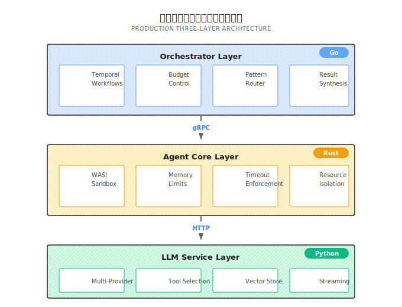

# 第 20 章：3層アーキテクチャ設計

> **3層アーキテクチャは技術の見せびらかしじゃない。各言語が得意なことをやらせるためだ。Go で編成、Rust で隔離、Python で AI エコシステムに接続。**
> **ただしコストもある。デプロイの複雑さ、デバッグ工数、レイヤー間の遅延。導入前に、自分の規模が本当にこれを必要としているか考えよう。**

---

Python でエージェント（Agent）を書いたとしよう。シングルプロセス、asyncio で並行処理、ツールはプロセス内で直接実行。

1週間動かして、順調だった。でもユーザーが増えてきたら、問題が出始める：

1. あるユーザーが悪意のある Python コードを送ってきた。エージェントは素直に実行して、サーバーの `/etc/passwd` を読み出してそのまま返してしまった
2. 10 リクエストが同時に来て、GIL がガチガチにロック。レスポンス時間が 2 秒から 20 秒に
3. 深夜にプロセスが落ちて、実行中だった 5 つの調査タスクが全部消えた。翌日ユーザーからクレーム
4. ひとつのツール呼び出しが 8GB のメモリを食い尽くして、サービス全体がダウン。ログを書く暇もなかった

これらは「コードの書き方が悪い」んじゃない。**モノリスアーキテクチャの限界**なんだ。

3層アーキテクチャはこの限界を突破するためのもの。編成、安全な実行、LLM 呼び出しを別々のサービスに分離して、各言語の強みを最大限に活かす。

---

## 20.1 なぜ分層するのか？

### モノリスアーキテクチャの限界

よく見かけるエージェントフレームワークはこんな構造だ：

```
┌───────────────────────────────────────┐
│  Python Monolith                      │
│  ┌─────────────────────────────────┐  │
│  │ Orchestration (asyncio)         │  │
│  │ Agent Execution (同一プロセス)    │  │
│  │ Tool Calling (直接実行)          │  │
│  │ LLM API (requests)              │  │
│  └─────────────────────────────────┘  │
└───────────────────────────────────────┘
```

このアーキテクチャは開発が速い、デプロイが簡単、デバッグしやすい。プロトタイプや小規模利用なら十分だ。

**でも避けられない問題がある：**

| 問題 | 根本原因 | 結果 |
|------|----------|------|
| **セキュリティ境界が曖昧** | ツールコードがメインプロセスとメモリ空間を共有 | 悪意のあるコードが何でもアクセスできる |
| **並行処理の限界** | Python GIL が真の並列を制限 | 10 リクエストでサービスが詰まる |
| **状態が消えやすい** | メモリ上の状態が永続化されていない | プロセスクラッシュ = タスク全滅 |
| **リソース隔離が弱い** | 全ツールが同じプロセスリソースを共有 | 1 つのツールが OOM すると全体が落ちる |

自分だけで使うエージェント、あるいはユーザーが信頼できる場合、これらの問題は表面化しないかもしれない。

でも**外部ユーザー向けの本番システム**を作るなら、遅かれ早かれ事故になる。

### 3層アーキテクチャの解決策

3層アーキテクチャはこれらの責務を分離する：



### なぜこの3言語なのか？

適当に選んだわけじゃない。各言語はその位置で独自の強みを持っている：

| レイヤー | 言語 | なぜこれを選ぶか | Python に置き換えたらどうなる |
|----------|------|------------------|------------------------------|
| Orchestrator | Go | 高並行性、Temporal ネイティブサポート、コンパイル言語でランタイムエラーが起きにくい | asyncio でできるが、Temporal SDK は Go ほど成熟していない |
| Agent Core | Rust | メモリ安全、WASI サンドボックスサポート、ゼロコスト抽象化 | 同等レベルのセキュリティ隔離は提供できない |
| LLM Service | Python | LLM SDK エコシステムが最も豊富、AI ライブラリが最も充実、イテレーションが最速 | もともと Python、エコシステムの優位性は明らか |

**でも言っておかなきゃいけない：3層アーキテクチャは銀の弾丸じゃない。**

コストがある：
- デプロイの複雑さが上がる（最低でも 3 サービス + Temporal + データベース）
- デバッグが難しくなる（問題がどの層にもありうる）
- レイヤー間通信の遅延オーバーヘッド

ユーザー数が少ない、セキュリティ要件が高くない、たまのサービス再起動を許容できるなら、モノリス Python のほうが向いているかもしれない。

---

## 20.2 Orchestrator 層 (Go)

Orchestrator はシステムの「頭脳」だ。具体的なタスクを実行するんじゃなくて、**誰が実行するか、どんな順序で実行するか、結果をどう統合するか**を決める。

### 主な責務

| 責務 | 説明 | 主な実装 |
|------|------|----------|
| **ワークフロー編成** | Temporal ベースの永続的実行 | クラッシュから自動復旧 |
| **予算管理** | トークン予算、コスト追跡 | 予算超過で自動停止 |
| **ルーティング決定** | 実行戦略の選択（ReAct/DAG/Supervisor） | 複雑さスコアに基づく |
| **結果統合** | 複数エージェントの結果を統合 | LLM 支援 + ルールベース統合 |

### エントリーポイントの構造

Shannon の Orchestrator エントリーポイントは [`main.go`](https://github.com/Kocoro-lab/Shannon/blob/main/go/orchestrator/main.go) にある。いくつか重要な部分を説明しよう：

**1. ヘルスチェックが最初に起動**

```go
// ヘルスチェックは他のコンポーネントより先に起動
hm := health.NewManager(logger)
healthHandler := health.NewHTTPHandler(hm, logger)
healthHandler.RegisterRoutes(httpMux)

go func() {
    _ = hm.Start(ctx)
    server := &http.Server{
        Addr:    ":" + strconv.Itoa(healthPort),
        Handler: httpMux,
    }
    logger.Info("Admin HTTP server listening", zap.Int("port", healthPort))
    server.ListenAndServe()
}()
```

なぜヘルスチェックを先に起動するのか？Kubernetes の readiness probe がサービス起動後すぐにチェックを始めるからだ。ヘルスエンドポイントがまだ立ち上がっていないと、Pod が unhealthy と判定されて kill される。無限再起動ループになる。

**2. データベース接続とヘルスチェック**

```go
dbClient, err := db.NewClient(dbConfig, logger)
if err != nil {
    logger.Fatal("Failed to initialize database client", zap.Error(err))
}
defer dbClient.Close()

// データベースヘルスチェックを登録
if dbClient != nil {
    dbChecker := health.NewDatabaseHealthChecker(dbClient.GetDB(), dbClient.Wrapper(), logger)
    _ = hm.RegisterChecker(dbChecker)
}
```

**3. Temporal Worker の起動（リトライ付き）**

```go
// TCP 事前チェック
for i := 1; i <= 60; i++ {
    c, err := net.DialTimeout("tcp", host, 2*time.Second)
    if err == nil {
        _ = c.Close()
        break
    }
    logger.Warn("Waiting for Temporal TCP endpoint", zap.String("host", host), zap.Int("attempt", i))
    time.Sleep(1 * time.Second)
}

// SDK 接続リトライ
var tClient client.Client
for attempt := 1; ; attempt++ {
    tClient, err = client.Dial(client.Options{
        HostPort: host,
        Logger:   temporal.NewZapAdapter(logger),
    })
    if err == nil {
        break
    }
    delay := time.Duration(min(attempt, 15)) * time.Second
    logger.Warn("Temporal not ready, retrying", zap.Int("attempt", attempt), zap.Duration("sleep", delay))
    time.Sleep(delay)
}
```

なぜ2段階チェックなのか？TCP チェックは速い（2秒タイムアウト）ので、Temporal サービスに到達できるかを素早く判定できる。SDK 接続はより重いので、失敗したら指数バックオフでリトライする。

**4. ワークフローとアクティビティの登録**

```go
orchestratorRegistry := registry.NewOrchestratorRegistry(registryConfig, logger, dbClient.GetDB(), sessionManager)

startWorker := func(queue string, actSize, wfSize int) worker.Worker {
    wk := worker.New(tClient, queue, worker.Options{
        MaxConcurrentActivityExecutionSize:     actSize,
        MaxConcurrentWorkflowTaskExecutionSize: wfSize,
    })
    if err := orchestratorRegistry.RegisterWorkflows(wk); err != nil {
        logger.Error("Failed to register workflows", zap.String("queue", queue), zap.Error(err))
    }
    if err := orchestratorRegistry.RegisterActivities(wk); err != nil {
        logger.Error("Failed to register activities", zap.String("queue", queue), zap.Error(err))
    }
    go wk.Run(worker.InterruptCh())
    return wk
}
```

### 優先度キュー

Shannon は複数キューモードをサポートしていて、優先度の異なるタスクは異なるキューを通る：

```go
if priorityQueues {
    _ = startWorker("shannon-tasks-critical", 12, 12)  // 重要タスク、高並行性
    _ = startWorker("shannon-tasks-high", 10, 10)
    w = startWorker("shannon-tasks", 8, 8)              // 通常タスク
    _ = startWorker("shannon-tasks-low", 4, 4)          // 低優先度
} else {
    w = startWorker("shannon-tasks", 10, 10)            // シングルキューモード
}
```

優先度キューの典型的な用途：
- **Critical**：ユーザーが待っているリアルタイムリクエスト
- **High**：重要だが少し待てるタスク
- **Normal**：通常のバックグラウンドタスク
- **Low**：レポート生成、データクリーンアップなど

---

## 20.3 Agent Core 層 (Rust)

Agent Core はシステムの「ボディガード」だ。**制御された環境**で安全でない可能性のある操作を実行する責任を持つ。

### 主な責務

| 責務 | 説明 | 実装方法 |
|------|------|----------|
| **サンドボックス実行** | ユーザーコードを隔離して実行 | WASI サンドボックス |
| **リソース制限** | メモリ、CPU、ネットワーク | cgroups + WASI 機能制限 |
| **タイムアウト制御** | 長時間タスクを強制終了 | システムレベルタイムアウト |
| **ツール実行** | 安全なツール呼び出し | ホワイトリスト + パラメータ検証 |

### なぜ Rust なのか？

Python でリソース制限できるか？できる。でも Rust と同じレベルは難しい：

| 機能 | Python | Rust |
|------|--------|------|
| メモリ安全 | ランタイムチェック | コンパイル時保証 |
| WASI サンドボックス | 外部プロセスが必要 | ネイティブ統合（wasmtime） |
| リソース隔離 | プロセスレベル | スレッドレベル |
| パフォーマンスオーバーヘッド | 高い | 極めて低い |

セキュリティ要件が高くないなら、Python の subprocess + ulimit でも基本的な隔離はできる。でも外部ユーザー向けなら、Rust のセキュリティ保証のほうが信頼できる。

### gRPC サービス定義

Agent Core は gRPC でサービスを公開する：

```protobuf
service AgentService {
  rpc ExecuteTask(ExecuteTaskRequest) returns (ExecuteTaskResponse);
  rpc StreamExecuteTask(ExecuteTaskRequest) returns (stream TaskUpdate);
  rpc HealthCheck(HealthCheckRequest) returns (HealthCheckResponse);
  rpc DiscoverTools(DiscoverToolsRequest) returns (DiscoverToolsResponse);
}

message ExecuteTaskRequest {
  TaskMetadata metadata = 1;
  string query = 2;
  google.protobuf.Struct context = 3;
  ExecutionMode mode = 4;
  repeated string available_tools = 5;
  AgentConfig config = 6;
}

message AgentConfig {
  int32 max_iterations = 1;      // 最大イテレーション回数
  int32 timeout_seconds = 2;     // タイムアウト時間
  bool enable_sandbox = 3;       // サンドボックス有効化
  int64 memory_limit_mb = 4;     // メモリ制限
}
```

### ツール機能の記述

各ツールには詳細な機能記述がある：

```protobuf
message ToolCapability {
  string id = 1;
  string name = 2;
  string description = 3;
  string category = 4;
  google.protobuf.Struct input_schema = 5;   // JSON Schema
  google.protobuf.Struct output_schema = 6;
  repeated string required_permissions = 7;  // 必要な権限
  int64 estimated_duration_ms = 8;           // 予想所要時間
  bool is_dangerous = 9;                     // 危険フラグ
  RateLimit rate_limit = 14;                 // レート制限設定
}
```

`is_dangerous` フラグは追加の承認フローやサンドボックス隔離をトリガーするために使う。たとえば `code_execution` や `file_system` ツールは危険としてマークされる。

---

## 20.4 LLM Service 層 (Python)

LLM Service はシステムの「口」だ。様々な AI モデルとの対話を担当する。

### 主な責務

| 責務 | 説明 | 実装方法 |
|------|------|----------|
| **マルチプロバイダー呼び出し** | OpenAI、Anthropic、Google など | Provider 抽象レイヤー |
| **ツール選択** | クエリに基づいて適切なツールを選択 | セマンティックマッチング + ルール |
| **ベクトルストア** | Embedding 生成と検索 | Qdrant + キャッシュ |
| **ストリーミングレスポンス** | トークンレベルのストリーム出力 | SSE/WebSocket |

### なぜ Python なのか？

AI エコシステムはほぼ Python ファーストだ：
- OpenAI SDK: Python 版が最初に更新される
- Anthropic SDK: Python 版が最も機能が充実
- LangChain/LlamaIndex: Python ネイティブ
- ベクトルデータベースクライアント: Python サポートが最も良い

Go や Rust で LLM を呼び出すことはもちろんできる。でも SDK 適合に大量の時間を費やすことになって、ビジネスロジックに集中できない。

### 主要エンドポイント

```python
# /agent/query - メインクエリエンドポイント
@app.post("/agent/query")
async def query(request: QueryRequest):
    response = await llm_client.query(
        query=request.query,
        context=request.context,
        tools=request.allowed_tools,
        model_tier=request.model_tier,
        max_tokens=request.max_tokens,
    )
    return {
        "success": True,
        "response": response.content,
        "tokens_used": response.usage.total_tokens,
        "model_used": response.model,
    }

# /embeddings - ベクトル生成
@app.post("/embeddings")
async def embeddings(request: EmbeddingRequest):
    vectors = await embedding_service.generate(
        texts=request.texts,
        model=request.model or "text-embedding-3-small",
    )
    return {"embeddings": vectors}
```

---

## 20.5 レイヤー間通信

3層間は gRPC と HTTP で通信する。いくつか重要な設計がある：

### Workflow ID の伝播

サービス間呼び出し時に、追跡用の Workflow ID を自動で注入する：

```go
// HTTP リクエストに Workflow ID を自動注入
type WorkflowHTTPRoundTripper struct {
    base http.RoundTripper
}

func (w *WorkflowHTTPRoundTripper) RoundTrip(req *http.Request) (*http.Response, error) {
    info := activity.GetInfo(req.Context())
    if info.WorkflowExecution.ID != "" {
        req.Header.Set("X-Workflow-ID", info.WorkflowExecution.ID)
        req.Header.Set("X-Run-ID", info.WorkflowExecution.RunID)
    }
    return w.base.RoundTrip(req)
}
```

これのメリット：
- **分散トレーシング**：ログを Workflow ID で集約できる
- **リソース帰属**：トークン消費を具体的なタスクに紐づけられる
- **問題特定**：問題が起きたとき完全な呼び出しチェーンが見える

### タイムアウトの階層

レイヤー間のタイムアウトは**外から内へ減少させる**必要がある：

```yaml
# 正しいタイムアウト設定
orchestrator: timeout=120s  # 最外層が最長
agent-core: timeout=60s
llm-service: timeout=30s    # 最内層が最短

# 間違った設定 - 予期しないタイムアウトが発生
# orchestrator: timeout=60s
# agent-core: timeout=30s  # orchestrator が待っている間にタイムアウトする可能性
```

内層のタイムアウトが外層より長いと、外層が先にタイムアウトして、内層の作業が無駄になる。

---

## 20.6 設定管理

### ホットリロード設定

Shannon はサービス再起動なしで設定のホットリロードをサポートしている：

```go
shannonCfgMgr.RegisterCallback(func(oldConfig, newConfig *cfg.ShannonConfig) error {
    // ヘルスチェック設定を更新
    newHealthConfig := &health.HealthConfiguration{
        Enabled:       newConfig.Health.Enabled,
        CheckInterval: newConfig.Health.CheckInterval,
        GlobalTimeout: newConfig.Health.Timeout,
    }
    hm.UpdateConfiguration(newHealthConfig)

    // ポリシーエンジンが変更されたら再初期化
    if policyChanged(oldConfig, newConfig) {
        activities.InitializePolicyEngineFromShannonConfig(&newConfig.Policy)
    }

    return nil
})

// モデル価格設定のホットリロード
configMgr.RegisterHandler("models.yaml", func(ev cfg.ChangeEvent) error {
    pricing.Reload()
    logger.Info("Pricing configuration reloaded")
    return nil
})
```

### 環境変数の優先度

本番環境では、環境変数が設定ファイルを上書きすべきだ：

```go
// 環境変数 > 設定ファイル
jwtSecret := shCfgForAuth.Auth.JWTSecret
if envSecret := os.Getenv("JWT_SECRET"); envSecret != "" {
    jwtSecret = envSecret  // 環境変数で上書き
}
```

こうすることで、Kubernetes で Secret を通じて機密設定を注入できる。設定ファイルに秘密鍵を書く必要がない。

---

## 20.7 リクエストフローの例

クエリが3層間をどう流れるか：

```
ユーザーリクエスト: "あるAI企業を分析して"
          |
[Orchestrator (Go)]
  1. gRPC でリクエスト受信
  2. Temporal Workflow を作成
  3. ルーティング選択: ResearchWorkflow
  4. タスク分解: 企業概要、製品、資金調達...
          | gRPC
[Agent Core (Rust)]
  5. サンドボックスで検索ツールを実行
  6. リソース制限: 1GB メモリ、30秒タイムアウト
  7. 検索結果を返す
          | HTTP
[LLM Service (Python)]
  8. LLM API を呼び出して結果を分析
  9. 構造化サマリーを生成
  10. Qdrant にベクトル化して保存
          |
[Orchestrator (Go)]
  11. 複数エージェントの結果を統合
  12. カバレッジを評価
  13. 最終レポートを返す
```

---

## 20.8 よくあるハマりどころ

### ハマりどころ 1：レイヤー間のトランザクション一貫性

3層アーキテクチャにはサービス間のトランザクション保証がない。こう書いたらダメだ：

```go
// ダメ：レイヤー間のアトミック性を仮定している
func processTask() {
    orchestrator.StartWorkflow()  // 成功
    agentCore.ExecuteTask()       // 失敗するかも
    llmService.Synthesize()       // 状態が不整合に
}
```

正しいやり方は Temporal の Activity でラップすること：

```go
// 正しい：Temporal で保証
workflow.ExecuteActivity(ctx, activities.ExecuteAgent, ...)
// Temporal がリトライと復旧を自動処理
```

### ハマりどころ 2：リソースリーク

gRPC 接続を閉じないとリソースリークになる：

```go
// ダメ：接続を閉じていない
conn, _ := grpc.Dial(addr, ...)
// defer conn.Close() を忘れた

// 正しい：グレースフルシャットダウン
defer func() {
    grpcServer.GracefulStop()
    w.Stop()
    dbClient.Close()
}()
```

### ハマりどころ 3：設定の不整合

3層の設定を独立して管理すると不整合が起きやすい：

```yaml
# ダメ：タイムアウト設定が合っていない
# orchestrator: token_budget=10000
# llm-service: max_tokens=20000  # orchestrator の予算より大きい、切り捨てられる

# 正しい：一貫性を保つ
# orchestrator: token_budget=10000
# llm-service: max_tokens=10000  # orchestrator と一致
```

### ハマりどころ 4：デバッグが難しい

問題はどの層でも起こりうる。推奨：
- Workflow ID を使ってログを統一的に関連付ける
- 各層で重要なメトリクスを出力する
- 分散トレーシング（OpenTelemetry）を使う

---

## この章のまとめ

1. **3層の分担**：Orchestrator が編成、Agent Core が隔離、LLM Service が AI 接続
2. **言語選択**：Go で高並行性、Rust で安全性、Python でエコシステム
3. **レイヤー間通信**：gRPC + Workflow ID 伝播
4. **設定管理**：ホットリロード + 環境変数優先
5. **コスト意識**：デプロイの複雑さ、デバッグコスト、レイヤー間遅延

---

## Shannon Lab（10分で始める）

このセクションでは、この章の概念を Shannon ソースコードに10分で対応させる。

### 必読（1ファイル）

- [`docs/multi-agent-workflow-architecture.md`](https://github.com/Kocoro-lab/Shannon/blob/main/docs/multi-agent-workflow-architecture.md)：システム全体図。Router/Strategy/Pattern の3層がどう分担しているかを理解する

### 深掘り用（2つ、興味に応じて選択）

- [`main.go`](https://github.com/Kocoro-lab/Shannon/blob/main/go/orchestrator/main.go)：サービス起動順序を見る。なぜヘルスチェックが最初か、Temporal 接続のリトライはどうするか
- [`health/manager.go`](https://github.com/Kocoro-lab/Shannon/blob/main/go/orchestrator/internal/health/manager.go)：ヘルスチェックマネージャー。Critical チェックと Non-Critical チェックの違いを理解する

---

## 練習

### 練習 1：リクエストチェーンを描く

シーケンス図を描いて、「ユーザーがクエリを送信 -> 結果を返す」までの完全な呼び出しチェーンを示そう。以下を明記すること：
- 各サービスの責務
- レイヤー間の通信プロトコル
- 失敗する可能性のあるポイント

### 練習 2：タイムアウト設定の設計

3層のタイムアウト設定を設計しよう：
- ユーザーの最大待ち時間は2分
- 単一ツール呼び出しの最大時間は30秒
- 各層に設定すべきタイムアウト値を書き出し、なぜそうするか説明する

### 練習 3（発展）：フォールバック戦略

Agent Core 層が利用不可になったら、Orchestrator はどう対処すべきか？フォールバック戦略を設計しよう：
- どのタスクがフォールバック処理できるか
- フォールバック後の動作はどうなるか
- ユーザーにどう通知するか

---

## もっと深く知りたい場合

- [gRPC ベストプラクティス](https://grpc.io/docs/guides/performance/)：接続プール、ロードバランシング、ヘルスチェック
- [マイクロサービスパターン](https://microservices.io/patterns/)：Sidecar、Service Mesh、Circuit Breaker
- [Temporal アーキテクチャ](https://docs.temporal.io/concepts/what-is-temporal)：永続的実行の原理を理解する

---

## 次章予告

3層アーキテクチャは「どう分担するか」の問題を解決した。でもまだ解決していない問題がある：**途中で落ちたらどうする？**

検索に30秒かかって、その後プロセスが落ちた。この30秒が無駄になる。

次章では **Temporal ワークフロー** を扱う：ワークフローを永続的に実行して、クラッシュ後に最新のチェックポイントから復旧し、任意の時点の実行状態を「タイムトラベル」で確認する方法を説明する。

次章に続く。
