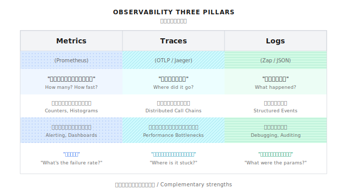

# 第 22 章：オブザーバビリティ

> **オブザーバビリティはシステムをガラス張りにする。メトリクスで性能を数値化し、トレースでボトルネックを特定し、ログで詳細を記録する。**
> **ただし、観測しすぎると代償もある。メトリクス爆発、ストレージコスト、性能オーバーヘッド。何を観測するかの選択が、観測そのものより重要だ。**

---

> **5分で要点をつかむ**
>
> 1. 三本柱の役割分担：Metrics はトレンド、Traces はリクエスト追跡、Logs は詳細
> 2. Prometheus メトリクス命名は `{システム}_{モジュール}_{アクション}_{単位}` 形式
> 3. OpenTelemetry Trace でサービス間呼び出しを串刺し、Span で各ホップを記録
> 4. 構造化ログには必ず trace_id を含める。三者の関連分析に必須
> 5. サンプリング戦略：本番環境は 10-20%、クリティカルパスは 50% まで上げてもいい
>
> **10分コース**：22.1-22.3 → 22.5 → Shannon Lab

---

月曜の朝、ユーザーからクレームが入った。「エージェント（Agent）の応答が遅くなった。先週は速かったのに」

ログを開いて 1 時間かけて調べた。

- LLM API が遅くなったのか、自分たちのコードが遅いのか？
- 全リクエストが遅いのか、特定タスクだけ遅いのか？
- Token 消費は正常か異常か？
- どのエージェントが一番時間かかってる？失敗率は？

答えは「わからない。推測するしかない」。

これがオブザーバビリティが必要な理由だ。

---

## 22.1 オブザーバビリティの三本柱



三者はそれぞれ得意分野があって、補完関係にある。

| 柱 | 強み | 弱み | 典型的な質問 |
|------|------|------|----------|
| **Metrics** | 集約、トレンド、アラート | 個別リクエストの詳細がわからない | 「失敗率は？」 |
| **Traces** | 単一リクエストの全経路 | ストレージコストが高い | 「このリクエスト、どこで詰まった？」 |
| **Logs** | 詳細なコンテキスト | 集約分析が難しい | 「エラー時のパラメータは？」 |

---

## 22.2 Prometheus メトリクス

### なぜ Prometheus なのか

- 時系列データベースで、性能メトリクスに最適
- Pull 型なので、サービス側は監視システムの存在を知らなくていい
- 強力なクエリ言語 PromQL
- エコシステムが成熟している。Grafana、Alertmanager との連携もスムーズ

### Shannon のメトリクス体系

Shannon は `go/orchestrator/internal/workflows/metrics/pattern_metrics.go` で Pattern レベルのメトリクスを定義している。

```go
package metrics

import (
    "github.com/prometheus/client_golang/prometheus"
    "github.com/prometheus/client_golang/prometheus/promauto"
)

var (
    // Pattern 実行カウンター
    PatternExecutions = promauto.NewCounterVec(
        prometheus.CounterOpts{
            Name: "shannon_pattern_executions_total",
            Help: "Total number of pattern executions by type",
        },
        []string{"pattern", "workflow_version"},
    )

    // Pattern 実行時間
    PatternDuration = promauto.NewHistogramVec(
        prometheus.HistogramOpts{
            Name:    "shannon_pattern_duration_seconds",
            Help:    "Duration of pattern executions in seconds",
            Buckets: prometheus.DefBuckets,
        },
        []string{"pattern", "workflow_version"},
    )

    // 各 Pattern のエージェント実行数
    AgentExecutionsByPattern = promauto.NewCounterVec(
        prometheus.CounterOpts{
            Name: "shannon_agents_by_pattern_total",
            Help: "Total number of agents executed by pattern type",
        },
        []string{"pattern", "workflow_version"},
    )

    // Token 使用量
    TokenUsageByPattern = promauto.NewCounterVec(
        prometheus.CounterOpts{
            Name: "shannon_tokens_by_pattern_total",
            Help: "Total tokens used by pattern type",
        },
        []string{"pattern", "workflow_version"},
    )

    // Reflection 改善回数
    ReflectionImprovements = promauto.NewCounterVec(
        prometheus.CounterOpts{
            Name: "shannon_reflection_improvements_total",
            Help: "Number of times reflection improved quality",
        },
        []string{"workflow_version"},
    )
)
```

### メトリクスの分類

完全なエージェントシステムにはどんなメトリクスが必要か？

**1. ワークフローレベルのメトリクス**

```go
// ワークフロー完了カウント
WorkflowsCompleted = promauto.NewCounterVec(
    prometheus.CounterOpts{
        Name: "shannon_workflows_completed_total",
        Help: "Total number of workflows completed",
    },
    []string{"workflow_type", "mode", "status"},  // research/react/dag, sync/async, success/failed
)

// ワークフローレイテンシ分布
WorkflowDuration = promauto.NewHistogramVec(
    prometheus.HistogramOpts{
        Name:    "shannon_workflow_duration_seconds",
        Help:    "Workflow execution duration in seconds",
        Buckets: []float64{1, 5, 10, 30, 60, 120, 300},  // 1秒から5分まで
    },
    []string{"workflow_type", "mode"},
)
```

**2. Token/コストメトリクス**

```go
// タスクごとの Token 消費
TaskTokensUsed = promauto.NewHistogram(
    prometheus.HistogramOpts{
        Name:    "shannon_task_tokens_used",
        Help:    "Number of tokens used per task",
        Buckets: []float64{100, 500, 1000, 5000, 10000, 50000},
    },
)

// コスト（ドル）
TaskCostUSD = promauto.NewHistogram(
    prometheus.HistogramOpts{
        Name:    "shannon_task_cost_usd",
        Help:    "Cost in USD per task",
        Buckets: []float64{0.001, 0.01, 0.05, 0.1, 0.5, 1, 5},
    },
)
```

**3. メモリシステムのメトリクス**

```go
// メモリ取得操作
MemoryFetches = promauto.NewCounterVec(
    prometheus.CounterOpts{
        Name: "shannon_memory_fetches_total",
        Help: "Total number of memory fetch operations",
    },
    []string{"type", "source", "result"},  // session/semantic, qdrant/redis, hit/miss
)

// 圧縮率
CompressionRatio = promauto.NewHistogram(
    prometheus.HistogramOpts{
        Name:    "shannon_compression_ratio",
        Help:    "Compression ratio (original/compressed)",
        Buckets: []float64{1.5, 2, 3, 5, 10, 20},
    },
)
```

**4. ベクトル検索のメトリクス**

```go
// ベクトル検索回数
VectorSearches = promauto.NewCounterVec(
    prometheus.CounterOpts{
        Name: "shannon_vector_search_total",
        Help: "Total number of vector searches",
    },
    []string{"collection", "status"},
)

// ベクトル検索レイテンシ
VectorSearchLatency = promauto.NewHistogramVec(
    prometheus.HistogramOpts{
        Name:    "shannon_vector_search_latency_seconds",
        Help:    "Vector search latency in seconds",
        Buckets: prometheus.DefBuckets,
    },
    []string{"collection"},
)
```

### メトリクスの記録

Shannon は `activities/metrics.go` でメトリクス記録をラップしている。

```go
// PatternMetricsInput contains pattern execution metrics
type PatternMetricsInput struct {
    Pattern      string
    Version      string
    AgentCount   int
    TokensUsed   int
    Duration     time.Duration
    Improved     bool // For reflection pattern
    WorkflowType string
}

// RecordPatternMetrics records pattern execution metrics
func RecordPatternMetrics(ctx context.Context, input PatternMetricsInput) error {
    // Record pattern execution
    metrics.RecordPatternExecution(input.Pattern, input.Version)

    // Record duration if provided
    if input.Duration > 0 {
        metrics.RecordPatternDuration(input.Pattern, input.Version, input.Duration.Seconds())
    }

    // Record agent executions
    if input.AgentCount > 0 {
        metrics.RecordAgentExecution(input.Pattern, input.Version, input.AgentCount)
    }

    // Record token usage
    if input.TokensUsed > 0 {
        metrics.RecordTokenUsage(input.Pattern, input.Version, input.TokensUsed)
    }

    // Record reflection improvement
    if input.Pattern == "reflection" && input.Improved {
        metrics.RecordReflectionImprovement(input.Version)
    }

    return nil
}
```

### Metrics サーバー

```go
go func() {
    http.Handle("/metrics", promhttp.Handler())
    port := cfg.MetricsPort(2112)
    addr := ":" + fmt.Sprintf("%d", port)
    logger.Info("Metrics server listening", zap.String("address", addr))
    if err := http.ListenAndServe(addr, nil); err != nil {
        logger.Error("Failed to start metrics server", zap.Error(err))
    }
}()
```

---

## 22.3 OpenTelemetry トレーシング

### なぜトレーシングが必要か

メトリクスは「システム全体が遅くなった」とは教えてくれる。でも「どのリクエストがどこで詰まった」かは教えてくれない。

トレーシングはこの問題を解決する。リクエストがシステムに入ってから返るまでの完全な経路を記録するんだ。

### 初期化

Shannon は `go/orchestrator/internal/tracing/tracing.go` でトレーシングを初期化している。

```go
package tracing

import (
    "context"
    "fmt"

    "go.opentelemetry.io/otel"
    "go.opentelemetry.io/otel/exporters/otlp/otlptrace/otlptracegrpc"
    "go.opentelemetry.io/otel/sdk/resource"
    "go.opentelemetry.io/otel/sdk/trace"
    "go.opentelemetry.io/otel/semconv/v1.27.0"
    oteltrace "go.opentelemetry.io/otel/trace"
    "go.uber.org/zap"
)

var tracer oteltrace.Tracer

// Config holds tracing configuration
type Config struct {
    Enabled      bool   `mapstructure:"enabled"`
    ServiceName  string `mapstructure:"service_name"`
    OTLPEndpoint string `mapstructure:"otlp_endpoint"`
}

// Initialize sets up minimal OTLP tracing
func Initialize(cfg Config, logger *zap.Logger) error {
    // Always initialize a tracer handle
    if cfg.ServiceName == "" {
        cfg.ServiceName = "shannon-orchestrator"
    }
    tracer = otel.Tracer(cfg.ServiceName)

    if !cfg.Enabled {
        logger.Info("Tracing disabled")
        return nil
    }

    if cfg.OTLPEndpoint == "" {
        cfg.OTLPEndpoint = "localhost:4317"
    }

    // Create OTLP exporter
    exporter, err := otlptracegrpc.New(
        context.Background(),
        otlptracegrpc.WithEndpoint(cfg.OTLPEndpoint),
        otlptracegrpc.WithInsecure(),
    )
    if err != nil {
        return fmt.Errorf("failed to create OTLP exporter: %w", err)
    }

    // Create resource
    res, _ := resource.New(context.Background(),
        resource.WithAttributes(
            semconv.ServiceName(cfg.ServiceName),
            semconv.ServiceVersion("1.0.0"),
        ),
    )

    // Create tracer provider
    tp := trace.NewTracerProvider(
        trace.WithBatcher(exporter),
        trace.WithResource(res),
    )

    otel.SetTracerProvider(tp)
    tracer = otel.Tracer(cfg.ServiceName)

    logger.Info("Tracing initialized", zap.String("endpoint", cfg.OTLPEndpoint))
    return nil
}
```

### Span の作成

```go
// StartSpan creates a new span with the given name
func StartSpan(ctx context.Context, spanName string) (context.Context, oteltrace.Span) {
    return tracer.Start(ctx, spanName)
}

// StartHTTPSpan creates a span for HTTP operations with method and URL
func StartHTTPSpan(ctx context.Context, method, url string) (context.Context, oteltrace.Span) {
    if tracer == nil {
        tracer = otel.Tracer("shannon-orchestrator")
    }
    spanName := fmt.Sprintf("HTTP %s", method)
    ctx, span := tracer.Start(ctx, spanName)
    span.SetAttributes(
        semconv.HTTPRequestMethodKey.String(method),
        semconv.URLFull(url),
    )
    return ctx, span
}
```

### W3C Traceparent の伝播

サービス間呼び出しでは、Trace Context を引き継ぐ必要がある。

```go
// W3CTraceparent generates a W3C traceparent header value
func W3CTraceparent(ctx context.Context) string {
    span := oteltrace.SpanFromContext(ctx)
    if !span.SpanContext().IsValid() {
        return ""
    }

    sc := span.SpanContext()
    return fmt.Sprintf("00-%s-%s-%02x",
        sc.TraceID().String(),
        sc.SpanID().String(),
        sc.TraceFlags(),
    )
}

// InjectTraceparent adds W3C traceparent header to HTTP request
func InjectTraceparent(ctx context.Context, req *http.Request) {
    if traceparent := W3CTraceparent(ctx); traceparent != "" {
        req.Header.Set("traceparent", traceparent)
    }
}
```

### サービス間トレーシングの例

```go
func (a *Activities) ExecuteAgent(ctx context.Context, input AgentExecutionInput) (...) {
    // HTTP Span を作成
    ctx, span := tracing.StartHTTPSpan(ctx, "POST", llmServiceURL)
    defer span.End()

    // リクエストを構築
    req, _ := http.NewRequestWithContext(ctx, "POST", llmServiceURL, body)

    // Trace Context を注入
    tracing.InjectTraceparent(ctx, req)

    // リクエストを実行
    resp, err := client.Do(req)

    // 結果を記録
    if err != nil {
        span.RecordError(err)
        span.SetStatus(codes.Error, err.Error())
    }

    return result, nil
}
```

こうすると、Orchestrator から LLM Service への全経路が Jaeger などのトレーシングシステムで見えるようになる。

---

## 22.4 構造化ログ

### Zap ログ設定

Shannon は Zap をログライブラリとして使っている。

```go
logger, err := zap.NewProduction()
if err != nil {
    log.Fatalf("Failed to initialize logger: %v", err)
}
defer logger.Sync()
```

### ログのベストプラクティス

**1. コンテキストを含める**

```go
// 良いログ：十分なコンテキストがある
logger.Info("Workflow started",
    zap.String("workflow_id", workflowID),
    zap.String("workflow_type", workflowType),
    zap.String("session_id", sessionID),
    zap.Int("subtasks", len(subtasks)),
)

// 悪いログ：コンテキストがない
logger.Info("Workflow started")  // どの workflow？
```

**2. エラーログは詳細に**

```go
logger.Error("Agent execution failed",
    zap.Error(err),
    zap.String("agent_id", agentID),
    zap.String("workflow_id", workflowID),
    zap.Int("attempt", attempt),
    zap.Duration("duration", duration),
)
```

**3. 性能問題は Warn で**

```go
logger.Warn("Slow LLM response",
    zap.Duration("duration", duration),
    zap.String("model", modelUsed),
    zap.Int("tokens", tokensUsed),
)
```

**4. Debug ログは量を制御**

```go
// 個別じゃなくて集約
logger.Debug("Processing items",
    zap.Int("count", len(items)),
    zap.Duration("total_duration", totalDuration),
)
```

---

## 22.5 ヘルスチェック

### ヘルスマネージャー

Shannon のヘルスチェックシステムは `go/orchestrator/internal/health/manager.go` にある。

```go
// Manager implements the HealthManager interface
type Manager struct {
    checkers      map[string]*CheckerState
    lastResults   map[string]CheckResult
    config        *HealthConfiguration
    started       bool
    checkInterval time.Duration
    stopCh        chan struct{}
    logger        *zap.Logger
    mu            sync.RWMutex
}

// CheckerState represents the runtime state of a health checker
type CheckerState struct {
    checker   Checker
    enabled   bool
    interval  time.Duration
    timeout   time.Duration
    critical  bool          // クリティカル依存 vs 非クリティカル依存
    lastCheck time.Time
}
```

キーポイントは **Critical** と **Non-Critical** を区別すること。

```go
// 全体のヘルスステータスを計算
func (m *Manager) calculateOverallStatus(components map[string]CheckResult, summary HealthSummary) OverallHealth {
    criticalFailures := 0
    nonCriticalFailures := 0
    degradedComponents := 0

    for _, result := range components {
        if result.Status == StatusUnhealthy {
            if result.Critical {
                criticalFailures++
            } else {
                nonCriticalFailures++
            }
        }
    }

    // クリティカル依存の失敗だけが Unhealthy 判定になる
    if criticalFailures > 0 {
        return OverallHealth{
            Status:  StatusUnhealthy,
            Message: fmt.Sprintf("%d critical component(s) failing", criticalFailures),
            Ready:   false,
            Live:    true,  // 生きてるけど準備ができてない
        }
    } else if nonCriticalFailures > 0 {
        return OverallHealth{
            Status:  StatusDegraded,  // 縮退モードだけど動く
            Message: fmt.Sprintf("%d non-critical component(s) failing", nonCriticalFailures),
            Ready:   true,
            Live:    true,
        }
    }
    // ...
}
```

### チェッカーの登録

```go
// ヘルスマネージャーを作成
hm := health.NewManager(logger)

// 各種チェッカーを登録
if dbClient != nil {
    dbChecker := health.NewDatabaseHealthChecker(dbClient.GetDB(), dbClient.Wrapper(), logger)
    _ = hm.RegisterChecker(dbChecker)
}

// Redis チェック
if rw := orchestratorService.SessionManager().RedisWrapper(); rw != nil {
    rc := health.NewRedisHealthChecker(rw.GetClient(), rw, logger)
    _ = hm.RegisterChecker(rc)
}

// Agent Core チェック
if agentAddr != "" {
    conn, err := grpc.Dial(agentAddr, grpc.WithTransportCredentials(insecure.NewCredentials()))
    if err == nil {
        client := agentpb.NewAgentServiceClient(conn)
        ac := health.NewAgentCoreHealthChecker(client, conn, logger)
        _ = hm.RegisterChecker(ac)
    }
}

// LLM Service チェック
lc := health.NewLLMServiceHealthChecker(llmBase, logger)
_ = hm.RegisterChecker(lc)
```

### ヘルスエンドポイント

```bash
# 生存確認（Kubernetes liveness probe 用）
GET /health/live

# 準備完了確認（Kubernetes readiness probe 用）
GET /health/ready

# 詳細ステータス
GET /health
```

レスポンス例：

```json
{
  "status": "healthy",
  "ready": true,
  "live": true,
  "checks": {
    "database": {"status": "healthy", "critical": true, "latency_ms": 5},
    "redis": {"status": "healthy", "critical": false, "latency_ms": 2},
    "llm_service": {"status": "healthy", "critical": true, "latency_ms": 150},
    "agent_core": {"status": "healthy", "critical": true, "latency_ms": 10}
  }
}
```

---

## 22.6 アラート戦略

### Prometheus Alertmanager ルール

```yaml
groups:
  - name: shannon-alerts
    rules:
      # ワークフロー失敗率が高い
      - alert: HighWorkflowFailureRate
        expr: |
          sum(rate(shannon_workflows_completed_total{status="failed"}[5m]))
          / sum(rate(shannon_workflows_completed_total[5m])) > 0.1
        for: 5m
        labels:
          severity: critical
        annotations:
          summary: "Workflow failure rate > 10%"
          description: "{{ $value | humanizePercentage }} of workflows failed in last 5m"

      # LLM レイテンシが高い
      - alert: HighLLMLatency
        expr: |
          histogram_quantile(0.95,
            sum(rate(shannon_pattern_duration_seconds_bucket{pattern="react"}[5m])) by (le)
          ) > 30
        for: 10m
        labels:
          severity: warning
        annotations:
          summary: "P95 pattern execution > 30s"

      # Token 消費が異常
      - alert: AbnormalTokenUsage
        expr: |
          sum(rate(shannon_tokens_by_pattern_total[1h])) > 1000000
        for: 1h
        labels:
          severity: warning
        annotations:
          summary: "Token consumption > 1M/hour"

      # クリティカル依存が不健全
      - alert: CriticalDependencyDown
        expr: |
          shannon_health_check_status{critical="true"} == 0
        for: 2m
        labels:
          severity: critical
        annotations:
          summary: "Critical dependency {{ $labels.component }} is down"
```

### アラートの優先度分け

| レベル | トリガー条件 | 対応時間 | 通知チャネル |
|------|----------|----------|----------|
| **Critical** | クリティカル依存ダウン、失敗率 >10% | 即時 | PagerDuty/電話 |
| **Warning** | レイテンシ上昇、非クリティカル依存の問題 | 1時間以内 | Slack |
| **Info** | リソース使用量が閾値に接近 | 翌営業日 | メール |

---

## 22.7 ダッシュボード設計

### Grafana パネルレイアウト

**概要行**
- アクティブワークフロー数（Gauge）
- 1分あたりリクエスト数（Counter rate）
- 成功率（Percentage）
- 総 Token 消費量（Counter）

**性能行**
- ワークフローレイテンシ分布（Heatmap）
- Pattern 実行時間（Histogram）
- P50/P95/P99 トレンド（Graph）

**リソース行**
- Token 消費トレンド（Graph）
- コストトレンド（Graph）
- 各 Pattern 使用分布（Pie）

**エラー行**
- エラー率時系列（Graph）
- エラータイプ分布（Pie）
- 最近のエラーリスト（Table）

### PromQL サンプル

```promql
# ワークフロー成功率
sum(rate(shannon_workflows_completed_total{status="success"}[5m]))
/ sum(rate(shannon_workflows_completed_total[5m]))

# P99 レイテンシ
histogram_quantile(0.99,
  sum(rate(shannon_workflow_duration_seconds_bucket[5m])) by (le, workflow_type)
)

# Token 消費レート（1分あたり）
sum(rate(shannon_tokens_by_pattern_total[5m])) * 60

# 各 Pattern 使用割合
sum by (pattern) (rate(shannon_pattern_executions_total[1h]))
/ sum(rate(shannon_pattern_executions_total[1h]))

# Reflection 改善率
sum(rate(shannon_reflection_improvements_total[1h]))
/ sum(rate(shannon_pattern_executions_total{pattern="reflection"}[1h]))
```

---

## 22.8 よくあるハマりどころ

### ハマり 1：メトリクス爆発（Cardinality Explosion）

```go
// ダメな例：高カーディナリティラベル
AgentExecutions.WithLabelValues(userID, taskID, timestamp)
// userID * taskID * timestamp = 無限の組み合わせ、Prometheus が OOM

// 良い例：有限カーディナリティ
AgentExecutions.WithLabelValues(agentType, mode)
// agentType * mode = 有限の組み合わせ（例：5 * 3 = 15）
```

経験則として、各メトリクスのラベル組み合わせは 1000 種類を超えないこと。

### ハマり 2：トレーシングのサンプリングミス

```go
// ダメな例：全リクエストをサンプリング（本番環境ではストレージコストが高すぎる）
tp := trace.NewTracerProvider(
    trace.WithSampler(trace.AlwaysSample()),
)

// 良い例：確率サンプリング
tp := trace.NewTracerProvider(
    trace.WithSampler(trace.TraceIDRatioBased(0.1)),  // 10% サンプリング
)

// さらに良い例：エラーリクエストは全サンプリング、正常は確率で
tp := trace.NewTracerProvider(
    trace.WithSampler(trace.ParentBased(
        trace.TraceIDRatioBased(0.1),
    )),
)
```

### ハマり 3：ログが多すぎる

```go
// ダメな例：ループ内でログ出力
for _, item := range items {
    logger.Info("Processing item", zap.String("id", item.ID))
}
// items が 10000 個あったら、10000 行ログが出る

// 良い例：バッチで集約
logger.Info("Processing items",
    zap.Int("count", len(items)),
    zap.Duration("total_duration", totalDuration),
)
```

### ハマり 4：ヘルスチェックが厳しすぎる

```go
// ダメな例：どの依存が落ちても不健全判定
if !db.Ping() || !redis.Ping() || !llm.Ping() {
    return unhealthy
}
// Redis が一時的にブレただけで、サービス全体が不健全判定されて Kubernetes にリスタートされる

// 良い例：クリティカルと非クリティカルを区別
type CheckerState struct {
    Critical bool  // Critical=true だけが全体の健全性に影響
}
// Redis はキャッシュなので、コア機能には影響しない。Non-Critical に設定
```

### ハマり 5：Trace ID との紐付けがない

```go
// ダメな例：ログとトレースが紐付かない
logger.Error("Request failed", zap.Error(err))

// 良い例：ログに Trace ID を含める
traceID := oteltrace.SpanFromContext(ctx).SpanContext().TraceID().String()
logger.Error("Request failed",
    zap.Error(err),
    zap.String("trace_id", traceID),
)
// これでログからトレース詳細にジャンプできる
```

---

## この章のまとめ

1. **三本柱の役割分担**：Metrics でトレンドを量化、Traces で個別リクエストを追跡、Logs で詳細を記録
2. **メトリクス設計**：レイヤー別に分類（ワークフロー/エージェント/メモリ/ベクトル）、ラベルのカーディナリティを制御
3. **トレース伝播**：W3C Traceparent でサービス間を引き継ぎ
4. **ヘルスチェック**：Critical と Non-Critical 依存を区別
5. **アラートの優先度**：Critical は即時対応、Warning は 1 時間以内、Info は翌営業日

---

## Shannon Lab（10分ハンズオン）

この章の概念を Shannon ソースコードで確認しよう。

### 必読（1ファイル）

- `go/orchestrator/internal/workflows/metrics/pattern_metrics.go`：Pattern レベルのメトリクス定義。命名規則とラベル設計を見てほしい

### 選読（興味に応じて2つ選択）

- `go/orchestrator/internal/tracing/tracing.go`：トレーシング初期化と W3C Traceparent 伝播
- `go/orchestrator/internal/health/manager.go`：ヘルスチェックマネージャー。Critical/Non-Critical の区別を確認

---

## 練習問題

### 練習 1：メトリクス体系を設計する

「コードレビューエージェント」のメトリクス体系を設計してみよう。以下を含めること：
- ワークフローレベルのメトリクス
- エージェントレベルのメトリクス
- LLM 呼び出しメトリクス
- コストメトリクス

メトリクス名、ラベル、タイプ（Counter/Histogram/Gauge）をリストアップすること。

### 練習 2：アラートルール

練習 1 のメトリクスに基づいて、3 つのアラートルールを設計する：
- 1 つは Critical レベル
- 1 つは Warning レベル
- 1 つは Info レベル

PromQL 式とトリガー条件を書くこと。

### 練習 3（上級）：デバッグシナリオ

ユーザーからフィードバックがあった。「昨日の午後 3 時から 4 時の間、エージェントがすごく遅かった」

以下を説明せよ：
1. まずどのメトリクスを見るか
2. メトリクスが LLM レイテンシ上昇を示していたら、次に何を調べるか
3. 具体的な遅いリクエストをどうやって見つけるか
4. 根本原因をどう特定するか

---

## さらに学ぶには

- [Prometheus Best Practices](https://prometheus.io/docs/practices/naming/)：命名規則、ラベル設計
- [OpenTelemetry Docs](https://opentelemetry.io/docs/)：サンプリング戦略、Span 設計
- [SRE Book - Monitoring](https://sre.google/sre-book/monitoring-distributed-systems/)：Google の監視経験

---

## 次章の予告

Part 7 本番アーキテクチャはこれで最後だ。三層アーキテクチャ、Temporal ワークフロー、オブザーバビリティを扱った。これらがエージェントシステムを「動かす」ための基盤になる。

Part 8 からは **エンタープライズ向け機能** に入る。

第 23 章は **Token 予算コントロール**。タスク/セッション/テナントの 3 レベルでハード制限を実装する方法を解説する。暴走したエージェントが請求書を爆発させるのを防ぐためだ。
