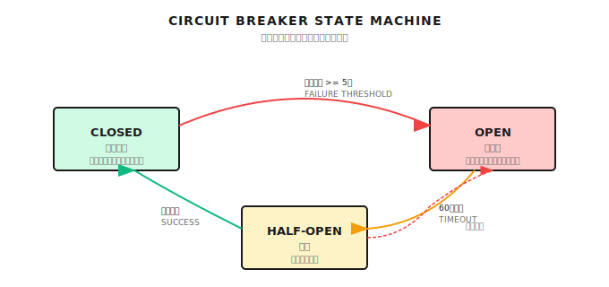
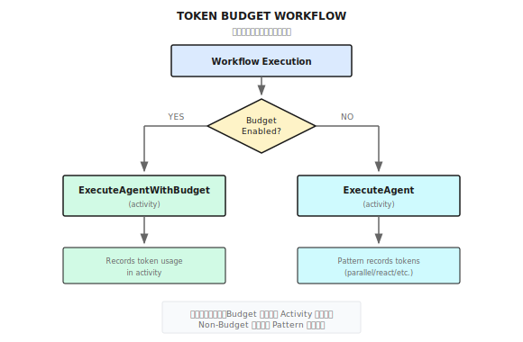

# 第 23 章：トークン予算管理

> **トークン予算はエージェント（Agent）システムのコスト防火壁だ。コスト暴走の確率を大幅に下げてくれるけど、毎回正確とは限らない。本当の防御は多層防御の組み合わせから生まれる。**

---

> **5分で核心をつかむ**
>
> 1. 三段階予算：Task（単一タスク）→ Session（セッション累計）→ Agent（個別エージェント）
> 2. ソフト/ハード制限：ソフト制限は警告して続行、ハード制限は即座に停止
> 3. 予算配分戦略：均等分配 or 複雑度による重み付け、10-20%の予備枠を確保
> 4. トークン推定には誤差がある：実際 vs 推定で20%以上ずれることも。tiktoken で精度を上げよう
> 5. 超過時の対応：直接エラーより graceful degradation が望ましい
>
> **10分コース**：23.1-23.3 → 23.6 → Shannon Lab

---

Research エージェントをデプロイして、ユーザーが「グローバルAI市場の徹底分析」を投げてきた。

翌朝、請求書を確認したら——$15。たった1つのタスクで$15。

調べてみたら、エージェントが12個の子エージェントを並列起動して、それぞれが10回LLMを呼び出していた。しかも一番高いモデルを使っていた。合計50万トークン、45分。ユーザーは$0.50くらいを想定していたのに、実際は30倍だ。

僕が初めてこの問題に遭遇したとき、正直びっくりした。当時、賢そうなマルチエージェント研究システムをローンチしたんだけど、週末を挟んで動かしたら、月の予算を超える請求書が来た。

問題はどこにあった？**予算管理がなかった。**

エージェントは勤勉だ。でも「もう十分」という概念を知らない。予算上限を教えてあげないと、ひたすら掘り下げて、考えて、呼び出し続ける——タスクが完了するか、お金がなくなるまで。

この章でその問題を解決しよう。

---

## 23.1 なぜトークン予算が必要なのか？

### 暴走するとどうなる

予算管理がないとこうなる：

| 問題 | 影響 | 実例 |
|------|------|------|
| 単発タスクのコスト暴走 | 1タスクで$15、想定は$0.50 | Research エージェントの無限再帰検索 |
| 月次請求のショック | $5000、想定は$500 | バッチタスクに上限がなかった |
| 運用コストが予測不能 | 財務計画が困難 | 顧客への見積もりが出せない |
| UXの悪化 | 待ち時間45分 vs 想定5分 | ユーザーはシステムがフリーズしたと思う |
| 連鎖障害 | 1タスクがシステム全体を巻き込む | 共有リソースが枯渇 |

### 三段階予算管理

正直なところ、予算を1つの数字で管理するだけでは足りない。会社の財務管理と同じだ——年間予算だけじゃなく、四半期予算、プロジェクト予算、出張予算まで必要でしょ。

エージェントシステムも同じで、多層の予算管理が必要になる：

| レベル | 管理対象 | デフォルト値 | 用途 |
|--------|----------|--------------|------|
| Task | 単一タスク | 10K tokens | 単発タスクの暴走防止 |
| Session | セッション累計 | 50K tokens | インタラクションコストの管理 |
| Agent | 個別エージェント | タスクから分配 | リソースの公平な分配 |

なぜ三段階なのか？

- **Task レベル**：「1人のユーザーが1つの異常なタスクでシステムを落とす」のを防ぐ
- **Session レベル**：「1人のユーザーが小さいタスクをたくさん投げて巨額の請求になる」のを防ぐ
- **Agent レベル**：「マルチエージェント連携で1つのエージェントが予算を独占する」のを防ぐ

この3つが連携することで、会社の財務における三重防衛——部門予算、プロジェクト予算、人員予算——と同じ効果を発揮する。

---

## 23.2 コアデータ構造

### TokenBudget

これは Shannon で予算を管理する中核構造だ。念のため言っておくと、これは典型的な実装例であって、唯一の設計じゃない。

```go
type TokenBudget struct {
    // Task レベル予算
    TaskBudget     int `json:"task_budget"`
    TaskTokensUsed int `json:"task_tokens_used"`

    // Session レベル予算
    SessionBudget     int `json:"session_budget"`
    SessionTokensUsed int `json:"session_tokens_used"`

    // コスト追跡
    EstimatedCostUSD float64 `json:"estimated_cost_usd"`
    ActualCostUSD    float64 `json:"actual_cost_usd"`

    // 実行ポリシー
    HardLimit        bool    `json:"hard_limit"`        // 超過時に即座に終了
    WarningThreshold float64 `json:"warning_threshold"` // 警告閾値（0.8 = 80%）
    RequireApproval  bool    `json:"require_approval"`  // 超過時に承認待ち
}
```

3つの実行モードがあり、それぞれ異なるビジネスシナリオに対応する：

| モード | 動作 | 適用シナリオ |
|--------|------|--------------|
| `HardLimit` | 超過で即座に終了 | コスト重視のバッチタスク |
| `WarningThreshold` | 80%で警告 | インタラクティブなタスク、ユーザーに反応時間を与える |
| `RequireApproval` | 超過時に一時停止 | 高価値タスク、人間の判断が必要 |

### BudgetTokenUsage

各トークン使用の詳細を記録する構造体だ。ここで重要なのは `IdempotencyKey` というフィールド——後でこれがどれだけ重要か詳しく説明する。

```go
type BudgetTokenUsage struct {
    ID             string  `json:"id"`
    UserID         string  `json:"user_id"`
    SessionID      string  `json:"session_id"`
    TaskID         string  `json:"task_id"`
    AgentID        string  `json:"agent_id"`
    Model          string  `json:"model"`
    Provider       string  `json:"provider"`
    InputTokens    int     `json:"input_tokens"`
    OutputTokens   int     `json:"output_tokens"`
    TotalTokens    int     `json:"total_tokens"`
    CostUSD        float64 `json:"cost_usd"`
    IdempotencyKey string  `json:"idempotency_key,omitempty"`
}
```

---

## 23.3 BudgetManager の実装

### コア構造

Shannon では、BudgetManager が予算管理の中枢だ。3つのことを管理する：予算チェック、バックプレッシャー制御、サーキットブレーカー。

以下のコードは Shannon の `go/orchestrator/internal/budget/` ディレクトリを参考にしている：

```go
type BudgetManager struct {
    db     *sql.DB
    logger *zap.Logger

    // アクティブセッションのメモリキャッシュ
    sessionBudgets map[string]*TokenBudget
    userBudgets    map[string]*TokenBudget
    mu             sync.RWMutex

    // デフォルト予算
    defaultTaskBudget    int  // 10K tokens
    defaultSessionBudget int  // 50K tokens

    // バックプレッシャー制御
    backpressureThreshold float64  // 80% で発動
    maxBackpressureDelay  int      // 最大遅延 ms

    // レート制限
    rateLimiters map[string]*rate.Limiter

    // サーキットブレーカー
    circuitBreakers map[string]*CircuitBreaker

    // 冪等性追跡
    processedUsage map[string]bool
    idempotencyMu  sync.RWMutex
}
```

複雑に見えるけど、本質は3層だけだ：

1. **予算層**：`sessionBudgets` + `userBudgets`
2. **保護層**：`rateLimiters` + `circuitBreakers`
3. **監査層**：`processedUsage`（重複課金を防ぐ）

### 予算チェック

予算チェックのコアロジックは Shannon の実装を参考にしている：

```go
func (bm *BudgetManager) CheckBudget(ctx context.Context,
    userID, sessionID, taskID string, estimatedTokens int) (*BudgetCheckResult, error) {

    // Phase 1: 読み取りロックで既存の予算をチェック
    bm.mu.RLock()
    userBudget, userExists := bm.userBudgets[userID]
    sessionBudget, sessionExists := bm.sessionBudgets[sessionID]
    bm.mu.RUnlock()

    // Phase 2: 存在しなければデフォルト予算を作成（Double-check locking）
    if !userExists || !sessionExists {
        bm.mu.Lock()
        // Double-check で競合を防ぐ
        if !sessionExists {
            sessionBudget = &TokenBudget{
                TaskBudget:       bm.defaultTaskBudget,
                SessionBudget:    bm.defaultSessionBudget,
                HardLimit:        false,
                WarningThreshold: 0.8,
            }
            bm.sessionBudgets[sessionID] = sessionBudget
        }
        bm.mu.Unlock()
    }

    result := &BudgetCheckResult{
        CanProceed:      true,
        RequireApproval: false,
        Warnings:        []string{},
    }

    // Task レベルの予算をチェック
    if taskTokensUsed+estimatedTokens > taskBudget {
        if hardLimit {
            result.CanProceed = false
            result.Reason = fmt.Sprintf("Task budget exceeded: %d/%d tokens",
                taskTokensUsed+estimatedTokens, taskBudget)
        } else {
            result.RequireApproval = requireApproval
            result.Warnings = append(result.Warnings, "Task budget will be exceeded")
        }
    }

    return result, nil
}
```

設計のポイント：

1. **Double-check locking**：まず読み取りロックでチェック、なければ書き込みロックで作成。高並行シナリオの標準パターンだ
2. **事前警告**：閾値に達したらイベントを発行、超過してから通知するのでは遅い
3. **柔軟な実行**：ハード制限/ソフト制限/承認待ちの3モード

---

## 23.4 バックプレッシャー制御

### バックプレッシャーとは

これは予算管理で最もエレガントな設計だと思う。

従来のやり方：予算がなくなった？リクエストを拒否。UXがひどい——1秒前まで使えたのに、次の瞬間使えなくなる。

バックプレッシャーのやり方：予算が尽きそう？**徐々に実行速度を落とす**。ユーザーに反応時間を与え、システムにも余裕を持たせる。

高速道路と同じだ——渋滞してきたら入口を閉鎖するんじゃなく、信号で車の流れを調整する。

```
予算使用率 → 遅延戦略
─────────────────────
< 80%     → 遅延なし（快適）
80-85%    → 50ms（軽い減速）
85-90%    → 300ms（明らかな減速）
90-95%    → 750ms（大幅な減速）
95-100%   → 1500ms（深刻な渋滞）
>= 100%   → 5000ms（最大遅延）
```

### 実装

```go
func (bm *BudgetManager) CheckBudgetWithBackpressure(
    ctx context.Context, userID, sessionID, taskID string, estimatedTokens int,
) (*BackpressureResult, error) {

    // まず通常の予算チェック
    baseResult, err := bm.CheckBudget(ctx, userID, sessionID, taskID, estimatedTokens)
    if err != nil {
        return nil, err
    }

    result := &BackpressureResult{
        BudgetCheckResult: baseResult,
    }

    // 使用率を計算（新規トークンの推定を含む）
    projectedUsage := sbTokensUsed + estimatedTokens
    usagePercent := float64(projectedUsage) / float64(sbBudgetLimit)

    // 閾値を超えたらバックプレッシャーを有効化
    if usagePercent >= bm.backpressureThreshold {
        result.BackpressureActive = true
        result.BackpressureDelay = bm.calculateBackpressureDelay(usagePercent)
    }

    result.BudgetPressure = bm.calculatePressureLevel(usagePercent)
    return result, nil
}

func (bm *BudgetManager) calculateBackpressureDelay(usagePercent float64) int {
    if usagePercent >= 1.0 {
        return bm.maxBackpressureDelay
    } else if usagePercent >= 0.95 {
        return 1500
    } else if usagePercent >= 0.9 {
        return 750
    } else if usagePercent >= 0.85 {
        return 300
    } else if usagePercent >= 0.8 {
        return 50
    }
    return 0
}
```

### Workflow 層でのバックプレッシャー適用

ここで重要なポイントがある：**遅延は Workflow 層でやらなければならない、Activity 層ではダメ**。

```go
func BudgetPreflight(ctx workflow.Context, input TaskInput, estimatedTokens int) (*budget.BackpressureResult, error) {
    actx := workflow.WithActivityOptions(ctx, workflow.ActivityOptions{
        StartToCloseTimeout: 30 * time.Second,
    })

    var res budget.BackpressureResult
    err := workflow.ExecuteActivity(actx,
        constants.CheckTokenBudgetWithBackpressureActivity,
        activities.BudgetCheckInput{
            UserID:          input.UserID,
            SessionID:       input.SessionID,
            TaskID:          workflow.GetInfo(ctx).WorkflowExecution.ID,
            EstimatedTokens: estimatedTokens,
        }).Get(ctx, &res)

    if err != nil {
        return nil, err
    }

    // 重要：Workflow 層で Sleep、Activity 層ではダメ！
    if res.BackpressureActive && res.BackpressureDelay > 0 {
        logger.Info("Applying budget backpressure delay",
            "delay_ms", res.BackpressureDelay,
            "pressure_level", res.BudgetPressure,
        )
        if err := workflow.Sleep(ctx, time.Duration(res.BackpressureDelay)*time.Millisecond); err != nil {
            return nil, err
        }
    }

    return &res, nil
}
```

なぜ Workflow 層で Sleep しなきゃいけないのか？

| どこで Sleep するか | 結果 |
|---------------------|------|
| Activity 層で `time.Sleep` | Worker スレッドをブロック、Worker 数は有限、すぐに枯渇 |
| Workflow 層で `workflow.Sleep` | 決定論的、Temporal のリプレイをサポート、キャンセル可能 |

これは僕が見てきた中で最もよくあるハマりポイントの1つだ。多くの人が最初に Activity で Sleep しようとして、Worker が全部ブロックされてシステムがダウンする。

---

## 23.5 サーキットブレーカーパターン

### 設計

バックプレッシャーは「減速」、サーキットブレーカーは「緊急ブレーキ」だ。

あるユーザーが連続して予算超過を引き起こしている場合、ユーザーが悪用しているか、システムにバグがあるかのどちらかだ。どちらにせよ、リクエストを受け続けるのは良くない。

```go
type CircuitBreaker struct {
    failureCount    int32
    lastFailureTime time.Time
    state           string // "closed", "open", "half-open"
    config          CircuitBreakerConfig
    successCount    int32
    mu              sync.RWMutex
}

type CircuitBreakerConfig struct {
    FailureThreshold int           // サーキットブレーカー発動までの失敗回数
    ResetTimeout     time.Duration // 発動後、復帰を試みるまでの時間
    HalfOpenRequests int           // 半開状態で許可するテストリクエスト数
}
```

### 状態遷移



このパターンはマイクロサービス領域の古典的な設計だ。Netflix の Hystrix が有名にしたけど、今では分散システムの標準装備と言っていい。

### 実装

```go
func (bm *BudgetManager) CheckBudgetWithCircuitBreaker(
    ctx context.Context, userID, sessionID, taskID string, estimatedTokens int,
) (*BackpressureResult, error) {

    // まずサーキットブレーカーの状態をチェック
    state := bm.GetCircuitState(userID)
    if state == "open" {
        return &BackpressureResult{
            BudgetCheckResult: &BudgetCheckResult{
                CanProceed: false,
                Reason:     "Circuit breaker is open due to repeated failures",
            },
            CircuitBreakerOpen: true,
        }, nil
    }

    // 半開状態では限られたリクエストのみ許可
    if state == "half-open" {
        cb := bm.circuitBreakers[userID]
        if int(atomic.LoadInt32(&cb.successCount)) >= cb.config.HalfOpenRequests {
            return &BackpressureResult{
                BudgetCheckResult: &BudgetCheckResult{
                    CanProceed: false,
                    Reason:     "Circuit breaker in half-open state, test quota exceeded",
                },
                CircuitBreakerOpen: true,
            }, nil
        }
    }

    return bm.CheckBudgetWithBackpressure(ctx, userID, sessionID, taskID, estimatedTokens)
}
```

---

## 23.6 コスト計算

### 入力/出力を分けて課金

これは僕が踏んだ大きな落とし穴だ。

最初は「総トークン数 x 単価」でコストを計算していた。すると請求書と実際の差が30%もあった。

理由：モデルによって入力と出力の価格差が大きい。

| モデル | Input/1K | Output/1K | 比率 |
|--------|----------|-----------|------|
| GPT-4 | $0.03 | $0.06 | 1:2 |
| Claude Sonnet | $0.003 | $0.015 | 1:5 |

出力トークンは通常、入力の2-5倍高い。合算で課金すると、入力価格を使えば過小評価、出力価格を使えば過大評価になる。

> LLM の価格は頻繁に変わる。上記は参考程度に。具体的な価格は各プロバイダーの公式ページを確認してほしい。

### 価格設定

Shannon は YAML 設定で価格を管理している。価格が変わっても設定を更新するだけで済む：

```yaml
# config/models.yaml
pricing:
  defaults:
    combined_per_1k: 0.005

  models:
    openai:
      gpt-4o:
        input_per_1k: 0.0025
        output_per_1k: 0.010
      gpt-4o-mini:
        input_per_1k: 0.00015
        output_per_1k: 0.0006
    anthropic:
      claude-sonnet-4:
        input_per_1k: 0.003
        output_per_1k: 0.015
```

### 計算ロジック

Shannon の価格計算は `go/orchestrator/internal/pricing/pricing.go` を参照：

```go
func CostForSplit(model string, inputTokens, outputTokens int) float64 {
    if inputTokens < 0 {
        inputTokens = 0
    }
    if outputTokens < 0 {
        outputTokens = 0
    }

    cfg := get()
    for _, models := range cfg.Pricing.Models {
        if m, ok := models[model]; ok {
            in := m.InputPer1K
            out := m.OutputPer1K
            if in > 0 && out > 0 {
                return (float64(inputTokens)/1000.0)*in +
                       (float64(outputTokens)/1000.0)*out
            }
        }
    }
    // デフォルト価格にフォールバック
    return float64(inputTokens+outputTokens) * DefaultPerToken()
}
```

---

## 23.7 冪等性：リトライによる重複課金を防ぐ

トークン予算で最も見落とされがちだけど、最も致命的な問題だと思う。

### 問題のシナリオ

Temporal のコア機能の1つは自動リトライだ。Activity が失敗した？自動リトライ。ネットワークの揺らぎ？自動リトライ。

でも、「トークン使用量を記録する」Activity が成功したのに、結果を返す途中でネットワークが切れたら、Temporal は失敗と判断してリトライする。

結果：同じ LLM 呼び出しが2回記録される。請求書が2倍になる。

### 解決策

Shannon は IdempotencyKey で重複課金を防いでいる。`go/orchestrator/internal/activities/budget.go` を参照：

```go
func (b *BudgetActivities) RecordTokenUsage(ctx context.Context, input TokenUsageInput) error {
    // Activity 情報を取得して冪等キーを生成
    info := activity.GetInfo(ctx)

    // 冪等キーを生成：WorkflowID + ActivityID + 試行回数
    // これで同じ Activity のリトライは同じキーになる
    idempotencyKey := fmt.Sprintf("%s-%s-%d",
        info.WorkflowExecution.ID, info.ActivityID, info.Attempt)

    usage := &budget.BudgetTokenUsage{
        UserID:         input.UserID,
        // ... 他のフィールド ...
        IdempotencyKey: idempotencyKey,
    }

    err := b.budgetManager.RecordUsage(ctx, usage)
    // RecordUsage は内部で IdempotencyKey の存在をチェックし、存在すればスキップ
    return err
}
```

ポイント：

- `IdempotencyKey = WorkflowID + ActivityID + Attempt`
- Temporal がリトライしても同じキーが生成される
- `RecordUsage` が重複キーを検出したらスキップ

---

## 23.8 予算を意識したエージェント実行

ここまで説明したコンポーネントを全部つなげて、予算を意識した完全な実行フローを見てみよう。

以下は Shannon の `go/orchestrator/internal/activities/budget.go` にある `ExecuteAgentWithBudget` 関数を参考にしている：

```go
func (b *BudgetActivities) ExecuteAgentWithBudget(ctx context.Context,
    input BudgetedAgentInput) (*AgentExecutionResult, error) {

    // 1. 実行前に予算をチェック
    budgetCheck, err := b.budgetManager.CheckBudget(
        ctx,
        input.UserID,
        input.AgentInput.SessionID,
        input.TaskID,
        input.MaxTokens,
    )
    if err != nil {
        return nil, fmt.Errorf("budget check failed: %w", err)
    }

    if !budgetCheck.CanProceed {
        return &AgentExecutionResult{
            AgentID: input.AgentInput.AgentID,
            Success: false,
            Error:   fmt.Sprintf("Budget exceeded: %s", budgetCheck.Reason),
        }, nil
    }

    // 2. エージェントを実行
    input.AgentInput.Context["max_tokens"] = input.MaxTokens
    input.AgentInput.Context["model_tier"] = input.ModelTier
    result, err := executeAgentCore(ctx, input.AgentInput, logger)
    if err != nil {
        return nil, fmt.Errorf("agent execution failed: %w", err)
    }

    // 3. 冪等キーを生成、リトライによる重複課金を防ぐ
    info := activity.GetInfo(ctx)
    idempotencyKey := fmt.Sprintf("%s-%s-%d",
        info.WorkflowExecution.ID, info.ActivityID, info.Attempt)

    // 4. 実際の使用量を記録
    err = b.budgetManager.RecordUsage(ctx, &budget.BudgetTokenUsage{
        UserID:         input.UserID,
        SessionID:      input.AgentInput.SessionID,
        TaskID:         input.TaskID,
        AgentID:        input.AgentInput.AgentID,
        Model:          result.ModelUsed,
        Provider:       result.Provider,
        InputTokens:    result.InputTokens,
        OutputTokens:   result.OutputTokens,
        IdempotencyKey: idempotencyKey,
    })

    return &result, nil
}
```

このフローは予算管理の完全なライフサイクルをカバーしている：チェック → 実行 → 記録。

---

## 23.9 デュアルパス記録：重複を避ける

Shannon の重要な設計の1つが「デュアルパス記録」だ——予算が有効かどうかで、どこでトークン使用量を記録するかを決める。

Shannon の `docs/token-budget-tracking.md` ドキュメントによると：



なぜこんな設計なのか？区別しないと**重複記録が発生する**から：

| シナリオ | Activity で記録 | Pattern で記録 | 結果 |
|----------|-----------------|----------------|------|
| 予算有効 | する | する | 重複！ |
| 予算有効 | する | しない（Guard） | 正しい |
| 予算無効 | しない | する | 正しい |

Shannon の解決策は Pattern 層に Guard を入れること：

```go
// Pattern 層の記録ロジック
if budgetPerAgent <= 0 {  // 予算が無効のときだけ記録
    _ = workflow.ExecuteActivity(ctx, constants.RecordTokenUsageActivity, ...)
}
```

---

## 23.10 設定とモニタリング

### 設定

```yaml
# config/shannon.yaml
session:
  token_budget_per_task: 10000
  token_budget_per_session: 50000

budget:
  backpressure:
    threshold: 0.8
    max_delay_ms: 5000

  circuit_breaker:
    failure_threshold: 5
    reset_timeout: "5m"
    half_open_requests: 3
```

### モニタリング指標

| 指標 | タイプ | 説明 |
|------|--------|------|
| `budget_tokens_used` | Counter | 使用済みトークン |
| `budget_cost_usd` | Counter | 累計コスト |
| `budget_exceeded_total` | Counter | 超過回数 |
| `backpressure_delay_seconds` | Histogram | バックプレッシャー遅延の分布 |
| `circuit_breaker_state` | Gauge | サーキットブレーカー状態（0=closed, 1=half-open, 2=open） |

### アラートルール

```yaml
- alert: BudgetExceededRate
  expr: rate(budget_exceeded_total[5m]) > 0.1
  for: 5m
  labels:
    severity: warning
  annotations:
    summary: "High budget exceeded rate"
    description: "More than 10% of requests are exceeding budget"

- alert: CircuitBreakerOpen
  expr: circuit_breaker_state == 2  # 2 = open
  for: 1m
  labels:
    severity: critical
  annotations:
    summary: "Circuit breaker open for user {{ $labels.user_id }}"
```

---

## 23.11 よくあるハマりポイント

### ハマり 1：冪等性の忘却

```go
// ダメ：リトライごとに記録される
err = bm.RecordUsage(ctx, &budget.BudgetTokenUsage{
    TaskID: taskID,
    // IdempotencyKey がない！
})

// OK：Activity 情報で冪等キーを生成
info := activity.GetInfo(ctx)
idempotencyKey := fmt.Sprintf("%s-%s-%d",
    info.WorkflowExecution.ID, info.ActivityID, info.Attempt)
```

このハマりは何度も見てきた。3ヶ月間問題なく動いていたシステムが、ある日ネットワークの揺らぎが頻発して、突然請求書が2倍になった。

### ハマり 2：Activity 層での Sleep

```go
// ダメ：Worker スレッドをブロック
func (b *BudgetActivities) CheckWithBackpressure(...) {
    if delay > 0 {
        time.Sleep(time.Duration(delay) * time.Millisecond) // ブロック！
    }
}

// OK：Workflow 層で workflow.Sleep を使う
if res.BackpressureDelay > 0 {
    workflow.Sleep(ctx, time.Duration(res.BackpressureDelay)*time.Millisecond)
}
```

Worker スレッドは有限だ。Activity で Sleep すると、遅延されたリクエストごとに1つの Worker スレッドを占有する。予算が逼迫しているときこそバックプレッシャーが頻繁に発動するときで、まさに Worker が枯渇しやすいタイミングだ。

### ハマり 3：予算の並行更新

```go
// ダメ：読んでから書くと競合が起きる
sessionBudget := bm.sessionBudgets[sessionID]
sessionBudget.TaskTokensUsed += tokens  // 安全じゃない！

// OK：ロックを取って更新
bm.mu.Lock()
if sessionBudget, ok := bm.sessionBudgets[sessionID]; ok {
    sessionBudget.TaskTokensUsed += tokens
}
bm.mu.Unlock()
```

### ハマり 4：総量だけ見て比率を見ない

```go
// ダメ：使った量だけを見る
if sessionBudget.TaskTokensUsed > 10000 {
    // 予算超過
}

// OK：比率を計算、動的予算に対応
usagePercent := float64(sessionBudget.TaskTokensUsed) / float64(sessionBudget.TaskBudget)
if usagePercent >= 0.8 {
    // 予算に近づいている
}
```

絶対値で判断する問題は、ユーザーごとに予算が違う可能性があること。VIP ユーザーは 100K トークン、一般ユーザーは 10K トークンかもしれない。絶対値で判断すると、VIP ユーザーが 10K で制限されてしまう。

---

## 23.12 フレームワーク比較

トークン予算管理は Shannon 独自のコンセプトじゃない。他のフレームワークはどうやっているか？

| フレームワーク | 予算管理方式 | バックプレッシャー | サーキットブレーカー | 冪等性 |
|----------------|--------------|--------------------|--------------------|--------|
| **Shannon** | 三段階予算 | 内蔵 | 内蔵 | IdempotencyKey |
| **LangChain** | Callback で手動実装 | なし | なし | なし |
| **LangGraph** | State で実装可能 | 自分で書く | 自分で書く | 自分で書く |
| **CrewAI** | max_rpm/max_tokens | 限定的 | なし | なし |
| **AutoGen** | 内蔵なし | なし | なし | なし |

正直に言うと、これは Shannon がうまくやっている部分だ。多くのフレームワークは予算管理を「ユーザーが自分で解決すること」として扱っているけど、本番環境ではまさにここが一番問題が起きやすいところなんだよね。

---

## この章で話したこと

1. **三段階予算**：Task/Session/Agent の階層管理、会社の財務における三重防衛と同じ
2. **バックプレッシャー**：上限に近づいたら直接拒否せず徐々に減速、ユーザーとシステムに余裕を与える
3. **サーキットブレーカー**：連続超過時に一時的に拒否、連鎖障害を防ぐ
4. **冪等性**：IdempotencyKey で Temporal のリトライによる重複課金を防ぐ
5. **分離課金**：入力/出力トークンを別々に計算、より正確な見積もり

---

## Shannon Lab（10分で始める）

このセクションでは、10分でこの章のコンセプトを Shannon のソースコードに対応させる。

### 必読（1ファイル）

- `go/orchestrator/internal/activities/budget.go`：`ExecuteAgentWithBudget` 関数の予算チェック → 実行 → 記録のフローを見る。`idempotencyKey` の生成ロジックと Activity 層で Sleep してはいけない理由を理解する

### 選読で深掘り（2つ、興味に応じて）

- `docs/token-budget-tracking.md`：デュアルパス記録の設計思想を理解する。"Guard Pattern" を検索して、各 Workflow Pattern がどう重複記録を避けているか見る
- `go/orchestrator/internal/pricing/pricing.go`：`CostForSplit` 関数を見て、なぜ input/output を分けて課金するのか、フォールバックロジックを理解する

---

## 演習

### 演習 1：予算超過時のユーザー通知を設計する

ユーザーのタスクが予算上限に近づいている（80%）。通知メッセージを設計してほしい。以下を含めること：
- 現在の使用量と予算上限
- 何ができて何ができないか
- ユーザーが取れるアクション

### 演習 2：ソースコード理解

Shannon の `go/orchestrator/internal/activities/budget.go` を読んで：
1. `ExecuteAgentWithBudget` 関数を見つけて、なぜ実行後に使用量を記録するのか（実行前ではなく）を説明する
2. エージェントの実行が失敗した場合、トークン使用量は記録されるか？それは妥当か？

### 演習 3（発展）：「動的予算調整」機能を設計する

シナリオ：VIP ユーザーは月初は予算に余裕があるけど、月末は逼迫する。「動的予算」の仕組みを設計してほしい：
- コアデータ構造を書く
- 予算調整のトリガー条件を説明する
- 考慮点：実行中のタスクが突然「予算を下げられた」らどうする？

---

## 参考資料

- **Temporal リトライメカニズム**：[Temporal Retry Policies](https://docs.temporal.io/retry-policies) - なぜ冪等性が必要かを理解する
- **サーキットブレーカーパターン**：[マイクロサービスのサーキットブレーカー](https://martinfowler.com/bliki/CircuitBreaker.html) - Martin Fowler の古典的な記事
- **各 LLM プロバイダーの価格ページ**：価格は頻繁に変わるので、定期的にチェックして設定を更新しよう

---

## 次章の予告

トークン予算は「いくら使うか」の問題を解決した。でももう1つ問題がある：**誰が何をできるか？**

あるエージェントがどのツールを呼べるか？どのデータにアクセスできるか？どの操作を実行できるか？これは予算の問題じゃなく、権限の問題だ。

次の章では **OPA ポリシーガバナンス**について話す——Open Policy Agent を使った細かいアクセス制御の実装だ。

こう考えてみてほしい：ユーザーが「テストデータを全部消して」と言う。エージェントはまずチェックすべきだ：このユーザーには削除権限があるか？この操作は承認が必要か？この時間帯に実行していいのか？

これらの問いに、OPA が答える。

また次の章で。
