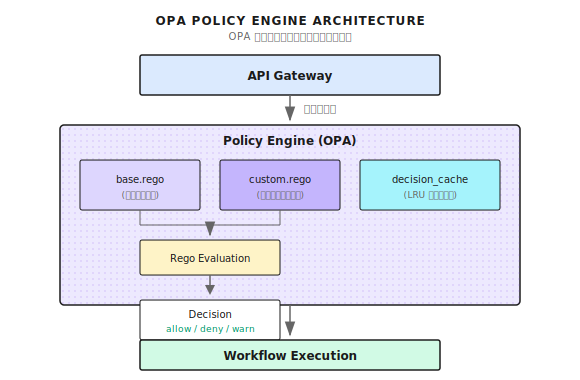

# 第 24 章：ポリシーガバナンス（OPA）

> **OPA を使うと、エージェント（Agent）システムの権限制御がハードコードから宣言的なスタイルに変わる。ポリシー更新にコード再デプロイは不要だ。ただし、万能じゃない。本当のセキュリティは多層防御から生まれるんだよね。**

---

> **5 分で核心をつかむ**
>
> 1. OPA はセキュリティルールをコードから分離する。ポリシー変更にデプロイ不要
> 2. デフォルト拒否 + deny 優先：マッチしないリクエストは拒否、deny ルールが最優先
> 3. カナリアリリース：まず dry-run で様子見、次に割合を上げながら enforce
> 4. 判定結果をキャッシュ。キャッシュキーには判定に影響する全フィールドを含めること
> 5. 本番では FailOpen が FailClosed より向いている（アラートと組み合わせて）
>
> **10 分コース**：24.1-24.3 → 24.6 → Shannon Lab

---

あなたのエージェントシステムに「password を含むクエリを禁止」というルールを追加したいとする。

どうする？コードを変更して `if strings.Contains(req.Query, "password")` を追加、そしてデプロイ。

一週間後、セキュリティチームがさらに 10 個のルールを追加したいと言ってきた。またコード変更、またデプロイ。

一ヶ月後、コードのあちこちに if-else が散らばって、「なぜこのリクエストが拒否されたのか」誰も説明できない状態に。ルール変更のたびにフル CI/CD を回す必要があって、緊急のセキュリティ修正が反映されるまで 2 時間かかる。

僕が見た中で一番ひどいケースはね、200 個以上のセキュリティチェックポイントが 30 以上のファイルに散らばってたんだ。新人エンジニアがルールを 1 つ追加しようとして、変更が必要な箇所を全部見つけるのに 3 日かかった。

**これがハードコードされたポリシーの罠だ。**

---

## 24.1 なぜポリシーエンジンが必要なのか？

### ハードコードの罠

ハードコードと OPA 宣言的ポリシーを比べてみよう：

```go
// ========== 従来のやり方：ハードコードされたセキュリティチェック ==========
func SubmitTask(ctx context.Context, req *TaskRequest) error {
    if strings.Contains(req.Query, "password") { return errors.New("forbidden") }
    if req.TokenBudget > 10000 { return errors.New("budget too high") }
    if req.UserID == "blocked_user" { return errors.New("user blocked") }
    // さらに if-else が続く... 50 行後にはなぜこのチェックが必要だったか忘れてる
}
```

```rego
# ========== OPA のやり方：宣言的ポリシーファイル ==========
package shannon.task

deny["dangerous pattern"] { contains(lower(input.query), "password") }
deny["budget too high"]   { input.token_budget > 10000 }
deny["user blocked"]      { blocked_users[input.user_id] }
```

| 比較項目 | ハードコード | OPA |
|----------|--------------|-----|
| ポリシー変更 | コード変更 → テスト → デプロイ | .rego 変更 → ホットリロード |
| ルールの場所 | あちこちに散在 | policies/ に集約 |
| 監査証跡 | なし | 判定ごとにログ |
| リリース方式 | 全量 | カナリア/Dry-run 対応 |
| バージョン管理 | なし | hash でバージョン管理 |

---

## 24.2 OPA 統合アーキテクチャ

### ポリシー実行フロー

Shannon では、OPA は独立したポリシーエンジンとして、リクエストが Workflow に入る前に評価を行う：



### コアコンポーネント

| コンポーネント | 役割 |
|----------------|------|
| OPAEngine | ポリシーのロード、コンパイル、評価のメインエントリ |
| PolicyInput | 評価のコンテキストデータ（ユーザー、クエリ、予算など） |
| Decision | 評価結果（allow/deny + 理由） |
| base.rego | 基本セキュリティポリシー（デフォルト拒否、deny 優先） |

---

## 24.3 OPAEngine の実装

### Engine インターフェース

Shannon の OPA Engine 設計は `go/orchestrator/internal/policy/` ディレクトリを参考にしている：

```go
type Engine interface {
    Evaluate(ctx context.Context, input *PolicyInput) (*Decision, error)
    LoadPolicies() error
    IsEnabled() bool
    Environment() string
    Mode() Mode
}
```

シンプルなインターフェースの裏には、いくつかの重要な設計判断がある：

1. **プリコンパイル**：ポリシーは起動時にコンパイルされ、評価時は直接実行
2. **キャッシュ**：同じ入力の判定結果はキャッシュされる
3. **モード切替**：off/dry-run/enforce の 3 モードをサポート

### コアデータ構造

```go
// ========== PolicyInput：評価コンテキスト ==========
type PolicyInput struct {
    SessionID   string    `json:"session_id"`        // セッション識別子
    UserID      string    `json:"user_id"`           // ユーザー識別子
    AgentID     string    `json:"agent_id"`          // エージェント識別子
    Query       string    `json:"query"`             // リクエスト内容
    Mode        string    `json:"mode"`              // simple/standard/complex
    Environment string    `json:"environment"`       // dev/staging/prod（重要：環境で厳しさを変える）
    TokenBudget int       `json:"token_budget"`      // 予算制限
    Timestamp   time.Time `json:"timestamp"`
}

// ========== Decision：評価結果 ==========
type Decision struct {
    Allow           bool              `json:"allow"`            // 許可するか
    Reason          string            `json:"reason"`           // 判定理由
    RequireApproval bool              `json:"require_approval"` // 人間の承認が必要（許可だが確認必要）
    PolicyVersion   string            `json:"policy_version"`   // ポリシーバージョン hash（監査用）
    AuditTags       map[string]string `json:"audit_tags"`       // 監査タグ
}
```

`Environment` フィールドがあれば「開発環境は緩く、本番は厳しく」というポリシーが書ける。`RequireApproval` は「許可するけど人間の承認が必要」というシナリオをサポートする。

---

## 24.4 ポリシーのロードとコンパイル

以下のコードはポリシーロードの核心フローを示している。Shannon の実装を参考にしたものだ：

```go
func (e *OPAEngine) LoadPolicies() error {
    if !e.config.Enabled {
        return nil
    }

    policies := make(map[string]string)

    // 再帰的に全 .rego ファイルをロード
    err := filepath.Walk(e.config.Path, func(path string, info os.FileInfo, err error) error {
        if err != nil {
            return err
        }

        if !info.IsDir() && strings.HasSuffix(info.Name(), ".rego") {
            content, err := os.ReadFile(path)
            if err != nil {
                return fmt.Errorf("failed to read policy file %s: %w", path, err)
            }

            relPath, _ := filepath.Rel(e.config.Path, path)
            moduleName := strings.TrimSuffix(relPath, ".rego")
            policies[moduleName] = string(content)

            e.logger.Debug("Loaded policy file",
                zap.String("path", path),
                zap.String("module", moduleName),
            )
        }
        return nil
    })

    if err != nil {
        return fmt.Errorf("failed to walk policy directory: %w", err)
    }

    // ポリシーをプリコンパイル
    regoOptions := []func(*rego.Rego){
        rego.Query("data.shannon.task.decision"),
    }

    for moduleName, content := range policies {
        regoOptions = append(regoOptions, rego.Module(moduleName, content))
    }

    regoBuilder := rego.New(regoOptions...)
    compiled, err := regoBuilder.PrepareForEval(context.Background())
    if err != nil {
        return fmt.Errorf("failed to compile policies: %w", err)
    }

    e.compiled = &compiled

    // 監査用にポリシーバージョンを記録
    versionHash := e.calculatePolicyVersion(policies)
    RecordPolicyVersion(e.config.Path, versionHash, loadTimestamp)

    return nil
}
```

重要な設計ポイント：

1. **再帰的ロード**：policies/ ディレクトリ内のサブディレクトリをサポート。ドメインごとにポリシーを整理しやすい
2. **プリコンパイル**：毎回コンパイルするのではなく `PrepareForEval` を使用。パフォーマンスが 10 倍以上向上
3. **バージョン追跡**：ポリシー内容の hash を計算。「この判定はどのバージョンのポリシーで行われたか」を追跡できる

---

## 24.5 ポリシー評価フロー

評価フローは OPA Engine の核心だ。完全な評価ロジックを見てみよう：

```go
func (e *OPAEngine) Evaluate(ctx context.Context, input *PolicyInput) (*Decision, error) {
    startTime := time.Now()

    defaultDecision := &Decision{
        Allow:  !e.config.FailClosed,
        Reason: "policy engine disabled or no policies loaded",
    }

    if !e.enabled || e.compiled == nil {
        return defaultDecision, nil
    }

    // まずキャッシュをチェック
    if d, ok := e.cache.Get(input); ok {
        RecordCacheHit(string(e.config.Mode))
        return d, nil
    }

    RecordCacheMiss(string(e.config.Mode))

    // 入力を map に変換
    inputMap, err := e.inputToMap(input)
    if err != nil {
        if e.config.FailClosed {
            return &Decision{Allow: false, Reason: "input conversion failed"}, err
        }
        return defaultDecision, nil
    }

    // ポリシーを評価
    results, err := e.compiled.Eval(ctx, rego.EvalInput(inputMap))
    if err != nil {
        RecordError("policy_evaluation", string(e.config.Mode))
        if e.config.FailClosed {
            return &Decision{Allow: false, Reason: "policy evaluation error"}, err
        }
        return defaultDecision, nil
    }

    // 結果を解析
    decision := e.parseResults(results, input)

    // カナリアモードを適用
    effectiveMode := e.determineEffectiveMode(input)
    decision = e.applyModeToDecision(decision, effectiveMode, input)

    // メトリクスと監査ログを記録
    duration := time.Since(startTime)
    e.recordComprehensiveMetrics(input, decision, effectiveMode, duration)

    // キャッシュに書き込み
    e.cache.Set(input, decision)
    return decision, nil
}
```

ここで重要な概念がある：**FailClosed vs FailOpen** だ。

| モード | OPA エラー時の挙動 | 適用シナリオ |
|--------|-------------------|--------------|
| FailClosed | リクエストを拒否 | セキュリティ重視システム |
| FailOpen | リクエストを通す | 可用性優先システム |

本番環境では FailOpen + アラートをおすすめする。FailClosed じゃなくてね。理由は単純で、ポリシーエンジンが落ちてシステム全体が使えなくなるのは、いくつかのリクエストを通してしまうよりもずっとまずいからだ。もちろん、ビジネス要件次第ではあるけどね。

### 判定キャッシュ

同じ入力の判定結果はキャッシュすべきだ。重要なのはキャッシュキーの設計：

```go
type decisionCache struct {
    cap    int
    ttl    time.Duration
    mu     sync.Mutex
    list   *list.List
    m      map[string]*list.Element
    hits   int64
    misses int64
}

func (c *decisionCache) makeKey(input *PolicyInput) string {
    h := fnv.New64a()
    h.Write([]byte(strings.ToLower(input.Query)))
    qh := h.Sum64()
    comp := fmt.Sprintf("%.2f", input.ComplexityScore)
    return fmt.Sprintf("%s|%s|%s|%s|%d|%s|%x",
        input.Environment, input.Mode, input.UserID,
        input.AgentID, input.TokenBudget, comp, qh,
    )
}
```

キャッシュキー設計の考慮点：

- **環境を含める**：同じリクエストでも dev と prod で判定が異なる可能性がある
- **クエリは hash 化**：キーが長くなりすぎるのを防ぐ
- **複雑度は小数点以下 2 桁**：浮動小数点の精度による key 変化を減らす

---

## 24.6 Rego ポリシーの書き方

Shannon の基本ポリシーは `config/opa/policies/base.rego` を参考にしている。核心の設計原則は：**デフォルト拒否、deny 優先**。

### 基本構造と環境区別

```rego
package shannon.task
import future.keywords.in

# ========== デフォルト拒否（最重要）==========
default decision := {"allow": false, "reason": "default deny - no matching rule"}

# Deny ルールは全ての allow ルールより優先
decision := {"allow": false, "reason": reason} { some reason; deny[reason] }

# ========== 環境区別 ==========
# 開発環境：緩め（ただし予算制限はある）
decision := {"allow": true, "reason": "dev environment"} {
    input.environment == "dev"
    input.token_budget <= 10000
}
# 本番環境：厳しい（ユーザーホワイトリスト + 疑わしいクエリなし）
decision := {"allow": true, "reason": "authorized user"} {
    input.environment == "prod"
    allowed_users[input.user_id]
    input.token_budget <= 5000
    not suspicious_query
}
```

なぜデフォルト拒否なのか？デフォルト許可だと、全ての危険なケースを予測しないといけない。デフォルト拒否なら、安全だとわかっているケースだけをリストアップすればいい。未知のケースは自動的に拒否される。

### ユーザー管理とクエリパターンマッチング

```rego
# ========== ユーザーホワイトリスト/ブラックリスト ==========
allowed_users := {"admin", "orchestrator", "shannon_system", "api_user"}
privileged_users := {"admin", "shannon_system", "security_admin"}
blocked_users := {"blocked_user", "suspended_account"}

# ========== クエリパターン分類 ==========
safe_patterns := {"what is", "how to", "explain", "summarize"}  # 安全
suspicious_patterns := {"delete", "hack", "bypass", "admin", "sudo"}  # 疑わしい
dangerous_patterns := {"rm -rf", "drop table", "/etc/passwd", "api key"}  # 危険

suspicious_query { count([p | suspicious_patterns[p]; contains(lower(input.query), p)]) > 0 }
dangerous_query { count([p | dangerous_patterns[p]; contains(lower(input.query), p)]) > 0 }
```

### Deny ルール（最高優先度）

```rego
# 危険なクエリパターン
deny[sprintf("dangerous: %s", [p])] { dangerous_patterns[p]; contains(lower(input.query), p) }
# 予算超過
deny[sprintf("budget %d exceeds max %d", [input.token_budget, 50000])] { input.token_budget > 50000 }
# ブロックされたユーザー
deny[sprintf("user %s blocked", [input.user_id])] { blocked_users[input.user_id] }
# 本番環境の未認可ユーザー
deny["unauthorized user in prod"] {
    input.environment == "prod"; input.user_id != ""
    not allowed_users[input.user_id]; not privileged_users[input.user_id]
}
```

### 予算制限

```rego
max_budgets := {"simple": 1000, "standard": 5000, "complex": 15000}
system_limits := {"max_tokens": 50000, "max_concurrent_requests": 20}

decision := {"allow": false, "reason": sprintf("budget %d exceeds max %d for %s",
    [input.token_budget, max_budgets[input.mode], input.mode])} {
    max_budgets[input.mode] < input.token_budget
}
```

---

## 24.7 実行モードとカナリアリリース

OPA の最も価値ある機能の一つが、新しいポリシーを安全にリリースできることだ。

| モード | ポリシー評価 | 実際のブロック | ログ記録 | 用途 |
|--------|-------------|---------------|---------|------|
| off | なし | なし | なし | メンテナンスモード |
| dry-run | あり | なし | あり | 新ポリシーのテスト |
| enforce | あり | あり | あり | 本番実行 |

### モードとカナリア設定

```go
// ========== 実行モード ==========
type Mode string
const (
    ModeOff     Mode = "off"      // ポリシー無効
    ModeDryRun  Mode = "dry-run"  // 記録のみ、実行しない
    ModeEnforce Mode = "enforce"  // 強制実行
)

// ========== カナリア設定 ==========
type CanaryConfig struct {
    Enabled           bool     `yaml:"enabled"`
    EnforcePercentage int      `yaml:"enforce_percentage"` // 0-100%
    EnforceUsers      []string `yaml:"enforce_users"`      // ホワイトリストユーザー
    DryRunUsers       []string `yaml:"dry_run_users"`      // 強制 dry-run ユーザー
}

// ========== 有効モードの決定（優先度：緊急スイッチ > 明示的ユーザー > 割合）==========
func (e *OPAEngine) determineEffectiveMode(input *PolicyInput) Mode {
    if e.config.EmergencyKillSwitch { return ModeDryRun }  // 緊急スイッチが全てを上書き
    if !e.config.Canary.Enabled { return e.config.Mode }
    // 明示的な dry-run/enforce ユーザーチェック
    for _, u := range e.config.Canary.DryRunUsers { if input.UserID == u { return ModeDryRun } }
    for _, u := range e.config.Canary.EnforceUsers { if input.UserID == u { return ModeEnforce } }
    // 割合ベースのカナリア
    if e.config.Canary.EnforcePercentage > 0 {
        if int(hash(input.UserID) % 100) < e.config.Canary.EnforcePercentage { return ModeEnforce }
    }
    return ModeDryRun
}

// ========== Dry-Run 処理：評価するがブロックしない ==========
func (e *OPAEngine) applyModeToDecision(decision *Decision, mode Mode) *Decision {
    if mode == ModeDryRun && !decision.Allow {
        decision.Allow = true  // 強制的に通す
        decision.Reason = "DRY-RUN: would have denied - " + decision.Reason
    }
    return decision
}
```

カナリアリリースの流れ：新ポリシーを書く → dry-run でデプロイ → 1 週間ログを観察 → 徐々に enforce 割合を上げる → 全量 enforce

---

## 24.8 設定とデプロイ

### 完全な設定例

```yaml
# config/shannon.yaml
policy:
  enabled: true
  path: "/app/config/opa/policies"
  mode: "dry-run"  # off, dry-run, enforce
  environment: "prod"

  fail_closed: false  # 失敗時：true=拒否, false=通す

  emergency_kill_switch: false  # 強制 dry-run

  cache:
    enabled: true
    size: 1000
    ttl: "5m"

  canary:
    enabled: true
    enforce_percentage: 10  # 10% のリクエストを enforce
    enforce_users:
      - "admin"
      - "senior_engineer"
    enforce_agents:
      - "synthesis-agent"
    dry_run_users:
      - "test_user"
```

### ポリシーのホットリロード

Shannon はサービス再起動なしでポリシー更新をサポートしている：

```bash
# 1. ポリシーファイルを変更
vim config/opa/policies/custom.rego

# 2. リロードをトリガー（SIGHUP を送信）
docker compose exec orchestrator kill -HUP 1

# 3. ロード確認
docker compose logs orchestrator | grep "Policies loaded"
```

### ポリシーテスト

本番投入前に必ずテストしよう。OPA にはコマンドラインツールがある：

```bash
# OPA CLI でテスト
opa eval --bundle config/opa/policies \
  --input test/policy_input.json \
  --data config/opa/policies \
  'data.shannon.task.decision'
```

テスト入力のサンプル：

```json
{
  "user_id": "test_user",
  "query": "help me understand machine learning",
  "mode": "simple",
  "token_budget": 500,
  "environment": "dev"
}
```

---

## 24.9 監視と監査

### 重要なメトリクス

| メトリクス | タイプ | 説明 |
|-----------|--------|------|
| `policy_evaluations_total` | Counter | ポリシー評価回数 |
| `policy_evaluation_duration_seconds` | Histogram | 評価の所要時間 |
| `policy_decisions_total{decision}` | Counter | 判定タイプ別カウント |
| `policy_cache_hits_total` | Counter | キャッシュヒット |
| `policy_deny_reasons_total{reason}` | Counter | 拒否理由別カウント |

### 監査ログ

全てのポリシー評価をログに記録すべきだ：

```json
{
  "timestamp": "2024-01-15T10:30:00Z",
  "event": "policy_evaluation",
  "user_id": "developer_1",
  "session_id": "sess-abc123",
  "query_hash": "a1b2c3d4",
  "decision": "deny",
  "reason": "dangerous pattern detected: drop table",
  "effective_mode": "enforce",
  "policy_version": "abc123ef",
  "duration_ms": 2.5
}
```

重要なフィールド：

- **query_hash**：クエリ内容の hash。原文は記録しない（プライバシー配慮）
- **policy_version**：ポリシーファイルの hash。「この判定はどのバージョンで行われたか」を追跡できる
- **effective_mode**：実際の実行モード（カナリア設定を考慮した後のもの）

### アラートルール

```yaml
- alert: HighPolicyDenyRate
  expr: |
    sum(rate(policy_decisions_total{decision="deny"}[5m])) /
    sum(rate(policy_decisions_total[5m])) > 0.1
  for: 5m
  labels:
    severity: warning
  annotations:
    summary: "High policy deny rate (> 10%)"

- alert: PolicyEvaluationSlow
  expr: histogram_quantile(0.95, policy_evaluation_duration_seconds) > 0.05
  for: 5m
  labels:
    severity: warning
  annotations:
    summary: "Policy evaluation P95 latency > 50ms"
```

---

## 24.10 よくある落とし穴

| 落とし穴 | 問題 | 解決策 |
|----------|------|--------|
| デフォルト拒否を忘れる | マッチしないルールで undefined が返る（許可と解釈される） | 明示的に `default decision` を定義 |
| Deny の優先度 | allow ルールが deny を回避してしまう | deny 集合 + `count(deny)==0` チェックを使う |
| キャッシュキーが不完全 | フィールド変更で間違ったキャッシュ結果が返る | 判定に影響する全フィールドを含める |
| コンパイルエラーを無視 | ポリシー構文エラーで挙動が不定に | エラーを明示的に処理し、fail-open/closed を決める |

```rego
# ========== 落とし穴 1：デフォルト拒否を忘れる ==========
decision := {"allow": true} { input.mode == "simple" }  # ダメ：default がない
default decision := {"allow": false, "reason": "no match"}  # OK

# ========== 落とし穴 2：Deny の優先度 ==========
decision := {"allow": true} { ... }                        # ダメ：deny を回避できてしまう
decision := {"allow": false} { dangerous_query }
# OK：deny 集合を優先チェック
deny["dangerous"] { dangerous_query }
decision := {"allow": false, "reason": r} { some r; deny[r] }
decision := {"allow": true, ...} { count(deny) == 0; ... }
```

```go
// ========== 落とし穴 3：キャッシュキーが不完全 ==========
return fmt.Sprintf("%s|%s", input.UserID, input.Mode)  // ダメ：Environment などが欠けている
return fmt.Sprintf("%s|%s|%s|%s|%d|%s",                // OK：判定に影響する全フィールドを含む
    input.Environment, input.Mode, input.UserID, input.AgentID, input.TokenBudget, queryHash)

// ========== 落とし穴 4：コンパイルエラーを無視 ==========
compiled, _ := regoBuilder.PrepareForEval(ctx)         // ダメ：エラーを無視
compiled, err := regoBuilder.PrepareForEval(ctx)       // OK：明示的に処理
if err != nil {
    if failClosed { return nil, err }                  // FailClosed：全て拒否
    e.enabled = false                                  // FailOpen：ポリシーエンジンを無効化
}
```

---

## 24.11 フレームワーク比較

OPA だけがポリシーエンジンじゃない。他のフレームワークはどう権限制御をしてるだろう？

| フレームワーク | ポリシー機構 | ホットリロード | カナリアリリース | 監査ログ |
|----------------|--------------|----------------|------------------|----------|
| **Shannon + OPA** | 宣言的 Rego | サポート | 内蔵カナリア | 完全 |
| **LangChain** | 内蔵なし | N/A | 自前実装が必要 | 自前実装が必要 |
| **LangGraph** | Callback | 再起動が必要 | 自前実装が必要 | 自前実装が必要 |
| **CrewAI** | 内蔵なし | N/A | N/A | N/A |
| **Kubernetes** | OPA Gatekeeper | サポート | サポート | 完全 |

OPA の強みは、汎用ポリシーエンジンだということだ。エージェントシステム専用に設計されたわけじゃない。同じ技術スタックで Kubernetes の Admission Control、API ゲートウェイの認可、マイクロサービスのアクセス制御を管理できる。

---

## この章で話したこと

1. **デフォルト拒否**：常に `default decision` を拒否に設定。セキュリティ最優先
2. **Deny 優先**：`deny` 集合で拒否ルール優先を実現。バイパスを防ぐ
3. **カナリアリリース**：まず dry-run で検証、次に割合を上げながらカナリアで本番投入
4. **判定キャッシュ**：LRU キャッシュで評価オーバーヘッドを削減。キャッシュキー設計に注意
5. **完全な監査**：毎回の判定で理由とポリシーバージョンを記録

---

## Shannon Lab（10 分でハンズオン）

このセクションでは、本章の概念を 10 分で Shannon ソースコードと対応づける。

### 必読（1 ファイル）

- `config/opa/policies/base.rego`：`default decision` の定義位置で「デフォルト拒否」を理解、`deny` 集合の使い方、`dangerous_patterns` 集合のクエリパターンマッチング設計を確認

### 選読（2 つ、興味に応じて）

- `go/orchestrator/internal/policy/engine.go`（存在すれば）：OPA Engine の初期化と評価フローを理解。`LoadPolicies` と `Evaluate` 関数を見る
- OPA Playground（https://play.openpolicyagent.org/）：Rego ポリシーをオンラインでテスト。base.rego をコピーして様々な input でテストしてみよう

---

## 練習問題

### 練習 1：新しいポリシーを設計する

シナリオ：プロダクトから「営業時間外（22:00-08:00）は複雑なタスクを禁止」という要件が来た。対応する Rego ルールを書いてみよう。要件：
- `input.timestamp` フィールドを使う
- `mode == "complex"` のタスクのみに影響
- 明確な拒否理由を提供

### 練習 2：ソースコード理解

Shannon の `config/opa/policies/base.rego` を読んで：
1. リクエストが `allowed_users` と `dangerous_query` の両方にマッチした場合、最終的に許可されるか拒否されるか？なぜ？
2. `safe_query_check` ルールの役割は何か？削除するとどうなる？

### 練習 3（発展）：カナリアリリース計画を設計する

新しい deny ルールを書いて、本番環境にリリースする必要がある。カナリアリリース計画を設計しよう。含めるべき内容：
- 最初の 1 週間で何をするか（ヒント：dry-run）
- 新ルールが正常なリクエストを誤ブロックしないことをどう確認するか
- 問題が起きた場合のロールバック方法

---

## さらに学ぶ

- **OPA 公式ドキュメント**：https://www.openpolicyagent.org/docs - Rego 構文とベストプラクティス
- **Rego Playground**：https://play.openpolicyagent.org/ - オンラインでポリシーをテスト
- **OPA と Kubernetes**：https://www.openpolicyagent.org/docs/latest/kubernetes-introduction/ - K8s も使っているなら、同じポリシースキルを活用できる

---

## 次章の予告

OPA は「誰が何をできるか」という問題を解決した。でも、もう一つ問題がある：**ツールの実行は安全なのか？**

エージェントが Python スクリプトを呼び出したとする。そのスクリプトが：
- 機密ファイルを読み取ったら？
- ネットワークリクエストを発行してデータを漏洩させたら？
- 大量の CPU/メモリを消費してシステムをダウンさせたら？
- 悪意のあるコードを実行したら？

こういう問題は、OPA じゃ対処できない。必要なのは**サンドボックス**だ。

次章では **WASI サンドボックスによる安全な実行**を取り上げる。WebAssembly でツール実行を隔離し、悪意のあるコードのエスケープを防ぐ方法だ。

第 25 章で会おう。
